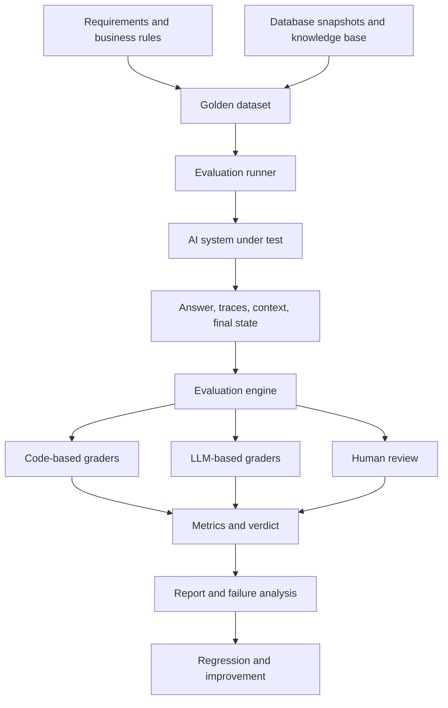
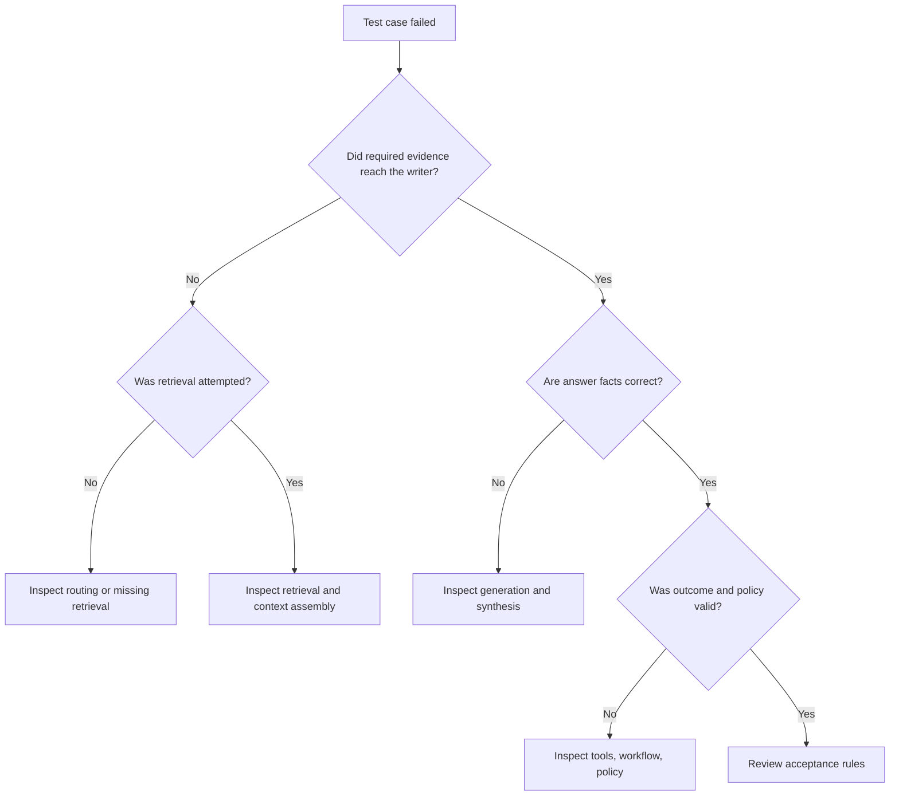

When an AI system has several moving parts, knowing whether its answer is right is only the beginning. We also need to know **where a failure happened, why it happened, and whether a new version is genuinely better**.

## 1. A passing test may not tell the whole story

Imagine an AI Assistant for a retail chain. A manager asks:

> "Why did revenue rise in August while profit fell? Analyze it and suggest what we should improve."

The system may delegate work. An Analytics Agent queries revenue, costs, and profit. A Knowledge Agent searches business documents and promotion policies. A Report Agent combines the results.

Now suppose the Assistant says:

> "August revenue rose 15%, but profit fell 25%. The main cause was a sharp rise in advertising costs, so the store should cut its advertising budget next month."

The numbers may be correct, but the evidence only shows that **total costs** increased. It does not establish that advertising was the main cause, nor that cutting that budget is the right intervention. A numerical grader might pass the answer. A grader checking unsupported claims should not.

This is common in real AI systems: **one part of a result can be correct while another part is not**.

In the previous articles, we [built a golden dataset](../building-ground-truth-for-ai-evaluation/) and [chose methods for evaluating Chatbots, RAG, and Agents](../evaluating-ai-systems-chatbot-rag-agents/). Here we connect those pieces into an *evaluation harness*: a repeatable process that runs cases, captures evidence, grades the relevant behavior, and helps explain failures. The goal is not to rebuild every existing evaluation framework.

## 2. Start with the product, not a framework

First identify what the product must do. Our retail Assistant has at least three task families:

| Task family | Example | What must be checked |
| :-- | :-- | :-- |
| Data analytics | Compare monthly revenue | Values, formulas, reporting periods |
| Knowledge Q&A | Answer policy questions | Evidence and factual correctness |
| Agent analysis | Explain changes and recommend action | Combined evidence, tool use, outcome |

One grading method cannot cover all three well. An LLM judge can assess whether a conclusion overreaches the evidence, but it should not be the only authority for a revenue calculation that code can verify. A numeric assertion can verify 15%, but cannot decide whether a business recommendation is properly supported.

Instead of building one supposedly all-knowing evaluator, use **specialized graders together**. That is the idea behind hybrid evaluation.

## 3. The shape of a hybrid evaluation harness

Four components are enough to describe the architecture:

1. **Golden dataset:** Reviewed test cases, expected facts, constraints, and source versions.
2. **Execution runner:** Sets up the test environment and runs each case against the AI system.
3. **Evaluation engine:** Applies the graders relevant to that case.
4. **Reporting and analysis:** Summarizes quality, diagnoses failures, and compares versions.



*Figure 1. Choose graders by task instead of forcing every case through one scoring mechanism.*

The harness need not know every internal detail of every Agent. It needs a clear interface to provide input, prepare a controlled environment, invoke the system, and collect artifacts: final answers, tool calls and arguments, retrieved evidence, the context actually sent to the writer model, final environment state, timing, usage, and errors.

Code graders can verify data and state. LLM judges can assess claims that require language understanding. Human review can handle important or ambiguous cases. This architecture only works, however, if the golden dataset states what each grader should check.

## 4. What should a realistic test case contain?

Return to the revenue-and-profit question. Freeze the test data:

| Measure | July | August |
| :-- | --: | --: |
| Revenue | VND 200 million | VND 230 million |
| Total costs | VND 160 million | VND 200 million |
| Profit | VND 40 million | VND 30 million |

These are fictional values, with profit simplified to revenue minus total costs. Code can verify that revenue rose **15%**, total costs rose **25%**, and profit fell **25%**. The data does *not* break down the cost increase by advertising, shipping, or cost of goods. Advertising therefore cannot be declared the principal cause from this evidence alone.

A golden case could look like this:

```json
{
  "id": "TC-SALES-001",
  "scenario": "business_analysis",
  "input": "Why did August revenue rise while profit fell?",
  "ground_truth": {
    "expected_facts": {
      "revenue_growth": 15.0,
      "cost_growth": 25.0,
      "profit_growth": -25.0
    },
    "source": "retail_snapshot_v1"
  },
  "expected_behavior": [
    "Explain the revenue and profit changes",
    "Use verified numerical facts",
    "Separate observations from hypotheses"
  ],
  "prohibited_behavior": [
    "Assert an unverified root cause"
  ]
}
```

This is illustrative, not a required schema. A case that uses a knowledge base may also need expected evidence IDs and policy versions. Those expectations must come from a source of truth **independent of what the system happened to retrieve**. Otherwise the system can effectively grade itself on the documents it selected, hiding retrieval failures.

Keep the database snapshot, document version, business-rule version, and grading rubric version where they can be recovered. Without them, the same case may mean something different next month.

## 5. What should the runner capture?

After receiving a case, the runner executes the AI system. Saving only the final answer loses crucial information. If the answer incorrectly says revenue rose 20%, did SQL return the wrong value? Did the Analytics Agent calculate the wrong ratio? Or did the Report Agent rewrite a correct result incorrectly?

An execution trace should capture enough to separate those possibilities:

| Artifact | Why it matters |
| :-- | :-- |
| Input and scenario | Identify the case and setup |
| Tool calls | Check tool choice and arguments |
| Tool results | See what data the system actually received |
| Retrieved candidates | Evaluate search and ranking |
| Writer context | See what actually reached generation |
| Final answer | Grade the user-facing result |
| Final environment state | Verify side effects and outcomes |
| Timing, usage, errors | Analyze cost, latency, and reliability |

For RAG, distinguish **retrieved candidates** from **writer context**. A retriever might return ten chunks, but reranking and context assembly may pass only five to the model. The first set tells us about retrieval. The second tells us whether generation had the necessary evidence. Citations in the final answer are not necessarily a complete record of everything the model saw.

[OpenAI's guide to Agent workflow evaluation](https://developers.openai.com/api/docs/guides/agent-evals) likewise emphasizes traces of model calls, tool calls, guardrails, and handoffs when debugging behavior. A good harness must say exactly **which artifact each metric is scoring**.

## 6. Design the evaluation engine around specialized graders

With the artifacts collected, we can grade the case using several complementary checks.

### 6.1. Deterministic graders

Code can check whether August revenue was VND 230 million, whether the growth rate was 15%, whether the SQL tool used the right month, whether structured output is valid, and whether prohibited actions occurred. For state-changing Agents, it can also inspect the actual final database or API state.

These checks are reproducible and do not spend LLM calls on questions with exact answers. But their rules must reflect the business definition of the task; a perfectly executed check of the wrong formula is still wrong.

### 6.2. Retrieval graders

For cases that require a knowledge base, we can measure whether expected evidence was found. Options include Recall@K, Precision@K, Hit Rate, or context-based metrics from [Ragas](https://docs.ragas.io/en/latest/concepts/metrics/available_metrics/).

Specify the conditions before computing them:

- Are we scoring retrieved candidates or writer context?
- What is K, and what counts as relevant: a document ID, a chunk ID, or its contents?
- How do duplicates count?
- What happens when no chunks are returned?
- Does this case require retrieval at all?

If retrieval was required and found nothing while expected evidence exists, recall is zero. If the task never required retrieval, the metric is **not applicable**, not a failure. A metric needs an applicability rule as well as a formula.

### 6.3. LLM-based graders

Consider the sentence: "Revenue rose 15% and profit fell 25% because advertising costs surged." The numeric grader can accept the percentages, but it cannot infer from the total-cost table that advertising caused the change.

An LLM judge can receive the question, answer, golden facts, and evidence to assess **faithfulness**, **factual correctness**, **answer relevancy**, and **completeness**. It should not guess at information already explicit in the trace. To check whether an API was called with the wrong argument, inspect the call itself. To judge whether a conclusion overreaches the evidence, an LLM can be useful if its rubric is clear and calibrated against expert judgments.

This division lets each grader do the work it handles best.

## 7. Turn scores into a useful diagnosis

An eval that says only `FAIL` leaves the developer with another investigation to start. A useful report narrows the likely stage of failure:



*Figure 2. A guide to investigation, not a mechanism that can prove the root cause of every failure.*

If the golden case requires two evidence sources but only one reaches the writer, investigate retrieval or context assembly. If both reach the writer but the answer is wrong, inspect generation, prompting, or synthesis. If the answer is correct but an unauthorized action occurred, inspect tool or workflow behavior.

The report can store a verdict and a concise diagnostic:

| Case | Verdict | Diagnostic |
| :-- | :-- | :-- |
| TC-SALES-001 | FAIL | Unsupported causal claim |
| TC-RAG-002 | FAIL | Required evidence not retrieved |
| TC-REPORT-003 | PASS | All mandatory conditions met |
| TC-TOOL-004 | ERROR | Evaluation runner timed out |

*Illustrative results, not real benchmark data.*

Distinguish application failures from harness failures. An Agent that chooses the wrong tool may deserve FAIL. If the judge service times out before producing a grade, we do not yet know whether the Agent passed; record an evaluation ERROR. A metric describes one dimension of quality. A verdict applies the predeclared acceptance rules; one mandatory violation can make a case fail even if other scores are high.

## 8. What should the report show?

One overall pass rate hides important differences. A system can excel at simple Q&A while repeatedly failing state-changing tasks. A useful evaluation report has three layers:

1. **Quality summary:** PASS, FAIL, ERROR, success rates, and important metrics by task family.
2. **Failure analysis:** Group suspected failures such as wrong retrieval, unsupported claims, bad tool arguments, and policy violations.
3. **Operational diagnostics:** Latency, token usage, cost, timeouts, retries, and other reliability signals.

State how ungradable cases are handled. If ERROR is excluded from the pass-rate denominator, show the ERROR count and rate separately. Otherwise an unreliable harness can make a version look better than it is. For nondeterministic Agents, run several trials on important tasks and report the variation.

Every run should retain enough to reproduce its conditions: dataset version, model, prompt, grader and rubric, tool configuration, and source-data snapshot. Outputs need not be byte-for-byte identical, but we should know whether a difference came from the version under test or from a changed environment.

## 9. Use the harness to compare versions

Suppose we replace a model or improve retrieval. Run the current and candidate versions against the same golden dataset, source snapshot, rubrics, and comparable environments. Then inspect several dimensions, not one headline score:

| Dimension | Question |
| :-- | :-- |
| Overall quality | Did more cases satisfy mandatory criteria? |
| Numerical correctness | Are calculations still accurate? |
| Retrieval quality | Is required evidence found more often? |
| Answer quality | Are unsupported claims less common? |
| Agent behavior | Are tool choices and actions safer? |
| Efficiency | Did latency or cost change materially? |

Better answers may cost twice as much time. A stronger reasoning model may choose the wrong tool more often. Release decisions need explicit product requirements, acceptable trade-offs, and non-negotiable regression limits.

A **regression suite** captures verified failures as cases so future changes do not reintroduce them. Keep adding new cases and independent holdout evaluations too. Optimizing only familiar cases can raise the score without improving general performance.

## 10. Must we build the entire framework ourselves?

Usually not. Existing tools cover much of the plumbing:

- [Ragas](https://docs.ragas.io/en/latest/concepts/metrics/available_metrics/) offers metrics for RAG, factual correctness, retrieval, and Agent-related tasks.
- [DeepEval](https://deepeval.com/docs/metrics-introduction) supports datasets and metrics, including LLM-judged and Agent-oriented checks.
- [LangSmith](https://docs.langchain.com/langsmith/evaluation-types) supports datasets, experiments, tracing, and offline and online evaluation.
- [Inspect AI](https://inspect.aisi.org.uk/tasks.html) organizes evaluations around datasets, solvers, and [scorers](https://inspect.aisi.org.uk/scorers.html), with tools for Agent tasks.
- [Promptfoo](https://www.promptfoo.dev/docs/configuration/expected-outputs/) supports test configuration, deterministic assertions, and model-graded checks.

None of these tools knows your company's definition of revenue, mandatory approval rules, or authoritative policy version automatically. Reuse frameworks for execution, tracing, datasets, and generic graders; add business-specific adapters and acceptance rules where they matter.

## 11. Principles worth keeping

**Do not let an LLM generate the ground truth and validate every result by itself.** Use independent databases, documents, and business rules for facts that can be verified.

**Score what the system actually used or did.** Separate retrieved candidates from writer context, and inspect tool calls and final state rather than reading only the final answer.

**Do not confuse a metric with acceptance.** Relevancy can be high while a required number is wrong or a policy is violated.

**Test the harness itself.** A broken grader, unstable environment, or stale ground truth can create persuasive but misleading results.

**Make findings actionable.** A retrieval failure should point us toward the index, filters, reranking, or context assembly. A generation failure despite good evidence points elsewhere. A report that only prints scores leaves much of the value of evaluation unused.

## 12. Evaluation becomes part of development

A useful evaluation harness starts with product requirements, trustworthy golden cases, a controlled runner, the right execution artifacts, and graders suited to each task. Code handles checkable facts and states. RAG needs retrieval and generation checks. Agents need traces and outcome checks. LLM judges can help with nuanced language, but require rubrics and expert calibration.

Together, these pieces do more than mark PASS or FAIL. They reveal where the system is weak, show the trade-offs between versions, and support changes with evidence.

**A good harness asks not only "Is the AI better?" but also "Better at what, at what cost, and do we have enough evidence to trust that conclusion?"**

That turns evaluation from a pre-release checkbox into an ongoing part of building a dependable AI system.

## References and further reading

1. [Anthropic - Demystifying Evals for AI Agents](https://www.anthropic.com/engineering/demystifying-evals-for-ai-agents) - tasks, trials, graders, outcomes, environments, and harness design.
2. [OpenAI - Evaluate Agent Workflows](https://developers.openai.com/api/docs/guides/agent-evals) - traces and graders for tool use, handoffs, and workflow behavior.
3. [LangSmith - Evaluation Types](https://docs.langchain.com/langsmith/evaluation-types) - offline, online, code-based, and model-based evaluation.
4. [Ragas - Available Evaluation Metrics](https://docs.ragas.io/en/latest/concepts/metrics/available_metrics/) - RAG, retrieval, factual-correctness, and Agent-related metrics.
5. [Inspect AI - Tasks](https://inspect.aisi.org.uk/tasks.html) and [Scorers](https://inspect.aisi.org.uk/scorers.html) - dataset, solver, scorer, and Agent evaluation concepts.
6. [Promptfoo - Assertions and Metrics](https://www.promptfoo.dev/docs/configuration/expected-outputs/) - deterministic assertions and model-graded checks.
7. [DeepEval - Evaluation Metrics](https://deepeval.com/docs/metrics-introduction) - metrics and LLM judges for GenAI applications.
