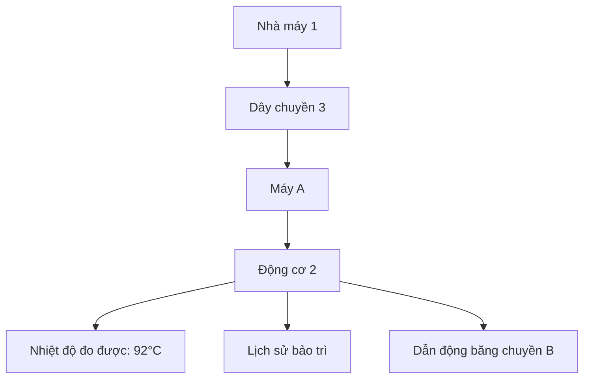
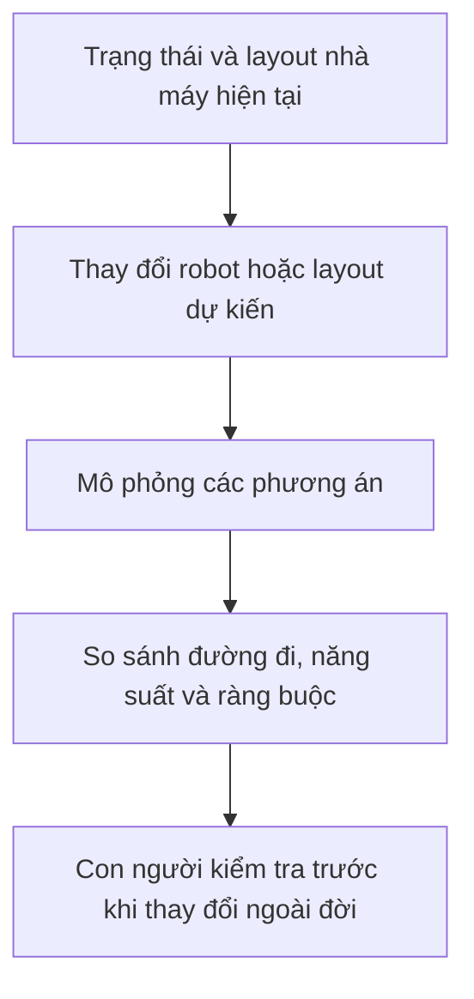
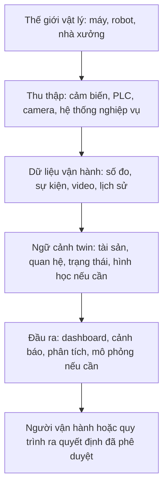

Một mô hình 3D có thể cho ta biết nhà máy trông như thế nào. Nhưng nếu muốn biết động cơ nào đang nóng lên, vì sao băng chuyền chạy chậm, hoặc chuyện gì có thể xảy ra khi chuyển robot sang lối đi khác thì sao?

Đó là bài toán **Digital Twin** có thể giúp giải quyết. Giá trị của nó không chỉ là dựng một nhà máy trông như thật trên màn hình, mà là kết nối một biểu diễn số hữu ích với **hệ thống thật và trạng thái luôn thay đổi của nó**.

Ở [bài trước về 3D Reconstruction](../3d-reconstruction-from-photos-vi/), chúng ta đi từ ảnh tới hình học 3D. Bài này hỏi tiếp: khi đã có một biểu diễn của thế giới vật lý, làm sao dùng nó để hiểu và ra quyết định về một hệ thống đang vận hành?

## 1. Một scene 3D rất đẹp vẫn có thể chỉ là mô hình

Hãy tưởng tượng một nhà máy ảo có máy móc, băng chuyền, robot và kệ hàng. Ta có thể xoay camera, phóng to và đo khoảng cách. Nhưng Motor 2 vừa nóng lên bất thường mà nhà máy ảo không cho biết gì. Băng chuyền thật đã dừng, còn trong scene nó vẫn chạy.

Scene đó thể hiện **hình dạng**, chứ chưa chắc phản ánh **hoạt động hiện tại**. Một file CAD, bản quét LiDAR hoặc scene 3D chân thực không tự động trở thành Digital Twin chỉ vì nó giống địa điểm thật.

Digital Twin chưa có một định nghĩa duy nhất được tất cả mọi người thống nhất. [NIST lưu ý](https://www.nist.gov/digital-twins/definitions-and-state-art) rằng các định nghĩa khác nhau, nhưng mối liên hệ với dữ liệu từ thế giới thật, vòng đời hệ thống và trao đổi dữ liệu là những đặc điểm thường được nhắc đến. Với một ví dụ thiên về vận hành, [AWS mô tả Digital Twin](https://docs.aws.amazon.com/iot-twinmaker/latest/guide/what-is-twinmaker.html) là biểu diễn số được cập nhật bằng dữ liệu để phản ánh cấu trúc, trạng thái và hành vi của hệ thống vật lý.

Có thể phân biệt thực dụng như sau:

| Biểu diễn | Có thể cho ta biết | Tự nó chưa đảm bảo |
| :-- | :-- | :-- |
| Mô hình 3D tĩnh | Thiết bị nằm đâu, trông ra sao | Thiết bị đang làm gì |
| Mô phỏng | Một kịch bản giả định có thể diễn ra thế nào | Có liên kết với một tài sản thật đang vận hành |
| Digital Twin | Một hệ thống thật được biểu diễn và cập nhật phục vụ mục đích cụ thể | Biết mọi thứ, có 3D, có AI hoặc tự động điều khiển |

Chúng không loại trừ nhau. Một twin có thể dùng 3D và mô phỏng, nhưng không bắt buộc phải có cả hai.

## 2. Mảnh ghép còn thiếu là ngữ cảnh

Giả sử một cảm biến báo **92°C**. Con số đó đứng riêng thì chưa nói lên nhiều điều. Nó đến từ máy nào? Bộ phận nào? 92°C có bất thường với động cơ này ở mức tải hiện tại không? Trước đó nhiệt độ thay đổi ra sao?

Một twin hữu ích nối dữ liệu với đúng thiết bị và quan hệ của chúng:

Con số trên chỉ để **minh họa**, không phải ngưỡng quá nhiệt chung cho mọi động cơ. Đội bảo trì phải đối chiếu với điều kiện vận hành và giới hạn của chính thiết bị đó.

Dữ liệu có thể đến từ cảm biến IoT hoặc PLC; vị trí đến từ robot; video từ camera; đơn hàng từ MES hoặc ERP; lịch sử sửa chữa từ phần mềm bảo trì. Không nhất thiết phải sao chép tất cả vào một cơ sở dữ liệu khổng lồ. Điều quan trọng là twin gắn được thông tin với đúng tài sản và quan hệ của chúng. [Mô hình entity và knowledge graph của AWS IoT TwinMaker](https://docs.aws.amazon.com/iot-twinmaker/latest/guide/tm-knowledge-graph.html) là một cách triển khai ý tưởng ấy.

Điều này đặc biệt hữu ích khi người vận hành trước đó phải tự ghép thông tin từ năm dashboard để hiểu một sự cố.

## 3. Khi nào cần nhìn dưới dạng 3D?

Hãy tưởng tượng động cơ đang có vấn đề được tô sáng đúng vị trí của nó, kèm đường đi của robot gần đó. Ngữ cảnh không gian giúp tìm thiết bị, kiểm tra lối đi bị chắn hoặc cân nhắc vị trí lắp băng chuyền mới.

Nhưng nếu chỉ cần theo dõi nhiệt độ và lịch sử bảo trì của một động cơ, sơ đồ quan hệ thiết bị cùng dashboard rõ ràng có thể đã đủ. Một nhà máy 3D quá chi tiết sẽ tăng chi phí mà chưa chắc cải thiện quyết định.

Hình học có thể đến từ CAD, BIM, LiDAR, dựng thủ công hoặc [3D Reconstruction từ ảnh](../3d-reconstruction-from-photos-vi/). Nếu đội kỹ thuật đã có bản CAD đáng tin, không cần dựng lại máy bằng AI chỉ để làm Digital Twin.

## 4. Từ trạng thái hiện tại đến lịch sử và dự đoán

Giả sử nhiệt độ của cùng động cơ tăng qua nhiều giờ: 65°C, 73°C, 84°C rồi 92°C. Một twin lưu được các lần đo cùng ngữ cảnh thiết bị không chỉ hiển thị con số mới nhất. Nó còn cho thấy **xu hướng**, mức tải, độ rung liên quan và lần bảo trì trước.

Phân tích dữ liệu có thể phát hiện bất thường. Một model dự đoán được phát triển và kiểm chứng riêng có thể ước lượng nguy cơ hỏng hoặc gợi ý kiểm tra thiết bị. Đây là một hướng của **predictive maintenance**, một use case sản xuất được [NIST đề cập](https://www.nist.gov/digital-twins).

Nhưng Digital Twin không tự biết lúc nào ổ trục sẽ hỏng. Dự đoán phụ thuộc vào cảm biến, chất lượng dữ liệu, model phù hợp và việc kiểm chứng trong môi trường vận hành thật. Một tỷ lệ rủi ro nghe rất chính xác mà thiếu những bước đó chỉ là con số trông có vẻ thuyết phục.

## 5. Câu hỏi "nếu như" cần một mô hình mô phỏng

Giờ nhà máy muốn lắp thêm robot. Thay vì đổi layout thật ngay, đội vận hành có thể thử vài vị trí trong nhà máy ảo. Robot có với tới nơi làm việc không? Nó có chắn lối đi không? Nút thắt năng suất sẽ chuyển sang đâu?

Twin cung cấp trạng thái và ngữ cảnh liên quan; **mô hình mô phỏng** ước lượng điều có thể xảy ra khi thay đổi. Mô phỏng cũng có thể tồn tại mà không có Digital Twin, kể cả khi nhà máy thật chưa được xây. Ngược lại, một twin phục vụ giám sát vẫn có thể rất hữu ích dù không mô phỏng gì.

Mô hình cần được hiệu chuẩn và kiểm chứng cho đúng câu hỏi. Robot ảo trông rất thật không chứng minh robot thật sẽ di chuyển an toàn hoặc đạt cycle time dự kiến. [Workflow Digital Twin cho nhà kho của NVIDIA](https://docs.omniverse.nvidia.com/digital-twins/latest/building-warehouse-digital-twins.html) là một ví dụ cụ thể về việc kết hợp 3D, mô phỏng vật lý, thử nghiệm hệ thống tự hành và dữ liệu ngoài đời.

## 6. Một kiến trúc tham khảo, không phải checklist bắt buộc

Có twin chỉ cần mô hình tài sản, trạng thái cảm biến và giao diện hiển thị. Có twin bổ sung hình học, dự báo, vật lý hoặc tối ưu hóa. Nên bắt đầu từ **quyết định cần hỗ trợ**, không phải danh sách công nghệ đang thịnh hành.

Đây cũng là điểm nối với [Physical AI](../what-is-physical-ai-vi/). Một nhà kho ảo có thể là nơi thử điều hướng robot hoặc tạo kịch bản huấn luyện. Tuy nhiên, scene 3D render đẹp không tự trở thành simulator đáng tin cho robot: hình học, động lực học, hành vi cảm biến và khoảng cách giữa mô phỏng với thực tế đều quan trọng.

## 7. Twin luôn là một bản lược bớt của thế giới thật

Không biểu diễn số nào quan sát được tất cả. Một con ốc lỏng, ống kính bám bụi hay chiếc hộp đặt sai chỗ có thể không xuất hiện trong twin nếu không cảm biến hoặc người vận hành nào ghi nhận. Các nguồn dữ liệu cũng có nhịp cập nhật khác nhau: vị trí robot có thể đổi nhiều lần mỗi giây, còn lịch sử bảo trì chỉ đổi khi có người ghi một lần sửa chữa.

Vì thế, "live" nên hiểu là **đủ mới cho quyết định đang cần**, không phải mọi trường đều cập nhật cùng tần suất. Twin có thể gây hiểu nhầm nếu timestamp đã cũ, cảm biến hỏng, mã thiết bị bị gán sai hoặc model giả định độ chính xác cao hơn dữ liệu đầu vào.

Một số thiết kế còn gửi quyết định đã được phê duyệt ngược về thiết bị vật lý. Đó là bước riêng, rủi ro cao hơn nhiều so với chỉ quan sát. Nếu hệ thống được phép đổi tốc độ băng chuyền hoặc quỹ đạo robot, nó cần phân quyền, thiết kế an toàn độc lập, kiểm chứng, cơ chế fail-safe và con người giám sát khi phù hợp. Bản thân Digital Twin không phải hệ thống đảm bảo an toàn.

## Hãy bắt đầu từ quyết định, không phải từ cái twin

Nếu một máy đã có màn hình trạng thái đủ tốt, xây scene 3D, knowledge graph và simulator vật lý chỉ để hiển thị lại ba con số ấy có lẽ là làm ra một dashboard rất đắt.

Digital Twin đáng giá hơn khi cần ghép nhiều nguồn dữ liệu, hiểu quan hệ giữa thiết bị, xem vấn đề trong không gian hoặc so sánh thay đổi trước khi động vào hệ thống thật. Độ chi tiết của nó nên **đủ cho quyết định cụ thể ấy**, không cần sao chép mọi ngóc ngách của thế giới.

Vì vậy, câu hỏi hay hơn "Chúng ta có dựng được nhà máy số không?" là: **"Quyết định nào sẽ tốt hơn nếu ta có một biểu diễn số hữu ích, luôn được cập nhật từ nhà máy thật?"**

## Nguồn tham khảo

- [Digital Twins: Definitions and State of the Art - NIST](https://www.nist.gov/digital-twins/definitions-and-state-art)
- [Digital Twins - NIST](https://www.nist.gov/digital-twins)
- [What is AWS IoT TwinMaker? - AWS](https://docs.aws.amazon.com/iot-twinmaker/latest/guide/what-is-twinmaker.html)
- [Knowledge Graph - AWS IoT TwinMaker](https://docs.aws.amazon.com/iot-twinmaker/latest/guide/tm-knowledge-graph.html)
- [Building Warehouse Digital Twins - NVIDIA Omniverse](https://docs.omniverse.nvidia.com/digital-twins/latest/building-warehouse-digital-twins.html)
