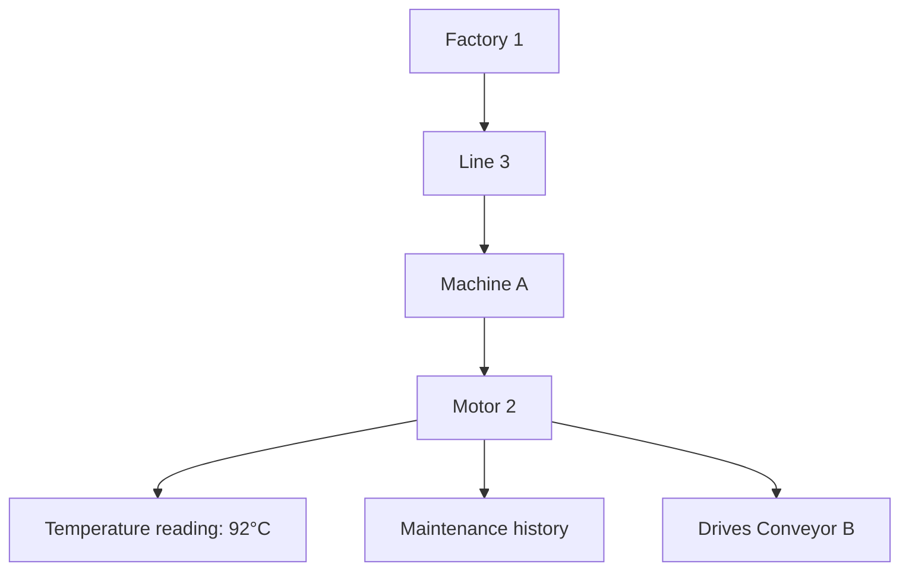
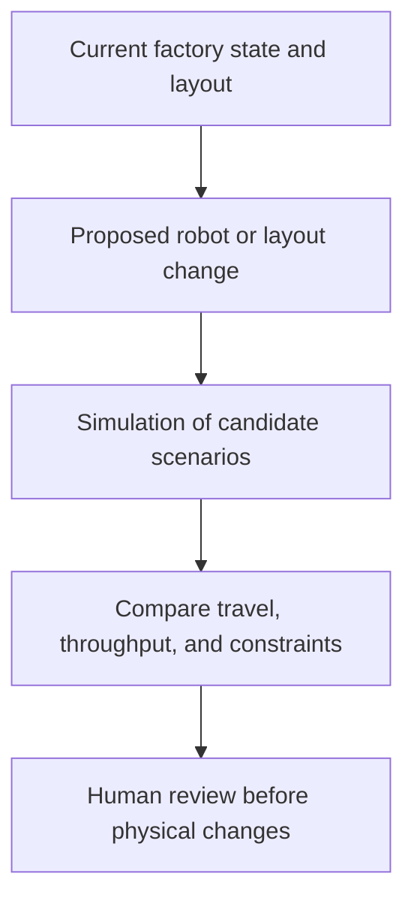
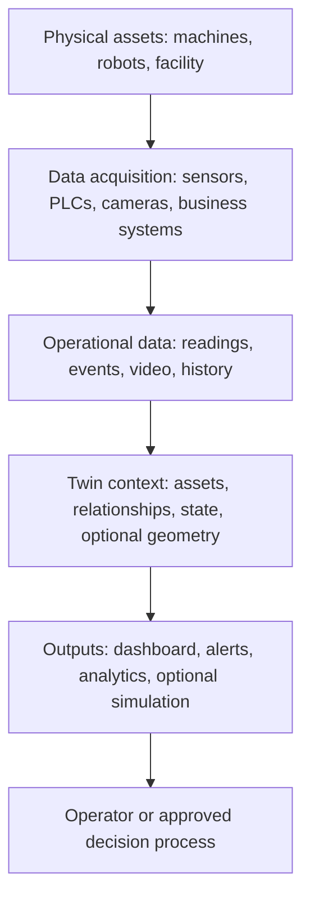

A 3D model can show us what a factory looks like. But what if we also need to know which motor is heating up, why a conveyor has slowed down, or what might happen if we move a robot to a different aisle?

That is the problem a **digital twin** can help with. Its value is not simply making the factory look real on a screen. It is connecting a useful digital representation to the **actual system and its changing state**.

In the [previous article on 3D reconstruction](../3d-reconstruction-from-photos/), we built geometry from images. Here, we ask a different question: once we have a representation of the physical world, how can it help us understand and make decisions about a system that keeps changing?

## 1. A beautiful 3D scene may still be just a model

Imagine a virtual factory with machines, conveyors, robots, and shelves. We can rotate the camera and measure distances. Yet Motor 2 has become unusually hot, and the virtual factory still shows nothing about it. The conveyor has stopped, but its digital counterpart keeps moving.

The scene represents **shape**, not necessarily the factory's **current operation**. A CAD file, a LiDAR scan, or a photorealistic scene does not become a digital twin just because it looks like the real place.

There is no single universally agreed definition of digital twin. [NIST notes](https://www.nist.gov/digital-twins/definitions-and-state-art) that definitions vary, while connections to real-world data, the system's lifecycle, and data exchange are recurring distinguishing features. For an operational example, [AWS describes a digital twin](https://docs.aws.amazon.com/iot-twinmaker/latest/guide/what-is-twinmaker.html) as a live digital representation updated with data about a physical system's structure, state, and behavior.

The practical distinction is this:

| Representation | What it can tell us | What it does not imply by itself |
| :-- | :-- | :-- |
| Static 3D model | Where equipment is and what it looks like | What the equipment is doing now |
| Simulation | What a modeled scenario might produce | A link to an operating physical asset |
| Digital twin | How a particular real system is represented and updated for a purpose | Perfect knowledge, 3D visuals, AI, or automatic control |

These are not mutually exclusive categories. A twin can use 3D and simulation, but neither is mandatory.

## 2. The missing ingredient is context

Suppose a sensor reports **92°C**. On its own, that number says little. Which machine produced it? Which component? Is 92°C unusual for this motor under its current load? What happened before the temperature rose?

A useful twin connects data to the right physical entities and relationships:

The number is an **illustration**, not a universal overheating threshold. A maintenance team must interpret it against that motor's operating conditions and limits.

Readings might come from IoT sensors or PLCs; positions from robots; video from cameras; production orders from MES or ERP; and repairs from maintenance software. The source systems need not all be copied into one giant database. What matters is that the twin can associate their information with the correct assets and relationships. [AWS IoT TwinMaker's entity and knowledge-graph model](https://docs.aws.amazon.com/iot-twinmaker/latest/guide/tm-knowledge-graph.html) is one implementation of that idea.

This is especially useful when operators would otherwise have to mentally join five dashboards to understand one incident.

## 3. When does the 3D view help?

Imagine an operator seeing the affected motor highlighted in its actual location, along with a nearby robot's route. Spatial context can make it easier to find equipment, inspect a blocked aisle, or assess where to place a new conveyor.

But if the task is simply to track one motor's temperature and service history, an asset graph and a clear dashboard may be enough. A highly detailed 3D factory would add cost without necessarily improving the decision.

Geometry can come from CAD, BIM, LiDAR, manual modeling, or [3D reconstruction from photos](../3d-reconstruction-from-photos/). There is no reason to reconstruct a machine from images if a reliable engineering model already exists.

## 4. From current state to history and prediction

Suppose the same motor's temperature readings rise over several hours: 65°C, 73°C, 84°C, then 92°C. A twin that retains the readings and their asset context can show more than the latest number: it can show a **trend**, the motor's workload, related vibration data, and previous maintenance.

Analytics may flag an anomaly. A separately developed and validated predictive model might estimate failure risk or recommend an inspection. This is one path toward **predictive maintenance**, a manufacturing use case discussed by [NIST](https://www.nist.gov/digital-twins).

But a twin does not automatically know when a bearing will fail. Its predictions depend on sensor coverage, data quality, a suitable model, and validation against the real operating environment. An impressive risk percentage without those checks is only an impressive-looking number.

## 5. What-if questions need a simulation model

Now suppose the factory wants to add a robot. Instead of immediately changing the physical layout, the team could test candidate positions in a virtual factory. Does the robot reach its work area? Could it obstruct an aisle? Where might the new bottleneck move?

The twin supplies relevant state and context; a **simulation model** estimates what could happen under each change. A simulation can also exist without a digital twin, even before a physical factory exists. Conversely, a useful monitoring twin may have no simulation at all.

The model must be calibrated and validated for the question being asked. A visually convincing virtual robot is not evidence that the real robot will move safely or achieve the predicted cycle time. [NVIDIA's warehouse digital-twin workflow](https://docs.omniverse.nvidia.com/digital-twins/latest/building-warehouse-digital-twins.html) illustrates how visualization, physics simulation, testing autonomous systems, and real-world data can be combined in one specific implementation.

## 6. A possible architecture, not a mandatory checklist

Some twins need only an asset model, sensor state, and visualization. Others add geometry, forecasting, physics, or optimization. The design should start with the **decision it must support**, not a list of fashionable components.

This also connects to [Physical AI](../what-is-physical-ai/). A virtual warehouse can be a place to test robot navigation or generate training scenarios. Yet a rendered warehouse is not automatically a trustworthy robot simulator: geometry, dynamics, sensor behavior, and the gap between simulation and reality all matter.

## 7. A twin is always incomplete

No digital representation sees everything. A loose screw, a dirty lens, or a misplaced box may be invisible unless some sensor or operator reports it. Different data sources also update at different rates: a robot's pose may change many times per second, while a maintenance record changes only when someone logs a repair.

"Live" should therefore mean **fresh enough for the intended decision**, not that every field updates at the same frequency. A twin can be misleading if timestamps are stale, sensors fail, equipment identifiers are wrong, or a model assumes more precision than its inputs justify.

Some designs send approved decisions back to physical equipment. That is a separate and much higher-risk step than monitoring. If a system may change conveyor speed or robot motion, it needs authorization, independent safety engineering, validation, fail-safe behavior, and human oversight where appropriate. A digital twin alone is not a safety system.

## Start with the decision, not the twin

If one machine already has a good status screen, building a 3D scene, knowledge graph, and physics simulator just to display the same three numbers would be an expensive dashboard.

A digital twin becomes more valuable when teams must combine many sources, understand relationships across a facility, inspect spatial problems, or compare changes before touching the physical system. Its fidelity should be **sufficient for that particular decision**, not an attempt to duplicate every detail of reality.

That is the difference between asking "Can we make a digital factory?" and asking **"Which decision will improve if we keep a useful digital representation connected to the real factory?"**

## References

- [Digital Twins: Definitions and State of the Art - NIST](https://www.nist.gov/digital-twins/definitions-and-state-art)
- [Digital Twins - NIST](https://www.nist.gov/digital-twins)
- [What is AWS IoT TwinMaker? - AWS](https://docs.aws.amazon.com/iot-twinmaker/latest/guide/what-is-twinmaker.html)
- [Knowledge Graph - AWS IoT TwinMaker](https://docs.aws.amazon.com/iot-twinmaker/latest/guide/tm-knowledge-graph.html)
- [Building Warehouse Digital Twins - NVIDIA Omniverse](https://docs.omniverse.nvidia.com/digital-twins/latest/building-warehouse-digital-twins.html)
