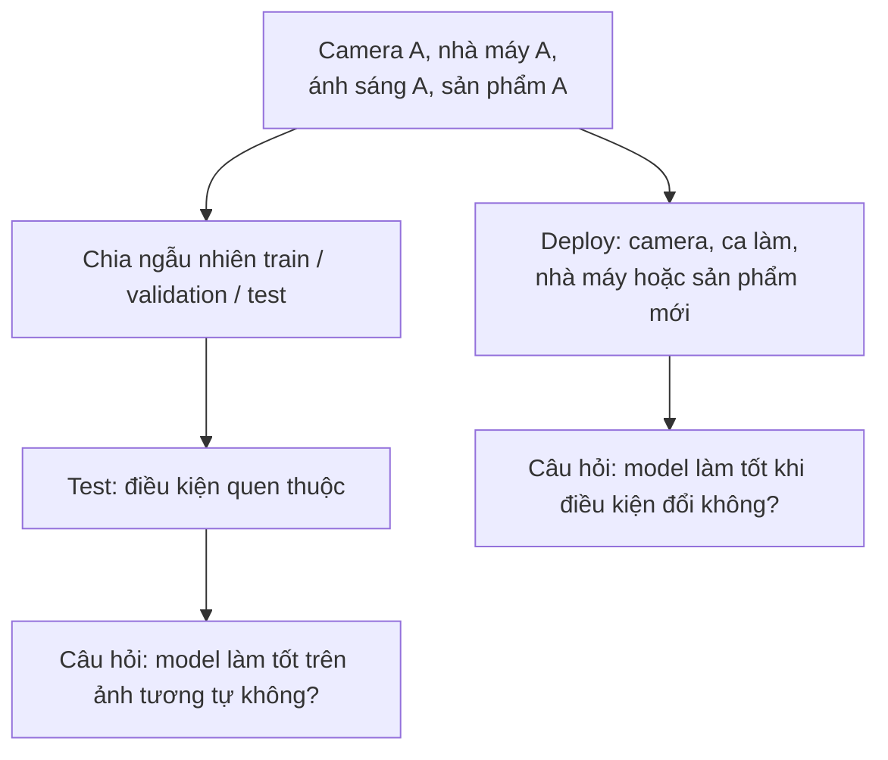
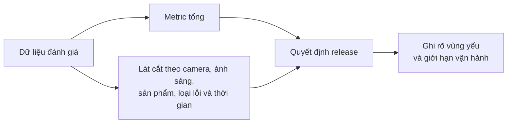
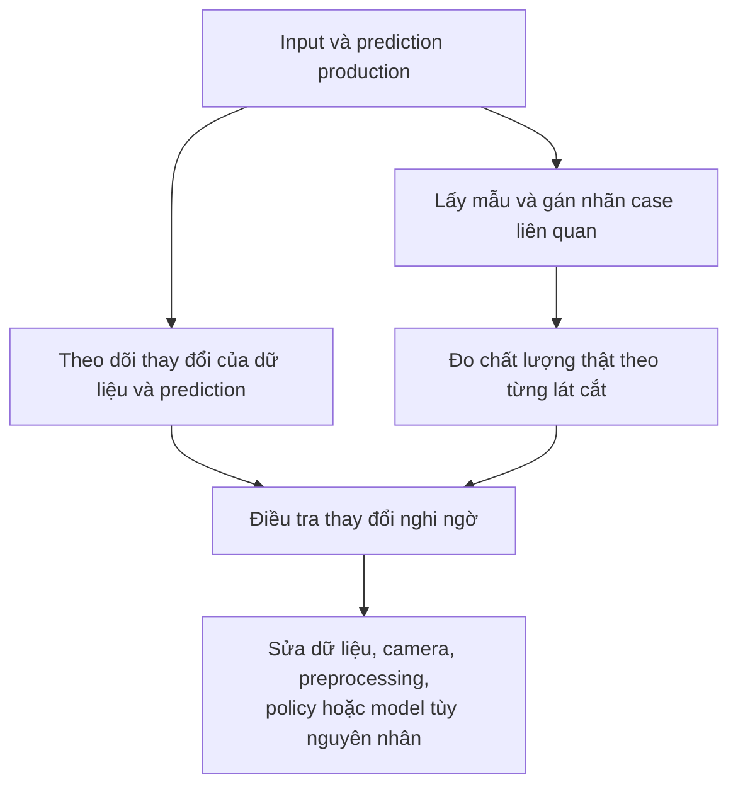

Một model có thể gần như hoàn hảo trên test set nhưng xuống production lại sai liên tục. Không nhất thiết vì model "dở đi". Có thể thế giới nó đang nhìn đã khác thế giới nó từng được học.

Hãy tưởng tượng một hệ thống phát hiện lỗi sản phẩm **giả định**. Trong giai đoạn phát triển, camera cố định, ánh sáng ổn định, lens sạch và mọi sản phẩm cùng một dòng. Model đạt **99,1% accuracy** trên test set đã giữ lại. Ba tuần sau khi deploy, một mẫu dữ liệu production được gán nhãn cho thấy accuracy chỉ còn khoảng **84%**. Không ai đổi architecture hay weights.

Điều gì đã đổi? Ca sáng có ánh nắng lọt vào; ca tối dùng đèn khác. Camera rung nhẹ, lens bám bụi, một phiên bản sản phẩm mới xuất hiện, và đôi khi operator che khuất một phần khung hình.

Đây là lúc **distribution shift**, **domain shift** và **robustness** trở thành vấn đề rất thực tế.

[Bài Edge AI trước](../edge-ai-models-on-device-vi/) hỏi model có chạy được trong giới hạn thiết bị không. Bài này hỏi một câu khác: **khi điều kiện thay đổi, model còn nhận ra thế giới đúng không?**

## 1. "Model đạt 99%" là một câu chưa đủ

Cách nói đầy đủ hơn là: **"Model đạt 99% trên test set này, được thu trong những điều kiện này, với metric này."** Chia ngẫu nhiên ảnh từ một camera có thể tạo ra test set độc lập về sample, nhưng nó vẫn đo trên ảnh rất giống dữ liệu train.

Cả hai câu hỏi đều cần, nhưng chúng **không giống nhau**. [NIST AI Risk Management Framework](https://airc.nist.gov/airmf-resources/airmf/3-sec-characteristics/) khuyến nghị đánh giá accuracy bằng test set thực tế, đại diện cho điều kiện sử dụng dự kiến, kèm thông tin về cách test.

Ta có thể ký hiệu phân phối dữ liệu train là `P_train(x, y)`, còn dữ liệu production là `P_prod(x, y)`. **Distribution shift** theo nghĩa rộng xảy ra khi hai phân phối này khác nhau theo cách đáng quan tâm. Điều đó không bảo đảm performance sẽ giảm, nhưng làm giả định "điểm test quen thuộc sẽ giữ nguyên" trở nên kém chắc chắn.

Cách dùng thuật ngữ có thể khác nhau giữa các lĩnh vực. Trong thực hành, **domain shift** thường chỉ sự đổi môi trường, chẳng hạn từ nhà máy A sang B hoặc từ đường nắng sang đường tuyết. **Data drift** thường nhấn mạnh việc input production thay đổi theo thời gian, chẳng hạn tỷ lệ một phiên bản sản phẩm mới tăng dần. Đây là những cách mô tả hữu ích, không phải các ô cứng mà mọi lỗi đều phải nằm gọn bên trong.

[Nghiên cứu WILDS](https://proceedings.mlr.press/v139/koh21a.html) đánh giá distribution shift ngoài đời qua các bối cảnh như camera bẫy ảnh, bệnh viện, vùng địa lý và thời gian. Môi trường thay đổi là chuyện thường gặp ở production, không phải một corner case lạ.

## 2. Model có thể học nhầm tín hiệu mà vẫn đạt điểm cao

Giả sử đa số sản phẩm lỗi trong tập train được chụp dưới ánh sáng mạnh, còn sản phẩm bình thường chủ yếu nằm trong ảnh tối hơn. Model có thể học **sáng → lỗi**, thay vì **vết hỏng bề mặt → lỗi**. Test set chia ngẫu nhiên từ cùng dữ liệu vẫn giữ tương quan ấy, nên điểm số cao. Sang môi trường ánh sáng khác, tín hiệu tắt đi và model bắt đầu sai.

Đó là **shortcut learning**: model dùng một tín hiệu giúp dự đoán tốt ở môi trường train/test nhưng không phải quan hệ mà ta muốn nó dựa vào. [Geirhos và cộng sự](https://www.nature.com/articles/s42256-020-00257-z) phân tích những decision rule kiểu này có thể thành công trên benchmark quen thuộc rồi thất bại khi điều kiện đổi.

Ví dụ dễ hình dung là model nhận diện bò thường thấy bò trên đồng cỏ. Nếu nó lấy "nền xanh" làm dấu hiệu, nó có thể lúng túng trước con bò trong chuồng hoặc nhầm ngựa trên đồng cỏ. Đây là ví dụ minh họa, **không phải** khẳng định mọi model nhận diện bò đều làm vậy. Câu hỏi kỹ thuật là: **model thật sự dựa vào bằng chứng nào?**

## 3. Chia test set theo đúng ranh giới production phải vượt qua

Nếu sản phẩm sẽ chạy trên camera chưa từng thấy, hãy giữ nguyên một camera làm test. Nếu chuyển giữa nhiều nhà máy, hãy giữ lại một nhà máy. Nếu muốn biết model có dùng được quý sau không, hãy test trên giai đoạn muộn hơn. Với video, nên nhóm các frame liền kề hoặc cùng phiên quay để ảnh gần như giống hệt không nằm ở cả train lẫn test.

| Câu hỏi khi deploy | Cách giữ dữ liệu để test phù hợp hơn |
| --- | --- |
| Chạy được trên camera mới không? | Train bằng camera A-C; test trên D. |
| Chạy được ở địa điểm khác không? | Train ở nhà máy A; test ở B. |
| Chạy được mùa sau không? | Train bằng dữ liệu cũ; test bằng dữ liệu mới hơn. |
| Chạy được với phiên bản sản phẩm mới không? | Giữ riêng phiên bản đó làm bài test thử thách. |

WILDS gọi một setup liên quan là **domain generalization**: train và test thuộc những domain tách biệt, để đo khả năng chuyển sang domain chưa gặp khi train. Random split vẫn hữu ích trong phát triển thông thường. Holdout mô phỏng deployment trả lời một câu hỏi khác, khó hơn.

## 4. Trung bình cao có thể che đúng chỗ hệ thống đang yếu

Giả sử một bộ test **giả định** có 9.500 ảnh ban ngày đạt 99% accuracy và 500 ảnh ban đêm chỉ đạt 62%. Accuracy chung vẫn khoảng **97,2%**. Con số tổng trông đẹp, nhưng nếu hệ thống dùng để giám sát ca đêm thì nó yếu đúng ở nơi quan trọng nhất.

Hãy đánh giá theo những lát cắt gắn với điều kiện thật: camera, địa điểm, ánh sáng, phiên bản sản phẩm, loại lỗi, mức che khuất, thời tiết hoặc ca làm. Với mỗi lát cắt, cần xem cả số lượng mẫu và metric phù hợp. Bài toán phát hiện lỗi hiếm không thể chỉ nhìn overall accuracy: bỏ sót lỗi và báo động nhầm có thể mang hậu quả rất khác nhau.

Mục tiêu không phải dashboard thật nhiều số, mà là thông tin có thể hành động, ví dụ: **"Model giảm chất lượng với sản phẩm B, camera D và ánh sáng yếu."**

## 5. Augmentation mở rộng trải nghiệm, không tạo được mọi tương lai

Nếu dữ liệu train chỉ có ảnh sáng, thay đổi brightness, contrast, blur, noise hoặc crop một cách có chọn lọc có thể giúp model gặp nhiều biến thể hơn. Nhưng augmentation phải giữ nguyên ý nghĩa nhãn và giống điều kiện có thể xuất hiện khi deploy. Xoay ảnh 180 độ có thể hợp với ảnh vệ tinh, nhưng vô nghĩa nếu sản phẩm trên dây chuyền luôn đứng thẳng. Color jitter quá mạnh cũng có thể xóa mất lỗi vốn được nhận ra bằng màu.

Trong robotics, **domain randomization** đi xa hơn: thay đổi ánh sáng, góc camera, texture, vị trí vật, nhiễu cảm biến, ma sát hoặc khối lượng giữa các lần mô phỏng. Một [bài tổng quan nghiên cứu robot](https://www.frontiersin.org/journals/robotics-and-ai/articles/10.3389/frobt.2022.799893/full) mô tả các biến này cùng khoảng cách sim-to-real. Randomization có thể giảm phụ thuộc vào một simulator cố định; nó **không chứng minh** mọi tình huống ngoài đời đã được bao phủ.

Câu hỏi thực tế không phải "Đã augmentation chưa?", mà là **"Model đã thấy những biến thể thật sự sẽ gặp, mà nhãn vẫn còn đúng, hay chưa?"**

## 6. Theo dõi drift không đồng nghĩa với đo accuracy

Sau deploy, ta có thể quan sát dữ liệu đầu vào và hành vi model: brightness, resolution, camera ID, embedding, tần suất từng class, confidence hoặc tỷ lệ từ chối dự đoán. Nếu tỷ lệ dự đoán lỗi đột ngột tăng từ 5% lên 28%, có điều đáng kiểm tra. Nhà máy có thể thật sự phát sinh nhiều lỗi hơn; cũng có thể input hoặc hành vi model đã đổi.

**Tín hiệu drift là manh mối, không phải bằng chứng model sai.** Confidence cũng có thể gây hiểu lầm khi input lạ. Để đo accuracy production, ta vẫn cần một lượng nhãn đáng tin: lấy mẫu, cho người đánh giá, so prediction với kết quả thật, rồi xem metric theo từng lát cắt. Với ứng dụng rủi ro cao, cách lấy mẫu phải bao phủ cả trường hợp hiếm hoặc nguy hiểm, không chỉ chọn ngẫu nhiên 1%.

[Rules of Machine Learning của Google](https://developers.google.com/machine-learning/guides/rules-of-ml/) còn nhấn mạnh **training-serving skew**: khác biệt trong dữ liệu hoặc preprocessing giữa lúc train và lúc inference thật có thể làm chất lượng giảm. Vì vậy cần theo dõi cả pipeline, không chỉ thế giới bên ngoài.

Một service có thể vẫn chạy khỏe, rất nhanh, nhưng dự đoán sai. Giám sát hạ tầng và giám sát chất lượng model trả lời hai câu hỏi khác nhau.

## 7. Đừng retrain trước khi tìm nguyên nhân

Lens bẩn thì nên lau lens. Camera mới có white balance khác có thể cần calibration hoặc sửa preprocessing. Xuất hiện phiên bản sản phẩm mới thì có thể cần ảnh mới được gán nhãn. Nếu model bám vào background, cần xem lại cách tuyển chọn dữ liệu và cách chia test; thêm thật nhiều ảnh chứa cùng shortcut chưa chắc giải quyết được.

Retrain là **một** cách can thiệp, không phải phản xạ mặc định khi performance giảm. Hãy xác định điều kiện đã đổi, chọn cách sửa phù hợp, rồi đánh giá lại cả điều kiện mới **lẫn điều kiện cũ** trước rollout. Những thất bại production nên quay về dataset có phiên bản và quy trình evaluation có thể chạy lại.

## 8. Xác định điều kiện hệ thống có thể xử lý

Không thể kỳ vọng model thị giác hoạt động ở mọi nơi, mãi mãi. Hãy mô tả **phạm vi vận hành**: camera nào được hỗ trợ, khoảng ánh sáng nào, phiên bản sản phẩm nào, mức che khuất nào. Test theo ma trận đó. Khi input nằm ngoài phạm vi, hệ thống cần phản ứng rõ ràng: từ chối dự đoán, nhờ người kiểm tra, dừng quy trình nếu phù hợp, hoặc chuyển sang cách an toàn hơn.

Một ảnh bị che kín ống kính không có bằng chứng thị giác để phân loại. Ép model trả lời thật tự tin trong tình huống ấy không phải robustness. Hệ thống production vững hơn là hệ thống hoạt động đủ tốt trong điều kiện đã công bố **và biết xử lý khi điều kiện đó không còn đúng**. [NIST AI RMF](https://airc.nist.gov/airmf-resources/airmf/5-sec-core/) nhấn mạnh đo performance trong điều kiện tương tự deployment và ghi rõ giới hạn hệ thống.

## Test set không sai; giả định của chúng ta chưa đủ

Điểm 99,1% trong ví dụ lab vẫn hữu ích. Sai lầm là xem nó như lời hứa rằng dữ liệu tương lai sẽ luôn giống ảnh trong lab. Production cho thấy camera, ánh sáng, sản phẩm và thời gian đều có thể đổi.

Vì vậy production ML cần một vòng lặp: đánh giá theo nhiều điều kiện, triển khai trong giới hạn đã biết, theo dõi thay đổi, gán nhãn lỗi, cập nhật dataset hoặc hệ thống, rồi đánh giá lại. Câu hỏi quan trọng không chỉ là **"Model đúng bao nhiêu trên test set?"** mà là **"Hệ thống còn làm tốt đến đâu khi thế giới thay đổi?"**

## Nguồn tham khảo

- [AI Risks and Trustworthiness - NIST AI Risk Management Framework](https://airc.nist.gov/airmf-resources/airmf/3-sec-characteristics/)
- [AI RMF Core: Measure - NIST](https://airc.nist.gov/airmf-resources/airmf/5-sec-core/)
- [WILDS: A Benchmark of in-the-Wild Distribution Shifts - ICML/PMLR](https://proceedings.mlr.press/v139/koh21a.html)
- [Shortcut learning in deep neural networks - Nature Machine Intelligence](https://www.nature.com/articles/s42256-020-00257-z)
- [Rules of Machine Learning - Google for Developers](https://developers.google.com/machine-learning/guides/rules-of-ml/)
- [Robot Learning From Randomized Simulations: A Review - Frontiers in Robotics and AI](https://www.frontiersin.org/journals/robotics-and-ai/articles/10.3389/frobt.2022.799893/full)
