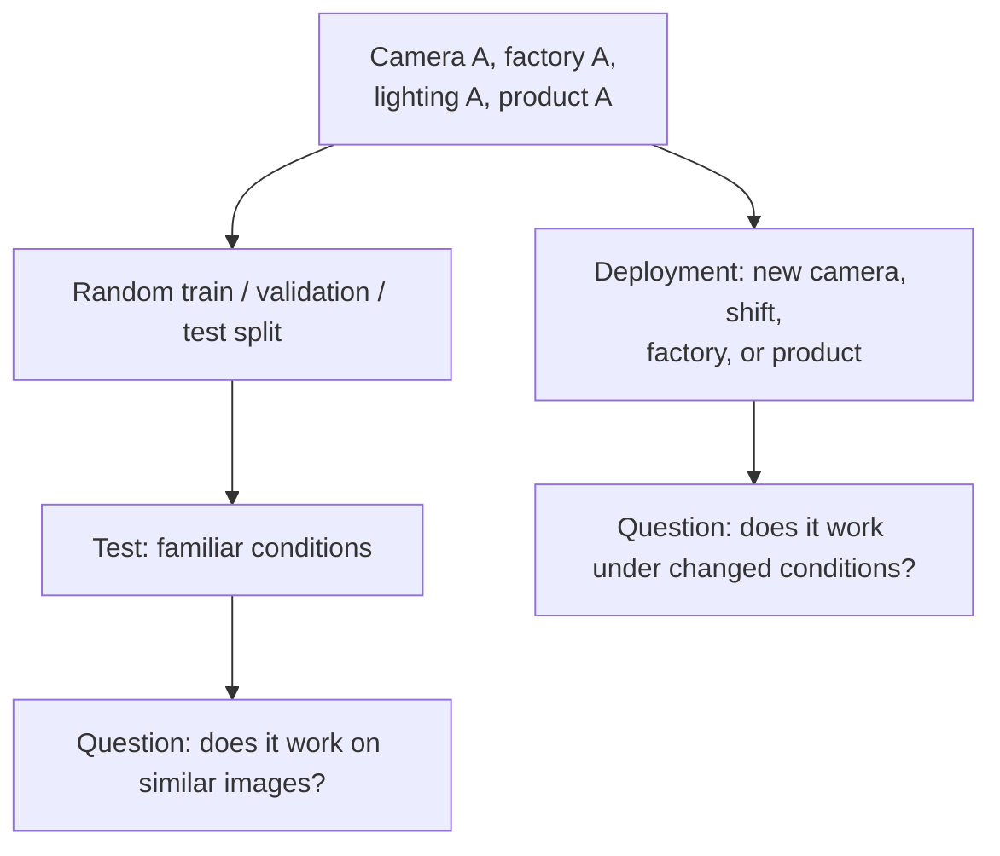
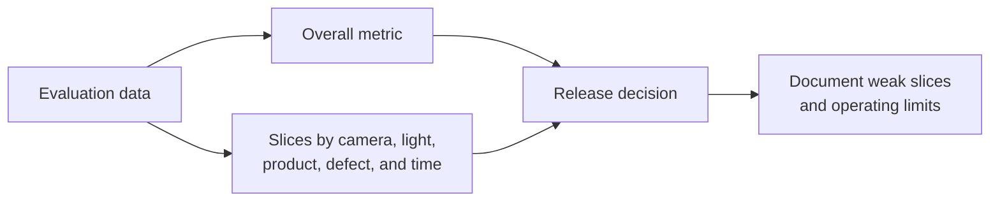
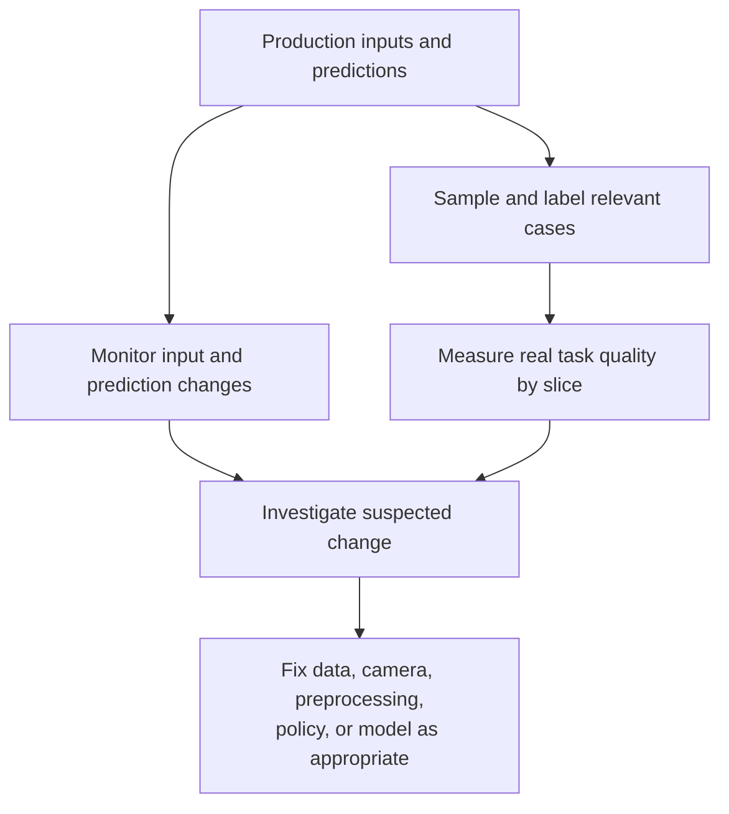

A model can look nearly perfect on its test set and still make frequent mistakes in production. It has not necessarily become a worse model. The world it sees may no longer resemble the world it learned from.

Imagine a hypothetical factory defect detector. During development, the camera is fixed, lighting is stable, the lens is clean, and every product comes from the same line. It scores **99.1% accuracy** on a held-out test set. Three weeks after deployment, a newly labeled production sample suggests accuracy closer to **84%**. No one changed the architecture or weights.

What changed? Daylight reaches the morning shift; the night shift uses different lamps. A camera vibrates, its lens collects dust, a new product variant arrives, and operators occasionally occlude part of the frame.

That is where **distribution shift**, **domain shift**, and **robustness** stop being abstract research terms.

The [previous Edge AI article](../edge-ai-models-on-device/) asked whether a model could run within device limits. This article asks a different question: **will it still recognize the world correctly after those conditions change?**

## 1. "99% accurate" is an incomplete sentence

The complete claim is closer to: **"99% accurate on this test set, collected under these conditions, with this metric."** A random split of images from one camera can produce a valid held-out test set, yet still measure performance on images very similar to training.

Both questions matter. They are not the same question. [NIST's AI Risk Management Framework](https://airc.nist.gov/airmf-resources/airmf/3-sec-characteristics/) says accuracy measurements should be paired with realistic test sets representative of expected use and documented test methods.

For an image and its label, we can write the training distribution as `P_train(x, y)` and the production distribution as `P_prod(x, y)`. **Distribution shift** broadly means these differ in a relevant way. It does not guarantee a performance drop, but it weakens the assumption that a familiar-test score will transfer unchanged.

Terminology varies between fields. In practice, **domain shift** often refers to a change of environment, such as factory A to factory B or sunny roads to snowy roads. **Data drift** often emphasizes change over time in production inputs, such as a growing share of a new product. These are useful descriptions, not boxes every failure must fit into.

The [WILDS benchmark paper](https://proceedings.mlr.press/v139/koh21a.html) studies real-world distribution shifts across settings such as camera traps, hospitals, regions, and time periods. A changing environment is normal in production, not an exotic edge case.

## 2. A model can learn the wrong clue and still ace the test

Suppose most defective items in training were photographed under bright light, while normal items were mostly photographed in dimmer conditions. The model may learn **brightness → defect**, not **surface damage → defect**. A random test split from the same data preserves that correlation, so the score stays high. New lighting in production breaks the shortcut.

This is **shortcut learning**: a model uses a predictive signal that works in the training/test environment but is not the relationship we want it to rely on. [Geirhos and colleagues](https://www.nature.com/articles/s42256-020-00257-z) discuss how such decision rules can succeed on familiar benchmarks and fail under different conditions.

The classic mental example is a cow classifier that sees cows mostly on grass. If "green field" becomes its clue, it may struggle with a cow indoors or confuse a horse on grass. That is an illustration, not a claim that every cow classifier behaves this way. The engineering question is: **what evidence is the model actually using?**

## 3. Split data across the boundary deployment must cross

If the product will run on an unseen camera, reserve an entire camera for testing. If it will move between factories, hold out a factory. If next quarter matters, test on a later time period. With video, group adjacent frames or capture sessions so nearly identical images do not land on both sides of the split.

| Deployment question | More relevant holdout |
| --- | --- |
| Will it work on a new camera? | Train on cameras A-C; test on D. |
| Will it work at another site? | Train on site A; test on site B. |
| Will it work next season? | Train on earlier periods; test on later ones. |
| Will it work on a new product variant? | Reserve that variant for an explicit challenge test. |

WILDS calls one related setup **domain generalization**: train and test contain distinct domains so we can measure transfer to a domain not seen during training. A random split is still useful for ordinary development. A deployment-style holdout answers a harder, different question.

## 4. An average can conceal the failure that matters

Suppose a hypothetical test has 9,500 daytime images at 99% accuracy and 500 nighttime images at 62%. Overall accuracy is still about **97.2%**. That aggregate looks strong, but a system intended to monitor the night shift is doing poorly precisely where it is needed.

Evaluate slices that map to real operating conditions: camera, site, lighting, product version, defect type, occlusion, weather, or shift. For each slice, check sample size and the metrics relevant to the task. A rare-defect detector needs more than overall accuracy: missed defects and false alarms may have very different costs.

The goal is not a dashboard full of numbers. It is actionable information, such as **"performance drops for product B with camera D under low light."**

## 5. Augmentation can widen experience, not invent every future

If training images cover only bright conditions, carefully chosen changes to brightness, contrast, blur, noise, or crop can expose the model to more variation. But augmentation must preserve the label and resemble plausible deployment conditions. A 180-degree rotation may be reasonable for satellite imagery but nonsensical for a product that always travels upright. Aggressive color jitter could erase a color-based defect.

For robots trained in simulation, **domain randomization** extends the idea: vary lighting, camera pose, textures, object positions, sensor noise, friction, or mass across simulated runs. A [robotics review](https://www.frontiersin.org/journals/robotics-and-ai/articles/10.3389/frobt.2022.799893/full) describes these variables and the sim-to-real gap. Randomization can reduce dependence on one simulation setting; it cannot prove the real world lies inside the range simulated.

The practical question is not "Did we augment the data?" but **"Did we expose the model to the variations it will actually face without changing what the labels mean?"**

## 6. Monitoring drift is not the same as measuring accuracy

After deployment, we can monitor input properties and model behavior: brightness, resolution, camera identity, embeddings, class frequencies, confidence, and rejection rates. If defect predictions suddenly jump from 5% to 28%, something deserves investigation. The factory might truly have more defects, or the input/model behavior might have shifted.

**A drift signal is a clue, not proof of model error.** Confidence can also be misleading when inputs are unfamiliar. To measure production accuracy, we need some reliable labels: sample cases, review them, compare predictions with outcomes, and track metrics by slice. In high-stakes settings, sampling must cover rare or risky cases, not only a random 1%.

[Google's Rules of Machine Learning](https://developers.google.com/machine-learning/guides/rules-of-ml/) also highlights **training-serving skew**: differences in data or preprocessing between training and live inference can hurt performance. Monitor the pipeline as well as the outside world.

A service can be healthy, fast, and completely wrong. Infrastructure monitoring and model-quality monitoring answer different questions.

## 7. Do not retrain before finding the cause

If a lens is dirty, clean it. If a new camera has different white balance, calibration or preprocessing may help. If a new product variant has appeared, new labeled examples may be needed. If the model relies on background cues, curate the dataset and evaluation split; more examples with the same shortcut may not solve it.

Retraining is one possible intervention, not the default reaction to every performance drop. Diagnose the changed condition, choose a fix, then re-evaluate both the new condition and old ones before rollout. Production failures should flow back into a versioned dataset and a repeatable evaluation process.

## 8. Define the conditions the system can handle

No vision model should be expected to work everywhere, forever. Specify an **operating envelope**: supported camera types, lighting range, product versions, and levels of occlusion. Test across that matrix. When inputs fall outside it, the system should have an explicit response: reject the prediction, request human review, stop a process when appropriate, or fall back to a safer method.

An image with a fully covered lens contains no visual evidence. Forcing a confident prediction is not robustness. A robust production system works sufficiently well across documented conditions **and knows how to respond when those conditions are not met**. [NIST's AI RMF](https://airc.nist.gov/airmf-resources/airmf/5-sec-core/) emphasizes measuring performance under conditions similar to deployment and documenting system limits.

## The test set was not wrong; the assumption was incomplete

The hypothetical 99.1% lab score was useful. The mistake was treating it as a promise that future data would resemble that lab's images. Production showed that camera, lighting, product, and time can all move.

Production ML therefore needs a loop: evaluate across conditions, deploy within known limits, monitor changes, label failures, update the dataset or system, and evaluate again. The meaningful question is not just **"How accurate is this model on our test set?"** It is **"How well does the system hold up when the world changes?"**

## References

- [AI Risks and Trustworthiness - NIST AI Risk Management Framework](https://airc.nist.gov/airmf-resources/airmf/3-sec-characteristics/)
- [AI RMF Core: Measure - NIST](https://airc.nist.gov/airmf-resources/airmf/5-sec-core/)
- [WILDS: A Benchmark of in-the-Wild Distribution Shifts - ICML/PMLR](https://proceedings.mlr.press/v139/koh21a.html)
- [Shortcut learning in deep neural networks - Nature Machine Intelligence](https://www.nature.com/articles/s42256-020-00257-z)
- [Rules of Machine Learning - Google for Developers](https://developers.google.com/machine-learning/guides/rules-of-ml/)
- [Robot Learning From Randomized Simulations: A Review - Frontiers in Robotics and AI](https://www.frontiersin.org/journals/robotics-and-ai/articles/10.3389/frobt.2022.799893/full)
