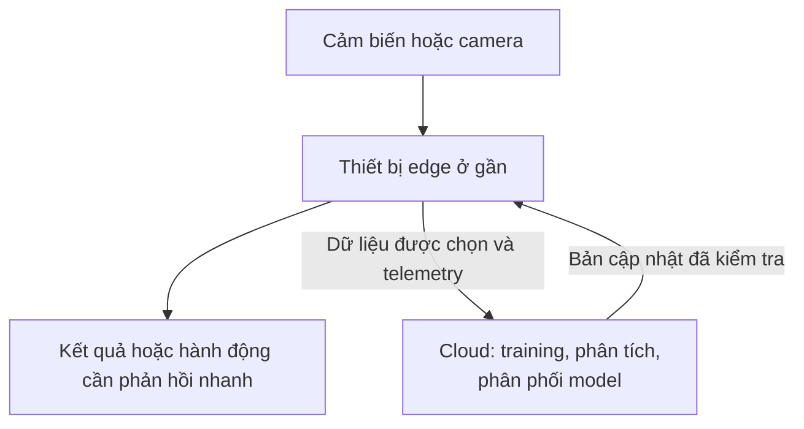
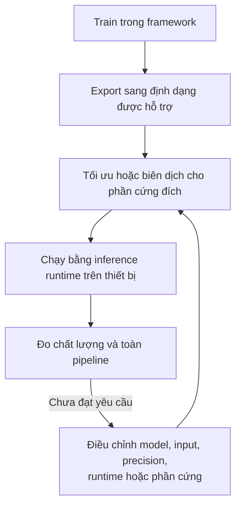
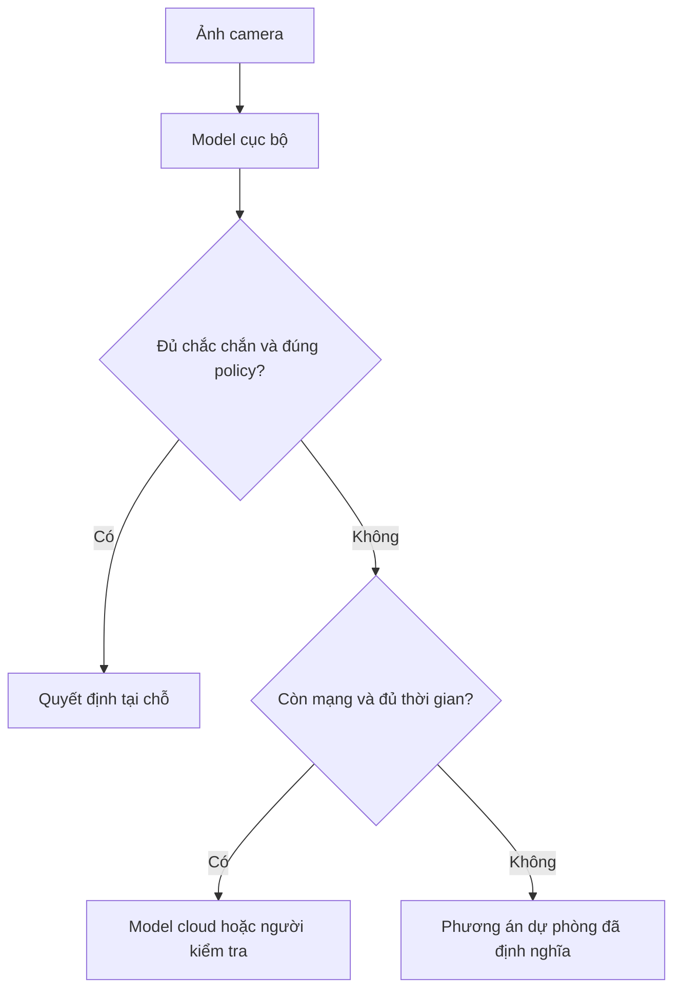

Một model có thể đạt accuracy rất cao trên GPU server nhưng vẫn không phù hợp để chạy trên camera, drone hay robot. Edge AI bắt đầu từ chính khoảng cách đó: làm sao giữ đủ chất lượng trong khi phải sống với giới hạn thật về latency, memory, điện năng và nhiệt?

Giả sử bạn train một model phát hiện lỗi sản phẩm trên workstation. Demo chạy rất đẹp. Đưa model xuống camera công nghiệp, inference bỗng chậm, RAM thiếu và thiết bị nóng lên. Task không đổi, nhưng **môi trường triển khai** đã đổi.

## 1. Điều gì được đưa xuống edge?

Với Edge AI, một phần inference diễn ra gần nơi dữ liệu được tạo ra, thay vì phụ thuộc hoàn toàn vào datacenter ở xa. "Edge" có thể là camera thông minh, điện thoại, industrial PC, máy tính trên robot hoặc gateway tại chỗ. Nó không nhất thiết là một thiết bị bé hay yếu.

Cloud vẫn quan trọng: train model lớn, phân tích dữ liệu tổng hợp và phân phối bản cập nhật. Câu hỏi kiến trúc là **quyết định nào phải xảy ra tại chỗ**, nhất là khi mạng chậm hoặc mất kết nối.

Với robot, inference cục bộ có thể giảm phụ thuộc vào chuyến đi-về qua cloud. Nhưng chạy model ở edge **không tự biến hệ thống thành an toàn**: hành vi dừng khẩn cấp và các lớp bảo vệ vẫn phải được thiết kế, kiểm thử riêng. [Bài Physical AI](../what-is-physical-ai-vi/) giải thích vì sao phản hồi và điều khiển là một phần của bức tranh lớn đó.

## 2. "Model tốt nhất" là model tốt nhất trong giới hạn thực tế

Trên server, ta có thể hỏi trước tiên model nào accuracy cao nhất. Trên thiết bị, nhiều budget phải được đáp ứng cùng lúc:

| Giới hạn | Điều gì có thể xảy ra? |
| --- | --- |
| Chất lượng | Model bỏ sót lỗi hoặc báo động nhầm quá nhiều. |
| Độ trễ | Kết quả đến quá muộn để còn hữu ích. |
| Bộ nhớ | Weights, tensors, buffers và các tiến trình khác dùng hết RAM. |
| Điện năng | Inference làm pin cạn nhanh hoặc vượt giới hạn nguồn điện. |
| Nhiệt | Chạy lâu khiến thiết bị giảm xung hoặc phải tắt. |

Giả sử model A phát hiện được nhiều lỗi hơn một chút nhưng không kịp nhịp dây chuyền. Model B có thể là lựa chọn tốt hơn cho sản phẩm nếu đạt chất lượng yêu cầu mà vẫn nằm trong mọi giới hạn hệ thống. Các ngưỡng phải xuất phát từ bài toán cụ thể; không có một mức latency hay accuracy "đủ tốt" cho tất cả.

## 3. Đo toàn bộ đường đi, không chỉ model.forward()

Một benchmark inference có thể báo **20 ms**. Nhưng hãy xem pipeline tuần tự mang tính minh họa này:

| Công đoạn | Thời gian ví dụ |
| --- | ---: |
| Camera ghi hình | 10 ms |
| Resize và normalize | 8 ms |
| Chuyển dữ liệu trong bộ nhớ | 6 ms |
| Model inference | 20 ms |
| Post-processing | 7 ms |
| Logic ra quyết định | 5 ms |
| **Tổng, nếu chạy tuần tự** | **56 ms** |

Đây là **số giả định để minh họa**, không phải benchmark của một thiết bị cụ thể. Trong hệ thống thật, vài công đoạn có thể chồng lấp; hàng đợi, thời gian phơi sáng cảm biến hoặc độ trễ cơ cấu chấp hành lại có thể cộng thêm thời gian. Điều quan trọng là phân biệt **latency riêng của inference** với **latency từ cảm biến đến quyết định hoặc hành động**.

[Tài liệu benchmark TensorRT của NVIDIA](https://docs.nvidia.com/deeplearning/tensorrt/latest/performance/benchmarking.html) phân biệt GPU compute, chuyển dữ liệu, host latency và chi phí pre/post-processing của ứng dụng. Hãy đặt mốc đo ở đúng đầu-cuối mà sản phẩm quan tâm, rồi mới tìm công đoạn nghẽn. Với workload thời gian thực, đừng chỉ nhìn trung bình: tail latency và hiệu năng khi có tải có thể quyết định hệ thống có kịp deadline hay không.

## 4. File model 100 MB không có nghĩa chỉ cần 100 MB RAM

File trên đĩa chỉ là một phần của bộ nhớ lúc chạy. Ứng dụng còn cần chỗ cho activations, tensor đầu vào/đầu ra, buffer trung gian, runtime workspace, frame camera, hệ điều hành và dịch vụ khác. Robot có thể còn phải chia RAM cho mapping, navigation và control.

Vấn đề càng dễ thấy ở iGPU, nơi GPU dùng chung RAM hệ thống. [Hướng dẫn quản lý bộ nhớ iGPU của OpenVINO](https://docs.openvino.ai/nightly/openvino-workflow/running-inference/optimize-inference/managing-igpu-memory-usage.html) nêu rõ sự cạnh tranh bộ nhớ giữa weights, runtime buffers, ứng dụng và OS. Vì vậy hãy đo **mức dùng bộ nhớ đỉnh khi toàn bộ workload đang chạy**, không chỉ xem kích thước file model hoặc bộ nhớ lúc rảnh.

## 5. Giảm precision là công cụ, không phải nâng cấp miễn phí

Model thường được train hoặc lưu với giá trị FP32. Inference có thể chuyển sang FP16 hoặc BF16; quantization có thể dùng định dạng như INT8. Ít bit hơn có thể giúp giảm dung lượng weights và đôi khi cải thiện tốc độ hoặc hiệu quả điện năng trên phần cứng hỗ trợ. Nhưng đổi precision cũng có thể làm chất lượng giảm; chi phí chuyển đổi còn có thể xóa hết lợi ích tốc độ.

[NVIDIA trình bày](https://docs.nvidia.com/deeplearning/tensorrt/latest/inference-library/work-with-quantized-types.html) lợi ích về bộ nhớ và hiệu quả của quantization, đồng thời [lưu ý các đánh đổi về độ chính xác số](https://docs.nvidia.com/deeplearning/tensorrt/latest/inference-library/accuracy-considerations.html). [ONNX Runtime cũng cảnh báo](https://onnxruntime.ai/docs/performance/model-optimizations/quantization.html) model đã quantize có thể **chậm hơn** trên phần cứng thiếu hỗ trợ phù hợp.

Vòng lặp đúng là: **chuyển đổi, kiểm tra lại chất lượng task, đo latency toàn pipeline và bộ nhớ trên thiết bị đích, rồi so sánh**. Với model phát hiện lỗi, đừng chỉ xem overall accuracy; cần đo cả loại lỗi bị bỏ sót và loại báo động nhầm mà dây chuyền thực sự quan tâm.

## 6. Đôi khi tối ưu tốt nhất không nằm trong model

Trước khi ép neural network nhỏ lại, hãy hỏi ứng dụng thật sự cần gì:

- Có cần inference **mọi frame**, hay chỉ đủ số frame để đáp ứng yêu cầu kiểm tra?
- Có cần ảnh 4K để thấy lỗi nhỏ nhất cần phát hiện không?
- Một kiến trúc model nhỏ hơn có hợp thiết bị hơn việc nén model lớn không?
- Preprocessing và post-processing có thể tránh những lần copy dữ liệu thừa không?
- Thiết bị đích có runtime chạy hiệu quả kiến trúc này không?

Giảm frame rate hay resolution có thể tiết kiệm compute, nhưng cũng có thể bỏ sót lỗi thoáng qua hoặc rất nhỏ. Những thay đổi ấy phải được kiểm tra trên ví dụ thực, không chỉ trên benchmark inference.

Một đường triển khai phổ biến là:

Ví dụ, [hướng dẫn bắt đầu với TensorRT](https://docs.nvidia.com/deeplearning/tensorrt/latest/getting-started/quick-start-guide.html) mô tả cách export model rồi build inference engine dành riêng cho GPU. Kết quả chạy trên laptop của bạn không thể thay cho việc đo trên **đúng thiết bị và cấu hình sản xuất**.

## 7. Điện năng và nhiệt làm kết quả thay đổi theo thời gian

Drone có pin hữu hạn. Tăng compute có thể rút ngắn thời gian bay. Thiết bị nhúng còn bị giới hạn bởi power mode và khả năng tản nhiệt. Một model chạy tốt trong 30 giây có thể chậm đi sau nhiều giờ nếu phần cứng hạ xung để kiểm soát nhiệt độ.

Với Jetson, [NVIDIA có tài liệu](https://docs.nvidia.com/jetson/archives/r36.5/DeveloperGuide/SD/TestPlanValidation.html) về power mode và công cụ theo dõi `tegrastats`; [tài liệu nhiệt](https://docs.nvidia.com/jetson/archives/r36.5/DeveloperGuide/SD/PlatformPowerAndPerformance/JetsonOrinNanoSeriesJetsonOrinNxSeriesAndJetsonAgxOrinSeries.html) giải thích vì sao thermal throttling có thể làm giảm hiệu năng. Bài học không chỉ dành cho Jetson: hãy benchmark trong **đúng power mode, vỏ thiết bị, luồng gió và tải chạy liên tục** dự kiến khi deploy.

## 8. Edge và cloud có thể phối hợp

Nhiều hệ thống chọn kiến trúc hybrid. Model nhỏ tại chỗ xử lý phần lớn trường hợp thông thường cần phản hồi nhanh. Trường hợp không chắc chắn hoặc rủi ro cao có thể được chuyển cho model lớn hơn hay con người **nếu kết nối và deadline cho phép**. Khi mất mạng, hệ thống cục bộ cần một phương án dự phòng rõ ràng, chẳng hạn dừng quy trình hoặc yêu cầu kiểm tra; không được ngầm coi như cloud đã trả lời.

Ngưỡng "đủ chắc chắn" phải được hiệu chỉnh và đánh giá, nhất là khi các loại sai sót có hậu quả khác nhau. Cách này có thể tiết kiệm băng thông và điện năng, nhưng không phù hợp cho mọi quyết định liên quan đến an toàn.

## 9. Copy một model xuống thiết bị chưa phải là vận hành cả fleet

Triển khai đến hàng nghìn camera tạo thêm câu hỏi: thiết bị nào đang chạy version nào? Model mới có tương thích phần cứng cũ không? Cập nhật lỗi giữa chừng hoặc thiết bị đang offline thì sao?

Rollout production cần theo dõi phiên bản, kiểm tra tương thích, triển khai từng đợt, giám sát và đường rollback đã được thử trước. Chất lượng model sau deploy cũng phải được theo dõi. Model vẫn có thể chạy 25 ms/frame trong khi accuracy giảm vì đèn thay đổi, lens bẩn hoặc sản phẩm mới trông khác trước. **Sức khỏe runtime và chất lượng model là hai tín hiệu riêng.**

## Câu hỏi thật của Edge AI

Edge AI không chỉ hỏi "Làm sao chạy model nhanh nhất?" mà hỏi: **Làm sao xây một perception system đủ tốt trong giới hạn thật của thiết bị?**

Câu trả lời có thể là model nhỏ hơn, precision thấp hơn, input rate khác, runtime tốt hơn, phần cứng khác hoặc kiến trúc hybrid edge-cloud. Hãy đo baseline, thay đổi có chủ đích rồi đo **toàn bộ pipeline trên thiết bị đích**. [Hướng dẫn tối ưu TensorRT của NVIDIA](https://docs.nvidia.com/deeplearning/tensorrt/latest/performance/optimization.html) cũng nhấn mạnh nguyên tắc đo trước khi tối ưu.

## Nguồn tham khảo

- [Performance Benchmarking - NVIDIA TensorRT](https://docs.nvidia.com/deeplearning/tensorrt/latest/performance/benchmarking.html)
- [Working with Quantized Types and Accuracy Considerations - NVIDIA TensorRT](https://docs.nvidia.com/deeplearning/tensorrt/latest/inference-library/work-with-quantized-types.html)
- [Quantize ONNX Models - ONNX Runtime](https://onnxruntime.ai/docs/performance/model-optimizations/quantization.html)
- [Managing iGPU Memory Allocation - OpenVINO](https://docs.openvino.ai/nightly/openvino-workflow/running-inference/optimize-inference/managing-igpu-memory-usage.html)
- [Platform Power and Performance - NVIDIA Jetson Linux](https://docs.nvidia.com/jetson/archives/r36.5/DeveloperGuide/SD/PlatformPowerAndPerformance.html)
- [Quick Start Guide - NVIDIA TensorRT](https://docs.nvidia.com/deeplearning/tensorrt/latest/getting-started/quick-start-guide.html)
