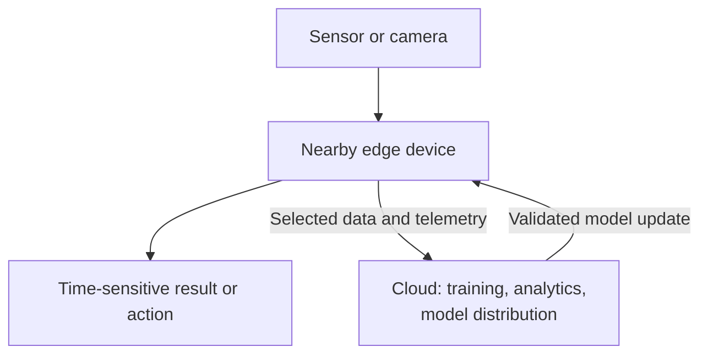
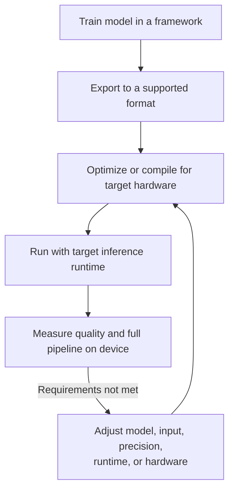
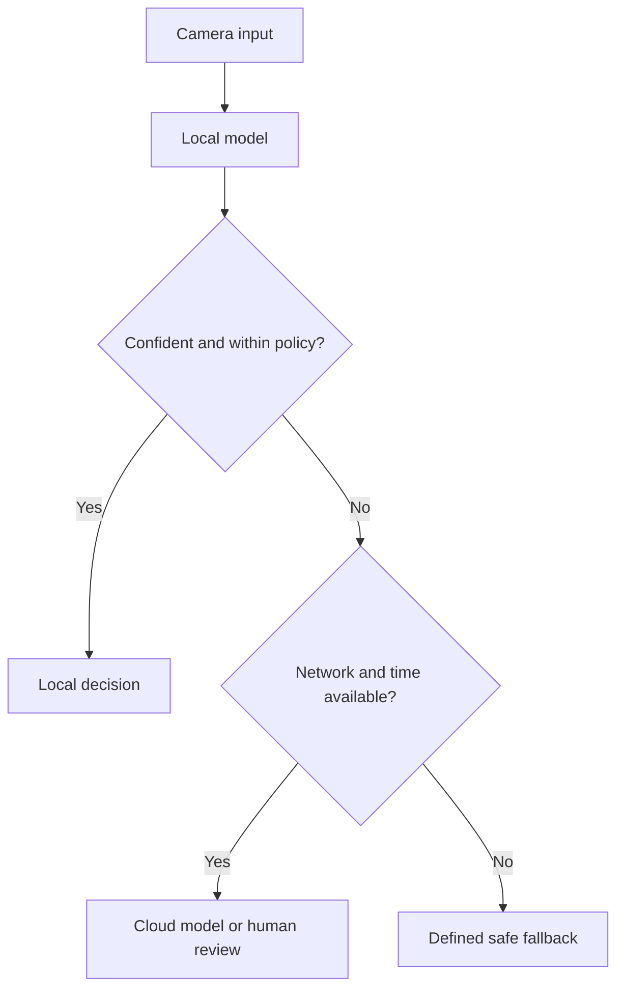

A model can achieve excellent accuracy on a GPU server and still be the wrong model for a camera, drone, or robot. Edge AI begins with that gap: how do we preserve enough quality while working within real limits on latency, memory, power, and heat?

Imagine training a defect detector on a workstation. It looks excellent in a demo. Then you move it to an industrial camera: inference is slow, memory is tight, and the device gets hot. The task has not changed, but the **deployment environment** has.

## 1. What moves to the edge?

In Edge AI, some inference happens near the place where data is produced, instead of depending entirely on a remote data center. "Edge" may mean a smart camera, phone, industrial PC, robot computer, or a local gateway. It does not necessarily mean a tiny or weak device.

The cloud still matters. It can train larger models, analyze aggregated data, and distribute updates. The architectural question is **which decisions must happen locally**, especially when the network is slow or unavailable.

For a robot, local inference can reduce dependence on a round trip to the cloud. But running the model at the edge does not automatically make a system safe: emergency behavior and safety controls must be designed and tested separately. The [Physical AI article](../what-is-physical-ai/) explains why feedback and control are part of that larger system.

## 2. "Best model" means best within constraints

On a server, we may first ask which model has the highest accuracy. On a device, several budgets matter at once:

| Budget | What can go wrong? |
| --- | --- |
| Quality | The model misses defects or raises too many false alarms. |
| Latency | A result arrives too late to be useful. |
| Memory | Weights, tensors, buffers, and other processes exceed available RAM. |
| Power | Inference drains a battery or exceeds a device's power envelope. |
| Thermal | Sustained load reduces clock speed or forces a shutdown. |

Suppose model A detects slightly more defects but cannot meet the line's timing requirement. Model B may be the better product choice if it reaches the required quality while fitting every system constraint. The numbers must come from the actual use case; there is no universal "good" latency or accuracy threshold.

## 3. Measure the whole path, not just model.forward()

An inference benchmark might report **20 ms**. But consider this illustrative, sequential pipeline:

| Stage | Example time |
| --- | ---: |
| Camera capture | 10 ms |
| Resize and normalize | 8 ms |
| Memory transfer | 6 ms |
| Model inference | 20 ms |
| Post-processing | 7 ms |
| Decision logic | 5 ms |
| **Total, if sequential** | **56 ms** |

These are made-up numbers, not a benchmark for a particular device. Real stages may overlap, while queues, sensor exposure, and action delays can add time. The important distinction is between **inference-only latency** and **sensor-to-decision or sensor-to-action latency**.

[NVIDIA's TensorRT benchmarking guide](https://docs.nvidia.com/deeplearning/tensorrt/latest/performance/benchmarking.html) distinguishes GPU compute, data transfers, host latency, and application-level pre/post-processing. So establish a baseline at the boundaries that matter to your product, then profile each stage. For real-time workloads, look beyond an average: tail latency and performance under load may decide whether the deadline is met.

## 4. A 100 MB model does not need only 100 MB of memory

The file on disk is only one part of runtime memory. The application may also need space for activations, input/output tensors, intermediate buffers, runtime workspaces, camera frames, the operating system, and other services. A robot may share memory with mapping, navigation, and control processes.

This is especially visible on integrated GPUs that share system RAM. [OpenVINO's iGPU memory guide](https://docs.openvino.ai/nightly/openvino-workflow/running-inference/optimize-inference/managing-igpu-memory-usage.html) explicitly calls out the competition among model weights, runtime buffers, the application, and the OS. Measure **peak memory while the full workload runs**, not just model file size or idle usage.

## 5. Precision is a tool, not a free upgrade

Models are often trained or stored with FP32 values. Lower-precision inference may use FP16 or BF16; quantization may use formats such as INT8. Fewer bits can reduce weight storage and sometimes improve speed or energy efficiency on supported hardware. But precision changes can also reduce quality, and conversion overhead can erase a speed gain.

[NVIDIA documents](https://docs.nvidia.com/deeplearning/tensorrt/latest/inference-library/work-with-quantized-types.html) the memory and efficiency benefits of quantization, while its [accuracy guidance](https://docs.nvidia.com/deeplearning/tensorrt/latest/inference-library/accuracy-considerations.html) explains numerical trade-offs. [ONNX Runtime also warns](https://onnxruntime.ai/docs/performance/model-optimizations/quantization.html) that a quantized model can be slower on hardware without suitable support.

The right loop is: **convert, validate task quality, measure full-pipeline latency and memory on target hardware, then compare**. For a defect detector, validate not just overall accuracy but the kinds of misses and false alarms that matter to the production line.

## 6. Sometimes the best optimization is not inside the model

Before squeezing the network, ask what the application truly needs:

- Must every camera frame be analyzed, or only enough frames to meet the inspection requirement?
- Is full 4K input necessary to see the smallest relevant defect?
- Would a smaller model architecture fit better than compressing a large one?
- Can preprocessing and post-processing avoid extra copies?
- Does the target device have an efficient runtime for this model?

Changing frame rate or resolution can save work, but can also miss short-lived or tiny defects. Validate those changes on real examples, not only on an inference benchmark.

A common deployment path is:

For example, [TensorRT's quick start](https://docs.nvidia.com/deeplearning/tensorrt/latest/getting-started/quick-start-guide.html) describes exporting a model and building a GPU-specific inference engine. A result on your laptop is not a substitute for measuring that engine on the actual device, in its actual configuration.

## 7. Power and heat change the result over time

A drone has a finite battery. More compute can shorten flight time. An embedded device also has a power mode and cooling limits. A model that runs well for 30 seconds may slow during a long shift if the hardware reduces clock speed to control temperature.

On Jetson, [NVIDIA documents](https://docs.nvidia.com/jetson/archives/r36.5/DeveloperGuide/SD/TestPlanValidation.html) power modes and the `tegrastats` monitoring utility; its [thermal documentation](https://docs.nvidia.com/jetson/archives/r36.5/DeveloperGuide/SD/PlatformPowerAndPerformance/JetsonOrinNanoSeriesJetsonOrinNxSeriesAndJetsonAgxOrinSeries.html) explains how thermal throttling can reduce performance. The broader lesson applies beyond Jetson: benchmark in the **same power mode, enclosure, airflow, and sustained workload** planned for deployment.

## 8. Edge and cloud can work together

Many systems use a hybrid design. A small local model handles routine, time-sensitive decisions. Uncertain or high-risk cases can be sent to a larger model or a human **when the network and deadline allow it**. If connectivity fails, the local system needs an explicit fallback, such as stopping the process or requesting review; it should not silently assume the cloud responded.

The threshold for "confident" must be calibrated and evaluated, especially where errors have different costs. This pattern can save bandwidth and power, but it is not appropriate for every safety-critical decision.

## 9. Shipping one model is not operating a fleet

Deploying to thousands of cameras creates another problem: which version runs on which device? Does the new model work on older hardware? What happens if an update fails halfway through or a device is offline?

A production rollout needs version tracking, compatibility checks, staged deployment, monitoring, and a tested rollback path. It also needs quality monitoring after deployment. A model can keep running at 25 ms per frame while accuracy falls because lighting changes, a lens gets dirty, or a new product looks different. **Runtime health and model quality are separate signals.**

## The real Edge AI question

Edge AI is not simply "How do we make the model fast?" It asks: **How do we build a perception system that is good enough within the device's real limits?**

That may mean a smaller model, lower precision, a different input rate, a better runtime, different hardware, or a hybrid edge-cloud design. Establish a baseline, change one constraint at a time, and measure the **whole pipeline on the target device**. [NVIDIA's optimization guidance](https://docs.nvidia.com/deeplearning/tensorrt/latest/performance/optimization.html) makes that measure-first principle explicit.

## References

- [Performance Benchmarking - NVIDIA TensorRT](https://docs.nvidia.com/deeplearning/tensorrt/latest/performance/benchmarking.html)
- [Working with Quantized Types and Accuracy Considerations - NVIDIA TensorRT](https://docs.nvidia.com/deeplearning/tensorrt/latest/inference-library/work-with-quantized-types.html)
- [Quantize ONNX Models - ONNX Runtime](https://onnxruntime.ai/docs/performance/model-optimizations/quantization.html)
- [Managing iGPU Memory Allocation - OpenVINO](https://docs.openvino.ai/nightly/openvino-workflow/running-inference/optimize-inference/managing-igpu-memory-usage.html)
- [Platform Power and Performance - NVIDIA Jetson Linux](https://docs.nvidia.com/jetson/archives/r36.5/DeveloperGuide/SD/PlatformPowerAndPerformance.html)
- [Quick Start Guide - NVIDIA TensorRT](https://docs.nvidia.com/deeplearning/tensorrt/latest/getting-started/quick-start-guide.html)
