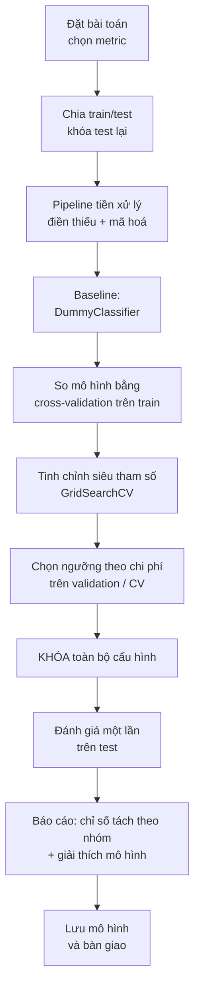

> **Mục tiêu bài học:** Sau bài này, bạn sẽ chạy được trọn một dự án học máy trên dữ liệu thật - từ chọn metric cho bài toán lệch lớp, dựng pipeline, so sánh mô hình bằng cross-validation, chọn ngưỡng theo chi phí, giải thích mô hình, kiểm tra chênh lệch giữa các nhóm, cho tới lúc bàn giao.

## 1. Bài toán, dữ liệu, và những câu hỏi trước khi viết code

Bộ `adult` đã đi cùng chúng ta suốt chương: 48.842 hồ sơ trích từ một cuộc điều tra dân số Mỹ năm 1994, mỗi hồ sơ gồm tuổi, số năm học, nghề nghiệp, tình trạng hôn nhân, số giờ làm mỗi tuần và vài trường khác; nhãn là thu nhập năm có vượt 50.000 USD hay không. Bài này ghép mọi mảnh lại thành một quy trình chạy từ đầu đến cuối.

Việc đầu tiên không phải chọn mô hình mà là hỏi: **dự đoán này dùng để làm gì, và sai theo hướng nào thì đắt hơn?** Cùng một mô hình, ta sẽ cấu hình rất khác nhau tùy đầu ra dùng vào việc gì. Nếu là danh sách mời chào sản phẩm tài chính, bỏ sót một người thu nhập cao chỉ là mất một cơ hội. Nếu là duyệt hạn mức tín dụng, đoán nhầm một người thu nhập thấp thành cao có thể dẫn tới một khoản nợ xấu. Ở bài này ta chọn tình huống thứ nhất: một danh sách gợi ý, nên bỏ sót đắt hơn báo nhầm.

Câu hỏi thứ hai: dữ liệu lệch lớp đến đâu? Chỉ **23,93%** hồ sơ có thu nhập trên 50K. Nghĩa là một mô hình đoán bừa "ai cũng dưới 50K" đã đạt accuracy 76,07% mà không cần biết gì. Foundations · Bài 15 đã cảnh báo chính xác tình huống này, nên bộ metric của bài là **precision, recall, F1 và ROC-AUC**, còn accuracy chỉ để tham khảo.

```python
from sklearn.datasets import fetch_openml
from sklearn.model_selection import train_test_split

ad = fetch_openml("adult", version=2, as_frame=True)
df = ad.frame
y  = (df.pop("class") == ">50K").astype(int)
X  = df.drop(columns=["education"])     # trùng thông tin với education-num
X_train, X_test, y_train, y_test = train_test_split(
    X, y, test_size=0.2, stratify=y, random_state=42)
```

`stratify=y` giữ tỉ lệ 23,93% giống nhau ở cả hai phần - quan trọng khi lớp dương chỉ chiếm một phần tư. Ta được 39.073 dòng train và 9.769 dòng test. Tập test này sẽ **không được đụng tới** cho tới mục 6; mọi quyết định từ đây đến đó đều dựa vào cross-validation trên tập train.

Vài quan sát đáng ghi trước khi bắt đầu: cột `education` là bản chữ của `education-num` nên bỏ một trong hai; ba cột `workclass`, `occupation`, `native-country` có giá trị thiếu (lần lượt 2.799, 2.809 và 857 dòng); cột `fnlwgt` là trọng số lấy mẫu của cuộc điều tra chứ không phải thuộc tính của người được khảo sát - bài 07 và 11 đã cho thấy nó vô dụng với việc dự đoán, ta giữ lại để mục 6 kiểm chứng lần cuối.

## 2. Toàn cảnh quy trình



Thứ tự này có lý do, và có một quy tắc chi phối tất cả: **mọi thứ bạn *chọn* đều phải chọn trước khi mở tập test.**

Baseline đứng trước mọi mô hình để bạn luôn biết "không làm gì" thì được bao nhiêu. Cross-validation đứng trước tập test để mọi so sánh không làm mòn nó. Ngưỡng đứng sau lúc chốt mô hình - vì đổi ngưỡng không cần huấn luyện lại - nhưng vẫn phải **trước** tập test, vì chọn ngưỡng cũng là một lựa chọn.

Sau khi khóa cấu hình và mở test, bạn vẫn được **nhìn** rất nhiều: tách chỉ số theo nhóm, chạy permutation importance, đọc ma trận nhầm lẫn. Ranh giới nằm ở chỗ khác: *nhìn* để báo cáo và giải thích thì được; nhưng hễ bạn nhìn kết quả test rồi **đổi** một thứ gì - bỏ một cột, dời ngưỡng, chọn mô hình khác - thì bạn vừa dùng test để chọn, và con số test không còn là ước lượng trung thực nữa. Khi ấy phải quay về dữ liệu phát triển, và cần một tập test sạch khác nếu muốn báo cáo lại.

Mục 6 dưới đây bắt đầu bằng một bảng dò ngưỡng *trên tập test* - nhưng chỉ để bạn **nhìn** sự đánh đổi; việc **chọn** ngưỡng thì mục 5.2 làm đúng cách, bằng cross-validation trên train. Mục 8 soi chênh lệch giữa các nhóm trên tập test, và đó là *báo cáo* chứ không phải lựa chọn - đúng ranh giới vừa nêu.

## 3. Tiền xử lý: hai nhánh cho hai loại mô hình

`adult` có 6 cột số và 7 cột chữ, kèm giá trị thiếu. Bài 11 đã nêu lý do cần hai cách mã hóa khác nhau. Mô hình tuyến tính cần one-hot và cần chuẩn hóa. Mô hình cây không cần chuẩn hóa, và ta mã hóa thứ tự cho nó để bảng khỏi phình lên 89 cột.

```python
from sklearn.compose import ColumnTransformer
from sklearn.pipeline import Pipeline
from sklearn.impute import SimpleImputer
from sklearn.preprocessing import StandardScaler, OneHotEncoder, OrdinalEncoder
from sklearn.ensemble import HistGradientBoostingClassifier

num_cols = ["age", "fnlwgt", "education-num",
            "capital-gain", "capital-loss", "hours-per-week"]
cat_cols = [c for c in X.columns if str(X[c].dtype) == "category"]

prep_lin = ColumnTransformer([
    ("num", Pipeline([("imp", SimpleImputer(strategy="median")),
                      ("sc",  StandardScaler())]), num_cols),
    ("cat", Pipeline([("imp", SimpleImputer(strategy="most_frequent")),
                      ("oh",  OneHotEncoder(handle_unknown="ignore"))]), cat_cols)])

prep_tree = ColumnTransformer([
    ("num", SimpleImputer(strategy="median"), num_cols),
    ("cat", Pipeline([("imp", SimpleImputer(strategy="most_frequent")),
                      ("oe",  OrdinalEncoder(handle_unknown="use_encoded_value",
                                             unknown_value=-1))]), cat_cols)])

pipe_tree = Pipeline([("p", prep_tree),
                      ("m", HistGradientBoostingClassifier(random_state=42))])
```

`handle_unknown="ignore"` và `unknown_value=-1` xử lý tình huống hồ sơ mới mang một giá trị chưa từng xuất hiện lúc train - chuyện gần như chắc chắn xảy ra với cột `native-country` có 41 giá trị.

> ⚠️ **Lưu ý nhỏ:** mã hóa thứ tự ở đây là một lựa chọn thực dụng, không phải quy tắc. Nó gán `occupation` thành 0-13, và cây có thể cắt ở "occupation ≤ 2,5" - một ngưỡng chẳng có nghĩa gì, vì thứ tự đó do bảng chữ cái quyết định chứ không phải bản chất nghề nghiệp. Cây bù lại bằng cách cắt nhiều lần để tách lại các nhóm, nên hại ít hơn so với mô hình tuyến tính, nhưng vẫn là một chỗ khiên cưỡng.
>
> `HistGradientBoostingClassifier` nhận cột phân loại **trực tiếp** qua tham số `categorical_features` - nó chia nhánh theo *nhóm giá trị* thay vì theo ngưỡng số. Khả năng này có từ phiên bản 0.24; từ 1.4 có thêm lựa chọn `"from_dtype"` (tự nhận các cột kiểu `category` của pandas), và từ 1.6 `"from_dtype"` trở thành giá trị mặc định - nên với scikit-learn 1.7 bạn không phải khai báo gì. Bộ `adult` tải bằng `fetch_openml(as_frame=True)` vốn đã có sẵn kiểu `category`, nên chỉ cần `HistGradientBoostingClassifier().fit(X_train, y_train)` là xong - đưa qua `OrdinalEncoder` trước lại vô hiệu hóa đúng tính năng đó, vì kết quả biến thành mảng số thực.
>
> Chạy thử cả hai trên `adult`: cách dùng `OrdinalEncoder` cho ROC-AUC cross-validation **0,9273**, để mô hình tự nhận cột phân loại cho **0,9284** - chênh 0,001, nhỏ hơn độ lệch chuẩn giữa các fold (±0,0026). Trên test thì ngược lại: 0,9296 so với 0,9294. Nói cách khác, ở bộ dữ liệu này hai cách hòa nhau; bài giữ `OrdinalEncoder` để hai nhánh tiền xử lý đối xứng và dễ đọc. Với dữ liệu có cột phân loại nhiều giá trị hơn, cách khai báo trực tiếp thường đáng thử trước.

## 4. Bốn mô hình, so bằng cross-validation

Cross-validation 5-fold trên tập train, chấm bằng ROC-AUC:

| Mô hình | ROC-AUC (CV trên train) |
|---|---|
| Hồi quy logistic | 0,9055 ± 0,0037 |
| Random Forest (300 cây, `min_samples_leaf=5`) | 0,9178 ± 0,0032 |
| HistGradientBoosting | **0,9273 ± 0,0024** |

Độ lệch chuẩn giữa các fold vào khoảng 0,003, còn khoảng cách giữa các mô hình là 0,01-0,02 - lớn gấp nhiều lần, nên thứ hạng này không phải may rủi. Nếu hai mô hình chỉ hơn kém nhau 0,002 thì kết luận "cái này tốt hơn" sẽ không đứng vững, và khi đó nên chọn cái đơn giản hơn.

Thứ tự này khớp với điều bài 07 đã bàn: trên dữ liệu bảng có cột chữ và quan hệ phi tuyến, gradient boosting thường dẫn trước. Ta chọn `HistGradientBoostingClassifier` làm ứng viên chính.

## 5. Tinh chỉnh và chọn ngưỡng - test vẫn khóa

Hai lựa chọn cuối cùng còn lại: bộ siêu tham số, và ngưỡng quyết định. Cả hai đều là *lựa chọn*, nên cả hai phải xong trước khi tập test được mở.

### 5.1. Siêu tham số: chọn bằng cross-validation

```python
from sklearn.model_selection import GridSearchCV

grid = {"m__learning_rate": [0.05, 0.1],
        "m__max_leaf_nodes": [15, 31, 63],
        "m__min_samples_leaf": [20, 50]}
gs = GridSearchCV(pipe_tree, grid, cv=5, scoring="roc_auc", n_jobs=-1).fit(X_train, y_train)
best_model = gs.best_estimator_
```

12 tổ hợp × 5 fold = 60 lần huấn luyện, hết khoảng 14 giây. Kết quả tốt nhất: `learning_rate=0.1`, `max_leaf_nodes=31`, `min_samples_leaf=20` - **đúng bằng giá trị mặc định**, AUC 0,9273. Tổ hợp tệ nhất trong lưới đạt 0,9221. Cả lưới chỉ trải trong khoảng 0,005.

Đây là kết quả nên nói thẳng thay vì giấu đi. Trong project này, tinh chỉnh siêu tham số không mang lại gì, trong khi đổi từ hồi quy logistic sang gradient boosting nâng AUC từ 0,9055 lên 0,9273. Thứ tự ưu tiên rút ra: chất lượng dữ liệu và đặc trưng trước, chọn họ mô hình sau, tinh chỉnh sau cùng - và trong project này tinh chỉnh là phần đóng góp ít nhất. Đừng biến một lần đo thành quy luật; với mô hình khác hoặc lưới rộng hơn, kết luận có thể khác.

### 5.2. Ngưỡng: chọn bằng cross-validation, không đụng test

Mô hình xuất ra xác suất; 0,5 chỉ là mốc mặc định, không phải chân lý. Đổi ngưỡng không cần huấn luyện lại, chỉ cần so `predict_proba` với một con số khác - nhưng chọn con số ấy vẫn là một lựa chọn, nên vẫn phải làm trên dữ liệu train.

Công cụ là `cross_val_predict`: nó chạy 5 fold và trả về, cho mỗi dòng train, xác suất do mô hình **chưa từng thấy dòng đó** dự đoán. Ta có 39.073 xác suất "sạch" để dò ngưỡng, mà tập test vẫn nguyên vẹn.

```python
from sklearn.model_selection import cross_val_predict, StratifiedKFold
from sklearn.metrics import confusion_matrix
import numpy as np

cv  = StratifiedKFold(5, shuffle=True, random_state=42)
oof = cross_val_predict(best_model, X_train, y_train, cv=cv,
                        method="predict_proba")[:, 1]

C_FN, C_FP = 10, 1                       # bỏ sót đắt gấp 10 lần báo nhầm
grid = np.arange(0.02, 0.61, 0.01)
cost = [confusion_matrix(y_train, (oof >= t).astype(int))[1,0] * C_FN
      + confusion_matrix(y_train, (oof >= t).astype(int))[0,1] * C_FP for t in grid]
threshold = grid[int(np.argmin(cost))]   # → 0,09
```

Chi phí trên 39.073 xác suất out-of-fold (AUC out-of-fold 0,9273), với giả định bỏ sót đắt gấp 10 lần báo nhầm - đúng tình huống danh sách gợi ý ở mục 1:

| Ngưỡng | 0,05 | 0,08 | **0,09** | 0,10 | 0,15 | 0,30 | 0,50 |
|---|---|---|---|---|---|---|---|
| Báo nhầm (FP) | 12.333 | 10.217 | 9.656 | 9.183 | 7.436 | 4.251 | 1.727 |
| Bỏ sót (FN) | 205 | 357 | 412 | 461 | 698 | 1.701 | 3.261 |
| **Chi phí** | 14.383 | 13.787 | **13.776** | 13.793 | 14.416 | 21.261 | 34.337 |

Ngưỡng rẻ nhất là **0,09**, chọn hoàn toàn trên dữ liệu train. Con số này cũng khớp với một công thức: nếu chỉ có hai loại chi phí và xác suất mô hình đưa ra là xác suất **đã hiệu chỉnh**, ngưỡng lý thuyết là $c_{FP} / (c_{FP} + c_{FN}) = 1/11 \approx 0{,}09$.

> ⚠️ **Lưu ý nhỏ:** hai chữ "đã hiệu chỉnh" ở trên là một điều kiện thật, không phải câu rào đón. Một mô hình **hiệu chỉnh tốt (calibrated)** là mô hình mà trong số các hồ sơ nó chấm 0,30, đúng khoảng 30% thật sự trên 50K. Nhiều mô hình không được như vậy - chúng xếp hạng đúng nhưng con số xác suất bị lệch, và khi ấy công thức trên trỏ vào một ngưỡng sai. Cách kiểm: chia dự đoán thành 10 nhóm theo xác suất rồi so xác suất trung bình của nhóm với tỉ lệ thật (`sklearn.calibration.calibration_curve`). Mô hình ở đây lệch trung bình 0,007 - rất sát, và đó là lý do ngưỡng lý thuyết 0,09 trùng khớp với ngưỡng mà cross-validation tìm ra. Nếu mô hình lệch nhiều, hãy bọc nó bằng `CalibratedClassifierCV` trước khi dùng công thức, hoặc bỏ công thức đi mà dò thẳng chi phí trên tập validation.

> ⚠️ **Lưu ý nhỏ:** scikit-learn có sẵn `TunedThresholdClassifierCV` làm đúng quy trình ở mục 5.2 trong một lớp: nó dò ngưỡng bằng cross-validation nội bộ theo một metric hoặc một hàm chi phí bạn đưa vào. Tài liệu của nó cũng cảnh báo đúng điều mục này vừa chứng minh: đừng chỉnh ngưỡng trên chính dữ liệu đã dùng để fit mô hình.

Đến đây **mọi lựa chọn đã xong**: pipeline tiền xử lý, họ mô hình, siêu tham số, ngưỡng. Khóa lại.

## 6. Mở test đúng một lần

Giờ mới đến lượt tập test - và đây là lần duy nhất nó được đọc.

| Mô hình | Accuracy | Precision | Recall | F1 | ROC-AUC |
|---|---|---|---|---|---|
| Đoán luôn "≤ 50K" | 0,7607 | - | 0,000 | 0,000 | 0,500 |
| Hồi quy logistic | 0,8523 | 0,738 | 0,594 | 0,658 | 0,9036 |
| Random Forest | 0,8677 | 0,788 | 0,613 | 0,689 | 0,9199 |
| HistGradientBoosting | **0,8761** | 0,792 | 0,654 | **0,717** | **0,9296** |

Dòng đầu tiên cho thấy vì sao accuracy một mình là chỉ số nguy hiểm ở đây: mô hình rỗng đạt 76,07% nhưng recall bằng 0 - nó không tìm ra một hồ sơ thu nhập cao nào. Mô hình tốt nhất hơn nó 11,5 điểm accuracy, nhưng con số đáng kể là recall đi từ 0 lên 0,654.

| | dự đoán ≤ 50K | dự đoán > 50K |
|---|---|---|
| **thật ≤ 50K** | 7.029 | 402 |
| **thật > 50K** | 808 | 1.530 |

808 hồ sơ thu nhập cao bị bỏ sót, 402 hồ sơ bị báo nhầm. Với tình huống ở mục 1 - bỏ sót đắt hơn báo nhầm - cán cân này đang lệch sai hướng.

Áp ngưỡng 0,09 đã chọn ở mục 5.2:

| Ngưỡng dùng trên test | Accuracy | Precision | Recall | Chi phí |
|---|---|---|---|---|
| 0,50 (mặc định) | 0,8761 | 0,792 | 0,654 | 8.482 |
| **0,09 (chọn từ CV)** | 0,7449 | 0,483 | **0,955** | **3.437** |

Chi phí giảm từ 8.482 xuống 3.437 - hơn một nửa - chỉ bằng cách đổi một con số, không huấn luyện lại gì.

> 🔧 **Thử ngay:** nếu được phép gian lận, tức dò thẳng ngưỡng trên tập test, bạn tiết kiệm thêm được bao nhiêu?
> Ngưỡng rẻ nhất trên test là 0,12 với chi phí 3.396. Ngưỡng 0,09 chọn đúng quy trình cho 3.437 - **đắt hơn 1,2%**. Đó là toàn bộ cái giá của việc làm sạch sẽ, và nó gần như bằng không. Đổi lại, con số 3.437 là ước lượng trung thực cho chi phí bạn sẽ gánh khi triển khai, còn 3.396 thì không - nó đã được chọn để đẹp trên chính tập dùng để chấm.
>
> Có một công thức cho chuyện này: nếu chỉ có hai loại chi phí và xác suất mô hình đưa ra là xác suất **đã hiệu chỉnh**, thì ngưỡng lý thuyết là $c_{FP} / (c_{FP} + c_{FN}) = 1/11 \approx 0{,}09$ - trùng đúng con số cross-validation tìm ra. Đó không phải may: mục dưới đo được mô hình này hiệu chỉnh rất tốt.

Bảng dưới đây trải toàn bộ đánh đổi theo ngưỡng, đọc trên tập test. Nó là **báo cáo**, không phải chỗ để chọn - ngưỡng đã cố định từ mục 5.2:

| Ngưỡng | Precision | Recall | F1 | Số hồ sơ được chọn |
|---|---|---|---|---|
| 0,3 | 0,648 | **0,822** | 0,725 | 2.967 |
| 0,4 | 0,729 | 0,736 | **0,732** | 2.359 |
| 0,5 | 0,792 | 0,654 | 0,717 | 1.932 |
| 0,6 | 0,845 | 0,552 | 0,668 | 1.526 |
| 0,7 | 0,904 | 0,457 | 0,607 | 1.182 |
| 0,8 | **0,966** | 0,349 | 0,512 | 844 |

Bảng này đọc được thành các câu tiếng Việt bình thường. Ngưỡng 0,8: trong 844 hồ sơ được chọn, 96,6% đúng - nhưng bỏ sót gần hai phần ba số người thu nhập cao. Ngưỡng 0,3: bắt được 82,2% số người cần tìm, đổi lại cứ ba hồ sơ trong danh sách thì hơn một hồ sơ là báo nhầm.

## 7. Mô hình đang dựa vào cái gì

Bài 11 đã nêu lý do dùng permutation importance thay cho `feature_importances_`. Mức giảm ROC-AUC khi xáo trộn từng cột trên tập test (nhân 1.000):

| Cột | capital-gain | age | education-num | marital-status | hours-per-week | relationship | capital-loss |
|---|---|---|---|---|---|---|---|
| AUC giảm | 65,5 | 48,9 | 33,2 | 29,1 | 14,3 | 13,9 | 13,0 |

| Cột | occupation | sex | workclass | fnlwgt | race | native-country |
|---|---|---|---|---|---|---|
| AUC giảm | 9,5 | 2,1 | 1,9 | 1,4 | 1,0 | 0,5 |

Bảng này vừa là công cụ giải thích vừa là công cụ **soát lộ đề**. Quy tắc: khi một cột đóng góp cao đến mức bất thường, hãy hỏi hai câu - tại thời điểm dự đoán thật, cột ấy đã tồn tại chưa; và nó có phải là một phần của chính thứ ta đang dự đoán không. Một mô hình dự đoán khách hàng rời bỏ mà cột quan trọng nhất là `ngày_đóng_tài_khoản` thì không phải mô hình tốt, mà là mô hình đang đọc đáp án.

Áp câu hỏi ấy cho `capital-gain` - cột đứng đầu bảng - thì kết quả không sạch như ta mong. Lãi vốn là một *khoản cấu thành* thu nhập, mà thu nhập chính là thứ đang được dự đoán:

| | số dòng | tỉ lệ > 50K |
|---|---|---|
| `capital-gain` > 5.000 | 2.451 | 90,1% |
| `capital-gain` > 7.298 | 1.690 | 98,3% |
| `capital-gain` = 99.999 | 244 | **100%** |

Cả 244 hồ sơ có lãi vốn 99.999 đều thuộc nhóm trên 50K, không sót một trường hợp nào. Với những dòng ấy, mô hình gần như không phải dự đoán: cột đầu vào và nhãn chồng lấn nhau về mặt định nghĩa.

Đây có phải lộ đề không thì còn tuỳ một câu hỏi khác: **tại thời điểm cần dự đoán trong thực tế, con số lãi vốn đã có chưa?** Nếu hệ thống dùng để ước lượng thu nhập của một người mà hồ sơ thuế của họ đã nộp xong thì cột này hợp lệ, chỉ là mạnh một cách hơi tầm thường. Nếu nó được dùng để dự báo thu nhập *tương lai* thì cột ấy chưa tồn tại, và mô hình sẽ sập ngay khi triển khai. Đây không phải lỗi trong code của bạn mà là đặc điểm của bộ dữ liệu, nhưng vẫn phải ghi vào tài liệu bàn giao: một phần độ chính xác đang đến từ quan hệ định nghĩa chứ không từ quy luật học được. Nếu mang mô hình sang bối cảnh khác, nơi lãi vốn không nằm trong định nghĩa thu nhập, phần độ chính xác ấy sẽ biến mất.

`fnlwgt` khép lại câu chuyện bắt đầu từ bài 07: 1,4 phần nghìn AUC, tức gần như không đóng góp gì, dù `feature_importances_` của random forest từng xếp nó rất cao. Đây là bằng chứng cuối cùng cho thấy cách đo độ quan trọng bằng số lần cắt của cây thiên vị những cột có nhiều giá trị khác nhau.

## 8. Kiểm tra chênh lệch giữa các nhóm

Mô hình đạt AUC 0,9296 trên toàn bộ tập test. Câu hỏi tiếp theo: nó có làm việc *đều tay* trên các nhóm người khác nhau không? Tách kết quả ở ngưỡng 0,5:

| Nhóm | Số hồ sơ | Tỉ lệ > 50K thật | Tỉ lệ được dự đoán > 50K | Recall | Precision |
|---|---|---|---|---|---|
| Nữ | 3.259 | 11,1% | 8,1% | **0,587** | 0,800 |
| Nam | 6.510 | 30,4% | 25,6% | **0,667** | 0,791 |
| Black | 968 | 13,3% | 8,5% | 0,558 | 0,878 |
| White | 8.312 | 25,3% | 21,2% | 0,663 | 0,791 |
| Asian-Pac-Islander | 311 | 26,4% | 24,4% | 0,646 | 0,697 |

(Tên các nhóm chủng tộc giữ nguyên theo giá trị gốc trong dữ liệu; các nhóm dưới 200 hồ sơ trong tập test không được liệt kê vì số liệu quá ít để đọc.)

Precision gần như bằng nhau giữa nam và nữ (0,79 so với 0,80): khi mô hình nói "trên 50K" thì độ tin cậy như nhau. Nhưng recall chênh 8 điểm - trong số phụ nữ thực sự có thu nhập trên 50K, mô hình bỏ sót nhiều hơn hẳn. Chênh lệch recall (còn gọi là true positive rate) giữa các nhóm chính là tiêu chí công bằng mang tên **equal opportunity** (cơ hội ngang nhau). Nếu đầu ra dùng để chọn danh sách mời tham gia một chương trình có lợi, chênh lệch này nghĩa là phụ nữ đủ điều kiện bị bỏ sót nhiều hơn.

Phản xạ đầu tiên thường là bỏ cột nhạy cảm đi. Thử luôn:

| Cấu hình | Accuracy | ROC-AUC | Recall nữ | Recall nam | Chênh |
|---|---|---|---|---|---|
| Giữ nguyên | 0,8761 | 0,9296 | 0,587 | 0,667 | +0,079 |
| Bỏ `sex` và `race` | 0,8753 | 0,9281 | 0,593 | 0,663 | +0,070 |
| Bỏ thêm `relationship`, `marital-status` | 0,8545 | 0,8914 | 0,507 | 0,524 | +0,017 |

Bỏ `sex` và `race` gần như không thay đổi gì: chênh lệch chỉ đi từ 0,079 xuống 0,070. Lý do là các cột còn lại vẫn mang thông tin ấy - `relationship` có giá trị "Husband" và "Wife", `marital-status` cũng vậy. Xóa nhãn không xóa được thông tin. Bỏ luôn cả hai cột đó thì chênh lệch giảm còn 0,017, nhưng AUC tụt từ 0,9296 xuống 0,8914 - cái giá phải trả bằng chất lượng dự đoán trên tất cả mọi người.

Bảng trên không đưa ra lời giải, nó cho thấy đây là một sự đánh đổi cần người quyết định chứ không phải một lỗi để sửa bằng code.

Có một tầng nữa nằm dưới: bản thân dữ liệu. Nghiên cứu *Retiring Adult* của Frances Ding, Moritz Hardt, John Miller và Ludwig Schmidt (NeurIPS 2021) chỉ ra rằng ngưỡng 50.000 USD của bộ `adult` là một lựa chọn tùy tiện. Thu nhập trung vị ở Mỹ năm 1994 là 26.000 USD; 50.000 USD rơi vào phân vị thứ 76 của toàn dân số, nhưng là phân vị 88 trong nhóm người da đen và phân vị 89 trong nhóm phụ nữ. Nghĩa là gần như toàn bộ hồ sơ của hai nhóm này nằm dưới ngưỡng, và mô hình huấn luyện trên `adult` lại có accuracy *cao hơn* trên chính các nhóm ấy - nhóm tác giả đo được 85% accuracy tổng thể nhưng 91,4% trên nhóm da đen và 92,7% trên nhóm nữ. Họ gọi đây là tình huống khác thường, vì mô hình học máy thường hoạt động kém hơn trên các nhóm yếu thế.

Bài học rút ra vượt ra ngoài bộ `adult`: **một chỉ số tổng thể có thể che giấu hành vi rất khác nhau giữa các nhóm, và cách định nghĩa nhãn có thể tự nó sinh ra chênh lệch.** Tách chỉ số theo nhóm là việc cần làm trước khi bàn giao, không phải sau khi có khiếu nại.

> ⚠️ **Lưu ý nhỏ:** dữ liệu này từ năm 1994 và không mô tả tình hình hiện tại của bất kỳ quốc gia nào. Nó là bộ dữ liệu học tập tốt vì đủ lớn, có cả cột số lẫn cột chữ, có giá trị thiếu và lệch lớp - chứ không phải nguồn để rút ra kết luận về thu nhập. Chính nhóm *Retiring Adult* đã công bố bộ `folktables` dựa trên dữ liệu điều tra dân số Mỹ nhiều năm gần đây để thay thế.

## 9. Bàn giao

```python
import joblib
joblib.dump(gs.best_estimator_, "model_final.joblib")   # ≈ 359 KB
```

`joblib.dump` lưu **cả pipeline**, không chỉ mô hình. Tệp 359 KB ấy chứa trung vị dùng để điền giá trị thiếu, bảng mã hóa các cột chữ và toàn bộ cây của gradient boosting. Bên nhận chỉ cần `joblib.load` rồi gọi `predict` trên bảng dữ liệu **thô** - không phải dựng lại bước tiền xử lý nào, nên cũng không có cơ hội dựng sai.

Kèm theo tệp mô hình, những thứ nên bàn giao:

- **Metric và ngưỡng đã chọn**, kèm lý do và kèm chỗ nó được chọn: "ngưỡng **0,09**, tìm bằng cách tối thiểu hoá chi phí trên xác suất out-of-fold của 5-fold cross-validation trên tập train, với tỉ lệ bỏ sót : báo nhầm là 10 : 1; đo trên tập test 9.769 hồ sơ giữ riêng cho precision 0,483 và recall 0,955." Chú ý con số này khác hẳn 0,5 mặc định - và cũng khác 0,4 là chỗ F1 cao nhất, vì F1 không biết gì về tỉ lệ chi phí của bạn.
- **Phiên bản thư viện** (`scikit-learn 1.7.2`, `pandas 2.3.3`, `numpy 2.2.6`) và `random_state` đã dùng. Mô hình lưu bằng phiên bản này không đảm bảo nạp được bằng phiên bản khác.
- **Mô tả dữ liệu train**: nguồn, thời điểm, kích thước, tỉ lệ lớp dương, các cột có giá trị thiếu.
- **Bảng chỉ số tách theo nhóm** ở mục 8, kèm ghi chú về chênh lệch recall.
- **Danh sách cột đầu vào** đúng tên và đúng kiểu.
- **Ngưỡng cảnh báo**: khi nào cần huấn luyện lại. Phân phối dữ liệu thật sẽ trôi dần khỏi dữ liệu train; nên theo dõi tỉ lệ dự đoán dương và phân phối các cột đầu vào theo thời gian.

> 🔧 **Thử ngay:** ba tháng sau khi triển khai, tỉ lệ hồ sơ được mô hình gắn nhãn "> 50K" tăng từ 20% lên 32%, trong khi mô hình không hề được huấn luyện lại. Nêu hai nguyên nhân hoàn toàn khác nhau có thể gây ra chuyện này, và bạn kiểm tra thế nào?
> (a) Tập khách hàng đã đổi - chẳng hạn kênh thu thập mới hút về nhóm có học vấn cao hơn. Kiểm tra bằng cách so phân phối từng cột đầu vào giữa dữ liệu mới và dữ liệu train. (b) Một cột đầu vào bị hỏng ở khâu kỹ thuật - đơn vị đổi, giá trị thiếu bị điền bằng 0 thay vì trung vị, một danh mục bị đổi tên nên rơi vào nhánh `handle_unknown`. Kiểm tra bằng cách so tỉ lệ giá trị thiếu và các giá trị lạ theo từng ngày. Cả hai đều làm dự đoán trôi mà không có thông báo lỗi nào, nên phải chủ động đo.

## Tóm tắt bài học

- Chọn metric theo hậu quả của từng loại sai, trước khi viết dòng code đầu tiên; với dữ liệu lệch lớp 23,93%, accuracy một mình gây hiểu nhầm - mô hình rỗng đã đạt 76,07%.
- Baseline đứng trước mọi mô hình; cross-validation trên train quyết định mọi lựa chọn; tập test mở đúng một lần ở cuối.
- Trên `adult`, chọn họ mô hình đóng góp lớn hơn hẳn tinh chỉnh siêu tham số: đổi mô hình nâng AUC từ 0,9055 lên 0,9273, còn cả lưới 12 tổ hợp chỉ trải 0,005 và giá trị mặc định thắng.
- Ngưỡng quyết định là lựa chọn kinh doanh, không phải hằng số 0,5: từ ngưỡng 0,3 đến 0,8, precision đi từ 0,648 lên 0,966 còn recall đi từ 0,822 xuống 0,349.
- Chọn ngưỡng bằng **cross-validation trên train** (xác suất out-of-fold), không dò trên test: với chi phí bỏ sót gấp 10 lần báo nhầm, cách này ra ngưỡng 0,09 và giảm chi phí trên test từ 8.482 xuống 3.437. Nếu gian lận dò thẳng trên test thì được 3.396 - **chỉ hơn 1,2%**, tức làm sạch sẽ gần như không mất gì.
- Permutation importance vừa để giải thích vừa để soát lộ đề: cột quan trọng nhất phải được kiểm tra xem có tồn tại tại thời điểm dự đoán thật không, và có phải một phần của chính nhãn không - cả 244 hồ sơ có `capital-gain` = 99.999 đều thuộc nhóm trên 50K.
- Chỉ số tổng thể che giấu chênh lệch giữa các nhóm - recall 0,587 với nữ so với 0,667 với nam - và bỏ cột nhạy cảm không xóa được chênh lệch vì các cột khác vẫn mang thông tin ấy.
- Bàn giao cả pipeline bằng `joblib`, kèm metric, ngưỡng, phiên bản thư viện, mô tả dữ liệu và kế hoạch theo dõi.

## Câu hỏi tự kiểm tra

1. Một bài toán có 2% mẫu dương. Đồng nghiệp khoe mô hình đạt accuracy 98%. Bạn hỏi lại câu gì đầu tiên, và vì sao?
2. Vì sao phải khóa tập test lại cho tới cuối, trong khi cross-validation trên train đã cho ước lượng khá tốt?
3. Grid search của bạn trả về đúng giá trị mặc định là tốt nhất. Đó là dấu hiệu bạn làm sai gì, hay là một kết quả bình thường? Bạn nên đầu tư công sức vào đâu tiếp theo?
4. Ngân hàng nói: "một lần cho vay sai mất 10 triệu, một lần từ chối nhầm khách tốt mất 1 triệu." Bạn chạy quy trình ở mục 5.2 thế nào để chọn ngưỡng, và cần thêm thông tin gì? Vì sao không dùng bảng ngưỡng ở mục 6?
5. Mô hình dự đoán khách hàng rời bỏ của bạn có cột quan trọng nhất là `số_lần_gọi_tổng_đài_tháng_này`. Nêu điều bạn cần xác minh trước khi tin vào kết quả.
6. Mô hình đạt AUC 0,93 tổng thể nhưng recall ở nhóm khách hàng dưới 25 tuổi chỉ bằng một nửa nhóm khác. Bạn báo cáo điều này thế nào, và đưa ra những lựa chọn nào cho người quyết định?

## Đọc thêm

**Nguồn nền tảng của bài:**

| Nguồn | Đọc phần nào |
|---|---|
| **An Introduction to Statistical Learning (ISLP)** | Chương 4.4.2 - ma trận nhầm lẫn, độ nhạy/độ đặc hiệu và tác động của việc đổi ngưỡng (Bảng 4.7-4.8, Hình 4.8); chương 5.1 - cross-validation; chương 8.2.3 - gradient boosting |
| **scikit-learn User Guide** | Mục 3.4 *Metrics and scoring* - precision/recall/F1, ROC-AUC, `classification_report`; mục 3.2 *Tuning the hyper-parameters* - `GridSearchCV` trên pipeline; mục 4.2 *Permutation feature importance*; mục 9.1 *Model persistence* - cảnh báo về tương thích phiên bản khi lưu bằng `joblib` |
| **Foundations · Bài 15** | Chọn metric theo hậu quả, ngưỡng quyết định, và vì sao accuracy sai lệch khi dữ liệu lệch lớp |

**Nguồn online bổ sung (miễn phí):**

- [3.4. Metrics and scoring - scikit-learn User Guide](https://scikit-learn.org/stable/modules/model_evaluation.html) - định nghĩa và cách chọn từng metric.
- [Tuning the decision threshold for class prediction](https://scikit-learn.org/stable/modules/classification_threshold.html) - `TunedThresholdClassifierCV`, công cụ chọn ngưỡng bằng cross-validation thay vì dò tay trên test.
- [Post-tuning the decision threshold for cost-sensitive learning](https://scikit-learn.org/stable/auto_examples/model_selection/plot_cost_sensitive_learning.html) - ví dụ quy đổi ngưỡng ra chi phí thật.
- [Model persistence - scikit-learn](https://scikit-learn.org/stable/model_persistence.html) - `joblib`, `skops`, và những rủi ro khi nạp mô hình từ nguồn không tin cậy.
- [Ding, Hardt, Miller, Schmidt - Retiring Adult: New Datasets for Fair Machine Learning (NeurIPS 2021)](https://proceedings.neurips.cc/paper/2021/hash/32e54441e6382a7fbacbbbaf3c450059-Abstract.html) - phân tích ngưỡng 50.000 USD ở mục 8; [thư viện folktables](https://github.com/zykls/folktables) là bộ thay thế do nhóm này công bố.
- [Barocas, Hardt, Narayanan - Fairness and Machine Learning (fairmlbook.org)](https://fairmlbook.org/) - sách miễn phí; chương 3 định nghĩa demographic parity và equal opportunity dùng ở mục 8.
- [Adult - OpenML](https://www.openml.org/d/1590) - mô tả bộ dữ liệu, ý nghĩa từng cột và lịch sử của nó.

## Kết thúc chương Machine Learning

Mười hai bài vừa rồi đi theo một mạch.

**Bài 01** chạy trọn quy trình trên dữ liệu thật trước khi giải thích bất cứ thuật toán nào, để bạn có một khung sườn mà treo mọi thứ sau đó lên. **Bài 02 đến 08** mở lần lượt từng mô hình: hồi quy tuyến tính và logistic cho quan hệ đơn giản đọc được bằng hệ số, regularization khi cột nhiều hơn dữ liệu, k-NN học bằng trí nhớ, cây quyết định đổi độ chính xác lấy khả năng giải thích, random forest và gradient boosting gom nhiều cây bất ổn thành một mô hình vững, SVM tìm ranh giới có lề rộng nhất. **Bài 09 và 10** bỏ nhãn đi: phân cụm gom nhóm khi không ai gắn nhãn, PCA nén nhiều cột xuống ít cột mà giữ được phần lớn thông tin. **Bài 11 và 12** quay về phần việc chiếm nhiều thời gian nhất trong một dự án thật - chuẩn bị dữ liệu, đóng gói quy trình, và những quyết định không có trong sách thuật toán: chọn metric, chọn ngưỡng, kiểm tra chênh lệch giữa các nhóm, bàn giao.

Vài điều lặp lại đủ nhiều lần để đáng mang theo:

- **Baseline trước, mô hình sau.** Không có "đoán trung bình" hay `DummyClassifier` để so thì mọi con số đều vô nghĩa.
- **Mọi phép biến đổi học từ dữ liệu đều `fit` trên train.** Bài 11 đã đo: quên điều này, một cột số ngẫu nhiên đạt AUC 0,88.
- **Chuẩn hóa cho các phương pháp dựa trên khoảng cách hoặc phương sai** (k-NN, SVM, k-means, PCA, mô hình tuyến tính có regularization), không cần cho mô hình cây.
- **Trong project này, dữ liệu và lựa chọn mô hình quan trọng hơn tinh chỉnh.** Đo được: đổi họ mô hình nâng AUC 0,022; dò 12 tổ hợp siêu tham số nâng 0,000. Đừng biến một lần đo thành quy luật - với mô hình khác hoặc lưới rộng hơn, tinh chỉnh có thể đáng giá hơn nhiều.
- **Chỉ số tổng thể che giấu chi tiết.** Tách theo nhóm, nhìn ma trận nhầm lẫn, xem những dòng sai nặng nhất.

Toàn bộ chương này làm việc trên **dữ liệu bảng** - những bảng có dòng và cột, nơi mỗi cột đã mang sẵn ý nghĩa do con người đặt ra: tuổi, số năm học, số phòng ngủ. Trên loại dữ liệu ấy, các phương pháp vừa học vẫn là lựa chọn quen tay, và gradient boosting thường khó bị vượt qua.

Nhưng có những loại dữ liệu mà cách làm này hụt hơi. Một tấm ảnh 224×224 pixel là 150.528 con số, và không con số nào trong đó mang ý nghĩa riêng - pixel thứ 74.311 sáng hay tối chẳng nói lên điều gì. Một câu tiếng Việt là một chuỗi từ có độ dài thay đổi, thứ tự quyết định nghĩa. Với những dữ liệu như thế, việc ngồi tạo đặc trưng bằng tay như bài 11 trở nên bất khả thi, và câu hỏi đổi thành: liệu mô hình có thể **tự học lấy đặc trưng** từ dữ liệu thô hay không.

Đó là chỗ chương **Deep Learning** bắt đầu.

> **Bài tiếp theo:** [Chỗ mô hình tuyến tính bó tay](../where-linear-models-give-up-vi/) - chương Deep Learning bắt đầu từ đây.
