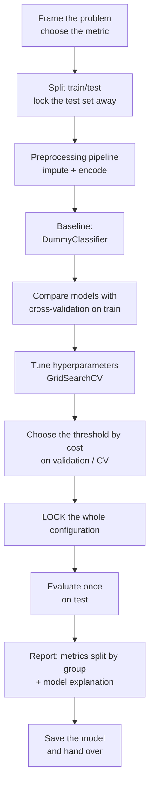

> **Learning objectives:** After this lesson, you will be able to run a complete machine learning project on real data - from choosing a metric for a class-imbalanced problem, building a pipeline, comparing models with cross-validation, choosing a threshold by cost, explaining the model, and checking for gaps between groups, all the way to handover.

## 1. The problem, the data, and the questions to ask before writing code

The `adult` dataset has been with us throughout the chapter: 48,842 profiles drawn from a 1994 US census survey, each with age, years of education, occupation, marital status, hours worked per week and a few other fields; the label is whether annual income exceeds 50,000 USD. This lesson puts all the pieces together into one process that runs from start to finish.

The first job is not to pick a model but to ask: **what will this prediction be used for, and which kind of mistake is more expensive?** The same model gets configured very differently depending on what its output is for. If it is a list of people to pitch a financial product to, missing a high-income person is just one lost opportunity. If it is approving a credit limit, mistaking a low-income person for a high-income one can lead to a bad debt. In this lesson we choose the first situation: a suggestion list, so a miss is more expensive than a false alarm.

The second question: how imbalanced are the classes? Only **23.93%** of profiles earn over 50K. That means a model that blindly guesses "everyone is under 50K" already reaches 76.07% accuracy without knowing anything. Foundations · Lesson 15 warned about exactly this situation, so the metric set for this lesson is **precision, recall, F1 and ROC-AUC**, with accuracy only for reference.

```python
from sklearn.datasets import fetch_openml
from sklearn.model_selection import train_test_split

ad = fetch_openml("adult", version=2, as_frame=True)
df = ad.frame
y  = (df.pop("class") == ">50K").astype(int)
X  = df.drop(columns=["education"])     # duplicates the information in education-num
X_train, X_test, y_train, y_test = train_test_split(
    X, y, test_size=0.2, stratify=y, random_state=42)
```

`stratify=y` keeps the same 23.93% ratio in both parts - important when the positive class is only a quarter of the data. We get 39,073 training rows and 9,769 test rows. This test set will **not be touched** until section 6; every decision from here to there is based on cross-validation on the training set.

A few observations worth noting before starting: the `education` column is the text version of `education-num`, so we drop one of the two; three columns, `workclass`, `occupation` and `native-country`, have missing values (2,799, 2,809 and 857 rows respectively); the `fnlwgt` column is the survey's sampling weight, not an attribute of the person surveyed - lessons 07 and 11 already showed it is useless for prediction, and we keep it so that section 6 can verify this one last time.

## 2. The whole process at a glance



This order has its reasons, and one rule governs all of it: **everything you *choose* must be chosen before the test set is opened.**

The baseline comes before any model so that you always know what "doing nothing" scores. Cross-validation comes before the test set so that comparisons do not wear it out. The threshold comes after the model is settled - because changing the threshold does not require retraining - but it still has to come **before** the test set, because choosing a threshold is also a choice.

After locking the configuration and opening the test set, you are still allowed to **look** at a great deal: break the metrics down by group, run permutation importance, read the confusion matrix. The boundary lies elsewhere: *looking* in order to report and explain is fine; but the moment you look at the test results and then **change** something - drop a column, move the threshold, pick a different model - you have just used the test set to choose, and the test number is no longer an honest estimate. At that point you have to go back to the development data, and you need another clean test set if you want to report again.

Section 6 below starts with a threshold sweep table *on the test set* - but only so that you can **see** the trade-off; the **choosing** of the threshold is done properly in section 5.2, with cross-validation on train. Section 8 examines the gaps between groups on the test set, and that is *reporting*, not choosing - exactly the boundary just described.

## 3. Preprocessing: two branches for two kinds of model

`adult` has 6 numeric columns and 7 text columns, with missing values. Lesson 11 explained why two different encodings are needed. Linear models need one-hot encoding and need scaling. Tree models do not need scaling, and we use ordinal encoding for them so the table does not balloon to 89 columns.

```python
from sklearn.compose import ColumnTransformer
from sklearn.pipeline import Pipeline
from sklearn.impute import SimpleImputer
from sklearn.preprocessing import StandardScaler, OneHotEncoder, OrdinalEncoder
from sklearn.ensemble import HistGradientBoostingClassifier

num_cols = ["age", "fnlwgt", "education-num",
            "capital-gain", "capital-loss", "hours-per-week"]
cat_cols = [c for c in X.columns if str(X[c].dtype) == "category"]

prep_lin = ColumnTransformer([
    ("num", Pipeline([("imp", SimpleImputer(strategy="median")),
                      ("sc",  StandardScaler())]), num_cols),
    ("cat", Pipeline([("imp", SimpleImputer(strategy="most_frequent")),
                      ("oh",  OneHotEncoder(handle_unknown="ignore"))]), cat_cols)])

prep_tree = ColumnTransformer([
    ("num", SimpleImputer(strategy="median"), num_cols),
    ("cat", Pipeline([("imp", SimpleImputer(strategy="most_frequent")),
                      ("oe",  OrdinalEncoder(handle_unknown="use_encoded_value",
                                             unknown_value=-1))]), cat_cols)])

pipe_tree = Pipeline([("p", prep_tree),
                      ("m", HistGradientBoostingClassifier(random_state=42))])
```

`handle_unknown="ignore"` and `unknown_value=-1` handle the situation where a new profile carries a value never seen during training - almost certain to happen with the `native-country` column and its 41 values.

> ⚠️ **A small note:** ordinal encoding here is a pragmatic choice, not a rule. It maps `occupation` to 0-13, and the tree may split at "occupation ≤ 2.5" - a threshold that means nothing, since that order is decided by the alphabet rather than by the nature of the jobs. The tree compensates by splitting several more times to separate the groups again, so it is harmed less than a linear model would be, but it is still a forced fit.
>
> `HistGradientBoostingClassifier` accepts categorical columns **directly** through the `categorical_features` parameter - it splits by *groups of values* instead of by a numeric threshold. This has been available since version 0.24; from 1.4 there is the additional `"from_dtype"` option (automatically recognizing pandas `category` columns), and from 1.6 `"from_dtype"` became the default - so with scikit-learn 1.7 you do not need to declare anything. The `adult` dataset loaded with `fetch_openml(as_frame=True)` already comes with the `category` dtype, so `HistGradientBoostingClassifier().fit(X_train, y_train)` is all it takes - passing it through `OrdinalEncoder` first actually disables that very feature, because the result becomes an array of floats.
>
> Trying both on `adult`: the `OrdinalEncoder` approach gives a cross-validation ROC-AUC of **0.9273**, letting the model recognize the categorical columns itself gives **0.9284** - a difference of 0.001, smaller than the standard deviation across folds (±0.0026). On the test set it is the other way round: 0.9296 versus 0.9294. In other words, on this dataset the two approaches tie; the lesson keeps `OrdinalEncoder` so that the two preprocessing branches stay symmetric and easy to read. On data with higher-cardinality categorical columns, declaring them directly is usually worth trying first.

## 4. Four models, compared with cross-validation

5-fold cross-validation on the training set, scored by ROC-AUC:

| Model | ROC-AUC (CV on train) |
|---|---|
| Logistic regression | 0.9055 ± 0.0037 |
| Random Forest (300 trees, `min_samples_leaf=5`) | 0.9178 ± 0.0032 |
| HistGradientBoosting | **0.9273 ± 0.0024** |

The standard deviation across folds is around 0.003, while the gaps between models are 0.01-0.02 - many times larger, so this ranking is not down to luck. If two models differed by only 0.002, the conclusion "this one is better" would not hold up, and in that case you should choose the simpler one.

This order matches what lesson 07 discussed: on tabular data with text columns and non-linear relationships, gradient boosting usually leads. We choose `HistGradientBoostingClassifier` as the main candidate.

## 5. Tuning and choosing the threshold - the test set stays locked

Two final choices remain: the set of hyperparameters, and the decision threshold. Both are *choices*, so both must be settled before the test set is opened.

### 5.1. Hyperparameters: chosen by cross-validation

```python
from sklearn.model_selection import GridSearchCV

grid = {"m__learning_rate": [0.05, 0.1],
        "m__max_leaf_nodes": [15, 31, 63],
        "m__min_samples_leaf": [20, 50]}
gs = GridSearchCV(pipe_tree, grid, cv=5, scoring="roc_auc", n_jobs=-1).fit(X_train, y_train)
best_model = gs.best_estimator_
```

12 combinations × 5 folds = 60 training runs, taking about 14 seconds. Best result: `learning_rate=0.1`, `max_leaf_nodes=31`, `min_samples_leaf=20` - **exactly the default values**, AUC 0.9273. The worst combination in the grid reached 0.9221. The whole grid spans only about 0.005.

This is a result to state plainly rather than hide. In this project, hyperparameter tuning contributed nothing, while switching from logistic regression to gradient boosting raised AUC from 0.9055 to 0.9273. The priority order to take away: data quality and features first, choice of model family second, tuning last - and in this project tuning was the smallest contribution. Do not turn a single measurement into a law; with a different model or a wider grid, the conclusion may be different.

### 5.2. The threshold: chosen by cross-validation, without touching the test set

The model outputs a probability; 0.5 is only the default mark, not the truth. Changing the threshold does not require retraining, only comparing `predict_proba` against a different number - but choosing that number is still a choice, so it still has to be done on the training data.

The tool is `cross_val_predict`: it runs 5 folds and returns, for every training row, the probability predicted by a model that **has never seen that row**. We get 39,073 "clean" probabilities to sweep thresholds on, while the test set stays untouched.

```python
from sklearn.model_selection import cross_val_predict, StratifiedKFold
from sklearn.metrics import confusion_matrix
import numpy as np

cv  = StratifiedKFold(5, shuffle=True, random_state=42)
oof = cross_val_predict(best_model, X_train, y_train, cv=cv,
                        method="predict_proba")[:, 1]

C_FN, C_FP = 10, 1                       # a miss costs 10 times as much as a false alarm
grid = np.arange(0.02, 0.61, 0.01)
cost = [confusion_matrix(y_train, (oof >= t).astype(int))[1,0] * C_FN
      + confusion_matrix(y_train, (oof >= t).astype(int))[0,1] * C_FP for t in grid]
threshold = grid[int(np.argmin(cost))]   # → 0.09
```

The cost over the 39,073 out-of-fold probabilities (out-of-fold AUC 0.9273), assuming a miss costs 10 times as much as a false alarm - exactly the suggestion list situation in section 1:

| Threshold | 0.05 | 0.08 | **0.09** | 0.10 | 0.15 | 0.30 | 0.50 |
|---|---|---|---|---|---|---|---|
| False alarms (FP) | 12,333 | 10,217 | 9,656 | 9,183 | 7,436 | 4,251 | 1,727 |
| Misses (FN) | 205 | 357 | 412 | 461 | 698 | 1,701 | 3,261 |
| **Cost** | 14,383 | 13,787 | **13,776** | 13,793 | 14,416 | 21,261 | 34,337 |

The cheapest threshold is **0.09**, chosen entirely on the training data. This number also matches a formula: if there are only two kinds of cost and the probability the model outputs is a **calibrated** probability, the theoretical threshold is $c_{FP} / (c_{FP} + c_{FN}) = 1/11 \approx 0.09$.

> ⚠️ **A small note:** the word "calibrated" above is a real condition, not a hedge. A **well-calibrated** model is one where, among the profiles it scores 0.30, roughly 30% really are over 50K. Many models are not like this - they rank correctly but the probability numbers are off, and then the formula above points to the wrong threshold. How to check: split the predictions into 10 bins by probability and compare each bin's mean probability with the true rate (`sklearn.calibration.calibration_curve`). The model here is off by 0.007 on average - very close, and that is why the theoretical threshold of 0.09 coincides with the threshold that cross-validation found. If the model is off by a lot, wrap it in `CalibratedClassifierCV` before using the formula, or drop the formula and sweep the cost directly on a validation set.

> ⚠️ **A small note:** scikit-learn has a ready-made `TunedThresholdClassifierCV` that does exactly the procedure of section 5.2 in one class: it sweeps the threshold with internal cross-validation according to a metric or a cost function you pass in. Its documentation also warns about exactly what this section has just demonstrated: do not tune the threshold on the same data used to fit the model.

At this point **every choice has been made**: the preprocessing pipeline, the model family, the hyperparameters, the threshold. Lock it all.

## 6. Opening the test set exactly once

Only now does the test set get its turn - and this is the only time it is read.

| Model | Accuracy | Precision | Recall | F1 | ROC-AUC |
|---|---|---|---|---|---|
| Always predict "≤ 50K" | 0.7607 | - | 0.000 | 0.000 | 0.500 |
| Logistic regression | 0.8523 | 0.738 | 0.594 | 0.658 | 0.9036 |
| Random Forest | 0.8677 | 0.788 | 0.613 | 0.689 | 0.9199 |
| HistGradientBoosting | **0.8761** | 0.792 | 0.654 | **0.717** | **0.9296** |

The first row shows why accuracy on its own is a dangerous metric here: the empty model reaches 76.07% but has a recall of 0 - it does not find a single high-income profile. The best model beats it by 11.5 accuracy points, but the number that matters is recall going from 0 to 0.654.

| | predicted ≤ 50K | predicted > 50K |
|---|---|---|
| **actual ≤ 50K** | 7,029 | 402 |
| **actual > 50K** | 808 | 1,530 |

808 high-income profiles are missed, 402 profiles are false alarms. For the situation in section 1 - a miss is more expensive than a false alarm - this balance is tilted the wrong way.

Applying the threshold of 0.09 chosen in section 5.2:

| Threshold used on test | Accuracy | Precision | Recall | Cost |
|---|---|---|---|---|
| 0.50 (default) | 0.8761 | 0.792 | 0.654 | 8,482 |
| **0.09 (chosen by CV)** | 0.7449 | 0.483 | **0.955** | **3,437** |

The cost falls from 8,482 to 3,437 - more than half - just by changing one number, with no retraining at all.

> 🔧 **Try it now:** if you were allowed to cheat, that is, to sweep the threshold directly on the test set, how much more would you save?
> The cheapest threshold on test is 0.12, with a cost of 3,396. The threshold of 0.09 chosen by the proper procedure gives 3,437 - **1.2% more expensive**. That is the entire price of doing things cleanly, and it is almost zero. In return, 3,437 is an honest estimate of the cost you will bear in deployment, while 3,396 is not - it was chosen to look good on the very set used for scoring.
>
> There is a formula for this: if there are only two kinds of cost and the probability the model outputs is a **calibrated** probability, then the theoretical threshold is $c_{FP} / (c_{FP} + c_{FN}) = 1/11 \approx 0.09$ - exactly the number cross-validation found. That is no accident: the section below measures that this model is very well calibrated.

The table below lays out the whole trade-off across thresholds, read on the test set. It is a **report**, not a place to choose - the threshold has been fixed since section 5.2:

| Threshold | Precision | Recall | F1 | Profiles selected |
|---|---|---|---|---|
| 0.3 | 0.648 | **0.822** | 0.725 | 2,967 |
| 0.4 | 0.729 | 0.736 | **0.732** | 2,359 |
| 0.5 | 0.792 | 0.654 | 0.717 | 1,932 |
| 0.6 | 0.845 | 0.552 | 0.668 | 1,526 |
| 0.7 | 0.904 | 0.457 | 0.607 | 1,182 |
| 0.8 | **0.966** | 0.349 | 0.512 | 844 |

This table reads as plain sentences. Threshold 0.8: of the 844 profiles selected, 96.6% are correct - but almost two thirds of the high-income people are missed. Threshold 0.3: it catches 82.2% of the people we are looking for, but in exchange more than one in every three profiles on the list is a false alarm.

## 7. What the model is relying on

Lesson 11 explained why to use permutation importance instead of `feature_importances_`. The drop in ROC-AUC when each column is shuffled on the test set (multiplied by 1,000):

| Column | capital-gain | age | education-num | marital-status | hours-per-week | relationship | capital-loss |
|---|---|---|---|---|---|---|---|
| AUC drop | 65.5 | 48.9 | 33.2 | 29.1 | 14.3 | 13.9 | 13.0 |

| Column | occupation | sex | workclass | fnlwgt | race | native-country |
|---|---|---|---|---|---|---|
| AUC drop | 9.5 | 2.1 | 1.9 | 1.4 | 1.0 | 0.5 |

This table is both an explanation tool and a **leakage check**. The rule: when a column contributes an unusually large amount, ask two questions - at the moment of a real prediction, did that column already exist; and is it part of the very thing we are predicting. A churn-prediction model whose most important column is `account_closing_date` is not a good model, it is a model reading the answer.

Apply that question to `capital-gain` - the column at the top of the table - and the result is not as clean as we would like. Capital gains are a *component* of income, and income is precisely what is being predicted:

| | rows | share > 50K |
|---|---|---|
| `capital-gain` > 5,000 | 2,451 | 90.1% |
| `capital-gain` > 7,298 | 1,690 | 98.3% |
| `capital-gain` = 99,999 | 244 | **100%** |

All 244 profiles with a capital gain of 99,999 belong to the over-50K group, without a single exception. For those rows the model hardly has to predict anything: the input column and the label overlap by definition.

Whether this is leakage depends on another question: **at the moment a prediction is needed in practice, is the capital gain figure already available?** If the system is used to estimate the income of a person whose tax return has already been filed, the column is legitimate, just strong in a somewhat trivial way. If it is used to forecast *future* income, the column does not exist yet, and the model will collapse as soon as it is deployed. This is not a bug in your code but a property of the dataset, yet it still has to go into the handover documentation: part of the accuracy comes from a definitional relationship rather than from a learned pattern. If the model is taken to another setting, where capital gains are not part of the definition of income, that part of the accuracy will disappear.

`fnlwgt` closes the story that began in lesson 07: 1.4 thousandths of AUC, i.e. almost no contribution at all, even though the random forest's `feature_importances_` once ranked it very high. This is the final piece of evidence that measuring importance by the number of tree splits is biased towards columns with many distinct values.

## 8. Checking for gaps between groups

The model reaches an AUC of 0.9296 on the whole test set. The next question: does it work *evenly* across different groups of people? Breaking down the results at threshold 0.5:

| Group | Profiles | Actual share > 50K | Predicted share > 50K | Recall | Precision |
|---|---|---|---|---|---|
| Female | 3,259 | 11.1% | 8.1% | **0.587** | 0.800 |
| Male | 6,510 | 30.4% | 25.6% | **0.667** | 0.791 |
| Black | 968 | 13.3% | 8.5% | 0.558 | 0.878 |
| White | 8,312 | 25.3% | 21.2% | 0.663 | 0.791 |
| Asian-Pac-Islander | 311 | 26.4% | 24.4% | 0.646 | 0.697 |

(The names of the racial groups are kept as the original values in the data; groups with fewer than 200 profiles in the test set are not listed because the numbers are too small to read.)

Precision is almost identical between men and women (0.79 versus 0.80): when the model says "over 50K", it is equally reliable. But recall differs by 8 points - among women who really do earn over 50K, the model misses noticeably more. A gap in recall (also called the true positive rate) between groups is precisely the fairness criterion named **equal opportunity**. If the output is used to pick a list of people to invite to a beneficial program, this gap means that more eligible women get left out.

The first reflex is usually to drop the sensitive column. Let's try:

| Configuration | Accuracy | ROC-AUC | Recall (female) | Recall (male) | Gap |
|---|---|---|---|---|---|
| Unchanged | 0.8761 | 0.9296 | 0.587 | 0.667 | +0.079 |
| Drop `sex` and `race` | 0.8753 | 0.9281 | 0.593 | 0.663 | +0.070 |
| Also drop `relationship`, `marital-status` | 0.8545 | 0.8914 | 0.507 | 0.524 | +0.017 |

Dropping `sex` and `race` changes almost nothing: the gap only goes from 0.079 down to 0.070. The reason is that the remaining columns still carry that information - `relationship` has the values "Husband" and "Wife", and so does `marital-status`. Deleting the label does not delete the information. Dropping both of those columns too brings the gap down to 0.017, but AUC falls from 0.9296 to 0.8914 - a price paid in prediction quality for everyone.

The table above does not provide a solution; it shows that this is a trade-off that needs a human decision, not a bug to be fixed in code.

There is one more layer underneath: the data itself. The *Retiring Adult* study by Frances Ding, Moritz Hardt, John Miller and Ludwig Schmidt (NeurIPS 2021) points out that the 50,000 USD threshold in the `adult` dataset is an arbitrary choice. Median income in the US in 1994 was 26,000 USD; 50,000 USD falls at the 76th percentile of the whole population, but at the 88th percentile among Black people and the 89th percentile among women. That means almost all profiles from these two groups fall below the threshold, and a model trained on `adult` in fact has *higher* accuracy on those very groups - the authors measured 85% overall accuracy but 91.4% on the Black group and 92.7% on the female group. They call this an unusual situation, because machine learning models usually perform worse on disadvantaged groups.

The lesson reaches beyond the `adult` dataset: **an aggregate metric can hide very different behavior across groups, and the way the label is defined can itself create the gap.** Breaking metrics down by group is something to do before handover, not after a complaint.

> ⚠️ **A small note:** this data is from 1994 and does not describe the current situation of any country. It is a good learning dataset because it is large enough, has both numeric and text columns, has missing values and class imbalance - not a source for drawing conclusions about income. The *Retiring Adult* group themselves published the `folktables` package, based on recent years of US census data, as a replacement.

## 9. Handover

```python
import joblib
joblib.dump(gs.best_estimator_, "model_final.joblib")   # ≈ 359 KB
```

`joblib.dump` saves **the whole pipeline**, not just the model. That 359 KB file contains the medians used to fill missing values, the encoding tables for the text columns and every tree of the gradient boosting model. The recipient only needs `joblib.load` and then `predict` on a **raw** data table - no preprocessing step has to be rebuilt, so there is no chance of rebuilding it wrong.

Alongside the model file, the things that should be handed over:

- **The chosen metric and threshold**, with the reasoning and with where it was chosen: "threshold **0.09**, found by minimizing cost on the out-of-fold probabilities of 5-fold cross-validation on the training set, with a miss : false alarm cost ratio of 10 : 1; measured on a held-out test set of 9,769 profiles, it gives precision 0.483 and recall 0.955." Note that this number is very different from the default 0.5 - and also different from 0.4, where F1 is highest, because F1 knows nothing about your cost ratio.
- **Library versions** (`scikit-learn 1.7.2`, `pandas 2.3.3`, `numpy 2.2.6`) and the `random_state` used. A model saved with this version is not guaranteed to load with another.
- **A description of the training data**: source, time period, size, share of the positive class, columns with missing values.
- **The per-group metrics table** from section 8, with a note on the recall gap.
- **The list of input columns**, with the exact names and types.
- **Alert thresholds**: when to retrain. The real data distribution will gradually drift away from the training data; the share of positive predictions and the distribution of the input columns should be monitored over time.

> 🔧 **Try it now:** three months after deployment, the share of profiles the model labels "> 50K" rises from 20% to 32%, while the model has not been retrained at all. Name two completely different causes that could produce this, and how would you check for each?
> (a) The customer population has changed - for instance, a new acquisition channel is pulling in a more highly educated group. Check by comparing the distribution of each input column between the new data and the training data. (b) An input column is broken on the engineering side - a unit changed, missing values filled with 0 instead of the median, a category renamed so it falls into the `handle_unknown` branch. Check by comparing the rate of missing values and unfamiliar values day by day. Both make the predictions drift without any error message, so you have to measure proactively.

## Lesson summary

- Choose the metric by the consequence of each kind of error, before writing the first line of code; with 23.93% class imbalance, accuracy alone is misleading - the empty model already reaches 76.07%.
- The baseline comes before any model; cross-validation on train decides every choice; the test set is opened exactly once at the end.
- On `adult`, choosing the model family contributes far more than hyperparameter tuning: switching models raised AUC from 0.9055 to 0.9273, while the whole 12-combination grid spans only 0.005 and the defaults won.
- The decision threshold is a business choice, not the constant 0.5: from threshold 0.3 to 0.8, precision goes from 0.648 up to 0.966 while recall goes from 0.822 down to 0.349.
- Choose the threshold with **cross-validation on train** (out-of-fold probabilities), not by sweeping on test: with a miss costing 10 times as much as a false alarm, this gives a threshold of 0.09 and cuts the cost on test from 8,482 to 3,437. Cheating by sweeping directly on test would give 3,396 - **only 1.2% better**, so doing it cleanly costs almost nothing.
- Permutation importance serves both to explain and to check for leakage: the most important column must be checked for whether it exists at the moment of a real prediction, and whether it is part of the label itself - all 244 profiles with `capital-gain` = 99,999 belong to the over-50K group.
- An aggregate metric hides gaps between groups - recall 0.587 for women versus 0.667 for men - and dropping the sensitive column does not remove the gap because other columns still carry that information.
- Hand over the whole pipeline with `joblib`, together with the metric, threshold, library versions, data description and monitoring plan.

## Self-check questions

1. A problem has 2% positive samples. A colleague boasts that their model reaches 98% accuracy. What is the first question you ask back, and why?
2. Why must the test set be locked away until the end, when cross-validation on train already gives a fairly good estimate?
3. Your grid search returns exactly the default values as the best. Is that a sign you did something wrong, or a normal result? Where should you invest your effort next?
4. A bank says: "one wrong loan loses 10 million, one good customer wrongly rejected loses 1 million." How do you run the procedure in section 5.2 to choose a threshold, and what additional information do you need? Why not use the threshold table in section 6?
5. Your churn-prediction model's most important column is `number_of_call_centre_calls_this_month`. State what you need to verify before trusting the result.
6. The model reaches an AUC of 0.93 overall, but recall for customers under 25 is only half that of the other groups. How do you report this, and what options do you offer the decision maker?

## Further reading

**Foundational sources for this lesson:**

| Source | Which part to read |
|---|---|
| **An Introduction to Statistical Learning (ISLP)** | Section 4.4.2 - confusion matrix, sensitivity/specificity and the effect of changing the threshold (Tables 4.7-4.8, Figure 4.8); section 5.1 - cross-validation; section 8.2.3 - gradient boosting |
| **scikit-learn User Guide** | Section 3.4 *Metrics and scoring* - precision/recall/F1, ROC-AUC, `classification_report`; section 3.2 *Tuning the hyper-parameters* - `GridSearchCV` on a pipeline; section 4.2 *Permutation feature importance*; section 9.1 *Model persistence* - the warning about version compatibility when saving with `joblib` |
| **Foundations · Lesson 15** | Choosing a metric by consequence, the decision threshold, and why accuracy misleads when classes are imbalanced |

**Additional online sources (free):**

- [3.4. Metrics and scoring - scikit-learn User Guide](https://scikit-learn.org/stable/modules/model_evaluation.html) - definitions and how to choose each metric.
- [Tuning the decision threshold for class prediction](https://scikit-learn.org/stable/modules/classification_threshold.html) - `TunedThresholdClassifierCV`, a tool for choosing the threshold by cross-validation instead of sweeping by hand on the test set.
- [Post-tuning the decision threshold for cost-sensitive learning](https://scikit-learn.org/stable/auto_examples/model_selection/plot_cost_sensitive_learning.html) - an example of converting thresholds into real costs.
- [Model persistence - scikit-learn](https://scikit-learn.org/stable/model_persistence.html) - `joblib`, `skops`, and the risks of loading models from untrusted sources.
- [Ding, Hardt, Miller, Schmidt - Retiring Adult: New Datasets for Fair Machine Learning (NeurIPS 2021)](https://proceedings.neurips.cc/paper/2021/hash/32e54441e6382a7fbacbbbaf3c450059-Abstract.html) - the analysis of the 50,000 USD threshold in section 8; the [folktables library](https://github.com/zykls/folktables) is the replacement dataset published by this group.
- [Barocas, Hardt, Narayanan - Fairness and Machine Learning (fairmlbook.org)](https://fairmlbook.org/) - free book; chapter 3 defines demographic parity and equal opportunity, used in section 8.
- [Adult - OpenML](https://www.openml.org/d/1590) - description of the dataset, the meaning of each column and its history.

## Closing the Machine Learning chapter

The twelve lessons just completed follow one thread.

**Lesson 01** ran the whole process on real data before explaining any algorithm, so that you had a skeleton to hang everything else on. **Lessons 02 to 08** opened up the models one by one: linear and logistic regression for simple relationships readable through coefficients, regularization when there are more columns than data, k-NN learning by memory, decision trees trading accuracy for explainability, random forests and gradient boosting combining many unstable trees into one sturdy model, SVMs finding the boundary with the widest margin. **Lessons 09 and 10** took the labels away: clustering groups things when nobody has labeled them, PCA compresses many columns into a few while keeping most of the information. **Lessons 11 and 12** returned to the part of a real project that takes the most time - preparing data, packaging the process, and the decisions that are not in any algorithms textbook: choosing a metric, choosing a threshold, checking for gaps between groups, handing over.

A few things came up often enough to be worth carrying with you:

- **Baseline first, model second.** Without "predict the mean" or a `DummyClassifier` to compare against, every number is meaningless.
- **Every transformation learned from data is `fit` on train.** Lesson 11 measured it: forget this, and a random numeric column reaches an AUC of 0.88.
- **Scale for methods based on distance or variance** (k-NN, SVM, k-means, PCA, linear models with regularization), not needed for tree models.
- **In this project, data and the choice of model mattered more than tuning.** Measured: switching model families raised AUC by 0.022; sweeping 12 hyperparameter combinations raised it by 0.000. Do not turn a single measurement into a law - with a different model or a wider grid, tuning may be worth much more.
- **Aggregate metrics hide the details.** Break down by group, look at the confusion matrix, look at the worst-wrong rows.

This whole chapter worked on **tabular data** - tables with rows and columns, where every column already carries a meaning assigned by a human: age, years of education, number of bedrooms. On that kind of data, the methods just learned remain the go-to choices, and gradient boosting is usually hard to beat.

But there are kinds of data where this approach runs out of steam. A 224×224 pixel image is 150,528 numbers, and none of them carries any meaning on its own - whether pixel number 74,311 is bright or dark says nothing. A Vietnamese sentence is a sequence of words of variable length, where the order decides the meaning. For data like that, sitting down to craft features by hand as in lesson 11 becomes impossible, and the question changes to: can the model **learn the features itself** from raw data?

That is where the **Deep Learning** chapter begins.

> **Next lesson:** [Where Linear Models Give Up](../where-linear-models-give-up/) - the Deep Learning chapter starts here.
