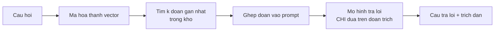

> **Mục tiêu bài học:** Sau bài này, bạn sẽ dựng được một hệ RAG hoàn chỉnh, và - quan trọng hơn - biết **đánh giá nó hai tầng riêng biệt** để khi hệ trả lời sai thì bạn biết chính xác sai ở đâu. Kho tri thức là 51 bài của bốn chương trước, nên bạn kiểm chứng được mọi câu trả lời.

## 1. Ghép mười một bài lại

Bài 09 kết luận: mô hình bịa vì nó được huấn luyện để sinh chuỗi *trông hợp lý*, và cách chữa là **đưa tài liệu thật vào**. Bài 10 dựng nửa đầu của cơ chế ấy: tìm đoạn tài liệu liên quan bằng embedding.

Bài này ghép thành một hệ hoàn chỉnh - **RAG** (retrieval-augmented generation, sinh có truy hồi):



**Kho tri thức:** 51 bài của Foundations, Machine Learning, Deep Learning và Computer Vision - 886 nghìn ký tự. Chọn nó có chủ đích: bạn đã đọc toàn bộ, nên kiểm chứng được từng câu trả lời thay vì phải tin.

## 2. Vì sao phải đánh giá hai tầng

Đây là quyết định thiết kế quan trọng nhất của bài.

Cách đánh giá tự nhiên nhất là hỏi vài câu rồi đọc câu trả lời xem có đúng không. Cách ấy **không phân biệt được hai nguyên nhân hoàn toàn khác nhau**:

- Hệ tìm **sai tài liệu** → mô hình trả lời đúng theo tài liệu sai
- Hệ tìm **đúng tài liệu** → mô hình vẫn trả lời sai

Hai nguyên nhân ấy cần hai cách chữa khác hẳn: cái đầu sửa ở khâu cắt đoạn và mô hình embedding, cái sau sửa ở prompt hoặc đổi mô hình. Nhìn câu trả lời cuối thì không biết phải sửa đâu.

Nên ta đo tách:

| Tầng | Đo gì | Thước đo |
|---|---|---|
| **1. Truy hồi** | **bài** chứa đáp án có nằm trong $k$ kết quả đầu không | **article hit@k** |
| **2. Sinh** | câu trả lời có bám tài liệu không, có trích dẫn đúng không, có biết từ chối không | kiểm từng ca |

Để đo tầng 1 cần **bộ câu hỏi có nhãn**: 20 câu, mỗi câu ghi rõ đáp án nằm ở bài nào.

> ⚠️ **Gọi tên thước đo cho đúng.** Nhãn ở đây chỉ nói *bài nào* chứa câu trả lời, không nói *đoạn nào*. Nên thứ ta đo được là **article hit@k** - trong $k$ đoạn đầu có ít nhất một đoạn thuộc đúng bài hay không - chứ **không phải Recall@k ở mức đoạn**, vốn đòi biết chính xác đoạn nào chứa câu trả lời. Khác biệt là thật: ba đoạn lấy từ đúng bài mà không đoạn nào chứa phần trả lời thì article hit@k vẫn tính là thành công, trong khi mô hình ở tầng 2 không có gì để dựa vào.

Muốn đo Recall@k thật thì phải gán nhãn **từng đoạn** cho từng cấu hình cắt - mà ranh giới đoạn đổi theo cấu hình, nên phải gán lại bốn lần. Ta chấp nhận thước đo yếu hơn, và **gọi nó bằng đúng tên**.

```
"IoU được tính như thế nào?"          → Computer Vision · Bài 07
"ReLU chết là hiện tượng gì?"          → Deep Learning · Bài 02
"Ridge và Lasso khác nhau ở chỗ nào?"  → Machine Learning · Bài 04
```

## 3. Tầng 1: cắt đoạn thế nào thì tìm tốt nhất

Cắt tài liệu thành đoạn là tham số thiết kế đầu tiên, và nó có đánh đổi thật: đoạn dài thì mang đủ ngữ cảnh nhưng vector bị pha loãng; đoạn ngắn thì vector sắc nét nhưng có thể cắt mất phần trả lời.

Thử bốn cấu hình trên cùng 20 câu hỏi:

| Cấu hình | Số đoạn | hit@1 | hit@3 | hit@5 |
|---|---|---|---|---|
| 800 ký tự, không chồng | 1.125 | 0,80 | 0,90 | **1,00** |
| **800 ký tự, chồng 200** | 1.492 | **0,85** | 0,95 | 0,95 |
| 1.500 ký tự, chồng 200 | 701 | 0,75 | 0,90 | 0,95 |
| **400 ký tự, chồng 100** | 2.954 | 0,80 | **1,00** | **1,00** |

Bốn điều đọc ra:

**Truy hồi tìm đúng bài rất tốt.** Với $k=3$, ba trong bốn cấu hình đạt từ 0,90 trở lên, và cấu hình 400 ký tự đạt **1,00** - tức cả 20 câu đều có **ít nhất một đoạn thuộc đúng bài** trong ba kết quả đầu. Đúng như callout ở trên đã cảnh báo, đó *chưa* phải "đoạn đúng": thước đo này không biết đoạn ấy có chứa phần trả lời hay không.

**Đoạn dài có vẻ hại nhiều hơn lợi.** Cấu hình 1.500 ký tự cho **điểm ước lượng thấp nhất hoặc đồng thấp nhất ở cả ba mức $k$**. Đó là xu hướng đáng chú ý vì nó nhất quán qua cả ba mức - nhưng 20 câu hỏi thì vẫn quá ít để khẳng định nó **thật sự** kém hơn: riêng ở hit@3 và hit@5 nó chỉ đồng hạng cuối, và một câu hỏi đổi chiều là bảng đổi thứ tự. *Vì sao* thì bảng lại càng không nói. Giải thích hợp lý nhất là một đoạn dài trộn nhiều chủ đề nên vector của nó không còn đại diện rõ cho chủ đề nào, đúng cơ chế bài 10 đã dựng - nhưng bộ này không kiểm được chính cơ chế ấy.

**Chồng lấn nhích hit@1 lên.** 800 ký tự chồng 200 đạt 0,85 so với 0,80 khi không chồng. Giả thuyết quen thuộc là chồng lấn giảm nguy cơ phần trả lời bị cắt ngang ranh giới đoạn - nhưng chênh lệch 0,05 ở đây đúng bằng **một câu hỏi**, và thước đo ở mức bài không nhìn được ranh giới đoạn, nên nó không kiểm chứng được giả thuyết ấy. Đổi lại số đoạn tăng 33%, tức tốn thêm bộ nhớ và thời gian mã hóa.

**Không cấu hình nào thắng ở mọi mức $k$.** Cấu hình 800-chồng-200 tốt nhất ở $k=1$ nhưng thua ở $k=5$; cấu hình 400 ký tự ngược lại. Chọn cái nào tùy bạn định đưa bao nhiêu đoạn vào prompt - mà điều đó lại phụ thuộc cửa sổ ngữ cảnh và chi phí token, tức quay về đúng bài 02.

> ⚠️ **Lưu ý nhỏ:** 20 câu hỏi là một bộ rất nhỏ. Chênh lệch 0,05 giữa hai cấu hình đúng bằng **một câu hỏi trong hai mươi**, nên bảng này không đủ để xếp hạng các cấu hình. Cấu hình 1.500 ký tự cho điểm ước lượng thấp nhất hoặc **đồng** thấp nhất ở cả ba mức $k$ - xu hướng đáng chú ý, nhưng phải có tập đánh giá lớn hơn mới biết đó có phải khác biệt thật hay không. Thứ bảng nói được thoải mái hơn là truy hồi **nhìn chung hoạt động tốt trên kho này**: mọi cấu hình đều đưa đúng bài vào top 5 ở ít nhất 19/20 câu. Muốn chọn cấu hình cho một hệ thật thì cần vài trăm câu hỏi có nhãn, và nhãn ấy nên do người khác gán chứ không phải người viết câu hỏi.

## 4. Tầng 2: chỗ hệ hỏng

Lấy cấu hình 800 ký tự chồng 200, đưa ba đoạn đầu vào prompt kèm yêu cầu rõ ràng:

```python
prompt = f"""Dựa CHỈ vào các đoạn trích dưới đây, trả lời câu hỏi.
Ghi số nguồn [n] sau câu trả lời.
Nếu các đoạn trích không chứa câu trả lời, hãy nói rõ là không tìm thấy.

{context_passages}

Câu hỏi: {question}
Trả lời:"""
```

Ba ca thử, và cả ba đều lộ ra vấn đề.

**Ca 1 - truy hồi đúng, trả lời lạc đề.**

Câu hỏi *"IoU tính như thế nào?"*. Truy hồi trả về đúng Computer Vision · Bài 07, nơi có công thức IoU. Mô hình trả lời:

```
Để giải quyết vấn đề này, chúng ta cần hiểu về thuật toán NMS (Non-Max Suppression).
NMS thường được sử dụng để loại bỏ những k...
```

Nó trả lời về **NMS** - một chủ đề khác nằm cùng bài. Tài liệu đúng, câu trả lời sai. **Không có trích dẫn.**

Nếu chỉ nhìn câu trả lời này, ta sẽ đi sửa khâu truy hồi - và sửa nhầm chỗ. Bảng ở mục 3 mới cho biết truy hồi đã làm đúng việc của nó.

**Ca 2 - trích dẫn một nguồn không tồn tại.**

Câu hỏi về BatchNorm. Truy hồi đúng cả ba đoạn từ Deep Learning · Bài 08. Mô hình trả lời và **có trích dẫn** - nhưng nó ghi `[4]`, trong khi prompt chỉ đưa vào **ba** đoạn được đánh số `[1]`, `[2]`, `[3]`.

Trích dẫn là thứ được thêm vào để người đọc kiểm chứng được. Một trích dẫn trỏ vào nguồn không tồn tại thì tệ hơn không có trích dẫn, vì nó tạo cảm giác đã kiểm chứng.

**Ca 3 - ca tệ nhất.**

Câu hỏi cố tình nằm ngoài kho: *"Chương này nói gì về cách nuôi cá koi trong hồ xi măng?"*. Prompt đã dặn rõ *"nếu các đoạn trích không chứa câu trả lời, hãy nói rõ là không tìm thấy"*. Mô hình trả lời:

```
Chương này nói về cách nuôi cá koi trong hồ xi măng.
```

Nó **nhại lại câu hỏi thành một khẳng định**. Không từ chối, không cảnh báo, và nghe như một câu trả lời hợp lệ.

Đây chính xác là hiện tượng bài 09 đã đo với tiền đề sai - mô hình chấp nhận tiền đề rồi tiếp tục. Và bài 10 đã dự báo nửa còn lại: bộ truy hồi **luôn trả về ba đoạn** dù kho không chứa gì liên quan, nên mô hình luôn có "tài liệu" để dựa vào.

**Hai tầng, hai kết luận ngược nhau:** truy hồi đưa đúng bài vào top 3 ở 0,95-1,00 số câu, còn phần sinh thì hỏng ở cả ba ca thử tay. Nếu đánh giá một tầng, ta đã kết luận sai hoàn toàn về chỗ cần sửa.

## 5. Toàn bộ hệ, chạy được từ đầu tới cuối

Bốn mục trên tách từng phần ra để đo. Ghép lại thì cả hệ nằm gọn trong một tệp: [`code/rag_sach.py`](../../code/generative-ai/rag_sach.py), chạy được ngay trên máy cá nhân không GPU.

```bash
python3 rag_sach.py --hoi "IoU được tính như thế nào?"   # hỏi một câu
python3 rag_sach.py --danh-gia                            # chấm article hit@k
```

Nó có đủ chuỗi mà mục 1 vẽ ra, cộng thêm hai thứ mà một hệ thật cần:

```
nạp 51 bài → cắt đoạn → mã hóa kho → mã hóa câu hỏi → tìm k đoạn gần nhất
   → dựng prompt kèm số nguồn → Qwen sinh → KIỂM TRÍCH DẪN BẰNG LUẬT
```

Phần kiểm trích dẫn là mười dòng, không cần mô hình nào:

```python
def validate_citations(answer, num_sources):
    cited_source_ids = {int(x) for x in re.findall(r"\[(\d+)\]", answer)}
    citations_in_range = cited_source_ids <= set(range(1, num_sources + 1))
    return dict(co_trich_dan=bool(cited_source_ids), hop_le=citations_in_range,
                ngoai_pham_vi=sorted(cited_source_ids - set(range(1, num_sources + 1))))
```

Prompt đưa vào $k$ đoạn đánh số từ 1 tới $k$, nên mọi số nằm ngoài khoảng đó là trích dẫn hỏng - bắt được bằng một biểu thức chính quy. Đây đúng chỗ mà ca 2 ở mục 4 đã sai với `[4]`.

Chạy thật một lần, và nó cho thêm một ca thứ tư - kiểu thất bại **khác cả ba ca thủ công ở mục 4**:

```
nguồn truy hồi:
  [1] Computer Vision/07. Phát hiện vật thể I...   (cosine 0,8630)
  [2] Computer Vision/07. Phát hiện vật thể I...   (cosine 0,8625)
  [3] Computer Vision/09. Phân đoạn ảnh...         (cosine 0,8619)

trả lời:
IoU được tính như sau:
    IoU = (Khoanh đúng + Khoanh đúng + Khoanh sai)
        / (Khoanh đúng + Khoanh sai + Khoanh đúng + Khoanh sai)

kiểm trích dẫn: {'co_trich_dan': False, 'hop_le': True, 'ngoai_pham_vi': []}
```

Truy hồi lấy đúng hai đoạn từ bài 07 chương Computer Vision, nơi có công thức IoU thật. Mô hình **bịa ra một công thức vô nghĩa** - tử số và mẫu số chứa cùng những hạng tử, và "khoanh đúng" xuất hiện hai lần. Nó cũng không trích dẫn nguồn nào.

Chú ý cách bộ kiểm đọc ca này: `hop_le=True` nhưng `co_trich_dan=False`. Luật chỉ kiểm **số nguồn có nằm trong khoảng cho phép không**; không có trích dẫn nào thì không có gì để vi phạm. Muốn bắt ca này phải thêm một luật nữa: **bắt buộc phải có ít nhất một trích dẫn**. Đây là ví dụ nhỏ cho một nguyên tắc lớn - mỗi luật chỉ bắt được đúng thứ nó kiểm, nên phải liệt kê trước các kiểu hỏng rồi mới viết luật cho từng kiểu.

> ⚠️ **Lưu ý nhỏ:** cộng cả ca này, bài có **bốn ca quan sát và bốn kiểu thất bại khác nhau** ở tầng sinh - lạc sang chủ đề khác, trích dẫn số nguồn không tồn tại, không biết từ chối câu ngoài kho, và bịa công thức dù tài liệu đưa vào là đúng. Đó không phải bốn lỗi rời rạc mà chỉ cùng một chuyện: **cấu hình 0,5B với cách prompt hiện tại chưa đủ tin cậy cho việc này**, dù tài liệu được đưa tận tay. Bốn ca thì chưa cô lập được *nguyên nhân* - chưa nói được số tham số là thủ phạm - nên hướng chữa phải thử chứ không đoán: mô hình lớn hơn, prompt chặt hơn, hoặc thêm một bước kiểm. Và đây cũng là lúc thấy giá trị của việc đo hai tầng, vì nếu không thì ta đã đi tối ưu khâu truy hồi vốn đang làm tốt.

## 6. Sửa ở đâu

Bảng chẩn đoán, theo đúng thứ tự nên làm:

| Triệu chứng | Tầng hỏng | Cách chữa |
|---|---|---|
| hit@k thấp | truy hồi | đổi cách cắt đoạn, đổi mô hình embedding, thêm tìm theo từ khóa |
| hit@k cao nhưng trả lời lạc đề | sinh | đoạn ngắn hơn và tập trung hơn; mô hình lớn hơn; prompt ràng buộc chặt hơn |
| Trích dẫn sai số nguồn | sinh | **kiểm bằng luật** - bắt trích dẫn khớp danh sách nguồn đã đưa |
| Không biết từ chối | cả hai | thêm ngưỡng ở truy hồi; thêm một bước hỏi riêng "đoạn này có chứa câu trả lời không" |

Hai dòng cuối đáng nói thêm, vì chúng là chỗ bài này nối về những bài trước.

**Trích dẫn kiểm được bằng luật.** Prompt đưa vào ba đoạn đánh số 1-3, nên mọi trích dẫn ngoài tập đó là sai - bắt được bằng một biểu thức chính quy, không cần mô hình nào. Đây đúng tinh thần chương Computer Vision · Bài 12: chỗ nào có quy luật viết ra được thì viết luật, đừng trông chờ mô hình.

**Từ chối phải được thiết kế, không phải nhắc.** Ca 3 cho thấy dặn trong prompt là không đủ. Cách chắc hơn là tách thành bước riêng: hỏi mô hình *"đoạn trích này có chứa câu trả lời cho câu hỏi không, CÓ hay KHÔNG"* trước khi cho nó viết câu trả lời. Việc phán đoán có/không dễ hơn nhiều so với việc vừa phán đoán vừa viết - và bài 08 đã cho thấy tách nhỏ việc là hướng đi khi prompt chạm trần.

> 🔧 **Thử ngay:** hệ RAG của bạn trả lời sai một câu hỏi. Bạn kiểm gì, theo thứ tự nào?
> **Trước hết in ra các đoạn đã truy hồi**, rồi hỏi một câu trước mọi câu khác: **kho có chứa câu trả lời không?**
>
> Nếu có mà đoạn đúng không được truy hồi, vấn đề ở tầng 1, và mọi nỗ lực sửa prompt đều vô ích. Nếu đoạn chứa đủ căn cứ **có** trong danh sách mà câu trả lời vẫn sai - như ca IoU, ca BatchNorm và ca chạy script - thì vấn đề ở tầng 2, và sửa cách cắt đoạn cũng vô ích.
>
> Nếu kho **vốn không chứa** câu trả lời, như ca cá koi, thì đừng quy cho tầng nào cả: ở đó không có "đoạn đúng" để mà nói. Đây là bài toán khác - **phát hiện việc không có căn cứ** - và cả hai tầng đều góp phần, vì `topk` thuần không có cách trả về rỗng còn phần sinh thì không từ chối. Chữa cũng phải chữa ở cả hai: một cách nhận biết "không có căn cứ" ở tầng 1, cộng một bước kiểm ở tầng 2.
>
> Đây là lý do bước đầu tiên khi dựng một hệ RAG không phải viết prompt mà là **ghi log lại các đoạn được truy hồi** cho mọi truy vấn. Không có log ấy thì mọi chẩn đoán về sau đều là đoán.

## Tóm tắt bài học

- **RAG** ghép truy hồi với sinh: tìm đoạn liên quan trước, rồi bắt mô hình trả lời dựa trên chúng.
- Phải **đánh giá hai tầng riêng biệt**, vì nhìn câu trả lời cuối không phân biệt được "tìm sai tài liệu" với "tìm đúng nhưng trả lời sai" - hai thứ cần hai cách chữa khác hẳn.
- Tầng 1 đo bằng **article hit@k** trên bộ câu hỏi có nhãn: 20 câu, mỗi câu biết trước đáp án nằm ở **bài** nào. Đây không phải Recall@k ở mức đoạn - nhãn không đủ chi tiết cho điều đó, và bài nói rõ chỗ ấy.
- Truy hồi **đưa đúng bài vào top 3** ở 0,90-1,00 số câu, với ba trong bốn cấu hình cắt đoạn. Đây là mức bài, không phải mức đoạn.
- Đoạn **1.500 ký tự cho điểm thấp nhất hoặc đồng thấp nhất ở cả ba mức $k$** - xu hướng nhất quán, nhưng 20 câu chưa đủ để nói đó là khác biệt thật; và cách giải thích bằng "vector trộn nhiều chủ đề" thì càng là giả thuyết chưa kiểm.
- Chồng lấn nhích hit@1 từ 0,80 lên 0,85 - đúng một câu hỏi - đổi lại 33% số đoạn.
- Tầng 2 **hỏng ở cả ba ca thử tay**: trả lời NMS khi được hỏi IoU dù tài liệu đúng; trích dẫn `[4]` khi chỉ có ba nguồn; và **nhại lại câu hỏi về cá koi thành một khẳng định** dù prompt đã dặn phải từ chối.
- Hai tầng cho hai kết luận ngược nhau - đánh giá một tầng thì sẽ sửa nhầm chỗ.
- **Trích dẫn kiểm được bằng luật**; **từ chối phải được thiết kế thành bước riêng**, không phải chỉ dặn trong prompt.
- Cả hệ nằm trong một tệp chạy được: [`code/rag_sach.py`](../../code/generative-ai/rag_sach.py), có cả cờ `--danh-gia` để chấm article hit@k.
- Cộng cả lần chạy script end-to-end thì có **bốn ca và bốn kiểu thất bại**: lạc chủ đề, trích dẫn số nguồn không tồn tại, không biết từ chối, và bịa công thức dù tài liệu đưa vào đúng. Kết luận rút được là **cấu hình 0,5B với cách prompt hiện tại chưa đủ tin cậy** - bốn ca chưa đủ để chỉ mặt số tham số là nguyên nhân.
- Bộ kiểm trích dẫn chỉ bắt được thứ nó kiểm: ca bịa công thức cho `hop_le=True` vì **không có trích dẫn nào để vi phạm**. Phải liệt kê trước các kiểu hỏng rồi viết luật cho từng kiểu.
- Việc đầu tiên khi dựng một hệ RAG là **ghi log các đoạn được truy hồi**, không phải viết prompt.

## Câu hỏi tự kiểm tra

1. Nêu hai nguyên nhân hoàn toàn khác nhau khiến một hệ RAG trả lời sai, và vì sao nhìn câu trả lời cuối không phân biệt được chúng.
2. Phân biệt **article hit@k** với **Recall@k ở mức đoạn**. Vì sao bài này chỉ đo được cái đầu, và điều đó che mất kiểu thất bại nào?
3. Nêu một cơ chế ở bài 10 có thể giải thích vì sao cấu hình 1.500 ký tự cho điểm thấp nhất hoặc đồng thấp nhất trong bảng. Bảng ở mục 3 có đủ để xác nhận cơ chế ấy không? Có đủ để khẳng định cấu hình ấy thật sự kém hơn không?
4. Chồng lấn nâng hit@1 nhưng tốn thêm 33% số đoạn. Bạn quyết định thế nào?
5. Ca "IoU" có truy hồi đúng nhưng trả lời về NMS. Nếu chỉ nhìn câu trả lời, bạn sẽ sửa nhầm chỗ nào?
6. Vì sao trích dẫn trỏ vào nguồn không tồn tại lại tệ hơn không có trích dẫn?
7. Prompt đã dặn "nếu không có thì nói không tìm thấy" mà mô hình vẫn nhại lại câu hỏi. Nêu hai cách chữa mạnh hơn việc dặn trong prompt.
8. Thiết kế bộ đánh giá hai tầng cho một hệ RAG trên tài liệu nội bộ công ty. Nêu cách lấy nhãn cho tầng 1.

## Đọc thêm

**Nguồn nền tảng của bài:**

| Nguồn | Đọc phần nào |
|---|---|
| **Bài 09 của chương này** | Vì sao mô hình bịa, và vì sao truy hồi là cách chữa |
| **Bài 10 của chương này** | Sentence embedding, cosine similarity, và chuyện bộ truy hồi luôn trả về $k$ kết quả |
| **Bài 08 của chương này** | Prompt chạm trần thì tách nhỏ việc |
| **Chương Computer Vision · Bài 12** | Ràng buộc kiểm được bằng luật; đánh giá một hệ nhiều thành phần |

**Nguồn online bổ sung (miễn phí):**

- [Lewis và cộng sự - Retrieval-Augmented Generation (NeurIPS 2020)](https://arxiv.org/abs/2005.11401) - bài đặt tên cho kiến trúc này.
- [Gao và cộng sự - Retrieval-Augmented Generation for Large Language Models: A Survey (2023)](https://arxiv.org/abs/2312.10997) - tổng quan các biến thể và chỗ từng biến thể hợp.
- [RAGAS](https://github.com/explodinggradients/ragas) - bộ thước đo tách riêng chất lượng truy hồi và chất lượng sinh, đúng tinh thần mục 2.
- [BEIR](https://github.com/beir-cellar/beir) - bộ chuẩn đánh giá truy hồi trên nhiều lĩnh vực, để đối chiếu khi bạn tự đo Recall@k.
- [Es và cộng sự - RAGAS: Automated Evaluation of Retrieval Augmented Generation (EACL 2024)](https://arxiv.org/abs/2309.15217) - cách chấm tự động độ bám tài liệu của câu trả lời.

## Kết thúc chương Generative AI

Mười hai bài vừa rồi đi theo một mạch.

**Bài 01-02** dựng nền: mô hình ngôn ngữ chỉ làm một việc - đoán ký hiệu kế tiếp - và cách chia văn bản thành ký hiệu có một cái giá rất cụ thể với tiếng Việt.

**Bài 03-05** mở cơ chế: attention và cách nó trộn thông tin, một Transformer đầy đủ với từng viên gạch được đo riêng, và bước cuối cùng biến phân bố xác suất thành câu chữ.

**Bài 06-09** nhìn vào giới hạn: mô hình nhỏ gãy ở đâu và ta suy ra được gì, post-training đổi hành vi tới mức nào, prompt đổi được gì và không đổi được gì, và vì sao mô hình bịa.

**Bài 10-12** ghép thành hệ: embedding và truy hồi, một cách sinh hoàn toàn khác cho ảnh, rồi một hệ hỏi đáp hoàn chỉnh trên chính bộ sách này.

Vài điều đáng mang theo:

- **Mô hình chỉ làm một việc.** Mọi thứ trông như hiểu biết đều rơi ra từ việc đoán ký hiệu kế tiếp cho tốt. Nhớ điều này là hiểu được vì sao nó trả lời sai một cách trôi chảy, vì sao nó cần prompt đúng dạng, và vì sao **không thể trông chờ nó tự nhận ra rồi tự báo lỗi một cách đáng tin cậy**.
- **Hình thức học được trước nội dung.** Bài 01 đã thấy điều đó ở mô hình 1,9 triệu tham số, và bài 09 thấy lại ở mô hình 494 triệu.
- **Điểm số do hệ thống tự chấm không phải bằng chứng.** Bốn lần trong loạt bài này, qua bốn cơ chế khác nhau.
- **Tiếng Việt trả giá ở tầng thấp nhất.** Phân mảnh token ảnh hưởng tới chi phí, cửa sổ ngữ cảnh và chất lượng - trước cả khi mô hình kịp suy nghĩ gì.
- **Đo tách từng tầng.** Bài 12 là ví dụ rõ nhất: hai tầng cho hai kết luận ngược nhau.

Chương này cố tình dừng ở vài chỗ. Toàn bộ phần **vận hành** - bộ nhớ đệm khóa-giá trị, lượng tử hóa, gom lô, phục vụ nhiều người dùng, độ trễ và thông lượng, vận hành cơ sở dữ liệu vector - là của **chương AI Systems**. Bài 12 dựng một hệ RAG chạy được trên máy cá nhân; đưa nó cho nghìn người dùng cùng lúc là một bài toán khác hẳn.

Đó là chỗ chương AI Systems bắt đầu.

> **Bài tiếp theo:** [Một lần gọi mô hình tốn gì](../what-one-model-call-costs-vi/) - chương AI Systems bắt đầu từ đây.
