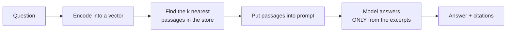

> **Learning objectives:** After this lesson, you will be able to build a complete RAG system and - more importantly - know how to **evaluate it as two separate layers**, so that when the system answers wrongly you know exactly where it went wrong. The knowledge base is the 51 lessons of the previous four chapters, so you can verify every answer.

## 1. Putting eleven lessons together

Lesson 09 concluded: the model makes things up because it is trained to generate sequences that *look plausible*, and the fix is **bringing real documents in**. Lesson 10 built the first half of that mechanism: finding relevant passages with embeddings.

This lesson assembles a complete system - **RAG** (retrieval-augmented generation):



**Knowledge base:** the 51 lessons of Foundations, Machine Learning, Deep Learning and Computer Vision - 886 thousand characters. It was chosen on purpose: you have read all of it, so you can verify each answer instead of having to trust it.

## 2. Why evaluate two layers

This is the most important design decision of the lesson.

The most natural way to evaluate is to ask a few questions and read the answers to see whether they are right. That approach **cannot distinguish two completely different causes**:

- The system retrieves **the wrong documents** → the model answers correctly according to the wrong documents
- The system retrieves **the right documents** → the model still answers wrongly

Those two causes need completely different fixes: the first is fixed in the chunking step and the embedding model, the second in the prompt or by switching models. Looking at the final answer does not tell you what to fix.

So we measure them separately:

| Layer | What is measured | Metric |
|---|---|---|
| **1. Retrieval** | whether the **lesson** containing the answer is among the top $k$ results | **article hit@k** |
| **2. Generation** | whether the answer sticks to the documents, cites correctly, and knows to decline | case-by-case checks |

Measuring layer 1 requires **a labeled question set**: 20 questions, each stating which lesson contains the answer.

> ⚠️ **Call the metric by its right name.** The labels here only say *which lesson* contains the answer, not *which passage*. So what we can measure is **article hit@k** - whether at least one of the top $k$ passages belongs to the right lesson - and **not passage-level Recall@k**, which requires knowing exactly which passage contains the answer. The difference is real: three passages from the right lesson, none of which contains the answer, still count as a success for article hit@k, while the model in layer 2 has nothing to rely on.

Measuring true Recall@k would mean labeling **every passage** for every chunking configuration - and passage boundaries change with the configuration, so the labeling would have to be done four times. We accept the weaker metric, and **call it by its right name**.

```
"IoU được tính như thế nào?"          → Computer Vision · Lesson 07
"ReLU chết là hiện tượng gì?"          → Deep Learning · Lesson 02
"Ridge và Lasso khác nhau ở chỗ nào?"  → Machine Learning · Lesson 04
```

## 3. Layer 1: how to chunk for the best retrieval

Splitting documents into passages is the first design parameter, and it involves a real trade-off: long passages carry enough context but their vectors get diluted; short passages give sharp vectors but may cut off part of the answer.

Four configurations tried on the same 20 questions:

| Configuration | Passages | hit@1 | hit@3 | hit@5 |
|---|---|---|---|---|
| 800 characters, no overlap | 1,125 | 0.80 | 0.90 | **1.00** |
| **800 characters, overlap 200** | 1,492 | **0.85** | 0.95 | 0.95 |
| 1,500 characters, overlap 200 | 701 | 0.75 | 0.90 | 0.95 |
| **400 characters, overlap 100** | 2,954 | 0.80 | **1.00** | **1.00** |

Four things to read from it:

**Retrieval finds the right lesson very well.** At $k=3$, three of the four configurations reach 0.90 or above, and the 400-character configuration reaches **1.00** - meaning all 20 questions have **at least one passage from the right lesson** in the top three results. As the callout above warned, that is *not yet* "the right passage": this metric does not know whether that passage contains the answer.

**Long passages seem to do more harm than good.** The 1,500-character configuration gives **the lowest or joint-lowest estimated score at all three levels of $k$**. That trend is worth noting because it is consistent across all three levels - but 20 questions are still far too few to claim it is **really** worse: at hit@3 and hit@5 it is only tied for last, and a single question going the other way would reorder the table. The table says even less about *why*. The most plausible explanation is that a long passage mixes several topics, so its vector no longer clearly represents any one of them, exactly the mechanism lesson 10 built - but this dataset cannot test that mechanism itself.

**Overlap nudges hit@1 up.** 800 characters with overlap 200 reaches 0.85 versus 0.80 without overlap. The familiar hypothesis is that overlap reduces the risk of the answer being cut across a passage boundary - but the 0.05 difference here equals exactly **one question**, and a lesson-level metric cannot see passage boundaries, so it cannot verify that hypothesis. In exchange, the number of passages grows by 33%, which costs extra memory and encoding time.

**No configuration wins at every level of $k$.** The 800-overlap-200 configuration is best at $k=1$ but loses at $k=5$; the 400-character configuration is the opposite. Which to choose depends on how many passages you plan to put into the prompt - and that in turn depends on the context window and the token cost, which takes us straight back to lesson 02.

> ⚠️ **A small note:** 20 questions is a very small set. A 0.05 difference between two configurations equals exactly **one question out of twenty**, so this table is not enough to rank the configurations. The 1,500-character configuration gives the lowest or **joint**-lowest estimated score at all three levels of $k$ - a trend worth noting, but only a larger evaluation set can tell whether it is a real difference. What the table can say more comfortably is that retrieval **generally works well on this collection**: every configuration puts the right lesson in the top 5 for at least 19/20 questions. To choose a configuration for a real system you need a few hundred labeled questions, and those labels should be assigned by someone other than the person who wrote the questions.

## 4. Layer 2: where the system breaks

Take the 800-character, overlap-200 configuration and put the top three passages into the prompt with a clear instruction (answer ONLY from the excerpts below, write the source number [n] after the answer, and say explicitly if the excerpts do not contain the answer):

```python
prompt = f"""Dựa CHỈ vào các đoạn trích dưới đây, trả lời câu hỏi.
Ghi số nguồn [n] sau câu trả lời.
Nếu các đoạn trích không chứa câu trả lời, hãy nói rõ là không tìm thấy.

{context_passages}

Câu hỏi: {question}
Trả lời:"""
```

Three test cases, and all three expose a problem.

**Case 1 - correct retrieval, off-topic answer.**

The question *"IoU tính như thế nào?"* (how is IoU computed?). Retrieval returns exactly Computer Vision · Lesson 07, which contains the IoU formula. The model answers:

```
Để giải quyết vấn đề này, chúng ta cần hiểu về thuật toán NMS (Non-Max Suppression).
NMS thường được sử dụng để loại bỏ những k...
```

It answers about **NMS** - a different topic in the same lesson ("to solve this problem, we need to understand the NMS algorithm..."). Right documents, wrong answer. **No citation.**

If we only looked at this answer, we would go and fix the retrieval step - and fix the wrong place. Only the table in section 3 tells us that retrieval did its job correctly.

**Case 2 - citing a source that does not exist.**

A question about BatchNorm. Retrieval correctly returns all three passages from Deep Learning · Lesson 08. The model answers and **does cite** - but it writes `[4]`, while the prompt only contains **three** passages numbered `[1]`, `[2]`, `[3]`.

Citations are added so that readers can verify. A citation pointing to a nonexistent source is worse than no citation, because it creates the impression that things have been verified.

**Case 3 - the worst case.**

A question deliberately outside the collection: *"Chương này nói gì về cách nuôi cá koi trong hồ xi măng?"* (what does this chapter say about raising koi in a cement pond?). The prompt explicitly instructed *"nếu các đoạn trích không chứa câu trả lời, hãy nói rõ là không tìm thấy"* (if the excerpts do not contain the answer, say explicitly that it was not found). The model answers:

```
Chương này nói về cách nuôi cá koi trong hồ xi măng.
```

It **parrots the question back as a statement** ("this chapter talks about how to raise koi in a cement pond"). No refusal, no warning, and it sounds like a valid answer.

This is exactly the phenomenon lesson 09 measured with false premises - the model accepts the premise and keeps going. And lesson 10 predicted the other half: the retriever **always returns three passages** even when the collection contains nothing relevant, so the model always has "documents" to lean on.

**Two layers, two opposite conclusions:** retrieval puts the right lesson in the top 3 for 0.95-1.00 of the questions, while generation fails in all three hand-tested cases. If we had evaluated only one layer, we would have drawn a completely wrong conclusion about what to fix.

## 5. The whole system, runnable end to end

The four sections above pulled each part out to measure it. Put back together, the whole system fits in a single file: [`code/rag_sach.py`](../../code/generative-ai/rag_sach.py), which runs right away on a personal computer without a GPU.

```bash
python3 rag_sach.py --hoi "IoU được tính như thế nào?"   # ask one question
python3 rag_sach.py --danh-gia                            # score article hit@k
```

It has the full pipeline drawn in section 1, plus two things a real system needs:

```
load 51 lessons → chunk → encode collection → encode question → find k nearest passages
   → build prompt with source numbers → Qwen generates → RULE-BASED CITATION CHECK
```

The citation check is ten lines and needs no model:

```python
def validate_citations(answer, num_sources):
    cited_source_ids = {int(x) for x in re.findall(r"\[(\d+)\]", answer)}
    citations_in_range = cited_source_ids <= set(range(1, num_sources + 1))
    return dict(co_trich_dan=bool(cited_source_ids), hop_le=citations_in_range,
                ngoai_pham_vi=sorted(cited_source_ids - set(range(1, num_sources + 1))))
```

The prompt contains $k$ passages numbered from 1 to $k$, so any number outside that range is a broken citation - caught with a regular expression. This is exactly where case 2 in section 4 went wrong with `[4]`.

Run it for real once, and it produces a fourth case - a failure mode **different from all three manual cases in section 4**:

```
retrieved sources:
  [1] Computer Vision/07. Phát hiện vật thể I...   (cosine 0,8630)
  [2] Computer Vision/07. Phát hiện vật thể I...   (cosine 0,8625)
  [3] Computer Vision/09. Phân đoạn ảnh...         (cosine 0,8619)

answer:
IoU được tính như sau:
    IoU = (Khoanh đúng + Khoanh đúng + Khoanh sai)
        / (Khoanh đúng + Khoanh sai + Khoanh đúng + Khoanh sai)

citation check: {'co_trich_dan': False, 'hop_le': True, 'ngoai_pham_vi': []}
```

Retrieval correctly fetched two passages from Computer Vision lesson 07, where the real IoU formula is. The model **invents a meaningless formula** - the numerator and denominator contain the same terms, and "khoanh đúng" (correct box) appears twice. It does not cite any source either.

Notice how the checker reads this case: `hop_le=True` (valid) but `co_trich_dan=False` (has no citation). The rule only checks **whether the source numbers are within the allowed range**; with no citations there is nothing to violate. To catch this case you need one more rule: **at least one citation is required**. This is a small example of a big principle - each rule catches only exactly what it checks, so you have to list the failure modes first and then write a rule for each one.

> ⚠️ **A small note:** counting this case, the lesson has **four observed cases and four different failure modes** in the generation layer - drifting to another topic, citing a nonexistent source number, not declining an out-of-collection question, and inventing a formula even though the documents provided were correct. These are not four isolated bugs but one and the same thing: **the 0.5B configuration with the current prompting is not reliable enough for this task**, even with the documents handed to it. Four cases cannot isolate the *cause* - they cannot say the parameter count is the culprit - so the fix has to be tested, not guessed: a larger model, a stricter prompt, or an extra checking step. And this is also where the value of measuring two layers shows, because otherwise we would have gone off optimizing a retrieval step that was already working well.

## 6. Where to fix

A diagnostic table, in the order you should work through it:

| Symptom | Broken layer | Fix |
|---|---|---|
| Low hit@k | retrieval | change chunking, change the embedding model, add keyword search |
| High hit@k but off-topic answers | generation | shorter, more focused passages; a larger model; a more tightly constrained prompt |
| Citations with wrong source numbers | generation | **check with rules** - require citations to match the list of sources provided |
| Does not know to decline | both | add a threshold in retrieval; add a separate step asking "does this passage contain the answer?" |

The last two rows deserve more discussion, because they are where this lesson ties back to earlier ones.

**Citations can be checked with rules.** The prompt contains three passages numbered 1-3, so any citation outside that set is wrong - caught with a regular expression, no model needed. This is exactly the spirit of Computer Vision · Lesson 12: wherever there is a rule you can write down, write the rule instead of relying on the model.

**Declining must be designed, not requested.** Case 3 shows that an instruction in the prompt is not enough. A more reliable approach is to split it into a separate step: ask the model *"does this excerpt contain the answer to the question, YES or NO"* before letting it write the answer. Judging yes/no is much easier than judging and writing at the same time - and lesson 08 showed that breaking the task down is the way forward when a prompt hits its ceiling.

> 🔧 **Try it now:** your RAG system answers a question wrongly. What do you check, and in what order?
> **First print out the retrieved passages**, then ask one question before any other: **does the collection contain the answer?**
>
> If it does but the right passage was not retrieved, the problem is in layer 1, and every effort to fix the prompt is wasted. If a passage with enough supporting evidence **is** in the list and the answer is still wrong - like the IoU case, the BatchNorm case and the script run - then the problem is in layer 2, and fixing the chunking is wasted too.
>
> If the collection **simply does not contain** the answer, like the koi case, do not blame either layer: there is no "right passage" to speak of. This is a different problem - **detecting the absence of evidence** - and both layers contribute, because a plain `topk` has no way to return nothing and the generation step does not decline. The fix also has to happen in both: a way to recognize "no evidence" in layer 1, plus a checking step in layer 2.
>
> This is why the first step in building a RAG system is not writing the prompt but **logging the retrieved passages** for every query. Without that log, every later diagnosis is guesswork.

## Lesson summary

- **RAG** combines retrieval with generation: find the relevant passages first, then make the model answer based on them.
- You must **evaluate the two layers separately**, because the final answer cannot distinguish "retrieved the wrong documents" from "retrieved the right ones but answered wrongly" - two things that need completely different fixes.
- Layer 1 is measured with **article hit@k** on a labeled question set: 20 questions, each with the **lesson** containing the answer known in advance. This is not passage-level Recall@k - the labels are not detailed enough for that, and the lesson says so explicitly.
- Retrieval **puts the right lesson in the top 3** for 0.90-1.00 of the questions, with three of the four chunking configurations. This is lesson level, not passage level.
- **1,500-character** passages give **the lowest or joint-lowest score at all three levels of $k$** - a consistent trend, but 20 questions are not enough to call it a real difference; and the explanation of "vectors mixing several topics" is even more of an untested hypothesis.
- Overlap nudges hit@1 from 0.80 to 0.85 - exactly one question - at the cost of 33% more passages.
- Layer 2 **fails in all three hand-tested cases**: answering about NMS when asked about IoU despite the right documents; citing `[4]` when there are only three sources; and **parroting the koi question back as a statement** even though the prompt said to decline.
- The two layers give two opposite conclusions - evaluate only one and you will fix the wrong place.
- **Citations can be checked with rules**; **declining must be designed as a separate step**, not just requested in the prompt.
- The whole system is in one runnable file: [`code/rag_sach.py`](../../code/generative-ai/rag_sach.py), including a `--danh-gia` flag to score article hit@k.
- Counting the end-to-end script run, there are **four cases and four failure modes**: drifting off topic, citing a nonexistent source number, not declining, and inventing a formula despite correct documents. The conclusion to draw is that **the 0.5B configuration with the current prompting is not reliable enough** - four cases are not enough to single out the parameter count as the cause.
- The citation checker only catches what it checks: the invented-formula case gives `hop_le=True` because **there are no citations to violate**. List the failure modes first, then write a rule for each.
- The first thing to do when building a RAG system is **log the retrieved passages**, not write the prompt.

## Self-check questions

1. Name two completely different causes that make a RAG system answer wrongly, and explain why the final answer cannot distinguish them.
2. Distinguish **article hit@k** from **passage-level Recall@k**. Why can this lesson only measure the former, and which failure mode does that hide?
3. Name a mechanism from lesson 10 that could explain why the 1,500-character configuration gets the lowest or joint-lowest scores in the table. Is the table in section 3 enough to confirm that mechanism? Is it enough to claim that configuration is really worse?
4. Overlap raises hit@1 but costs 33% more passages. How do you decide?
5. The "IoU" case had correct retrieval but answered about NMS. If you only looked at the answer, what would you wrongly fix?
6. Why is a citation pointing to a nonexistent source worse than no citation?
7. The prompt said "if it is not there, say it was not found", yet the model still parroted the question. Name two fixes stronger than an instruction in the prompt.
8. Design a two-layer evaluation for a RAG system over a company's internal documents. Describe how to obtain labels for layer 1.

## Further reading

**Foundational sources for this lesson:**

| Source | What to read |
|---|---|
| **Lesson 09 of this chapter** | Why models make things up, and why retrieval is the fix |
| **Lesson 10 of this chapter** | Sentence embeddings, cosine similarity, and the retriever that always returns $k$ results |
| **Lesson 08 of this chapter** | When a prompt hits its ceiling, break the task down |
| **Computer Vision · Lesson 12** | Constraints checkable by rules; evaluating a multi-component system |

**Additional online sources (free):**

- [Lewis et al. - Retrieval-Augmented Generation (NeurIPS 2020)](https://arxiv.org/abs/2005.11401) - the paper that named this architecture.
- [Gao et al. - Retrieval-Augmented Generation for Large Language Models: A Survey (2023)](https://arxiv.org/abs/2312.10997) - an overview of the variants and where each one fits.
- [RAGAS](https://github.com/explodinggradients/ragas) - a set of metrics that separates retrieval quality from generation quality, in the spirit of section 2.
- [BEIR](https://github.com/beir-cellar/beir) - a benchmark for retrieval across many domains, to compare against when you measure Recall@k yourself.
- [Es et al. - RAGAS: Automated Evaluation of Retrieval Augmented Generation (EACL 2024)](https://arxiv.org/abs/2309.15217) - how to automatically score how faithfully an answer sticks to the documents.

## End of the Generative AI chapter

The twelve lessons you just finished follow a single thread.

**Lessons 01-02** laid the foundation: a language model does only one thing - predict the next symbol - and the way text is split into symbols has a very concrete price for Vietnamese.

**Lessons 03-05** opened up the mechanism: attention and how it mixes information, a full Transformer with each building block measured separately, and the final step that turns a probability distribution into words.

**Lessons 06-09** looked at the limits: where small models break and what we can infer from that, how far post-training changes behavior, what prompts can and cannot change, and why models make things up.

**Lessons 10-12** assembled a system: embeddings and retrieval, a completely different way of generating for images, and then a complete question answering system over this very book.

A few things worth taking with you:

- **The model does only one thing.** Everything that looks like understanding falls out of predicting the next symbol well. Remember this and you will understand why it answers wrongly yet fluently, why it needs prompts in the right shape, and why **you cannot count on it to reliably notice and report its own errors**.
- **Form is learned before content.** Lesson 01 saw this in a 1.9-million-parameter model, and lesson 09 saw it again in a 494-million-parameter model.
- **A score the system assigns itself is not evidence.** Four times in this series, through four different mechanisms.
- **Vietnamese pays at the lowest layer.** Token fragmentation affects cost, the context window and quality - before the model has had a chance to think about anything.
- **Measure each layer separately.** Lesson 12 is the clearest example: two layers gave two opposite conclusions.

This chapter deliberately stops at a few points. Everything about **operations** - the key-value cache, quantization, batching, serving many users, latency and throughput, running vector databases - belongs to **the AI Systems chapter**. Lesson 12 builds a RAG system that runs on a personal computer; putting it in front of a thousand users at once is a completely different problem.

That is where the AI Systems chapter begins.

> **Next lesson:** [What One Model Call Costs](../what-one-model-call-costs/) - the AI Systems chapter starts here.
