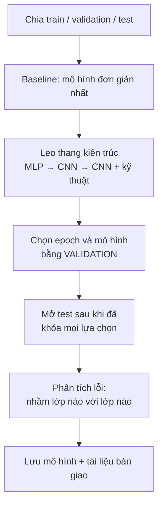

> **Mục tiêu bài học:** Sau bài này, bạn sẽ chạy trọn một dự án deep learning theo đúng thứ tự - chia dữ liệu, dựng baseline, leo thang kiến trúc, chọn mô hình bằng validation, chỉ mở test sau khi mọi lựa chọn đã khóa - rồi đọc xem mô hình còn nhầm ở đâu và bàn giao nó.

## 1. Quy trình không đổi, chỉ mô hình đổi

Chương Machine Learning · Bài 12 đã dựng một quy trình: đặt bài toán và chọn metric, chia dữ liệu, dựng baseline, so mô hình bằng validation, mở test một lần, phân tích lỗi, bàn giao. Deep learning **không thay đổi quy trình ấy** - nó chỉ thay hộp "mô hình" bằng một thứ có nhiều núm vặn hơn và cần chẩn đoán trong lúc train.



Bài toán: phân loại 10 loại quần áo trên FashionMNIST.

Bài này là một **project mới**: nó bắt đầu lại từ dữ liệu gốc và tự chia ba tập của riêng nó. Mười một bài trước là các thí nghiệm rời để dựng khái niệm, không phải các bước của project này.

Việc chia lại không phải hình thức. Câu trả lời hiển nhiên cho "tập test lấy từ đâu" - 10.000 ảnh mà FashionMNIST đặt tên là *test* - lại là câu trả lời tệ nhất có thể, vì mười một bài trước đã nhìn nó không biết bao nhiêu lần: để so hàm kích hoạt ở bài 02, so số tầng ở bài 03, chọn learning rate ở bài 06, so ba kỹ thuật regularization ở bài 07. Chính những lần nhìn ấy đã định hình bậc thang kiến trúc mà bài này sắp trèo. Dùng lại nó làm tập test thì con số cuối cùng được chấm bởi đúng tập đã dạy ta chọn - không còn nghĩa gì nữa.

Nên cả ba phần đều cắt ra từ 60.000 ảnh train:

```python
import torch
from torch.utils.data import DataLoader, random_split
from torchvision import datasets
from torchvision.transforms import ToTensor

full = datasets.FashionMNIST("data", train=True, download=True, transform=ToTensor())
train_set, val_set, test_set = random_split(
    full, [50000, 5000, 5000], generator=torch.Generator().manual_seed(42))

train_dl = DataLoader(train_set, batch_size=256, shuffle=True)
val_dl   = DataLoader(val_set,   batch_size=1000)
test_dl  = DataLoader(test_set,  batch_size=1000)
```

**50.000 train / 5.000 validation / 5.000 test.** Ba phần chứ không phải hai, đúng lý do Foundations · Bài 04 đã nêu: validation dùng để *chọn* - chọn kiến trúc, chọn epoch dừng - nên nó mòn dần; test giữ nguyên cho con số báo cáo cuối cùng.

Phạm vi của lời cam kết cần nói cho chính xác, vì đây là chỗ rất dễ nói quá: **5.000 ảnh test này không tham gia vào bất kỳ quyết định nào của project, từ dòng code đầu tiên cho tới bước đánh giá cuối.** Mô hình của bài không nhìn thấy chúng lúc train, và không con số nào đo trên chúng được dùng để chọn cái gì. Điều *không* đúng là nói chúng chưa bao giờ được bài nào trong loạt bài này chạm tới - mấy bài trước train trên trọn 60.000 ảnh, nên các mô hình minh hoạ ở đó có học qua chúng. Chỉ là không mô hình nào trong số đó được dùng lại ở đây, và không quyết định nào của bài này đến từ chúng.

Vì sao vẫn chọn cách này thay vì lấy tập test chính thức? Vì hai kiểu "đã dùng" không nặng như nhau, dù không kiểu nào là vô can.

Một tấm ảnh từng nằm trong tập train của một mô hình minh hoạ nay đã bị bỏ đi là kiểu dùng **ít trực tiếp hơn nhiều**: chưa ai từng nhìn riêng hiệu năng trên chính 5.000 ảnh ấy để quyết định điều gì. Nói vậy không có nghĩa nó bằng không - kết quả của các mô hình cũ, vốn train trên trọn 60.000 ảnh, có góp phần hình thành những lựa chọn về hàm kích hoạt, độ sâu và regularization mà bài này kế thừa. Đường ảnh hưởng có tồn tại, chỉ là gián tiếp và mờ.

Còn tập test chính thức thì đã bị nhìn đi nhìn lại để chọn hàm kích hoạt, learning rate, regularization và kiến trúc. Thông tin từ nó chảy thẳng vào những quyết định dựng nên mô hình hôm nay. Mức ô nhiễm nghiêm trọng hơn hẳn. Khi phải chọn giữa hai thứ đều không hoàn hảo, tránh cái nặng hơn.

> ⚠️ **Lưu ý nhỏ:** chuyện phải bỏ tập test có sẵn để tự cắt tập khác nghe như một chi tiết vụn vặt của loạt bài này, nhưng nó là tình huống rất thật. Một tập test chỉ còn trung thực cho lần đánh giá cuối **chừng nào thông tin từ nó chưa từng được dùng để ra quyết định về mô hình**, và nó bị tiêu hao âm thầm: mỗi lần có người trong nhóm chạy thử rồi liếc con số test để quyết định, tập ấy mất thêm một phần giá trị, dù không ai gian lận gì. Cách phòng duy nhất là thoả thuận từ đầu ai được mở nó và mở khi nào. Với 5.000 ảnh, độ lệch chuẩn của con số accuracy vào khoảng 0,4 điểm phần trăm, tức khoảng tin cậy 95% rộng chừng $\pm 0{,}8$ điểm - hẹp hơn thì cần tập lớn hơn, mà tập lớn hơn thì lấy mất dữ liệu train. Đó là cái giá phải trả để có một tập test sạch trong phạm vi project này.

Tiếp theo là hàm đánh giá. Bài 05 đã viết nó, chép lại đây để đoạn code của bài này chạy được từ trên xuống mà không cần mở bài khác:

```python
from torch import nn

lossf = nn.CrossEntropyLoss()

@torch.no_grad()
def evaluate(model, dl):
    model.eval()
    correct = total = 0
    total_loss = 0.0
    for xb, yb in dl:
        out = model(xb)
        total_loss += lossf(out, yb).item() * len(yb)
        correct += (out.argmax(1) == yb).sum().item()
        total += len(yb)
    return total_loss / total, correct / total
```

Vì các mô hình ở chương này đều huấn luyện theo epoch, việc "chọn bằng validation" có một dạng cụ thể: sau mỗi epoch, đo trên validation, và **giữ lại bản trọng số tốt nhất** thay vì bản của epoch cuối.

```python
def train_one_epoch(model, dl, opt):
    model.train()                          # vì evaluate() đã bật eval()
    for xb, yb in dl:
        opt.zero_grad()
        lossf(model(xb), yb).backward()
        opt.step()

def fit(model, train_dl, val_dl, epochs, lr=1e-3):
    opt = torch.optim.Adam(model.parameters(), lr=lr)
    best_acc, best_ep, best_state = 0.0, 0, None
    for ep in range(1, epochs + 1):
        train_one_epoch(model, train_dl, opt)
        _, va_acc = evaluate(model, val_dl)
        if va_acc > best_acc:
            best_acc, best_ep = va_acc, ep
            best_state = {k: v.clone() for k, v in model.state_dict().items()}
    model.load_state_dict(best_state)                # quay về bản tốt nhất
    return model, best_ep, best_acc
```

Dòng `model.train()` ở đầu `train_one_epoch` không thừa: `evaluate` gọi `model.eval()` và không tự bật lại chế độ cũ, nên nếu thiếu dòng này thì từ epoch thứ hai trở đi dropout ngừng hoạt động mà không có gì báo.

Cách làm này thường bị gọi nhầm là **early stopping**. Hai thứ khác nhau: early stopping *dừng train sớm* khi validation không cải thiện thêm $k$ epoch, để tiết kiệm thời gian; còn đoạn trên train đủ số epoch rồi mới **chọn lại bản trọng số tốt nhất**. Chúng hay đi cùng nhau và cùng dựa vào một quan sát của bài 06 - đường cong validation nhấp nhô và có thể quay đầu, nên epoch cuối không phải epoch tốt nhất - nhưng cái quyết định con số cuối cùng của bạn là phép chọn lại, không phải phép dừng sớm.

## 2. Leo thang bốn bậc

Mỗi bậc thêm đúng một ý tưởng của chương, để thấy ý tưởng ấy đáng bao nhiêu:

| # | Mô hình | Tham số | **Validation** | Thời gian |
|---|---|---|---|---|
| 0 | Hồi quy softmax (baseline) | 7.850 | 0,8602 | 72 s |
| 1 | MLP 1 tầng ẩn 256 | 203.530 | 0,8934 | 75 s |
| 2 | CNN 2 tầng tích chập | 20.490 | 0,9082 | 159 s |
| 3 | **CNN + BatchNorm + Dropout** | 421.834 | **0,9314** | 397 s |

Chỉ có một cột kết quả, và đó là **validation**. Cột test không xuất hiện ở đây không phải vì ta chưa đo được nó - code đã sẵn, đo mất mười giây - mà vì **đưa kết quả test vào giai đoạn chọn mô hình là làm hỏng vai trò của nó**. Bảng này tồn tại để chọn ra một mô hình; mọi con số dùng vào việc chọn đều phải đến từ validation. Tập test còn nguyên cho mục 3.

Bốn nhận xét, mỗi cái ứng với một bài đã học.

**Baseline không phải hình thức.** 0,8602 với 7.850 tham số trong 72 giây. Mọi thứ phía sau phải hơn con số này thì mới đáng công - nguyên tắc của chương Machine Learning · Bài 01, vẫn đúng nguyên.

**Bậc 1 → 2 là bậc rẻ nhất.** CNN dùng **ít hơn 10 lần tham số** so với MLP mà hơn 1,5 điểm. Đây là bài 09: kiến trúc hợp dữ liệu ăn đứt việc thêm tham số. Đổi lại nó train lâu hơn 2,1 lần - ít tham số không có nghĩa ít phép tính.

**Bậc 3 là bậc lãi đậm nhất:** +2,3 điểm, lên 0,9314. Nhưng chú ý nó gộp *ba* thay đổi cùng lúc - mạng rộng hơn, thêm BatchNorm (bài 08), thêm Dropout (bài 07). Muốn biết cái nào đóng góp bao nhiêu thì phải tách ra thử từng cái; ở đây ta chấp nhận không biết, đổi lấy việc đi nhanh.

**Chốt lại:** mô hình bậc 3 thắng trên validation, nên nó là mô hình được chọn. Từ đây trở đi không còn lựa chọn nào nữa - và chỉ khi không còn lựa chọn nào nữa thì mới được mở tập test.

Đoạn code dựng và huấn luyện nó:

```python
torch.manual_seed(42)                    # cố định seed cho lần chạy này

model = nn.Sequential(
    nn.Conv2d(1, 32, 3, padding=1), nn.BatchNorm2d(32), nn.ReLU(), nn.MaxPool2d(2),
    nn.Conv2d(32, 64, 3, padding=1), nn.BatchNorm2d(64), nn.ReLU(), nn.MaxPool2d(2),
    nn.Flatten(), nn.Dropout(0.3),
    nn.Linear(64 * 7 * 7, 128), nn.ReLU(), nn.Dropout(0.3),
    nn.Linear(128, 10))

model, best_ep, best_va = fit(model, train_dl, val_dl, epochs=15)
print(best_ep, round(best_va, 4))        # → 12 0,9314
```

## 3. Mở tập test đúng một lần

Mô hình đã chọn xong, và từ nãy tới giờ chưa quyết định nào của project dựa vào 5.000 ảnh test. Giờ mới tới lượt chúng:

```python
_, test_acc = evaluate(model, test_dl)
print(round(test_acc, 4))                # → 0,9224
```

**0,9224.** Đây là con số đem đi báo cáo.

Chỗ này đáng nói cho chính xác, vì "mở test đúng một lần" là câu khẩu hiệu dễ nhớ nhưng không phải là quy tắc thật. Quy tắc thật là: **không có thông tin nào từ tập test được phép quay ngược lại tác động lên mô hình.** Cái đáng đếm không phải số lần gọi `evaluate`, mà là số lần một con số test làm bạn đổi ý.

Phân biệt ấy có ích ngay: chạy lại đúng pipeline cũ, không sửa gì, chỉ để kiểm tra seed có tái tạo được kết quả không, thì gọi `evaluate` trên test thêm lần nữa **không tiêu tốn gì cả** - không quyết định nào được sinh ra từ lần chạy đó. (Loạt bài này đã làm đúng vậy: chạy lại toàn bộ đoạn code trên và nhận đúng 0,9314 với 0,9224.) Ngược lại, chỉ cần **một** lần nhìn 0,9224 rồi nghĩ "thêm một tầng nữa xem sao" là tập test đã bắt đầu mòn, dù bạn mới gọi `evaluate` đúng một lần.

So với validation 0,9314 thì test thấp hơn 0,9 điểm. Có một sức ép có hệ thống đẩy về phía đó: ta *chọn* epoch và chọn kiến trúc dựa trên validation, nên con số validation đã hưởng phần may mắn của những lần chọn ấy, còn test thì không được chọn gì cả.

Đừng biến quan sát này thành một định luật. Validation và test ở đây là hai mẫu 5.000 ảnh khác nhau, mỗi con số có độ lệch chuẩn cỡ 0,4 điểm, nên chuyện test nhỉnh hơn validation hoàn toàn có thể xảy ra ở một lần chạy khác. Điều luôn đúng là thứ khác: con số validation **không còn là ước lượng trung thực** cho dữ liệu mới, vì nó đã bị dùng để chọn. Đó là lý do con số đem đi báo cáo phải là **0,9224**, không phải 0,9314.

> ⚠️ **Lưu ý nhỏ:** nếu bây giờ bạn thấy 0,9224 chưa đủ đẹp và quay lại chỉnh mô hình, thì lần đo test tiếp theo không còn trung thực như lần này nữa - lựa chọn của bạn đã bị chính con số ấy tác động. Quay lại chỉnh là hoàn toàn được phép, thực tế ai cũng làm; chỉ cần trung thực về hệ quả. Cách xử lý quen thuộc là ghi rõ đã có bao nhiêu vòng như vậy khi báo cáo, và dồn mọi vòng lặp về validation để con số ấy càng nhỏ càng tốt. Nghe khắt khe, nhưng đây đúng là chỗ nhiều kết quả đẹp trong thực tế mất giá trị mà không ai nhận ra.

## 4. Mô hình còn nhầm ở đâu

Accuracy 0,9224 là một con số. Nó không nói cho bạn biết nên làm gì tiếp. Ma trận nhầm lẫn thì nói:

```python
CLASSES = ["T-shirt/top", "Trouser", "Pullover", "Dress", "Coat",
           "Sandal", "Shirt", "Sneaker", "Bag", "Ankle boot"]

cm = torch.zeros(10, 10, dtype=torch.long)
model.eval()
with torch.no_grad():
    for xb, yb in test_dl:
        for t, pr in zip(yb, model(xb).argmax(1)):
            cm[t, pr] += 1

per_class = {CLASSES[i]: (cm[i, i] / cm[i].sum()).item() for i in range(10)}
pairs = sorted(((cm[i, j].item(), CLASSES[i], CLASSES[j])
                for i in range(10) for j in range(10) if i != j), reverse=True)
```

Tách theo lớp:

| Lớp | Accuracy | | Lớp | Accuracy |
|---|---|---|---|---|
| **Shirt (sơ mi)** | **0,7429** | | Sneaker (giày thể thao) | 0,9640 |
| Dress (váy) | 0,8845 | | Ankle boot (bốt cổ thấp) | 0,9696 |
| Coat (áo khoác) | 0,8922 | | Sandal (dép quai) | 0,9823 |
| T-shirt/top (áo phông) | 0,9033 | | Bag (túi) | 0,9858 |
| Pullover (áo len) | 0,9089 | | Trouser (quần dài) | 0,9922 |

Chênh lệch rất lớn: lớp tốt nhất là **quần dài** với 0,9922, còn **sơ mi chỉ 0,7429** - kém tới 24,9 điểm. Một con số tổng thể 0,9224 đã che mất chuyện đó, đúng như chương Machine Learning · Bài 12 cảnh báo khi tách chỉ số theo nhóm.

Nhìn tiếp mô hình nhầm *thành cái gì*:

| Nhãn thật | Bị đoán thành | Số lần |
|---|---|---|
| Shirt | T-shirt/top | **77** |
| T-shirt/top | Shirt | 32 |
| Coat | Shirt | 24 |
| Dress | Coat | 22 |
| Shirt | Pullover | 21 |

Cả năm cặp nhầm nhiều nhất đều nằm gọn trong nhóm quần áo mặc phần trên - **sơ mi, áo phông, áo khoác, áo len**, cộng thêm váy bị nhầm thành áo khoác. Ảnh xám 28×28, hình bóng gần như nhau. Riêng cặp sơ mi ↔ áo phông đã chiếm 109 trong tổng số lỗi. Mô hình không hề lẫn lộn giữa giày và túi; nó chỉ vật lộn với đúng cụm mà con người nhìn ảnh 28×28 cũng khó phân biệt.

Đây là kiểu phát hiện đổi được thành hành động, khác hẳn một con số accuracy:

- **Nếu bài toán thật cho phép**, gộp nhóm áo mặc phần trên thành một lớp rồi phân loại hai tầng.
- **Nếu không**, đầu tư vào đúng cụm đó: thu thêm ảnh sơ mi, hoặc dùng ảnh độ phân giải cao hơn - 28×28 có thể đơn giản không đủ thông tin để phân biệt sơ mi với áo phông.
- **Đừng** đổ công vào túi và dép quai; ở đó chỉ còn hơn một điểm để lấy, trong khi riêng lớp sơ mi còn tới 25 điểm.

## 5. Bàn giao

Với `model` là bản trọng số tốt nhất mà `fit` đã nạp lại ở mục 2:

```python
torch.save(model.state_dict(), "model_final.pt")     # 1.655 KB
```

`state_dict()` lưu **trọng số**, không lưu kiến trúc. Nghĩa là bên nhận phải dựng lại đúng cấu trúc mạng rồi mới nạp được - nên đoạn code định nghĩa mô hình là **một phần bắt buộc của gói bàn giao**, không phải thứ tùy chọn.

Kèm theo tệp trọng số, những thứ nên giao:

- **Đoạn code dựng mô hình**, khớp chính xác với `state_dict` đã lưu.
- **Phép tiền xử lý**, kèm mọi hằng số chuẩn hóa - bài 11 đã cho thấy sai chỗ này thì mô hình hỏng âm thầm.
- **Con số báo cáo và cách đo được nó**: "test accuracy 0,9224 trên 5.000 ảnh giữ riêng, chỉ đánh giá sau khi kiến trúc và epoch đã khóa bằng 5.000 ảnh validation; không lựa chọn nào dựa vào tập test."
- **Bảng accuracy theo lớp** ở mục 4 - quan trọng hơn con số tổng thể với người sẽ dùng mô hình.
- **Phiên bản thư viện** (`torch 2.14.0`, `torchvision 0.29.0`) và seed đã dùng (`manual_seed(42)` cho cả phép chia dữ liệu lẫn phép khởi tạo).
- **Nhắc gọi `model.eval()`** trước khi dự đoán. Mô hình này có cả BatchNorm lẫn Dropout, nên quên dòng đó là kết quả sai mà không báo lỗi - bài 05 đã đo được mức thiệt hại.

> ⚠️ **Lưu ý nhỏ:** `torch.save` dùng `pickle` bên dưới, nên một tệp `.pt` từ nguồn không tin cậy về nguyên tắc có thể chạy mã tùy ý trên máy bạn. Từ PyTorch 2.6, `torch.load` mặc định `weights_only=True` - nó chỉ nạp tensor và các kiểu dữ liệu cơ bản, nên rủi ro ấy đã được chặn sẵn ở mặc định. Chỗ cần cẩn thận là khi bạn *tự tắt* nó đi bằng `weights_only=False` để nạp một tệp cũ, hoặc khi chạy trên bản PyTorch cũ hơn. Đây là cùng cảnh báo mà chương Machine Learning · Bài 01 đã nêu với `joblib`. Với mô hình chia sẻ ra ngoài, `safetensors` vẫn là định dạng an toàn hơn vì nó chỉ chứa số chứ không chứa mã.

> 🔧 **Thử ngay:** bậc 3 tăng 2,3 điểm nhưng gộp ba thay đổi. Bạn thiết kế thí nghiệm gì để biết BatchNorm đóng góp bao nhiêu?
> Giữ nguyên mọi thứ, chỉ bỏ các tầng `BatchNorm2d` ra, train lại với cùng seed và cùng số epoch, so accuracy trên **validation** (không phải test - test còn phải để dành). Muốn chắc hơn thì chạy vài seed rồi so trung bình, vì chênh lệch một vài phần nghìn nằm trong nhiễu giữa các lần chạy. Cách làm này gọi là **ablation** - bỏ từng mảnh ra để đo đóng góp của nó, và nó là công cụ chuẩn để trả lời "cái gì thực sự có tác dụng" trong một mô hình gộp nhiều ý tưởng.

## Tóm tắt bài học

- Deep learning không thay đổi quy trình dự án của chương Machine Learning; nó chỉ thay hộp "mô hình" và thêm phần chẩn đoán trong lúc train.
- Chia ba phần: validation để *chọn* (kiến trúc và epoch dừng), test để *báo cáo*. Với mạng nơ-ron, "chọn bằng validation" cụ thể là giữ lại bản trọng số của epoch tốt nhất - đó là phép chọn lại mô hình, không phải early stopping.
- Leo thang bốn bậc, chấm bằng validation: baseline 0,8602 → MLP 0,8934 → CNN 0,9082 → CNN + BatchNorm + Dropout **0,9314**. Test chỉ đánh giá sau khi mọi lựa chọn đã khóa: **0,9224**.
- CNN dùng ít hơn 10 lần tham số so với MLP mà hơn 1,5 điểm - kiến trúc hợp dữ liệu thắng việc thêm tham số.
- Validation (0,9314) cao hơn test (0,9224) vì ta đã chọn dựa trên nó - không phải định luật, nhưng đủ lý do để con số đem báo cáo luôn là con số test.
- Accuracy tổng thể che giấu chênh lệch lớn: sơ mi chỉ 0,7429 trong khi quần dài đạt 0,9922. Cả năm cặp nhầm nhiều nhất đều nằm trong nhóm quần áo mặc phần trên.
- `state_dict()` chỉ lưu trọng số, nên code dựng mô hình là phần bắt buộc của gói bàn giao, cùng phép tiền xử lý, phiên bản thư viện và lời nhắc gọi `model.eval()`.

## Câu hỏi tự kiểm tra

1. Vì sao phải chia ba phần thay vì hai? Điều gì xảy ra với con số báo cáo nếu bạn chọn epoch dừng bằng chính tập test?
2. Bạn chạy lại y nguyên pipeline để kiểm tra seed, và `evaluate` trên test chạy lần thứ hai. Tập test có bị mòn thêm không? Trả lời bằng nguyên tắc chứ đừng đếm số lần gọi hàm.
3. Vì sao bảng leo thang ở mục 2 cố tình không có cột test, dù đo cột ấy chỉ tốn mười giây?
4. CNN có ít hơn 10 lần tham số so với MLP nhưng train lâu hơn 2,1 lần. Vì sao?
5. Bậc 3 gộp ba thay đổi cùng lúc. Nêu điểm lợi và điểm hại của cách làm đó, và bạn thiết kế thí nghiệm gì để gỡ ra.
6. Mô hình đạt 0,9224 tổng thể nhưng chỉ 0,7429 trên lớp sơ mi. Nêu hai hành động khác nhau bạn có thể chọn, và thông tin nào giúp bạn quyết định.
7. Bạn giao tệp `model_final.pt` cho đồng nghiệp và họ báo kết quả tệ hơn hẳn con số bạn công bố. Liệt kê ba nguyên nhân có thể, theo thứ tự bạn sẽ kiểm tra.

## Đọc thêm

**Nguồn nền tảng của bài:**

| Nguồn | Đọc phần nào |
|---|---|
| **Chương Machine Learning · Bài 12** | Quy trình end-to-end, tách chỉ số theo nhóm, checklist bàn giao - bài này là chính nó với hộp mô hình thay bằng mạng nơ-ron |
| **Foundations · Bài 04** | Vì sao cần ba tập chứ không phải hai |
| **Dive into Deep Learning (d2l.ai)** | Chương 4.5 *Concise Implementation of Softmax Regression* và 8.1 *LeNet* - hai đầu của bậc thang ở mục 2 |

**Nguồn online bổ sung (miễn phí):**

- [Saving and Loading Models - PyTorch](https://pytorch.org/tutorials/beginner/saving_loading_models.html) - `state_dict`, và vì sao nạp xong phải gọi `eval()`.
- [safetensors](https://huggingface.co/docs/safetensors) - định dạng lưu trọng số không dùng `pickle`, an toàn khi chia sẻ.
- [Karpathy - A Recipe for Training Neural Networks](https://karpathy.github.io/2019/04/25/recipe/) - quy trình từ baseline đi lên, cùng tinh thần với mục 2.
- [FashionMNIST benchmark](https://github.com/zalandoresearch/fashion-mnist#benchmark) - bảng kết quả của nhiều mô hình trên bộ này. Lưu ý các con số ở đó đo trên tập test chính thức, còn bài này đo trên một tập cắt riêng, nên chỉ so được ở mức thứ tự lớn.

## Kết thúc chương Deep Learning

Mười hai bài vừa rồi đi theo một mạch.

**Bài 01-03** trả lời câu hỏi mà chương Machine Learning để lại: khi con người không biết phải tạo feature nào thì mô hình có tự tìm ra được không. Câu trả lời là tầng ẩn - một bảng đặc trưng do máy tự viết - và chiều sâu cho phép tầng sau dựng trên những mảnh tầng trước đã dựng.

**Bài 04-06** mở nắp cơ chế: đồ thị tính toán khiến một lời gọi `backward()` lo được hàng triệu tham số, vòng lặp huấn luyện chỉ có bốn dòng, và hai đường cong loss là công cụ chẩn đoán khi có chuyện.

**Bài 07-08** xử lý hai bệnh ngược nhau - mạng học *quá kỹ*, và mạng *không học được gì*. Bài 08 là chỗ ta thấy rõ nhất rằng deep learning không phải cứ xếp tầng là xong: mạng 20 tầng với khởi tạo mặc định cho accuracy 0,1000, và chỉ đổi cách khởi tạo đã lên 0,8419.

**Bài 09-11** chuyển từ "mạng chung chung" sang "mạng biết trước dữ liệu của nó có cấu trúc gì": CNN cho ảnh, RNN cho chuỗi, và transfer learning để không phải bắt đầu từ con số không.

Vài điều đáng mang theo:

- **Kiến trúc hợp dữ liệu thắng việc thêm tham số.** Thêm một tầng ẩn 256 nơ-ron mua được 2,8 điểm với 26 lần tham số; đổi sang CNN mua được chừng ấy trong khi *giảm* tham số mười lần.
- **Luôn đọc train loss trước.** Nó phân biệt hai loại bệnh cần hai cách chữa ngược nhau.
- **Nhiều regularization không phải tốt hơn.** Bật cả ba cùng lúc cho kết quả tệ hơn không bật gì.
- **Số liệu thay cho niềm tin.** Gần như mọi khẳng định trong chương này đều có một bảng đi kèm, và vài lần bảng ấy nói ngược lại kỳ vọng.
- **Deep learning không thay quy trình.** Chia dữ liệu, baseline, validation để chọn, test để báo cáo - vẫn là quy trình của chương trước.

Chương này cố tình dừng nông ở hai chỗ. Bài 09 mới dựng trực giác CNN mà chưa đụng tới kiến trúc thật, phát hiện vật thể hay phân đoạn ảnh - đó là **chương Computer Vision** sắp tới. Bài 10 dừng ngay trước attention, sau khi cho thấy bức tường mà mạng hồi quy không vượt được - Transformer và các mô hình ngôn ngữ là **chương Generative AI**.

Đó là chỗ chương Computer Vision bắt đầu.

> **Bài tiếp theo:** [Ảnh thực chất là dữ liệu gì](../what-an-image-really-is-as-data-vi/) - chương Computer Vision bắt đầu từ đây.
