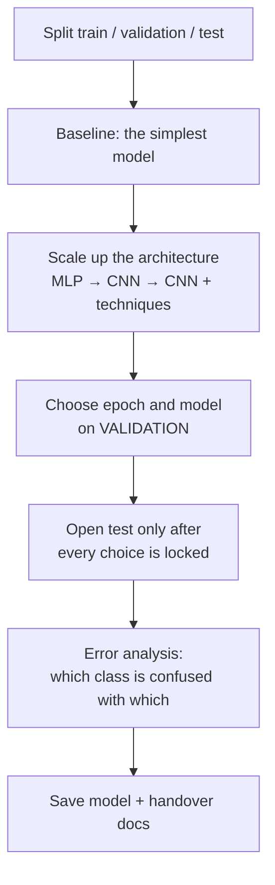

> **Learning objectives:** After this lesson, you will run a whole deep learning project in the right order - split the data, build a baseline, scale up the architecture, choose a model on validation, open the test set only once every choice is locked - then read where the model still goes wrong and hand it over.

## 1. The workflow stays the same, only the model changes

Machine Learning · Lesson 12 built a workflow: frame the problem and choose a metric, split the data, build a baseline, compare models on validation, open the test set once, analyze errors, hand over. Deep learning **does not change that workflow** - it only replaces the "model" box with something that has more knobs and needs diagnosis during training.



The problem: classify 10 kinds of clothing on FashionMNIST.

This lesson is a **new project**: it starts over from the original data and makes its own three-way split. The previous eleven lessons were separate experiments for building concepts, not steps of this project.

The re-split is not a formality. The obvious answer to "where does the test set come from" - the 10,000 images FashionMNIST labels as *test* - is actually the worst possible answer, because the previous eleven lessons have looked at it countless times: to compare activation functions in Lesson 02, compare depths in Lesson 03, choose the learning rate in Lesson 06, compare three regularization techniques in Lesson 07. Those very looks shaped the architecture ladder this lesson is about to climb. Reuse it as the test set and the final number is graded by the very set that taught us what to choose - it would no longer mean anything.

So all three parts are cut from the 60,000 training images:

```python
import torch
from torch.utils.data import DataLoader, random_split
from torchvision import datasets
from torchvision.transforms import ToTensor

full = datasets.FashionMNIST("data", train=True, download=True, transform=ToTensor())
train_set, val_set, test_set = random_split(
    full, [50000, 5000, 5000], generator=torch.Generator().manual_seed(42))

train_dl = DataLoader(train_set, batch_size=256, shuffle=True)
val_dl   = DataLoader(val_set,   batch_size=1000)
test_dl  = DataLoader(test_set,  batch_size=1000)
```

**50,000 train / 5,000 validation / 5,000 test.** Three parts rather than two, for exactly the reason Foundations · Lesson 04 gave: validation is used to *choose* - choose the architecture, choose the stopping epoch - so it wears out over time; the test set stays untouched for the final reported number.

The scope of that promise needs to be stated precisely, because this is a place where it is very easy to overstate: **these 5,000 test images take part in no decision of the project, from the first line of code to the final evaluation step.** The model in this lesson does not see them during training, and no number measured on them is used to choose anything. What would *not* be true is to say that no lesson in this series has ever touched them - earlier lessons trained on the full 60,000 images, so the illustrative models there did learn from them. It is just that none of those models is reused here, and none of this lesson's decisions comes from them.

Why choose this approach instead of using the official test set? Because the two kinds of "already used" do not weigh the same, even though neither is harmless.

An image that was once in the training set of an illustrative model that has since been discarded is a **far less direct** kind of use: nobody has ever looked specifically at performance on those 5,000 images to decide anything. That does not mean the effect is zero - the results of the old models, trained on the full 60,000 images, did help shape the choices of activation function, depth and regularization that this lesson inherits. A path of influence exists; it is just indirect and faint.

The official test set, on the other hand, has been looked at again and again to choose activation functions, learning rates, regularization and architecture. Information from it flows straight into the decisions that built today's model. The contamination is far more serious. When you have to choose between two imperfect options, avoid the worse one.

> ⚠️ **A small note:** having to abandon the ready-made test set and cut a different one sounds like a trivial detail of this series, but it is a very real situation. A test set stays honest for the final evaluation **only as long as information from it has never been used to make a decision about the model**, and it gets used up silently: every time someone on the team runs an experiment and glances at the test number to decide something, the set loses a bit more of its value, even though nobody cheated. The only protection is to agree from the start who may open it and when. With 5,000 images, the standard deviation of the accuracy figure is about 0.4 percentage points, so the 95% confidence interval is roughly $\pm 0.8$ points wide - a narrower one needs a larger set, and a larger set takes away training data. That is the price of having a clean test set within this project.

Next comes the evaluation function. Lesson 05 wrote it; it is copied here so that this lesson's code runs from top to bottom without opening another lesson:

```python
from torch import nn

lossf = nn.CrossEntropyLoss()

@torch.no_grad()
def evaluate(model, dl):
    model.eval()
    correct = total = 0
    total_loss = 0.0
    for xb, yb in dl:
        out = model(xb)
        total_loss += lossf(out, yb).item() * len(yb)
        correct += (out.argmax(1) == yb).sum().item()
        total += len(yb)
    return total_loss / total, correct / total
```

Because the models in this chapter all train by epoch, "choosing on validation" takes a concrete form: after each epoch, measure on validation, and **keep the best set of weights** rather than the one from the last epoch.

```python
def train_one_epoch(model, dl, opt):
    model.train()                          # because evaluate() switched on eval()
    for xb, yb in dl:
        opt.zero_grad()
        lossf(model(xb), yb).backward()
        opt.step()

def fit(model, train_dl, val_dl, epochs, lr=1e-3):
    opt = torch.optim.Adam(model.parameters(), lr=lr)
    best_acc, best_ep, best_state = 0.0, 0, None
    for ep in range(1, epochs + 1):
        train_one_epoch(model, train_dl, opt)
        _, va_acc = evaluate(model, val_dl)
        if va_acc > best_acc:
            best_acc, best_ep = va_acc, ep
            best_state = {k: v.clone() for k, v in model.state_dict().items()}
    model.load_state_dict(best_state)                # go back to the best version
    return model, best_ep, best_acc
```

The `model.train()` line at the top of `train_one_epoch` is not redundant: `evaluate` calls `model.eval()` and does not switch the old mode back on, so without this line dropout would stop working from the second epoch onward with nothing to warn you.

This approach is often mistakenly called **early stopping**. They are two different things: early stopping *stops training early* when validation has not improved for $k$ epochs, to save time; the code above trains for the full number of epochs and then **restores the best set of weights**. They often go together and both rest on an observation from Lesson 06 - the validation curve fluctuates and can turn around, so the last epoch is not the best epoch - but what determines your final number is the restoring, not the early stopping.

## 2. Climbing four rungs

Each rung adds exactly one idea from the chapter, so we can see how much that idea is worth:

| # | Model | Parameters | **Validation** | Time |
|---|---|---|---|---|
| 0 | Softmax regression (baseline) | 7,850 | 0.8602 | 72 s |
| 1 | MLP, 1 hidden layer of 256 | 203,530 | 0.8934 | 75 s |
| 2 | CNN, 2 convolutional layers | 20,490 | 0.9082 | 159 s |
| 3 | **CNN + BatchNorm + Dropout** | 421,834 | **0.9314** | 397 s |

There is only one results column, and it is **validation**. The test column is missing here not because we could not measure it - the code is ready, it takes ten seconds - but because **bringing test results into the model selection stage ruins their role**. This table exists to pick one model; every number used for picking must come from validation. The test set stays untouched for section 3.

Four observations, each tied to a lesson we have covered.

**The baseline is not a formality.** 0.8602 with 7,850 parameters in 72 seconds. Everything after it has to beat this number to be worth the effort - the principle from Machine Learning · Lesson 01, still fully valid.

**Rung 1 → 2 is the cheapest rung.** The CNN uses **10 times fewer parameters** than the MLP and gains 1.5 points. This is Lesson 09: an architecture that fits the data easily beats adding parameters. In exchange it trains 2.1 times longer - fewer parameters does not mean fewer computations.

**Rung 3 is the most profitable rung:** +2.3 points, up to 0.9314. But notice that it bundles *three* changes at once - a wider network, added BatchNorm (Lesson 08), added Dropout (Lesson 07). To know how much each contributes you would have to test them separately; here we accept not knowing, in exchange for moving fast.

**Bottom line:** the rung 3 model wins on validation, so it is the chosen model. From here on there are no more choices - and only when there are no more choices may the test set be opened.

The code that builds and trains it:

```python
torch.manual_seed(42)                    # fix the seed for this run

model = nn.Sequential(
    nn.Conv2d(1, 32, 3, padding=1), nn.BatchNorm2d(32), nn.ReLU(), nn.MaxPool2d(2),
    nn.Conv2d(32, 64, 3, padding=1), nn.BatchNorm2d(64), nn.ReLU(), nn.MaxPool2d(2),
    nn.Flatten(), nn.Dropout(0.3),
    nn.Linear(64 * 7 * 7, 128), nn.ReLU(), nn.Dropout(0.3),
    nn.Linear(128, 10))

model, best_ep, best_va = fit(model, train_dl, val_dl, epochs=15)
print(best_ep, round(best_va, 4))        # → 12 0.9314
```

## 3. Opening the test set exactly once

The model has been chosen, and so far no decision of the project has relied on the 5,000 test images. Now it is their turn:

```python
_, test_acc = evaluate(model, test_dl)
print(round(test_acc, 4))                # → 0.9224
```

**0.9224.** This is the number to report.

This point deserves to be stated precisely, because "open the test set exactly once" is an easy-to-remember slogan but not the real rule. The real rule is: **no information from the test set may flow back to influence the model.** What counts is not the number of times you call `evaluate`, but the number of times a test number makes you change your mind.

That distinction is immediately useful: rerunning exactly the same pipeline, changing nothing, just to check that the seed reproduces the result, means calling `evaluate` on the test set one more time **costs nothing at all** - no decision comes out of that run. (This series did exactly that: reran all the code above and got exactly 0.9314 and 0.9224.) Conversely, just **one** look at 0.9224 followed by the thought "let's try one more layer" and the test set has started to wear out, even though you have called `evaluate` only once.

Compared with validation's 0.9314, test is 0.9 points lower. There is a systematic pressure in that direction: we *chose* the epoch and the architecture based on validation, so the validation number has benefited from the luck of those choices, while the test set was not used to choose anything.

Do not turn this observation into a law. Validation and test here are two different samples of 5,000 images, each number with a standard deviation of about 0.4 points, so test coming out slightly above validation could perfectly well happen in another run. What is always true is something else: the validation number is **no longer an honest estimate** for new data, because it has been used for choosing. That is why the number to report must be **0.9224**, not 0.9314.

> ⚠️ **A small note:** if you now feel 0.9224 is not good enough and go back to tweak the model, the next test measurement will no longer be as honest as this one - your choices have been influenced by that very number. Going back to tweak is perfectly allowed, and in practice everyone does it; you just need to be honest about the consequences. The usual way to handle it is to state clearly in the report how many such rounds there were, and to push all iteration onto validation so that number stays as small as possible. It sounds strict, but this is exactly where many nice-looking results in practice lose their value without anyone noticing.

## 4. Where the model still goes wrong

An accuracy of 0.9224 is a number. It does not tell you what to do next. The confusion matrix does:

```python
CLASSES = ["T-shirt/top", "Trouser", "Pullover", "Dress", "Coat",
           "Sandal", "Shirt", "Sneaker", "Bag", "Ankle boot"]

cm = torch.zeros(10, 10, dtype=torch.long)
model.eval()
with torch.no_grad():
    for xb, yb in test_dl:
        for t, pr in zip(yb, model(xb).argmax(1)):
            cm[t, pr] += 1

per_class = {CLASSES[i]: (cm[i, i] / cm[i].sum()).item() for i in range(10)}
pairs = sorted(((cm[i, j].item(), CLASSES[i], CLASSES[j])
                for i in range(10) for j in range(10) if i != j), reverse=True)
```

Broken down by class:

| Class | Accuracy | | Class | Accuracy |
|---|---|---|---|---|
| **Shirt** | **0.7429** | | Sneaker | 0.9640 |
| Dress | 0.8845 | | Ankle boot | 0.9696 |
| Coat | 0.8922 | | Sandal | 0.9823 |
| T-shirt/top | 0.9033 | | Bag | 0.9858 |
| Pullover | 0.9089 | | Trouser | 0.9922 |

The gap is huge: the best class is **trousers** at 0.9922, while **shirts get only 0.7429** - a full 24.9 points worse. The overall figure of 0.9224 hid that, exactly as Machine Learning · Lesson 12 warned when breaking metrics down by group.

Next, look at *what* the model mistakes things for:

| Ground truth | Predicted as | Count |
|---|---|---|
| Shirt | T-shirt/top | **77** |
| T-shirt/top | Shirt | 32 |
| Coat | Shirt | 24 |
| Dress | Coat | 22 |
| Shirt | Pullover | 21 |

All five most frequent confusions fall within the group of upper-body garments - **shirts, T-shirts, coats, pullovers**, plus dresses mistaken for coats. In 28×28 grayscale images, their silhouettes are almost the same. The shirt ↔ T-shirt pair alone accounts for 109 of the errors. The model never mixes up shoes and bags; it only struggles with exactly the cluster that a human looking at 28×28 images would also find hard to tell apart.

This is the kind of finding that turns into action, quite unlike an accuracy number:

- **If the real problem allows it**, merge the upper-body garments into one class and classify in two stages.
- **If not**, invest in exactly that cluster: collect more shirt images, or use higher-resolution images - 28×28 may simply not carry enough information to tell a shirt from a T-shirt.
- **Do not** pour effort into bags and sandals; there is only about a point left to gain there, while the shirt class alone still has 25 points.

## 5. Handing over

With `model` being the best set of weights that `fit` restored in section 2:

```python
torch.save(model.state_dict(), "model_final.pt")     # 1,655 KB
```

`state_dict()` saves the **weights**, not the architecture. This means the recipient has to rebuild exactly the same network structure before loading - so the code that defines the model is **a mandatory part of the handover package**, not an optional extra.

Along with the weights file, here is what you should hand over:

- **The code that builds the model**, matching the saved `state_dict` exactly.
- **The preprocessing**, together with all normalization constants - Lesson 11 showed that getting this wrong breaks the model silently.
- **The reported number and how it was measured**: "test accuracy 0.9224 on 5,000 held-out images, evaluated only after the architecture and epoch were locked using 5,000 validation images; no choice relied on the test set."
- **The per-class accuracy table** from section 4 - more important than the overall number for the people who will use the model.
- **Library versions** (`torch 2.14.0`, `torchvision 0.29.0`) and the seed used (`manual_seed(42)` for both the data split and the initialization).
- **A reminder to call `model.eval()`** before predicting. This model has both BatchNorm and Dropout, so forgetting that line gives wrong results without raising an error - Lesson 05 measured how much damage that does.

> ⚠️ **A small note:** `torch.save` uses `pickle` under the hood, so a `.pt` file from an untrusted source can in principle run arbitrary code on your machine. Since PyTorch 2.6, `torch.load` defaults to `weights_only=True` - it only loads tensors and basic data types, so that risk is blocked by default. Where you need to be careful is when you *turn it off yourself* with `weights_only=False` to load an old file, or when running an older version of PyTorch. This is the same warning Machine Learning · Lesson 01 gave about `joblib`. For models shared externally, `safetensors` is still the safer format because it contains only numbers, not code.

> 🔧 **Try it now:** rung 3 gains 2.3 points but bundles three changes. What experiment would you design to find out how much BatchNorm contributes?
> Keep everything the same, just remove the `BatchNorm2d` layers, retrain with the same seed and the same number of epochs, and compare accuracy on **validation** (not test - the test set still has to be saved). To be more certain, run several seeds and compare the averages, because differences of a few thousandths are within the noise between runs. This approach is called **ablation** - removing one piece at a time to measure its contribution - and it is the standard tool for answering "what actually works" in a model that bundles many ideas.

## Lesson summary

- Deep learning does not change the project workflow from the Machine Learning chapter; it only replaces the "model" box and adds diagnosis during training.
- Split into three parts: validation for *choosing* (the architecture and the stopping epoch), test for *reporting*. For neural networks, "choosing on validation" concretely means keeping the weights from the best epoch - that is restoring the best model, not early stopping.
- Climbing four rungs, scored on validation: baseline 0.8602 → MLP 0.8934 → CNN 0.9082 → CNN + BatchNorm + Dropout **0.9314**. The test set is evaluated only after every choice is locked: **0.9224**.
- The CNN uses 10 times fewer parameters than the MLP and gains 1.5 points - an architecture that fits the data beats adding parameters.
- Validation (0.9314) is higher than test (0.9224) because we chose based on it - not a law, but reason enough that the reported number is always the test number.
- Overall accuracy hides large gaps: shirts get only 0.7429 while trousers reach 0.9922. All five most frequent confusions fall within the upper-body garment group.
- `state_dict()` saves only the weights, so the model-building code is a mandatory part of the handover package, along with the preprocessing, library versions and a reminder to call `model.eval()`.

## Self-check questions

1. Why split into three parts instead of two? What happens to the reported number if you choose the stopping epoch using the test set itself?
2. You rerun the exact same pipeline to check the seed, and `evaluate` on the test set runs a second time. Does the test set wear out further? Answer with the principle rather than by counting function calls.
3. Why does the ladder table in section 2 deliberately have no test column, even though measuring it would take only ten seconds?
4. The CNN has 10 times fewer parameters than the MLP but trains 2.1 times longer. Why?
5. Rung 3 bundles three changes at once. Give the advantage and disadvantage of doing that, and the experiment you would design to untangle them.
6. The model reaches 0.9224 overall but only 0.7429 on the shirt class. Name two different actions you could choose, and what information would help you decide.
7. You hand `model_final.pt` to a colleague and they report results much worse than the number you published. List three possible causes, in the order you would check them.

## Further reading

**Foundational sources for this lesson:**

| Source | What to read |
|---|---|
| **Machine Learning · Lesson 12** | The end-to-end workflow, breaking metrics down by group, the handover checklist - this lesson is exactly that, with the model box replaced by a neural network |
| **Foundations · Lesson 04** | Why you need three sets rather than two |
| **Dive into Deep Learning (d2l.ai)** | Chapter 4.5 *Concise Implementation of Softmax Regression* and 8.1 *LeNet* - the two ends of the ladder in section 2 |

**Additional online sources (free):**

- [Saving and Loading Models - PyTorch](https://pytorch.org/tutorials/beginner/saving_loading_models.html) - `state_dict`, and why you must call `eval()` after loading.
- [safetensors](https://huggingface.co/docs/safetensors) - a weight storage format that does not use `pickle`, safe for sharing.
- [Karpathy - A Recipe for Training Neural Networks](https://karpathy.github.io/2019/04/25/recipe/) - a workflow that builds up from a baseline, in the same spirit as section 2.
- [FashionMNIST benchmark](https://github.com/zalandoresearch/fashion-mnist#benchmark) - a results table for many models on this dataset. Note that the numbers there are measured on the official test set, while this lesson measures on a separately cut set, so they are only comparable in order of magnitude.

## End of the Deep Learning chapter

The past twelve lessons have followed a single thread.

**Lessons 01-03** answered the question the Machine Learning chapter left open: when humans do not know which features to create, can the model find them on its own? The answer is the hidden layer - a feature table written by the machine itself - and depth lets later layers build on the pieces that earlier layers have built.

**Lessons 04-06** lifted the lid on the mechanism: the computational graph lets a single `backward()` call handle millions of parameters, the training loop is only four lines, and the two loss curves are the diagnostic tool when something goes wrong.

**Lessons 07-08** dealt with two opposite diseases - a network that learns *too well*, and a network that *learns nothing*. Lesson 08 is where we saw most clearly that deep learning is not just a matter of stacking layers: a 20-layer network with default initialization gave accuracy 0.1000, and changing only the initialization brought it up to 0.8419.

**Lessons 09-11** moved from "generic networks" to "networks that know in advance what structure their data has": CNNs for images, RNNs for sequences, and transfer learning so you do not have to start from zero.

A few things worth taking with you:

- **An architecture that fits the data beats adding parameters.** Adding a hidden layer of 256 neurons bought 2.8 points with 26 times the parameters; switching to a CNN bought about as much while *cutting* parameters tenfold.
- **Always read train loss first.** It separates two kinds of disease that need opposite cures.
- **More regularization is not better.** Turning on all three at once gave a worse result than turning on none.
- **Numbers instead of beliefs.** Almost every claim in this chapter comes with a table, and a few times that table contradicted expectations.
- **Deep learning does not replace the workflow.** Split the data, baseline, validation to choose, test to report - still the workflow of the previous chapter.

This chapter deliberately stays shallow in two places. Lesson 09 only built intuition for CNNs without touching real architectures, object detection or image segmentation - that is **the Computer Vision chapter** coming up. Lesson 10 stopped right before attention, after showing the wall that recurrent networks could not get past - Transformers and language models are **the Generative AI chapter**.

That is where the Computer Vision chapter begins.

> **Next lesson:** [What an Image Really Is as Data](../what-an-image-really-is-as-data/) - the Computer Vision chapter starts here.
