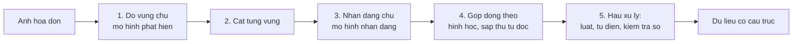

> **Mục tiêu bài học:** Sau bài này, bạn sẽ ghép được nhiều thành phần thị giác thành một hệ hoàn chỉnh, thấy bằng số liệu rằng phần khó nhất của một hệ thật thường **không nằm ở mô hình**, và có một danh sách kiểm tra để bàn giao hệ ấy cho người khác.

## 1. Vì sao đọc chữ không phải một bài phân loại

Mười một bài trước, mỗi bài giải một bài toán có hình dạng gọn: một nhãn, một danh sách hộp, một mặt nạ. Bài này lấy một việc thật - **đọc một tấm hóa đơn thành dữ liệu có cấu trúc** - và việc ấy không vừa với bất kỳ hình dạng nào ở trên.

Nghĩ thử xem đầu ra phải là gì. Không phải một nhãn. Không phải một danh sách hộp. Nó phải là thứ đại loại:

```
{ "cong_ty": "...", "so_hoa_don": "...", "ngay": "...",
  "mat_hang": [ {"ten": "...", "sl": 2, "don_gia": 1250000} ], "tong": 4235000 }
```

Để đi từ tấm ảnh tới cấu trúc ấy cần ít nhất năm bước, và chỉ hai trong năm bước là mô hình học máy:



Bước 1 là bài toán **phát hiện** của bài 07-08, chỉ khác chỗ vật thể cần tìm là dòng chữ. Bước 3 là bài toán nhận dạng chuỗi. Bước 2, 4 và 5 không có mô hình nào cả - chúng là cắt ảnh, hình học và luật. Mục 4 sẽ cho thấy hai bước "không mô hình" ấy quyết định chất lượng nhiều đến mức nào.

Ta dùng **EasyOCR** để lo hai bước mô hình: nó gồm một bộ dò vùng chữ (họ CRAFT) và một bộ nhận dạng chuỗi (họ CRNN, có tầng hồi quy và mất mát CTC). Bài này không đi sâu vào hai kiến trúc ấy - mở chúng ra đủ để hiểu pipeline là được, còn dựng lại từ đầu thì đã là chương khác.

## 2. Cách ngây thơ, và vì sao nó chưa xong việc

Tấm ảnh thử: một hóa đơn tiếng Việt 760×470, **11 dòng**, có dấu đầy đủ, có cột số lượng và ba cột tiền.

Cách ngây thơ là gọi đúng một hàm:

```python
import easyocr
reader = easyocr.Reader(['vi', 'en'], gpu=False)
ocr_results = reader.readtext("hoadon.png")
```

Kết quả: **2,85 giây**, trả về **30 vùng chữ** cho một tấm ảnh có 11 dòng. Vài vùng đầu tiên:

```
'CÔNG TY TNHH THƯƠNG MAl VIỆT LONG'   0,644
'Địa chỉ: 27'                          0,627
'Nguyễn Trãi, Thanh Xuân, Hà Nội'      0,839
'HÓA ĐƠN BÁN HÀNG'                     0,971
'Số: HD-2026-0917'                     0,986
'Ngày: 09/09/2026'                     0,750
'Khách'                                0,993
'Trẩn'                                 1,000
```

Ba vấn đề lộ ra ngay, và không cái nào chữa được bằng cách đổi mô hình:

**Một dòng bị cắt thành nhiều mảnh.** "Địa chỉ: 27 Nguyễn Trãi..." thành hai vùng; dòng "Khách hàng: Trần Thị Hương" thành **năm** vùng. Bộ dò chữ làm việc của nó - nó tìm những vùng có chữ - nhưng nó không có khái niệm "dòng".

**Thứ tự trả về chưa phải thứ tự đọc của tài liệu.** EasyOCR có làm một bước sắp xếp hình học cơ bản - gom hộp theo dòng rồi xếp theo tọa độ - nhưng đó là sắp xếp *hộp*, không phải hiểu *bố cục*. Với hóa đơn có cột, bảng, hay tài liệu hai cột, thứ tự ấy không tương ứng với thứ tự người đọc, và các mảnh của cùng một dòng vẫn nằm rời nhau. Mục 4 phải tự dựng lại bước gộp dòng.

**Confidence 1,000 cho một từ sai.** Chữ "Trần" bị đọc thành **"Trẩn"** - sai dấu - với độ tin cậy **tròn 1,000**. Đây đúng là chuyện bài 01 đã gặp khi mô hình gọi con cá là "wall clock" với xác suất 1,000. Cùng một bài học, lần này ở chỗ nó gây thiệt hại thật: một cái tên sai dấu trong hóa đơn là dữ liệu hỏng.

## 3. Hai giai đoạn, và giai đoạn nào tốn thời gian

EasyOCR cho phép gọi riêng từng giai đoạn, và đó là cách duy nhất để biết mình đang trả tiền cho cái gì:

```python
horizontal, free = reader.detect("hoadon.png")                       # giai đoạn 1
ocr_results = reader.recognize("hoadon.png", horizontal_list=horizontal[0],
                           free_list=free[0])                        # giai đoạn 2
```

| Giai đoạn | Thời gian | Tỉ lệ |
|---|---|---|
| Dò vùng chữ | **1,99 s** | **70,7%** |
| Nhận dạng 30 vùng | 0,82 s | 29,3% |

`detect()` trả về hai danh sách: **25 hộp nằm ngang** và **5 hộp tự do** cho những vùng chữ nghiêng hoặc không vuông vắn. Cộng lại đúng 30 vùng, khớp với số `readtext()` trả về - hai đường gọi cho cùng kết quả, chỉ khác chỗ `readtext()` gộp sẵn hai danh sách còn `detect()` để riêng.

**Dò vùng chiếm hơn hai phần ba thời gian**, dù nhận dạng phải xử lý 30 vùng còn dò chỉ chạy một lượt trên cả ảnh. Hệ quả thực dụng: muốn tăng tốc thì phải tối ưu bước dò trước, chẳng hạn hạ độ phân giải đầu vào - chứ đổi mô hình nhận dạng cho nhanh hơn thì cùng lắm tiết kiệm được 29%.

Và có một hệ quả quan trọng hơn về chất lượng. Bước dò đặt **trần trên cho cả hệ**: vùng nào nó không tìm ra thì bộ nhận dạng không bao giờ có cơ hội đọc, nên recall của bước dò là mức trần mà mọi bước sau không vượt qua được. Điều đó không có nghĩa nó luôn là chỗ tệ nhất - tùy tài liệu, chất lượng cuối vẫn có thể bị chặn ở bước nhận dạng hoặc bước gộp dòng. Đây đúng điểm yếu cấu trúc mà bài 09 đã nêu với Mask R-CNN - vật nào không được phát hiện thì không bao giờ có mặt nạ.

## 4. Gộp dòng: bước không có mô hình nào

30 mảnh rời không dùng được. Cần gộp chúng lại thành dòng, và đây là hình học thuần túy: **hai mảnh thuộc cùng một dòng nếu tâm theo chiều dọc của chúng đủ gần nhau**, rồi trong mỗi dòng sắp theo tọa độ ngang.

```python
items = []
for box, txt, cf in ocr_results:
    ys = [p[1] for p in box]
    items.append(dict(x=min(p[0] for p in box), y=(min(ys)+max(ys))/2,
                      h=max(ys)-min(ys), txt=txt, cf=cf))
items.sort(key=lambda a: (a["y"], a["x"]))

lines = []
for it in items:
    if lines and abs(it["y"] - lines[-1]["y"]) < max(12, it["h"] * 0.6):
        lines[-1]["parts"].append(it)                 # cùng dòng
    else:
        lines.append(dict(y=it["y"], parts=[it]))     # dòng mới
for L in lines:
    L["parts"].sort(key=lambda a: a["x"])             # trái sang phải
```

Ngưỡng `max(12, h * 0.6)` là chỗ duy nhất phải chỉnh tay: khoảng cách dọc nhỏ hơn 60% chiều cao chữ thì coi là cùng dòng. Chạy xong, **30 mảnh gộp thành đúng 11 dòng** - khớp số dòng thật.

Kết quả sau khi gộp, cùng độ tin cậy thấp nhất trong mỗi dòng:

```
[1 mảnh, 0,644]  CÔNG TY TNHH THƯƠNG MAl VIỆT LONG
[2 mảnh, 0,627]  Địa chỉ: 27 Nguyễn Trãi, Thanh Xuân, Hà Nội
[1 mảnh, 0,971]  HÓA ĐƠN BÁN HÀNG
[2 mảnh, 0,750]  Số: HD-2026-0917 Ngày: 09/09/2026
[5 mảnh, 0,993]  Khách hàng: Trẩn Thị Hương
[6 mảnh, 0,695]  Mặt hàng SL Đơn giá Thành tiển
[3 mảnh, 0,906]  Bàn phím cơ 1.250.000 2.500.000
[3 mảnh, 0,977]  Chuột không dây 450.000 1.350.000
[3 mảnh, 0,880]  Tổng cộng: 3.850.000
[2 mảnh, 0,794]  Thuế GTGT 109: 385.000
[2 mảnh, 0,897]  TỔNG THANH TOÁN: 4.235.000
```

**5 trên 11 dòng đúng hoàn toàn.** Sáu dòng còn lại sai, và chúng sai theo bốn kiểu rất khác nhau:

| Đọc ra | Đúng phải là | Kiểu lỗi |
|---|---|---|
| THƯƠNG **MAl** | THƯƠNG **MẠI** | mất dấu, và chữ I hoa đọc thành chữ l thường |
| **Trẩn** Thị Hương | **Trần** Thị Hương | sai dấu, confidence 1,000 |
| Thành **tiển** | Thành **tiền** | sai dấu |
| Thuế GTGT **109**: | Thuế GTGT **10%**: | ký hiệu % đọc thành chữ số 9 |
| Bàn phím cơ ~~2~~ 1.250.000 | Bàn phím cơ **2** 1.250.000 | **mất hẳn cột số lượng** |
| Chuột không dây ~~3~~ 450.000 | Chuột không dây **3** 450.000 | **mất hẳn cột số lượng** |

Hai dòng cuối là loại lỗi nguy hiểm nhất, và nó **không phải lỗi nhận dạng**. Chữ số "2" và "3" đứng một mình giữa khoảng trắng rộng; bộ dò vùng chữ không coi chúng là một vùng đáng trả về, nên chúng biến mất trước khi bộ nhận dạng kịp nhìn. Không có ngưỡng confidence nào bắt được lỗi này - thứ bị mất **không xuất hiện trong đầu ra dưới bất kỳ hình thức nào**.

Ba lỗi dấu tiếng Việt thì cùng một họ: dấu thanh là những nét rất nhỏ, và ở độ phân giải này chúng chỉ chiếm vài pixel.

## 5. Hậu xử lý: chỗ lấy lại được nhiều nhất

Không mô hình nào ở trên biết đây là **hóa đơn**. Con người thì biết, và biết ấy đổi thành luật được:

**Trích số tiền bằng biểu thức chính quy.** Số tiền Việt Nam có dạng rất đặc trưng - nhóm ba chữ số ngăn bằng dấu chấm:

```python
import re
amounts = re.findall(r"\d{1,3}(?:[.,]\d{3})+", line)
```

Chạy trên 11 dòng đã gộp, nó lấy ra đúng cả bảy con số: `1.250.000` · `2.500.000` · `450.000` · `1.350.000` · `3.850.000` · `385.000` · `4.235.000`. **Trên tấm ảnh này, không con số tiền nào bị đọc sai**, trong khi các lỗi đều tập trung ở dấu tiếng Việt. Một tấm ảnh thì chưa đủ để nói "chữ số luôn dễ đọc hơn dấu" - muốn khẳng định phải chấm trên một tập hóa đơn thật - nhưng nó gợi ý một chiến lược đáng thử: **rút phần dễ máy hóa trước, rồi dùng ràng buộc để kiểm phần còn lại**.

**Kiểm tra bằng ràng buộc số học.** Đây là thứ mạnh nhất và hay bị bỏ quên. Hóa đơn có những đẳng thức phải đúng:

- $2.500.000 + 1.350.000 = 3.850.000$ ✓ khớp dòng "Tổng cộng"
- $3.850.000 \times 10\% = 385.000$ ✓ khớp dòng thuế
- $3.850.000 + 385.000 = 4.235.000$ ✓ khớp dòng tổng thanh toán

Ba phép kiểm tra này **không cần mô hình nào** và bắt được cả những lỗi mà confidence không bắt được. Chúng cũng cứu được cột số lượng bị mất: biết đơn giá 1.250.000 và thành tiền 2.500.000 thì số lượng phải là 2 - suy ra được, dù mô hình chưa bao giờ nhìn thấy chữ số ấy.

**Dùng từ điển cho phần chữ - nhưng chỉ ở đúng chỗ.** Hai lỗi "MAl" và "tiển" nằm trong ngữ cảnh từ vựng thông thường: "THƯƠNG MẠI" và "Thành tiền" là những cụm rất chuẩn, nên một bộ kiểm chính tả tiếng Việt sửa được gần như chắc chắn.

"Trẩn" thì khác hẳn, dù trông cùng loại lỗi. Nó nằm ở trường **tên người**, nơi từ điển không có thẩm quyền - tên riêng vốn không tuân theo từ vựng chuẩn. Nguyên tắc chung cho tài liệu tài chính: **tên người, mã hàng, mã số thuế và con số tuyệt đối không để bộ kiểm chính tả tự sửa**, chỉ được đánh dấu để người kiểm. Một hệ tự ý "sửa" tên khách hàng cho đúng chính tả là hệ tạo ra dữ liệu sai một cách rất khó phát hiện.

> ⚠️ **Lưu ý nhỏ:** ba con số ở mục 4 - 11 dòng, 5 dòng đúng hoàn toàn, 2,85 giây - là **đo trên đúng một tấm ảnh tôi tự tạo**, theo quy ước ba loại con số của bài 01. Chúng minh họa các *kiểu* lỗi, không đo được tỉ lệ lỗi của EasyOCR. Muốn con số dùng được thì phải chấm trên một tập hóa đơn thật có nhãn, với thước đo riêng của ngành - thường là tỉ lệ ký tự sai (CER) và tỉ lệ từ sai (WER) - chứ không phải "số dòng đúng hoàn toàn". Và ảnh chụp bằng điện thoại còn thêm nghiêng, mờ, lóa, nếp gấp; tấm ảnh dựng sẵn ở đây không có gì trong số đó.

> 🔧 **Thử ngay:** hệ của bạn đọc sai một chữ số trong tổng tiền, nhưng ba phép kiểm tra số học ở trên đều khớp. Chuyện gì đã xảy ra?
> Nhiều khả năng **nhiều con số cùng bị đọc sai một cách nhất quán**, hoặc phép kiểm tra đang lấy chính con số sai làm chuẩn. Ví dụ nếu dấu phân cách nghìn bị đọc lẫn ở cả cột đơn giá lẫn cột thành tiền theo cùng một kiểu, các đẳng thức vẫn khớp với nhau trong khi mọi con số đều sai so với ảnh gốc. Phép kiểm tra bằng ràng buộc chỉ chứng minh **tính nhất quán nội bộ**, không chứng minh tính đúng - đúng như bài 04 đã nói về heatmap: một lời giải thích hợp lý không phải bằng chứng. Muốn chắc thì cần một nguồn độc lập: đối chiếu với đơn hàng trong hệ thống, hoặc cho người kiểm những hóa đơn có giá trị lớn.

## 6. Bàn giao

Gói bàn giao của một hệ nhiều thành phần khác hẳn gói của một mô hình đơn lẻ ở chương Deep Learning · Bài 12. Ở đó chỉ cần trọng số cộng phép tiền xử lý; ở đây cần cả **thứ tự và ràng buộc giữa các bước**.

- **Sơ đồ pipeline** với đầu vào và đầu ra của từng bước, kèm định dạng dữ liệu đi giữa các bước.
- **Phiên bản của từng thành phần**: `easyocr 1.7.2`, `torch 2.14.0`, `torchvision 0.29.0`, cùng danh sách ngôn ngữ đã bật (`['vi', 'en']` - bật thêm ngôn ngữ làm đổi kết quả).
- **Mọi ngưỡng chỉnh tay và lý do chọn**: ngưỡng gộp dòng `max(12, h*0.6)`, ngưỡng confidence để đánh dấu, biểu thức chính quy trích tiền.
- **Danh sách kiểu lỗi đã biết** - bảng ở mục 4 chính là thứ này, và nó hữu ích hơn một con số tỉ lệ lỗi vì nó nói *sai kiểu gì*.
- **Ngân sách thời gian tách theo bước** (dò 1,99 s, nhận dạng 0,82 s), để người sau biết tối ưu chỗ nào.
- **Quy tắc chuyển cho người**: hóa đơn nào không thỏa ràng buộc số học, hoặc có dòng confidence dưới ngưỡng, phải đưa người kiểm chứ không được tự động duyệt.

Điểm cuối là quan trọng nhất và thường bị bỏ. Một hệ đọc hóa đơn không cần đúng 100% mới dùng được - nó cần **biết lúc nào mình có thể sai** và chuyển những ca ấy cho người. Đó cũng là tinh thần chọn ngưỡng theo chi phí của chương Machine Learning · Bài 12: cái giá của một hóa đơn sai âm thầm lớn hơn nhiều cái giá của một hóa đơn bị đưa ra kiểm lại.

## Tóm tắt bài học

- Đọc chữ trong ảnh không phải một bài toán học máy đơn lẻ mà là **một hệ năm bước**, trong đó chỉ hai bước là mô hình.
- Gọi thẳng `readtext()` cho **30 mảnh rời** trên một hóa đơn 11 dòng, sai thứ tự đọc, và không dùng được ngay.
- Tách hai giai đoạn cho thấy **dò vùng chữ chiếm 70,7% thời gian** (1,99 s so với 0,82 s) và đặt **trần trên cho chất lượng**: vùng nào không dò ra thì không bao giờ được đọc. `detect()` trả 25 hộp ngang cộng 5 hộp tự do, đúng bằng 30 vùng của `readtext()`.
- EasyOCR có sắp xếp hộp theo hình học, nhưng đó chưa phải hiểu bố cục. Gộp dòng bằng hình học - không mô hình nào - đưa 30 mảnh về đúng **11 dòng**.
- 5 trên 11 dòng đúng hoàn toàn. Lỗi chia làm bốn kiểu, trong đó **mất hẳn cột số lượng** là nguy hiểm nhất vì thứ bị mất không xuất hiện trong đầu ra, nên không ngưỡng confidence nào bắt được.
- Chữ "Trần" bị đọc thành "Trẩn" với confidence **1,000** - cùng bài học với "wall clock 1,000" ở bài 01.
- Hậu xử lý lấy lại rất nhiều: biểu thức chính quy trích đúng **cả 7 con số tiền**, và ba ràng buộc số học của hóa đơn đều khớp, thậm chí suy ngược ra được cột số lượng đã mất.
- Nhưng từ điển chỉ được áp cho **từ vựng thông thường**: tên người, mã hàng, mã số thuế và con số phải để người kiểm, không được tự sửa.
- Ràng buộc số học chỉ chứng minh **tính nhất quán nội bộ**, không chứng minh tính đúng.
- Bàn giao một hệ nhiều thành phần cần thêm: sơ đồ pipeline, mọi ngưỡng chỉnh tay kèm lý do, danh sách kiểu lỗi đã biết, ngân sách thời gian từng bước, và **quy tắc chuyển ca khó cho người**.

## Câu hỏi tự kiểm tra

1. Vì sao đầu ra của bài toán đọc hóa đơn không vừa với hình dạng đầu ra của phân loại, phát hiện hay phân đoạn?
2. Bước dò vùng chữ chiếm 70,7% thời gian nhưng chỉ chạy một lượt, còn nhận dạng phải xử lý 30 vùng. Giải thích, và nêu bạn sẽ tối ưu chỗ nào trước.
3. Cột số lượng "2" và "3" biến mất. Đây là lỗi của bước nào, và vì sao ngưỡng confidence không bắt được?
4. Chữ "Trần" bị đọc thành "Trẩn" với confidence 1,000. Nối hiện tượng này với kết quả nào ở bài 01, và rút ra nguyên tắc chung.
5. Ngưỡng gộp dòng là `max(12, h*0.6)`. Chuyện gì xảy ra nếu đặt quá lớn? Nếu đặt quá nhỏ?
6. "MAl" và "Trẩn" đều là lỗi sai dấu. Vì sao chỉ được để bộ kiểm chính tả tự sửa một trong hai?
7. Ba phép kiểm tra số học của hóa đơn đều khớp nhưng mọi con số vẫn có thể sai. Cho một tình huống cụ thể và nêu cách phát hiện.
8. Vì sao "số dòng đúng hoàn toàn" là thước đo tồi cho một hệ OCR? Nêu thước đo phù hợp hơn và giải thích.
9. Thiết kế quy tắc quyết định hóa đơn nào được duyệt tự động và hóa đơn nào phải chuyển cho người. Bạn dùng những tín hiệu gì?

## Đọc thêm

**Nguồn nền tảng của bài:**

| Nguồn | Đọc phần nào |
|---|---|
| **Bài 07-08 của chương này** | Phát hiện vật thể - bước dò vùng chữ là chính bài toán ấy với "vật thể" là dòng chữ |
| **Bài 01 của chương này** | Confidence cao không có nghĩa là đúng; và quy ước ba loại con số |
| **Chương Machine Learning · Bài 12** | Chọn ngưỡng theo chi phí, và checklist bàn giao |
| **Chương Deep Learning · Bài 12** | Gói bàn giao của một mô hình đơn lẻ, để thấy hệ nhiều thành phần cần thêm gì |

**Nguồn online bổ sung (miễn phí):**

- [EasyOCR](https://github.com/JaidedAI/EasyOCR) - thư viện dùng trong bài, kèm danh sách ngôn ngữ hỗ trợ và các tham số của `detect` / `recognize`.
- [Baek và cộng sự - Character Region Awareness for Text Detection (CRAFT, CVPR 2019)](https://arxiv.org/abs/1904.01941) - bộ dò vùng chữ mà EasyOCR dùng ở bước 1.
- [Shi, Bai, Yao - An End-to-End Trainable Neural Network for Image-based Sequence Recognition (CRNN, 2015)](https://arxiv.org/abs/1507.05717) - kiến trúc nhận dạng chuỗi và mất mát CTC ở bước 3.
- [docTR](https://github.com/mindee/doctr) - thư viện OCR tài liệu khác, tách bước rõ ràng, tiện để đối chiếu cách thiết kế pipeline.
- [Graves và cộng sự - Connectionist Temporal Classification (ICML 2006)](https://www.cs.toronto.edu/~graves/icml_2006.pdf) - bài báo gốc của CTC, đọc nếu muốn hiểu vì sao nhận dạng chuỗi không cần biết trước vị trí từng ký tự.

## Kết thúc chương Computer Vision

Mười hai bài vừa rồi đi theo một mạch.

**Bài 01-03** dựng nền: ảnh vào mô hình là tensor gì và hỏng ra sao, cách đọc một kiến trúc tích chập bằng ba con số, và vì sao kết nối tắt làm mạng sâu huấn luyện được.

**Bài 04-06** chuyển từ "chạy mô hình" sang "hiểu và điều khiển nó": mô hình dựa vào vùng nào, dữ liệu nên chuẩn bị ra sao, và fine-tune tới đâu là hợp.

**Bài 07-09** mở rộng hình dạng câu trả lời: từ một nhãn sang danh sách hộp, rồi sang mặt nạ pixel, rồi sang từng thực thể riêng biệt - mỗi bước một thước đo mới.

**Bài 10-12** nhìn về phía trước: kiến trúc không dựa trên tích chập, biểu diễn dùng lại được cho việc chưa định nghĩa, và một hệ thật ghép từ nhiều mảnh.

Vài điều đáng mang theo:

- **Phần lớn lỗi nằm ngoài mô hình.** Bài 01 mất 87 điểm vì một phép tiền xử lý; bài 12 mất cả cột dữ liệu vì bước dò chứ không phải bước đọc. Mô hình hiếm khi là chỗ đáng sửa đầu tiên.
- **Confidence không phải xác suất đúng.** Ba lần trong chương này, mô hình sai với độ tin cậy gần hoặc bằng 1,000.
- **Mỗi con số phải kèm câu hỏi mà nó trả lời.** 0,8718 và 0,9985 là cùng một mô hình trên cùng những tấm ảnh.
- **Công cụ giải thích là để chẩn đoán, không phải để chứng minh.** Một phần ba số ảnh thử ở bài 04 phản bác chính tấm heatmap của chúng.
- **Nhãn thật cũng chỉ là ý kiến của người gán nhãn** - chó nhồi bông hay gấu bông, không có đáp án trong ảnh.

Chương này cố tình dừng ở vài chỗ. Bài 10 chỉ mở phần attention riêng của ảnh, để **chương Generative AI** dựng transformer đầy đủ cho ngôn ngữ. Bài 11 dừng ngay sau CLIP, trước các mô hình sinh ảnh - cũng là chương ấy. Và cả chương không đụng tới video, ảnh 3D hay ước lượng tư thế; chúng là nhánh nâng cao, không phải phần nền.

Đó là chỗ chương Generative AI bắt đầu.

> **Bài tiếp theo:** [Mô hình ngôn ngữ thực chất làm gì](../what-a-language-model-really-does-vi/) - chương Generative AI bắt đầu từ đây.
