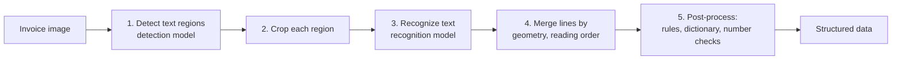

> **Learning objectives:** After this lesson, you will be able to assemble several vision components into a complete system, see in numbers that the hardest part of a real system usually **does not lie in the model**, and have a checklist for handing that system over to someone else.

## 1. Why reading text is not a classification problem

In the previous eleven lessons, each lesson solved a problem with a neat shape: a label, a list of boxes, a mask. This lesson takes a real job - **reading an invoice into structured data** - and that job does not fit any of the shapes above.

Think about what the output has to be. Not a label. Not a list of boxes. It has to be something like:

```
{ "cong_ty": "...", "so_hoa_don": "...", "ngay": "...",
  "mat_hang": [ {"ten": "...", "sl": 2, "don_gia": 1250000} ], "tong": 4235000 }
```

Getting from the image to that structure takes at least five steps, and only two of the five are machine learning models:



Step 1 is the **detection** problem of Lessons 07-08, the only difference being that the objects to find are lines of text. Step 3 is a sequence recognition problem. Steps 2, 4 and 5 involve no model at all - they are image cropping, geometry and rules. Section 4 will show how much those "model-free" steps determine the quality.

We use **EasyOCR** to handle the two model steps: it consists of a text region detector (the CRAFT family) and a sequence recognizer (the CRNN family, with a recurrent layer and CTC loss). This lesson does not go deep into those two architectures - opening them up enough to understand the pipeline is enough, and rebuilding them from scratch is another chapter altogether.

## 2. The naive approach, and why it does not finish the job

The test image: a Vietnamese invoice, 760×470, **11 lines**, with full diacritics, a quantity column and three money columns.

The naive approach is to call exactly one function:

```python
import easyocr
reader = easyocr.Reader(['vi', 'en'], gpu=False)
ocr_results = reader.readtext("hoadon.png")
```

The result: **2.85 seconds**, returning **30 text regions** for an image with 11 lines. The first few regions:

```
'CÔNG TY TNHH THƯƠNG MAl VIỆT LONG'   0,644
'Địa chỉ: 27'                          0,627
'Nguyễn Trãi, Thanh Xuân, Hà Nội'      0,839
'HÓA ĐƠN BÁN HÀNG'                     0,971
'Số: HD-2026-0917'                     0,986
'Ngày: 09/09/2026'                     0,750
'Khách'                                0,993
'Trẩn'                                 1,000
```

Three problems show up immediately, and none of them can be fixed by changing the model:

**One line is cut into several pieces.** "Địa chỉ: 27 Nguyễn Trãi..." (the address) becomes two regions; the line "Khách hàng: Trần Thị Hương" (the customer) becomes **five** regions. The text detector is doing its job - it finds regions containing text - but it has no concept of a "line".

**The returned order is not yet the document's reading order.** EasyOCR does perform a basic geometric sort - grouping boxes by line and then ordering by coordinates - but that is sorting *boxes*, not understanding *layout*. With an invoice that has columns, tables, or a two-column document, that order does not match the order a person reads in, and the pieces of the same line still sit apart. Section 4 has to rebuild the line-merging step itself.

**Confidence 1.000 for a wrong word.** The name "Trần" is read as **"Trẩn"** - wrong tone mark - with a confidence of **exactly 1.000**. This is exactly what Lesson 01 ran into when the model called a fish a "wall clock" with probability 1.000. The same lesson, this time in a place where it does real damage: a name with the wrong diacritic on an invoice is corrupted data.

## 3. Two stages, and which stage takes the time

EasyOCR lets you call each stage separately, and that is the only way to know what you are paying for:

```python
horizontal, free = reader.detect("hoadon.png")                       # stage 1
ocr_results = reader.recognize("hoadon.png", horizontal_list=horizontal[0],
                           free_list=free[0])                        # stage 2
```

| Stage | Time | Share |
|---|---|---|
| Text region detection | **1.99 s** | **70.7%** |
| Recognizing 30 regions | 0.82 s | 29.3% |

`detect()` returns two lists: **25 horizontal boxes** and **5 free-form boxes** for text regions that are slanted or not rectangular. Together that is exactly 30 regions, matching the number `readtext()` returns - two call paths giving the same result, the only difference being that `readtext()` merges the two lists for you while `detect()` keeps them separate.

**Detection takes more than two thirds of the time**, even though recognition has to process 30 regions while detection runs only one pass over the whole image. The practical consequence: to speed things up you have to optimize the detection step first, for example by lowering the input resolution - swapping in a faster recognition model would save at most 29%.

And there is a more important consequence for quality. The detection step sets **an upper ceiling for the whole system**: a region it does not find never gets a chance to be read by the recognizer, so the recall of the detection step is a ceiling that no later step can exceed. That does not mean it is always the worst part - depending on the document, the final quality can still be capped by the recognition step or the line-merging step. This is exactly the structural weakness Lesson 09 pointed out with Mask R-CNN - an object that is not detected never gets a mask.

## 4. Merging lines: the step with no model

30 separate pieces are not usable. They need to be merged into lines, and this is pure geometry: **two pieces belong to the same line if their vertical centers are close enough**, and then within each line they are sorted by horizontal coordinate.

```python
items = []
for box, txt, cf in ocr_results:
    ys = [p[1] for p in box]
    items.append(dict(x=min(p[0] for p in box), y=(min(ys)+max(ys))/2,
                      h=max(ys)-min(ys), txt=txt, cf=cf))
items.sort(key=lambda a: (a["y"], a["x"]))

lines = []
for it in items:
    if lines and abs(it["y"] - lines[-1]["y"]) < max(12, it["h"] * 0.6):
        lines[-1]["parts"].append(it)                 # same line
    else:
        lines.append(dict(y=it["y"], parts=[it]))     # new line
for L in lines:
    L["parts"].sort(key=lambda a: a["x"])             # left to right
```

The threshold `max(12, h * 0.6)` is the only thing you have to tune by hand: a vertical distance smaller than 60% of the text height counts as the same line. After running it, **the 30 pieces merge into exactly 11 lines** - matching the real number of lines.

The result after merging, together with the lowest confidence in each line:

```
[1 piece,  0,644]  CÔNG TY TNHH THƯƠNG MAl VIỆT LONG
[2 pieces, 0,627]  Địa chỉ: 27 Nguyễn Trãi, Thanh Xuân, Hà Nội
[1 piece,  0,971]  HÓA ĐƠN BÁN HÀNG
[2 pieces, 0,750]  Số: HD-2026-0917 Ngày: 09/09/2026
[5 pieces, 0,993]  Khách hàng: Trẩn Thị Hương
[6 pieces, 0,695]  Mặt hàng SL Đơn giá Thành tiển
[3 pieces, 0,906]  Bàn phím cơ 1.250.000 2.500.000
[3 pieces, 0,977]  Chuột không dây 450.000 1.350.000
[3 pieces, 0,880]  Tổng cộng: 3.850.000
[2 pieces, 0,794]  Thuế GTGT 109: 385.000
[2 pieces, 0,897]  TỔNG THANH TOÁN: 4.235.000
```

**5 out of 11 lines are completely correct.** The other six lines are wrong, and they are wrong in four very different ways:

| Read as | Should be | Error type |
|---|---|---|
| THƯƠNG **MAl** | THƯƠNG **MẠI** | lost diacritic, and uppercase I read as lowercase l |
| **Trẩn** Thị Hương | **Trần** Thị Hương | wrong tone mark, confidence 1.000 |
| Thành **tiển** | Thành **tiền** | wrong tone mark |
| Thuế GTGT **109**: | Thuế GTGT **10%**: | the % sign read as the digit 9 |
| Bàn phím cơ ~~2~~ 1.250.000 | Bàn phím cơ **2** 1.250.000 | **quantity column lost entirely** |
| Chuột không dây ~~3~~ 450.000 | Chuột không dây **3** 450.000 | **quantity column lost entirely** |

The last two rows are the most dangerous kind of error, and it is **not a recognition error**. The digits "2" and "3" (the quantities for a mechanical keyboard and a wireless mouse) stand alone amid wide white space; the text detector does not consider them a region worth returning, so they vanish before the recognizer ever gets to look. No confidence threshold can catch this error - what was lost **does not appear in the output in any form**.

The three Vietnamese diacritic errors belong to the same family: tone marks are very small strokes, and at this resolution they take up only a few pixels.

## 5. Post-processing: where you recover the most

None of the models above knows this is an **invoice**. A human does, and that knowledge can be turned into rules:

**Extract money amounts with a regular expression.** Vietnamese money amounts have a very distinctive form - groups of three digits separated by dots:

```python
import re
amounts = re.findall(r"\d{1,3}(?:[.,]\d{3})+", line)
```

Run on the 11 merged lines, it pulls out all seven numbers correctly: `1.250.000` · `2.500.000` · `450.000` · `1.350.000` · `3.850.000` · `385.000` · `4.235.000`. **On this image, not a single money amount was misread**, while the errors are all concentrated in Vietnamese diacritics. One image is not enough to say "digits are always easier to read than diacritics" - to claim that you would have to score on a set of real invoices - but it suggests a strategy worth trying: **extract the parts that are easy to automate first, then use constraints to check the rest**.

**Checking with arithmetic constraints.** This is the most powerful tool and the one most often forgotten. An invoice has equalities that must hold:

- $2{,}500{,}000 + 1{,}350{,}000 = 3{,}850{,}000$ ✓ matches the "Tổng cộng" (subtotal) line
- $3{,}850{,}000 \times 10\% = 385{,}000$ ✓ matches the tax line
- $3{,}850{,}000 + 385{,}000 = 4{,}235{,}000$ ✓ matches the total payable line

These three checks **need no model at all** and catch even errors that confidence cannot. They also rescue the lost quantity column: knowing the unit price 1,250,000 and the line total 2,500,000, the quantity must be 2 - it can be inferred, even though the model never saw that digit.

**Use a dictionary for the text - but only in the right place.** The two errors "MAl" and "tiển" sit in ordinary vocabulary: "THƯƠNG MẠI" (trading) and "Thành tiền" (amount) are very standard phrases, so a Vietnamese spell checker can fix them almost with certainty.

"Trẩn" is entirely different, even though it looks like the same kind of error. It sits in a **person's name** field, where the dictionary has no authority - proper names by nature do not follow standard vocabulary. The general principle for financial documents: **never let a spell checker automatically fix person names, product codes, tax codes or numbers**; only flag them for a human to check. A system that takes it upon itself to "correct" a customer's name to proper spelling is a system that produces wrong data in a way that is very hard to detect.

> ⚠️ **A small note:** the three numbers in section 4 - 11 lines, 5 lines completely correct, 2.85 seconds - are **measured on exactly one image that I made myself**, under the three-kinds-of-numbers convention of Lesson 01. They illustrate the *types* of error; they cannot measure EasyOCR's error rate. To get usable numbers you would have to score on a labeled set of real invoices, with the field's own metrics - usually character error rate (CER) and word error rate (WER) - not "number of completely correct lines". And photos taken with a phone add skew, blur, glare, folds; the synthetic image here has none of those.

> 🔧 **Try it now:** your system misreads one digit in the total amount, but all three arithmetic checks above still match. What happened?
> Most likely **several numbers were misread in a consistent way**, or the check is using the misread number itself as its reference. For example, if the thousands separator is misread in the same way in both the unit price column and the line total column, the equalities still agree with one another while every number is wrong compared with the original image. A constraint check only proves **internal consistency**, not correctness - just as Lesson 04 said about heatmaps: a plausible explanation is not evidence. To be sure, you need an independent source: cross-check against the order in your system, or have a human review high-value invoices.

## 6. Handover

The handover package of a multi-component system is very different from the package for a single model in Deep Learning · Lesson 12. There you only needed the weights plus the preprocessing; here you also need **the order of and the constraints between the steps**.

- **A pipeline diagram** with the input and output of each step, along with the data format passed between steps.
- **The version of each component**: `easyocr 1.7.2`, `torch 2.14.0`, `torchvision 0.29.0`, plus the list of enabled languages (`['vi', 'en']` - enabling more languages changes the results).
- **Every hand-tuned threshold and why it was chosen**: the line-merging threshold `max(12, h*0.6)`, the confidence threshold for flagging, the regular expression for extracting amounts.
- **The list of known error types** - the table in section 4 is exactly this, and it is more useful than an error-rate number because it tells you *what kind of wrong*.
- **The time budget broken down by step** (detection 1.99 s, recognition 0.82 s), so whoever comes next knows where to optimize.
- **Rules for routing to a human**: any invoice that fails the arithmetic constraints, or has a line with confidence below the threshold, must go to a human reviewer rather than being approved automatically.

The last point is the most important and the most often skipped. An invoice-reading system does not need to be 100% correct to be usable - it needs to **know when it might be wrong** and hand those cases to a human. That is also the spirit of cost-based threshold selection in Machine Learning · Lesson 12: the cost of an invoice that is silently wrong is far larger than the cost of an invoice sent back for review.

## Lesson summary

- Reading text in an image is not a single machine learning problem but **a five-step system**, in which only two steps are models.
- Calling `readtext()` directly gives **30 separate pieces** for an 11-line invoice, in the wrong reading order, and not usable as is.
- Separating the two stages shows that **text detection takes 70.7% of the time** (1.99 s versus 0.82 s) and sets **an upper ceiling on quality**: a region that is not detected is never read. `detect()` returns 25 horizontal boxes plus 5 free-form boxes, exactly the 30 regions of `readtext()`.
- EasyOCR sorts boxes geometrically, but that is not yet understanding layout. Merging lines with geometry - no model at all - brings the 30 pieces down to exactly **11 lines**.
- 5 out of 11 lines are completely correct. The errors fall into four types, of which **losing the quantity column entirely** is the most dangerous, because what was lost does not appear in the output, so no confidence threshold can catch it.
- The name "Trần" is read as "Trẩn" with confidence **1.000** - the same lesson as "wall clock 1.000" in Lesson 01.
- Post-processing recovers a great deal: the regular expression extracts **all 7 money amounts** correctly, and the invoice's three arithmetic constraints all match, even allowing the lost quantity column to be inferred back.
- But the dictionary may only be applied to **ordinary vocabulary**: person names, product codes, tax codes and numbers must be left for a human to check, never auto-corrected.
- Arithmetic constraints only prove **internal consistency**, not correctness.
- Handing over a multi-component system additionally requires: a pipeline diagram, every hand-tuned threshold with its reason, the list of known error types, the time budget of each step, and **rules for routing hard cases to a human**.

## Self-check questions

1. Why does the output of the invoice-reading problem not fit the output shape of classification, detection or segmentation?
2. The text detection step takes 70.7% of the time but runs only one pass, while recognition has to process 30 regions. Explain, and say where you would optimize first.
3. The quantities "2" and "3" disappeared. Which step's error is this, and why can a confidence threshold not catch it?
4. The name "Trần" is read as "Trẩn" with confidence 1.000. Connect this phenomenon to a result in Lesson 01, and draw a general principle.
5. The line-merging threshold is `max(12, h*0.6)`. What happens if it is set too large? Too small?
6. "MAl" and "Trẩn" are both diacritic errors. Why may only one of the two be auto-corrected by a spell checker?
7. The invoice's three arithmetic checks all match, yet every number could still be wrong. Give a concrete scenario and say how to detect it.
8. Why is "number of completely correct lines" a poor metric for an OCR system? Name a more suitable metric and explain.
9. Design rules for deciding which invoices are approved automatically and which must be routed to a human. What signals do you use?

## Further reading

**Foundational sources for this lesson:**

| Source | Which part to read |
|---|---|
| **Lessons 07-08 of this chapter** | Object detection - the text detection step is that very problem with lines of text as the "objects" |
| **Lesson 01 of this chapter** | High confidence does not mean correct; and the three-kinds-of-numbers convention |
| **Machine Learning · Lesson 12** | Cost-based threshold selection, and the handover checklist |
| **Deep Learning · Lesson 12** | The handover package of a single model, to see what a multi-component system needs on top |

**Additional online sources (free):**

- [EasyOCR](https://github.com/JaidedAI/EasyOCR) - the library used in this lesson, with the list of supported languages and the parameters of `detect` / `recognize`.
- [Baek et al. - Character Region Awareness for Text Detection (CRAFT, CVPR 2019)](https://arxiv.org/abs/1904.01941) - the text region detector EasyOCR uses in step 1.
- [Shi, Bai, Yao - An End-to-End Trainable Neural Network for Image-based Sequence Recognition (CRNN, 2015)](https://arxiv.org/abs/1507.05717) - the sequence recognition architecture and CTC loss in step 3.
- [docTR](https://github.com/mindee/doctr) - another document OCR library with clearly separated steps, handy for comparing pipeline designs.
- [Graves et al. - Connectionist Temporal Classification (ICML 2006)](https://www.cs.toronto.edu/~graves/icml_2006.pdf) - the original CTC paper; read it if you want to understand why sequence recognition does not need to know the position of each character in advance.

## End of the Computer Vision chapter

The twelve lessons you have just finished follow one thread.

**Lessons 01-03** lay the foundation: what tensor an image becomes when it enters a model and how that goes wrong, how to read a convolutional architecture with three numbers, and why skip connections make deep networks trainable.

**Lessons 04-06** move from "running a model" to "understanding and steering it": which regions the model relies on, how data should be prepared, and how far fine-tuning should go.

**Lessons 07-09** widen the shape of the answer: from one label to a list of boxes, then to pixel masks, then to each separate instance - each step with a new metric.

**Lessons 10-12** look ahead: an architecture not based on convolution, representations reusable for tasks not yet defined, and a real system assembled from many pieces.

A few things worth taking with you:

- **Most errors lie outside the model.** Lesson 01 lost 87 points because of one preprocessing step; Lesson 12 lost a whole data column because of the detection step, not the reading step. The model is rarely the first thing worth fixing.
- **Confidence is not the probability of being correct.** Three times in this chapter, the model was wrong with a confidence near or equal to 1.000.
- **Every number must come with the question it answers.** 0.8718 and 0.9985 are the same model on the same images.
- **Explanation tools are for diagnosis, not for proof.** A third of the test images in Lesson 04 contradicted their own heatmaps.
- **Ground truth is only the annotator's opinion too** - stuffed dog or teddy bear, the answer is not in the image.

This chapter deliberately stops at a few points. Lesson 10 only opens up the image-specific part of attention, leaving **the Generative AI chapter** to build the full transformer for language. Lesson 11 stops right after CLIP, before image generation models - also that chapter. And the whole chapter does not touch video, 3D images or pose estimation; those are advanced branches, not foundations.

That is where the Generative AI chapter begins.

> **Next lesson:** [What a Language Model Really Does](../what-a-language-model-really-does/) - the Generative AI chapter starts here.
