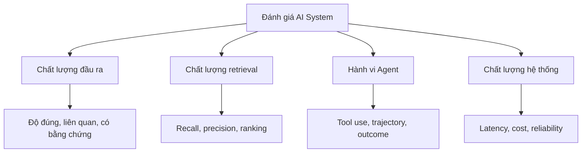
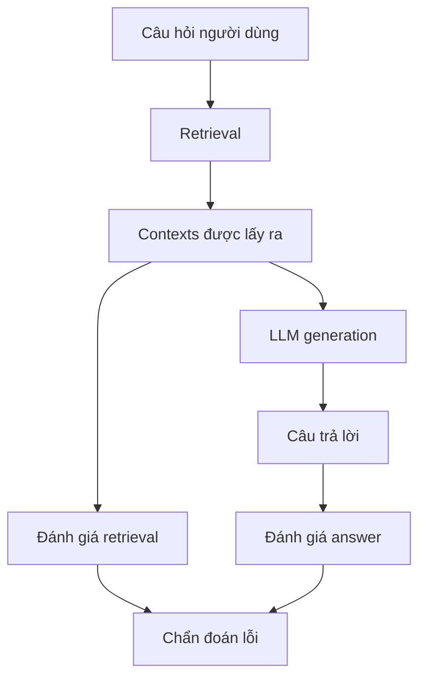
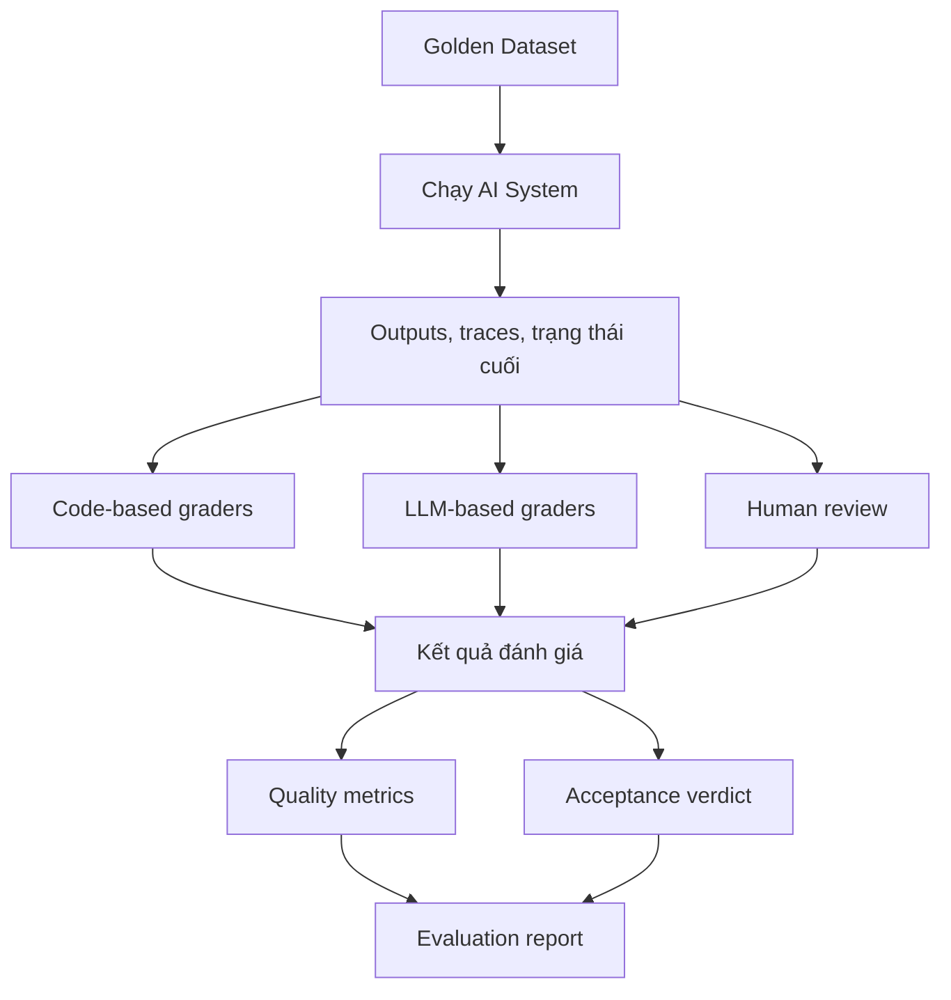

Một hệ thống AI có thể trả lời đúng nhưng vẫn thực hiện sai nhiệm vụ. Vậy ta nên đo chất lượng câu trả lời, quá trình xử lý hay kết quả cuối cùng?

## 1. Một câu trả lời đúng chưa chắc là một hệ thống tốt

Giả sử ta xây AI Assistant hỗ trợ phân tích hoạt động kinh doanh cho cửa hàng bán lẻ. Người quản lý hỏi:

> "Doanh thu tháng 8 tăng bao nhiêu so với tháng 7?"

AI trả lời: "Doanh thu tháng 8 tăng 15% so với tháng 7." Ta kiểm tra database và xác nhận 15% là đúng. Vậy test case này thành công chưa?

Có thể. Nhưng giả sử Agent dùng SQL tool với khoảng thời gian lọc sai và chỉ tình cờ ra 15%. Hoặc nó lấy đúng số liệu nhưng tự thêm rằng doanh thu tăng nhờ chiến dịch quảng cáo, dù không có bằng chứng. Hoặc nó mất gần một phút vì gọi lại cùng một tool nhiều lần.

Câu trả lời cuối cùng có thể giống nhau, nhưng chất lượng ba lần chạy rất khác. **Ta không chỉ cần biết kết quả có đúng không, mà còn phải xác định đang đánh giá khía cạnh nào của hệ thống.**

Ở [bài trước về Building Ground Truth](../building-ground-truth-for-ai-evaluation-vi/), chúng ta đã tạo test case đáng tin cậy và xác định kết quả kỳ vọng. Giờ cần chọn cách đo AI đã xử lý các case đó tốt đến đâu. Không có một metric duy nhất trả lời được mọi câu hỏi.

## 2. Trước khi chọn metric, hãy xác định điều cần đo

Một AI System hiện đại thường gồm model, retrieval, tools, orchestration và business rules. Ta có thể đánh giá ở nhiều cấp độ:



*Hình 1. Bốn nhóm khía cạnh có thể đánh giá. Không phải sản phẩm nào cũng cần đầy đủ tất cả.*

**Output Quality** hỏi câu trả lời cuối có chính xác, liên quan và đầy đủ không. **Retrieval Quality** hỏi hệ thống có tìm đúng thông tin cần thiết không. **Agent Behavior** xét lựa chọn tool, hành động, phối hợp và hoàn thành nhiệm vụ. **System Quality** bao gồm latency, chi phí và độ ổn định.

Các nhóm có liên quan với nhau: retrieval kém có thể làm câu trả lời sai; gọi tool lặp lại có thể tăng latency. Điều quan trọng là **mỗi metric phải trả lời một câu hỏi cụ thể**, thay vì ép toàn bộ chất lượng vào một điểm số khó hiểu.

## 3. Các cách đánh giá đầu ra của AI

Với hệ thống chủ yếu trả lời câu hỏi hoặc tạo nội dung, ba hướng thường gặp là kiểm bằng code, so với reference và dùng LLM làm giám khảo. Chúng có thể kết hợp với nhau.

### 3.1. Deterministic Evaluation: Khi code xác định được đúng sai

Nếu Ground Truth là doanh thu tăng `15%`, một kết quả số có cấu trúc thường nên được kiểm bằng code. Giả sử hệ thống trả về:

```json
{
  "metric": "revenue_growth",
  "period": "2026-08",
  "value": 0.15
}
```

Ta có thể kiểm tra schema, kỳ báo cáo và giá trị mà không cần gọi thêm LLM. Tương tự, code có thể validate JSON Schema, tính lại công thức hoặc kiểm trạng thái cuối của API. Code-based grader thường nhanh, rẻ và dễ tái lập.

Nhưng so khớp chuỗi tuyệt đối đôi khi quá cứng: `15.0%` và `15%` có cùng giá trị. Số thực có thể cần ngưỡng sai số mà nghiệp vụ chấp nhận. Grader tốt phải biết chuẩn hóa biểu diễn và điều kiện sai số, không chỉ so từng ký tự.

**Khi code kiểm được kết quả một cách chính xác, không cần giao toàn bộ việc đó cho LLM.** Với câu trả lời ngôn ngữ tự nhiên, việc so sánh phức tạp hơn.

### 3.2. Reference-Based Evaluation: So với đáp án chuẩn

Reference có thể là "Doanh thu tháng 8 tăng 15% so với tháng 7." AI lại trả lời "So với tháng trước, doanh thu tháng 8 cao hơn 15%." Exact Match sẽ đánh trượt một câu trả lời đúng về ý.

Các cách so với reference có độ linh hoạt khác nhau:

| Phương pháp | Cách đánh giá | Phù hợp với |
| :-- | :-- | :-- |
| Exact Match | So output sau chuẩn hóa | ID, nhãn, giá trị xác định |
| Token F1 | So mức trùng lặp token | Extractive QA |
| BLEU / ROUGE | So từ hoặc cụm từ | Dịch máy, tóm tắt có reference |
| Semantic Similarity | So ý nghĩa trong không gian embedding | Câu trả lời diễn đạt linh hoạt |
| Factual Correctness | So các mệnh đề với Ground Truth | QA, báo cáo, phân tích |

Không phương pháp nào luôn tốt nhất. Semantic Similarity cao không chứng minh con số đúng. "Doanh thu tăng 15%" và "Doanh thu tăng 50%" có thể khá gần nhau về ngữ nghĩa, nhưng không thể thay thế nhau trong bài toán này.

Với câu trả lời dựa nhiều vào dữ liệu, cần kiểm trực tiếp các **facts** thay vì chỉ đo độ giống câu chữ. Metric [Factual Correctness của Ragas](https://docs.ragas.io/en/latest/concepts/metrics/available_metrics/factual_correctness/) là ví dụ: nó tách câu trả lời và reference thành các claims rồi đánh giá mức độ trùng khớp về sự kiện. Nội dung chủ quan hơn vẫn cần grader linh hoạt.

### 3.3. LLM-as-a-Judge: Khi một LLM chấm nội dung khó mã hóa thành luật

Giả sử người dùng hỏi: "Hãy giải thích ngắn gọn vì sao doanh thu tăng nhưng lợi nhuận lại giảm." Câu trả lời tốt phải liên quan, rõ ràng, đúng dữ kiện và thận trọng với những kết luận về nguyên nhân. Khó viết một hàm Python bao quát mọi yếu tố ấy.

Một LLM Judge có thể nhận câu hỏi, câu trả lời, dữ liệu tham chiếu và rubric. Ba kiểu chấm phổ biến là:

- **Pointwise:** Chấm một câu trả lời theo rubric, ví dụ mức đầy đủ từ 0 đến 5.
- **Pairwise:** So câu trả lời A và B theo cùng tiêu chí.
- **Reference-Guided:** Chấm với Ground Truth hoặc reference đi kèm.

Một rubric Factual Correctness minh họa:

| Mức | Ý nghĩa |
| :-- | :-- |
| 0 | Lỗi sự kiện nghiêm trọng hoặc kết luận sai |
| 1 | Có thông tin đúng nhưng còn sai hoặc thiếu đáng kể |
| 2 | Hầu hết facts quan trọng đúng, còn thiếu sót nhỏ |
| 3 | Các facts quan trọng chính xác và đầy đủ |

Đây là ví dụ, không phải chuẩn chung. [DeepEval](https://deepeval.com/docs/metrics-introduction) có các metric dùng LLM Judge như G-Eval và những tiêu chí có thể tùy chỉnh.

Nhưng Judge vẫn là AI. Nó có thể ưu ái câu dài, bị ảnh hưởng bởi thứ tự A/B hoặc chưa hiểu nghiệp vụ. Nghiên cứu [MT-Bench và Chatbot Arena](https://arxiv.org/abs/2306.05685) phân tích position bias và verbosity bias. Vì vậy, hãy viết rubric rõ, hiệu chỉnh Judge bằng những case chuyên gia đã chấm, và cho phép kết quả "không đủ bằng chứng" khi không thể kết luận. LLM Judge tốt là **một quy trình chấm đã được kiểm chứng**, không chỉ là model mạnh.

## 4. Đánh giá RAG: Lấy đúng tài liệu chưa chắc trả lời đúng

Giả sử Knowledge Base quy định thời hạn trả hàng là 7 ngày, nhưng AI trả lời 14 ngày. Retriever có thể đã chọn nhầm chính sách cũ, hoặc đã chọn đúng chính sách mà LLM vẫn trả lời sai. Hai lỗi có cùng biểu hiện nhưng cần sửa ở hai nơi khác nhau.



*Hình 2. Đánh giá riêng bằng chứng được retrieval cung cấp và cách LLM sử dụng nó.*

### 4.1. Retrieval Evaluation: Bằng chứng cần thiết đã được lấy ra chưa?

Nếu Golden Dataset xác định được những document hoặc chunk relevant, ta có thể dùng metric Information Retrieval quen thuộc. **Precision@K** là tỷ lệ kết quả relevant trong top K; **Recall@K** là tỷ lệ bằng chứng relevant đã tìm được trong toàn bộ bằng chứng relevant đã biết:

$$
\mathrm{Precision@K}=\frac{\text{relevant results in top K}}{K}
$$

$$
\mathrm{Recall@K}=\frac{\text{relevant results in top K}}{\text{all known relevant results}}
$$

Nếu câu hỏi cần hai chunks mà hệ thống lấy bốn chunks, chỉ một chunk relevant, thì Precision@4 là $1/4=0{,}25$ và Recall@4 là $1/2=0{,}5$. Hệ thống vừa thêm thông tin nhiễu, vừa bỏ sót nửa số bằng chứng kỳ vọng.

Đây là ví dụ đơn giản hóa dựa trên tập relevant chunks xác định trước. Thực tế cần thống nhất cách nhận diện chunk, xử lý trùng lặp và định nghĩa relevance. Các metric khác gồm **Hit Rate@K** (có ít nhất một kết quả relevant không), **MRR** (kết quả relevant đầu tiên ở gần đầu danh sách đến đâu) và **nDCG** (thứ hạng phản ánh mức độ liên quan tốt đến đâu).

Cần phân biệt: [Context Precision của Ragas](https://docs.ragas.io/en/stable/concepts/metrics/available_metrics/context_precision/) không đơn giản là công thức Precision@K bên trên. Các biến thể của nó còn xét thứ hạng và xác định relevance bằng các nguồn khác nhau. [Context Recall của Ragas](https://docs.ragas.io/en/stable/concepts/metrics/available_metrics/context_recall/) có thể dựa vào reference claims, reference contexts hoặc context IDs. Hãy đọc định nghĩa và input của framework thay vì chỉ nhìn tên metric.

Cuối cùng, retriever có thể lấy 20 chunks nhưng bước reranking hoặc context assembly chỉ đưa 5 chunks vào prompt. Đo tập đầu tiên là đánh giá retriever; đo **context LLM thực sự nhận** là kiểm tra generation có đủ bằng chứng không. Hai phép đo trả lời hai câu hỏi khác nhau.

### 4.2. Answer Evaluation: Với context đó, AI trả lời tốt đến đâu?

Ba khía cạnh thường gặp là **Faithfulness**, **Factual Correctness** và **Answer Relevancy**:

| Khía cạnh | Câu hỏi chính | Input thường cần |
| :-- | :-- | :-- |
| Faithfulness | Claims có được context hỗ trợ không? | Answer + Context |
| Factual Correctness | Facts có khớp Ground Truth không? | Answer + Reference |
| Answer Relevancy | Có giải quyết đúng câu hỏi không? | Question + Answer |

Giả sử context ghi doanh thu tháng 8 là 230 triệu, tăng 15% so với tháng 7. AI trả lời: "Doanh thu tăng 15% nhờ chiến dịch quảng cáo." Phần 15% có bằng chứng; nguyên nhân quảng cáo thì không. Có thể diễn đạt ý tưởng chấm Faithfulness theo claims như sau:

$$
\mathrm{Faithfulness}=\frac{\text{claims supported by context}}{\text{claims in the answer}}
$$

Đây là ý tưởng của [Ragas Faithfulness](https://docs.ragas.io/en/stable/concepts/metrics/available_metrics/faithfulness/); cách triển khai cụ thể còn phụ thuộc bước tách claim và xác định bằng chứng hỗ trợ.

Factual Correctness hỏi câu trả lời có khớp reference không. Nếu Ground Truth là 15% mà AI trả lời 18%, đó là lỗi sự kiện. Answer Relevancy hỏi liệu câu trả lời có đáp ứng yêu cầu không. Giải thích khái niệm doanh thu có thể đúng về kiến thức nhưng không trả lời "Tăng bao nhiêu?"

Một câu có thể rất relevant nhưng sai facts. Nó cũng có thể faithful với tài liệu cũ nhưng không còn đúng với chính sách hiện hành. Vì vậy, RAG cần quan sát cả retrieval lẫn answer quality.

## 5. Đánh giá AI Agent: Trả lời đúng hay hoàn thành nhiệm vụ?

Agent có thể gọi API, cập nhật dữ liệu và thực hiện workflow nhiều bước. Giả sử người dùng yêu cầu: "Kiểm tra đơn DH-102 và hủy giúp tôi nếu đơn chưa được giao." Agent nói "Đã hủy thành công", nhưng database vẫn ghi `processing`. Answer Relevancy có thể thích câu trả lời ấy, trong khi nhiệm vụ thực tế chưa hoàn thành.

Agent Evaluation cần nhìn ít nhất ba lớp.

### Outcome Evaluation: Trạng thái cuối có đúng không?

Với Agent có quyền thay đổi hệ thống, đây thường là lớp quan trọng nhất. Đơn đúng có thực sự được hủy? Trạng thái cuối có tuân thủ chính sách? Có dữ liệu khác bị thay đổi ngoài ý muốn không? Database assertions, API state checks hoặc integration tests có thể kiểm các điều kiện ấy. Với task có kết quả xác định, chúng đáng tin hơn việc nhờ LLM đoán thành công từ một câu trả lời nghe yên tâm.

### Tool và Trajectory Evaluation: Agent đã làm như thế nào?

Agent có thể đạt outcome đúng nhưng chọn tool không phù hợp, gọi API lặp hoặc bỏ qua bước xác thực bắt buộc. **Trajectory** là chuỗi hành động dẫn tới kết quả. Các kiểm tra hữu ích gồm:

| Kiểm tra | Câu hỏi |
| :-- | :-- |
| Tool choice | Agent chọn đúng công cụ không? |
| Argument correctness | Tham số truyền vào có đúng không? |
| Step efficiency | Có quá nhiều bước thừa không? |
| Mandatory constraints | Có tuân thủ bước bắt buộc không? |
| Task completion | Outcome có đạt yêu cầu không? |

[DeepEval mô tả metric cho Agent và trajectory](https://deepeval.com/docs/metrics-introduction); [hướng dẫn Agent evaluation của OpenAI](https://developers.openai.com/api/docs/guides/agent-evals) mô tả trace grading để xét tool calls, handoffs và hành vi của workflow. Nhưng đừng mặc định chỉ có một đường đi đúng. Agent A có thể dùng ba bước, Agent B dùng bốn bước; nếu cả hai đều an toàn và hợp lệ, so khớp cứng từng tool call sẽ đánh trượt một lời giải đúng. Hãy bắt buộc các bước quan trọng và linh hoạt với lựa chọn triển khai hợp lệ.

### Multi-Agent Evaluation: Lỗi phối hợp nằm ở đâu?

Giả sử Analytics Agent tính số liệu, Knowledge Agent tìm chính sách, còn Report Agent viết báo cáo. Hai Agent đầu đều làm đúng, nhưng Report Agent lại trộn dữ liệu của hai cửa hàng. Nếu chỉ chấm từng Agent, lỗi này có thể lọt qua.

Hãy kiểm routing, handoff, shared context và kết quả end-to-end. **Component đúng không tự bảo đảm cả system đúng.** Execution traces giúp xác định lỗi bắt đầu ở khâu phối hợp nào.

## 6. Human Evaluation còn cần thiết không?

Thường là có. Một kế hoạch kinh doanh có thể dùng số liệu chính xác nhưng vẫn không khả thi. Chuyên gia cần đánh giá tính thực tế và ngoại lệ. Con người cũng phải kiểm chất lượng của chính những grader tự động.

Một cách làm là chọn tập kết quả đại diện, để chuyên gia chấm độc lập rồi so với điểm của LLM Judge. Bất đồng có thể chỉ ra rubric mơ hồ, thiếu evidence, Ground Truth sai, model thiên vị hoặc ngay cả chuyên gia cũng không thống nhất. Agreement rate hoặc chỉ số inter-rater phù hợp giúp theo dõi điều này có hệ thống hơn.

Human review tốn kém, nên hãy dùng nó để xác định tiêu chuẩn và hiệu chỉnh grader, rồi tự động hóa những phần đã chứng minh đủ đáng tin.

## 7. Kết hợp thành một Evaluation Strategy

Nguyên tắc hữu ích là: **dùng code cho điều kiểm chính xác được, dùng LLM cho đánh giá cần hiểu ngữ nghĩa và dùng con người cho quyết định quan trọng hoặc mơ hồ.**



*Hình 3. Hybrid Evaluation kết hợp các grader nhưng tách chất lượng đo được khỏi quyết định chấp nhận.*

Với AI Assistant hỗ trợ cửa hàng bán lẻ, một strategy có thể là:

| Kịch bản | Kiểm tra chính | Kiểm tra bổ sung |
| :-- | :-- | :-- |
| Tính tăng trưởng doanh thu | Numeric Accuracy | Factual Correctness |
| Hỏi đáp chính sách | Retrieval Metrics | Faithfulness, Answer Relevancy |
| Báo cáo phân tích | Fact Validation | Completeness, LLM Judge |
| Tra cứu đơn hàng | Tool và Argument Checks | Answer Correctness |
| Hủy hoặc cập nhật đơn | Final State Verification | Policy, Tool Checks |
| Multi-Agent Analysis | End-to-End Outcome | Traces, Handoffs, Component Checks |

**Metric không đồng nghĩa với Verdict.** Metric mô tả một chiều chất lượng; Verdict cho biết case có đạt những điều kiện chấp nhận bắt buộc không. Câu trả lời có thể rất relevant nhưng vẫn FAIL vì số liệu doanh thu sai.

Một thiết kế thực tế là **PASS** khi mọi điều kiện bắt buộc đạt; **FAIL** khi có ít nhất một điều kiện bắt buộc không đạt; **ERROR** khi không thể chấm hợp lệ vì pipeline đánh giá gặp sự cố hoặc thiếu bằng chứng cần thiết. Đây là lựa chọn thiết kế, không phải quy chuẩn bắt buộc của mọi framework.

Cần phân biệt lỗi ứng dụng với lỗi grader. Nếu Agent không gọi được tool vì chính nó bị lỗi, đó có thể là FAIL. Nếu Judge service timeout trước khi chấm, đó là ERROR của evaluation, không chứng minh Agent trả lời sai.

Một quy ước báo cáo là:

$$
\mathrm{Pass\ Rate}=\frac{\mathrm{PASS}}{\mathrm{PASS}+\mathrm{FAIL}}
$$

Hãy báo riêng số lượng ERROR và hiển thị rõ ràng; loại chúng khỏi mẫu số mà không nói ra có thể tạo pass rate gây hiểu nhầm. Với Agent có tính biến thiên, nên chạy nhiều trials mỗi case để thấy cả tỷ lệ thành công và độ dao động.

## 8. Những sai lầm thường gặp khi đánh giá AI

**Chọn metric không đúng mục tiêu.** Semantic Similarity không nên quyết định câu hỏi yêu cầu con số chính xác. Answer Relevancy không thể thay Factual Correctness.

**Dùng LLM Judge cho việc code kiểm được.** Nếu có thể đọc trực tiếp tool arguments hoặc database state, nhờ LLM đoán chỉ tăng chi phí và tính bất định.

**Chỉ chấm final answer của RAG.** Câu trả lời sai có thể vì không tìm được evidence, tìm nhầm evidence hoặc LLM dùng evidence sai.

**Bắt Agent đi theo một trajectory duy nhất.** Kiểm outcome và ràng buộc bắt buộc trước khi áp thứ tự tool call cứng nhắc.

**Chỉ nhìn điểm trung bình.** Điểm cao có thể che khuất lỗi rủi ro lớn như cập nhật nhầm tài khoản hay thực hiện giao dịch chưa được phép.

**Không kiểm chứng evaluator.** Ground Truth có thể sai, rubric có thể mơ hồ và Judge có thể thiên vị. Điểm đẹp không chứng minh sản phẩm tốt nếu chính hệ thống đo chưa được kiểm tra.

## 9. Evaluation phải chỉ ra nên cải thiện ở đâu

Đánh giá AI System không chỉ là so câu trả lời với một đáp án mẫu. Chatbot cần kiểm chất lượng answer. RAG cần tách retrieval với generation. Agent cần kiểm trajectory và outcome. Multi-Agent còn cần kiểm phối hợp. Code, reference, LLM Judge và con người giải quyết các nhóm lỗi khác nhau.

Điều quan trọng không phải dashboard có bao nhiêu metric, mà mỗi metric có thực sự đo thứ sản phẩm cần làm tốt không. **Một Evaluation hữu ích không chỉ cho biết AI đạt bao nhiêu điểm. Nó giúp ta hiểu AI sai ở đâu, vì sao sai và cần cải thiện thành phần nào.**

Khi đã có Ground Truth đáng tin cùng grader phù hợp, bước kỹ thuật tiếp theo là chạy nhiều scenario, thu output và traces, phân loại lỗi rồi so sánh các phiên bản một cách nhất quán. Khi ấy, những phép kiểm rời rạc trở thành một Evaluation Harness dùng được trong AI System thực tế.

## Nguồn tham khảo

1. [Anthropic - Demystifying Evals for AI Agents](https://www.anthropic.com/engineering/demystifying-evals-for-ai-agents) - code, model và human graders; outcome và harness.
2. [Ragas - Available Evaluation Metrics](https://docs.ragas.io/en/latest/concepts/metrics/available_metrics/) - metric cho RAG, Agent và so sánh ngôn ngữ tự nhiên.
3. [Ragas - Context Precision](https://docs.ragas.io/en/stable/concepts/metrics/available_metrics/context_precision/) và [Context Recall](https://docs.ragas.io/en/stable/concepts/metrics/available_metrics/context_recall/) - relevance, ranking, reference claims và context IDs.
4. [Ragas - Faithfulness](https://docs.ragas.io/en/stable/concepts/metrics/available_metrics/faithfulness/) và [Factual Correctness](https://docs.ragas.io/en/latest/concepts/metrics/available_metrics/factual_correctness/) - bằng chứng hỗ trợ so với độ đúng theo reference.
5. [DeepEval - Evaluation Metrics](https://deepeval.com/docs/metrics-introduction) - metric cho RAG, chatbot, Agent và grader có thể tùy chỉnh.
6. [OpenAI - Evaluation Best Practices](https://developers.openai.com/api/docs/guides/evaluation-best-practices) và [Evaluate Agent Workflows](https://developers.openai.com/api/docs/guides/agent-evals) - eval theo task và trace grading.
7. [LangSmith - Evaluation Types](https://docs.langchain.com/langsmith/evaluation-types) - offline, online evaluation, code và model evaluators.
8. [Zheng et al. - Judging LLM-as-a-Judge with MT-Bench and Chatbot Arena](https://arxiv.org/abs/2306.05685) - mức đồng thuận với người và những bias cần lưu ý.
