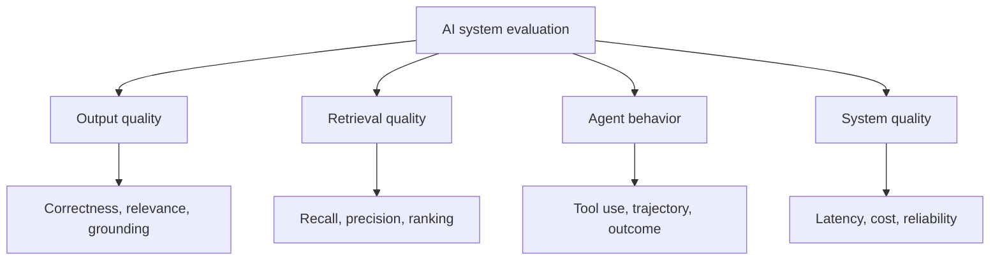
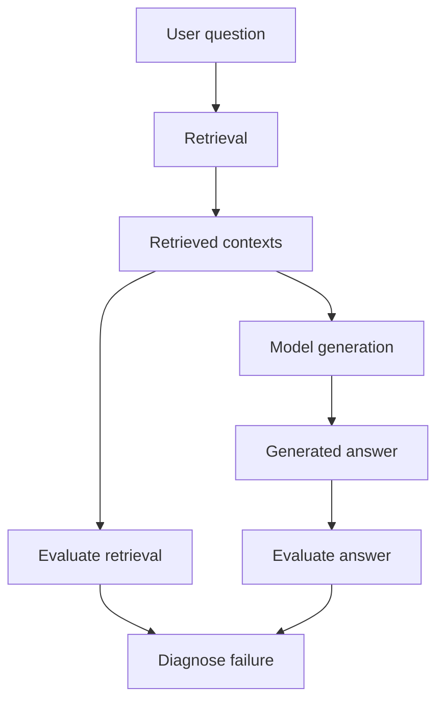
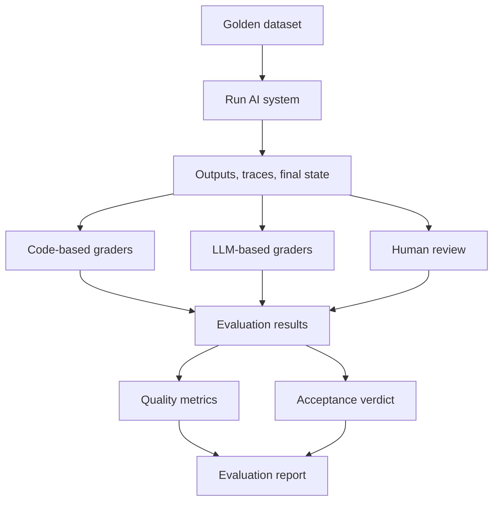

An AI system can give the right answer while still doing the wrong job. Should we measure the answer, the steps it took, or the result it left behind?

## 1. A correct answer is not always a good system

Imagine an AI Assistant that helps a retail manager analyze sales. The manager asks:

> "How much did August revenue grow compared with July?"

The AI answers: "Revenue grew 15% in August compared with July." We check the database and confirm that 15% is correct. Can we mark the case as successful?

Perhaps. But suppose the Agent used a SQL tool with the wrong date filter and reached 15% by coincidence. Or it retrieved the right numbers but added that an advertising campaign caused the increase, without evidence. Or it took almost a minute because it called the same tool repeatedly.

The final sentence may be identical in all three runs, but the systems are not equally good. **We need to know not only whether the final result is right, but which part of the system we are evaluating.**

In the [previous article on building ground truth](../building-ground-truth-for-ai-evaluation/), we created trustworthy test cases and defined what should happen. Now we need to decide how to measure what the AI actually did. No single metric answers every question.

## 2. Define the target before choosing a metric

A modern AI system may include a model, retrieval, tools, orchestration, and business rules. Evaluation can target different layers:



*Figure 1. Four groups of questions an AI evaluation can ask. Not every product needs every group.*

**Output quality** asks whether the answer is accurate, relevant, and complete. **Retrieval quality** asks whether the system found the information it needed. **Agent behavior** examines tool choices, actions, coordination, and task completion. **System quality** covers operational constraints such as latency, cost, and reliability.

These groups interact. Bad retrieval can produce a wrong answer; repeated tool calls can inflate latency. The goal is not to compress them into one mysterious score. Each metric should answer a **specific question**.

## 3. Ways to evaluate an AI output

For systems that mainly answer questions or generate content, three common approaches are code-based checks, reference-based comparison, and LLM-as-a-Judge. They can be combined.

### 3.1. Deterministic evaluation: when code can decide

If the expected revenue growth is `15%`, the strongest check for a structured numeric result is often code. Suppose the system returns:

```json
{
  "metric": "revenue_growth",
  "period": "2026-08",
  "value": 0.15
}
```

We can validate the schema, period, and value without calling another LLM. Similarly, code can validate JSON Schema, recompute a formula, or inspect an API's final state. Code-based graders are usually fast, inexpensive, and reproducible.

But exact string comparison can be too strict: `15.0%` and `15%` mean the same thing. Floating-point calculations may need a business-approved tolerance. A good deterministic grader normalizes representations and encodes acceptable error, not merely a string match.

**When a result can be checked precisely with code, do not delegate that entire check to an LLM.** Natural-language answers, however, are often less straightforward.

### 3.2. Reference-based evaluation: compare with a known answer

The reference might be "August revenue grew 15% compared with July." The AI might say "August was 15% higher than the previous month." Exact Match would reject a valid paraphrase.

Reference-based methods offer different levels of flexibility:

| Method | What it compares | Useful for |
| :-- | :-- | :-- |
| Exact Match | Normalized output | IDs, labels, fixed values |
| Token F1 | Token overlap | Extractive question answering |
| BLEU / ROUGE | Word or phrase overlap | Translation or reference summaries |
| Semantic Similarity | Meaning in embedding space | Flexible wording |
| Factual Correctness | Claims against ground truth | QA, reports, analysis |

None is universally best. A high semantic-similarity score does not prove the numbers are right. "Revenue increased 15%" and "Revenue increased 50%" may be close in embedding space but not interchangeable for this task.

For data-heavy answers, checking the **facts** matters more than checking textual resemblance. [Ragas's Factual Correctness metric](https://docs.ragas.io/en/latest/concepts/metrics/available_metrics/factual_correctness/) illustrates this by decomposing responses and references into claims and assessing their overlap. More subjective outputs still need a flexible grader.

### 3.3. LLM-as-a-Judge: use a model for nuanced criteria

Suppose the user asks: "Briefly explain why revenue rose but profit fell." A good answer should be relevant, clear, supported by data, and careful about causation. A short Python function cannot capture all of that.

An LLM judge can receive the question, candidate answer, supporting data, and a rubric. Common designs include:

- **Pointwise:** Score one answer against a rubric, such as completeness from 0 to 5.
- **Pairwise:** Compare answers A and B against the same criteria.
- **Reference-guided:** Judge an answer with access to ground truth or a reference.

An illustrative factual-correctness rubric might be:

| Score | Interpretation |
| :-- | :-- |
| 0 | Serious factual error or false conclusion |
| 1 | Some correct details, but major errors or omissions |
| 2 | Most important facts are correct; minor gaps remain |
| 3 | Important facts are accurate and complete |

Those levels are an example, not an industry standard. Frameworks such as [DeepEval](https://deepeval.com/docs/metrics-introduction) provide LLM-judged metrics including G-Eval and configurable criteria.

The judge remains an AI model. It may favor longer answers, respond to candidate order, or misunderstand the domain. The [MT-Bench and Chatbot Arena study](https://arxiv.org/abs/2306.05685) discusses position and verbosity biases. In practice, write a precise rubric, calibrate the judge against expert-rated cases, and allow an "insufficient evidence" result when a judgment cannot be supported. A useful LLM judge is a **validated grading process**, not merely a powerful model.

## 4. Evaluating RAG: retrieving the right document is not enough

Suppose the knowledge base says customers have seven days to return an item, but the AI answers fourteen. The retriever may have selected an outdated policy, or it may have selected the right policy while the model generated the wrong answer. These failures look identical at the surface but need different fixes.



*Figure 2. Evaluate what retrieval supplied and what generation did with it separately.*

### 4.1. Retrieval evaluation: did the evidence arrive?

When a golden dataset identifies relevant documents or chunks, familiar information-retrieval metrics can help. **Precision@K** asks what share of the top K results is relevant. **Recall@K** asks what share of all known relevant results was retrieved:

$$
\mathrm{Precision@K}=\frac{\text{relevant results in top K}}{K}
$$

$$
\mathrm{Recall@K}=\frac{\text{relevant results in top K}}{\text{all known relevant results}}
$$

If a question needs two relevant chunks and the system returns four chunks, only one of which is relevant, Precision@4 is $1/4=0.25$ and Recall@4 is $1/2=0.5$. The system added noise and missed half the expected evidence.

This example assumes a predefined set of relevant chunks. In practice, teams must define relevance, stable chunk identities, and how duplicates count. Other useful measures include **Hit Rate@K** (whether at least one relevant result appears), **MRR** (how early the first relevant result appears), and **nDCG** (how well graded relevance is ranked).

Names can mislead. [Ragas Context Precision](https://docs.ragas.io/en/stable/concepts/metrics/available_metrics/context_precision/) is not simply the basic Precision@K formula above; its variants account for ranking and use different ways to determine relevance. [Ragas Context Recall](https://docs.ragas.io/en/stable/concepts/metrics/available_metrics/context_recall/) can use reference claims, reference contexts, or context IDs. Read a framework's inputs and definition rather than assuming two similarly named metrics are identical.

Also distinguish the retriever's candidates from the **context actually sent to the model**. If retrieval finds 20 chunks but reranking or prompt assembly keeps five, measuring the first set evaluates retrieval; measuring the second asks whether generation received enough evidence.

### 4.2. Answer evaluation: did the model use that evidence well?

Three commonly discussed dimensions are **Faithfulness**, **Factual Correctness**, and **Answer Relevancy**:

| Dimension | Main question | Typical inputs |
| :-- | :-- | :-- |
| Faithfulness | Are the answer's claims supported by the supplied context? | Answer + context |
| Factual Correctness | Do its facts match ground truth? | Answer + reference |
| Answer Relevancy | Does it address the user's question? | Question + answer |

Suppose the retrieved context says August revenue was VND 230 million, up 15% from July. The AI says, "Revenue rose 15% because of the advertising campaign." The 15% is supported; the claimed cause is not. A claim-based faithfulness check can be summarized as:

$$
\mathrm{Faithfulness}=\frac{\text{claims supported by context}}{\text{claims in the answer}}
$$

This expresses the idea behind [Ragas Faithfulness](https://docs.ragas.io/en/stable/concepts/metrics/available_metrics/faithfulness/); a concrete implementation still depends on claim extraction and entailment judgments.

Factual Correctness asks a different question: if ground truth says 15% and the AI says 18%, the answer is factually wrong. Answer Relevancy asks whether the response addresses the request at all. A definition of revenue may be correct information yet irrelevant to "How much did it grow?"

A response can be relevant but factually wrong. It can also be faithful to an outdated document yet wrong under today's policy. That is why RAG needs both retrieval and answer evaluation, not one score.

## 5. Evaluating Agents: did they complete the task?

Agents can call APIs, change records, and run multi-step workflows. Suppose a user asks: "Check order DH-102 and cancel it if it has not shipped." The Agent answers "Cancelled successfully," but the database still shows `processing`. Answer Relevancy alone might favor that sentence, while the task has not been completed.

Agent evaluation therefore needs at least three views.

### Outcome evaluation: what state did the Agent leave behind?

For a state-changing Agent, this is often the most important view. Was the correct order cancelled? Did the final state satisfy policy? Were unrelated records left untouched? Database assertions, API state checks, and integration tests can verify these conditions. For deterministic tasks, they are more reliable than asking an LLM to infer success from a reassuring sentence.

### Tool and trajectory evaluation: how did it get there?

An Agent might achieve the right outcome but call the wrong tool, repeat an API call, or skip a mandatory identity check. A **trajectory** is the sequence of actions that produced the result. Useful checks include:

| Check | Question |
| :-- | :-- |
| Tool choice | Was the appropriate tool selected? |
| Argument correctness | Were its inputs right? |
| Step efficiency | Were unnecessary steps excessive? |
| Mandatory constraints | Were required policy steps followed? |
| Task completion | Was the intended outcome achieved? |

[DeepEval documents Agent and trajectory metrics](https://deepeval.com/docs/metrics-introduction), while [OpenAI's Agent evaluation guide](https://developers.openai.com/api/docs/guides/agent-evals) describes trace grading for tool calls, handoffs, and workflow behavior. But there may be several valid paths. If one Agent takes three safe steps and another takes four, requiring an exact tool-call sequence can falsely reject the latter. Enforce mandatory checks; allow legitimate implementation choices.

### Multi-Agent evaluation: did coordination preserve correctness?

Imagine an Analytics Agent that computes numbers, a Knowledge Agent that retrieves policy, and a Report Agent that writes the summary. The first two can perform perfectly while the Report Agent mixes data from two stores. Component-level scores may all look healthy while the end-to-end report is wrong.

Evaluate routing, handoffs, shared context, and the final result. **Correct components do not automatically make a correct system.** Execution traces help locate the handoff where a failure entered.

## 6. Do we still need human evaluation?

Often, yes. A business plan may contain accurate numbers but still be unrealistic. A domain expert may be needed to judge feasibility and exceptions. Humans are also needed to validate the graders themselves.

One practical process is to select representative cases, have experts rate them independently, and compare those ratings with the LLM judge. Disagreements can reveal an ambiguous rubric, missing evidence, wrong ground truth, model bias, or genuine disagreement among experts. Agreement rate or a suitable inter-rater statistic can make that comparison more systematic.

Human review is expensive, so use it to define standards and calibrate automated checks, then automate only what proves reliable enough.

## 7. Combine methods into an evaluation strategy

A useful rule is: **use code for precisely checkable conditions, LLMs for semantic judgments, and people for important or ambiguous decisions.**



*Figure 3. Hybrid evaluation combines graders while keeping measured quality separate from the acceptance decision.*

For a retail Assistant, the strategy might look like this:

| Scenario | Primary check | Additional check |
| :-- | :-- | :-- |
| Revenue growth | Numeric accuracy | Factual correctness |
| Policy Q&A | Retrieval metrics | Faithfulness, answer relevancy |
| Analytical report | Fact validation | Completeness, LLM judge |
| Order lookup | Tool and argument checks | Answer correctness |
| Cancellation or update | Final-state verification | Policy and tool checks |
| Multi-Agent analysis | End-to-end outcome | Traces, handoffs, component checks |

**A metric is not the same as a verdict.** A metric describes one quality dimension. A verdict says whether required acceptance criteria were met. An answer can score highly on relevancy yet fail because its revenue figure is wrong.

A practical design might use **PASS** when every mandatory condition passes, **FAIL** when at least one mandatory condition fails, and **ERROR** when a valid judgment cannot be made because the evaluation machinery failed or required evidence is missing. These are design choices, not a universal framework standard.

Distinguish an application failure from a grader failure. If the Agent cannot call a tool because its implementation is broken, that may be FAIL. If the judge service times out before producing a score, that is an evaluation ERROR, not evidence that the Agent answered incorrectly.

One reporting convention is:

$$
\mathrm{Pass\ Rate}=\frac{\mathrm{PASS}}{\mathrm{PASS}+\mathrm{FAIL}}
$$

Report ERROR counts separately and visibly; otherwise excluding them could make the pass rate look misleadingly strong. For nondeterministic Agents, run multiple trials per case to see both the success rate and variation between runs.

## 8. Common mistakes in AI evaluation

**Choosing a metric that misses the task.** Semantic Similarity should not decide an exact-number question, and Answer Relevancy cannot substitute for Factual Correctness.

**Using an LLM judge for a deterministic check.** If code can inspect tool arguments or database state directly, asking a model to guess adds cost and uncertainty.

**Grading RAG only by the final answer.** A wrong answer may come from missing evidence, the wrong evidence, or a model that misused good evidence.

**Requiring one exact Agent trajectory.** Check outcomes and mandatory constraints before demanding a rigid sequence of tool calls.

**Looking only at the average.** A high average can hide dangerous failures such as changing the wrong account or issuing an unapproved transaction.

**Failing to validate the evaluator.** Ground truth can be wrong, rubrics can be ambiguous, and judges can be biased. Good-looking scores are not proof of a good product if the measurement system itself has not been checked.

## 9. Evaluation should tell us where to improve

Evaluating an AI system is not merely comparing its output with a sample answer. A chatbot needs answer quality checks. RAG needs separate retrieval and generation checks. Agents need trajectory and outcome checks. Multi-Agent systems also need coordination checks. Code, references, LLM judges, and humans each cover different failure modes.

The important question is not how many metrics a dashboard contains. It is whether each metric measures something the product must actually do. **A useful evaluation tells us not just the score, but where the system failed, why it failed, and which component to improve.**

With trustworthy ground truth and appropriate graders in place, the next engineering step is to run many scenarios, collect outputs and traces, classify failures, and compare versions consistently. That turns individual checks into an evaluation harness for a real AI system.

## References and further reading

1. [Anthropic - Demystifying Evals for AI Agents](https://www.anthropic.com/engineering/demystifying-evals-for-ai-agents) - code, model, and human graders; outcomes and harnesses.
2. [Ragas - Available Evaluation Metrics](https://docs.ragas.io/en/latest/concepts/metrics/available_metrics/) - RAG, Agent, and natural-language metrics.
3. [Ragas - Context Precision](https://docs.ragas.io/en/stable/concepts/metrics/available_metrics/context_precision/) and [Context Recall](https://docs.ragas.io/en/stable/concepts/metrics/available_metrics/context_recall/) - relevance, ranking, reference claims, and context IDs.
4. [Ragas - Faithfulness](https://docs.ragas.io/en/stable/concepts/metrics/available_metrics/faithfulness/) and [Factual Correctness](https://docs.ragas.io/en/latest/concepts/metrics/available_metrics/factual_correctness/) - evidence support versus agreement with reference facts.
5. [DeepEval - Evaluation Metrics](https://deepeval.com/docs/metrics-introduction) - RAG, chatbot, and Agent metrics, including configurable graders.
6. [OpenAI - Evaluation Best Practices](https://developers.openai.com/api/docs/guides/evaluation-best-practices) and [Evaluate Agent Workflows](https://developers.openai.com/api/docs/guides/agent-evals) - task-specific evaluation and trace grading.
7. [LangSmith - Evaluation Types](https://docs.langchain.com/langsmith/evaluation-types) - offline and online evaluation, code and model evaluators.
8. [Zheng et al. - Judging LLM-as-a-Judge with MT-Bench and Chatbot Arena](https://arxiv.org/abs/2306.05685) - agreement with people and potential judge biases.
