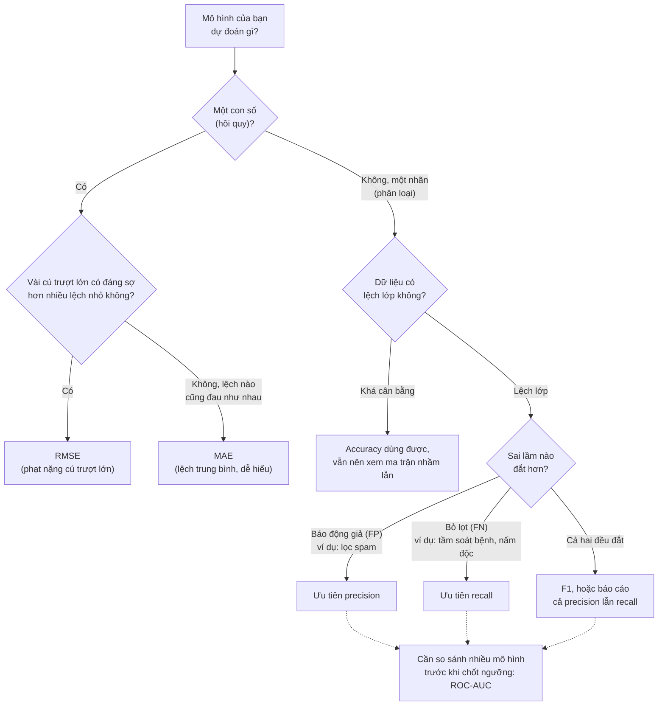

> **Mục tiêu bài học:** Sau bài này, bạn sẽ biết vì sao accuracy có thể đánh lừa, tự đọc và tính tay được các thước đo từ ma trận nhầm lẫn (precision, recall, F1), hiểu trực giác ROC-AUC và các thước đo cho hồi quy (MAE, RMSE, R²), và biết chọn thước đo phù hợp với từng bài toán.

## 1. Khi "chính xác 99%" là một mô hình vô dụng

Một bệnh hiếm: cứ 100 người thì 1 người mắc. Bạn được giao xây mô hình tầm soát và mang thử trên 1.000 người, trong đó 10 người thật sự có bệnh. Trước khi nhìn mô hình của bạn, hãy xét một "mô hình" lười đến mức nực cười: **bất kể ai bước vào, nó đều phán "khỏe mạnh"**.

- 990 người khỏe → nó đoán đúng cả 990.
- 10 người bệnh → nó sai cả 10.
- Tỷ lệ đoán đúng: 990/1.000 = **99%**.

Chín mươi chín phần trăm - nghe như một mô hình xuất sắc, trong khi nó **không phát hiện được một bệnh nhân nào**, tức là vô dụng cho đúng mục đích nó sinh ra.

Con số 99% ấy chính là **accuracy (độ chính xác)**: tỷ lệ dự đoán đúng trên tổng số mẫu. Đây là thước đo trực quan, dễ nghĩ đến đầu tiên - và cũng là thước đo dễ đánh lừa khi dữ liệu **lệch lớp (imbalanced)**: lớp ta quan tâm (bệnh, gian lận, vỡ nợ) chỉ chiếm phần nhỏ, nên chỉ cần "hùa theo số đông" là accuracy đã cao.

Chuyện này không chỉ xảy ra với ví dụ bịa. Sách *An Introduction to Statistical Learning* (chương 4) dùng bộ dữ liệu `Default`: 10.000 khách hàng thẻ tín dụng, trong đó chỉ 333 người (3,33%) vỡ nợ. Một mô hình thật sự được huấn luyện (LDA) đạt tỷ lệ lỗi **2,75%** - nghe rất ổn... cho đến khi bạn đặt nó cạnh mô hình "luôn đoán không vỡ nợ": lỗi **3,33%**. Mô hình học thật chỉ hơn mô hình lười vỏn vẹn 0,58 điểm phần trăm. Accuracy một mình không phân biệt nổi mô hình có học được gì hay không. Ta cần mổ xẻ *sai kiểu gì* - và đó là việc của ma trận nhầm lẫn.

> ⚠️ **Lưu ý nhỏ:** con số 2,75% là lỗi đo trên chính 10.000 mẫu huấn luyện (training error). Sách nói rõ điều này và nhắc rằng lỗi trên dữ liệu mới *thường* cao hơn (Bài 04, Bài 14); với bộ dữ liệu này (chỉ 2 đặc trưng, 10.000 mẫu) các tác giả không quá lo overfitting, nhưng quy tắc chung vẫn là: số đẹp trên train chưa phải số thật.

## 2. Ma trận nhầm lẫn: mổ xẻ 4 loại kết quả

Bạn mang mô hình LDA ở trên đi báo cáo cho công ty thẻ: *"Mô hình đúng 97,25%."* Trưởng phòng rủi ro hỏi lại đúng một câu: *"Đúng với ai? Trong số khách rồi sẽ vỡ nợ, mô hình bắt được bao nhiêu?"* Accuracy không trả lời được. Bảng dưới đây thì có.

**Ma trận nhầm lẫn (confusion matrix)** là bảng 2×2 đối chiếu *máy đoán gì* với *sự thật là gì*. Quy ước: lớp ta muốn phát hiện là **dương (positive)** - ở đây là "vỡ nợ" - và lớp còn lại là **âm (negative)**. Đây là bảng thật từ sách *An Introduction to Statistical Learning*: mô hình LDA trên 10.000 khách hàng của bộ dữ liệu `Default` (hàng = máy đoán, cột = thực tế):

| | Thực tế: **vỡ nợ** (dương) | Thực tế: **không vỡ nợ** (âm) | Tổng theo hàng |
|---|---|---|---|
| **Máy đoán "vỡ nợ"** | **TP = 81** - bắt đúng | **FP = 23** - báo động giả | 104 người bị máy "chỉ mặt" |
| **Máy đoán "không vỡ nợ"** | **FN = 252** - bỏ lọt | **TN = 9.644** - cho qua đúng | 9.896 người được máy cho qua |
| **Tổng theo cột** | 333 người thật sự vỡ nợ | 9.667 người không vỡ nợ | 10.000 |

Bốn ô, kèm cách nhớ tiếng Việt:

| Ký hiệu | Tên đầy đủ | Nghĩa | Cách nhớ |
|---|---|---|---|
| **TP** | True Positive | Máy báo dương, thực tế dương | **Bắt đúng** |
| **FP** | False Positive | Máy báo dương, thực tế âm | **Báo động giả** (oan) |
| **FN** | False Negative | Máy báo âm, thực tế dương | **Bỏ lọt** (sót) |
| **TN** | True Negative | Máy báo âm, thực tế âm | **Cho qua đúng** |

Mẹo đọc ký hiệu: chữ **thứ hai** (Positive/Negative) là *máy đoán gì*; chữ **đầu** (True/False) cho biết *đoán đó đúng hay sai*.

Giờ nhìn lại accuracy: $(81 + 9.644)/10.000 = 97,25\%$ - rất đẹp. Nhưng cột đầu tiên của bảng phơi bày sự thật: trong **333 người thực sự vỡ nợ, mô hình bỏ lọt 252** - tức 75,7%. Với một công ty thẻ muốn nhận diện khách hàng rủi ro, đó có thể là mức không chấp nhận được - dù accuracy gần 97%.

> 🔧 **Thử ngay:** máy phân loại nấm (Bài 01, Bài 05) được thử trên 1.000 cây nấm, trong đó 50 cây là death cap. Kết quả: TP = 30, FP = 10, FN = 20, TN = 940. Tính accuracy và tỷ lệ nấm độc bị bỏ lọt.
>
> *Đáp số:* accuracy = (30 + 940)/1.000 = **97%**; bỏ lọt 20/50 = **40%** số nấm độc. Một mô hình "đúng 97%" mà cứ 5 cây death cap thì cho qua 2 - bạn có dám giao nó chọn nấm cho bữa tối không?

> ⚠️ **Lưu ý nhỏ:** không có quy ước chung về *chiều* của bảng. Sách *An Introduction to Statistical Learning* (và bảng trên) đặt hàng = máy đoán, cột = thực tế; hàm `confusion_matrix` của scikit-learn làm ngược lại - hàng = thực tế, cột = máy đoán - nên với hai lớp nó in ra `[[TN, FP], [FN, TP]]`. Trước khi đọc số, luôn kiểm tra chiều nào là gì.

## 3. Precision và recall: hai câu hỏi khác nhau

Cùng một bảng, hai người hỏi hai câu khác nhau. Nhân viên xử lý hồ sơ hỏi: *"Khi máy chỉ mặt một khách là 'sẽ vỡ nợ', tôi tin được bao nhiêu phần?"* Trưởng phòng rủi ro hỏi: *"Trong số khách rồi sẽ vỡ nợ, máy bắt được bao nhiêu phần?"* Hai câu hỏi ấy chính là hai thước đo.

**Precision (độ chuẩn xác)** trả lời câu thứ nhất - *trong số những ca máy báo dương, bao nhiêu phần đúng?*

$$\text{precision} = \frac{TP}{TP + FP}$$

Tính tay với bảng trên: máy báo "vỡ nợ" 104 người, đúng 81 → precision $= 81/104 \approx 77,9\%$. Precision cao nghĩa là **ít báo động giả**: khi máy đã "chỉ mặt" ai, lời cáo buộc đó thường đáng tin.

**Recall (độ bao phủ)** - còn gọi là *sensitivity* (độ nhạy) - trả lời câu thứ hai: *trong số các ca thật sự dương, máy bắt được bao nhiêu phần?*

$$\text{recall} = \frac{TP}{TP + FN}$$

Tính tay: có 333 người thật sự vỡ nợ, máy bắt được 81 → recall $= 81/333 \approx 24,3\%$. Recall cao nghĩa là **ít bỏ lọt**.

Cả hai cùng xuất phát từ ô TP, chỉ khác mẫu số: precision chia theo **hàng "máy đoán vỡ nợ"** (104 người), recall chia theo **cột "thật sự vỡ nợ"** (333 người). Precision lo chuyện báo oan; recall lo chuyện bỏ sót.

> ⚠️ **Lưu ý nhỏ:** recall *không phải* "độ chính xác của bài test". Nó chỉ đo mức bao phủ trên **riêng nhóm dương thật**, không đếm xỉa gì đến chuyện máy báo oan bao nhiêu người vô tội - muốn biết chuyện báo oan, phải nhìn precision. Đừng dùng lẫn hai từ này.

<details>
<summary><b>Đào sâu:</b> một đại lượng, năm cái tên</summary>

Sách *An Introduction to Statistical Learning* gọi kho thuật ngữ quanh ma trận nhầm lẫn là "một mớ tên gọi đến mức hoang mang" (*an almost bewildering array of terms*): mỗi ngành - y học, thống kê, machine learning - đặt tên riêng cho cùng một con số. Bảng đối chiếu (theo Bảng 4.7 của sách):

| Đại lượng | Công thức | Các tên khác bạn sẽ gặp |
|---|---|---|
| Recall | TP/(TP+FN) | sensitivity (độ nhạy), true positive rate (TPR), power, 1 − lỗi loại II |
| Precision | TP/(TP+FP) | positive predictive value (PPV), 1 − false discovery proportion |
| Specificity (độ đặc hiệu) | TN/(TN+FP) | 1 − false positive rate (FPR); bản thân FPR còn gọi là lỗi loại I |

Với mô hình LDA trên `Default`: specificity $= 9.644/9.667 = 99,8\%$ - máy gần như không báo oan khách trả nợ tốt, nhưng như ta thấy, lại bỏ lọt ba phần tư khách vỡ nợ. Hai con số 99,8% và 24,3% mô tả *cùng một mô hình*.

</details>

### Ưu tiên cái nào? Nhìn vào chi phí sai lầm

Hai thước đo này thường **kéo co**: muốn bắt thêm ca dương (tăng recall), máy phải "mạnh tay" báo dương nhiều hơn, kéo theo nhiều báo động giả hơn (giảm precision) - và ngược lại. Chọn ưu tiên nào tùy vào **sai lầm nào đắt hơn** trong bài toán của bạn:

- **Lọc email spam → ưu tiên precision.** Bỏ lọt một email spam (FN) chỉ hơi phiền; nhưng báo động giả (FP) - ném email mời nhận việc của bạn vào thùng spam - là thảm họa. Thà lọt vài spam còn hơn giết oan email quan trọng.
- **Tầm soát bệnh → ưu tiên recall.** Báo động giả (FP) khiến một người khỏe phải đi xét nghiệm thêm - tốn kém, lo lắng, nhưng chịu được; bỏ lọt (FN) một ca ung thư giai đoạn sớm có thể trả giá bằng sinh mạng.

Đây chính là bài học cây nấm death cap ở Bài 01 và Bài 05 - **quyết định = xác suất × hậu quả** - nay xuất hiện dưới dạng thước đo: khi một loại sai lầm có hậu quả quá lớn (ăn nhầm nấm độc, bỏ sót ung thư), ta chấp nhận thêm nhiều báo động giả để không bỏ lọt. "Thà báo nhầm còn hơn bỏ sót."

Máy "cẩn thận hơn" bằng cách nào? **Hạ ngưỡng quyết định.** Trong ví dụ `Default`, sách *An Introduction to Statistical Learning* thử hạ ngưỡng: thay vì chỉ báo "vỡ nợ" khi xác suất > 50%, mô hình báo ngay khi xác suất > 20%. Kết quả: bắt được 195/333 ca (recall tăng lên $\approx 58,6\%$), đổi lại báo động giả tăng từ 23 lên 235 người (precision giảm còn $195/430 \approx 45,3\%$). Không có lựa chọn "đúng" tuyệt đối ở đây - công ty thẻ phải tự cân nhắc chi phí của hai loại sai lầm.

### F1: một con số dung hòa

Khi cần một con số duy nhất để so sánh các mô hình, người ta hay dùng **F1** - **trung bình điều hòa (harmonic mean)** của precision và recall:

$$F_1 = \frac{2 \cdot \text{precision} \cdot \text{recall}}{\text{precision} + \text{recall}}$$

Trung bình điều hòa có tính cách "khó chiều": chỉ cao khi **cả hai** thành phần đều cao - một bên tụt xuống gần 0 là F1 tụt theo, không thể lấy bên kia bù đắp. Tính tay cho hai phiên bản mô hình trên:

- Ngưỡng 50%: precision 0,779, recall 0,243 → $F_1 = \frac{2 \times 0,779 \times 0,243}{0,779 + 0,243} \approx 0,37$.
- Ngưỡng 20%: precision 0,453, recall 0,586 → $F_1 \approx 0,51$.

Theo F1, phiên bản ngưỡng 20% cân bằng hơn - dù accuracy của nó *thấp hơn* (lỗi 3,73% so với 2,75%). Một minh họa nữa cho việc "accuracy cao hơn" không đồng nghĩa "tốt hơn cho mục đích của ta".

> 🔧 **Thử ngay:** quay lại máy phân loại nấm ở mục 2 (TP = 30, FP = 10, FN = 20, TN = 940). Tính precision, recall và F1.
>
> *Đáp số:* precision = 30/40 = **0,75**; recall = 30/50 = **0,6**; F1 = 2 × 0,75 × 0,6 / (0,75 + 0,6) = 0,9/1,35 ≈ **0,67**. Có Python thì kiểm lại bằng vài dòng:
>
> ```python
> from sklearn.metrics import precision_score, recall_score, f1_score
> y_true = [1]*50 + [0]*950                    # 50 nấm độc (1), 950 nấm lành (0)
> y_pred = [1]*30 + [0]*20 + [1]*10 + [0]*940  # 30 bắt đúng, 20 bỏ lọt, 10 báo oan, 940 cho qua đúng
> print(precision_score(y_true, y_pred), recall_score(y_true, y_pred), f1_score(y_true, y_pred))  # 0.75 0.6 0.666...
> ```

## 4. ROC và AUC: đánh giá không phụ thuộc một ngưỡng

Cùng một mô hình LDA: ngưỡng 50% cho một ma trận nhầm lẫn, ngưỡng 20% cho một ma trận khác. Vậy "mô hình này giỏi đến đâu" rốt cuộc là con số nào? Có cách nào đo **sức phân biệt** hai lớp của mô hình mà không phải chọn cứng một ngưỡng?

Ý tưởng của **đường cong ROC (Receiver Operating Characteristic)**: **quét ngưỡng** từ chặt nhất đến lỏng nhất; tại mỗi ngưỡng, chấm một điểm thể hiện tỷ lệ bắt đúng (recall) so với tỷ lệ báo oan; nối các điểm lại thành đường cong. Mô hình càng giỏi phân biệt hai lớp, đường cong càng "ôm sát góc trên bên trái" (bắt được nhiều, oan ít). **AUC (Area Under the Curve)** - diện tích dưới đường cong - nén cả đường thành một con số:

- **AUC = 0,5**: không hơn gì đoán mò (đường chéo).
- **AUC = 1,0**: xếp hạng hoàn hảo - mọi ca dương đều được chấm điểm cao hơn mọi ca âm, nên có một ngưỡng tách sạch được hai lớp.
- Mô hình LDA trên dữ liệu `Default` đạt AUC $\approx 0{,}95$ - sức phân biệt tốt, dù (như ta đã thấy) tại ngưỡng mặc định 50% nó bỏ lọt ba phần tư người vỡ nợ. ROC cao cho biết *tiềm năng*; chọn ngưỡng nào để khai thác tiềm năng đó vẫn là quyết định của bạn.

Hai chi tiết đáng nhớ từ sách *An Introduction to Statistical Learning*: cái tên "ROC" không mô tả gì về machine learning cả - nó là tên lịch sử thừa hưởng từ lý thuyết truyền tin, viết tắt của *receiver operating characteristics*; và trên cùng dữ liệu `Default`, đường ROC của hồi quy logistic gần như trùng khít với đường ROC của LDA - hai mô hình khác nhau, cùng một sức phân biệt.

<details>
<summary><b>Đào sâu:</b> hai trục của đường ROC là gì?</summary>

Trục dọc là **True Positive Rate** (= recall = TP/(TP+FN)): trong các ca dương thật, bắt được bao nhiêu phần. Trục ngang là **False Positive Rate** (= FP/(FP+TN)): trong các ca âm thật, bị báo oan bao nhiêu phần. Hạ ngưỡng → cả hai cùng tăng: điểm chạy từ góc (0,0), tức "chẳng báo ai", lên (1,1), tức "báo tất". Mô hình tốt là mô hình mà TPR tăng vọt trong khi FPR còn thấp. Một cách hiểu AUC khá đẹp (theo tài liệu Machine Learning Crash Course của Google): AUC bằng xác suất mô hình chấm điểm một ca dương ngẫu nhiên **cao hơn** một ca âm ngẫu nhiên.

</details>

> ⚠️ **Lưu ý nhỏ:** AUC đo *tiềm năng xếp hạng*, không đo chất lượng của quyết định cuối cùng. Với dữ liệu lệch lớp rất nặng, AUC có thể vẫn đẹp trong khi precision tệ - hãy nhìn kèm precision/recall tại ngưỡng bạn định dùng, đừng chỉ nhìn AUC. Và mốc "0,5 = đoán mò" là kỳ vọng khi đánh giá trên dữ liệu độc lập với dữ liệu huấn luyện.

## 5. Thước đo cho hồi quy: MAE, RMSE, R²

Máy đoán căn nhà D giá 3,7 tỷ; giá thật 4,5 tỷ. Máy "sai" - nhưng điều đáng hỏi là *sai bao nhiêu*. Bài toán hồi quy (dự đoán con số) không có "đúng/sai" rạch ròi mà có **độ lệch**. Lấy lại kiểu bảng 4 căn nhà bạn đã tính MSE ở Bài 10 (đơn vị: tỷ đồng):

| Căn | Giá thật | Máy đoán | Lệch | Lệch² |
|---|---|---|---|---|
| A | 2,0 | 2,2 | 0,2 | 0,04 |
| B | 3,0 | 2,8 | 0,2 | 0,04 |
| C | 2,5 | 2,5 | 0,0 | 0,00 |
| D | 4,5 | 3,7 | 0,8 | 0,64 |

- **MAE (Mean Absolute Error - sai số tuyệt đối trung bình)** = trung bình các độ lệch: $(0,2+0,2+0+0,8)/4 = 0,3$ tỷ. Dễ hiểu, cùng đơn vị với thứ cần đoán: "trung bình đoán lệch 300 triệu".
- **RMSE (Root Mean Squared Error - căn của sai số bình phương trung bình)** = lấy MSE quen thuộc từ Bài 10 rồi khai căn cho về lại đúng đơn vị: $\sqrt{(0,04+0,04+0+0,64)/4} = \sqrt{0,18} \approx 0,42$ tỷ. Vì bình phương, RMSE **phạt nặng các cú trượt lớn**: căn D lệch 0,8 đóng góp áp đảo. RMSE luôn ≥ MAE; hai số càng xa nhau chứng tỏ lỗi càng dồn vào vài cú trượt to.
- **R² (hệ số xác định)** trả lời: *mô hình giải thích được bao nhiêu phần biến động của dữ liệu, so với việc đoán cùn bằng giá trị trung bình?* R² = 1 là khớp hoàn hảo; R² = 0 là chẳng hơn gì đoán trung bình; trên dữ liệu mới, R² thậm chí có thể **âm** - tệ hơn cả đoán trung bình.

> 🔧 **Thử ngay:** hai mô hình cùng có MAE = 0,2 tỷ trên 4 căn nhà. Mô hình P lệch đúng 0,2 ở cả bốn căn; mô hình Q đoán trúng phóc ba căn nhưng trượt 0,8 ở căn D. Tính RMSE của từng mô hình.
>
> *Đáp số:* P: $\sqrt{(4 \times 0,04)/4} = \sqrt{0,04} =$ **0,2**; Q: $\sqrt{0,64/4} = \sqrt{0,16} =$ **0,4**. Cùng MAE, RMSE của Q gấp đôi - RMSE "đánh hơi" được cú trượt lớn mà MAE san bằng đi.

<details>
<summary><b>Đào sâu:</b> R² tính thế nào?</summary>

$$R^2 = 1 - \frac{\sum (y - \hat{y})^2}{\sum (y - \bar{y})^2}$$

Tử số là tổng bình phương sai số của mô hình; mẫu số là tổng bình phương sai số nếu chỉ đoán cùn bằng giá trung bình $\bar{y}$. Với 4 căn nhà: giá trung bình $\bar{y} = (2,0 + 3,0 + 2,5 + 4,5)/4 = 3,0$; đoán cùn lệch $1,0;\ 0;\ 0,5;\ 1,5$ → bình phương cộng lại $= 3,5$; mô hình lệch bình phương cộng lại $= 0,72$. Vậy $R^2 = 1 - 0,72/3,5 \approx 0,79$: mô hình "giải thích" được khoảng 79% biến động giá so với đoán trung bình. Nếu trên dữ liệu mới, tử số lớn hơn mẫu số (đoán còn tệ hơn đoán trung bình), R² sẽ âm.

</details>

Chọn MAE hay RMSE? Lại là câu hỏi chi phí: nếu lệch 8 trăm triệu *tệ hơn nhiều* so với bốn lần lệch 2 trăm triệu, RMSE phản ánh mối bận tâm của bạn tốt hơn; nếu độ "đau" của một khoản lệch tỷ lệ thuận với độ lớn của nó, MAE trung thực hơn.

### Ghép lại: chọn thước đo nào cho bài toán của bạn?

Mọi lựa chọn trong bài này đều quy về hai câu hỏi: *dự đoán con số hay nhãn?* và *sai lầm nào đắt hơn?*



Sơ đồ là điểm xuất phát, không phải luật: trong thực tế bạn thường báo cáo **vài** thước đo cùng lúc (ví dụ precision, recall và F1 kèm ma trận nhầm lẫn) rồi mới bàn về cái cần ưu tiên.

## 6. Đo sao cho đáng tin - và đừng tin một con số duy nhất

Nhớ An và Bình ở Bài 04: An luyện cả 10 đề rồi tự chấm bằng chính 10 đề ấy - 10/10; Bình cất riêng 2 đề chưa từng mở, thi thử trên đó - 7/10. Mọi thước đo trong bài này - accuracy, F1, RMSE - chỉ đáng tin nếu bạn chấm kiểu Bình. Chọn đúng thước đo mới là một nửa; nửa còn lại là **đo trên dữ liệu nào**.

- **Đo trên test set chưa đụng tới.** Như Bài 04 và Bài 14 đã nhấn mạnh: mọi con số đo trên dữ liệu mà mô hình đã học (hoặc bạn đã dùng để tinh chỉnh) đều lạc quan hơn thực tế. Test set chỉ được "mở niêm phong" một lần, ở bước cuối cùng.
- **Cross-validation (kiểm định chéo) khi dữ liệu ít.** Nếu dữ liệu quá ít để cắt hẳn một tập test to, có thể chia dữ liệu thành $k$ phần (thường 5 hoặc 10): lần lượt để từng phần làm **validation fold**, train trên phần còn lại, rồi lấy trung bình $k$ kết quả. Cách này cho ước lượng ổn định hơn so với một lần chia may rủi - sách *An Introduction to Statistical Learning* dành hẳn chương 5 cho kỹ thuật này.

Cuối cùng, một thói quen của người làm ML có kinh nghiệm: **không dừng lại ở con số**. Hai mô hình cùng F1 = 0,80 có thể sai theo hai kiểu hoàn toàn khác nhau - một cái toàn báo oan nhóm khách hàng mới, một cái toàn bỏ lọt giao dịch ban đêm. Hãy mở những mẫu bị đoán sai ra xem: chúng có điểm chung gì? Mô hình yếu ở nhóm nào? Việc "đọc lỗi" này (error analysis) thường chỉ ra hướng cải thiện cụ thể hơn bất kỳ con số tổng hợp nào - và đôi khi lộ ra cả những vấn đề nghiêm trọng hơn, như thiên lệch dữ liệu (Bài 01) hay "lộ đề" - data leakage (Bài 14).

## Tóm tắt bài học

- **Accuracy đánh lừa khi dữ liệu lệch lớp**: bệnh hiếm 1% → mô hình "luôn đoán khỏe" đạt 99% mà vô dụng. Phải mổ xẻ *sai kiểu gì*.
- **Ma trận nhầm lẫn** tách 4 ô: TP (bắt đúng), FP (báo động giả), FN (bỏ lọt), TN (cho qua đúng) - chữ sau là máy đoán, chữ trước là đoán đúng hay sai. Kiểm tra chiều hàng/cột trước khi đọc (scikit-learn đặt hàng = thực tế).
- **Precision** = TP/(TP+FP): máy báo dương thì tin được bao nhiêu; **recall** = TP/(TP+FN): ca thật bắt được bao nhiêu. Lọc spam ưu tiên precision; tầm soát bệnh (và nấm death cap) ưu tiên recall - quyết định bởi **chi phí sai lầm**; hạ ngưỡng là cách đổi precision lấy recall.
- **F1** = trung bình điều hòa của precision và recall - chỉ cao khi cả hai cùng cao.
- **ROC-AUC** đánh giá sức phân biệt của mô hình trên *mọi* ngưỡng: AUC 0,5 = đoán mò, 1,0 = hoàn hảo.
- Hồi quy: **MAE** (lệch trung bình, dễ hiểu), **RMSE** (phạt nặng cú trượt lớn - khai căn từ MSE của Bài 10), **R²** (giải thích được bao nhiêu phần biến động so với đoán trung bình).
- Đo cho đáng tin: **test set chưa đụng tới** (Bài 04), **cross-validation** khi dữ liệu ít; và một con số không nói hết - hãy xem tận mắt các lỗi cụ thể.

## Câu hỏi tự kiểm tra

1. Một mô hình phát hiện gian lận thẻ đạt accuracy 99,2% trên dữ liệu có 0,8% giao dịch gian lận. Con số này có ấn tượng không? Bạn sẽ hỏi thêm điều gì trước khi kết luận?
2. **Tính tay:** bộ lọc spam thử trên 1.000 email cho kết quả: TP = 90, FP = 10, FN = 30, TN = 870. Tính accuracy, precision, recall và F1. (Đáp số để tự kiểm tra: 96%; 0,9; 0,75; ≈ 0,82.)
3. **Tính tay:** máy tầm soát bệnh thử trên 1.000 người (50 người có bệnh) cho: TP = 45, FN = 5, FP = 180, TN = 770. Tính precision và recall. Với vai trò vòng tầm soát ban đầu (ai bị máy báo dương sẽ được xét nghiệm kỹ hơn), mô hình này chấp nhận được không? Vì sao?
4. Vì sao F1 dùng trung bình *điều hòa* thay vì trung bình cộng? Thử tính cả hai kiểu trung bình cho precision = 1,0 và recall = 0,02 để thấy sự khác biệt.
5. Hai mô hình dự đoán giá nhà cùng có MAE = 0,3 tỷ, nhưng mô hình X có RMSE = 0,35 tỷ còn mô hình Y có RMSE = 0,9 tỷ. Điều đó nói lên khác biệt gì giữa hai mô hình?
6. Đội của bạn tinh chỉnh hyperparameter suốt hai tuần, và mỗi lần đều đo kết quả trên test set để chọn phiên bản tốt nhất. Con số cuối cùng trên test set có còn đáng tin không? Liên hệ với Bài 04 và Bài 14 để giải thích.

## Đọc thêm

**Nguồn nền tảng của bài:**

| Nguồn | Đọc phần nào |
|---|---|
| **An Introduction to Statistical Learning (ISLP)** | Chương 4, mục 4.4.2 - ma trận nhầm lẫn trên dữ liệu `Default`, sensitivity/specificity, ngưỡng quyết định, đường ROC và AUC, bảng đối chiếu thuật ngữ (Bảng 4.6-4.7) |
| **An Introduction to Statistical Learning (ISLP)** | Chương 2, mục 2.2 - training error vs test error; Chương 5 - cross-validation |
| **Dive into Deep Learning (d2l.ai)** | Chương *Linear Neural Networks for Regression* - mục *Generalization*: vì sao phải đánh giá trên dữ liệu mô hình chưa thấy |

**Nguồn online bổ sung (miễn phí):**

- [Accuracy, precision, recall - Machine Learning Crash Course (Google)](https://developers.google.com/machine-learning/crash-course/classification/accuracy-precision-recall) - giải thích nhập môn kèm hình tương tác.
- [ROC and AUC - Machine Learning Crash Course (Google)](https://developers.google.com/machine-learning/crash-course/classification/roc-and-auc) - trực giác quét ngưỡng và cách đọc AUC.
- [Model evaluation - scikit-learn User Guide](https://scikit-learn.org/stable/modules/model_evaluation.html) - tài liệu tra cứu đầy đủ các metric kèm công thức và code, hữu ích khi bạn bắt tay làm project.

## Kết thúc chương Foundations

Bạn vừa đi hết 15 bài của chương Foundations. Nhìn lại, mạch của chương là một vòng khép kín. Nó bắt đầu từ **khái niệm**: AI - ML - DL là gì, máy "học" nghĩa là gì (Bài 01-05). Rồi tới **dữ liệu** - features, labels, cách chia và chuẩn bị (Bài 03, 04, 12) - và **nền toán tối thiểu**: vector, xác suất, đạo hàm (Bài 06-09). Tiếp đó là **cơ chế học**, tức hàm mất mát và các thuật toán tối ưu (Bài 10-11). Khép lại bằng **thực hành đánh giá**: mô hình có bao nhiêu "núm vặn" (Bài 13), nó học vẹt hay học hiểu (Bài 14), và đo bằng thước nào cho trung thực (Bài 15). Đến đây, bạn đã có đủ ngôn ngữ chung để đọc hiểu tài liệu machine learning và tự đặt những câu hỏi đúng.

**Chương tiếp theo - Machine Learning - làm đúng điều đó.** Mười hai bài, mở đầu bằng một project chạy trọn quy trình trên dữ liệu giá nhà thật: nêu bài toán và metric, chia train/test, dựng `Pipeline`, đo RMSE/MAE rồi so với baseline. Từng bước trong đó là một bài bạn vừa đọc, lần này gõ ra thành code. Sau project ấy là lần lượt từng mô hình - hồi quy tuyến tính và logistic, regularization, k-NN, cây quyết định, random forest và gradient boosting, SVM, k-means, PCA - rồi khép lại bằng một project end-to-end hoàn chỉnh.

Vài hướng đi khác, tùy mục tiêu của bạn:

- **Đọc sâu một cuốn nền tảng.** Cả ba cuốn xuyên suốt loạt bài - sách *An Introduction to Statistical Learning*, sách *Dive into Deep Learning* và sách *Mathematics for Machine Learning* - đều miễn phí bản điện tử; giờ bạn đã đủ nền để đọc chúng một cách chủ động thay vì bị ngợp.
- **Tự làm một project trước khi đọc tiếp.** Chọn một bộ dữ liệu công khai (hoa Iris, chữ số viết tay MNIST), tự đi trọn quy trình: khám phá dữ liệu → chia train/validation/test → train vài mô hình bằng scikit-learn → đánh giá bằng đúng các metric của Bài 15. Kiến thức chỉ thành kỹ năng khi tay bạn gõ ra nó.

Chúc bạn giữ được thói quen mà loạt bài này muốn gieo: gặp một hệ thống AI, không hỏi *"nó có kỳ diệu không?"* mà hỏi *"dữ liệu nào, mô hình nào, hàm mất mát nào - và người ta đã đánh giá nó ra sao?"*

> **Bài tiếp theo:** [Project đầu tay: dự đoán giá nhà với scikit-learn](../first-project-house-prices-with-scikit-learn-vi/) - chương Machine Learning mở đầu bằng một mô hình chạy thật: 20.640 dòng dữ liệu thật, chưa đến 30 dòng code, và từng bước đều là một bài Foundations bạn đã đọc.
