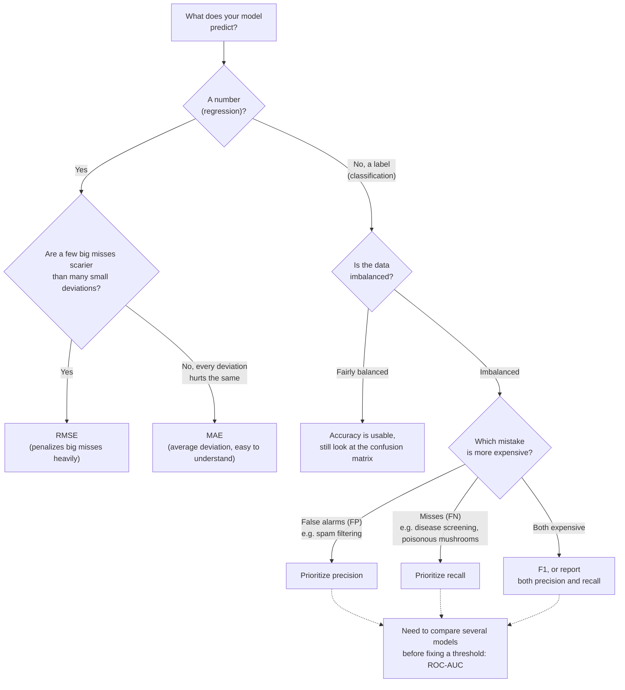

> **Learning objectives:** After this lesson, you will know why accuracy can mislead, be able to read and compute by hand the metrics derived from the confusion matrix (precision, recall, F1), understand the intuition behind ROC-AUC and the metrics for regression (MAE, RMSE, R²), and know how to choose the right metric for each problem.

## 1. When "99% accurate" is a useless model

A rare disease: 1 in every 100 people has it. You are tasked with building a screening model and you test it on 1,000 people, 10 of whom really have the disease. Before looking at your model, consider a "model" so lazy it is laughable: **no matter who walks in, it declares "healthy"**.

- 990 healthy people → it gets all 990 right.
- 10 sick people → it gets all 10 wrong.
- Proportion of correct guesses: 990/1,000 = **99%**.

Ninety-nine percent - it sounds like an excellent model, while it **fails to detect a single patient**, meaning it is useless for the very purpose it was built for.

That 99% figure is **accuracy**: the proportion of correct predictions over the total number of examples. It is the intuitive metric, the first one that comes to mind - and also the metric that most easily misleads when the data is **imbalanced**: the class we care about (disease, fraud, default) makes up only a small fraction, so merely "going with the majority" already yields a high accuracy.

This does not happen only in made-up examples. *An Introduction to Statistical Learning* (chapter 4) uses the `Default` dataset: 10,000 credit card customers, of whom only 333 (3.33%) default. A genuinely trained model (LDA) reaches an error rate of **2.75%** - which sounds fine... until you set it next to the model that "always predicts no default": error **3.33%**. The model that actually learned beats the lazy model by a mere 0.58 percentage points. Accuracy on its own cannot tell whether a model has learned anything at all. We need to dissect *what kind of mistakes* it makes - and that is the job of the confusion matrix.

> ⚠️ **A small note:** the 2.75% figure is the error measured on the very same 10,000 training examples (training error). The book says so explicitly and reminds us that the error on new data is *usually* higher (Lesson 04, Lesson 14); for this dataset (only 2 features, 10,000 examples) the authors are not too worried about overfitting, but the general rule still holds: a pretty number on train is not the real number yet.

## 2. The confusion matrix: dissecting the 4 kinds of outcome

You take the LDA model above to report to the card company: *"The model is 97.25% correct."* The head of risk asks back exactly one question: *"Correct for whom? Of the customers who will go on to default, how many does the model catch?"* Accuracy cannot answer. The table below can.

The **confusion matrix** is a 2×2 table that cross-tabulates *what the machine predicted* against *what the truth is*. Convention: the class we want to detect is **positive** - here, "default" - and the other class is **negative**. This is the real table from *An Introduction to Statistical Learning*: the LDA model on the 10,000 customers of the `Default` dataset (rows = machine's prediction, columns = truth):

| | Truth: **default** (positive) | Truth: **no default** (negative) | Row total |
|---|---|---|---|
| **Machine predicts "default"** | **TP = 81** - caught correctly | **FP = 23** - false alarm | 104 people "pointed at" by the machine |
| **Machine predicts "no default"** | **FN = 252** - missed | **TN = 9,644** - correctly let through | 9,896 people let through by the machine |
| **Column total** | 333 people who really default | 9,667 people who do not default | 10,000 |

The four cells, with a plain-language way to remember them:

| Symbol | Full name | Meaning | How to remember |
|---|---|---|---|
| **TP** | True Positive | Machine says positive, truth is positive | **Caught correctly** |
| **FP** | False Positive | Machine says positive, truth is negative | **False alarm** (wrongly accused) |
| **FN** | False Negative | Machine says negative, truth is positive | **Missed** (slipped through) |
| **TN** | True Negative | Machine says negative, truth is negative | **Correctly let through** |

A tip for reading the symbols: the **second** word (Positive/Negative) is *what the machine predicted*; the **first** word (True/False) says *whether that prediction was right or wrong*.

Now look at accuracy again: $(81 + 9,644)/10,000 = 97.25\%$ - very pretty. But the first column of the table exposes the truth: of the **333 people who really default, the model misses 252** - that is 75.7%. For a card company that wants to identify risky customers, that may be an unacceptable level - despite an accuracy of nearly 97%.

> 🔧 **Try it now:** the mushroom classifier (Lesson 01, Lesson 05) is tested on 1,000 mushrooms, 50 of which are death caps. Result: TP = 30, FP = 10, FN = 20, TN = 940. Compute the accuracy and the proportion of poisonous mushrooms missed.
>
> *Answer:* accuracy = (30 + 940)/1,000 = **97%**; missed 20/50 = **40%** of the poisonous mushrooms. A model that is "97% correct" yet lets 2 out of every 5 death caps through - would you dare let it pick the mushrooms for dinner?

> ⚠️ **A small note:** there is no universal convention for the *orientation* of the table. *An Introduction to Statistical Learning* (and the table above) puts rows = machine's prediction, columns = truth; scikit-learn's `confusion_matrix` function does the reverse - rows = truth, columns = machine's prediction - so for two classes it prints `[[TN, FP], [FN, TP]]`. Before reading the numbers, always check which way is which.

## 3. Precision and recall: two different questions

Same table, two people asking two different questions. The case handler asks: *"When the machine points at a customer as 'will default', how far can I trust it?"* The head of risk asks: *"Of the customers who will go on to default, what fraction does the machine catch?"* Those two questions are exactly the two metrics.

**Precision** answers the first question - *of the cases the machine flags as positive, what fraction are correct?*

$$\text{precision} = \frac{TP}{TP + FP}$$

By hand with the table above: the machine flags 104 people as "default", 81 correctly → precision $= 81/104 \approx 77.9\%$. High precision means **few false alarms**: once the machine "points at" someone, that accusation is usually trustworthy.

**Recall** - also called *sensitivity* - answers the second question: *of the cases that are truly positive, what fraction does the machine catch?*

$$\text{recall} = \frac{TP}{TP + FN}$$

By hand: 333 people really default, the machine catches 81 → recall $= 81/333 \approx 24.3\%$. High recall means **few misses**.

Both start from the TP cell and differ only in the denominator: precision divides by the **"machine predicts default" row** (104 people), recall divides by the **"really defaults" column** (333 people). Precision worries about false accusations; recall worries about misses.

> ⚠️ **A small note:** recall is *not* "the accuracy of the test". It measures coverage on **the truly positive group alone**, paying no attention whatsoever to how many innocent people the machine wrongly accuses - to learn about false accusations, you must look at precision. Do not use the two words interchangeably.

<details>
<summary><b>Going deeper:</b> one quantity, five names</summary>

*An Introduction to Statistical Learning* calls the vocabulary around the confusion matrix "an almost bewildering array of terms": each field - medicine, statistics, machine learning - has its own name for the same number. A cross-reference table (following Table 4.7 of the book):

| Quantity | Formula | Other names you will meet |
|---|---|---|
| Recall | TP/(TP+FN) | sensitivity, true positive rate (TPR), power, 1 − type II error |
| Precision | TP/(TP+FP) | positive predictive value (PPV), 1 − false discovery proportion |
| Specificity | TN/(TN+FP) | 1 − false positive rate (FPR); the FPR itself is also called the type I error |

For the LDA model on `Default`: specificity $= 9,644/9,667 = 99.8\%$ - the machine almost never wrongly accuses a good customer, but as we saw, it misses three quarters of the bad ones. The two numbers 99.8% and 24.3% describe *the same model*.

</details>

### Which to prioritize? Look at the cost of mistakes

These two metrics usually **pull against each other**: to catch more positive cases (raise recall), the machine has to be "heavier-handed" in flagging positives, which brings more false alarms (lower precision) - and vice versa. Which one to prioritize depends on **which mistake is more expensive** in your problem:

- **Spam filtering → prioritize precision.** Missing a spam email (FN) is only mildly annoying; but a false alarm (FP) - throwing your job offer into the spam folder - is a disaster. Better to let a few spam messages through than to wrongly kill an important email.
- **Disease screening → prioritize recall.** A false alarm (FP) sends a healthy person for further tests - costly and worrying, but bearable; missing (FN) an early-stage cancer can cost a life.

This is exactly the death cap mushroom lesson from Lesson 01 and Lesson 05 - **decision = probability × consequence** - now appearing in the form of a metric: when one kind of mistake has consequences that are too severe (eating a poisonous mushroom, missing a cancer), we accept many more false alarms so as not to miss. "Better safe than sorry."

How does the machine become "more careful"? **Lower the decision threshold.** In the `Default` example, *An Introduction to Statistical Learning* tries flagging "default" as soon as the probability exceeds 20%, instead of only when it exceeds 50%. Result: it catches 195/333 cases (recall rises to $\approx 58.6\%$), in exchange for false alarms rising from 23 to 235 people (precision drops to $195/430 \approx 45.3\%$). There is no absolutely "right" choice here - the card company must weigh the costs of the two kinds of mistake for itself.

### F1: one number that reconciles the two

When a single number is needed to compare models, people often use **F1** - the **harmonic mean** of precision and recall:

$$F_1 = \frac{2 \cdot \text{precision} \cdot \text{recall}}{\text{precision} + \text{recall}}$$

The harmonic mean has a "hard to please" character: it is high only when **both** components are high - if one side drops toward 0, F1 drops with it, and the other side cannot make up for it. By hand for the two versions of the model above:

- Threshold 50%: precision 0.779, recall 0.243 → $F_1 = \frac{2 \times 0.779 \times 0.243}{0.779 + 0.243} \approx 0.37$.
- Threshold 20%: precision 0.453, recall 0.586 → $F_1 \approx 0.51$.

By F1, the 20% threshold version is better balanced - even though its accuracy is *lower* (error 3.73% versus 2.75%). One more illustration that "higher accuracy" does not mean "better for our purpose".

> 🔧 **Try it now:** go back to the mushroom classifier in Section 2 (TP = 30, FP = 10, FN = 20, TN = 940). Compute precision, recall, and F1.
>
> *Answer:* precision = 30/40 = **0.75**; recall = 30/50 = **0.6**; F1 = 2 × 0.75 × 0.6 / (0.75 + 0.6) = 0.9/1.35 ≈ **0.67**. If you have Python, check with a few lines:
>
> ```python
> from sklearn.metrics import precision_score, recall_score, f1_score
> y_true = [1]*50 + [0]*950                    # 50 poisonous mushrooms (1), 950 edible ones (0)
> y_pred = [1]*30 + [0]*20 + [1]*10 + [0]*940  # 30 caught correctly, 20 missed, 10 false alarms, 940 correctly let through
> print(precision_score(y_true, y_pred), recall_score(y_true, y_pred), f1_score(y_true, y_pred))  # 0.75 0.6 0.666...
> ```

## 4. ROC and AUC: evaluation that does not depend on a single threshold

The same LDA model: threshold 50% gives one confusion matrix, threshold 20% gives another. So "how good is this model", in the end - which number is it? Is there a way to measure the model's **power to discriminate** between the two classes without fixing a single threshold?

The idea of the **ROC curve (Receiver Operating Characteristic)**: **sweep the threshold** from strictest to loosest; at each threshold, plot a point showing the rate of correct catches (recall) against the rate of false accusations; join the points into a curve. The better the model separates the two classes, the more the curve "hugs the top-left corner" (many caught, few wrongly accused). **AUC (Area Under the Curve)** - the area under the curve - compresses the whole curve into one number:

- **AUC = 0.5**: no better than random guessing (the diagonal).
- **AUC = 1.0**: perfect ranking - every positive case is scored higher than every negative case, so there is a threshold that cleanly separates the two classes.
- The LDA model on the `Default` data reaches AUC $\approx 0.95$ - good discriminating power, even though (as we saw) at the default 50% threshold it misses three quarters of the defaulters. A high ROC tells you the *potential*; which threshold to choose in order to exploit that potential is still your decision.

Two details worth remembering from *An Introduction to Statistical Learning*: the name "ROC" describes nothing about machine learning at all - it is a historical name inherited from communications theory, short for *receiver operating characteristics*; and on the same `Default` data, the ROC curve of logistic regression almost exactly coincides with the ROC curve of LDA - two different models, the same discriminating power.

<details>
<summary><b>Going deeper:</b> what are the two axes of the ROC curve?</summary>

The vertical axis is the **True Positive Rate** (= recall = TP/(TP+FN)): of the truly positive cases, what fraction is caught. The horizontal axis is the **False Positive Rate** (= FP/(FP+TN)): of the truly negative cases, what fraction is wrongly accused. Lowering the threshold → both rise together: the point travels from the corner (0,0) - "flag nobody" - up to (1,1) - "flag everybody". A good model is one whose TPR shoots up while FPR is still low. A rather elegant way to understand AUC (from Google's Machine Learning Crash Course): AUC equals the probability that the model scores a random positive case **higher** than a random negative case.

</details>

> ⚠️ **A small note:** AUC measures *ranking potential*, not the quality of the final decision. With heavily imbalanced data, AUC can still look great while precision is terrible - look at precision/recall at the threshold you intend to use alongside it; do not look at AUC alone. And the "0.5 = random guessing" benchmark is the expectation when evaluating on data independent of the training data.

## 5. Metrics for regression: MAE, RMSE, R²

The machine predicts that house D costs 3.7 billion VND; the true price is 4.5 billion. The machine is "wrong" - but the meaningful question is *by how much*. A regression problem (predicting a number) has no clear-cut "right/wrong"; it has **deviations**. Let us reuse the table of 4 houses for which you computed MSE in Lesson 10 (unit: billion VND):

| House | True price | Predicted | Deviation | Deviation² |
|---|---|---|---|---|
| A | 2.0 | 2.2 | 0.2 | 0.04 |
| B | 3.0 | 2.8 | 0.2 | 0.04 |
| C | 2.5 | 2.5 | 0.0 | 0.00 |
| D | 4.5 | 3.7 | 0.8 | 0.64 |

- **MAE (Mean Absolute Error)** = the average of the deviations: $(0.2+0.2+0+0.8)/4 = 0.3$ billion. Easy to understand, in the same unit as the thing being predicted: "on average the prediction is off by 300 million".
- **RMSE (Root Mean Squared Error)** = take the familiar MSE from Lesson 10 and take its square root to get back to the right unit: $\sqrt{(0.04+0.04+0+0.64)/4} = \sqrt{0.18} \approx 0.42$ billion. Because of the squaring, RMSE **penalizes big misses heavily**: house D, off by 0.8, contributes overwhelmingly. RMSE is always ≥ MAE; the further apart the two numbers are, the more the error is concentrated in a few big misses.
- **R² (coefficient of determination)** answers: *what fraction of the variation in the data does the model explain, compared with the dumb guess of predicting the mean?* R² = 1 is a perfect fit; R² = 0 is no better than guessing the mean; on new data, R² can even be **negative** - worse than guessing the mean.

> 🔧 **Try it now:** two models both have MAE = 0.2 billion on the 4 houses. Model P is off by exactly 0.2 on all four houses; model Q nails three houses exactly but misses by 0.8 on house D. Compute the RMSE of each model.
>
> *Answer:* P: $\sqrt{(4 \times 0.04)/4} = \sqrt{0.04} =$ **0.2**; Q: $\sqrt{0.64/4} = \sqrt{0.16} =$ **0.4**. Same MAE, but Q's RMSE is double - RMSE "sniffs out" the big miss that MAE flattens away.

<details>
<summary><b>Going deeper:</b> how is R² computed?</summary>

$$R^2 = 1 - \frac{\sum (y - \hat{y})^2}{\sum (y - \bar{y})^2}$$

The numerator is the model's sum of squared errors; the denominator is the sum of squared errors if you only made the dumb guess of the mean price $\bar{y}$. For the 4 houses: mean price $\bar{y} = (2.0 + 3.0 + 2.5 + 4.5)/4 = 3.0$; the dumb guess is off by $1.0;\ 0;\ 0.5;\ 1.5$ → squared and summed $= 3.5$; the model's squared deviations summed $= 0.72$. So $R^2 = 1 - 0.72/3.5 \approx 0.79$: the model "explains" about 79% of the price variation relative to guessing the mean. If, on new data, the numerator exceeds the denominator (the prediction is worse than guessing the mean), R² will be negative.

</details>

MAE or RMSE? Again a question of cost: if being off by 800 million is *much worse* than being off by 200 million four times, RMSE reflects your concern better; if every deviation "hurts" in proportion to its size, MAE is more honest.

### Putting it together: which metric for your problem?

Every choice in this lesson comes down to two questions: *predicting a number or a label?* and *which mistake is more expensive?*



The diagram is a starting point, not a law: in practice you usually report **several** metrics at once (for example precision, recall, and F1 together with the confusion matrix) and only then discuss which one to prioritize.

## 6. Measuring reliably - and never trusting a single number

Remember An and Binh from Lesson 04: An practiced all 10 exams and then graded themselves on those same 10 exams - 10/10; Binh set aside 2 exams never opened and took a mock test on them - 7/10. Every metric in this lesson - accuracy, F1, RMSE - is only trustworthy if you grade the way Binh does. Choosing the right metric is only half; the other half is **which data you measure on**.

- **Measure on an untouched test set.** As Lesson 04 and Lesson 14 emphasized: every number measured on data the model has learned from (or that you have used for tuning) is more optimistic than reality. The test set is "unsealed" only once, at the very last step.
- **Cross-validation when data is scarce.** If there is too little data to carve off a sizable test set, you can divide the data into $k$ parts (usually 5 or 10): take turns letting each part serve as the **validation fold**, train on the rest, then average the $k$ results. This gives a more stable estimate than one lucky-or-unlucky split - *An Introduction to Statistical Learning* devotes all of chapter 5 to this technique.

Finally, a habit of experienced ML practitioners: **do not stop at the number**. Two models with the same F1 = 0.80 can be wrong in two completely different ways - one keeps wrongly accusing new customers, the other keeps missing nighttime transactions. Open up the wrongly predicted examples and look: what do they have in common? Which group is the model weak on? This "reading of errors" (error analysis) often points to more concrete directions for improvement than any aggregate number - and sometimes exposes more serious problems too, such as data bias (Lesson 01) or a "leaked exam" - data leakage (Lesson 14).

## Lesson summary

- **Accuracy misleads when the data is imbalanced**: a 1% rare disease → the model that "always predicts healthy" reaches 99% yet is useless. You must dissect *what kind of mistakes*.
- The **confusion matrix** separates 4 cells: TP (caught correctly), FP (false alarm), FN (missed), TN (correctly let through) - the second word is the machine's prediction, the first word is whether it was right or wrong. Check the row/column orientation before reading (scikit-learn puts rows = truth).
- **Precision** = TP/(TP+FP): how far to trust the machine when it flags positive; **recall** = TP/(TP+FN): what fraction of real cases it catches. Spam filtering prioritizes precision; disease screening (and death cap mushrooms) prioritizes recall - decided by the **cost of mistakes**; lowering the threshold is how you trade precision for recall.
- **F1** = the harmonic mean of precision and recall - high only when both are high.
- **ROC-AUC** evaluates the model's discriminating power across *all* thresholds: AUC 0.5 = random guessing, 1.0 = perfect.
- Regression: **MAE** (average deviation, easy to understand), **RMSE** (penalizes big misses heavily - the square root of the MSE from Lesson 10), **R²** (what fraction of the variation is explained relative to guessing the mean).
- Measuring reliably: an **untouched test set** (Lesson 04), **cross-validation** when data is scarce; and one number never tells the whole story - go and look at the specific errors with your own eyes.

## Self-check questions

1. A credit card fraud detection model reaches 99.2% accuracy on data in which 0.8% of transactions are fraudulent. Is this number impressive? What more would you ask before drawing a conclusion?
2. **By hand:** a spam filter tested on 1,000 emails gives: TP = 90, FP = 10, FN = 30, TN = 870. Compute accuracy, precision, recall, and F1. (Answers to check yourself against: 96%; 0.9; 0.75; ≈ 0.82.)
3. **By hand:** a disease screening machine tested on 1,000 people (50 of whom have the disease) gives: TP = 45, FN = 5, FP = 180, TN = 770. Compute precision and recall. In the role of a first-round screening (anyone the machine flags positive gets more thorough testing), is this model acceptable? Why?
4. Why does F1 use the *harmonic* mean instead of the arithmetic mean? Try computing both kinds of mean for precision = 1.0 and recall = 0.02 to see the difference.
5. Two house price models both have MAE = 0.3 billion, but model X has RMSE = 0.35 billion while model Y has RMSE = 0.9 billion. What does that say about the difference between the two models?
6. Your team tunes hyperparameters for two whole weeks, and each time measures the result on the test set to choose the best version. Is the final number on the test set still trustworthy? Relate it to Lesson 04 and Lesson 14 to explain.

## Further reading

**Primary sources for this lesson:**

| Source | Which part to read |
|---|---|
| **An Introduction to Statistical Learning (ISLP)** | Chapter 4, Section 4.4.2 - the confusion matrix on the `Default` data, sensitivity/specificity, the decision threshold, the ROC curve and AUC, the terminology cross-reference table (Tables 4.6-4.7) |
| **An Introduction to Statistical Learning (ISLP)** | Chapter 2, Section 2.2 - training error vs test error; Chapter 5 - cross-validation |
| **Dive into Deep Learning (d2l.ai)** | Chapter *Linear Neural Networks for Regression* - section *Generalization*: why you must evaluate on data the model has not seen |

**Additional free online sources:**

- [Accuracy, precision, recall - Machine Learning Crash Course (Google)](https://developers.google.com/machine-learning/crash-course/classification/accuracy-precision-recall) - an introductory explanation with interactive figures.
- [ROC and AUC - Machine Learning Crash Course (Google)](https://developers.google.com/machine-learning/crash-course/classification/roc-and-auc) - the threshold-sweeping intuition and how to read AUC.
- [Model evaluation - scikit-learn User Guide](https://scikit-learn.org/stable/modules/model_evaluation.html) - the complete reference for all metrics with formulas and code, useful when you start working on a project.

## The end of the Foundations chapter

You have just finished all 15 lessons of the Foundations chapter. Looking back, the chapter's thread forms a closed loop. It starts from **concepts**: what AI - ML - DL are, what it means for a machine to "learn" (Lessons 01-05). Then come **data** - features, labels, how to split and prepare it (Lessons 03, 04, 12) - and the **minimal mathematical foundation**: vectors, probability, derivatives (Lessons 06-09). Next is the **learning mechanism**, that is, loss functions and optimization algorithms (Lessons 10-11). It closes with **evaluation in practice**: how many "knobs" a model has (Lesson 13), whether it memorizes or understands (Lesson 14), and which yardstick measures it honestly (Lesson 15). By now, you have enough of the shared language to read and understand machine learning material and to ask the right questions yourself.

**The next chapter - Machine Learning - does exactly that.** Twelve lessons, opening with a project that runs the whole procedure on real house-price data: stating the problem and the metric, splitting train/test, building a `Pipeline`, measuring RMSE/MAE and comparing against a baseline. Each step in it is a lesson you have just read, this time typed out as code. After that project come the models one by one - linear and logistic regression, regularization, k-NN, decision trees, random forests and gradient boosting, SVM, k-means, PCA - and the chapter closes with a complete end-to-end project.

A few other directions, depending on your goals:

- **Read one foundational book in depth.** All three books that run through this series - *An Introduction to Statistical Learning*, *Dive into Deep Learning*, and *Mathematics for Machine Learning* - are free in electronic form; you now have enough of a foundation to read them actively instead of being overwhelmed.
- **Do a project yourself before reading on.** Pick a public dataset (Iris flowers, MNIST handwritten digits) and walk the whole procedure yourself: explore the data → split train/validation/test → train a few models with scikit-learn → evaluate with exactly the metrics of Lesson 15. Knowledge only becomes skill when your own hands type it out.

May you keep the habit this series set out to plant: when you meet an AI system, do not ask *"is it magical?"* but ask *"what data, what model, what loss function - and how was it evaluated?"*

> **Next lesson:** [Your First Project: Predicting House Prices with scikit-learn](../first-project-house-prices-with-scikit-learn/) - the Machine Learning chapter opens with a model that actually runs: 20,640 real rows, under 30 lines of code, and every step is a Foundations lesson you have already read.
