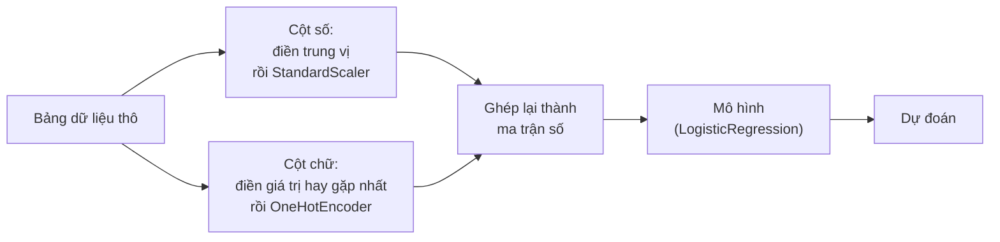

> **Mục tiêu bài học:** Sau bài này, bạn sẽ biết những cách tạo đặc trưng mới thường dùng và vì sao chúng giúp mô hình, chọn được cách mã hóa cho cột chữ, nhìn ra kiểu lộ đề tinh vi nhất trong tiền xử lý, và gói toàn bộ quy trình vào `Pipeline` + `ColumnTransformer` để cross-validation cho ra con số đáng tin.

## 1. Mô hình chỉ nhìn thấy những cột bạn đưa cho nó

Một hồ sơ vay có hai cột ngày: `ngày_sinh` và `ngày_nộp_hồ_sơ`. Mô hình nhận về hai con số lớn, chẳng hạn 19910312 và 20240715. Nó không biết hai con số ấy là ngày tháng, không biết trừ cái này cho cái kia, và tuyệt nhiên không biết hiệu của chúng chính là tuổi người vay - thứ liên quan trực tiếp tới khả năng trả nợ. Bạn thêm một cột `tuổi_lúc_vay`, mô hình lập tức dùng được.

Đó là **feature engineering (tạo đặc trưng)**: dùng hiểu biết về lĩnh vực để tạo ra những cột mà thuật toán không thể tự nghĩ ra. Hồi quy tuyến tính chỉ cộng các cột lại theo trọng số - nó không tự nhân hai cột với nhau bao giờ. Cây quyết định cắt từng cột một - nó không tự lấy cột A chia cột B. Cái gì không có trong bảng thì mô hình không dùng được.

Bộ `adult` có một ví dụ rõ. Cột `capital-gain` (lãi vốn) bằng 0 ở **91,7%** số dòng, còn 8,3% còn lại trải từ 114 tới 99.999. Nhìn theo giá trị thô thì đó là một cột lệch nặng, gần như toàn số 0. Nhưng chỉ cần hỏi "cột này có khác 0 không":

| | tỉ lệ thu nhập > 50K |
|---|---|
| `capital-gain` = 0 (91,7% số dòng) | 20,5% |
| `capital-gain` > 0 (8,3% số dòng) | **61,7%** |

Một câu hỏi có/không đã tách ra hai nhóm chênh nhau gấp ba lần về tỉ lệ. Cột `has_gain = (capital-gain > 0)` chỉ tốn một dòng code, mà nói với mô hình đúng điều dải giá trị thô chạy tới 99.999 kia diễn đạt rất vụng.

## 2. Sáu kiểu đặc trưng thường tạo

**Hiệu và tỉ lệ.** Hai cột riêng lẻ ít nghĩa hơn quan hệ giữa chúng: `thu_nhập / dư_nợ`, `số_đơn_thành_công / tổng_số_đơn`, `capital-gain − capital-loss`. Cây quyết định phải tốn nhiều tầng để xấp xỉ một phép chia; đưa sẵn kết quả thì nó dùng ngay trong một lần cắt.

**Log cho cột lệch nặng.** `capital-gain`, doanh thu, dân số, lượt xem - những cột mà đa số giá trị nhỏ còn một nhúm giá trị khổng lồ. `np.log1p(x)` (tức $\log(1+x)$, xử lý được cả giá trị 0) kéo cái đuôi dài ấy về gần, giúp các mô hình tuyến tính đỡ bị vài dòng cực trị lôi đi.

**Tách cột ngày giờ.** Một dấu thời gian nên nở ra thành: giờ trong ngày, thứ trong tuần, tháng, có phải ngày lễ không, số ngày kể từ sự kiện gần nhất. Quy luật giao thông hay mua sắm nằm ở "8 giờ sáng thứ Hai", không nằm ở con số epoch.

**Tương tác.** Nhân hai cột với nhau khi tác động của cột này phụ thuộc cột kia. Bài 02 đã gặp dạng này với `PolynomialFeatures`.

**Chia khoảng (binning).** Biến một cột số thành các nhóm: giờ làm việc dưới 35 / 35-40 / 41-50 / trên 50 giờ mỗi tuần. Hữu ích khi quan hệ với nhãn không đơn điệu, đổi lại mất thông tin chi tiết trong từng khoảng.

**Gộp nhóm từ cột chữ.** Cột `marital-status` của `adult` có 7 giá trị, ba trong số đó bắt đầu bằng "Married". Gộp lại thành một cờ `is_married`:

| | tỉ lệ thu nhập > 50K |
|---|---|
| đã kết hôn | 43,6% |
| chưa/không còn kết hôn | 6,3% |

Chênh lệch gần bảy lần, gói gọn trong một cột 0/1.

Thêm sáu đặc trưng kiểu này vào mô hình hồi quy logistic trên `adult` (`capital_net`, `has_gain`, `log_gain`, `is_married`, `hours_bin`, `age × education-num`):

| Bộ đặc trưng | Accuracy | ROC-AUC |
|---|---|---|
| Cột thô | 0,8523 | 0,9036 |
| + 6 đặc trưng tự tạo | **0,8563** | **0,9071** |

Tăng 0,4 điểm accuracy. Có thật, đo được, lặp lại được - và cũng khiêm tốn. Nói cho đúng thì trên tập dữ liệu này, đổi từ hồi quy logistic sang gradient boosting còn giúp nhiều hơn (bài 07). Feature engineering là công cụ quan trọng, không phải phép màu; mức lợi phụ thuộc vào việc mô hình bạn dùng có tự học được quan hệ đó hay không. Mô hình tuyến tính hưởng lợi nhiều nhất, vì nó không tự tạo được tương tác hay phi tuyến nào.

> 🔧 **Thử ngay:** vì sao thêm `log_gain` lại giúp hồi quy logistic mà gần như không giúp random forest?
> Hồi quy logistic cộng `hệ_số × giá_trị_cột`, nên giá trị càng lớn thì đóng góp càng lớn theo đúng tỉ lệ. Sau `StandardScaler`, dòng có `capital-gain` = 99.999 nằm ở **13,3 độ lệch chuẩn** trên trung bình - một dòng duy nhất kéo lệch cả tổng. Lấy `log1p` trước rồi mới chuẩn hóa thì giá trị ấy chỉ còn 4,4 độ lệch chuẩn. Cây quyết định thì chỉ hỏi "có lớn hơn ngưỡng không", mà `log` là phép biến đổi giữ nguyên thứ tự, nên mọi ngưỡng đều dịch chuyển tương ứng và cây không đổi.

## 3. Mã hóa cột chữ

Phần lớn mô hình trong scikit-learn chỉ nhận số, nên các cột chữ phải được chuyển đổi (ngoại lệ đáng chú ý: `HistGradientBoosting` ở bài 12 nhận cột phân loại trực tiếp). Có ba lối:

**One-hot.** Mỗi giá trị thành một cột 0/1. Đây là lựa chọn mặc định cho cột không có thứ tự (`occupation`, `native-country`). Luôn đặt `handle_unknown="ignore"` để một giá trị lạ xuất hiện lúc chạy thật không làm chương trình dừng. Nhược điểm: `native-country` có 41 giá trị thì bảng phình thêm 41 cột, phần lớn gần như toàn số 0.

**Mã hóa thứ tự (ordinal).** Gán 0, 1, 2… Chỉ đúng khi các giá trị *thật sự* có thứ tự (tiểu học < trung học < đại học). Gán `occupation` thành 0-13 là ngầm khai báo "nghề số 7 nằm giữa nghề 6 và nghề 8", điều vô nghĩa với mô hình tuyến tính. Với mô hình cây thì đỡ hại hơn, vì cây có thể cắt nhiều lần để tách lại các nhóm - đó là lý do bài 12 dùng `OrdinalEncoder` cho gradient boosting và `OneHotEncoder` cho hồi quy logistic.

**Target encoding.** Thay mỗi giá trị bằng tỉ lệ nhãn dương của nhóm đó: `occupation = "Exec-managerial"` → 0,48 vì 48% người làm nghề ấy có thu nhập trên 50K. Gọn, mạnh, và là cái bẫy của mục sau.

## 4. Mã hóa sai một nhịp, cột số ngẫu nhiên đạt AUC 0,88

Thử nghiệm sau đây chỉ mất mười dòng code và đáng để nhớ lâu.

Ta thêm vào `adult` một cột `noise_id`: số nguyên ngẫu nhiên từ 0 đến 19.999, **không liên quan gì tới thu nhập**. Rồi target-encode nó - thay mỗi ID bằng tỉ lệ thu nhập > 50K của các dòng mang ID đó - và cross-validate một mô hình chỉ dùng đúng cột ấy.

```python
import numpy as np
from sklearn.model_selection import cross_val_score

rng = np.random.default_rng(42)
X["noise_id"] = rng.integers(0, 20000, len(X))
m = y.groupby(X["noise_id"]).mean()        # tính trên TOÀN BỘ dữ liệu
X["noise_te"] = X["noise_id"].map(m)
cross_val_score(pipe, X[["noise_te"]], y, cv=5, scoring="roc_auc").mean()
```

| Cách tính target encoding | ROC-AUC (5-fold CV) |
|---|---|
| Tính tỉ lệ trên toàn bộ dữ liệu, rồi mới cross-validate | **0,8776** |
| Tính tỉ lệ riêng trong từng fold train | 0,4917 |

Cách thứ hai cho 0,49 - đúng như mong đợi với một cột hoàn toàn ngẫu nhiên, tương đương tung đồng xu. Cách thứ nhất cho 0,8776, xấp xỉ mô hình thật dùng đủ 13 cột (0,9036).

Chuyện gì đã xảy ra? Với 48.842 dòng chia cho 20.000 ID, mỗi ID chỉ có khoảng 2-3 dòng. Tỉ lệ trung bình của một nhóm 2-3 dòng *bao gồm cả nhãn của chính dòng đang xét*. Cột `noise_te` vì thế là bản mã hóa của đáp án. Khi cross-validation cắt fold, phần lộ đề đã nằm sẵn trong cột - không thao tác chia tách nào cứu được nữa.

Đây là dạng lộ đề khó thấy nhất, vì nó xảy ra ở bước tiền xử lý chứ không ở bước huấn luyện, và nó cho ra những con số đẹp đến mức người ta ngại nghi ngờ. Sayash Kapoor và Arvind Narayanan đã rà lại các công trình học máy trong nhiều ngành khoa học, kết quả đăng trên tạp chí *Patterns* năm 2023: 17 lĩnh vực dính lỗi lộ đề, tổng cộng 294 bài báo bị ảnh hưởng. Hai tác giả phân loại được tám kiểu lộ đề, từ những lỗi cơ bản nhìn là thấy cho tới các trường hợp còn đang tranh luận.

> ⚠️ **Lưu ý nhỏ:** target encoding không phải kỹ thuật xấu - nó xử lý cột nhiều giá trị tốt hơn one-hot. Chỉ có điều nó phải được tính **bên trong** mỗi fold train, và với các nhóm ít dòng thì kéo giá trị mã hóa về gần tỉ lệ chung (làm mượt). scikit-learn có sẵn `TargetEncoder` làm đúng như vậy: khi nằm trong `Pipeline`, nó dùng cross-fitting nội bộ để giá trị mã hóa của mỗi dòng không được tính từ nhãn của chính nó.

## 5. Đóng gói bằng Pipeline và ColumnTransformer

Quy tắc rút ra từ mục 4 phát biểu được thành một câu: **mọi phép biến đổi có học từ dữ liệu đều phải `fit` chỉ trên phần train.** Trung vị để điền giá trị thiếu, trung bình và độ lệch chuẩn của `StandardScaler`, danh sách giá trị của `OneHotEncoder`, các trục của `PCA` - tất cả đều là tham số học từ dữ liệu.

Làm tay thì rất dễ quên, nhất là khi cross-validation chia lại dữ liệu năm lần. `Pipeline` giải quyết bằng cách gắn liền tiền xử lý với mô hình thành một đối tượng: gọi `fit` thì mọi bước `fit` trên đúng phần train của fold đó; gọi `predict` thì mọi bước chỉ `transform`.

`ColumnTransformer` lo phần còn lại: các cột khác loại cần cách xử lý khác nhau.



```python
from sklearn.pipeline import Pipeline
from sklearn.compose import ColumnTransformer
from sklearn.preprocessing import StandardScaler, OneHotEncoder
from sklearn.impute import SimpleImputer
from sklearn.linear_model import LogisticRegression

pipe = Pipeline([
    ("prep", ColumnTransformer([
        ("num", Pipeline([("imp", SimpleImputer(strategy="median")),
                          ("sc",  StandardScaler())]), num_cols),
        ("cat", Pipeline([("imp", SimpleImputer(strategy="most_frequent")),
                          ("oh",  OneHotEncoder(handle_unknown="ignore"))]), cat_cols),
    ])),
    ("clf", LogisticRegression(max_iter=2000)),
])
pipe.fit(X_train, y_train)
```

Bộ `adult` cần cả hai nhánh: nó có 6 cột số, 7 cột chữ, và giá trị thiếu ở `workclass` (2.799 dòng), `occupation` (2.809) và `native-country` (857). Sau khi đi qua `ColumnTransformer`, 13 cột ban đầu nở thành 89 cột số.

Gói xong thì `GridSearchCV` chạy trên cả pipeline, và tham số của bước nào cũng dò được bằng cú pháp `tên_bước__tên_tham_số`:

```python
from sklearn.model_selection import GridSearchCV

GridSearchCV(pipe, {"clf__C": [0.01, 0.1, 1, 10]}, cv=5, scoring="roc_auc")
```

Kết quả trên `adult`: `C=0,01` → 0,9034; `C=0,1` → 0,9071; `C=1` → **0,9075**; `C=10` → 0,9074. Điều quan trọng không phải giá trị `C` thắng cuộc, mà là trong cả 5 fold × 4 giá trị = 20 lần huấn luyện, `SimpleImputer` và `StandardScaler` đều được `fit` lại từ đầu trên đúng phần train của fold ấy. Đó là thứ khiến con số 0,9075 đáng tin.

## 6. Cột nào mô hình thực sự dùng: hỏi bằng cách xáo trộn

Tạo thêm feature rồi thì cũng nên biết cái nào thực sự có ích. Bài 07 đã cảnh báo `feature_importances_` của mô hình cây thiên vị các cột nhiều giá trị khác nhau. Cách đo trung thực hơn là **permutation importance**: lấy mô hình đã huấn luyện, xáo trộn ngẫu nhiên một cột trên tập test rồi đo xem điểm số tụt bao nhiêu. Cột nào xáo trộn mà điểm không đổi thì mô hình vốn không dùng tới nó.

```python
from sklearn.inspection import permutation_importance
r = permutation_importance(pipe, X_test, y_test, n_repeats=5,
                           random_state=42, scoring="roc_auc")
```

Mức giảm ROC-AUC trên `adult` (nhân 1.000 cho dễ đọc):

| Cột | education-num | is_married | marital-status | capital_net | capital-gain | log_gain | occupation | age |
|---|---|---|---|---|---|---|---|---|
| AUC giảm | 58,6 | 45,2 | 34,0 | 31,6 | 31,1 | 16,1 | 14,0 | 13,5 |

| Cột | hours-per-week | sex | workclass | age_x_edu | native-country | race | fnlwgt |
|---|---|---|---|---|---|---|---|
| AUC giảm | 10,7 | 6,6 | 1,9 | 1,8 | 1,7 | 0,6 | 0,5 |

Ba điều đọc ra từ bảng này. Thứ nhất, `fnlwgt` gần như vô dụng (0,0005 AUC) - đúng như bài 07 dự đoán: nó là trọng số lấy mẫu của cuộc điều tra dân số, không phải thuộc tính của người được khảo sát, vậy mà `feature_importances_` của random forest lại xếp nó rất cao chỉ vì nó có hàng chục nghìn giá trị khác nhau để cắt.

Thứ hai, `age_x_edu` gần như không đóng góp gì (1,8) dù `age` và `education-num` đều mạnh. Không phải đặc trưng tự tạo nào cũng có ích, và đây là cách kiểm chứng thay vì đoán.

Thứ ba - chỗ dễ hiểu nhầm nhất - `capital_net` (31,6), `capital-gain` (31,1) và `log_gain` (16,1) là ba phiên bản của cùng một thông tin, `is_married` (45,2) và `marital-status` (34,0) cũng vậy. Khi hai cột tương quan mạnh, xáo trộn một cột không làm điểm tụt nhiều vì mô hình vẫn đọc được thông tin đó từ cột kia. Permutation importance của các cột tương quan vì thế bị *chia nhỏ* và trông thấp hơn giá trị thật của nhóm. Muốn biết cả nhóm đóng góp bao nhiêu, hãy xáo trộn hoặc bỏ cả nhóm cùng lúc.

> ⚠️ **Lưu ý nhỏ:** đoạn code trên chạy trên `X_test` để minh hoạ cho gọn, nhưng hãy để ý một ranh giới quan trọng. Dùng kết quả này để *giải thích* một mô hình đã khóa thì được. Còn nếu bạn nhìn nó rồi **bỏ bớt cột**, tức là dùng tập test để chọn feature - và con số test sau đó không còn trung thực nữa. Muốn chọn feature thì đo trên validation hoặc bằng cross-validation, y như mọi lựa chọn khác (bài 12 sẽ nói kỹ chuyện ranh giới này).
>
> Ngoài ra, đọc permutation importance là câu trả lời cho "mô hình *này* đang dựa vào cột nào", không phải cho "cột nào *thực sự* ảnh hưởng tới thu nhập". Foundations · Bài 08 đã tách hai câu hỏi đó: mô hình học tương quan, còn ảnh hưởng nhân quả cần thiết kế nghiên cứu khác. Và nếu tính importance trên tập train thay vì tập test, một mô hình học tủ sẽ báo rằng chính những cột nhiễu nó học thuộc lòng mới là quan trọng.

> 🔧 **Thử ngay:** bạn có hai cột `chiều_cao_cm` và `chiều_cao_inch` đo cùng một thứ. Permutation importance của mỗi cột sẽ ra sao, và kết luận "cả hai cột đều vô dụng, bỏ hết đi" sai ở đâu?
> Cả hai sẽ ≈ 0: xáo cột nào mô hình cũng đọc được từ cột còn lại. Nhưng bỏ *cả hai* thì mất sạch thông tin chiều cao. Kết luận đúng là "một trong hai là thừa" - bỏ một cột, chạy lại, rồi mới xem cột còn lại quan trọng đến đâu.

## Tóm tắt bài học

- Mô hình chỉ dùng được những cột bạn đưa cho nó; hiệu, tỉ lệ, log, phần tách từ ngày giờ, tương tác, chia khoảng và cờ nhị phân là những cách tạo cột mới thường gặp.
- Đặc trưng tự tạo giúp nhiều nhất cho mô hình tuyến tính; trên `adult` chúng nâng AUC từ 0,9036 lên 0,9071 - có thật nhưng vừa phải.
- One-hot cho cột không có thứ tự (nhớ `handle_unknown="ignore"`), mã hóa thứ tự khi giá trị thật sự có thứ tự hoặc khi mô hình là cây.
- Target encoding tính trên toàn bộ dữ liệu là lộ đề: một cột ID ngẫu nhiên đạt AUC 0,8776 thay vì con số 0,4917 đúng ra phải có.
- Mọi phép biến đổi có học tham số từ dữ liệu phải `fit` chỉ trên phần train - `Pipeline` và `ColumnTransformer` đảm bảo điều đó tự động qua từng fold cross-validation.
- `GridSearchCV` chạy trên cả pipeline; tham số của từng bước gọi bằng `tên_bước__tên_tham_số`.
- Permutation importance đo mức tụt điểm khi xáo trộn một cột; nó công bằng hơn `feature_importances_` nhưng bị chia nhỏ khi các cột tương quan với nhau.

## Câu hỏi tự kiểm tra

1. Bảng của bạn có `tổng_dư_nợ` và `thu_nhập_tháng`. Đặc trưng nào nên tạo thêm, và vì sao hồi quy tuyến tính không tự tìm ra nó?
2. Vì sao lấy log một cột giúp hồi quy tuyến tính nhưng gần như không đổi gì với cây quyết định?
3. Bạn target-encode cột `mã_chi_nhánh` (500 chi nhánh) bằng cách tính tỉ lệ trên cả bảng rồi mới chia train/test. Điều gì sẽ xảy ra với điểm cross-validation, và vì sao?
4. `handle_unknown="ignore"` của `OneHotEncoder` chống lại tình huống nào lúc chạy thật?
5. Bạn chuẩn hóa toàn bộ dữ liệu bằng `StandardScaler().fit_transform(X)` rồi mới `train_test_split`. Con số nào bị rò rỉ từ test sang train, và `Pipeline` sửa chuyện này thế nào?
6. Permutation importance của cột `A` bằng 0,001. Nêu hai lý do hoàn toàn khác nhau có thể dẫn tới con số đó.

## Đọc thêm

**Nguồn nền tảng của bài:**

| Nguồn | Đọc phần nào |
|---|---|
| **scikit-learn User Guide** | Mục 6.1 *Pipelines and composite estimators* - `Pipeline`, `ColumnTransformer`, cú pháp `bước__tham_số`; mục 6.3 *Preprocessing data* - scaling, biến đổi phi tuyến, `PolynomialFeatures`, `KBinsDiscretizer`, `OneHotEncoder`, `TargetEncoder`; mục 6.4 *Imputation of missing values*; mục 4.2 *Permutation feature importance* - cách tính và phần *Misleading values on strongly correlated features* |
| **An Introduction to Statistical Learning (ISLP)** | Chương 3.3.2 - biến định tính và cách mã hóa, số hạng tương tác; chương 3.3.3 - biến đổi phi tuyến của biến dự báo; chương 6.1 - chọn tập con biến và vì sao chọn bằng dữ liệu thì phải đánh giá ngoài |
| **Foundations · Bài 12 và 14** | Quy trình chuẩn bị dữ liệu, và định nghĩa lộ đề cùng các dạng của nó |

**Nguồn online bổ sung (miễn phí):**

- [6.1. Pipelines and composite estimators - scikit-learn User Guide](https://scikit-learn.org/stable/modules/compose.html) - tài liệu chính chủ về `Pipeline` và `ColumnTransformer`.
- [Column Transformer with Mixed Types](https://scikit-learn.org/stable/auto_examples/compose/plot_column_transformer_mixed_types.html) - ví dụ hoàn chỉnh xử lý cùng lúc cột số và cột chữ.
- [4.2. Permutation feature importance - scikit-learn User Guide](https://scikit-learn.org/stable/modules/permutation_importance.html) - có mục riêng về sai lệch khi các cột tương quan mạnh.
- [Permutation Importance vs Random Forest Feature Importance](https://scikit-learn.org/stable/auto_examples/inspection/plot_permutation_importance.html) - so sánh trực tiếp hai cách đo trên cùng một mô hình.
- [Target Encoder - scikit-learn](https://scikit-learn.org/stable/modules/generated/sklearn.preprocessing.TargetEncoder.html) - cơ chế cross-fitting để tránh lộ đề, có sẵn từ phiên bản 1.3.
- [Kapoor & Narayanan - Leakage and the reproducibility crisis in machine-learning-based science (Patterns, 2023)](https://doi.org/10.1016/j.patter.2023.100804) - khảo sát 294 bài báo trong 17 lĩnh vực và bảng phân loại tám kiểu lộ đề; nhóm tác giả duy trì thêm [trang tài nguyên đi kèm](https://reproducible.cs.princeton.edu/) với danh sách kiểm tra trước khi công bố kết quả.
- [Zheng & Casari - Feature Engineering for Machine Learning (O'Reilly)](https://www.oreilly.com/library/view/feature-engineering-for/9781491953235/) - sách chuyên về chủ đề này; chương về binning và log transform bám sát mục 2.

> **Bài tiếp theo:** [Project end-to-end: dự đoán thu nhập từ hồ sơ](../end-to-end-project-predicting-income-vi/) - bài cuối chương ghép mọi thứ từ mười một bài vừa qua thành một quy trình chạy từ đầu đến cuối trên `adult` - chọn metric, so mô hình, tinh chỉnh, chọn ngưỡng theo chi phí, kiểm tra chênh lệch giữa các nhóm, rồi bàn giao.
