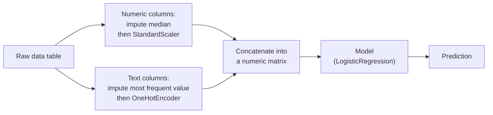

> **Learning objectives:** After this lesson, you will know the most common ways to create new features and why they help a model, be able to choose an encoding for text columns, spot the most subtle kind of leakage in preprocessing, and wrap the whole workflow into a `Pipeline` + `ColumnTransformer` so that cross-validation produces numbers you can trust.

## 1. The model only sees the columns you give it

A loan application has two date columns: `date_of_birth` and `application_date`. The model receives two large numbers, say 19910312 and 20240715. It does not know those two numbers are dates, does not know to subtract one from the other, and certainly does not know that their difference is the borrower's age - something directly related to their ability to repay. Add a column `age_at_application`, and the model can use it immediately.

That is **feature engineering**: using domain knowledge to create columns the algorithm could never come up with on its own. Linear regression only adds columns together with weights - it never multiplies two columns by itself. A decision tree cuts one column at a time - it never divides column A by column B on its own. Whatever is not in the table, the model cannot use.

The `adult` dataset has a clear example. The `capital-gain` column is 0 in **91.7%** of rows, while the remaining 8.3% range from 114 to 99,999. Looked at as raw values, it is a heavily skewed column, almost entirely zeros. But simply ask "is this column non-zero":

| | share with income > 50K |
|---|---|
| `capital-gain` = 0 (91.7% of rows) | 20.5% |
| `capital-gain` > 0 (8.3% of rows) | **61.7%** |

A single yes/no question has separated two groups whose rates differ by a factor of three. The column `has_gain = (capital-gain > 0)` costs one line of code, yet tells the model exactly what that raw range running up to 99,999 expresses so clumsily.

## 2. Six kinds of features people commonly create

**Differences and ratios.** Two separate columns mean less than the relationship between them: `income / outstanding_debt`, `successful_orders / total_orders`, `capital-gain − capital-loss`. A decision tree needs many levels to approximate a division; hand it the result and it uses it in a single split.

**Log for heavily skewed columns.** `capital-gain`, revenue, population, view counts - columns where most values are small and a handful are enormous. `np.log1p(x)` (that is, $\log(1+x)$, which also handles zero) pulls that long tail in, so linear models are less likely to be dragged around by a few extreme rows.

**Splitting date-time columns.** A timestamp should expand into: hour of day, day of week, month, whether it is a holiday, number of days since the most recent event. Traffic or shopping patterns live in "8 a.m. on a Monday", not in the epoch number.

**Interactions.** Multiply two columns together when the effect of one depends on the other. Lesson 02 already met this form with `PolynomialFeatures`.

**Binning.** Turn a numeric column into groups: working hours under 35 / 35-40 / 41-50 / over 50 hours per week. Useful when the relationship with the label is not monotonic, at the cost of losing detail within each bin.

**Grouping values of a text column.** The `marital-status` column in `adult` has 7 values, three of which begin with "Married". Merge them into a single flag `is_married`:

| | share with income > 50K |
|---|---|
| married | 43.6% |
| not / no longer married | 6.3% |

Nearly a sevenfold difference, packed into one 0/1 column.

Adding six features of this kind to a logistic regression model on `adult` (`capital_net`, `has_gain`, `log_gain`, `is_married`, `hours_bin`, `age × education-num`):

| Feature set | Accuracy | ROC-AUC |
|---|---|---|
| Raw columns | 0.8523 | 0.9036 |
| + 6 engineered features | **0.8563** | **0.9071** |

A gain of 0.4 accuracy points. Real, measurable, repeatable - and also modest. To be fair, on this dataset, switching from logistic regression to gradient boosting helps even more (Lesson 07). Feature engineering is an important tool, not magic; how much it helps depends on whether the model you use can learn that relationship on its own. Linear models benefit the most, because they cannot create any interaction or non-linearity by themselves.

> 🔧 **Try it now:** why does adding `log_gain` help logistic regression but do almost nothing for a random forest?
> Logistic regression adds up `coefficient × column_value`, so the larger the value, the larger its contribution, in exact proportion. After `StandardScaler`, the row with `capital-gain` = 99,999 sits **13.3 standard deviations** above the mean - a single row pulls the whole sum off. Take `log1p` first and then standardize, and that value drops to just 4.4 standard deviations. A decision tree only asks "is it above the threshold", and `log` is an order-preserving transformation, so every threshold shifts accordingly and the tree is unchanged.

## 3. Encoding text columns

Most models in scikit-learn only accept numbers, so text columns must be converted (a notable exception: `HistGradientBoosting` in lesson 12 accepts categorical columns directly). There are three routes:

**One-hot.** Each value becomes a 0/1 column. This is the default choice for columns with no ordering (`occupation`, `native-country`). Always set `handle_unknown="ignore"` so that an unseen value showing up in production does not stop the program. Drawback: `native-country` has 41 values, so the table grows by 41 columns, most of them almost entirely zeros.

**Ordinal encoding.** Assign 0, 1, 2… Only correct when the values *truly* have an order (primary < secondary < university). Mapping `occupation` to 0-13 implicitly declares "occupation 7 sits between occupations 6 and 8", which is meaningless for a linear model. For tree models it is less harmful, since a tree can split several times to separate the groups again - that is why Lesson 12 uses `OrdinalEncoder` for gradient boosting and `OneHotEncoder` for logistic regression.

**Target encoding.** Replace each value with the positive-label rate of that group: `occupation = "Exec-managerial"` → 0.48 because 48% of people in that occupation earn over 50K. Compact, powerful, and the trap of the next section.

## 4. Encode one step out of order, and a random column reaches AUC 0.88

The following experiment takes only ten lines of code and is worth remembering for a long time.

We add a column `noise_id` to `adult`: a random integer from 0 to 19,999, **with no relation to income whatsoever**. Then we target-encode it - replace each ID with the share of income > 50K among the rows carrying that ID - and cross-validate a model that uses only that column.

```python
import numpy as np
from sklearn.model_selection import cross_val_score

rng = np.random.default_rng(42)
X["noise_id"] = rng.integers(0, 20000, len(X))
m = y.groupby(X["noise_id"]).mean()        # computed on ALL the data
X["noise_te"] = X["noise_id"].map(m)
cross_val_score(pipe, X[["noise_te"]], y, cv=5, scoring="roc_auc").mean()
```

| How the target encoding is computed | ROC-AUC (5-fold CV) |
|---|---|
| Compute the rates on all the data, then cross-validate | **0.8776** |
| Compute the rates separately within each training fold | 0.4917 |

The second approach gives 0.49 - exactly as expected for a completely random column, equivalent to a coin toss. The first gives 0.8776, close to the real model using all 13 columns (0.9036).

What happened? With 48,842 rows spread over 20,000 IDs, each ID has only about 2-3 rows. The average rate of a group of 2-3 rows *includes the label of the very row being looked at*. The `noise_te` column is therefore an encoded copy of the answer. By the time cross-validation cuts the folds, the leakage is already baked into the column - no splitting procedure can rescue it any more.

This is the hardest kind of leakage to see, because it happens in the preprocessing step rather than the training step, and it produces numbers so good that people are reluctant to question them. Sayash Kapoor and Arvind Narayanan reviewed machine-learning work across many scientific disciplines, with results published in the journal *Patterns* in 2023: 17 fields affected by leakage errors, 294 papers affected in total. The two authors classified eight kinds of leakage, from basic mistakes that are obvious at a glance to cases still under debate.

> ⚠️ **A small note:** target encoding is not a bad technique - it handles high-cardinality columns better than one-hot. It is just that it must be computed **inside** each training fold, and for groups with few rows the encoded value should be pulled toward the overall rate (smoothing). scikit-learn ships a `TargetEncoder` that does exactly this: when placed inside a `Pipeline`, it uses internal cross-fitting so that no row's encoded value is computed from its own label.

## 5. Packaging with Pipeline and ColumnTransformer

The rule drawn from section 4 can be stated in one sentence: **every transformation that learns from data must be `fit` on the training portion only.** The median used to fill missing values, the mean and standard deviation of `StandardScaler`, the list of categories in `OneHotEncoder`, the axes of `PCA` - all of these are parameters learned from data.

Doing this by hand is very easy to forget, especially when cross-validation re-splits the data five times. `Pipeline` solves it by binding preprocessing and model into a single object: call `fit` and every step is `fit` on exactly the training portion of that fold; call `predict` and every step only `transform`s.

`ColumnTransformer` takes care of the rest: columns of different types need different treatment.



```python
from sklearn.pipeline import Pipeline
from sklearn.compose import ColumnTransformer
from sklearn.preprocessing import StandardScaler, OneHotEncoder
from sklearn.impute import SimpleImputer
from sklearn.linear_model import LogisticRegression

pipe = Pipeline([
    ("prep", ColumnTransformer([
        ("num", Pipeline([("imp", SimpleImputer(strategy="median")),
                          ("sc",  StandardScaler())]), num_cols),
        ("cat", Pipeline([("imp", SimpleImputer(strategy="most_frequent")),
                          ("oh",  OneHotEncoder(handle_unknown="ignore"))]), cat_cols),
    ])),
    ("clf", LogisticRegression(max_iter=2000)),
])
pipe.fit(X_train, y_train)
```

The `adult` dataset needs both branches: it has 6 numeric columns, 7 text columns, and missing values in `workclass` (2,799 rows), `occupation` (2,809) and `native-country` (857). After passing through the `ColumnTransformer`, the original 13 columns expand into 89 numeric columns.

Once packaged, `GridSearchCV` runs over the whole pipeline, and the parameters of any step can be searched using the `step_name__parameter_name` syntax:

```python
from sklearn.model_selection import GridSearchCV

GridSearchCV(pipe, {"clf__C": [0.01, 0.1, 1, 10]}, cv=5, scoring="roc_auc")
```

Results on `adult`: `C=0.01` → 0.9034; `C=0.1` → 0.9071; `C=1` → **0.9075**; `C=10` → 0.9074. What matters is not which value of `C` wins, but that across all 5 folds × 4 values = 20 training runs, `SimpleImputer` and `StandardScaler` were re-`fit` from scratch on exactly the training portion of that fold. That is what makes the number 0.9075 trustworthy.

## 6. Which columns the model actually uses: ask by shuffling

Once you have created features, you should also know which ones are actually useful. Lesson 07 already warned that the `feature_importances_` of tree models favor columns with many distinct values. A more honest measure is **permutation importance**: take the trained model, randomly shuffle one column on the test set, and measure how much the score drops. If shuffling a column leaves the score unchanged, the model never used it in the first place.

```python
from sklearn.inspection import permutation_importance
r = permutation_importance(pipe, X_test, y_test, n_repeats=5,
                           random_state=42, scoring="roc_auc")
```

Drop in ROC-AUC on `adult` (multiplied by 1,000 for readability):

| Column | education-num | is_married | marital-status | capital_net | capital-gain | log_gain | occupation | age |
|---|---|---|---|---|---|---|---|---|
| AUC drop | 58.6 | 45.2 | 34.0 | 31.6 | 31.1 | 16.1 | 14.0 | 13.5 |

| Column | hours-per-week | sex | workclass | age_x_edu | native-country | race | fnlwgt |
|---|---|---|---|---|---|---|---|
| AUC drop | 10.7 | 6.6 | 1.9 | 1.8 | 1.7 | 0.6 | 0.5 |

Three things to read from this table. First, `fnlwgt` is nearly useless (0.0005 AUC) - just as Lesson 07 predicted: it is the census sampling weight, not an attribute of the person surveyed, and yet the random forest's `feature_importances_` ranked it very high simply because it has tens of thousands of distinct values to split on.

Second, `age_x_edu` contributes almost nothing (1.8) even though `age` and `education-num` are both strong. Not every engineered feature is useful, and this is how you verify it instead of guessing.

Third - the easiest place to misread - `capital_net` (31.6), `capital-gain` (31.1) and `log_gain` (16.1) are three versions of the same information, and so are `is_married` (45.2) and `marital-status` (34.0). When two columns are strongly correlated, shuffling one does not drop the score much because the model can still read that information from the other. The permutation importance of correlated columns is therefore *split up* and looks lower than the group's true value. To find out how much the whole group contributes, shuffle or drop the whole group at once.

> ⚠️ **A small note:** the code above runs on `X_test` to keep the illustration short, but notice an important boundary. Using this result to *explain* a model that is already locked is fine. But if you look at it and then **drop columns**, you are using the test set to choose features - and the test number after that is no longer honest. If you want to select features, measure on validation or with cross-validation, just like every other choice (lesson 12 will go into this boundary in detail).
>
> Beyond that, reading permutation importance answers "which columns is *this* model relying on", not "which columns *truly* affect income". Foundations · Lesson 08 already separated those two questions: a model learns correlation, while causal effects require a different study design. And if you compute importance on the training set instead of the test set, an overfit model will report that the very noise columns it memorized are the important ones.

> 🔧 **Try it now:** you have two columns `height_cm` and `height_inch` measuring the same thing. What will the permutation importance of each column be, and where does the conclusion "both columns are useless, drop them both" go wrong?
> Both will be ≈ 0: whichever column you shuffle, the model can read it from the other. But dropping *both* loses the height information entirely. The correct conclusion is "one of the two is redundant" - drop one column, rerun, and only then see how important the remaining one is.

## Lesson summary

- A model can only use the columns you give it; differences, ratios, logs, parts extracted from date-times, interactions, binning and binary flags are the common ways to create new columns.
- Engineered features help linear models the most; on `adult` they raise AUC from 0.9036 to 0.9071 - real but moderate.
- One-hot for columns with no ordering (remember `handle_unknown="ignore"`); ordinal encoding when the values truly have an order or when the model is a tree.
- Target encoding computed on all the data is leakage: a random ID column reaches AUC 0.8776 instead of the 0.4917 it should have.
- Every transformation that learns parameters from data must be `fit` on the training portion only - `Pipeline` and `ColumnTransformer` guarantee this automatically across every cross-validation fold.
- `GridSearchCV` runs over the whole pipeline; each step's parameters are addressed as `step_name__parameter_name`.
- Permutation importance measures the score drop when a column is shuffled; it is fairer than `feature_importances_` but gets split up when columns are correlated with each other.

## Self-check questions

1. Your table has `total_outstanding_debt` and `monthly_income`. Which feature should you create, and why can't linear regression find it on its own?
2. Why does taking the log of a column help linear regression but change almost nothing for a decision tree?
3. You target-encode the column `branch_code` (500 branches) by computing the rates on the whole table and only then splitting train/test. What will happen to the cross-validation score, and why?
4. What production-time situation does `handle_unknown="ignore"` in `OneHotEncoder` protect against?
5. You standardize all the data with `StandardScaler().fit_transform(X)` and only then `train_test_split`. Which numbers leak from test into train, and how does `Pipeline` fix this?
6. The permutation importance of column `A` is 0.001. Give two completely different reasons that could lead to that number.

## Further reading

**Foundational sources for this lesson:**

| Source | Which part to read |
|---|---|
| **scikit-learn User Guide** | Section 6.1 *Pipelines and composite estimators* - `Pipeline`, `ColumnTransformer`, the `step__parameter` syntax; section 6.3 *Preprocessing data* - scaling, non-linear transformations, `PolynomialFeatures`, `KBinsDiscretizer`, `OneHotEncoder`, `TargetEncoder`; section 6.4 *Imputation of missing values*; section 4.2 *Permutation feature importance* - how it is computed and the part on *Misleading values on strongly correlated features* |
| **An Introduction to Statistical Learning (ISLP)** | Chapter 3.3.2 - qualitative predictors and how to encode them, interaction terms; chapter 3.3.3 - non-linear transformations of predictors; chapter 6.1 - subset selection and why selection driven by the data must be evaluated out of sample |
| **Foundations · Lessons 12 and 14** | The data preparation workflow, and the definition of leakage together with its forms |

**Additional online sources (free):**

- [6.1. Pipelines and composite estimators - scikit-learn User Guide](https://scikit-learn.org/stable/modules/compose.html) - the official documentation on `Pipeline` and `ColumnTransformer`.
- [Column Transformer with Mixed Types](https://scikit-learn.org/stable/auto_examples/compose/plot_column_transformer_mixed_types.html) - a complete example handling numeric and text columns at the same time.
- [4.2. Permutation feature importance - scikit-learn User Guide](https://scikit-learn.org/stable/modules/permutation_importance.html) - has a dedicated section on the bias when columns are strongly correlated.
- [Permutation Importance vs Random Forest Feature Importance](https://scikit-learn.org/stable/auto_examples/inspection/plot_permutation_importance.html) - a direct comparison of the two measures on the same model.
- [Target Encoder - scikit-learn](https://scikit-learn.org/stable/modules/generated/sklearn.preprocessing.TargetEncoder.html) - the cross-fitting mechanism that avoids leakage, available since version 1.3.
- [Kapoor & Narayanan - Leakage and the reproducibility crisis in machine-learning-based science (Patterns, 2023)](https://doi.org/10.1016/j.patter.2023.100804) - a survey of 294 papers across 17 fields and a taxonomy of eight kinds of leakage; the authors also maintain a [companion resource page](https://reproducible.cs.princeton.edu/) with a checklist to go through before publishing results.
- [Zheng & Casari - Feature Engineering for Machine Learning (O'Reilly)](https://www.oreilly.com/library/view/feature-engineering-for/9781491953235/) - a book devoted to this topic; the chapters on binning and log transforms follow section 2 closely.

> **Next lesson:** [End-to-End Project: Predicting Income from a Profile](../end-to-end-project-predicting-income/) - the final lesson of the chapter stitches everything from the past eleven lessons into one workflow that runs from start to finish on `adult` - choosing a metric, comparing models, tuning, choosing a threshold by cost, checking for gaps between groups, then handing over.
