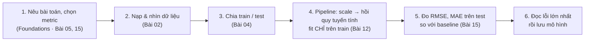

> **Mục tiêu bài học:** Sau bài này, bạn sẽ tự tay chạy trọn một quy trình machine learning trên dữ liệu thật - nêu bài toán và thước đo, nạp và nhìn dữ liệu, chia train/test, huấn luyện bằng `Pipeline`, đo RMSE/MAE và so với baseline, đọc các lỗi lớn nhất rồi lưu mô hình - và thấy từng bước đều là một bài của chương Foundations.

## 1. Mười lăm bài khái niệm, giờ đến lượt một mô hình chạy thật

Chương Foundations khép lại bằng một lời khuyên: kiến thức chỉ thành kỹ năng khi tay bạn gõ ra nó. Mười lăm bài vừa rồi toàn khái niệm. Bài này đổi vai: bạn làm một mô hình dự đoán giá nhà trên 20.640 dòng dữ liệu thật, trong khoảng 20 phút, với chưa đến 30 dòng code. Điều đáng chú ý không nằm ở mô hình mà ở chỗ **không có bước nào mới** - từng ô trong sơ đồ dưới đây là một bài Foundations bạn đã đọc.

Giá nhà là bài toán có người trả tiền để giải: khi bạn thế chấp nhà để vay, ngân hàng cần một con số định giá nhanh, nhất quán, ít phụ thuộc cảm tính. Năm 2022, hai giảng viên Học viện Ngân hàng thu thập hơn 10.000 tin rao bán nhà thổ cư Hà Nội (tháng 6-12/2021) để xây mô hình định giá tự động hỗ trợ thẩm định tài sản bảo đảm; phiên bản hồi quy tuyến tính đạt sai số phần trăm tuyệt đối trung bình khoảng 21,6% (Tạp chí Ngân hàng, 4/2022). Ở Mỹ, các bên cho vay dùng **mô hình định giá tự động (automated valuation model - AVM)** - thường là hồi quy trên thuộc tính căn nhà - cho hồ sơ vay thế chấp và tái tài trợ. Bài này làm phiên bản thu nhỏ của đúng việc đó.



## 2. Nêu bài toán và chọn thước đo trước khi gõ code

Ngân hàng hỏi: *"Cho 8 con số mô tả một khu dân cư, hãy đoán giá nhà ở đó."* Câu trả lời là một con số, vậy đây là **hồi quy (regression)** (Foundations · Bài 05) - cùng loại với bài thợ ống nước và bảng 6 căn nhà mini.

Thước đo lấy từ Foundations · Bài 15: **MAE** (lệch trung bình bao nhiêu tiền, dễ hiểu) và **RMSE** (phạt nặng cú trượt lớn - với ngân hàng, một lần định giá hụt 300.000 USD nguy hiểm hơn ba lần hụt 100.000). Cả hai cùng đơn vị với giá nhà. Còn thứ mà mô hình *tối ưu lúc học* là MSE (Foundations · Bài 10): loss và metric là hai vai khác nhau.

Một thứ nữa cần chốt trước khi huấn luyện: **baseline**. Bài 15 mở đầu bằng mô hình lười "ai cũng phán khỏe mạnh" đạt 99% accuracy. Bản hồi quy của nó là "căn nào cũng đoán giá trung bình", scikit-learn có sẵn: `DummyRegressor(strategy="mean")`. Mô hình của bạn chỉ có giá trị nếu thắng nó - và mức R² = 0 của Bài 15 chính là mức của mô hình lười này.

## 3. Nạp dữ liệu và nhìn nó bằng mắt

**California Housing** đi kèm scikit-learn: 20.640 dòng, mỗi dòng là một *nhóm dân cư* (block group - đơn vị địa lý nhỏ nhất mà Cục Điều tra Dân số Mỹ công bố số liệu mẫu, thường 600-3.000 người), lấy từ cuộc điều tra dân số Mỹ năm 1990. Nhãn là **giá nhà trung vị** của nhóm, đơn vị 100.000 USD. Tám feature, theo tài liệu scikit-learn:

| Cột | Nghĩa |
|---|---|
| `MedInc` | Thu nhập trung vị của các hộ trong nhóm (giá trị 0,5-15; xấp xỉ đơn vị 10.000 USD/năm) |
| `HouseAge` | Tuổi nhà trung vị (năm) |
| `AveRooms` | Số phòng trung bình mỗi hộ |
| `AveBedrms` | Số phòng ngủ trung bình mỗi hộ |
| `Population` | Dân số của nhóm |
| `AveOccup` | Số người trung bình mỗi hộ |
| `Latitude` | Vĩ độ |
| `Longitude` | Kinh độ |

Nạp và gọi `describe()` (Foundations · Bài 02):

```python
from sklearn.datasets import fetch_california_housing
housing = fetch_california_housing(as_frame=True)   # lần đầu tải vài trăm KB, sau đó dùng bản đã lưu
X, y = housing.data, housing.target                 # X: DataFrame 20.640 × 8, y: giá nhà trung vị (×100.000 USD)
print(X.describe().T[["mean", "min", "50%", "max"]].round(2))
print(y.describe().round(2))
```

| Cột | mean | min | trung vị | max |
|---|---|---|---|---|
| MedInc | 3,87 | 0,50 | 3,53 | 15,00 |
| HouseAge | 28,64 | 1,00 | 29,00 | 52,00 |
| AveRooms | 5,43 | 0,85 | 5,23 | **141,91** |
| AveBedrms | 1,10 | 0,33 | 1,05 | **34,07** |
| Population | 1.425,48 | 3,00 | 1.166,00 | 35.682,00 |
| AveOccup | 3,07 | 0,69 | 2,82 | **1.243,33** |
| Latitude | 35,63 | 32,54 | 34,26 | 41,95 |
| Longitude | −119,57 | −124,35 | −118,49 | −114,31 |

Giá nhà `y`: trung bình 2,07; trung vị 1,80; nhỏ nhất 0,15; lớn nhất 5,00.

Ba số in đậm là kiểu "điểm lạ" mà Foundations · Bài 12 dặn phải điều tra trước khi phán xử: một nhóm dân cư có trung bình 142 phòng mỗi hộ? Tài liệu scikit-learn giải thích sẵn: các cột này là trung bình *theo hộ*, nên nhóm ít hộ nhưng nhiều nhà trống (khu nghỉ dưỡng) cho giá trị lớn bất thường. Không phải lỗi nhập liệu, nhưng cũng chẳng giống một khu dân cư bình thường.

Hai biểu đồ đáng vẽ bằng `plt.hist` và `plt.scatter` (Bài 02), mô tả bằng lời:

- **Histogram của giá:** lệch phải - 8.273 nhóm trong khoảng 1-2, 4.873 trong khoảng 2-3, rồi thưa dần; nhưng sát mép phải có một cột dựng đứng: **965 dòng (4,7%) có giá đúng bằng 5,00001**. Giá bị **chặn trần** ở 500.000 USD (tương tự, 1.273 dòng có `HouseAge` đúng bằng 52). Nhớ chi tiết này khi đọc lỗi ở mục 6.
- **Scatter thu nhập - giá:** giá trung bình tăng gần như thẳng qua các nhóm thu nhập (MedInc 0-2: 1,12; 2-4: 1,68; 4-6: 2,45; 6-8: 3,45) rồi chững lại khi chạm trần (8-10: 4,43; 10-15: 4,82). Tương quan thu nhập - giá 0,69, cao hơn hẳn các cột còn lại (|r| ≤ 0,15).

> 🔧 **Thử ngay:** Từ bảng trên, nhóm dân cư "điển hình" ở California năm 1990 có thu nhập trung vị bao nhiêu USD/năm, giá nhà trung vị bao nhiêu, và giá nhà bằng mấy năm thu nhập?
>
> *Đáp số:* MedInc trung vị 3,53 → ≈ 35.300 USD/năm; giá trung vị 1,80 → ≈ 180.000 USD; tỷ lệ ≈ **5,1 năm thu nhập**. Có dữ liệu nhà đất Việt Nam thì thử tính lại con số này xem chênh nhau bao nhiêu.

## 4. Chia dữ liệu trước, rồi mới được đụng vào nó

Nhớ Bình ở Foundations · Bài 04: cất riêng 2 đề, tuyệt đối không mở cho đến kỳ thi thử. Ta cắt 20% dữ liệu (4.128 dòng) làm tập test và chỉ mở nó **một lần** ở bước đo. `random_state=42` để bạn chia y hệt tôi và tái hiện được các con số trong bài.

Tiền xử lý và mô hình được gói vào một `Pipeline`: `StandardScaler` học trung bình và độ lệch chuẩn **chỉ từ tập train** rồi áp sang test - nguyên tắc vàng của Foundations · Bài 12. Tài liệu scikit-learn nói thẳng: pipeline là cách tốt để tránh rò rỉ dữ liệu, vì nó bảo đảm đúng phép toán được gọi trên đúng phần dữ liệu; bạn không thể "tiện tay" `fit` lên test.

```python
import pandas as pd
from sklearn.model_selection import train_test_split
from sklearn.pipeline import Pipeline
from sklearn.preprocessing import StandardScaler
from sklearn.linear_model import LinearRegression
from sklearn.dummy import DummyRegressor
from sklearn.metrics import root_mean_squared_error, mean_absolute_error

# 1) Chia train/test TRƯỚC mọi bước học từ dữ liệu (Foundations · Bài 04, Bài 12)
X_train, X_test, y_train, y_test = train_test_split(X, y, test_size=0.2, random_state=42)

# 2) Pipeline: scaler học μ, σ chỉ từ train → hồi quy tuyến tính (8 hệ số + 1 số dư = 9 núm vặn)
model = Pipeline([("scale", StandardScaler()), ("lr", LinearRegression())])
model.fit(X_train, y_train)

# 3) Baseline "đoán trung bình", rồi đo cả hai trên test (Foundations · Bài 15)
baseline = DummyRegressor(strategy="mean").fit(X_train, y_train)
for model_name, m in [("Hồi quy tuyến tính", model), ("Đoán trung bình  ", baseline)]:
    p = m.predict(X_test)
    print(f"{model_name}: RMSE = {root_mean_squared_error(y_test, p):.3f} | MAE = {mean_absolute_error(y_test, p):.3f}")
```

```
Hồi quy tuyến tính: RMSE = 0.746 | MAE = 0.533
Đoán trung bình  : RMSE = 1.145 | MAE = 0.906
```

> ⚠️ **Lưu ý nhỏ:** với `LinearRegression` thuần, có scale hay không cho *cùng một* dự đoán (bỏ `StandardScaler` đi, RMSE vẫn 0,746). Vẫn nên scale vì ba lý do: thói quen an toàn cho các mô hình khác; Bài 02 cần hệ số đã scale để so sánh các feature với nhau; và với Ridge/Lasso ở Bài 04 thì bắt buộc.

## 5. Đọc kết quả: thắng "đoán trung bình" bao nhiêu?

Mô hình lười luôn đoán 2,072 - giá trung bình của tập train - và lệch trung bình 0,906 (≈ 90.600 USD). Hồi quy tuyến tính lệch trung bình 0,533 (≈ 53.300 USD): cắt được khoảng 41% MAE và 35% RMSE. Hơn hẳn đoán mò, nhưng còn xa mức đủ để thẩm định - lệch 53.000 USD trên giá trung vị 180.000 USD là gần 30%.

Hai chi tiết đáng đọc thêm:

- RMSE của baseline (1,145) gần như trùng độ lệch chuẩn của giá trên tập test (1,145). Đẳng thức chỉ đúng khi ta đoán bằng trung bình của *chính tập đang chấm*; ở đây `DummyRegressor` đoán trung bình của tập **train** (2,072) trong khi trung bình tập test là 2,055 - lệch 0,017 nên hai số vẫn khớp tới bốn chữ số. Sai đúng bằng độ phân tán của dữ liệu - RMSE của baseline cho biết "dữ liệu này khó đến đâu" trước khi có mô hình.
- RMSE (0,746) cao hơn MAE (0,533) khá nhiều; Bài 15 đã dặn: hai số càng xa nhau, lỗi càng dồn vào vài cú trượt to. Thật vậy, 58,8% dòng test lệch không quá 0,5, nhưng có dòng lệch gần 10 - mục 6 sẽ soi.

<details>
<summary><b>Đào sâu: R² của mô hình này</b></summary>

`model.score(X_test, y_test)` trả về R² = 0,576: mô hình giải thích được khoảng 58% biến động giá so với đoán trung bình (Foundations · Bài 15). Trên tập train, R² = 0,613 - cao hơn một chút, đúng như Bài 04 và Bài 14 đã cảnh báo về khoảng cách train/test. Bài 02 sẽ dùng R² để so các phiên bản hồi quy với nhau.

</details>

> 🔧 **Thử ngay:** Ngân hàng chấp nhận sai số dưới 100.000 USD (tức 1,0 đơn vị). Bao nhiêu phần trăm dòng test vượt ngưỡng đó?
>
> ```python
> absolute_errors = (model.predict(X_test) - y_test).abs()
> print((absolute_errors > 1).sum(), "/", len(absolute_errors), "→", round((absolute_errors > 1).mean() * 100, 1), "%")
> ```
>
> *Đáp số:* **477 / 4.128 ≈ 11,6%**. Cứ 9 khu dân cư thì có 1 khu bị mô hình định giá lệch trên 100.000 USD.

## 6. Nhìn vào lỗi lớn nhất trước khi tin con số

Bài 15 kết thúc bằng lời khuyên "đừng dừng ở con số - mở những mẫu bị đoán sai ra xem". Ba dòng test bị lệch nhiều nhất:

```python
error_details = X_test.copy()
error_details["gia_that"] = y_test
error_details["gia_doan"] = model.predict(X_test)
error_details["lech"] = (error_details["gia_doan"] - error_details["gia_that"]).abs()
print(error_details.sort_values("lech", ascending=False).head(3).round(2))
```

| Dòng | MedInc | HouseAge | AveRooms | AveBedrms | Population | AveOccup | Latitude | Longitude | Giá thật | Giá đoán | Lệch |
|---|---|---|---|---|---|---|---|---|---|---|---|
| 1979 | 4,62 | 34 | **132,53** | **34,07** | 36 | 2,40 | 38,80 | −120,08 | 1,62 | **11,50** | 9,88 |
| 6688 | 0,50 | 28 | 7,68 | 1,87 | 142 | 4,58 | 34,15 | −118,08 | **5,00** | 0,85 | 4,15 |
| 10574 | 1,97 | 6 | 4,80 | 1,16 | 125 | 2,84 | 33,72 | −117,70 | **5,00** | 1,12 | 3,88 |

Hai kiểu lỗi, hai bài học:

- **Dòng 1979** chính là "điểm lạ" của mục 3: dân số 36 người, khoảng 15 hộ, mà trung bình 132 phòng và 34 phòng ngủ mỗi hộ - gần như chắc chắn một khu nghỉ dưỡng nhiều nhà trống. Mô hình định giá nó **1,15 triệu USD** (giá thật 162.000 USD), vì đường thẳng chỉ biết "nhiều phòng ngủ hơn thì đắt hơn" và nhân thẳng lên. Cả bộ dữ liệu chỉ có 9 dòng AveRooms > 50, nhưng một dòng đã đủ kéo RMSE lên đáng kể.
- **Dòng 6688 và 10574** thu nhập thấp nhưng giá thật đúng 5,00 - mức trần; cả hai trong vùng đô thị Los Angeles. Mô hình không biết có trần, cũng không biết "gần biển, gần trung tâm" đáng giá bao nhiêu khi vĩ độ, kinh độ chỉ được nhân với một hệ số cố định. Cùng lý do, 15 dòng test được đoán giá... **âm**.

Đó là giới hạn của đường thẳng, không phải của dữ liệu - và là toàn bộ nội dung Bài 02.

> ⚠️ **Lưu ý nhỏ:** nếu bạn quyết định loại các dòng kiểu 1979 khỏi huấn luyện, hãy quyết định trên tập train và ghi lại lý do (Foundations · Bài 12). Tuyệt đối không nhìn tập test để chọn dòng cần bỏ - đó là một dạng lộ đề (Foundations · Bài 14).

## 7. Lưu mô hình để dùng lại

Mô hình chỉ có ích nếu người khác dùng được mà không phải train lại. `joblib` lưu **cả pipeline** - scaler lẫn hồi quy - vào một file:

```python
import joblib
joblib.dump(model, "gia_nha_v1.joblib")          # lưu cả pipeline: scaler + hồi quy
model2 = joblib.load("gia_nha_v1.joblib")        # nạp lại ở phiên làm việc khác
print(model2.predict(X_test.head(3)).round(2), y_test.head(3).values.round(2))
# → [0.72 1.76 2.71] [0.48 0.46 5.  ]
```

Hai dòng đầu lệch vài chục nghìn USD; dòng thứ ba lại là một nhóm dân cư có giá chạm trần, bị đoán hụt gần một nửa.

> 🔧 **Thử ngay:** Định giá một khu dân cư giả định ở San Francisco: thu nhập trung vị 50.000 USD (MedInc = 5), nhà 20 năm tuổi, 6 phòng và 1 phòng ngủ mỗi hộ, 1.000 dân, 3 người/hộ, vĩ độ 37,77, kinh độ −122,42.
>
> ```python
> new_house = pd.DataFrame([{"MedInc": 5.0, "HouseAge": 20, "AveRooms": 6.0, "AveBedrms": 1.0,
>                      "Population": 1000, "AveOccup": 3.0, "Latitude": 37.77, "Longitude": -122.42}])
> print(model2.predict(new_house).round(3))
> ```
>
> *Đáp số:* **≈ 2,684** (≈ 268.000 USD). Hạ MedInc xuống 3 → ≈ 1,787; giữ MedInc = 5 nhưng dời về Fresno trong đất liền (vĩ độ 36,75; kinh độ −119,77) → ≈ 1,963. Cùng một khu, đổi chỗ mất hơn 70.000 USD - vị trí là biến nặng ký, Bài 02 sẽ đọc rõ từng hệ số.

> ⚠️ **Lưu ý nhỏ:** tài liệu scikit-learn cảnh báo file joblib/pickle có thể chứa mã chạy được khi nạp - chỉ `load` file từ nguồn bạn tin. Mô hình lưu bằng phiên bản scikit-learn này (1.7.2) cũng chưa chắc nạp lại được bằng phiên bản khác; hãy ghi phiên bản thư viện, dữ liệu và code huấn luyện kèm theo file mô hình.

## Tóm tắt bài học

- Một project ML gồm sáu bước quen thuộc: nêu bài toán và metric → nạp và nhìn dữ liệu → chia train/test → pipeline tiền xử lý + mô hình (fit chỉ trên train) → đo trên test so với baseline → đọc lỗi rồi lưu mô hình. Không bước nào nằm ngoài chương Foundations.
- California Housing: 20.640 nhóm dân cư từ điều tra dân số Mỹ 1990, 8 feature số, nhãn là giá nhà trung vị (×100.000 USD), bị chặn trần ở 5,0 (965 dòng).
- `describe()` lộ ngay các điểm lạ (AveRooms tới 142); tài liệu của bộ dữ liệu giải thích được vì sao chúng có mặt, nhưng chính chúng gây ra lỗi lớn nhất của mô hình.
- Hồi quy tuyến tính đạt RMSE ≈ 0,746, MAE ≈ 0,533 trên test; baseline "đoán trung bình" đạt 1,145 và 0,906. Thắng baseline là điều kiện tối thiểu; RMSE của baseline xấp xỉ độ lệch chuẩn của giá.
- RMSE cách xa MAE báo hiệu vài cú trượt lớn; mở ba dòng lệch nhất ra thấy hai nguyên nhân: dữ liệu lạ và giới hạn của đường thẳng (đoán vượt trần, đoán giá âm).
- `Pipeline` giúp scaler chỉ học từ train - cách tài liệu scikit-learn khuyến nghị để tránh rò rỉ dữ liệu; `joblib` lưu cả pipeline, chỉ nạp file từ nguồn tin cậy và ghi kèm phiên bản.

## Câu hỏi tự kiểm tra

1. Vì sao phải chọn metric và baseline *trước* khi huấn luyện? Nếu không có baseline, con số RMSE = 0,746 tự nó có cho bạn biết mô hình "tốt" hay "tệ" không?
2. Bạn tính trung bình và độ lệch chuẩn của `MedInc` trên toàn bộ 20.640 dòng để scale, rồi mới gọi `train_test_split`. Sai ở đâu, và `Pipeline` giúp tránh lỗi này thế nào? (Foundations · Bài 12, 14)
3. Một đồng nghiệp báo cáo "mô hình đạt R² = 0,61" nhưng bạn phát hiện con số đó đo trên tập train. Điều đó có vấn đề gì? Con số nào trong bài mới là con số nên báo cáo?
4. Dòng 1979 có AveRooms = 132,5. Nêu ba cách xử lý khác nhau cho các dòng kiểu này (Foundations · Bài 12) và một điều kiện bắt buộc dù chọn cách nào.
5. Giả sử ngân hàng nói: "định giá *cao hơn* thực tế nguy hiểm hơn nhiều so với định giá thấp hơn." MAE và RMSE có phân biệt được hai chiều sai này không? Bạn sẽ tính thêm gì?
6. Mô hình được lưu bằng `joblib` và gửi cho một nhóm khác đang dùng scikit-learn phiên bản cũ hơn. Kể hai rủi ro và cách phòng.

## Đọc thêm

**Nguồn nền tảng của bài:**

| Nguồn | Đọc phần nào |
|---|---|
| **scikit-learn User Guide** | *Dataset loading utilities* - mô tả California Housing; *Common pitfalls* - mục Inconsistent preprocessing và Data leakage; *Model persistence* - joblib, skops, ONNX và cảnh báo bảo mật |
| **An Introduction to Statistical Learning (ISLP)** | Chương 3, Lab 3.6 (tr.116-127) - quy trình hồi quy trên dữ liệu Boston: nạp, fit, đọc hệ số, vẽ phần dư |
| **Chương Foundations** | Bài 02 (Pandas, Matplotlib), Bài 04 (train/test), Bài 12 (fit trên train), Bài 15 (MAE, RMSE, R², đọc lỗi) |

**Nguồn online bổ sung (miễn phí):**

- [fetch_california_housing - scikit-learn](https://scikit-learn.org/stable/modules/generated/sklearn.datasets.fetch_california_housing.html) - mô tả chính thức 8 feature, nhãn và nguồn gốc dữ liệu (Pace & Barry, 1997).
- [Common pitfalls and recommended practices - scikit-learn](https://scikit-learn.org/stable/common_pitfalls.html) - vì sao dùng `Pipeline` để tránh rò rỉ dữ liệu, kèm ví dụ số.
- [Model persistence - scikit-learn](https://scikit-learn.org/stable/model_persistence.html) - các cách lưu mô hình và cảnh báo về pickle/joblib.
- [Xây dựng mô hình định giá bất động sản tự động hỗ trợ thẩm định tài sản bảo đảm - Tạp chí Ngân hàng (2022)](https://tapchinganhang.gov.vn/xay-dung-mo-hinh-dinh-gia-bat-dong-san-tu-dong-ho-tro-qua-trinh-tham-dinh-gia-tri-tai-san-bao-dam-11003.html) - ví dụ Việt Nam: hồi quy tuyến tính, Lasso và KNN trên hơn 10.000 tin rao bán nhà Hà Nội.
- [What is an automated valuation model? - Figure](https://www.figure.com/blog/what-is-an-automated-valuation-model/) - AVM là gì, vì sao dựa trên hồi quy hedonic, được dùng ở khâu nào của cho vay thế chấp và giới hạn của nó (không nhìn thấy tình trạng thật của căn nhà).

> **Bài tiếp theo:** [Hồi quy tuyến tính: đường thẳng nói gì với bạn](../linear-regression-what-the-line-tells-you-vi/) - mô hình vừa train có 9 núm vặn - mở chúng ra đọc: mỗi hệ số nói gì, tin được đến đâu, và vì sao đường thẳng lại đoán ra giá nhà âm.
