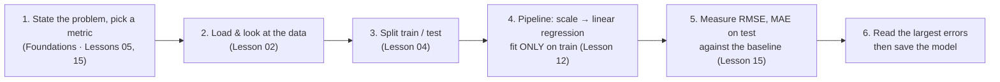

> **Learning objectives:** After this lesson, you will have run a complete machine learning workflow on real data with your own hands - state the problem and the metric, load and look at the data, split train/test, train with a `Pipeline`, measure RMSE/MAE and compare with a baseline, read the largest errors, then save the model - and you will see that every step is a lesson from the Foundations chapter.

## 1. Fifteen lessons of concepts, now it is time for a model that actually runs

The Foundations chapter closed with a piece of advice: knowledge only becomes a skill when your hands type it out. The last fifteen lessons were all concepts. This lesson switches roles: you build a house-price prediction model on 20,640 rows of real data, in about 20 minutes, with fewer than 30 lines of code. What deserves attention is not the model but the fact that **there is no new step** - every box in the diagram below is a Foundations lesson you have already read.

House prices are a problem people pay to have solved: when you mortgage a house to borrow money, the bank needs a valuation figure that is fast, consistent, and not too dependent on gut feeling. In 2022, two lecturers at Học viện Ngân hàng (the Banking Academy of Vietnam) collected more than 10,000 listings of residential houses in Hanoi (June-December 2021) to build an automated valuation model supporting collateral appraisal; the linear regression version reached a mean absolute percentage error of about 21.6% (Tạp chí Ngân hàng - the Banking Review, April 2022). In the US, lenders use **automated valuation models (AVMs)** - usually regression on the property's attributes - for mortgage and refinancing applications. This lesson builds a scaled-down version of exactly that job.



## 2. State the problem and choose the metric before typing any code

The bank asks: *"Given 8 numbers describing a neighborhood, guess the house price there."* The answer is a number, so this is **regression** (Foundations · Lesson 05) - the same kind as the plumber problem and the mini table of 6 houses.

The metrics come from Foundations · Lesson 15: **MAE** (how much money we are off on average, easy to understand) and **RMSE** (punishes big misses heavily - for a bank, one valuation that is off by 300,000 USD is more dangerous than three that are off by 100,000). Both share the unit of the house price. What the model *optimizes while learning*, on the other hand, is MSE (Foundations · Lesson 10): loss and metric play two different roles.

One more thing to settle before training: the **baseline**. Lesson 15 opened with the lazy model "declare everyone healthy" reaching 99% accuracy. Its regression counterpart is "guess the average price for every house", and scikit-learn ships it ready-made: `DummyRegressor(strategy="mean")`. Your model is only worth something if it beats it - and the R² = 0 level from Lesson 15 is precisely the level of this lazy model.

## 3. Load the data and look at it with your own eyes

**California Housing** comes bundled with scikit-learn: 20,640 rows, each row a *block group* (the smallest geographic unit for which the US Census Bureau publishes sample data, typically 600-3,000 people), taken from the 1990 US census. The label is the group's **median house value**, in units of 100,000 USD. Eight features, according to the scikit-learn documentation:

| Column | Meaning |
|---|---|
| `MedInc` | Median income of the households in the group (values 0.5-15; roughly in units of 10,000 USD/year) |
| `HouseAge` | Median house age (years) |
| `AveRooms` | Average number of rooms per household |
| `AveBedrms` | Average number of bedrooms per household |
| `Population` | Population of the group |
| `AveOccup` | Average number of people per household |
| `Latitude` | Latitude |
| `Longitude` | Longitude |

Load it and call `describe()` (Foundations · Lesson 02):

```python
from sklearn.datasets import fetch_california_housing
housing = fetch_california_housing(as_frame=True)   # downloads a few hundred KB the first time, then uses the cached copy
X, y = housing.data, housing.target                 # X: DataFrame 20,640 × 8, y: median house value (×100,000 USD)
print(X.describe().T[["mean", "min", "50%", "max"]].round(2))
print(y.describe().round(2))
```

| Column | mean | min | median | max |
|---|---|---|---|---|
| MedInc | 3.87 | 0.50 | 3.53 | 15.00 |
| HouseAge | 28.64 | 1.00 | 29.00 | 52.00 |
| AveRooms | 5.43 | 0.85 | 5.23 | **141.91** |
| AveBedrms | 1.10 | 0.33 | 1.05 | **34.07** |
| Population | 1,425.48 | 3.00 | 1,166.00 | 35,682.00 |
| AveOccup | 3.07 | 0.69 | 2.82 | **1,243.33** |
| Latitude | 35.63 | 32.54 | 34.26 | 41.95 |
| Longitude | −119.57 | −124.35 | −118.49 | −114.31 |

House value `y`: mean 2.07; median 1.80; minimum 0.15; maximum 5.00.

The three bold numbers are the kind of "oddity" that Foundations · Lesson 12 tells you to investigate before passing judgment: a block group averaging 142 rooms per household? The scikit-learn documentation explains it up front: these columns are averages *per household*, so a group with few households but many empty houses (a resort area) produces abnormally large values. Not a data-entry error, but not much like an ordinary neighborhood either.

Two charts worth drawing with `plt.hist` and `plt.scatter` (Lesson 02), described in words:

- **Histogram of prices:** right-skewed - 8,273 groups in the 1-2 range, 4,873 in the 2-3 range, then thinning out; but right at the right edge there is a vertical spike: **965 rows (4.7%) have a price of exactly 5.00001**. Prices are **capped** at 500,000 USD (similarly, 1,273 rows have `HouseAge` exactly equal to 52). Remember this detail when reading the errors in section 6.
- **Scatter of income vs price:** the average price rises almost linearly across income groups (MedInc 0-2: 1.12; 2-4: 1.68; 4-6: 2.45; 6-8: 3.45) then levels off as it hits the cap (8-10: 4.43; 10-15: 4.82). The income-price correlation is 0.69, far above the remaining columns (|r| ≤ 0.15).

> 🔧 **Try it now:** From the table above, what median income in USD/year does a "typical" California block group in 1990 have, what is its median house value, and how many years of income does the house cost?
>
> *Answer:* median MedInc 3.53 → ≈ 35,300 USD/year; median price 1.80 → ≈ 180,000 USD; ratio ≈ **5.1 years of income**. If you have Vietnamese real-estate data, try recomputing this number and see how far apart they are.

## 4. Split the data first, only then are you allowed to touch it

Remember Binh from Foundations · Lesson 04: they set 2 exam papers aside and absolutely did not open them until the mock exam. We cut off 20% of the data (4,128 rows) as the test set and open it **exactly once**, at the measuring step. `random_state=42` so that you split it identically to me and can reproduce the numbers in this lesson.

Preprocessing and the model are wrapped in a `Pipeline`: `StandardScaler` learns the mean and standard deviation **from the training set only** and then applies them to the test set - the golden rule of Foundations · Lesson 12. The scikit-learn documentation says it plainly: a pipeline is a good way to avoid data leakage, because it guarantees that the right operation is called on the right part of the data; you cannot "conveniently" `fit` on the test set.

```python
import pandas as pd
from sklearn.model_selection import train_test_split
from sklearn.pipeline import Pipeline
from sklearn.preprocessing import StandardScaler
from sklearn.linear_model import LinearRegression
from sklearn.dummy import DummyRegressor
from sklearn.metrics import root_mean_squared_error, mean_absolute_error

# 1) Split train/test BEFORE any step that learns from the data (Foundations · Lesson 04, Lesson 12)
X_train, X_test, y_train, y_test = train_test_split(X, y, test_size=0.2, random_state=42)

# 2) Pipeline: scaler learns μ, σ from train only → linear regression (8 coefficients + 1 intercept = 9 knobs)
model = Pipeline([("scale", StandardScaler()), ("lr", LinearRegression())])
model.fit(X_train, y_train)

# 3) "Guess the mean" baseline, then measure both on test (Foundations · Lesson 15)
baseline = DummyRegressor(strategy="mean").fit(X_train, y_train)
for model_name, m in [("Linear regression", model), ("Guess the mean   ", baseline)]:
    p = m.predict(X_test)
    print(f"{model_name}: RMSE = {root_mean_squared_error(y_test, p):.3f} | MAE = {mean_absolute_error(y_test, p):.3f}")
```

```
Linear regression: RMSE = 0.746 | MAE = 0.533
Guess the mean   : RMSE = 1.145 | MAE = 0.906
```

> ⚠️ **A small note:** with plain `LinearRegression`, scaling or not gives *the same* predictions (drop `StandardScaler` and the RMSE is still 0.746). It is still worth scaling, for three reasons: it is a safe habit for other models; Lesson 02 needs scaled coefficients to compare features with one another; and with Ridge/Lasso in Lesson 04 it is mandatory.

## 5. Reading the result: by how much do we beat "guess the mean"?

The lazy model always guesses 2.072 - the mean price of the training set - and is off by 0.906 on average (≈ 90,600 USD). Linear regression is off by 0.533 on average (≈ 53,300 USD): it cuts about 41% of the MAE and 35% of the RMSE. Far better than guessing blindly, but still far from good enough for appraisal - being off by 53,000 USD on a median price of 180,000 USD is nearly 30%.

Two details worth reading further:

- The baseline's RMSE (1.145) almost exactly matches the standard deviation of the price on the test set (1.145). The equality holds exactly only when we guess the mean of *the very set being scored*; here `DummyRegressor` guesses the mean of the **training** set (2.072) while the test set's mean is 2.055 - a difference of 0.017, so the two numbers still agree to four digits. The error is exactly the spread of the data - the baseline's RMSE tells you "how hard this data is" before any model exists.
- RMSE (0.746) is quite a bit higher than MAE (0.533); Lesson 15 warned: the further apart the two numbers, the more the error is concentrated in a few big misses. Indeed, 58.8% of test rows are off by no more than 0.5, but there are rows off by nearly 10 - section 6 will take a closer look.

<details>
<summary><b>Going deeper: this model's R²</b></summary>

`model.score(X_test, y_test)` returns R² = 0.576: the model explains about 58% of the variation in price relative to guessing the mean (Foundations · Lesson 15). On the training set, R² = 0.613 - slightly higher, exactly as Lessons 04 and 14 warned about the train/test gap. Lesson 02 will use R² to compare the regression variants with one another.

</details>

> 🔧 **Try it now:** The bank accepts an error below 100,000 USD (i.e. 1.0 units). What percentage of test rows exceed that threshold?
>
> ```python
> absolute_errors = (model.predict(X_test) - y_test).abs()
> print((absolute_errors > 1).sum(), "/", len(absolute_errors), "→", round((absolute_errors > 1).mean() * 100, 1), "%")
> ```
>
> *Answer:* **477 / 4,128 ≈ 11.6%**. One in every 9 neighborhoods is misvalued by the model by more than 100,000 USD.

## 6. Look at the largest errors before trusting the number

Lesson 15 ended with the advice "don't stop at the number - open the misclassified samples and look at them". The three test rows with the largest error:

```python
error_details = X_test.copy()
error_details["gia_that"] = y_test
error_details["gia_doan"] = model.predict(X_test)
error_details["lech"] = (error_details["gia_doan"] - error_details["gia_that"]).abs()
print(error_details.sort_values("lech", ascending=False).head(3).round(2))
```

| Row | MedInc | HouseAge | AveRooms | AveBedrms | Population | AveOccup | Latitude | Longitude | Actual price | Predicted price | Error |
|---|---|---|---|---|---|---|---|---|---|---|---|
| 1979 | 4.62 | 34 | **132.53** | **34.07** | 36 | 2.40 | 38.80 | −120.08 | 1.62 | **11.50** | 9.88 |
| 6688 | 0.50 | 28 | 7.68 | 1.87 | 142 | 4.58 | 34.15 | −118.08 | **5.00** | 0.85 | 4.15 |
| 10574 | 1.97 | 6 | 4.80 | 1.16 | 125 | 2.84 | 33.72 | −117.70 | **5.00** | 1.12 | 3.88 |

Two kinds of error, two lessons:

- **Row 1979** is precisely the "oddity" from section 3: a population of 36 people, about 15 households, yet an average of 132 rooms and 34 bedrooms per household - almost certainly a resort area with many empty houses. The model values it at **1.15 million USD** (actual price 162,000 USD), because the straight line only knows "more bedrooms means more expensive" and multiplies straight up. The whole dataset has only 9 rows with AveRooms > 50, but one row is enough to pull the RMSE up noticeably.
- **Rows 6688 and 10574** have low income but an actual price of exactly 5.00 - the cap; both are in the Los Angeles metropolitan area. The model does not know there is a cap, nor does it know how much "near the coast, near the center" is worth when latitude and longitude are merely multiplied by a fixed coefficient. For the same reason, 15 test rows are predicted to have a... **negative** price.

That is the limit of the straight line, not of the data - and it is the entire content of Lesson 02.

> ⚠️ **A small note:** if you decide to remove rows like 1979 from training, decide on the training set and write down the reason (Foundations · Lesson 12). Never look at the test set to choose which rows to drop - that is a form of leakage (Foundations · Lesson 14).

## 7. Save the model for reuse

A model is only useful if others can use it without retraining. `joblib` saves **the whole pipeline** - scaler and regression alike - into one file:

```python
import joblib
joblib.dump(model, "gia_nha_v1.joblib")          # save the whole pipeline: scaler + regression
model2 = joblib.load("gia_nha_v1.joblib")        # load it back in another session
print(model2.predict(X_test.head(3)).round(2), y_test.head(3).values.round(2))
# → [0.72 1.76 2.71] [0.48 0.46 5.  ]
```

The first two rows are off by a few tens of thousands of USD; the third is once again a block group whose price hits the cap, underestimated by nearly half.

> 🔧 **Try it now:** Value a hypothetical neighborhood in San Francisco: median income 50,000 USD (MedInc = 5), houses 20 years old, 6 rooms and 1 bedroom per household, 1,000 residents, 3 people per household, latitude 37.77, longitude −122.42.
>
> ```python
> new_house = pd.DataFrame([{"MedInc": 5.0, "HouseAge": 20, "AveRooms": 6.0, "AveBedrms": 1.0,
>                      "Population": 1000, "AveOccup": 3.0, "Latitude": 37.77, "Longitude": -122.42}])
> print(model2.predict(new_house).round(3))
> ```
>
> *Answer:* **≈ 2.684** (≈ 268,000 USD). Lower MedInc to 3 → ≈ 1.787; keep MedInc = 5 but move it inland to Fresno (latitude 36.75; longitude −119.77) → ≈ 1.963. The same neighborhood loses more than 70,000 USD by changing location - location is a heavyweight variable, and Lesson 02 will read each coefficient clearly.

> ⚠️ **A small note:** the scikit-learn documentation warns that joblib/pickle files can contain executable code that runs on loading - only `load` files from sources you trust. A model saved with this scikit-learn version (1.7.2) is also not guaranteed to load with another version; record the library version, the data and the training code alongside the model file.

## Lesson summary

- An ML project consists of six familiar steps: state the problem and the metric → load and look at the data → split train/test → preprocessing pipeline + model (fit on train only) → measure on test against a baseline → read the errors then save the model. None of the steps lies outside the Foundations chapter.
- California Housing: 20,640 block groups from the 1990 US census, 8 numeric features, the label is the median house value (×100,000 USD), capped at 5.0 (965 rows).
- `describe()` immediately exposes the oddities (AveRooms up to 142); the dataset's documentation explains why they are there, but they are exactly what causes the model's largest errors.
- Linear regression reaches RMSE ≈ 0.746, MAE ≈ 0.533 on test; the "guess the mean" baseline reaches 1.145 and 0.906. Beating the baseline is the minimum requirement; the baseline's RMSE approximately equals the standard deviation of the price.
- RMSE far from MAE signals a few big misses; opening the three rows with the largest error reveals two causes: odd data and the limits of the straight line (predicting above the cap, predicting negative prices).
- `Pipeline` makes the scaler learn from train only - the way the scikit-learn documentation recommends to avoid data leakage; `joblib` saves the whole pipeline, only load files from trusted sources and record the version alongside.

## Self-check questions

1. Why must you choose the metric and the baseline *before* training? Without a baseline, does the number RMSE = 0.746 by itself tell you whether the model is "good" or "bad"?
2. You compute the mean and standard deviation of `MedInc` over all 20,640 rows to scale, and only then call `train_test_split`. Where is the mistake, and how does `Pipeline` help avoid it? (Foundations · Lessons 12, 14)
3. A colleague reports "the model reaches R² = 0.61" but you discover that number was measured on the training set. What is the problem with that? Which number in this lesson is the one that should be reported?
4. Row 1979 has AveRooms = 132.5. Name three different ways to handle rows like this (Foundations · Lesson 12) and one condition that is mandatory whichever way you choose.
5. Suppose the bank says: "valuing *above* the actual price is far more dangerous than valuing below it." Can MAE and RMSE distinguish these two directions of error? What extra would you compute?
6. The model is saved with `joblib` and sent to another team that is using an older version of scikit-learn. Name two risks and how to guard against them.

## Further reading

**Foundational sources for this lesson:**

| Source | Which part to read |
|---|---|
| **scikit-learn User Guide** | *Dataset loading utilities* - description of California Housing; *Common pitfalls* - the Inconsistent preprocessing and Data leakage sections; *Model persistence* - joblib, skops, ONNX and the security warning |
| **An Introduction to Statistical Learning (ISLP)** | Chapter 3, Lab 3.6 (pp. 116-127) - the regression workflow on the Boston data: load, fit, read coefficients, plot residuals |
| **The Foundations chapter** | Lesson 02 (Pandas, Matplotlib), Lesson 04 (train/test), Lesson 12 (fit on train), Lesson 15 (MAE, RMSE, R², reading errors) |

**Additional online sources (free):**

- [fetch_california_housing - scikit-learn](https://scikit-learn.org/stable/modules/generated/sklearn.datasets.fetch_california_housing.html) - the official description of the 8 features, the label and the origin of the data (Pace & Barry, 1997).
- [Common pitfalls and recommended practices - scikit-learn](https://scikit-learn.org/stable/common_pitfalls.html) - why to use `Pipeline` to avoid data leakage, with a numeric example.
- [Model persistence - scikit-learn](https://scikit-learn.org/stable/model_persistence.html) - the ways to save a model and the warning about pickle/joblib.
- [Xây dựng mô hình định giá bất động sản tự động hỗ trợ thẩm định tài sản bảo đảm - Tạp chí Ngân hàng (2022)](https://tapchinganhang.gov.vn/xay-dung-mo-hinh-dinh-gia-bat-dong-san-tu-dong-ho-tro-qua-trinh-tham-dinh-gia-tri-tai-san-bao-dam-11003.html) - a Vietnamese example (Building an automated real-estate valuation model to support collateral appraisal, the Banking Review): linear regression, Lasso and KNN on more than 10,000 house listings in Hanoi.
- [What is an automated valuation model? - Figure](https://www.figure.com/blog/what-is-an-automated-valuation-model/) - what an AVM is, why it is based on hedonic regression, at which stage of mortgage lending it is used, and its limits (it cannot see the actual condition of the house).

> **Next lesson:** [Linear Regression: What the Line Tells You](../linear-regression-what-the-line-tells-you/) - the model you just trained has 9 knobs - open them up and read them: what each coefficient says, how far it can be trusted, and why a straight line ends up predicting negative house prices.
