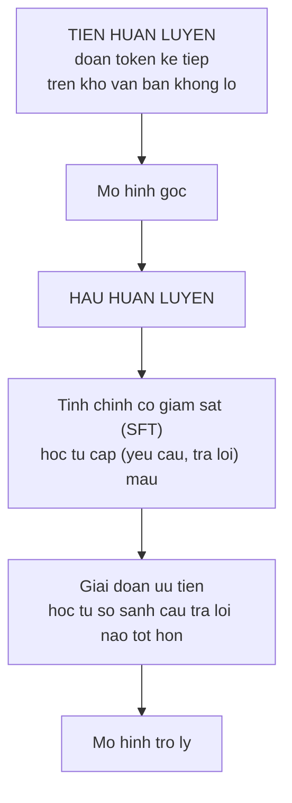

> **Mục tiêu bài học:** Sau bài này, bạn sẽ thấy tận mắt một mô hình ngôn ngữ **chưa qua post-training** hành xử ra sao, hiểu đúng thứ tự các giai đoạn huấn luyện và tên gọi của chúng, và biết vì sao không được quy toàn bộ khác biệt hành vi cho riêng một kỹ thuật.

## 1. Mô hình gốc không phải trợ lý

Bài 01 nói mô hình ngôn ngữ được huấn luyện để **đoán token kế tiếp**. Nếu đúng như vậy, thì khi ta gõ một câu hỏi, mô hình không "trả lời" - nó **đoán xem văn bản tiếp theo trông như thế nào**.

Đó là hai chuyện rất khác nhau, và bài này cho thấy chúng khác đến mức nào.

Qwen2.5-0.5B có hai phiên bản, **giống hệt nhau về kiến trúc và số tham số** - cùng 494.032.768:

- **Bản gốc (base)**: mới chỉ qua giai đoạn tiền huấn luyện
- **Bản instruct**: đã qua thêm các giai đoạn sau đó

Đưa cùng ba câu hỏi cho cả hai, cùng greedy để kết quả lặp lại được.

## 2. Mô hình gốc làm gì khi bạn hỏi nó

Câu hỏi: *"Giải thích ngắn gọn overfitting là gì."*

Bản gốc trả lời:

```
- Trang 1 - Trang 10 - Quan hệ giữa mô hình và dữ liệu
Giải thích ngắn gọn overfitting là gì.
Giải thích ngắn gọn overfitting là gì.
Giải thích ngắn g
```

Câu hỏi: *"Thủ đô của Việt Nam là gì?"*

```
- Tin tức - 24h.vn
Thủ đô của Việt Nam là gì?
Thủ đô của Việt Nam là gì? 24h.vn
Thủ đô của Việt Nam là gì? 24h.vn
```

Câu hỏi: *"Liệt kê 3 bước để huấn luyện một mô hình phân loại ảnh."*

```
- Trang 2
Trang 2 / 2
1
2
3
4
5
6
7
8
9
10
11
...
```

Đọc ba đầu ra này là hiểu được bản chất vấn đề.

Mô hình **không hề hỏng**. Nó đang làm chính xác thứ nó được huấn luyện: đoán văn bản tiếp theo. Và trong dữ liệu tiền huấn luyện - hàng nghìn tỉ token gom từ Internet - một chuỗi trông như tiêu đề trang web thì **thường được tiếp nối bằng thanh điều hướng, tên trang, số trang, và chính tiêu đề ấy lặp lại**.

`- Tin tức - 24h.vn` trông đúng như phần đuôi tiêu đề của một trang tin tiếng Việt; `- Trang 2 / 2` rồi đếm số trông đúng như phần phân trang. Đó là những mẫu cực kỳ phổ biến trên web tiếng Việt, nên chúng là **lời giải thích hợp lý** cho đầu ra này. Nói cho chặt thì ta không biết mô hình đã học từ tài liệu cụ thể nào, và đầu ra này **không phải bằng chứng** nó từng thấy đúng trang 24h.vn - ta chỉ thấy nó tái tạo một *hình dạng văn bản* rất phổ biến.

**Mô hình gốc không được dạy để mặc định coi mọi câu người dùng gõ vào là một yêu cầu cần thực hiện.** Với nó, câu hỏi chỉ là một chuỗi ký tự, và việc của nó là đoán chuỗi tiếp theo. Nó *có thể* trả lời câu hỏi - nếu bạn dựng ngữ cảnh sao cho chuỗi tiếp theo hợp lý nhất chính là câu trả lời, chẳng hạn cho trước vài cặp hỏi-đáp làm mẫu. Cái nó thiếu là **mặc định** ấy.

## 3. Cùng kiến trúc, cùng tham số, khác hẳn hành vi

Bản instruct, cùng ba câu hỏi:

| Câu hỏi | Trả lời của bản instruct |
|---|---|
| Overfitting là gì? | *"Overfitting là một thuật ngữ trong học máy… được sử dụng để mô tả tình trạng khi một mô hình được xây dựng quá nhiều lần hoặc quá…"* |
| 3 bước huấn luyện mô hình phân loại ảnh | *"Huấn luyện mô hình phân loại ảnh là một quá trình phức tạp… Dưới đây là 3 bước cơ bản:* **1. Tạo và cấu…"** |
| Thủ đô Việt Nam? | *"Thủ đô của Việt Nam là Hà Nội. Đây là thủ đô chính trị và văn hóa…"* |

Khác biệt là **về loại hành vi**, không phải về mức độ:

- Nó nhận ra đây là câu hỏi và **trả lời** thay vì tiếp nối
- Nó **tuân theo định dạng được yêu cầu** - hỏi ba bước thì nó đánh số
- Nó **dừng lại** khi trả lời xong thay vì lặp vô hạn

Và nhắc lại: **hai mô hình có cùng số tham số, cùng kiến trúc.** Toàn bộ khác biệt đến từ những gì xảy ra **sau** giai đoạn tiền huấn luyện. Đây là minh chứng trực tiếp cho điều bài 06 đã nói: số tham số không phải biến duy nhất.

Nhưng bản instruct cũng để lộ một chuyện khác, và nó đáng ghi lại nguyên văn. Câu trả lời đầy đủ về thủ đô Việt Nam là:

```
Thủ đô của Việt Nam là Hà Nội. Đây là thủ đô chính trị và văn hóa重镇之一，
位于中国南部的广西壮族自治区。 Hà Nội nổi tiếng với các địa danh lịch sử...
```

Nó bắt đầu đúng - Hà Nội - rồi **chuyển sang tiếng Trung giữa câu** và nói rằng nơi đó *"nằm ở khu tự trị dân tộc Choang Quảng Tây, miền nam Trung Quốc"*. Sai hoàn toàn, và trộn ngôn ngữ.

Đừng rút ra từ đây rằng post-training chỉ đổi cách nói. Tùy dữ liệu và mục tiêu, các giai đoạn sau tiền huấn luyện **có thể** cải thiện độ chính xác trên nhiệm vụ, khả năng suy luận, mức độ bám sự thật, và thậm chí bơm thêm kiến thức của một lĩnh vực hẹp - đó chính là lý do người ta tinh chỉnh mô hình cho từng ngành.

Cái nó **không bảo đảm** là tính đúng. Một mô hình nghe theo yêu cầu tốt hơn không vì thế mà trả lời đúng hơn ở mọi câu, và ví dụ trên là minh chứng: nó tuân thủ hoàn hảo về hình thức trong khi nội dung sai. Bài 09 dành trọn cho chuyện ấy.

## 4. Gọi tên các giai đoạn cho đúng

Cách kể phổ biến trên mạng là *"pretraining → fine-tuning → instruction tuning → RLHF"*, như bốn giai đoạn nối tiếp. Cách kể ấy sai ở chỗ **instruction tuning chính là một dạng fine-tuning có giám sát**, không phải giai đoạn riêng sau nó.

Bức tranh đúng hơn có hai phần lớn:



**Tiền huấn luyện.** Đoán token kế tiếp trên kho văn bản khổng lồ. Đây là nơi mô hình học ngôn ngữ, sự kiện, mã nguồn, và cách suy luận. Nó chiếm gần như toàn bộ chi phí tính toán.

**Tinh chỉnh có giám sát (SFT).** Huấn luyện tiếp trên các cặp *(yêu cầu, câu trả lời mẫu)* do người viết hoặc tuyển chọn. Đây chính là thứ hay được gọi là **instruction tuning** - cùng một việc, hai cái tên. Nó dạy mô hình *dạng* của một cuộc trao đổi: có yêu cầu thì có trả lời, trả lời xong thì dừng.

**Giai đoạn ưu tiên.** SFT dạy mô hình *một* câu trả lời chấp nhận được. Nhưng thường có nhiều cách trả lời và ta muốn cách *tốt hơn*. Giai đoạn này học từ **so sánh**: cho mô hình sinh vài phương án, người (hoặc một mô hình khác) xếp hạng chúng, rồi tối ưu để mô hình nghiêng về phương án được ưa hơn.

Có nhiều cách làm bước này, và đây là chỗ hay bị gộp nhầm thành một cái tên:

- **RLHF** - huấn luyện một mô hình thưởng từ dữ liệu xếp hạng, rồi dùng học tăng cường để tối ưu theo mô hình thưởng ấy
- **DPO** và họ hàng - tối ưu **thẳng** trên dữ liệu so sánh, bỏ hẳn bước dựng mô hình thưởng và vòng học tăng cường
- Các cách dùng **bộ kiểm chứng tự động** làm tín hiệu thưởng, hợp với những việc chấm được như toán và lập trình

Nên gọi cả nhóm này là **post-training** hoặc **alignment** thì đúng hơn là gọi tất cả là "RLHF".

> ⚠️ **Lưu ý nhỏ:** vì lý do trên, thí nghiệm ở mục 2 và 3 **không cho phép kết luận về riêng kỹ thuật nào**. Ta so bản gốc với bản instruct, tức so **có post-training** với **không có post-training** - và gói post-training của Qwen2.5 gồm nhiều bước mà ta không tách được từ bên ngoài. Phát biểu đúng là: *"gói post-training làm hành vi đổi như thế này"*, không phải *"RLHF tạo ra khác biệt này"*. Đây là cùng kỷ luật mà chương Computer Vision · Bài 10 đã áp khi so hai gói trọng số ResNet-50.

## 5. Hệ quả cho người dùng

Ba điều rút ra dùng được ngay.

**Chọn đúng phiên bản.** Nếu bạn định hỏi đáp hoặc làm trợ lý, phải dùng bản **instruct** hoặc **chat**. Bản base sẽ cho ra `- Tin tức - 24h.vn`. Nghe hiển nhiên, nhưng đây là lỗi rất hay gặp khi người ta tải mô hình từ kho về mà không để ý hậu tố.

**Mô hình gốc vẫn có chỗ dùng.** Với những việc *thật sự là tiếp nối văn bản* - tự động hoàn thành câu, sinh biến thể của một đoạn, tính xác suất của một chuỗi - bản base thường hợp hơn, vì nó không bị post-training đẩy về giọng trợ lý.

**Bản instruct cần đúng định dạng hội thoại.** Mỗi mô hình có một mẫu riêng để đánh dấu đâu là lượt người dùng, đâu là lượt trợ lý. Dùng sai mẫu thì chất lượng tụt mà không báo lỗi:

```python
text = tok.apply_chat_template(
    [{"role": "user", "content": question}],
    add_generation_prompt=True, tokenize=False)
```

Hàm `apply_chat_template` lấy mẫu đúng từ chính mô hình, nên đừng tự ghép chuỗi bằng tay. Đây cùng một nguyên tắc với `weights.transforms()` ở chương Computer Vision · Bài 01: **thứ đi kèm mô hình thì lấy từ mô hình.**

> 🔧 **Thử ngay:** bạn tải một mô hình về, hỏi nó một câu, và nó trả lời bằng cách lặp lại câu hỏi kèm vài dòng vô nghĩa. Kiểm gì?
> Hai thứ, theo thứ tự. **Một:** đây là bản gốc hay bản đã post-train. Hậu tố `-Instruct`, `-Chat`, `-it` là dấu hiệu nhanh chứ không phải luật - quy ước đặt tên không bắt buộc, nên chỗ đáng tin là **thẻ mô hình và tệp cấu hình**: có mẫu hội thoại không, mô tả nói nó được huấn luyện theo chỉ dẫn không. Nếu là bản gốc thì hành vi bạn thấy là hành vi đúng của nó, chỉ không phải thứ bạn cần. **Hai:** nếu đúng là bản instruct, kiểm xem bạn có áp mẫu hội thoại không. Đưa prompt thô vào một mô hình instruct thì nó vẫn chạy - chỉ kém hơn hẳn, vì toàn bộ giai đoạn SFT dạy nó hành xử *trong* khuôn mẫu ấy. Cả hai đều là lỗi âm thầm: không có exception nào, chỉ có chất lượng tệ.

## Tóm tắt bài học

- Mô hình gốc **không mặc định coi câu hỏi là yêu cầu cần thực hiện** - nó đoán văn bản tiếp theo. Hỏi nó thủ đô Việt Nam thì nó sinh `- Tin tức - 24h.vn` rồi lặp lại câu hỏi, đúng hình dạng một trang web.
- Đó **không phải hỏng**; đó là hành vi đúng của một mô hình chỉ qua tiền huấn luyện.
- Bản gốc và bản instruct của Qwen2.5-0.5B có **cùng 494.032.768 tham số, cùng kiến trúc**. Toàn bộ khác biệt đến từ post-training.
- Bản instruct nhận ra câu hỏi, tuân theo định dạng yêu cầu, và **biết dừng**.
- Nhưng **hành xử đúng dạng không bảo đảm nội dung đúng**: trả lời về thủ đô Việt Nam, nó chuyển sang tiếng Trung giữa câu và nói Hà Nội nằm ở Quảng Tây, Trung Quốc. (Post-training *có thể* cải thiện độ chính xác và cả kiến thức miền tùy dữ liệu; nó chỉ không **bảo đảm** điều đó.)
- Taxonomy đúng: **tiền huấn luyện → hậu huấn luyện**, trong đó hậu huấn luyện gồm **SFT** (chính là instruction tuning) rồi **giai đoạn ưu tiên**.
- Giai đoạn ưu tiên có nhiều cách: **RLHF** (mô hình thưởng + học tăng cường), **DPO** (tối ưu thẳng trên dữ liệu so sánh), hoặc dùng bộ kiểm chứng tự động. Gọi tất cả là "RLHF" là gộp nhầm.
- Thí nghiệm ở bài này chỉ kết luận được về **cả gói post-training**, không tách được riêng kỹ thuật nào.
- Dùng `apply_chat_template` thay vì tự ghép chuỗi: **thứ đi kèm mô hình thì lấy từ mô hình.**

## Câu hỏi tự kiểm tra

1. Vì sao mô hình gốc sinh ra `- Tin tức - 24h.vn` khi được hỏi thủ đô Việt Nam? Nó có đang hoạt động sai không? Đầu ra ấy có chứng minh được mô hình từng đọc trang 24h.vn không?
2. Hai bản base và instruct có cùng số tham số. Điều đó chứng minh gì về mối quan hệ giữa số tham số và năng lực?
3. Vì sao nói "instruction tuning là một dạng SFT" chứ không phải một giai đoạn riêng sau nó?
4. Nêu hai cách khác nhau để làm giai đoạn ưu tiên, và khác biệt cốt lõi giữa chúng.
5. Từ thí nghiệm base-vs-instruct, câu nào là kết luận hợp lệ và câu nào không: *"post-training đổi hành vi"* hay *"RLHF đổi hành vi"*? Giải thích.
6. Bản instruct trả lời đúng "Hà Nội" rồi nói nó nằm ở Trung Quốc. Điều đó nói gì về thứ post-training **bảo đảm** và **không bảo đảm**?
7. Nêu một việc mà dùng bản base hợp lý hơn bản instruct.
8. Vì sao đưa prompt thô vào mô hình instruct lại là lỗi âm thầm? Liên hệ với chương Computer Vision · Bài 01.

## Đọc thêm

**Nguồn nền tảng của bài:**

| Nguồn | Đọc phần nào |
|---|---|
| **Bài 01 của chương này** | Mô hình ngôn ngữ được huấn luyện để làm gì |
| **Bài 06 của chương này** | Số tham số không phải biến duy nhất quyết định năng lực |
| **Chương Computer Vision · Bài 10** | So hai gói trọng số cùng kiến trúc - cùng kỷ luật về phạm vi kết luận |
| **Chương Computer Vision · Bài 01** | Phép tiền xử lý thuộc về mô hình và phải lấy từ mô hình |

**Nguồn online bổ sung (miễn phí):**

- [Ouyang và cộng sự - Training language models to follow instructions with human feedback (InstructGPT, 2022)](https://arxiv.org/abs/2203.02155) - bài mô tả đầy đủ chuỗi SFT rồi RLHF; hình 2 là sơ đồ kinh điển.
- [Rafailov và cộng sự - Direct Preference Optimization (NeurIPS 2023)](https://arxiv.org/abs/2305.18290) - DPO, cách bỏ hẳn mô hình thưởng và vòng học tăng cường.
- [Wei và cộng sự - Finetuned Language Models Are Zero-Shot Learners (FLAN, ICLR 2022)](https://arxiv.org/abs/2109.01652) - instruction tuning và vì sao nó cải thiện khả năng làm việc chưa từng thấy.
- [TRL - thư viện huấn luyện post-training của Hugging Face](https://huggingface.co/docs/trl) - cài đặt thực tế của SFT, DPO và các biến thể.
- [Chat templates - tài liệu Hugging Face](https://huggingface.co/docs/transformers/chat_templating) - vì sao mỗi mô hình có mẫu hội thoại riêng và dùng sai thì hỏng thế nào.

> **Bài tiếp theo:** [Prompt: cái gì thật sự đổi kết quả](../prompts-what-actually-changes-the-result-vi/) - bài này cho thấy post-training dạy mô hình *nghe theo yêu cầu*. Bài sau hỏi câu kế tiếp: vậy **viết yêu cầu thế nào** thì khác biệt tới đâu - đo trên một việc có đáp án chấm được, thay vì cảm giác "prompt này nghe hay hơn".
