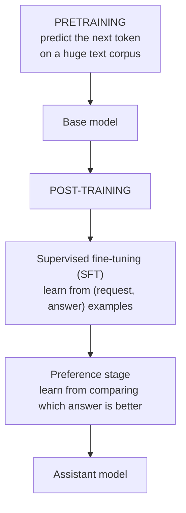

> **Learning objectives:** After this lesson, you will have seen with your own eyes how a language model **that has not been through post-training** behaves, understand the correct order of the training stages and their names, and know why you must not credit the whole difference in behavior to a single technique.

## 1. A base model is not an assistant

Lesson 01 said a language model is trained to **predict the next token**. If that is true, then when we type a question, the model does not "answer" - it **predicts what the following text looks like**.

Those are two very different things, and this lesson shows just how different.

Qwen2.5-0.5B comes in two versions, **identical in architecture and parameter count** - both 494,032,768:

- **The base version**: has only been through the pretraining stage
- **The instruct version**: has been through additional stages after that

Give both the same three questions, with greedy decoding in both so the results are repeatable.

## 2. What a base model does when you ask it something

Question: *"Giải thích ngắn gọn overfitting là gì."* ("Briefly explain what overfitting is.")

The base version answers (the first line reads "- Page 1 - Page 10 - The relationship between model and data", followed by the question repeated):

```
- Trang 1 - Trang 10 - Quan hệ giữa mô hình và dữ liệu
Giải thích ngắn gọn overfitting là gì.
Giải thích ngắn gọn overfitting là gì.
Giải thích ngắn g
```

Question: *"Thủ đô của Việt Nam là gì?"* ("What is the capital of Vietnam?")

```
- Tin tức - 24h.vn
Thủ đô của Việt Nam là gì?
Thủ đô của Việt Nam là gì? 24h.vn
Thủ đô của Việt Nam là gì? 24h.vn
```

Question: *"Liệt kê 3 bước để huấn luyện một mô hình phân loại ảnh."* ("List 3 steps to train an image classification model.")

```
- Trang 2
Trang 2 / 2
1
2
3
4
5
6
7
8
9
10
11
...
```

Reading these three outputs is enough to understand the heart of the problem.

The model is **not broken at all**. It is doing exactly what it was trained to do: predict the following text. And in the pretraining data - trillions of tokens gathered from the Internet - a string that looks like a web page title **is often followed by a navigation bar, a site name, a page number, and the title itself repeated**.

`- Tin tức - 24h.vn` ("- News - 24h.vn") looks exactly like the tail of a title on a Vietnamese news site; `- Trang 2 / 2` ("- Page 2 / 2") followed by counting looks exactly like pagination. These are extremely common patterns on the Vietnamese web, so they are a **plausible explanation** for this output. Strictly speaking, we do not know which specific documents the model learned from, and this output is **not evidence** that it ever saw that exact 24h.vn page - we only see it reproducing a very common *shape of text*.

**A base model has not been taught to treat every sentence a user types as a request to carry out by default.** To it, a question is just a string of characters, and its job is to predict the next string. It *can* answer questions - if you set up the context so that the most plausible continuation is the answer, for example by giving a few question-answer pairs as examples first. What it lacks is that **default**.

## 3. Same architecture, same parameters, completely different behavior

The instruct version, on the same three questions:

| Question | Answer from the instruct version |
|---|---|
| What is overfitting? | *"Overfitting là một thuật ngữ trong học máy… được sử dụng để mô tả tình trạng khi một mô hình được xây dựng quá nhiều lần hoặc quá…"* |
| 3 steps to train an image classification model | *"Huấn luyện mô hình phân loại ảnh là một quá trình phức tạp… Dưới đây là 3 bước cơ bản:* **1. Tạo và cấu…"** |
| Capital of Vietnam? | *"Thủ đô của Việt Nam là Hà Nội. Đây là thủ đô chính trị và văn hóa…"* |

The difference is **in the kind of behavior**, not in degree (the answers read "Overfitting is a term in machine learning...", "Training an image classification model is a complex process... Here are 3 basic steps: 1. ...", "The capital of Vietnam is Hà Nội. It is the political and cultural capital..."):

- It recognizes that this is a question and **answers** instead of continuing
- It **follows the requested format** - asked for three steps, it numbers them
- It **stops** when it has finished answering instead of repeating forever

And to repeat: **the two models have the same parameter count and the same architecture.** The entire difference comes from what happened **after** the pretraining stage. This is direct evidence for what Lesson 06 said: parameter count is not the only variable.

But the instruct version also reveals something else, and it is worth recording verbatim. The full answer about the capital of Vietnam is:

```
Thủ đô của Việt Nam là Hà Nội. Đây là thủ đô chính trị và văn hóa重镇之一，
位于中国南部的广西壮族自治区。 Hà Nội nổi tiếng với các địa danh lịch sử...
```

It starts correctly - Hà Nội - then **switches to Chinese mid-sentence** and says the place is *"located in the Guangxi Zhuang Autonomous Region in southern China"*. Completely wrong, and mixing languages.

Do not conclude from this that post-training only changes how the model talks. Depending on the data and the objective, the stages after pretraining **can** improve task accuracy, reasoning ability, factual grounding, and even inject knowledge of a narrow domain - which is exactly why people fine-tune models for specific industries.

What it **does not guarantee** is correctness. A model that follows requests better is not thereby more correct on every question, and the example above proves it: it complies perfectly in form while the content is wrong. Lesson 09 is devoted entirely to that problem.

## 4. Naming the stages correctly

The common story online is *"pretraining → fine-tuning → instruction tuning → RLHF"*, as four consecutive stages. That story is wrong in that **instruction tuning is itself a form of supervised fine-tuning**, not a separate stage after it.

A more accurate picture has two big parts:



**Pretraining.** Predicting the next token on a huge text corpus. This is where the model learns language, facts, source code, and how to reason. It accounts for nearly all of the compute cost.

**Supervised fine-tuning (SFT).** Continued training on *(request, example answer)* pairs written or curated by people. This is exactly what is often called **instruction tuning** - the same thing, two names. It teaches the model the *shape* of an exchange: a request gets an answer, and once the answer is done, it stops.

**The preference stage.** SFT teaches the model *one* acceptable answer. But there are often many ways to answer, and we want the *better* one. This stage learns from **comparisons**: have the model generate several options, a person (or another model) ranks them, then optimize so the model leans toward the preferred option.

There are several ways to do this step, and this is where they are often wrongly lumped under one name:

- **RLHF** - train a reward model from ranking data, then use reinforcement learning to optimize against that reward model
- **DPO** and its relatives - optimize **directly** on the comparison data, skipping the reward model and the reinforcement learning loop entirely
- Methods that use **automatic verifiers** as the reward signal, suited to gradable tasks such as math and programming

So it is more accurate to call this whole group **post-training** or **alignment** than to call all of it "RLHF".

> ⚠️ **A small note:** for the reason above, the experiment in sections 2 and 3 **does not allow conclusions about any single technique**. We are comparing the base version with the instruct version, that is, comparing **with post-training** against **without post-training** - and Qwen2.5's post-training package includes many steps that we cannot separate from the outside. The correct statement is: *"the post-training package changes behavior like this"*, not *"RLHF created this difference"*. This is the same discipline that Computer Vision · Lesson 10 applied when comparing two ResNet-50 weight packages.

## 5. Consequences for users

Three takeaways you can use right away.

**Choose the right version.** If you plan to do question answering or build an assistant, you must use the **instruct** or **chat** version. The base version will give you `- Tin tức - 24h.vn`. It sounds obvious, but this is a very common mistake when people download a model from a hub without noticing the suffix.

**Base models still have their uses.** For tasks that *really are text continuation* - sentence autocompletion, generating variations of a passage, computing the probability of a string - the base version is often a better fit, because post-training has not pushed it toward an assistant voice.

**The instruct version needs the right conversation format.** Each model has its own template for marking which turn is the user's and which is the assistant's. Use the wrong template and quality drops without any error:

```python
text = tok.apply_chat_template(
    [{"role": "user", "content": question}],
    add_generation_prompt=True, tokenize=False)
```

The `apply_chat_template` function takes the correct template from the model itself, so do not assemble the string by hand. This is the same principle as `weights.transforms()` in Computer Vision · Lesson 01: **what comes with the model, take from the model.**

> 🔧 **Try it now:** you download a model, ask it a question, and it responds by repeating the question along with a few meaningless lines. What do you check?
> Two things, in order. **One:** is this the base version or a post-trained version? The suffixes `-Instruct`, `-Chat`, `-it` are a quick hint, not a rule - naming conventions are not enforced, so the reliable place to look is **the model card and the configuration files**: is there a chat template, does the description say it was instruction-trained. If it is a base version, the behavior you see is its correct behavior, just not what you need. **Two:** if it really is an instruct version, check whether you applied the chat template. Feed a raw prompt into an instruct model and it still runs - just much worse, because the whole SFT stage taught it to behave *within* that template. Both are silent bugs: no exception, just poor quality.

## Lesson summary

- A base model **does not treat a question as a request to carry out by default** - it predicts the following text. Ask it for the capital of Vietnam and it produces `- Tin tức - 24h.vn` and then repeats the question, exactly the shape of a web page.
- That is **not broken**; it is the correct behavior of a model that has only been through pretraining.
- The base and instruct versions of Qwen2.5-0.5B have **the same 494,032,768 parameters and the same architecture**. The entire difference comes from post-training.
- The instruct version recognizes the question, follows the requested format, and **knows when to stop**.
- But **behaving in the right form does not guarantee the right content**: answering about the capital of Vietnam, it switches to Chinese mid-sentence and says Hà Nội is in Guangxi, China. (Post-training *can* improve accuracy and even domain knowledge depending on the data; it just does not **guarantee** it.)
- The correct taxonomy: **pretraining → post-training**, where post-training consists of **SFT** (which is instruction tuning) followed by **the preference stage**.
- The preference stage can be done in several ways: **RLHF** (reward model + reinforcement learning), **DPO** (direct optimization on comparison data), or automatic verifiers. Calling all of them "RLHF" lumps them together wrongly.
- The experiment in this lesson can only draw conclusions about **the whole post-training package**, not any single technique.
- Use `apply_chat_template` instead of assembling the string yourself: **what comes with the model, take from the model.**

## Self-check questions

1. Why does the base model produce `- Tin tức - 24h.vn` when asked for the capital of Vietnam? Is it malfunctioning? Does that output prove the model once read the 24h.vn page?
2. The base and instruct versions have the same parameter count. What does that prove about the relationship between parameter count and capability?
3. Why do we say "instruction tuning is a form of SFT" rather than a separate stage after it?
4. Name two different ways to carry out the preference stage, and the core difference between them.
5. From the base-vs-instruct experiment, which is a valid conclusion and which is not: *"post-training changes behavior"* or *"RLHF changes behavior"*? Explain.
6. The instruct version correctly answers "Hà Nội" and then says it is in China. What does that say about what post-training **guarantees** and **does not guarantee**?
7. Name one task where using the base version makes more sense than the instruct version.
8. Why is feeding a raw prompt into an instruct model a silent bug? Relate this to Computer Vision · Lesson 01.

## Further reading

**Foundational sources for this lesson:**

| Source | Which part to read |
|---|---|
| **Lesson 01 of this chapter** | What a language model is trained to do |
| **Lesson 06 of this chapter** | Parameter count is not the only variable that decides capability |
| **Computer Vision · Lesson 10** | Comparing two weight packages with the same architecture - the same discipline about the scope of conclusions |
| **Computer Vision · Lesson 01** | Preprocessing belongs to the model and must be taken from the model |

**Additional online sources (free):**

- [Ouyang et al. - Training language models to follow instructions with human feedback (InstructGPT, 2022)](https://arxiv.org/abs/2203.02155) - the paper that fully describes the SFT-then-RLHF pipeline; Figure 2 is the classic diagram.
- [Rafailov et al. - Direct Preference Optimization (NeurIPS 2023)](https://arxiv.org/abs/2305.18290) - DPO, the approach that drops the reward model and the reinforcement learning loop entirely.
- [Wei et al. - Finetuned Language Models Are Zero-Shot Learners (FLAN, ICLR 2022)](https://arxiv.org/abs/2109.01652) - instruction tuning and why it improves performance on unseen tasks.
- [TRL - Hugging Face's post-training library](https://huggingface.co/docs/trl) - practical implementations of SFT, DPO and their variants.
- [Chat templates - Hugging Face documentation](https://huggingface.co/docs/transformers/chat_templating) - why each model has its own chat template and what breaks when you use the wrong one.

> **Next lesson:** [Prompts: What Actually Changes the Result](../prompts-what-actually-changes-the-result/) - this lesson showed that post-training teaches a model to *follow requests*. The next lesson asks the follow-up question: how much difference does **how you write the request** make - measured on a task with gradable answers, instead of the feeling that "this prompt sounds better".
