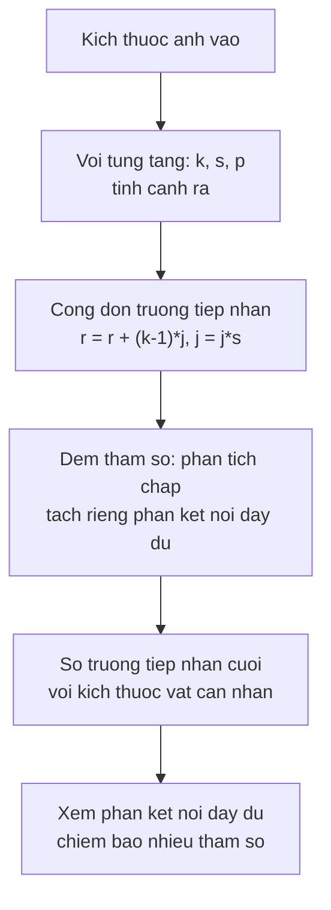

> **Mục tiêu bài học:** Sau bài này, bạn sẽ tính được kích thước đầu ra, số tham số và **trường tiếp nhận** của một chồng tầng tích chập, hiểu **stride** làm gì với cả ba con số ấy, và đọc được ba kiến trúc kinh điển như ba câu trả lời cho cùng một bài toán - kèm số liệu cho câu hỏi vì sao các bộ lọc nhỏ xếp sâu lại trở thành lựa chọn phổ biến.

## 1. Hai khái niệm còn thiếu

Chương Deep Learning · Bài 09 đã dựng phép tích chập: bộ lọc trượt qua ảnh, dùng chung trọng số ở mọi vị trí, pooling thu nhỏ bản đồ đặc trưng. Bài này không dạy lại chuyện đó.

Nhưng có hai khái niệm mà bài ấy chưa dựng, và không có chúng thì không đọc nổi một kiến trúc thật:

- **Stride** - bộ lọc nhảy mấy pixel mỗi bước. Bài 09 nhắc đúng một lần rồi đi tiếp.
- **Trường tiếp nhận (receptive field)** - một ô trong bản đồ đặc trưng "nhìn thấy" bao nhiêu pixel của ảnh gốc. Bài 09 hoàn toàn không có.

Hai thứ này quyết định kiến trúc nhìn được gì và tốn bao nhiêu, nên mục 2 dựng chúng bằng số trước khi mục 4 đọc kiến trúc.

## 2. Ba con số của một tầng tích chập

Với ảnh vào cạnh $H$, bộ lọc cạnh $k$, stride $s$, padding $p$, cạnh đầu ra là:

$$H_{\text{ra}} = \left\lfloor \frac{H + 2p - k}{s} \right\rfloor + 1$$

Đặt một tầng 16 bộ lọc lên ảnh 32×32×3 rồi đổi từng tham số một:

| $k$ | $s$ | $p$ | Cạnh ra | Tham số | MMAC | Trường tiếp nhận |
|---|---|---|---|---|---|---|
| 3 | 1 | 1 | 32 | 448 | 0,44 | 3 |
| 3 | 1 | 0 | 30 | 448 | 0,39 | 3 |
| **3** | **2** | **1** | **16** | **448** | **0,11** | **3** |
| 5 | 1 | 2 | 32 | 1.216 | 1,23 | 5 |
| 5 | 2 | 2 | 16 | 1.216 | 0,31 | 5 |
| 7 | 1 | 3 | 32 | 2.368 | 2,41 | 7 |
| 7 | 2 | 3 | 16 | 2.368 | 0,60 | 7 |

Cột chi phí tính bằng **MAC** - mỗi phép nhân-cộng tính là một đơn vị, cách đếm quen thuộc nhất trong các bài báo về mạng tích chập. Có nơi đếm phép nhân và phép cộng riêng và gọi là FLOP, khi ấy con số gấp đôi. Đọc bảng nào cũng nên xem họ dùng quy ước nào trước.

Ba quy luật rơi ra từ bảng, và chúng không giống nhau:

**Kích thước bộ lọc quyết định số tham số; stride thì không.** Ba dòng đầu cùng 448 tham số dù stride khác nhau - vì tham số nằm ở *bộ lọc*, mà bộ lọc thì dùng chung cho mọi vị trí. Đổi từ 3×3 sang 7×7 mới làm tham số tăng hơn năm lần. (Số kênh cũng vậy: bảng này cố định 16 bộ lọc, nhưng tăng số kênh thì tham số tăng theo.)

**Stride là núm điều khiển chi phí tính toán mà không đụng tới tham số.** Dòng thứ ba rẻ hơn dòng đầu **bốn lần** (0,11 so với 0,44 MMAC) mà vẫn giữ nguyên số tham số, đơn giản vì bản đồ đặc trưng ra nhỏ đi bốn lần nên có ít vị trí phải tính hơn. Kernel to hơn cũng làm chi phí tăng - so dòng đầu với dòng 7×7 stride 1 thì thấy 0,44 lên 2,41 MMAC - nhưng nó kéo theo cả số tham số, còn stride thì không. Đây là lý do stride 2 xuất hiện dày đặc trong các kiến trúc thật: nó là cách thu nhỏ mà không phải trả thêm tham số.

**Padding quyết định có mất rìa hay không.** `p = (k-1)/2` giữ nguyên kích thước; `p = 0` làm ảnh teo dần mỗi tầng. Với mạng sâu, teo dần là vấn đề thật: sau hai chục tầng thì chẳng còn gì.

## 3. Trường tiếp nhận: một ô nhìn thấy bao nhiêu

Đây là khái niệm quan trọng nhất của bài. Một ô ở bản đồ đặc trưng cuối cùng được tính từ vài ô ở tầng trước, mỗi ô ấy lại tính từ vài ô ở tầng trước nữa. Truy ngược về ảnh gốc, ô ấy phụ thuộc vào một vùng vuông - **trường tiếp nhận** của nó.

Công thức truy ngược qua từng tầng, với $j$ là bước nhảy tích lũy (khởi đầu $r = 1$, $j = 1$):

$$r \leftarrow r + (k - 1)\,j, \qquad j \leftarrow j \times s$$

```
ảnh gốc     ■ ■ ■ ■ ■ ■ ■        7 pixel
              ╲ │ ╱   ╲ │ ╱
tầng 1        ■   ■   ■   ■      mỗi ô nhìn 3 pixel
                ╲ │ ╱
tầng 2            ■   ■          mỗi ô nhìn 5 pixel
                    ╲│
tầng 3                ■          ô này nhìn 7 pixel
```

Ba tầng 3×3 stride 1 cho trường tiếp nhận **7** - đúng bằng một tầng 7×7. Đây là quan sát mở ra cả mục sau.

Stride làm trường tiếp nhận lớn nhanh hơn nhiều, vì nó nhân vào $j$. VGG-16 có 13 tầng tích chập 3×3 xen 5 tầng pooling stride 2; trường tiếp nhận ở tầng cuối là **212 pixel** - gần bằng cả tấm ảnh 224×224. Nói cách khác, một ô ở bản đồ đặc trưng cuối của VGG-16 nhìn gần như toàn bộ ảnh, dù mọi bộ lọc trong mạng đều chỉ 3×3.

> ⚠️ **Lưu ý nhỏ:** trường tiếp nhận tính theo công thức trên là **giới hạn lý thuyết** - vùng ảnh mà một ô *có thể* phụ thuộc vào. Ảnh hưởng thực tế phân bố không đều trong vùng ấy: các pixel ở giữa đóng góp nhiều hơn hẳn các pixel ở rìa, và phần rìa nhiều khi gần như không ảnh hưởng gì. Nên hãy đọc con số 212 là "trần trên", đừng đọc là "mạng thật sự dùng đều cả 212 pixel".

## 4. Một tầng 7×7 hay ba tầng 3×3?

Hai lựa chọn cho cùng trường tiếp nhận 7. Đặt cạnh nhau, cùng số kênh vào và ra là $C$, cùng bản đồ đặc trưng 28×28:

| $C$ | Tham số 7×7 | Tham số 3 × (3×3) | Tỉ lệ | MMAC 7×7 | MMAC 3 × (3×3) | Số phi tuyến |
|---|---|---|---|---|---|---|
| 16 | 12.560 | 6.960 | 0,55 | 9,8 | 5,4 | 1 so với **3** |
| 64 | 200.768 | 110.784 | 0,55 | 157,4 | 86,7 | 1 so với **3** |
| 256 | 3.211.520 | 1.770.240 | 0,55 | 2.517,6 | 1.387,3 | 1 so với **3** |

Chồng ba tầng 3×3 dùng khoảng **55% số tham số** và **55% số phép tính** của một tầng 7×7, mà vẫn nhìn được vùng rộng như nhau - và tỉ lệ ấy giữ nguyên ở cả ba mức số kênh. Cộng thêm: giữa ba tầng có hai hàm kích hoạt nữa, nên hàm mà mạng biểu diễn được **không còn là một phép tuyến tính duy nhất** như ở tầng 7×7 đơn lẻ. Đây chính là lập luận trong bài báo VGG.

Nhưng "ít tham số hơn và nhiều phi tuyến hơn" là *lập luận*, không phải kết quả. Nên đo thử.

Hai mạng nhỏ trên Imagenette 64×64, chỉ khác nhau ở chỗ này, mọi thứ còn lại giữ nguyên - cùng số kênh về sau, cùng Adam lr = 1e-3, cùng 5 epoch, cùng phép tăng cường dữ liệu. Một lần chạy minh họa:

| Mạng | Tham số toàn mạng | Accuracy |
|---|---|---|
| Tầng đầu là **một** tầng 7×7 | 24.074 | 0,4265 |
| Tầng đầu là **ba** tầng 3×3 | 38.858 | **0,5992** |

Bản ba tầng 3×3 hơn 17,3 điểm. Nhưng đọc kỹ cột tham số thì thấy phép so này **không công bằng**: nó cũng dùng nhiều hơn 61% tham số. Kết quả ấy không tách được ảnh hưởng của "xếp nhiều tầng nhỏ" khỏi ảnh hưởng của "có nhiều tham số hơn".

Và chỗ không công bằng ấy lại chỉ ra một giới hạn của chính bảng bên trên. Tỉ lệ 0,55 chỉ đúng khi **số kênh vào bằng số kênh ra**. Ở tầng đầu tiên của mạng, đầu vào chỉ có **3 kênh màu**, và tình huống đảo ngược hoàn toàn:

| Thay một tầng 7×7 bằng ba tầng 3×3 | Tham số 7×7 | Tham số 3 × (3×3) | Tỉ lệ |
|---|---|---|---|
| Ở **tầng đầu** (3 kênh vào → 32) | 4.800 | 19.584 | **4,08 lần** |
| Ở **giữa mạng** (32 → 32) | 50.208 | 27.744 | 0,55 lần |
| Ở **giữa mạng** (256 → 256) | 3.211.520 | 1.770.240 | 0,55 lần |

Ở tầng đầu, ba tầng 3×3 **đắt gấp bốn lần** chứ không rẻ hơn. Lý do đơn giản: tầng 7×7 chỉ phải nhân 3 kênh vào với 32 kênh ra một lần, còn ba tầng 3×3 phải trả thêm hai lần nhân 32 với 32.

Kiểm bằng kiến trúc thật thì thấy người ta biết điều này: **tầng tích chập đầu tiên của cả ResNet-18 lẫn ResNet-50 là 7×7 stride 2** - một kernel to đúng ở chỗ chỉ có 3 kênh vào. Nguyên tắc "kernel nhỏ xếp sâu" áp cho phần thân mạng, không áp cho cửa vào.

Còn phần thân thì hai mạng đi hai đường khác nhau, và đếm kernel cho thấy ngay:

| Mạng | Kernel 7×7 | Kernel 3×3 | Kernel 1×1 |
|---|---|---|---|
| ResNet-18 | 1 | **16** | 3 |
| ResNet-50 | 1 | 16 | **36** |

ResNet-18 dùng **khối cơ bản** gồm hai tầng 3×3 nối tiếp, nên phần thân đúng là "toàn 3×3". ResNet-50 dùng **khối nút cổ chai**: 1×1 để bóp số kênh xuống, rồi 3×3 làm phần việc không gian trên số kênh ít, rồi 1×1 để nở lại. Vì thế nó có nhiều tầng 1×1 hơn 3×3. Ý tưởng vẫn là tiết kiệm - chỉ khác chỗ tiết kiệm nằm ở *số kênh* thay vì ở *kích thước kernel*.

Vậy nên câu trả lời trung thực cho tiêu đề mục này là: **không có bên nào thắng tuyệt đối.** Kernel nhỏ xếp sâu rẻ hơn và nhiều phi tuyến hơn *khi số kênh vào và ra tương đương*, đó là phần lớn chiều dài một mạng. Ở cửa vào, nơi chỉ có 3 kênh màu, một kernel to lại là lựa chọn rẻ hơn.

## 5. Ba kiến trúc, ba câu trả lời

| Kiến trúc | Năm | Tầng tích chập | Tổng tham số | Ở phần tích chập | Ở phần kết nối đầy đủ |
|---|---|---|---|---|---|
| LeNet-5 | 1998 | 2 | 61.706 | 2.572 | 59.134 (**95,8%**) |
| AlexNet | 2012 | 5 | 61.100.840 | 2.469.696 | 58.631.144 (**96,0%**) |
| VGG-16 | 2014 | 13 | 138.357.544 | 14.714.688 | 123.642.856 (**89,4%**) |

Bảng này có một chi tiết làm hầu hết người mới ngạc nhiên: **phần lớn tham số của cả ba kiến trúc không nằm ở các tầng tích chập.** VGG-16 nổi tiếng vì 13 tầng tích chập, nhưng 13 tầng ấy chỉ chiếm 14,7 triệu trong tổng 138 triệu tham số. Gần 124 triệu còn lại nằm ở ba tầng kết nối đầy đủ ở cuối - mà tầng đầu tiên trong ba tầng ấy một mình đã có $7 \times 7 \times 512 \times 4096 \approx 103$ triệu.

Đó cũng là lý do các kiến trúc sau này (bài 03) thay hẳn khối kết nối đầy đủ bằng một phép lấy trung bình toàn cục: bỏ được hơn 100 triệu tham số mà chất lượng không giảm.

Đọc theo mạch thời gian thì ba kiến trúc là ba nước đi:

**LeNet-5** đặt ra khuôn mẫu vẫn dùng đến hôm nay - tích chập, phi tuyến, gộp, lặp lại, rồi phân loại ở cuối. Nó chạy trên ảnh 32×32 chữ số viết tay, với 61 nghìn tham số.

**AlexNet** giữ nguyên khuôn ấy nhưng phóng to và đổi ba thứ có thật: ReLU thay cho tanh (chương Deep Learning · Bài 02 đã đo mức chênh), dropout ở phần kết nối đầy đủ (Bài 07), và tăng cường dữ liệu. Tầng đầu của nó dùng bộ lọc **11×11 stride 4** - trường tiếp nhận 11 ngay ở tầng một, một cách thu nhỏ ảnh rất thô so với chuẩn ngày nay.

**VGG-16** đưa ra một nguyên tắc thay vì một tập hợp lựa chọn: **chỉ dùng 3×3 stride 1, chỉ dùng maxpool 2×2, và cứ thế xếp sâu.** Sự đều đặn ấy là lý do nó vẫn được dùng làm xương sống trong nhiều hệ thống, dù nặng.

> 🔧 **Thử ngay:** AlexNet dùng 11×11 stride 4 ở tầng đầu, VGG-16 dùng 3×3 stride 1. Nếu chỉ nhìn số tham số của riêng tầng đầu, cái nào nhiều hơn - và điều đó có mâu thuẫn với mục 4 không?
> Tầng đầu AlexNet: $3 \times 96 \times 11 \times 11 + 96 = 34.944$ tham số. Tầng đầu VGG-16: $3 \times 64 \times 3 \times 3 + 64 = 1.792$. AlexNet nhiều hơn gần **20 lần** ở riêng tầng ấy, đúng như mục 4 dự đoán - bộ lọc to thì tham số nhiều. Không mâu thuẫn gì; nó chỉ cho thấy VGG trả giá theo cách khác: cần nhiều tầng hơn để đạt cùng trường tiếp nhận, nên mạng sâu hơn và chậm hơn, đổi lại mỗi tầng rẻ và có thêm phi tuyến.

## 6. Đọc một kiến trúc như thế nào

Gộp cả bài thành một thứ tự đọc, dùng được cho bất kỳ mạng tích chập nào bạn gặp:



Hai câu hỏi cuối là hai thứ đáng hỏi nhất khi nhìn một kiến trúc lạ. Nếu trường tiếp nhận cuối nhỏ hơn nhiều so với vật thể cần nhận thì mạng đang nhìn qua lỗ khóa. Nếu phần kết nối đầy đủ chiếm 90% tham số thì đó là chỗ cắt gọn được nhiều nhất.

## Tóm tắt bài học

- **Kích thước kernel và số kênh** quyết định số tham số. **Stride** quyết định kích thước bản đồ đặc trưng ra, nên nó là núm điều khiển chi phí tính toán mà không đụng tới tham số - còn kernel và số kênh thì ảnh hưởng tới *cả hai*. **Padding** quyết định cách xử lý biên. Ba chuyện khác nhau, hay bị gộp làm một.
- Stride 2 làm một tầng 3×3 rẻ đi bốn lần (0,44 → 0,11 MMAC) mà không đổi một tham số nào.
- **Trường tiếp nhận** là vùng ảnh gốc mà một ô đặc trưng phụ thuộc vào, cộng dồn theo $r \leftarrow r + (k-1)j$, $j \leftarrow js$. VGG-16 đạt 212 pixel ở tầng cuối dù mọi bộ lọc chỉ 3×3 - nhưng đó là trần trên, không phải vùng mạng dùng đều.
- Ba tầng 3×3 cho cùng trường tiếp nhận 7 như một tầng 7×7, với ~55% tham số, ~55% phép tính và **3 phi tuyến thay vì 1** - nhưng tỉ lệ 0,55 chỉ đúng khi số kênh vào bằng số kênh ra.
- Ở **tầng đầu tiên**, nơi đầu vào chỉ có 3 kênh màu, ba tầng 3×3 lại **đắt gấp 4,08 lần** một tầng 7×7. Vì thế ResNet-18 và ResNet-50 đều mở đầu bằng một tầng 7×7 stride 2.
- Phần thân hai mạng khác nhau: ResNet-18 dùng khối cơ bản hai tầng 3×3, còn ResNet-50 dùng **khối nút cổ chai 1×1 → 3×3 → 1×1** nên có tới 36 tầng 1×1 so với 16 tầng 3×3. Tiết kiệm ở đây nằm ở số kênh chứ không ở kích thước kernel.
- Ở cả LeNet-5, AlexNet và VGG-16, **phần lớn tham số nằm ở các tầng kết nối đầy đủ chứ không phải tầng tích chập** - VGG-16 có 138 triệu tham số nhưng phần tích chập chỉ 14,7 triệu.
- Ba kiến trúc là ba nước đi: LeNet đặt khuôn, AlexNet phóng to và đổi ReLU/dropout/augmentation, VGG thay các lựa chọn rời rạc bằng một nguyên tắc đều đặn.

## Câu hỏi tự kiểm tra

1. Một tầng tích chập 64 bộ lọc 5×5 nhận đầu vào 3 kênh. Có bao nhiêu tham số? Con số ấy đổi thế nào nếu bạn tăng stride từ 1 lên 2?
2. Ảnh vào 224×224, tầng tích chập $k=7$, $s=2$, $p=3$. Cạnh đầu ra là bao nhiêu?
3. Xếp 4 tầng 3×3 stride 1 liên tiếp. Trường tiếp nhận cuối là bao nhiêu? Nếu tầng thứ hai đổi sang stride 2 thì sao?
4. Vì sao stride 2 làm giảm chi phí tính toán mà không giảm số tham số?
5. VGG-16 có 138 triệu tham số nhưng phần tích chập chỉ 14,7 triệu. Chỗ còn lại nằm ở đâu, và vì sao các kiến trúc sau này bỏ được phần đó?
6. Ba tầng 3×3 rẻ hơn một tầng 7×7 về cả tham số lẫn phép tính. Nêu điều kiện để câu đó đúng, và một trường hợp nó sai.
7. Bạn gặp một kiến trúc lạ có trường tiếp nhận cuối chỉ 45 pixel, dùng để phát hiện vật thể chiếm khoảng 200 pixel trong ảnh. Vấn đề gì có thể xảy ra?
8. Thí nghiệm ở mục 4 cho mạng ba tầng 3×3 hơn 17,3 điểm. Vì sao con số ấy chưa chứng minh được điều mục 4 muốn chứng minh, và bạn sửa thí nghiệm thế nào?

## Đọc thêm

**Nguồn nền tảng của bài:**

| Nguồn | Đọc phần nào |
|---|---|
| **Chương Deep Learning · Bài 09** | Tích chập, bộ lọc, bản đồ đặc trưng, pooling - nền mà bài này xây tiếp |
| **Dive into Deep Learning (d2l.ai)** | Chương 7.3 *Padding and Stride* và 7.4 *Multiple Input and Output Channels*; chương 8.1-8.2 *LeNet, AlexNet, VGG* |
| **An Introduction to Statistical Learning (ISLP)** | Chương 10.3 - mạng tích chập ở mức trực giác, đọc trước nếu phần công thức khó vào |

**Nguồn online bổ sung (miễn phí):**

- [A guide to convolution arithmetic for deep learning](https://arxiv.org/abs/1603.07285) - tài liệu chuẩn về quan hệ giữa kernel, stride, padding và kích thước đầu ra, kèm hình động.
- [Computing Receptive Fields of Convolutional Neural Networks (Distill)](https://distill.pub/2019/computing-receptive-fields/) - bài giải thích trường tiếp nhận kỹ nhất, có cả phần ảnh hưởng không đều mà mục 3 nhắc tới.
- [Simonyan & Zisserman - Very Deep Convolutional Networks (VGG, 2014)](https://arxiv.org/abs/1409.1556) - mục 2.3 là chính lập luận "ba tầng 3×3 thay một tầng 7×7" mà mục 4 đo lại.
- [Krizhevsky, Sutskever, Hinton - AlexNet (NeurIPS 2012)](https://papers.nips.cc/paper_files/paper/2012/hash/c399862d3b9d6b76c8436e924a68c45b-Abstract.html) - bài báo gốc, đọc mục 3 về ReLU và mục 4 về dropout.
- [LeCun và cộng sự - Gradient-Based Learning Applied to Document Recognition (1998)](http://yann.lecun.com/exdb/publis/pdf/lecun-98.pdf) - bài báo LeNet-5, hình 2 là sơ đồ kiến trúc gốc.

> **Bài tiếp theo:** [ResNet và kết nối tắt](../resnet-and-skip-connections-vi/) - bài này dừng ở VGG-16 với 13 tầng tích chập. Bài sau hỏi chuyện gì xảy ra khi xếp tới 20, 34, 50 tầng - và trả một món nợ của chương Deep Learning · Bài 08, nơi ta mới chỉ nói kết nối tắt giúp gradient đi qua mà chưa đo trên mạng tích chập bao giờ.
