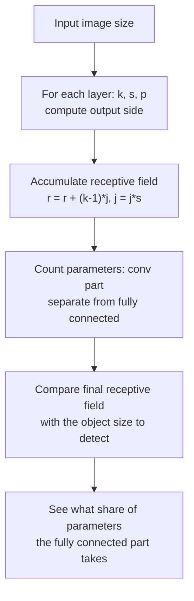

> **Learning objectives:** After this lesson, you will be able to compute the output size, parameter count and **receptive field** of a stack of convolutional layers, understand what **stride** does to all three of those numbers, and read three classic architectures as three answers to the same problem - with measurements for the question of why small filters stacked deep became the popular choice.

## 1. Two missing concepts

Deep Learning · Lesson 09 built the convolution operation: a filter slides across the image, shares its weights at every position, and pooling shrinks the feature map. This lesson does not teach that again.

But there are two concepts that lesson did not build, and without them you cannot read a real architecture:

- **Stride** - how many pixels the filter jumps at each step. Lesson 09 mentioned it exactly once and moved on.
- **Receptive field** - how many pixels of the original image a cell in a feature map "sees". Lesson 09 did not cover it at all.

These two decide what an architecture can see and how much it costs, so section 2 builds them with numbers before section 4 reads the architectures.

## 2. The three numbers of a convolutional layer

For an input of side $H$, a filter of side $k$, stride $s$ and padding $p$, the output side is:

$$H_{\text{out}} = \left\lfloor \frac{H + 2p - k}{s} \right\rfloor + 1$$

Put a layer of 16 filters on a 32×32×3 image and change one parameter at a time:

| $k$ | $s$ | $p$ | Output side | Parameters | MMAC | Receptive field |
|---|---|---|---|---|---|---|
| 3 | 1 | 1 | 32 | 448 | 0.44 | 3 |
| 3 | 1 | 0 | 30 | 448 | 0.39 | 3 |
| **3** | **2** | **1** | **16** | **448** | **0.11** | **3** |
| 5 | 1 | 2 | 32 | 1,216 | 1.23 | 5 |
| 5 | 2 | 2 | 16 | 1,216 | 0.31 | 5 |
| 7 | 1 | 3 | 32 | 2,368 | 2.41 | 7 |
| 7 | 2 | 3 | 16 | 2,368 | 0.60 | 7 |

The cost column is measured in **MAC** - each multiply-add counts as one unit, the most familiar way of counting in papers on convolutional networks (MMAC is millions of MAC). Some sources count multiplications and additions separately and call the result FLOPs, in which case the number doubles. Whatever table you read, check which convention it uses first.

Three rules fall out of the table, and they are not the same:

**Filter size decides the parameter count; stride does not.** The first three rows all have 448 parameters despite different strides - because the parameters live in the *filter*, and the filter is shared across every position. Only going from 3×3 to 7×7 makes the parameters grow more than fivefold. (The number of channels matters too: this table fixes 16 filters, but increasing the channels increases the parameters accordingly.)

**Stride is the knob that controls compute cost without touching the parameters.** The third row is **four times** cheaper than the first (0.11 versus 0.44 MMAC) while keeping exactly the same parameter count, simply because the output feature map is four times smaller so there are fewer positions to compute. A larger kernel also raises the cost - compare the first row with the 7×7 stride 1 row and you see 0.44 rise to 2.41 MMAC - but it drags the parameter count along with it, while stride does not. This is why stride 2 appears so often in real architectures: it is a way to downsample without paying for extra parameters.

**Padding decides whether the border is lost.** `p = (k-1)/2` keeps the size unchanged; `p = 0` makes the image shrink with every layer. For deep networks, shrinking is a real problem: after twenty layers there is nothing left.

## 3. Receptive field: how much a cell sees

This is the most important concept in the lesson. A cell in the final feature map is computed from a few cells in the previous layer, each of which is in turn computed from a few cells in the layer before that. Traced back to the original image, the cell depends on a square region - its **receptive field**.

The formula for tracing back through each layer, with $j$ the cumulative jump (starting from $r = 1$, $j = 1$):

$$r \leftarrow r + (k - 1)\,j, \qquad j \leftarrow j \times s$$

```
input image ■ ■ ■ ■ ■ ■ ■        7 pixels
              ╲ │ ╱   ╲ │ ╱
layer 1       ■   ■   ■   ■      each cell sees 3 pixels
                ╲ │ ╱
layer 2           ■   ■          each cell sees 5 pixels
                    ╲│
layer 3               ■          this cell sees 7 pixels
```

Three 3×3 layers with stride 1 give a receptive field of **7** - exactly the same as one 7×7 layer. This is the observation that opens up the whole next section.

Stride makes the receptive field grow much faster, because it multiplies into $j$. VGG-16 has 13 convolutional layers of 3×3 interleaved with 5 pooling layers of stride 2; the receptive field at the last layer is **212 pixels** - nearly the whole 224×224 image. In other words, a cell in VGG-16's final feature map sees almost the entire image, even though every filter in the network is only 3×3.

> ⚠️ **A small note:** the receptive field computed with the formula above is a **theoretical limit** - the region of the image that a cell *can* depend on. The actual influence is not evenly distributed within that region: pixels in the middle contribute far more than pixels at the edge, and the edge often has almost no influence at all. So read the number 212 as an "upper bound", not as "the network really uses all 212 pixels evenly".

## 4. One 7×7 layer or three 3×3 layers?

Two options for the same receptive field of 7. Side by side, with the same number of input and output channels $C$ and the same 28×28 feature map:

| $C$ | 7×7 parameters | 3 × (3×3) parameters | Ratio | 7×7 MMAC | 3 × (3×3) MMAC | Nonlinearities |
|---|---|---|---|---|---|---|
| 16 | 12,560 | 6,960 | 0.55 | 9.8 | 5.4 | 1 versus **3** |
| 64 | 200,768 | 110,784 | 0.55 | 157.4 | 86.7 | 1 versus **3** |
| 256 | 3,211,520 | 1,770,240 | 0.55 | 2,517.6 | 1,387.3 | 1 versus **3** |

A stack of three 3×3 layers uses about **55% of the parameters** and **55% of the computation** of one 7×7 layer, while still seeing an equally wide region - and that ratio holds at all three channel counts. On top of that: there are two more activation functions between the three layers, so the function the network can represent **is no longer a single linear operation** as with a lone 7×7 layer. This is exactly the argument in the VGG paper.

But "fewer parameters and more nonlinearity" is an *argument*, not a result. So let us measure it.

Two small networks on 64×64 Imagenette, differing only at this point, with everything else held fixed - the same channel counts afterwards, the same Adam lr = 1e-3, the same 5 epochs, the same data augmentation. One illustrative run:

| Network | Total network parameters | Accuracy |
|---|---|---|
| First layer is **one** 7×7 layer | 24,074 | 0.4265 |
| First layer is **three** 3×3 layers | 38,858 | **0.5992** |

The three-3×3 version wins by 17.3 points. But read the parameter column carefully and you see this comparison is **not fair**: it also uses 61% more parameters. The result cannot separate the effect of "stacking many small layers" from the effect of "having more parameters".

And that unfairness points to a limitation of the table above itself. The 0.55 ratio only holds when **the number of input channels equals the number of output channels**. At the first layer of the network, the input has only **3 color channels**, and the situation reverses completely:

| Replacing one 7×7 layer with three 3×3 layers | 7×7 parameters | 3 × (3×3) parameters | Ratio |
|---|---|---|---|
| At the **first layer** (3 input channels → 32) | 4,800 | 19,584 | **4.08×** |
| In the **middle of the network** (32 → 32) | 50,208 | 27,744 | 0.55× |
| In the **middle of the network** (256 → 256) | 3,211,520 | 1,770,240 | 0.55× |

At the first layer, three 3×3 layers are **four times more expensive**, not cheaper. The reason is simple: the 7×7 layer only has to multiply 3 input channels by 32 output channels once, while the three 3×3 layers must pay for two extra multiplications of 32 by 32.

Checking real architectures shows that people know this: **the first convolutional layer of both ResNet-18 and ResNet-50 is 7×7 stride 2** - a large kernel exactly where there are only 3 input channels. The "small kernels stacked deep" principle applies to the body of the network, not to its entrance.

As for the body, the two networks take two different paths, and counting kernels shows it right away:

| Network | 7×7 kernels | 3×3 kernels | 1×1 kernels |
|---|---|---|---|
| ResNet-18 | 1 | **16** | 3 |
| ResNet-50 | 1 | 16 | **36** |

ResNet-18 uses a **basic block** of two consecutive 3×3 layers, so its body really is "all 3×3". ResNet-50 uses a **bottleneck block**: a 1×1 to squeeze the channel count down, then a 3×3 to do the spatial work on fewer channels, then a 1×1 to expand back. That is why it has more 1×1 layers than 3×3 layers. The idea is still saving - only the saving lies in the *channel count* rather than in the *kernel size*.

So the honest answer to this section's title is: **neither side wins outright.** Small kernels stacked deep are cheaper and more nonlinear *when the input and output channel counts are comparable*, which is most of the length of a network. At the entrance, where there are only 3 color channels, a large kernel is the cheaper choice.

## 5. Three architectures, three answers

| Architecture | Year | Conv layers | Total parameters | In the convolutional part | In the fully connected part |
|---|---|---|---|---|---|
| LeNet-5 | 1998 | 2 | 61,706 | 2,572 | 59,134 (**95.8%**) |
| AlexNet | 2012 | 5 | 61,100,840 | 2,469,696 | 58,631,144 (**96.0%**) |
| VGG-16 | 2014 | 13 | 138,357,544 | 14,714,688 | 123,642,856 (**89.4%**) |

This table has a detail that surprises most beginners: **most of the parameters in all three architectures are not in the convolutional layers.** VGG-16 is famous for its 13 convolutional layers, yet those 13 layers account for only 14.7 million of its 138 million parameters. The remaining nearly 124 million sit in the three fully connected layers at the end - and the first of those three alone has $7 \times 7 \times 512 \times 4096 \approx 103$ million.

That is also why later architectures (lesson 03) replace the fully connected block entirely with a global average: it removes more than 100 million parameters without losing quality.

Read in chronological order, the three architectures are three moves:

**LeNet-5** set the template still used today - convolution, nonlinearity, pooling, repeat, then classify at the end. It ran on 32×32 images of handwritten digits, with 61 thousand parameters.

**AlexNet** kept that template but scaled it up and changed three real things: ReLU instead of tanh (Deep Learning · Lesson 02 measured the difference), dropout in the fully connected part (Lesson 07), and data augmentation. Its first layer uses **11×11 stride 4** filters - a receptive field of 11 right at layer one, a very coarse way to downsample the image by today's standards.

**VGG-16** put forward a principle instead of a collection of choices: **use only 3×3 stride 1, use only 2×2 maxpool, and just stack deep.** That regularity is why it is still used as a backbone in many systems, despite being heavy.

> 🔧 **Try it now:** AlexNet uses 11×11 stride 4 in its first layer, VGG-16 uses 3×3 stride 1. Looking only at the parameter count of the first layer, which has more - and does that contradict section 4?
> AlexNet's first layer: $3 \times 96 \times 11 \times 11 + 96 = 34{,}944$ parameters. VGG-16's first layer: $3 \times 64 \times 3 \times 3 + 64 = 1{,}792$. AlexNet has nearly **20 times** more in that layer alone, just as section 4 predicts - large filters mean many parameters. There is no contradiction; it only shows that VGG pays in a different way: it needs more layers to reach the same receptive field, so the network is deeper and slower, in exchange for each layer being cheap and adding nonlinearity.

## 6. How to read an architecture

Condensing the whole lesson into a reading order, usable for any convolutional network you come across:



The last two questions are the two most worth asking when you look at an unfamiliar architecture. If the final receptive field is much smaller than the objects to be recognized, the network is looking through a keyhole. If the fully connected part takes 90% of the parameters, that is where the most can be trimmed.

## Lesson summary

- **Kernel size and channel count** decide the parameter count. **Stride** decides the size of the output feature map, so it is the knob that controls compute cost without touching the parameters - while kernel and channel count affect *both*. **Padding** decides how borders are handled. Three different things, often lumped together.
- Stride 2 makes a 3×3 layer four times cheaper (0.44 → 0.11 MMAC) without changing a single parameter.
- The **receptive field** is the region of the original image that a feature cell depends on, accumulated by $r \leftarrow r + (k-1)j$, $j \leftarrow js$. VGG-16 reaches 212 pixels at its last layer even though every filter is only 3×3 - but that is an upper bound, not a region the network uses evenly.
- Three 3×3 layers give the same receptive field of 7 as one 7×7 layer, with ~55% of the parameters, ~55% of the computation and **3 nonlinearities instead of 1** - but the 0.55 ratio only holds when the input channel count equals the output channel count.
- At the **first layer**, where the input has only 3 color channels, three 3×3 layers are instead **4.08 times more expensive** than one 7×7 layer. That is why ResNet-18 and ResNet-50 both start with a 7×7 stride 2 layer.
- The bodies of the two networks differ: ResNet-18 uses a basic block of two 3×3 layers, while ResNet-50 uses a **1×1 → 3×3 → 1×1 bottleneck block** and so has 36 1×1 layers versus 16 3×3 layers. The saving here lies in the channel count, not in the kernel size.
- In LeNet-5, AlexNet and VGG-16 alike, **most of the parameters are in the fully connected layers, not the convolutional layers** - VGG-16 has 138 million parameters but its convolutional part has only 14.7 million.
- The three architectures are three moves: LeNet set the template, AlexNet scaled up and switched to ReLU/dropout/augmentation, VGG replaced scattered choices with one regular principle.

## Self-check questions

1. A convolutional layer with 64 5×5 filters takes a 3-channel input. How many parameters does it have? How does that number change if you increase the stride from 1 to 2?
2. Input image 224×224, convolutional layer $k=7$, $s=2$, $p=3$. What is the output side?
3. Stack 4 consecutive 3×3 stride 1 layers. What is the final receptive field? What if the second layer is changed to stride 2?
4. Why does stride 2 reduce compute cost without reducing the parameter count?
5. VGG-16 has 138 million parameters but its convolutional part has only 14.7 million. Where is the rest, and why could later architectures drop that part?
6. Three 3×3 layers are cheaper than one 7×7 layer in both parameters and computation. State the condition for that to be true, and one case where it is false.
7. You come across an unfamiliar architecture whose final receptive field is only 45 pixels, used to detect objects that take up about 200 pixels in the image. What problem might occur?
8. The experiment in section 4 has the three-3×3 network winning by 17.3 points. Why does that number not yet prove what section 4 wants to prove, and how would you fix the experiment?

## Further reading

**Foundational sources for this lesson:**

| Source | What to read |
|---|---|
| **Deep Learning · Lesson 09** | Convolution, filters, feature maps, pooling - the foundation this lesson builds on |
| **Dive into Deep Learning (d2l.ai)** | Chapter 7.3 *Padding and Stride* and 7.4 *Multiple Input and Output Channels*; chapters 8.1-8.2 *LeNet, AlexNet, VGG* |
| **An Introduction to Statistical Learning (ISLP)** | Chapter 10.3 - convolutional networks at an intuitive level, read first if the formulas are hard to get into |

**Additional online sources (free):**

- [A guide to convolution arithmetic for deep learning](https://arxiv.org/abs/1603.07285) - the standard reference on the relationship between kernel, stride, padding and output size, with animations.
- [Computing Receptive Fields of Convolutional Neural Networks (Distill)](https://distill.pub/2019/computing-receptive-fields/) - the most thorough explanation of receptive fields, including the uneven influence that section 3 mentions.
- [Simonyan & Zisserman - Very Deep Convolutional Networks (VGG, 2014)](https://arxiv.org/abs/1409.1556) - section 2.3 is the very "three 3×3 layers instead of one 7×7 layer" argument that section 4 measures again.
- [Krizhevsky, Sutskever, Hinton - AlexNet (NeurIPS 2012)](https://papers.nips.cc/paper_files/paper/2012/hash/c399862d3b9d6b76c8436e924a68c45b-Abstract.html) - the original paper, read section 3 on ReLU and section 4 on dropout.
- [LeCun et al. - Gradient-Based Learning Applied to Document Recognition (1998)](http://yann.lecun.com/exdb/publis/pdf/lecun-98.pdf) - the LeNet-5 paper, figure 2 is the original architecture diagram.

> **Next lesson:** [ResNet and Skip Connections](../resnet-and-skip-connections/) - this lesson stopped at VGG-16 with 13 convolutional layers. The next one asks what happens when you stack 20, 34, 50 layers - and pays off a debt from Deep Learning · Lesson 08, where we only said skip connections help gradients flow through but never measured it on a convolutional network.
