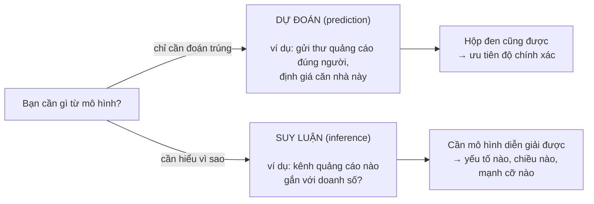

> **Mục tiêu bài học:** Sau bài này, bạn sẽ gọi tên được các thành phần của một bộ dữ liệu theo ngôn ngữ machine learning - mẫu, đặc trưng, nhãn, X và y - hiểu vì sao mọi thứ phải được đổi thành con số, và nắm được trực giác đằng sau quan hệ nền tảng $Y = f(X) + \varepsilon$: máy học chính là đi ước lượng quy luật ẩn $f$ từ dữ liệu có nhiễu.

## 1. Sáu căn nhà, ba cột manh mối, một cột đáp án: mẫu, đặc trưng, nhãn

Một người bạn sắp rao bán căn nhà 70 m², 2 phòng ngủ, cách trung tâm 4 km, và hỏi bạn: *"nên rao giá bao nhiêu?"*. Trong tay bạn là bảng 6 căn nhà từ Bài 02. Muốn máy trả lời thay, việc đầu tiên không phải là chọn thuật toán - mà là chỉ cho máy biết **trong bảng này, cột nào là manh mối, cột nào là đáp án, và mỗi hàng là gì**:

| Hàng ↓ · Cột → | dien_tich (m²) | so_phong_ngu | cach_trung_tam (km) | gia (tỷ đồng) |
|---|:---:|:---:|:---:|:---:|
| *vai trò của cột* | *đặc trưng (feature)* | *đặc trưng (feature)* | *đặc trưng (feature)* | **NHÃN (label)** |
| mẫu 1 | 30 | 1 | 5 | 1.8 |
| mẫu 2 | 45 | 2 | 3 | 2.6 |
| mẫu 3 | 60 | 2 | 7 | 3.0 |
| mẫu 4 | 80 | 3 | 2 | 5.1 |
| mẫu 5 | 100 | 3 | 10 | 4.5 |
| mẫu 6 | 55 | 2 | 4 | 2.9 |

Ba tên gọi bạn sẽ dùng suốt loạt bài này:

- **Mẫu (example / sample):** mỗi **hàng** - một căn nhà, một bệnh nhân, một email, một bức ảnh. Còn gọi là *điểm dữ liệu (data point)* hay *quan sát (observation)*.
- **Đặc trưng (feature):** mỗi **cột đầu vào** - một thuộc tính mô tả mẫu, thứ mô hình dựa vào để dự đoán. Ở đây có 3 đặc trưng: diện tích, số phòng ngủ, khoảng cách vào trung tâm.
- **Nhãn (label):** cột **đáp án** mà ta muốn mô hình dự đoán - ở đây là giá bán. Nhãn *không* nằm trong đầu vào của mô hình; nó là thứ mô hình phải "đoán ra".

Cùng một khái niệm, mỗi cộng đồng gọi một kiểu. Bảng "phiên dịch" này giúp bạn đọc tài liệu không bị lạc:

| Khái niệm | Giới machine learning hay gọi | Giới thống kê hay gọi |
|---|---|---|
| Cột đầu vào | feature, input | predictor (biến dự báo), independent variable (biến độc lập), covariate |
| Cột đáp án | label, target | response (biến phản hồi), dependent variable (biến phụ thuộc), output |
| Một hàng | example, sample, data point | observation (quan sát) |

Bước ra khỏi chuyện nhà cửa, khung "hàng - cột - cột đáp án" vẫn y nguyên:

- **Lọc email spam:** mỗi email là một mẫu; đặc trưng có thể là số lần xuất hiện chữ "trúng thưởng", độ dài email, người gửi có trong danh bạ không; nhãn là "spam" / "không spam". Chi tiết đáng để ý: nhãn này không do chuyên gia nào ngồi gán - nó sinh ra từ **chính người dùng bấm nút "báo cáo spam"**.
- **Y tế**, theo ví dụ trong sách *Dive into Deep Learning*: mỗi bệnh nhân là một mẫu; đặc trưng là tuổi, dấu hiệu sinh tồn, bệnh nền, thuốc đang dùng; nhãn là bệnh nhân có qua khỏi 30 ngày tới hay không.

> 💡 **Ghi nhớ nhanh:** Câu thần chú của dữ liệu dạng bảng - **hàng là mẫu, cột là đặc trưng, cột đặc biệt cần đoán là nhãn.** Thuộc câu này, bạn đọc được một nửa số tài liệu ML.

## 2. X và y: cách gọi tắt cả bảng dữ liệu

Bạn sẽ sớm gặp dòng code này của scikit-learn:

```python
model.fit(X, y)
```

Ngắn ngủn, nhưng nó chứa nguyên cả bảng dữ liệu. Viết đi viết lại "bảng các đặc trưng" và "cột nhãn" rất dài dòng, nên giới ML có một quy ước gần như toàn ngành:

- **X** (chữ hoa): toàn bộ phần đặc trưng - một **ma trận** (lưới số) có $n$ hàng (mẫu) và $p$ cột (đặc trưng).
- **y** (chữ thường): cột nhãn - một **vector** (dãy số) gồm $n$ giá trị, mỗi mẫu một đáp án.

Với bảng giá nhà: $n = 6$ mẫu, $p = 3$ đặc trưng, nên X có kích thước $6 \times 3$ và y có 6 phần tử:

```
      ┌  30    1    5 ┐          ┌ 1.8 ┐
      │  45    2    3 │          │ 2.6 │
X  =  │  60    2    7 │     y =  │ 3.0 │
      │  80    3    2 │          │ 5.1 │
      │ 100    3   10 │          │ 4.5 │
      └  55    2    4 ┘          └ 2.9 ┘
```

Đây chính là mảng NumPy có `shape (6, 3)` mà bạn đã tạo ở Bài 02 - giờ nó có tên chính thức. Và `model.fit(X, y)` đọc thành lời là: *"nạp bảng đặc trưng và cột đáp án vào cho mô hình học"*.

Sách *An Introduction to Statistical Learning* còn chi li hơn: $x_{ij}$ là giá trị của đặc trưng thứ $j$ ở mẫu thứ $i$, và $y_i$ là nhãn của mẫu thứ $i$. Ví dụ $x_{42}$ = số phòng ngủ của căn nhà thứ 4, bằng 3. Bạn chưa cần nhớ ký hiệu này ngay, chỉ cần biết nó tồn tại để không "khớp" khi gặp trong sách.

Một chỗ dễ vấp: sách đếm từ 1, còn NumPy đếm từ 0 - cùng một ô, sách gọi là $x_{42}$, code gọi là `X[3, 1]`.

> 🔧 **Thử ngay:** Với mảng `X` đã tạo ở Bài 02, thêm cột nhãn rồi kiểm tra:
> ```python
> y = np.array([1.8, 2.6, 3.0, 5.1, 4.5, 2.9])
> print(X.shape, y.shape)   # (6, 3) (6,)  → 6 mẫu × 3 đặc trưng, và 6 nhãn
> print(X[3, 1])            # 3 → đúng là x₄₂ của sách (NumPy đếm từ 0)
> ```

## 3. Ảnh, chữ, hướng nhà - tất cả phải hóa thành con số

Bảng giá nhà vốn toàn số nên chuyển thành X, y rất tự nhiên. Nhưng tấm ảnh con mèo trong điện thoại thì "cột đặc trưng" nằm ở đâu? Một email dài ba đoạn thì là bao nhiêu con số? Câu trả lời của cả ngành: dữ liệu phải được **chuyển thành dạng số phù hợp** trước khi vào mô hình - mỗi mẫu trở thành một **vector các con số**. Vấn đề chỉ là *chuyển bằng cách nào*.

**Ảnh = lưới các con số.** Một tấm ảnh màu là ba lớp lưới chồng lên nhau - độ sáng của kênh đỏ, lục, lam tại từng điểm ảnh (pixel). Ảnh màu $200 \times 200$ pixel là $200 \times 200 \times 3 = 120.000$ con số. Nói cách khác, "nhận diện mèo" thực chất là: nhận 120.000 con số, trả lời "mèo" hay "không mèo".

```
Ảnh xám 4×4 (đơn giản hóa):        Máy "nhìn thấy":

   ██░░▒▒██                        [ 12, 240, 180,  15 ]
   ░░██░░▒▒          ──►           [231,  10, 235, 170 ]
   ▒▒░░██░░                        [175, 228,   8, 244 ]
   ██▒▒░░██                        [ 20, 160, 250,  11 ]
                          (mỗi số 0-255: độ sáng một pixel)
```

> 🔧 **Thử ngay:** Ảnh chụp bằng điện thoại cỡ $4000 \times 3000$ pixel, ảnh màu 3 kênh - máy "nhìn thấy" bao nhiêu con số? Còn ảnh xám 4×4 ở trên?
> Đáp: $4000 \times 3000 \times 3 = 36.000.000$ con số. Ảnh xám 4×4 chỉ có $4 \times 4 = 16$ con số (một kênh).

**Văn bản = dãy mã số.** Cách mộc mạc là đếm: mỗi từ trong từ điển một cột, giá trị là số lần từ đó xuất hiện trong văn bản. Các mô hình ngôn ngữ hiện đại tinh vi hơn - cắt văn bản thành các **token** rồi gán mỗi token một vector số - nhưng tinh thần không đổi: chữ phải thành số trước đã.

**Cột chữ trong bảng cũng phải thành số.** Cột "hướng nhà" với giá trị Đông/Tây/Nam/Bắc không cộng trừ được. Một cách xử lý thường dùng là tách thành 4 cột 0/1 (nhà hướng Đông thì cột `huong_Dong` bằng 1, ba cột kia bằng 0) - kỹ thuật mã hóa này cùng các cách xử lý cột chữ khác sẽ được học kỹ ở **Bài 12** về chuẩn bị dữ liệu.

### Số chiều (dimensionality)

Khi mẫu nào cũng được mô tả bằng **cùng một số lượng con số**, ta nói các mẫu là vector có độ dài cố định, và độ dài đó là **số chiều (dimensionality)** của dữ liệu:

- Căn nhà trong bảng mini: **3 chiều** (diện tích, phòng ngủ, khoảng cách).
- Ảnh màu 200×200: **120.000 chiều**.

Đừng cố tưởng tượng "không gian 120.000 chiều" bằng mắt - không ai làm được. Điều đáng nhớ là: các phép toán trên vector *không quan tâm* có bao nhiêu chiều, công thức cho 3 chiều chạy y hệt cho 120.000 chiều. Bài 06 về vector, ma trận, tensor sẽ khai thác triệt để điều này.

> ⚠️ **Lưu ý nhỏ:** Không phải dữ liệu nào cũng ép được về độ dài cố định - các bài đánh giá sản phẩm lúc ngắn một dòng, lúc dài cả trang. Xử lý mượt dữ liệu có **độ dài thay đổi** như vậy thường được xem là một lợi thế của deep learning so với các phương pháp truyền thống.

## 4. Quy luật ẩn và nhiễu: $Y = f(X) + \varepsilon$

Hai người cùng đi học đúng 16 năm. Ra trường, thu nhập của họ khác nhau một trời một vực. Vậy "số năm đi học" có nói lên điều gì về thu nhập không - hay tất cả chỉ là ngẫu nhiên?

Sách *An Introduction to Statistical Learning* trả lời bằng bộ dữ liệu `Income`: **30 người**, mỗi người có số năm đi học và thu nhập. Chấm 30 điểm lên biểu đồ (trục ngang: năm đi học, trục dọc: thu nhập), xu hướng hiện ra rõ - học lâu hơn thường gắn với thu nhập cao hơn. Nhưng các điểm **không nằm gọn trên một đường cong** nào cả; chúng lượn lờ *xung quanh* một đường vô hình:

```
 thu nhập
    │                              ∘
    │                        ∘  ˙˙˙˙˙∘˙˙
    │                   ∘ ˙˙˙   ∘
    │              ∘ ˙˙˙  ∘
    │         ∘ ˙˙˙∘
    │    ∘ ˙˙˙  ∘
    │ ˙˙˙   ∘
    └──────────────────────────────────── năm đi học
      ˙˙˙ = quy luật ẩn f (không ai nhìn thấy trực tiếp)
       ∘  = dữ liệu thật = f + nhiễu ε (điểm trên/dưới đường)
```

Một cách mô hình hóa phổ biến trong hồi quy và thống kê học (statistical learning) là gói tình huống này vào một công thức:

$$Y = f(X) + \varepsilon$$

Đọc bằng lời: **giá trị quan sát được = quy luật ẩn + nhiễu.**

- **$f$ - quy luật ẩn (hệ thống):** phần thông tin *có quy luật* mà X cho ta biết về Y - "học vấn ảnh hưởng thu nhập theo đường cong nào đó". Ta **không bao giờ biết chính xác $f$**. **Trong khung nhìn này, machine learning là tập hợp các phương pháp ước lượng $f$ từ dữ liệu** - bản ước lượng được ký hiệu $\hat{f}$ (đọc là "f mũ").
- **$\varepsilon$ - nhiễu (epsilon):** phần *không có quy luật theo X*. Hai người học cùng 16 năm vẫn có thu nhập khác nhau, vì thu nhập còn phụ thuộc vô số thứ ta không đo: ngành nghề, nơi sống, may mắn, thời điểm... cộng thêm sai sót đo đạc. Nhiễu có lúc dương lúc âm, trung bình xấp xỉ 0 - điểm dữ liệu lúc nằm trên, lúc nằm dưới đường $f$.

Chi tiết đáng ngạc nhiên: sở dĩ đường $f$ "thật" trong hình của sách vẽ được là vì `Income` là **dữ liệu mô phỏng** - các tác giả tự sinh ra nó nên biết $f$. Với dữ liệu đời thật, không ai từng nhìn thấy $f$; ta chỉ có các điểm.

Hệ quả quan trọng: sai số dự đoán gồm hai phần. Phần **giảm được (reducible)** - do $\hat{f}$ của ta chưa sát $f$, có thể cải thiện bằng mô hình tốt hơn, dữ liệu nhiều hơn. Và phần **không giảm được (irreducible)** - do $\varepsilon$: *dù ước lượng $f$ hoàn hảo*, dự đoán vẫn sai một mức nào đó, vì bản thân Y có yếu tố ngẫu nhiên. Không mô hình nào, kể cả mạng nơ-ron tỷ tham số, đoán được phần nhiễu - và một mô hình có vẻ "đoán trúng cả nhiễu" trên dữ liệu cũ thực ra đang học vẹt (hiện tượng *overfitting*, hẹn bạn ở Bài 14).

> 🔧 **Thử ngay:** Giả sử bạn ước lượng được $\hat{f}$ *trùng khớp hoàn toàn* với $f$. Ba quan sát có nhiễu lần lượt $\varepsilon = +1, -2, +1$. Sai số bình phương trung bình của dự đoán là bao nhiêu?
> Đáp: $(1^2 + 2^2 + 1^2)/3 = 6/3 = 2$. Toàn bộ con số này do nhiễu - đổi sang mô hình "mạnh" hơn cũng không giảm được. Đó là mức sàn.

<details>
<summary><strong>Đào sâu: vì sao nhiễu đặt "mức sàn" cho sai số? (bấm để mở)</strong></summary>

Sách *An Introduction to Statistical Learning* trình bày một kết quả gọn: nếu dự đoán bằng $\hat{Y} = \hat{f}(X)$, thì sai số bình phương *trung bình* tách được thành đúng hai phần:

$$E(Y - \hat{Y})^2 = \underbrace{[f(X) - \hat{f}(X)]^2}_{\text{giảm được}} + \underbrace{\mathrm{Var}(\varepsilon)}_{\text{không giảm được}}$$

Phần thứ nhất là khoảng cách giữa ước lượng $\hat{f}$ và quy luật thật $f$ - thu hẹp được bằng phương pháp tốt hơn. Phần thứ hai là **phương sai của nhiễu** - độ "rung lắc" cố hữu của dữ liệu, không phụ thuộc ta ước lượng giỏi đến đâu. Nó chính là **mức sàn** của sai số dự đoán: không phương pháp nào chui xuống dưới sàn này được. Điều éo le mà sách lưu ý: trong thực tế, mức sàn đó gần như luôn là một ẩn số - ta chỉ biết nó tồn tại.

</details>

> ⚠️ **Lưu ý nhỏ:** $Y = f(X) + \varepsilon$ là *một cách mô hình hóa* phổ biến, không phải khuôn bắt buộc của mọi bài toán học có giám sát. Trong cách đặt của sách *An Introduction to Statistical Learning*, nhiễu $\varepsilon$ được **giả định** có trung bình bằng 0 và độc lập với X - đó là giả định của mô hình, không phải điều dữ liệu tự bảo đảm.

> 💡 **Ghi nhớ nhanh:** Máy học không đi tìm "công thức đúng tuyệt đối" - nó đi **ước lượng quy luật ẩn từ dữ liệu có nhiễu**, và chấp nhận một mức sai không thể xóa bỏ.

## 5. Dự đoán hay diễn giải: bạn cần gì từ $\hat{f}$?

Cùng một $\hat{f}$ ước lượng giá nhà, nhưng hai người dùng nó theo hai cách khác hẳn nhau. Người môi giới chỉ cần con số: *căn này nên rao bao nhiêu?* Nhà quy hoạch lại hỏi: *gần trung tâm thêm 1 km thì giá đổi bao nhiêu?* Sách *An Introduction to Statistical Learning* gọi đó là **hai động cơ khác nhau** để ước lượng $f$ - và phân biệt được chúng sẽ giúp bạn chọn đúng công cụ sau này.

### 5.1. Dự đoán (prediction): chỉ cần đoán đúng

Nhiều khi ta chỉ cần **kết quả đoán chính xác**, còn bên trong $\hat{f}$ vận hành ra sao thì... kệ nó - coi như **hộp đen (black box)**.

Ví dụ kinh điển trong sách: một công ty chạy chiến dịch **gửi thư quảng cáo trực tiếp**. Họ có dữ liệu nhân khẩu học của từng người và muốn biết *ai có khả năng phản hồi tích cực* để gửi thư đúng chỗ. Công ty không hề quan tâm "thu nhập ảnh hưởng đến xác suất phản hồi theo cơ chế nào" - họ chỉ cần danh sách đoán đúng.

Sách còn nêu một ví dụ y tế cùng tinh thần: từ các chỉ số xét nghiệm máu dễ đo, đoán nguy cơ một bệnh nhân **phản ứng nặng với một loại thuốc** - để tránh kê thuốc đó cho người có nguy cơ cao. Bác sĩ cần con số nguy cơ đúng; cơ chế bên trong $\hat{f}$ là chuyện thứ yếu.

### 5.2. Suy luận / diễn giải (inference): cần hiểu cơ chế

Ngược lại, có khi câu hỏi thật sự là **"yếu tố nào ảnh hưởng, ảnh hưởng bao nhiêu, theo chiều nào?"** - lúc này $\hat{f}$ không được phép là hộp đen, vì ta cần mở nó ra xem.

Ví dụ trong sách: bộ dữ liệu `Advertising` gồm **200 thị trường**, ghi lại doanh số một sản phẩm cùng ngân sách quảng cáo trên **TV, radio và báo in** ở mỗi thị trường. Câu hỏi đặt ra không phải "thị trường tới bán được bao nhiêu?", mà là: *kênh nào thực sự gắn với doanh số? Chi tiêu TV cao hơn 1 đồng gắn với mức doanh số cao hơn khoảng bao nhiêu? Có nên cắt ngân sách báo in không?* - toàn những câu hỏi về **mối quan hệ** bên trong $f$.

### 5.3. Và nhiều bài toán cần cả hai

Chính ví dụ **định giá nhà** của chúng ta là minh họa mà sách đưa ra cho trường hợp cần cả hai:

| Câu hỏi | Thuộc loại |
|---|---|
| *"Căn nhà này đang được rao đắt hơn hay rẻ hơn giá trị thật?"* | **Dự đoán** - chỉ cần con số giá sát thực tế |
| *"Nhà có view sông thì đáng giá thêm bao nhiêu?"* | **Suy luận** - cần biết ảnh hưởng của một đặc trưng cụ thể |

Vì sao phải phân biệt hai mục đích này? Vì giữa chúng có một **sự đánh đổi**: các mô hình đơn giản (như mô hình tuyến tính) thường **dễ diễn giải** nhưng có thể đoán kém chính xác hơn; các mô hình rất linh hoạt (như mạng nơ-ron) có thể **đoán tốt hơn nhưng khó mở hộp đen** để giải thích.

Điều bất ngờ mà sách *An Introduction to Statistical Learning* lưu ý: ngay cả khi *chỉ* cần dự đoán, mô hình linh hoạt nhất chưa chắc thắng - vì nó dễ học vẹt cả nhiễu. Ta sẽ trở lại chuyện này ở Bài 13 và 14.



> ⚠️ **Lưu ý quan trọng:** mối quan hệ mà mô hình ước lượng được từ dữ liệu quan sát là **mối liên hệ (association)**, chưa tự động là **quan hệ nhân quả (causation)**. "Thị trường chi nhiều cho TV thường có doanh số cao" chưa chứng minh "tăng chi TV *sẽ làm* doanh số tăng" - muốn kết luận nhân quả cần thêm thiết kế nghiên cứu phù hợp (ví dụ thử nghiệm có đối chứng) hoặc các giả định nhân quả rõ ràng.

## Tóm tắt bài học

- Dữ liệu dạng bảng đọc theo quy tắc: **hàng = mẫu (example)**, **cột = đặc trưng (feature)**, cột cần dự đoán = **nhãn (label)**. Cùng khái niệm, giới thống kê gọi là predictor/response, biến độc lập/biến phụ thuộc.
- Quy ước ký hiệu: **X** là ma trận đặc trưng ($n$ mẫu × $p$ đặc trưng), **y** là vector nhãn - đúng hình hài dữ liệu mà `model.fit(X, y)` chờ đợi.
- Máy tính chỉ học được từ **con số**: ảnh là lưới pixel (ảnh màu 200×200 = 120.000 con số), văn bản phải mã hóa thành token/vector, cột chữ trong bảng phải chuyển thành cột số.
- **Số chiều (dimensionality)** = số con số mô tả một mẫu khi các mẫu có độ dài cố định; công thức toán chạy y hệt dù 3 chiều hay 120.000 chiều.
- Quan hệ nền tảng $Y = f(X) + \varepsilon$: dữ liệu = **quy luật ẩn** $f$ + **nhiễu** $\varepsilon$. Machine learning là đi tìm ước lượng $\hat{f}$; sai số gồm phần *giảm được* (do $\hat{f}$ chưa tốt) và phần *không giảm được* (do nhiễu).
- Hai mục đích ước lượng $f$: **dự đoán** (chỉ cần đoán trúng - hộp đen chấp nhận được, như gửi thư quảng cáo đúng người) và **suy luận/diễn giải** (cần hiểu cơ chế - như phân bổ ngân sách quảng cáo); nhiều bài toán, ví dụ định giá nhà, cần cả hai.

## Câu hỏi tự kiểm tra

1. Trong bảng giá nhà mini, đâu là mẫu, đâu là đặc trưng, đâu là nhãn? Nếu bài toán đổi thành *"dự đoán số phòng ngủ từ diện tích, khoảng cách và giá"*, thì X và y thay đổi thế nào?
2. Một bộ dữ liệu ảnh gồm 10.000 tấm ảnh xám kích thước 28×28 pixel, mỗi ảnh kèm nhãn là chữ số 0-9. Cho biết: số mẫu $n$, số chiều của mỗi mẫu, và kích thước của X.
3. Bạn của bạn nói: *"Nếu có mô hình đủ mạnh và dữ liệu đủ nhiều thì dự đoán sẽ chính xác tuyệt đối."* Dùng khái niệm $\varepsilon$ để chỉ ra chỗ chưa ổn trong câu này.
4. Với ví dụ thu nhập theo số năm đi học của sách *An Introduction to Statistical Learning*: hãy kể 3 lý do đời thường khiến hai người học cùng số năm vẫn có thu nhập khác nhau. Các lý do đó thuộc về $f$ hay $\varepsilon$ (khi mô hình chỉ có đặc trưng "số năm đi học")?
5. Xếp mỗi tình huống sau vào **dự đoán** hay **suy luận**: (a) ngân hàng muốn biết hồ sơ vay này có khả năng vỡ nợ không để duyệt/từ chối; (b) ngân hàng muốn biết yếu tố nào khiến khách vỡ nợ để thiết kế lại chính sách; (c) app thời tiết báo ngày mai mưa hay không.
6. Vì sao cột "hướng nhà" (Đông/Tây/Nam/Bắc) không đưa thẳng vào X được, và một cách xử lý là gì?

## Đọc thêm

**Nguồn nền tảng của bài:**

| Nguồn | Đọc phần nào |
|---|---|
| **Sách *An Introduction to Statistical Learning*** | Chương 2, mục 2.1 - *What Is Statistical Learning?*: quan hệ $Y = f(X) + \varepsilon$, ví dụ `Income` và `Advertising`, dự đoán vs. suy luận, sai số giảm được và không giảm được |
| **Sách *Dive into Deep Learning*** (d2l.ai) | Chương 1, mục *Key Components* → *Data*: mẫu, đặc trưng, nhãn, ảnh 200×200×3, dimensionality, dữ liệu độ dài thay đổi |
| **Sách *Mathematics for Machine Learning*** | Chương 1 - *Introduction and Motivation*: dữ liệu như vector, bộ ba data-model-learning |

**Nguồn online bổ sung (miễn phí):**

- [Google Machine Learning Crash Course - Key ML terminology](https://developers.google.com/machine-learning/crash-course) - phần "Framing" định nghĩa feature, label, example với ví dụ lọc spam, kèm câu hỏi tự kiểm tra.
- [statlearning.com](https://www.statlearning.com/) - trang chính thức của sách *An Introduction to Statistical Learning*, tải PDF miễn phí (bản Python là ISLP).
- [mml-book.com](https://mml-book.github.io/) - trang chính thức của sách *Mathematics for Machine Learning*, tải PDF miễn phí.

> **Bài tiếp theo:** [Train, validation, test và quá trình học](../train-validation-test-the-learning-process-vi/) - đã biết X, y và mục tiêu ước lượng $f$ - giờ đến câu hỏi thực hành đầu tiên: vì sao phải *chia* dữ liệu thành các phần huấn luyện, kiểm định, kiểm tra, và quá trình học diễn ra theo trình tự nào.
