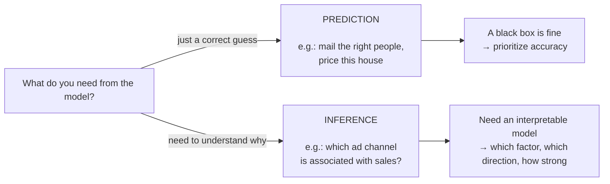

> **Learning objectives:** After this lesson, you will be able to name the parts of a dataset in the language of machine learning - samples, features, labels, X and y - understand why everything has to be turned into numbers, and grasp the intuition behind the fundamental relationship $Y = f(X) + \varepsilon$: machine learning is about estimating the hidden pattern $f$ from noisy data.

## 1. Six houses, three columns of clues, one column of answers: samples, features, labels

A friend is about to list their 70 m², 2-bedroom house, 4 km from the city center, and asks you: *"what price should I list it at?"*. In your hands is the table of 6 houses from Lesson 02. If you want a machine to answer instead, the first step is not choosing an algorithm - it is telling the machine **which columns in this table are clues, which column is the answer, and what each row is**:

| Row ↓ · Column → | dien_tich (m²) | so_phong_ngu | cach_trung_tam (km) | gia (billion VND) |
|---|:---:|:---:|:---:|:---:|
| *role of the column* | *feature* | *feature* | *feature* | **LABEL** |
| example 1 | 30 | 1 | 5 | 1.8 |
| example 2 | 45 | 2 | 3 | 2.6 |
| example 3 | 60 | 2 | 7 | 3.0 |
| example 4 | 80 | 3 | 2 | 5.1 |
| example 5 | 100 | 3 | 10 | 4.5 |
| example 6 | 55 | 2 | 4 | 2.9 |

Three names you will use throughout this series:

- **Example / sample:** each **row** - one house, one patient, one email, one photo. Also called a *data point* or an *observation*.
- **Feature:** each **input column** - an attribute describing the example, the thing the model relies on to predict. Here there are 3 features: floor area, number of bedrooms, distance to the center.
- **Label:** the **answer** column that we want the model to predict - here, the sale price. The label is *not* part of the model's input; it is what the model has to "guess".

The same concept gets a different name in each community. This "translation" table will keep you from getting lost when reading:

| Concept | What the machine learning crowd calls it | What the statistics crowd calls it |
|---|---|---|
| Input column | feature, input | predictor, independent variable, covariate |
| Answer column | label, target | response, dependent variable, output |
| One row | example, sample, data point | observation |

Step outside real estate and the "rows - columns - answer column" frame stays exactly the same:

- **Spam filtering:** each email is an example; features might be the number of times the phrase "you've won" appears, the email's length, whether the sender is in your contacts; the label is "spam" / "not spam". A detail worth noticing: this label was not assigned by some expert - it comes from **users themselves clicking the "report spam" button**.
- **Healthcare**, following the example in *Dive into Deep Learning*: each patient is an example; features are age, vital signs, pre-existing conditions, current medications; the label is whether the patient survives the next 30 days.

> 💡 **Quick takeaway:** The mantra of tabular data - **rows are examples, columns are features, the special column to predict is the label.** Know this sentence by heart and you can read half of all ML material.

## 2. X and y: shorthand for the whole data table

You will soon meet this line of scikit-learn code:

```python
model.fit(X, y)
```

Tiny, but it contains the entire data table. Writing "the table of features" and "the label column" over and over is tedious, so the ML world has a near-universal convention:

- **X** (uppercase): the entire feature part - a **matrix** (grid of numbers) with $n$ rows (examples) and $p$ columns (features).
- **y** (lowercase): the label column - a **vector** (sequence of numbers) of $n$ values, one answer per example.

For the house price table: $n = 6$ examples, $p = 3$ features, so X has size $6 \times 3$ and y has 6 elements:

```
      ┌  30    1    5 ┐          ┌ 1.8 ┐
      │  45    2    3 │          │ 2.6 │
X  =  │  60    2    7 │     y =  │ 3.0 │
      │  80    3    2 │          │ 5.1 │
      │ 100    3   10 │          │ 4.5 │
      └  55    2    4 ┘          └ 2.9 ┘
```

This is precisely the NumPy array of `shape (6, 3)` you created in Lesson 02 - now it has an official name. And `model.fit(X, y)` read aloud is: *"feed the feature table and the answer column to the model to learn from"*.

*An Introduction to Statistical Learning* is even more meticulous: $x_{ij}$ is the value of feature $j$ in example $i$, and $y_i$ is the label of example $i$. For instance, $x_{42}$ = the number of bedrooms of the 4th house, which is 3. You don't need to memorize this notation yet; just know it exists so you aren't thrown when you meet it in a book.

One easy stumble: books count from 1, while NumPy counts from 0 - the same cell is called $x_{42}$ in the book and `X[3, 1]` in code.

> 🔧 **Try it now:** With the `X` array created in Lesson 02, add the label column and check:
> ```python
> y = np.array([1.8, 2.6, 3.0, 5.1, 4.5, 2.9])
> print(X.shape, y.shape)   # (6, 3) (6,)  → 6 examples × 3 features, and 6 labels
> print(X[3, 1])            # 3 → indeed the book's x₄₂ (NumPy counts from 0)
> ```

## 3. Images, text, house orientation - everything must become numbers

The house price table is all numbers, so converting it into X and y is very natural. But where are the "feature columns" in the cat photo on your phone? How many numbers is a three-paragraph email? The whole field's answer: data must be **converted into a suitable numeric form** before entering the model - each example becomes a **vector of numbers**. The only question is *how to convert it*.

**An image = a grid of numbers.** A color image is three grids stacked on top of each other - the brightness of the red, green, and blue channels at each pixel. A $200 \times 200$ pixel color image is $200 \times 200 \times 3 = 120{,}000$ numbers. In other words, "recognizing a cat" is really: take in 120,000 numbers, answer "cat" or "not cat".

```
4×4 grayscale image (simplified):    What the machine "sees":

   ██░░▒▒██                        [ 12, 240, 180,  15 ]
   ░░██░░▒▒          ──►           [231,  10, 235, 170 ]
   ▒▒░░██░░                        [175, 228,   8, 244 ]
   ██▒▒░░██                        [ 20, 160, 250,  11 ]
                          (each number 0-255: the brightness of one pixel)
```

> 🔧 **Try it now:** A phone photo of $4000 \times 3000$ pixels, 3-channel color - how many numbers does the machine "see"? And the 4×4 grayscale image above?
> Answer: $4000 \times 3000 \times 3 = 36{,}000{,}000$ numbers. The 4×4 grayscale image has only $4 \times 4 = 16$ numbers (one channel).

**Text = a sequence of codes.** The crude approach is counting: one column per word in the dictionary, with the value being how many times that word appears in the text. Modern language models are more sophisticated - they split text into **tokens** and assign each token a numeric vector - but the spirit is unchanged: words must become numbers first.

**Text columns in a table must become numbers too.** A "house orientation" column with values East/West/South/North cannot be added or subtracted. One common treatment is to split it into 4 columns of 0/1 (a house facing East gets 1 in the `huong_Dong` column and 0 in the other three) - this encoding technique and its companions will be studied in detail in **Lesson 12** on data preparation.

### Dimensionality

When all examples are described by **the same number of numbers**, we say the examples are fixed-length vectors, and that length is the **dimensionality** of the data:

- A house in the mini table: **3 dimensions** (floor area, bedrooms, distance).
- A 200×200 color image: **120,000 dimensions**.

Don't try to picture a "120,000-dimensional space" in your mind - nobody can. What matters is this: vector operations *don't care* how many dimensions there are; the formula for 3 dimensions runs exactly the same for 120,000. Lesson 06 on vectors, matrices, and tensors will exploit this to the fullest.

> ⚠️ **A small note:** Not all data can be forced into a fixed length - product reviews are sometimes one line, sometimes a full page. Handling such **variable-length** data gracefully is generally considered an advantage of deep learning over traditional methods.

## 4. Hidden pattern and noise: $Y = f(X) + \varepsilon$

Two people each spend exactly 16 years in school. After graduating, their incomes are worlds apart. So does "years of education" say anything about income - or is it all just random?

*An Introduction to Statistical Learning* answers with the `Income` dataset: **30 people**, each with their years of education and income. Plot the 30 points on a chart (horizontal axis: years of education, vertical axis: income), and a clear trend emerges - more schooling tends to go with higher income. But the points **don't sit neatly on any curve**; they hover *around* an invisible line:

```
 income
    │                              ∘
    │                        ∘  ˙˙˙˙˙∘˙˙
    │                   ∘ ˙˙˙   ∘
    │              ∘ ˙˙˙  ∘
    │         ∘ ˙˙˙∘
    │    ∘ ˙˙˙  ∘
    │ ˙˙˙   ∘
    └──────────────────────────────────── years of education
      ˙˙˙ = hidden pattern f (nobody sees it directly)
       ∘  = real data = f + noise ε (points above/below the line)
```

A common way of modeling this situation in regression and statistical learning is to wrap it into a formula:

$$Y = f(X) + \varepsilon$$

Read aloud: **observed value = hidden pattern + noise.**

- **$f$ - the hidden (systematic) pattern:** the *patterned* part of the information that X gives us about Y - "education affects income along some curve". We **never know $f$ exactly**. **In this framing, machine learning is the collection of methods for estimating $f$ from data** - the estimate is written $\hat{f}$ (read "f hat").
- **$\varepsilon$ - noise (epsilon):** the part *with no pattern in terms of X*. Two people with the same 16 years of schooling still have different incomes, because income also depends on countless things we didn't measure: profession, place of residence, luck, timing... plus measurement error. Noise is sometimes positive, sometimes negative, averaging roughly 0 - data points sit sometimes above, sometimes below the line $f$.

A surprising detail: the "true" line $f$ in the book's figure can be drawn only because `Income` is **simulated data** - the authors generated it themselves, so they know $f$. With real-world data, nobody has ever seen $f$; we only have the points.

An important consequence: prediction error has two parts. The **reducible** part - because our $\hat{f}$ is not yet close to $f$ - can be improved with a better model and more data. And the **irreducible** part - due to $\varepsilon$: *even with a perfect estimate of $f$*, predictions will still be off by some amount, because Y itself has a random element. No model, not even a billion-parameter neural network, can predict the noise - and a model that seems to "nail the noise too" on old data is actually memorizing (the phenomenon of *overfitting*, which awaits you in Lesson 14).

> 🔧 **Try it now:** Suppose your estimate $\hat{f}$ *matches $f$ perfectly*. Three observations have noise $\varepsilon = +1, -2, +1$ respectively. What is the mean squared error of the predictions?
> Answer: $(1^2 + 2^2 + 1^2)/3 = 6/3 = 2$. This entire number is due to noise - switching to a "stronger" model won't reduce it. That is the floor.

<details>
<summary><strong>Going deeper: why does noise set a "floor" on the error? (click to open)</strong></summary>

*An Introduction to Statistical Learning* presents a neat result: if we predict with $\hat{Y} = \hat{f}(X)$, then the *average* squared error splits into exactly two parts:

$$E(Y - \hat{Y})^2 = \underbrace{[f(X) - \hat{f}(X)]^2}_{\text{reducible}} + \underbrace{\mathrm{Var}(\varepsilon)}_{\text{irreducible}}$$

The first part is the gap between the estimate $\hat{f}$ and the true pattern $f$ - it can be narrowed with better methods. The second part is the **variance of the noise** - the inherent "jitter" of the data, independent of how well we estimate. It is the **floor** of prediction error: no method can dig below this floor. The awkward thing the book points out: in practice, that floor is almost always an unknown - we only know it exists.

</details>

> ⚠️ **A small note:** $Y = f(X) + \varepsilon$ is *one common way of modeling*, not a mandatory template for every supervised learning problem. In the formulation of *An Introduction to Statistical Learning*, the noise $\varepsilon$ is **assumed** to have mean zero and to be independent of X - that is an assumption of the model, not something the data guarantees on its own.

> 💡 **Quick takeaway:** Machine learning does not search for "the absolutely correct formula" - it **estimates the hidden pattern from noisy data**, and accepts a level of error that cannot be eliminated.

## 5. Prediction or interpretation: what do you need from $\hat{f}$?

Given the same $\hat{f}$ estimating house prices, two people use it completely differently. The real estate agent only needs the number: *what should this house be listed at?* The urban planner asks instead: *how much does the price change for every extra 1 km closer to the center?* *An Introduction to Statistical Learning* calls these **two different motivations** for estimating $f$ - and telling them apart will help you choose the right tool later.

### 5.1. Prediction: just get it right

Often we only need **an accurate guess**, and how $\hat{f}$ works inside is... whatever - treat it as a **black box**.

The classic example in the book: a company running a **direct-mail marketing** campaign. They have demographic data on each person and want to know *who is likely to respond positively* so they can send mail to the right places. The company has no interest whatsoever in "the mechanism by which income affects the probability of responding" - they just need a list that guesses right.

The book gives a medical example in the same spirit: from easily measured blood test values, predict the risk that a patient will have a **severe reaction to a certain drug** - so as to avoid prescribing that drug to high-risk patients. The doctor needs the risk number to be correct; the mechanism inside $\hat{f}$ is secondary.

### 5.2. Inference / interpretation: understanding the mechanism

Conversely, sometimes the real question is **"which factors matter, by how much, and in which direction?"** - in which case $\hat{f}$ is not allowed to be a black box, because we need to open it up and look inside.

The example in the book: the `Advertising` dataset of **200 markets**, recording the sales of a product together with the advertising budget on **TV, radio, and newspaper** in each market. The question is not "how much will the next market sell?", but rather: *which channels are actually associated with sales? How much higher are sales for each extra dollar spent on TV? Should the newspaper budget be cut?* - all questions about the **relationships** inside $f$.

### 5.3. And many problems need both

Our very own **house pricing** example is the illustration the book gives for the hybrid case:

| Question | Type |
|---|---|
| *"Is this house listed above or below its true value?"* | **Prediction** - only need a price number close to reality |
| *"How much more is a house with a river view worth?"* | **Inference** - need to know the effect of one specific feature |

Why does this distinction matter? Because it creates a **trade-off**: simple models (like linear models) are usually **easy to interpret** but may predict less accurately; very flexible models (like neural networks) may **predict better but are hard to open up** and explain.

The surprise that *An Introduction to Statistical Learning* points out: even when you *only* need prediction, the most flexible model doesn't necessarily win - because it easily memorizes the noise as well. We will return to this in Lessons 13 and 14.



> ⚠️ **Important note:** the relationship a model estimates from observational data is an **association**, not automatically **causation**. "Markets that spend a lot on TV usually have high sales" does not prove "increasing TV spending *will make* sales go up" - a causal conclusion requires an appropriate study design (for example, a controlled experiment) or explicit causal assumptions.

## Lesson summary

- Tabular data is read by the rule: **rows = examples**, **columns = features**, the column to predict = **label**. The same concepts are called predictor/response, independent/dependent variable by statisticians.
- Notation convention: **X** is the feature matrix ($n$ examples × $p$ features), **y** is the label vector - exactly the data shape that `model.fit(X, y)` expects.
- Computers only learn from **numbers**: an image is a grid of pixels (a 200×200 color image = 120,000 numbers), text must be encoded into tokens/vectors, text columns in a table must be converted into numeric columns.
- **Dimensionality** = the number of numbers describing one example when examples have a fixed length; the math runs exactly the same whether there are 3 dimensions or 120,000.
- The fundamental relationship $Y = f(X) + \varepsilon$: data = **hidden pattern** $f$ + **noise** $\varepsilon$. Machine learning searches for an estimate $\hat{f}$; the error consists of a *reducible* part (because $\hat{f}$ is not yet good) and an *irreducible* part (due to noise).
- Two purposes for estimating $f$: **prediction** (just get it right - a black box is acceptable, as in mailing the right people) and **inference/interpretation** (need to understand the mechanism - as in allocating an advertising budget); many problems, such as house pricing, need both.

## Self-check questions

1. In the mini house price table, what are the examples, what are the features, and what is the label? If the problem changed to *"predict the number of bedrooms from floor area, distance, and price"*, how would X and y change?
2. An image dataset consists of 10,000 grayscale images of 28×28 pixels, each with a label that is a digit 0-9. State: the number of examples $n$, the dimensionality of each example, and the size of X.
3. Your friend says: *"With a strong enough model and enough data, predictions will be perfectly accurate."* Use the concept of $\varepsilon$ to point out what is wrong with this statement.
4. For the income-by-years-of-education example from *An Introduction to Statistical Learning*: list 3 everyday reasons why two people with the same years of schooling still have different incomes. Do those reasons belong to $f$ or to $\varepsilon$ (when the model has only the feature "years of education")?
5. Sort each of the following situations into **prediction** or **inference**: (a) a bank wants to know whether this loan application is likely to default, in order to approve/reject it; (b) a bank wants to know which factors cause customers to default, in order to redesign its policy; (c) a weather app says whether it will rain tomorrow.
6. Why can't the "house orientation" column (East/West/South/North) be fed straight into X, and what is one way to handle it?

## Further reading

**Primary sources for this lesson:**

| Source | Which part to read |
|---|---|
| **The book *An Introduction to Statistical Learning*** | Chapter 2, Section 2.1 - *What Is Statistical Learning?*: the relationship $Y = f(X) + \varepsilon$, the `Income` and `Advertising` examples, prediction vs. inference, reducible and irreducible error |
| **The book *Dive into Deep Learning*** (d2l.ai) | Chapter 1, the *Key Components* → *Data* section: examples, features, labels, 200×200×3 images, dimensionality, variable-length data |
| **The book *Mathematics for Machine Learning*** | Chapter 1 - *Introduction and Motivation*: data as vectors, the data-model-learning trio |

**Additional free online sources:**

- [Google Machine Learning Crash Course - Key ML terminology](https://developers.google.com/machine-learning/crash-course) - the "Framing" section defines feature, label, and example with a spam filtering example, plus self-check questions.
- [statlearning.com](https://www.statlearning.com/) - the official site of *An Introduction to Statistical Learning*, free PDF download (the Python edition is ISLP).
- [mml-book.com](https://mml-book.github.io/) - the official site of *Mathematics for Machine Learning*, free PDF download.

> **Next lesson:** [Train, Validation, Test & the Learning Process](../train-validation-test-the-learning-process/) - now that you know X, y, and the goal of estimating $f$ - on to the first practical question: why data must be *split* into training, validation, and test portions, and in what order the learning process unfolds.
