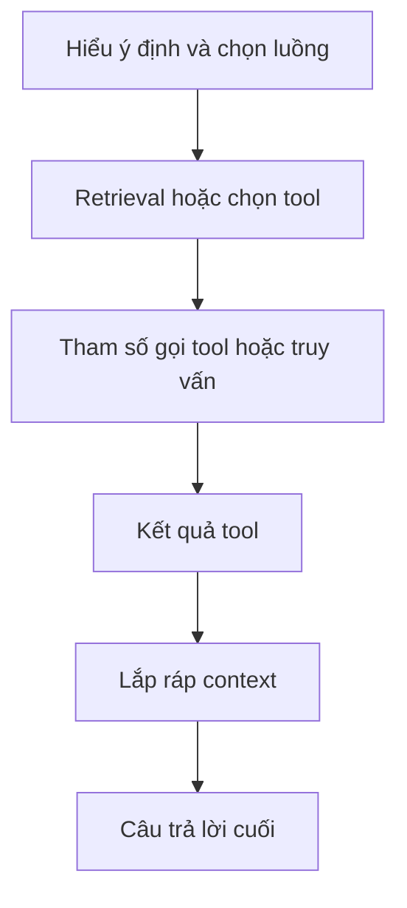
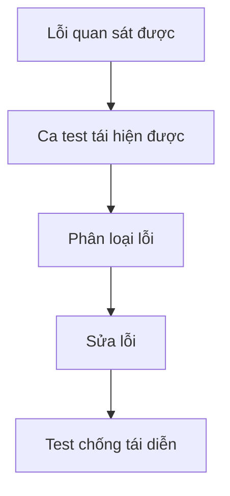

Hệ thống tạo sinh khó đánh giá hơn một bộ phân loại: nhiều đầu ra khác nhau đều có thể chấp nhận được, và lỗi có thể xuất hiện ở nhiều bước phía sau.

Giải pháp không phải là từ bỏ đo lường. Ta cần **tách hành vi mình quan tâm thành những phần có thể kiểm tra**.

## Bắt đầu từ tiêu chí của nhiệm vụ

Trước khi chọn judge model hay metric, hãy định nghĩa một kết quả đúng cần đáp ứng những gì.

Với trợ lý phân tích dữ liệu, tiêu chí có thể gồm:

- đúng khoảng thời gian;
- đúng phạm vi thực thể hoặc cửa hàng;
- đúng nguồn dữ liệu;
- phép tính đúng;
- giải thích có bằng chứng;
- không đưa ra khẳng định thiếu căn cứ;
- đúng định dạng đầu ra yêu cầu.

Những tiêu chí này hữu ích hơn nhiều so với một điểm "chất lượng câu trả lời" mơ hồ.

## Tách kiểm tra xác định khỏi đánh giá ngữ nghĩa

Một số điều có thể kiểm tra chính xác:

- HTTP thành công;
- dữ liệu đúng schema;
- đúng tenant;
- truy vấn SQL chỉ đọc;
- có đủ các trường bắt buộc;
- phép tính đã biết cho kết quả đúng.

Những điều khác cần đánh giá ngữ nghĩa:

- câu trả lời có giải quyết đúng câu hỏi không;
- lập luận có được bằng chứng hỗ trợ không;
- bản tóm tắt có giữ lại phát hiện quan trọng không.

Hãy dùng kiểm tra xác định ở nơi có thể, và dành đánh giá của LLM hoặc con người cho những thuộc tính thật sự mang tính ngữ nghĩa.

## Đánh giá cả pipeline, không chỉ câu trả lời cuối

Với RAG hoặc Agent, hãy nhìn vào từng bước:

Nếu chỉ chấm văn bản cuối cùng, lỗi retrieval và lỗi suy luận sẽ trông giống nhau.

## Bộ ca chuẩn nên phát triển từ những lần thất bại

Một **golden set** hữu ích không chỉ là benchmark cố định. Nó nên tích lũy hành vi tiêu biểu của sản phẩm và những ca lỗi thực tế.

Khi production xuất hiện lỗi mới:

Theo thời gian, bộ test trở thành trí nhớ của sản phẩm.

## LLM-as-a-judge cần được hiệu chuẩn

Judge model hữu ích khi cần mở rộng quy mô kiểm tra ngữ nghĩa, nhưng nó không phải đáp án chuẩn tuyệt đối.

Hãy đối chiếu nhận định của judge với một tập mẫu được con người gắn nhãn. Dùng rubric rõ ràng. Ưu tiên tiêu chí có thể kiểm tra bằng bằng chứng hơn là chấm điểm mở. Theo dõi những trường hợp bất đồng.

Nếu judge không đáng tin với một nhóm lỗi, đừng che điều đó bằng điểm trung bình tổng hợp.

## Tách kết quả theo từng loại lỗi

Tỷ lệ đạt chung có thể che khuất những hồi quy quan trọng. Các lát cắt hữu ích gồm:

- ý định người dùng;
- ngôn ngữ;
- đường đi qua các tool;
- nguồn dữ liệu;
- hội thoại một lượt hay nhiều lượt;
- độ khó;
- loại thực thể;
- nhóm lỗi trong taxonomy.

Mục tiêu của evaluation không chỉ là xếp hạng các phiên bản, mà còn là tìm ra hệ thống cần cải thiện ở đâu.

## Phản hồi production khép kín vòng lặp

Đánh giá offline không thể bao phủ mọi hành vi người dùng trong tương lai. Trace ở production, yêu cầu hỗ trợ và phản hồi trực tiếp của người dùng nên trở thành các ca mới trong bộ test.

Như vậy, hành vi ngoài đời và phép đo có kiểm soát liên tục bổ sung cho nhau.

## Nguyên tắc bền vững

Đừng đòi một con số duy nhất để chứng minh hệ thống tốt.

Hãy xây hệ thống đánh giá có thể trả lời:

> **Điều gì đã lỗi, lỗi ở bước nào, mức độ ảnh hưởng thường xuyên ra sao, và thay đổi mới nhất có thật sự sửa được loại lỗi đó mà không làm hỏng phần khác không?**
