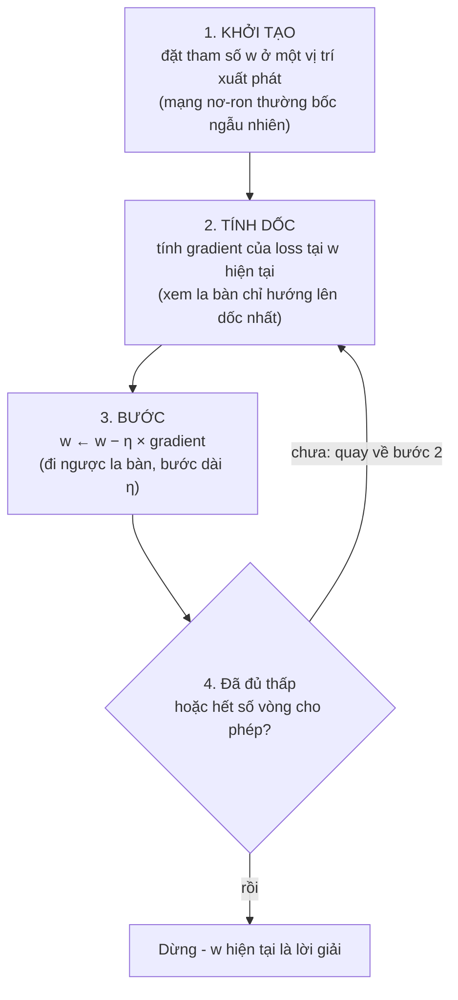
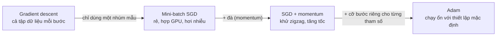

> **Mục tiêu bài học:** Sau bài này, bạn sẽ chạy tay được thuật toán gradient descent trên một ví dụ nhỏ, hiểu vai trò sống còn của learning rate, phân biệt batch / stochastic / mini-batch gradient descent, và nắm trực giác của momentum và Adam - những "đôi chân" đang bước xuống địa hình loss trong hầu hết các dự án deep learning.

## 1. Người xuống núi trong sương mù - giờ đi từng bước một

Bạn đứng đâu đó trên sườn núi, sương mù dày đến mức chỉ thấy vài bước quanh mình. Chân núi ở đâu - không biết. Thứ duy nhất bạn có là cảm giác dưới bàn chân: đất đang dốc về phía nào. Bạn làm gì? Bước một bước về phía dốc xuống. Cảm nhận lại. Bước tiếp.

Đó là toàn bộ thuật toán. Bài 10 khép lại với hình ảnh loss là một **địa hình** trên không gian tham số, và huấn luyện là **tìm điểm thấp trong thung lũng**; Bài 01 đã gieo sẵn hình ảnh **người xuống núi trong sương mù**. Giờ ghép hai thứ lại: "cảm nhận độ dốc dưới chân" chính là **gradient** - chiếc la bàn của Bài 09, luôn chỉ hướng làm hàm số **tăng nhanh nhất** tại chỗ đang đứng. Muốn *xuống*, đi **ngược** hướng la bàn. Tên đầy đủ của thuật toán: **gradient descent (hạ dốc theo gradient)**, gói trong 4 bước:



$\eta$ (eta) là **learning rate (tốc độ học)** - một số dương nhỏ do *bạn* chọn trước, quyết định mỗi bước chân dài bao nhiêu. Đây là ví dụ đầu tiên bạn gặp về **siêu tham số (hyperparameter)**: con số điều khiển *quá trình học* chứ không được học từ dữ liệu (Bài 13 sẽ bàn kỹ).

Điều đáng ngạc nhiên: thuật toán **không bao giờ nhìn thấy đáy**. Nó chỉ biết độ dốc ngay dưới chân - và chừng đó đủ để huấn luyện từ mô hình 2 núm vặn (mục 7) đến mạng hàng tỷ tham số.

## 2. Chạy tay 4 vòng: nhìn thuật toán "bò" về đáy

Lấy hàm loss đồ chơi $f(w) = w^2$ - một lòng chảo có đáy tại $w=0$, đạo hàm $f'(w) = 2w$ (ôn Bài 09). Ta biết trước đáp án là 0, nên đây là cơ hội xem thuật toán *tự mò ra* đáp án đó. Khởi tạo $w_0 = 10$, chọn $\eta = 0{,}2$ (đây cũng chính là ví dụ mở màn chương Optimization của sách *Dive into Deep Learning*):

| Vòng | $w$ hiện tại | Gradient $2w$ | Bước đi $-\eta \cdot 2w$ | $w$ mới | Loss $w^2$ mới |
|---|---|---|---|---|---|
| 1 | 10 | 20 | −4,0 | 6,0 | 36,0 |
| 2 | 6,0 | 12 | −2,4 | 3,6 | 12,96 |
| 3 | 3,6 | 7,2 | −1,44 | 2,16 | ≈ 4,67 |
| 4 | 2,16 | 4,32 | −0,864 | 1,296 | ≈ 1,68 |

Ba điều đáng ngắm trong bảng:

- **Với learning rate phù hợp, loss giảm dần qua từng vòng**: 100 → 36 → 12,96 → 4,67 → 1,68. Thuật toán hoạt động. (Mục 3 cho thấy chuyện gì xảy ra khi $\eta$ *không* phù hợp.)
- **Dấu của gradient tự chỉ đúng hướng**: $w$ dương → gradient dương → bước đi *âm* (lùi về 0). Khởi tạo $w_0 = -10$ thì gradient âm, bước đi tự động *dương* - vẫn về 0. Ta không hề "dạy" nó hướng nào; dấu trừ trong công thức lo hết.
- **Bước chân tự ngắn dần**: càng gần đáy, dốc càng thoải, gradient càng nhỏ → bước −4,0 rồi −2,4 rồi −1,44... Người xuống núi tự đi chậm lại khi đất bằng dần - một tính chất rất đẹp mà ta được "miễn phí".

> 🔧 **Thử ngay:** Cũng $f(w) = w^2$, nhưng khởi tạo $w_0 = 4$ và $\eta = 0{,}25$. Chạy tay 2 vòng.
> Vòng 1: gradient $2 \times 4 = 8$, bước $-0{,}25 \times 8 = -2$, $w$ mới $= 2$. Vòng 2: gradient $4$, bước $-1$, $w$ mới $= 1$.
> Đáp số: **4 → 2 → 1** (loss 16 → 4 → 1). Ra số khác? Kiểm tra lại dấu trừ ở bước 3.

## 3. Learning rate: cỡ bước chân quyết định thành bại

Cùng bài toán trên, chỉ đổi $\eta$:

**Quá nhỏ ($\eta = 0{,}01$):** $w$ đi 10 → 9,8 → 9,604 → 9,412... Mỗi bước chỉ nhích 2%. Vẫn *sẽ* tới đáy, nhưng cần hàng trăm vòng cho bài toán mà $\eta=0{,}2$ giải trong chục vòng - với mô hình thật, đó có thể là khác biệt giữa vài giờ và vài tuần huấn luyện.

**Quá lớn ($\eta = 1{,}1$):** $w$ đi 10 → **−12** → **14,4** → **−17,28** → **20,74**... Mỗi bước dài đến mức không chỉ *vọt qua đáy* sang sườn bên kia, mà còn văng ra **xa hơn** chỗ cũ. Loss không giảm mà tăng vô hạn - hiện tượng **phân kỳ (divergence)**.

```
   η quá nhỏ:                η vừa:                  η quá lớn:
   \                 /       \                 /      \ (3)         (2) /
    \               /         \               /        \  \         /  /
     \ ●●          /           \ ●           /          \  \ (1)● /  /
      \  ●●●      /             \  ●        /            \  \   /  /
       \    ●●●● /               \   ●     /              \  ●←──●──→ văng
        \_______/                 \___●●__/                \___╳___/  ngày càng xa
      rề rề mãi chưa tới         tới đáy gọn gàng         vọt qua đáy, phân kỳ
```

> 🔧 **Thử ngay:** Xem phân kỳ bằng vài dòng Python:
>
> ```python
> w = 10.0
> for _ in range(4):
>     w -= 1.1 * 2 * w      # η = 1,1 - bước quá dài
>     print(round(w, 3))    # in ra: -12.0, 14.4, -17.28, 20.736
> ```
>
> Đổi `1.1` thành `0.2` rồi chạy lại: bạn phải thấy đúng cột "$w$ mới" của bảng ở mục 2 (6,0 → 3,6 → 2,16 → 1,296).

<details>
<summary><b>Đào sâu: một hệ số giải thích cả ba kịch bản</b></summary>

Trên $f(w) = w^2$, công thức cập nhật $w \leftarrow w - \eta \cdot 2w$ rút gọn thành $w_{\text{mới}} = (1 - 2\eta) \cdot w_{\text{cũ}}$. Mỗi vòng, $w$ chỉ bị nhân với một hệ số cố định:

| $\eta$ | Hệ số $1 - 2\eta$ | Chuyện gì xảy ra |
|---|---|---|
| 0,01 | 0,98 | co 2% mỗi vòng - rề rề |
| 0,2 | 0,6 | co 40% mỗi vòng - gọn gàng |
| 0,5 | 0 | về đúng đáy sau **một** bước |
| 1,1 | −1,2 | đổi dấu và phình 20% mỗi vòng - phân kỳ |

Hệ số có độ lớn nhỏ hơn 1 thì hội tụ, lớn hơn 1 thì phân kỳ. Chuyện "một bước là tới" ở $\eta = 0{,}5$ là may mắn riêng của parabol (độ dốc thay đổi đều đặn khắp nơi); với hàm loss thật, độ dốc thay đổi mỗi chỗ một kiểu nên nói chung không có $\eta$ nào đưa bạn về đáy trong một bước - và cũng vì thế mà bạn phải dò $\eta$.

</details>

Trong thực hành, chọn learning rate là một trong những quyết định quan trọng hàng đầu khi huấn luyện. Tin tốt: bạn không cần đoán mò một lần duy nhất - người ta thường thử vài giá trị cách nhau 10 lần (0,1 / 0,01 / 0,001...), quan sát đường cong loss, và có cả các kỹ thuật giảm dần $\eta$ theo thời gian (**learning rate schedule** - lịch learning rate) mà bạn sẽ gặp khi thực hành.

> ⚠️ **Lưu ý nhỏ:** Kịch bản $\eta = 1{,}1$ lấy đúng theo minh họa trong sách *Dive into Deep Learning* (chương Optimization, mục Gradient Descent). Kịch bản "quá nhỏ" trong sách dùng $\eta = 0{,}05$ - sau 10 bước, $w$ vẫn còn ở khoảng 3,5 trong khi $\eta = 0{,}2$ đã đưa $w$ xuống khoảng 0,06; ở trên ta dùng $\eta = 0{,}01$ để hiện tượng "rề rề" lộ rõ hơn.

## 4. Dùng bao nhiêu dữ liệu cho mỗi bước? Batch, SGD và mini-batch

Nãy giờ ta hạ dốc trên một hàm đồ chơi. Với mô hình thật, loss là **trung bình trên toàn bộ tập huấn luyện** - giả sử 1 triệu ảnh. Câu hỏi thực dụng đầu tiên: mỗi lần "cảm nhận độ dốc", phải tính gradient trên bao nhiêu ảnh? Ba lựa chọn:

| | **Batch GD** | **Stochastic GD (SGD)** | **Mini-batch SGD** |
|---|---|---|---|
| Dữ liệu mỗi bước | Toàn bộ tập train | **1 mẫu** ngẫu nhiên | Một nhúm (ví dụ **32-256** mẫu) |
| Chi phí mỗi bước | Rất đắt (1 triệu mẫu → 1 triệu phép tính gradient cho *một* bước) | Rẻ nhất | Vừa phải |
| Hướng đi | Chính xác, mượt | **Nhiễu** - mẫu lẻ có thể chỉ lệch hướng | Khá ổn định (trung bình nhúm mẫu đã khử bớt nhiễu) |
| Tận dụng GPU | Tốt nhưng mỗi bước quá lâu | Kém - GPU giỏi tính cả khối ma trận, cho 1 mẫu thì phí sức | **Tốt** - đây là lý do thực dụng lớn nhất |

**Mini-batch là thỏa hiệp được dùng rộng rãi trong deep learning**: đủ rẻ để bước nhanh, đủ nhiều mẫu để hướng đi không quá nhiễu, và vừa khéo với sở trường tính toán theo khối của GPU. Sách *Dive into Deep Learning* gợi ý cỡ batch **32-256** (ưu tiên lũy thừa của 2) là một điểm khởi đầu tốt - đó là ví dụ khởi đầu, không phải quy tắc (xem Lưu ý cuối mục). Một chi tiết dễ gây bối rối: khi tài liệu hay thư viện nói "SGD", họ thường ngầm hiểu là *mini-batch* SGD.

Hai thuật ngữ bạn sẽ gặp hằng ngày:

- **Batch size**: số mẫu trong mỗi nhúm (mỗi bước cập nhật).
- **Epoch**: một lượt đi *hết* tập huấn luyện. Ví dụ 10.000 ảnh, batch size 100 → mỗi epoch gồm 100 bước cập nhật; train 30 epoch nghĩa là mô hình "nhìn" mỗi tấm ảnh 30 lần.

> 🔧 **Thử ngay:** Tập train có 6.400 ảnh, batch size 64. Mỗi epoch gồm bao nhiêu bước cập nhật? Train 30 epoch thì tổng cộng bao nhiêu bước, và mỗi tấm ảnh được "nhìn" bao nhiêu lần?
> Đáp số: 6.400 / 64 = **100 bước/epoch**; 30 epoch = **3.000 bước**; mỗi ảnh được nhìn **30 lần** (một lần mỗi epoch).

### Nhiễu của SGD - khuyết điểm có ích

Hướng đi nhiễu nghe như nhược điểm thuần túy, nhưng có một mặt tích cực đáng nhắc. Địa hình loss của mạng sâu (Bài 10) có nhiều thung lũng nhỏ - các **cực tiểu địa phương (local minimum)**. Gradient descent "sạch" mà đi tới đáy một hõm cạn thì gradient bằng 0, hết đường, đứng im. Còn bước chân nhiễu của SGD thì *rung lắc*, và cú rung đôi khi đủ để hất ta văng khỏi hõm cạn, tiếp tục xuống chỗ thấp hơn - sách *Dive into Deep Learning* xem đây là một trong những tính chất có lợi của mini-batch SGD.

> ⚠️ **Lưu ý nhỏ:**
> - Cỡ batch 32-256 là kinh nghiệm khởi đầu chứ không phải quy tắc chung: sách *Dive into Deep Learning* nói rõ batch size phù hợp còn tùy lượng bộ nhớ, số bộ tăng tốc (GPU), kiểu tầng mạng và kích thước tập dữ liệu.
> - "Nhiễu giúp thoát hõm cạn" là trực giác được chấp nhận rộng rãi chứ không phải bảo chứng: nhiễu không *đảm bảo* thoát mọi cực tiểu xấu. Sách *Dive into Deep Learning* liệt kê ba thách thức của tối ưu hóa mạng sâu - cực tiểu địa phương, **điểm yên ngựa (saddle point)** (gradient bằng 0 nhưng không phải đáy: xuống theo chiều này, lên theo chiều kia) và **gradient tiêu biến (vanishing gradient)** ở những vùng phẳng - và bức tranh đầy đủ về địa hình loss của mạng sâu vẫn là chủ đề nghiên cứu.

## 5. Momentum: quả bóng lăn có đà

Có một dạng địa hình rất hay gặp khiến người đi bộ khổ sở: **khe núi hẹp** - dốc đứng theo hai vách, thoai thoải theo lòng khe. Gradient theo vách lớn hơn nhiều so với gradient dọc khe, nên người đi bộ - mỗi bước chỉ nhìn độ dốc *ngay dưới chân* - cứ **zigzag** đập qua đập lại giữa hai vách, trong khi tiến dọc lòng khe rất chậm:

```
   GD thường: zigzag             Momentum: đà khử zigzag
   ═══════════════════           ═══════════════════
    ●                             ●
     ╲   ╱╲   ╱╲                   ╲__
      ╲ ╱  ╲ ╱  ╲  →                  ╲______
       ╳    ╳    ╲                           ╲_____ →
   ═══════════════════           ═══════════════════
     (vách khe núi)                 tiến nhanh dọc lòng khe
```

Giờ thay người đi bộ bằng **quả bóng nặng lăn xuống**. Bóng tích lũy **đà (momentum)**: hướng lăn hiện tại là "trung bình có trọng số" của các đoạn dốc *đã đi qua*, dốc gần đây ảnh hưởng nhiều hơn dốc xa xưa. Đà giải quyết bài toán khe hẹp rất đẹp: các cú đập *trái-phải* ngược dấu nhau nên khi lấy trung bình thì **tự triệt tiêu**, còn thành phần *tiến dọc khe* luôn cùng hướng nên được **cộng dồn ngày càng nhanh**. Kết quả: đường đi mượt hơn và thường về đáy nhanh hơn hẳn. (Bài viết tương tác *Why Momentum Really Works* trên Distill - link ở Đọc thêm - cho bạn nghịch trực tiếp hiện tượng này.)

## 6. Adam: đà + cỡ bước riêng cho từng tham số

Một mạng nơ-ron có hàng triệu núm vặn, và độ dốc theo các "chiều" khác nhau có thể chênh nhau khủng khiếp. Một learning rate chung cho tất cả giống như bắt cả đoàn leo núi, người chân dài người chân ngắn, phải đi cùng một cỡ bước. **Adam** (viết tắt của *Adaptive Moment Estimation*, do Kingma và Ba đề xuất năm 2014) ghép hai ý tưởng:

1. **Momentum** - giữ đà như mục 5;
2. **Tự điều chỉnh cỡ bước cho từng tham số**: Adam theo dõi độ lớn gradient gần đây của *từng* tham số; tham số nào gradient thường xuyên lớn thì bước ngắn lại cho cẩn thận, tham số nào gradient bé xíu thì bước rộng hơn.

Nhờ vậy Adam thường chạy khá ổn ngay với thiết lập mặc định (các hệ số $\beta_1 = 0{,}9$, $\beta_2 = 0{,}999$ ít khi phải đụng đến), ít đòi hỏi dò learning rate tỉ mỉ hơn SGD thuần - và trở thành **một lựa chọn khởi đầu rất phổ biến**; một số công cụ huấn luyện cấp cao còn đặt Adam, hoặc biến thể **AdamW** (hay gặp khi huấn luyện Transformer), làm cấu hình mặc định. Thông điệp thực dụng cho người mới: **bắt đầu với Adam là một lựa chọn hợp lý và phổ biến, nhưng đừng coi nó là chân lý duy nhất** (xem Lưu ý cuối mục).

Tuyến tiến hóa để bạn ghi nhớ:



> ⚠️ **Lưu ý nhỏ:** Adam *không* phải lúc nào cũng cho kết quả cuối tốt hơn: có những nghiên cứu và bài toán (đặc biệt trong thị giác máy tính) mà SGD + momentum được điều chỉnh cẩn thận khái quát hóa tốt hơn; sách *Dive into Deep Learning* cũng dẫn lại các tình huống Adam gặp trục trặc hội tụ, thậm chí phân kỳ (Reddi và cộng sự, 2019).

## 7. Tự tay viết gradient descent bằng 15 dòng Python

Khép lại bằng code thuần Python (không thư viện) - giải lại bài **thợ ống nước** của Bài 01: từ 2 hóa đơn (2 giờ → 250 nghìn, 3 giờ → 350 nghìn), tìm mô hình `tiền = a × giờ + b`. Ở Bài 01 bạn nhẩm ra a = 100, b = 50; giờ để gradient descent tự tìm:

```python
# Dữ liệu: (số giờ, tiền công nghìn đồng) - ví dụ thợ ống nước ở Bài 01
X = [2, 3]
Y = [250, 350]

a, b = 0.0, 0.0        # khởi tạo tham số (bước 1: rơi đại xuống sườn núi)
lr = 0.05              # learning rate - cỡ bước chân

for epoch in range(5000):
    # Bước 2: tính gradient của MSE theo a và theo b
    # (đạo hàm của trung bình (a*x + b - y)^2 - quy tắc chuỗi, Bài 09)
    grad_a = sum(2 * (a*x + b - y) * x for x, y in zip(X, Y)) / len(X)
    grad_b = sum(2 * (a*x + b - y)     for x, y in zip(X, Y)) / len(X)
    # Bước 3: bước ngược hướng gradient
    a -= lr * grad_a
    b -= lr * grad_b

print(f"a = {a:.2f}, b = {b:.2f}")   # in ra: a = 100.00, b = 50.00
```

Chạy xong, máy in ra đúng **a = 100.00, b = 50.00** - trùng khớp con số bạn nhẩm tính ở Bài 01, nhưng lần này máy *tự tìm ra* chỉ bằng "tính dốc rồi bước ngược dốc" lặp lại nhiều lần. Toàn bộ deep learning, từ mô hình 2 tham số này đến mạng hàng tỷ tham số, chạy trên đúng vòng lặp đó - chỉ khác ở chỗ hàm loss phức tạp hơn, cách tính gradient tự động hơn (backpropagation), và optimizer tinh vi hơn như Adam.

## Tóm tắt bài học

- **Gradient descent** = lặp lại: tính gradient của loss tại vị trí hiện tại, rồi cập nhật $w \leftarrow w - \eta \cdot \text{gradient}$. Dấu trừ tự lo hướng đi; với địa hình trơn như $w^2$ thì gradient nhỏ dần khi tới gần đáy nên bước chân tự ngắn lại.
- **Learning rate** $\eta$ là siêu tham số then chốt: quá nhỏ → hội tụ rề rề; quá lớn → vọt qua đáy, có thể **phân kỳ** (ví dụ $\eta=1{,}1$ trên $f(w)=w^2$: $w$ văng 10 → −12 → 14,4 → ...).
- **Batch GD** dùng cả tập dữ liệu mỗi bước (chính xác, đắt); **SGD** dùng 1 mẫu (rẻ, nhiễu); **mini-batch SGD** (ví dụ 32-256 mẫu) là thỏa hiệp được dùng rộng rãi, hợp sở trường GPU.
- **Epoch** = một lượt qua hết tập train; **batch size** = số mẫu mỗi bước cập nhật.
- Nhiễu của SGD không hẳn xấu: cú rung lắc có thể giúp thoát các hõm cạn (cực tiểu địa phương) - một trực giác được chấp nhận rộng rãi, không phải bảo chứng tuyệt đối.
- **Momentum** = quả bóng lăn có đà: trung bình các gradient quá khứ, khử zigzag trong khe hẹp, tăng tốc theo hướng ổn định.
- **Adam** = momentum + tự chỉnh cỡ bước cho từng tham số; chạy ổn với thiết lập mặc định nên được dùng rộng rãi làm lựa chọn khởi đầu - nhưng không phải lúc nào cũng vượt SGD + momentum được tinh chỉnh kỹ.

## Câu hỏi tự kiểm tra

1. Viết lại 4 bước của gradient descent theo trí nhớ. Vì sao trong công thức cập nhật lại có dấu **trừ** trước $\eta \cdot \text{gradient}$?
2. **(Tính tay)** Với $f(w) = w^2$ (gradient $2w$), khởi tạo $w_0 = 4$ và $\eta = 0{,}25$: chạy 2 vòng gradient descent, ghi rõ gradient, bước đi và $w$ mới ở mỗi vòng. Sau 2 vòng, $w$ bằng bao nhiêu?
3. **(Tính tay)** Cũng $f(w)=w^2$, $w_0 = 4$ nhưng $\eta = 1{,}5$: tính $w$ sau 2 vòng. Hiện tượng gì đang xảy ra và tên gọi của nó là gì?
4. Tập train có 50.000 ảnh, batch size 250. Một epoch gồm bao nhiêu bước cập nhật? Train 20 epoch thì tổng cộng bao nhiêu bước?
5. Vì sao mini-batch SGD được ưa dùng hơn cả batch GD lẫn SGD 1-mẫu trong deep learning? Nêu ít nhất 2 lý do.
6. Một người nói: *"Adam là optimizer tốt nhất, cứ dùng Adam là xong, khỏi nghĩ."* Bạn sẽ phản biện thế nào cho cân bằng?

## Đọc thêm

**Nguồn nền tảng của bài:**

| Nguồn | Đọc phần nào |
|---|---|
| **Dive into Deep Learning (d2l.ai)** | Chương 12 - *Optimization Algorithms*: mục Gradient Descent (ví dụ $w^2$, learning rate quá nhỏ/quá lớn), Stochastic Gradient Descent, Minibatch SGD, Momentum (leaky average, bài toán khe hẹp), Adam; Chương 3.1.3 - minibatch SGD trong hồi quy tuyến tính |
| **Mathematics for Machine Learning (MML)** | Chương 7.1 - *Optimization Using Gradient Descent*: trình bày toán học gọn gàng của hạ dốc và momentum |

**Nguồn online bổ sung (miễn phí):**

- [Why Momentum Really Works (Distill)](https://distill.pub/2017/momentum/) - bài viết tương tác nổi tiếng của Gabriel Goh: kéo thanh trượt learning rate và momentum, xem quỹ đạo đổi theo thời gian thực (bản thân sách *Dive into Deep Learning* cũng dẫn bài này).
- [Interactive Visualization of Optimization Algorithms (Emilien Dupont)](https://emiliendupont.github.io/2018/01/24/optimization-visualization/) - thả điểm xuất phát lên địa hình loss và xem SGD, momentum, RMSProp, Adam đua nhau xuống đáy.
- [Machine Learning cơ bản - bài Gradient Descent](https://machinelearningcoban.com/2017/01/12/gradientdescent/) - giải thích gradient descent bằng tiếng Việt với nhiều hình minh họa.

> **Bài tiếp theo:** [Chuẩn bị dữ liệu cho Machine Learning](../data-preparation-for-machine-learning-vi/) - thuật toán tối ưu đã sẵn sàng, nhưng "garbage in, garbage out" - ở bài sau bạn sẽ học cách làm sạch, chuẩn hóa và chuẩn bị dữ liệu để việc huấn luyện thực sự hiệu quả.
