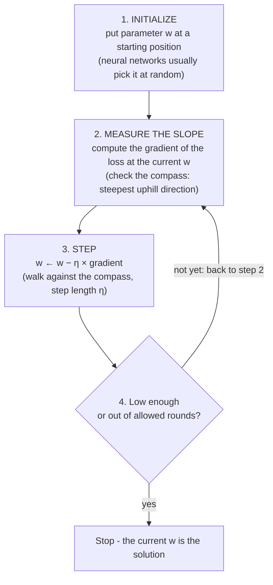
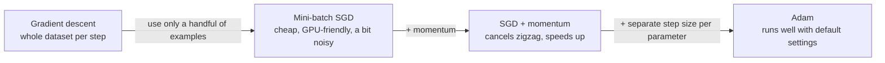

> **Learning objectives:** After this lesson, you will be able to run the gradient descent algorithm by hand on a small example, understand the vital role of the learning rate, distinguish batch / stochastic / mini-batch gradient descent, and grasp the intuition behind momentum and Adam - the "legs" walking down the loss landscape in most deep learning projects.

## 1. The hiker in the fog - now one step at a time

You are standing somewhere on a mountainside, in fog so thick you can only see a few steps around you. Where is the foot of the mountain - you don't know. The only thing you have is the feeling under your feet: which way the ground slopes. What do you do? Take one step downhill. Feel again. Take the next step.

That is the entire algorithm. Lesson 10 closed with the image of the loss as a **landscape** over parameter space, and of training as **finding a low point in the valley**; Lesson 01 had already planted the image of **the hiker descending in the fog**. Now put the two together: "feeling the slope under your feet" is exactly the **gradient** - the compass from Lesson 09, which always points in the direction where the function **increases fastest** at the spot where you stand. To go *down*, walk **against** the compass. The algorithm's full name: **gradient descent**, packed into 4 steps:



$\eta$ (eta) is the **learning rate** - a small positive number that *you* choose in advance, which decides how long each step is. This is the first example you meet of a **hyperparameter**: a number that controls *the learning process* rather than being learned from data (Lesson 13 will discuss this in detail).

The surprising part: the algorithm **never sees the bottom**. It only knows the slope right under its feet - and that is enough to train everything from the 2-knob model (Section 7) to networks with billions of parameters.

## 2. Running 4 rounds by hand: watching the algorithm "crawl" toward the bottom

Take the toy loss function $f(w) = w^2$ - a bowl with its bottom at $w=0$, derivative $f'(w) = 2w$ (revisit Lesson 09). We know in advance that the answer is 0, so this is a chance to watch the algorithm *find* that answer on its own. Initialize $w_0 = 10$, choose $\eta = 0.2$ (this is also the very example that opens the Optimization chapter of the book *Dive into Deep Learning*):

| Round | Current $w$ | Gradient $2w$ | Step $-\eta \cdot 2w$ | New $w$ | New loss $w^2$ |
|---|---|---|---|---|---|
| 1 | 10 | 20 | −4.0 | 6.0 | 36.0 |
| 2 | 6.0 | 12 | −2.4 | 3.6 | 12.96 |
| 3 | 3.6 | 7.2 | −1.44 | 2.16 | ≈ 4.67 |
| 4 | 2.16 | 4.32 | −0.864 | 1.296 | ≈ 1.68 |

Three things worth admiring in the table:

- **With a suitable learning rate, the loss decreases round after round**: 100 → 36 → 12.96 → 4.67 → 1.68. The algorithm works. (Section 3 shows what happens when $\eta$ is *not* suitable.)
- **The sign of the gradient points the right way by itself**: $w$ positive → gradient positive → step *negative* (back toward 0). Initialize $w_0 = -10$ and the gradient is negative, the step automatically *positive* - still heading to 0. We never "taught" it which way to go; the minus sign in the formula takes care of everything.
- **The steps shrink on their own**: the closer to the bottom, the gentler the slope, the smaller the gradient → steps of −4.0, then −2.4, then −1.44... The hiker slows down by themselves as the ground levels out - a very elegant property we get "for free".

> 🔧 **Try it now:** Same $f(w) = w^2$, but initialize $w_0 = 4$ and $\eta = 0.25$. Run 2 rounds by hand.
> Round 1: gradient $2 \times 4 = 8$, step $-0.25 \times 8 = -2$, the new $w$ is $2$. Round 2: gradient $4$, step $-1$, the new $w$ is $1$.
> Answer: **4 → 2 → 1** (loss 16 → 4 → 1). Got a different number? Double-check the minus sign in step 3.

## 3. Learning rate: the step size decides success or failure

Same problem as above, only $\eta$ changes:

**Too small ($\eta = 0.01$):** $w$ goes 10 → 9.8 → 9.604 → 9.412... Each step moves only 2%. It *will* still reach the bottom, but it needs hundreds of rounds for a problem that $\eta=0.2$ solves in about ten - with a real model, that can be the difference between a few hours and a few weeks of training.

**Too large ($\eta = 1.1$):** $w$ goes 10 → **−12** → **14.4** → **−17.28** → **20.74**... Each step is so long that it *overshoots the bottom* onto the other side, and lands **farther** away than where it started. The loss does not decrease but grows without bound - the phenomenon of **divergence**.

```
   η too small:               η just right:            η too large:
   \                 /       \                 /      \ (3)         (2) /
    \               /         \               /        \  \         /  /
     \ ●●          /           \ ●           /          \  \ (1)● /  /
      \  ●●●      /             \  ●        /            \  \   /  /
       \    ●●●● /               \   ●     /              \  ●←──●──→ flung
        \_______/                 \___●●__/                \___╳___/  farther and farther
      crawling, never arrives    reaches the bottom neatly  overshoots, diverges
```

> 🔧 **Try it now:** Watch divergence with a few lines of Python:
>
> ```python
> w = 10.0
> for _ in range(4):
>     w -= 1.1 * 2 * w      # η = 1.1 - step too long
>     print(round(w, 3))    # prints: -12.0, 14.4, -17.28, 20.736
> ```
>
> Change `1.1` to `0.2` and run again: you should see exactly the "New $w$" column of the table in Section 2 (6.0 → 3.6 → 2.16 → 1.296).

<details>
<summary><b>Going deeper: one factor explains all three scenarios</b></summary>

On $f(w) = w^2$, the update formula $w \leftarrow w - \eta \cdot 2w$ simplifies to $w_{\text{new}} = (1 - 2\eta) \cdot w_{\text{old}}$. Each round, $w$ is simply multiplied by a fixed factor:

| $\eta$ | Factor $1 - 2\eta$ | What happens |
|---|---|---|
| 0.01 | 0.98 | shrinks 2% per round - crawling |
| 0.2 | 0.6 | shrinks 40% per round - neat |
| 0.5 | 0 | lands exactly at the bottom after **one** step |
| 1.1 | −1.2 | flips sign and grows 20% per round - divergence |

A factor with magnitude less than 1 converges; greater than 1 diverges. The "one step and you're there" at $\eta = 0.5$ is a special stroke of luck of the parabola (its slope changes uniformly everywhere); with a real loss function, the slope changes differently at every spot, so in general no $\eta$ takes you to the bottom in one step - and that is also why $\eta$ has to be searched for.

</details>

In practice, choosing the learning rate is one of the most important decisions when training. The good news: you don't have to guess blindly just once - people usually try a few values spaced 10 times apart (0.1 / 0.01 / 0.001...), watch the loss curve, and there are also techniques that gradually decrease $\eta$ over time (a **learning rate schedule**) that you will meet in practice.

> ⚠️ **A small note:** The $\eta = 1.1$ scenario is taken directly from the illustration in the book *Dive into Deep Learning* (chapter Optimization, section Gradient Descent). The "too small" scenario in the book uses $\eta = 0.05$ - after 10 steps, $w$ is still around 3.5 while $\eta = 0.2$ has already brought $w$ down to around 0.06; above we use $\eta = 0.01$ to make the "crawling" more visible.

## 4. How much data per step? Batch, SGD and mini-batch

So far we have been descending on a toy function. With a real model, the loss is **the average over the entire training set** - say 1 million images. The first practical question: each time we "feel the slope", over how many images must the gradient be computed? Three options:

| | **Batch GD** | **Stochastic GD (SGD)** | **Mini-batch SGD** |
|---|---|---|---|
| Data per step | The whole training set | **1 random example** | A handful (for example **32-256** examples) |
| Cost per step | Very expensive (1 million examples → 1 million gradient computations for *one* step) | Cheapest | Moderate |
| Direction | Accurate, smooth | **Noisy** - a single example can point the wrong way | Fairly stable (averaging a handful of examples cancels some of the noise) |
| GPU utilization | Good but each step takes too long | Poor - GPUs excel at whole blocks of matrices; for 1 example that is wasted effort | **Good** - this is the biggest practical reason |

**Mini-batch is the compromise used widely in deep learning**: cheap enough to step quickly, enough examples that the direction is not too noisy, and a neat fit for the GPU's strength in block computation. The book *Dive into Deep Learning* suggests a batch size of **32-256** (preferably a power of 2) as a good starting point - that is a starting example, not a rule (see the Note at the end of this section). A detail that easily causes confusion: when documents or libraries say "SGD", they usually implicitly mean *mini-batch* SGD.

Two terms you will meet every day:

- **Batch size**: the number of examples in each handful (each update step).
- **Epoch**: one pass through the *entire* training set. For example, 10,000 images, batch size 100 → each epoch consists of 100 update steps; training for 30 epochs means the model "sees" each image 30 times.

> 🔧 **Try it now:** The training set has 6,400 images, batch size 64. How many update steps are there in each epoch? Training for 30 epochs, how many steps in total, and how many times is each image "seen"?
> Answer: 6,400 / 64 = **100 steps/epoch**; 30 epochs = **3,000 steps**; each image is seen **30 times** (once per epoch).

### The noise of SGD - a useful flaw

A noisy direction sounds like a pure drawback, but there is a positive side worth mentioning. The loss landscape of a deep network (Lesson 10) has many small valleys - **local minima**. "Clean" gradient descent that reaches the bottom of a shallow dip has gradient 0, nowhere to go, and stands still. But the noisy steps of SGD *jiggle*, and the jiggle is sometimes enough to knock us out of a shallow dip and continue toward a lower spot - the book *Dive into Deep Learning* regards this as one of the beneficial properties of mini-batch SGD.

> ⚠️ **A small note:**
> - The 32-256 batch size is a starting rule of thumb, not a universal rule: the book *Dive into Deep Learning* states clearly that the suitable batch size also depends on the amount of memory, the number of accelerators (GPUs), the type of network layers, and the size of the dataset.
> - "Noise helps escape shallow dips" is a widely accepted intuition, not a guarantee: noise does not *guarantee* escaping every bad minimum. The book *Dive into Deep Learning* lists three challenges of deep network optimization - local minima, **saddle points** (gradient 0 but not a bottom: downhill in one direction, uphill in another) and **vanishing gradients** in flat regions - and the full picture of the loss landscape of deep networks is still a research topic.

## 5. Momentum: a rolling ball with inertia

There is a very common type of terrain that makes a walker miserable: a **narrow ravine** - steep along the two walls, gently sloping along the floor. The gradient across the walls is much larger than the gradient along the ravine, so the walker - who at each step only looks at the slope *right under their feet* - keeps **zigzagging** back and forth between the two walls while advancing along the floor very slowly:

```
   Plain GD: zigzag              Momentum: inertia cancels the zigzag
   ═══════════════════           ═══════════════════
    ●                             ●
     ╲   ╱╲   ╱╲                   ╲__
      ╲ ╱  ╲ ╱  ╲  →                  ╲______
       ╳    ╳    ╲                           ╲_____ →
   ═══════════════════           ═══════════════════
     (ravine walls)                 advances quickly along the floor
```

Now replace the walker with a **heavy ball rolling downhill**. The ball accumulates **momentum**: its current rolling direction is a "weighted average" of the slopes it has *already passed over*, with recent slopes counting more than distant ones. Momentum handles the narrow ravine beautifully: the *left-right* bounces have opposite signs, so when averaged they **cancel each other out**, while the *forward along the ravine* component always points the same way and so **accumulates faster and faster**. The result: a smoother path that usually reaches the bottom much faster. (The interactive article *Why Momentum Really Works* on Distill - link in Further reading - lets you play with this phenomenon directly.)

## 6. Adam: momentum + a separate step size for each parameter

A neural network has millions of knobs, and the slopes along the different "dimensions" can differ enormously. One learning rate shared by all of them is like forcing a whole climbing party of long-legged and short-legged people to use the same stride. **Adam** (short for *Adaptive Moment Estimation*, proposed by Kingma and Ba in 2014) combines two ideas:

1. **Momentum** - keeping inertia as in Section 5;
2. **Self-adjusting the step size for each parameter**: Adam tracks the recent gradient magnitude of *each* parameter; a parameter whose gradient is frequently large takes shorter steps to be careful, while a parameter with tiny gradients takes wider steps.

Thanks to this, Adam usually runs quite well right out of the box with default settings (the coefficients $\beta_1 = 0.9$, $\beta_2 = 0.999$ rarely need touching), demanding less meticulous learning rate tuning than plain SGD - and it has become **a very popular starting choice**; some high-level training tools even set Adam, or the **AdamW** variant (common when training Transformers), as the default configuration. The practical message for beginners: **starting with Adam is a reasonable and popular choice, but do not treat it as the only truth** (see the Note at the end of this section).

The line of evolution for you to remember:



> ⚠️ **A small note:** Adam does *not* always give better final results: there are studies and problems (especially in computer vision) where carefully tuned SGD + momentum generalizes better; the book *Dive into Deep Learning* also cites situations where Adam runs into convergence trouble, even divergence (Reddi et al., 2019).

## 7. Writing gradient descent yourself in 15 lines of Python

Let's close with pure Python code (no libraries) - solving the **plumber** problem of Lesson 01 again: from 2 invoices (2 hours → 250,000 VND, 3 hours → 350,000 VND), find the model `fee = a × hours + b`. In Lesson 01 you worked out a = 100, b = 50 in your head; now let gradient descent find it on its own:

```python
# Data: (hours, fee in thousand VND) - the plumber example from Lesson 01
X = [2, 3]
Y = [250, 350]

a, b = 0.0, 0.0        # initialize parameters (step 1: drop somewhere on the mountainside)
lr = 0.05              # learning rate - step length

for epoch in range(5000):
    # Step 2: compute the gradient of the MSE with respect to a and to b
    # (derivative of the mean of (a*x + b - y)^2 - chain rule, Lesson 09)
    grad_a = sum(2 * (a*x + b - y) * x for x, y in zip(X, Y)) / len(X)
    grad_b = sum(2 * (a*x + b - y)     for x, y in zip(X, Y)) / len(X)
    # Step 3: step against the gradient
    a -= lr * grad_a
    b -= lr * grad_b

print(f"a = {a:.2f}, b = {b:.2f}")   # prints: a = 100.00, b = 50.00
```

Once it finishes, the machine prints exactly **a = 100.00, b = 50.00** - matching the numbers you worked out in Lesson 01, but this time the machine *found them on its own* just by repeating "measure the slope, then step against it" many times. All of deep learning, from this 2-parameter model to networks with billions of parameters, runs on exactly that loop - only with a more complex loss function, a more automated way of computing gradients (backpropagation), and more sophisticated optimizers such as Adam.

## Lesson summary

- **Gradient descent** = repeat: compute the gradient of the loss at the current position, then update $w \leftarrow w - \eta \cdot \text{gradient}$. The minus sign takes care of the direction; on a smooth landscape like $w^2$, the gradient shrinks near the bottom, so the steps shorten by themselves.
- The **learning rate** $\eta$ is the key hyperparameter: too small → sluggish convergence; too large → overshoots the bottom, possibly **diverges** (for example $\eta=1.1$ on $f(w)=w^2$: $w$ is flung 10 → −12 → 14.4 → ...).
- **Batch GD** uses the whole dataset per step (accurate, expensive); **SGD** uses 1 example (cheap, noisy); **mini-batch SGD** (for example 32-256 examples) is the widely used compromise, suited to the GPU's strengths.
- **Epoch** = one pass through the whole training set; **batch size** = the number of examples per update step.
- SGD's noise is not necessarily bad: the jiggle can help escape shallow dips (local minima) - a widely accepted intuition, not an absolute guarantee.
- **Momentum** = a rolling ball with inertia: averages past gradients, cancels zigzag in narrow ravines, accelerates in the consistent direction.
- **Adam** = momentum + self-adjusted step size per parameter; runs well with default settings, so it is widely used as a starting choice - but it does not always beat well-tuned SGD + momentum.

## Self-check questions

1. Write down the 4 steps of gradient descent from memory. Why is there a **minus** sign before $\eta \cdot \text{gradient}$ in the update formula?
2. **(By hand)** For $f(w) = w^2$ (gradient $2w$), initialize $w_0 = 4$ and $\eta = 0.25$: run 2 rounds of gradient descent, writing out the gradient, the step and the new $w$ in each round. After 2 rounds, what is $w$?
3. **(By hand)** Same $f(w)=w^2$, $w_0 = 4$ but $\eta = 1.5$: compute $w$ after 2 rounds. What phenomenon is happening and what is it called?
4. The training set has 50,000 images, batch size 250. How many update steps are there in one epoch? Training for 20 epochs, how many steps in total?
5. Why is mini-batch SGD preferred over both batch GD and single-example SGD in deep learning? Give at least 2 reasons.
6. Someone says: *"Adam is the best optimizer, just use Adam and you're done, no need to think."* How would you push back in a balanced way?

## Further reading

**Primary sources for this lesson:**

| Source | Which part to read |
|---|---|
| **Dive into Deep Learning (d2l.ai)** | Chapter 12 - *Optimization Algorithms*: sections Gradient Descent (the $w^2$ example, learning rate too small/too large), Stochastic Gradient Descent, Minibatch SGD, Momentum (leaky average, the narrow ravine problem), Adam; Chapter 3.1.3 - minibatch SGD in linear regression |
| **Mathematics for Machine Learning (MML)** | Chapter 7.1 - *Optimization Using Gradient Descent*: a compact mathematical presentation of gradient descent and momentum |

**Additional free online sources:**

- [Why Momentum Really Works (Distill)](https://distill.pub/2017/momentum/) - Gabriel Goh's famous interactive article: drag the learning rate and momentum sliders and watch the trajectory change in real time (the book *Dive into Deep Learning* itself cites this article).
- [Interactive Visualization of Optimization Algorithms (Emilien Dupont)](https://emiliendupont.github.io/2018/01/24/optimization-visualization/) - drop a starting point onto a loss landscape and watch SGD, momentum, RMSProp and Adam race to the bottom.
- [Machine Learning cơ bản - Gradient Descent](https://machinelearningcoban.com/2017/01/12/gradientdescent/) - explains gradient descent in Vietnamese with many illustrations.

> **Next lesson:** [Data Preparation for Machine Learning](../data-preparation-for-machine-learning/) - the optimization algorithm is ready, but "garbage in, garbage out" - the next lesson teaches how to clean, normalize and prepare data so that training is truly effective.
