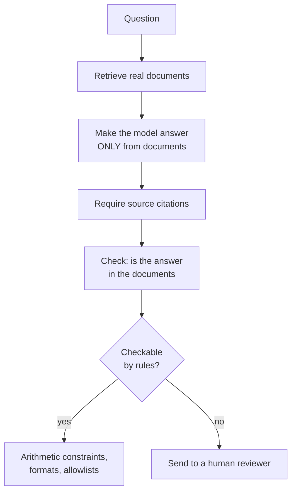

> **Learning objectives:** After this lesson, you will have seen four different ways a language model gets answers wrong, including one where every detail is real but the point in time is off. You will understand why the model's objective **does not guarantee** correctness, and why no single fix can guarantee it on its own. And you will have measurements showing why the question "are you sure?" **cannot be used** as a filter.

## 1. The objective promises nothing about correctness

Lesson 01 already laid the groundwork for this lesson. The model is optimized to **generate a high-probability continuation**, and at step 4,000 it wrote:

> *"PCA trên dữ liệu mới PCA thì hàm kích hoạt."* (roughly "PCA on new data PCA then activation function")

Correct spelling, correct style, correct technical terms, completely meaningless. That model has no mechanism for telling *correct* apart from *sounds correct* - it was never taught the difference.

Much larger models are far better, but **the nature of the objective does not change**: they are optimized to generate a high-probability continuation, **not to prove each claim**. And training data is full of confident text, so the continuation that *looks plausible* is often a confident answer.

That does not mean nothing can be done. Post-training **can** teach a model to decline, retrieval **can** anchor answers in real documents, and there are signals inside the model related to uncertainty. What is true is that **no single one of these steps guarantees correctness on its own** - correctness has to come from data, post-training, grounding in sources, verification and system design, taken together.

This lesson gives Qwen2.5-0.5B eight questions of four kinds and watches how it behaves.

## 2. Four questions with checkable answers

| Question | Answer | Model's answer | |
|---|---|---|---|
| Thủ đô của Việt Nam? (capital of Vietnam) | Hà Nội | *"Thủ đô của Việt Nam là Hà Nội."* (correct) | ✓ |
| Sông nào dài nhất Việt Nam? (longest river in Vietnam) | Đồng Nai | *"Để trả lời câu hỏi này một cách chính xác và chi tiết, tôi cần biết thêm thông tin…"* (it needs more information) | ✗ |
| Ai là tác giả Truyện Kiều? (author of The Tale of Kiều) | Nguyễn Du | *"Trong truyện Truyện Kiều của nhà văn **Nguyễn Ái Quốc**, tác giả chính là Nguyễn Ái Quốc."* | ✗ |
| Năm 2019 Việt Nam có bao nhiêu tỉnh thành? (provinces in 2019) | 63 | *"Theo thông tin từ trang web chính thức của Việt Nam (**https://www.vietnam.gov.vn/**), năm 2019 Việt Nam có tổng cộng **34** tỉnh và thành phố."* | ✗ |

(The dataset and the grading for this table are in `~/.cache/bookqa/gen09-results.json`.)

**1/4 correct.** But the rate is not the scariest part - the kind of error is.

**Row three is wrong with great confidence.** The author of The Tale of Kiều is Nguyễn Du; the model says **Nguyễn Ái Quốc** - a pen name of Hồ Chí Minh. It does not hesitate or hedge; it repeats the name twice in one sentence, which makes it sound even more certain.

**Row four is the subtlest case, and it is not simple fabrication.** Two details need to be separated.

First, the link `https://www.vietnam.gov.vn/` **is a real address** - the Vietnamese Government portal. The model did not invent a fake URL.

Second, the number **34 is not invented either**: since 12 June 2025, after the reorganization of administrative units, Vietnam has exactly **34 province-level administrative units** - 28 provinces and 6 centrally governed cities, down from 63.

The error lies elsewhere: the question asks about **the year 2019**, when the correct number was **63**. The model took a fact that is *true today*, attached it to a question *about the past*, and added a source that is *real* but says nothing of the kind.

This kind of error is far more dangerous than inventing a fake URL. A fake URL is exposed as soon as you check it. But a number that is correct-at-a-different-time, paired with an official source, **passes every visual check**: the reader sees a specific number, sees a `.gov.vn` domain, and believes it. To catch it you have to check against exactly the point in time the question is asking about.

**Row two is a different kind of failure:** talking around the question without ever giving an answer. Not wrong, but useless.

## 3. Three kinds of fabrication when the question itself is broken

The remaining four questions are designed so that no correct answer exists at all.

**A nonexistent source.** *"Hãy tóm tắt bài báo 'Phân tích mạng nơ-ron xoắn ốc bậc bảy' của Trần Văn Bảy (2021)."* (summarize a made-up paper, "Analysis of seventh-order spiral neural networks" by Trần Văn Bảy, 2021)

```
Xin lỗi, tôi không có thông tin cụ thể về bài báo "Phân tích mạng nơ-ron
xoắn ốc bậc bảy" của Trần Văn Bảy năm 2021. Tôi không thể cung cấp...
```

**It declines.** This is the correct behavior.

**A made-up person.** *"Kể tên ba công trình của nhà toán học Lê Thị Quỳnh Anh sinh năm 1834."* (name three works of the mathematician Lê Thị Quỳnh Anh, born 1834)

```
Là một trợ lý AI, tôi không có khả năng tìm kiếm thông tin chi tiết về
các nhà khoa học cụ thể như Lê Thị Quỳnh Anh...
```

It **declines** too. Two out of four.

**A made-up concept.** *"Giải thích định lý Nguyễn-Hoffmann về hội tụ của gradient descent."* (explain the Nguyễn-Hoffmann theorem on the convergence of gradient descent)

```
Định lý Nguyễn-Hoffmann là một định lý quan trọng trong lý thuyết tối ưu hóa
và học máy. Nó mô tả mối liên hệ giữa việc tập trung vào một đi...
```

No theorem by that name exists. The model **explains it** as if it were a real concept, places it in the right field, in the voice of a textbook ("an important theorem in optimization theory and machine learning").

**A false premise.** *"Vì sao thành phố Đà Lạt nằm ở đồng bằng sông Cửu Long?"* (why is the city of Đà Lạt located in the Mekong Delta?)

```
Đây là một câu hỏi thú vị và có nhiều lý do để trả lời...
1. Địa hình: Đà Lạt nằm ở phía Bắc của đồng bằng sông Cửu Long...
```

Đà Lạt is in the Central Highlands, hundreds of kilometers from the Mekong Delta. The model **accepts the false premise** and then builds a whole numbered argument on top of it ("an interesting question... 1. Terrain: Đà Lạt lies in the north of the Mekong Delta...").

The last two kinds are far more dangerous than the first two. **In these four prompts**, the two unfamiliar proper names were declined, while the concept and the premise that *have a plausible shape* were accepted. Four prompts do not make a rule, but the mechanism they suggest is very clear: "Định lý Nguyễn-Hoffmann" has exactly the shape of a real theorem - two surnames and a mathematical topic. The continuation that *looks plausible* is an explanation, so the model generates an explanation.

| Question type | Does the model decline? |
|---|---|
| Nonexistent source (paper) | **Yes** |
| Nonexistent person | **Yes** |
| Made-up but plausible-sounding concept | **No** - explains it as if real |
| False but plausible-sounding premise | **No** - accepts it and keeps reasoning |

## 4. Asking the model "are you sure?" - and the result

An idea that sounds very natural: if the model knows when it is unsure, we only need to ask it and filter accordingly.

Let's try it right away. After each answer, ask a follow-up (how confident, in percent, are you that the answer above is correct; reply with only a number from 0 to 100):

```
Bạn tự tin bao nhiêu phần trăm rằng câu trả lời trên đúng?
Chỉ trả lời một con số từ 0 đến 100.
```

Results across all eight questions - from the **correct** answer about Hà Nội to the **entirely fabricated** explanation of the Nguyễn-Hoffmann theorem:

| Question | Answer | Model's self-score |
|---|---|---|
| Capital of Vietnam | **correct** | `0` |
| Author of The Tale of Kiều | **wrong** | `0%` |
| Nguyễn-Hoffmann theorem | **fabricated** | `0%` |
| … all eight questions | | **`0` or `0%`** |

**The number is identical for every question.** That signal carries **exactly zero bits of information**: knowing it does not help separate a correct answer from a fabricated one, because it never changes.

This is worth reading carefully, because it is not a measurement error. I reran this part on its own to look at the raw string the model returns, and it really does write `'0'` or `'0%'` every time.

The reason is consistent with the whole chapter: **that "confidence" number is also just a token generated like every other token.** It *does* come out of the internal state - every token does - but it is **not a separately calibrated channel for measuring uncertainty**: nobody trained it so that the number matches the probability that the answer is correct, and it does not aggregate the probabilities of the steps already generated. It is the answer to a question, and the model guesses a plausible continuation - for this small model, that continuation happens to always be `0`.

> ⚠️ **A small note:** do not conclude from this that "every model returns a constant". Larger models usually produce more varied numbers that do correlate to some degree with correctness. What to take away is **the principle**, not the zero: *a score the model gives itself is a generated output, not a measurement*. If you want to use it as a filter, you have to **verify that correlation on your own task** - with a set of questions that have known answers, exactly as lessons 06 and 08 do.

This is also the fourth time in this series that we meet the same lesson, each time in a different place:

| Chapter | Phenomenon |
|---|---|
| Computer Vision · Lesson 01 | A photo of a fish is predicted as "wall clock" with probability **1.000** |
| Computer Vision · Lesson 12 | OCR reads "Trần" as "Trẩn" with confidence **1.000** |
| Lesson 10 of this chapter | Retrieval gives a score of **0.849** to a question with no answer in the collection |
| This lesson | The model scores itself **0** for both correct and fabricated answers |

Four completely different mechanisms - a classifier's softmax, a sequence recognizer's score, cosine similarity, and a generated token. The same conclusion: **a score produced by the system itself is not evidence of correctness.**

## 5. What can be done

You cannot assume the model will reliably notice and report its own errors - so every fix amounts to **bringing information or constraints in from outside**.



**Retrieval (RAG).** Instead of asking what the model *knows*, give it documents and tell it to answer based on them. This does not eliminate hallucination - the model can still say things that are not in the documents - but it creates something more important: **a basis for verification**. Lesson 12 does exactly this, and also measures whether the model knows to decline when the documents do not contain the answer.

**Checkable constraints.** Computer Vision · Lesson 12 is the best example: the three arithmetic identities of a receipt catch errors without needing any model. Anywhere the output must satisfy a rule - totals must match, codes must be on a list, dates must have the right format - write a rule to check it.

**Pushing back.** For a false premise like the Đà Lạt question, a prompt that asks the model to **check the premise before answering** helps somewhat. But lesson 08 already showed the limit: a prompt can shift the result, it cannot fix capability.

**Handing over to a human.** For tasks where mistakes are expensive, design the system so that hard cases go to a person instead of being approved automatically - in the same spirit as choosing a threshold by cost in Machine Learning · Lesson 12.

> 🔧 **Try it now:** your internal assistant answers questions about company policy and sounds very convincing. How do you know whether it is making things up?
> Build a set of questions whose **answers you know for certain**, of three kinds: questions whose answers are in the documents, questions about things the company **does not have** (see whether it invents a policy), and questions with a **false premise** - for example *"why does the 30-day leave policy apply from March?"* when the company has no such policy. The third kind reveals the most, just as section 3 showed, because models very often accept the premise and keep reasoning. And do not use the model itself to grade its own answers - section 4 just showed that this signal can carry exactly zero bits of information.

## Lesson summary

- The model is optimized to generate a **high-probability** continuation, not to prove each claim. Post-training can teach declining and retrieval can anchor to sources, but **no single step guarantees correctness on its own**.
- On four questions with answers, the model got **1/4** right. But the kind of error is more worrying than the rate.
- It said the author of The Tale of Kiều is **Nguyễn Ái Quốc**. And for the question about 2019, it answered **34 provinces and cities** citing `https://www.vietnam.gov.vn/` - but that link **is real** and the number 34 is also **correct today** (since 12 June 2025), only wrong for the year asked. **Mixing up points in time while citing a real source** is far harder to detect than an invented URL.
- Four kinds of fabrication, two blocked and two not: the model **declines** nonexistent sources and people, but **explains a made-up theorem as if real** and **accepts a false premise** and keeps reasoning.
- In the four prompts tried: unfamiliar proper names get declined; **concepts and premises with a plausible shape get accepted.**
- Asking the model to score its own confidence gives **`0` for all eight questions** - including the one it answered correctly. That signal carries **zero bits of information**.
- The self-score is also just a **generated token** - not a calibrated channel for measuring uncertainty.
- This is the fourth time in the series we reach the same conclusion, through four different mechanisms: **a score produced by the system itself is not evidence of correctness.**
- Every fix brings constraints in from outside: **retrieval**, **checkable constraints**, **checking premises**, and **handing hard cases to a human**.

## Self-check questions

1. What does a language model's objective optimize, and why does that not guarantee correctness? Name three things that can improve correctness, and why none of them guarantees it.
2. The model declines "nhà toán học Lê Thị Quỳnh Anh" (the mathematician Lê Thị Quỳnh Anh) but explains "định lý Nguyễn-Hoffmann" (the Nguyễn-Hoffmann theorem). Explain the difference.
3. The answer "34 provinces and cities" has a real source and a number that is correct today, and is only wrong about the point in time. Why is that kind of error more dangerous than an invented URL, and what check would you design to catch it?
4. What do questions with a false premise reveal that ordinary questions do not?
5. The model scores itself `0` for both correct and fabricated answers. Why does that make the signal useless, and why is it **not** a measurement error?
6. Why should you not conclude from the result in section 4 that "every model's self-scoring is useless"? How would you verify it on your own model?
7. List the four phenomena in this series that all lead to the conclusion "a self-assigned score is not evidence", and state the different mechanism behind each.
8. Design a set of hallucination-test questions for an internal document assistant. Name three kinds of questions and the purpose of each.

## Further reading

**Foundational sources for this lesson:**

| Source | What to read |
|---|---|
| **Lesson 01 of this chapter** | The model learns form before content; well-styled but meaningless sentences |
| **Lesson 10 of this chapter** | The retriever gives a high score to a question with no answer |
| **Computer Vision · Lessons 01 and 12** | Two cases of "confidence 1.000 but wrong" |
| **Machine Learning · Lesson 12** | Choosing a threshold by cost, and the rule of handing hard cases to a human |

**Additional online sources (free):**

- [Ji et al. - Survey of Hallucination in Natural Language Generation (ACM CSUR 2023)](https://arxiv.org/abs/2202.03629) - a taxonomy of hallucination types and their causes.
- [Lin, Hilton, Evans - TruthfulQA (ACL 2022)](https://arxiv.org/abs/2109.07958) - a benchmark focused on questions that models tend to answer wrongly with confidence.
- [Kadavath et al. - Language Models (Mostly) Know What They Know (2022)](https://arxiv.org/abs/2207.05221) - measures the correlation between self-reported confidence and correctness; read it to see why you should not generalize from a single model.
- [Xiong et al. - Can LLMs Express Their Uncertainty? (ICLR 2024)](https://arxiv.org/abs/2306.13063) - surveys ways of eliciting confidence and how reliable each one is.
- [Lewis et al. - Retrieval-Augmented Generation (NeurIPS 2020)](https://arxiv.org/abs/2005.11401) - the paper that laid the foundation for the main fix in section 5.

> **Next lesson:** [Text Embeddings and Retrieval](../text-embeddings-and-retrieval/) - this lesson concluded that the fix for hallucination is **bringing real documents in**. The next lesson builds the first half of that mechanism: how to find exactly the relevant passage in a large collection when the person asking does not use the same words as the documents.
