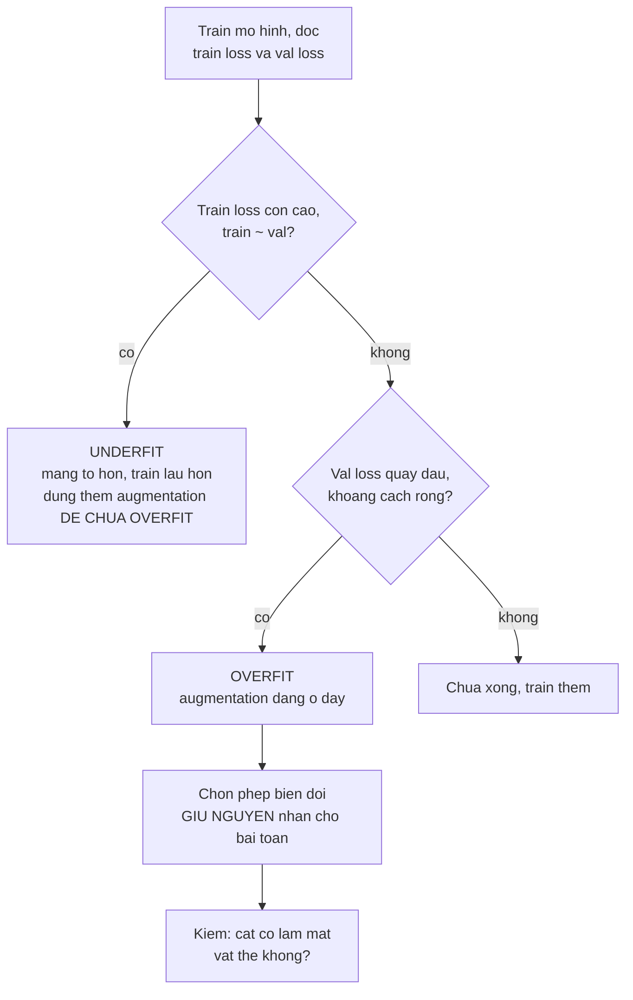

> **Mục tiêu bài học:** Sau bài này, bạn sẽ biết công thức tăng cường dữ liệu phổ biến nhất làm sai nhãn bao nhiêu phần trăm số lần - đo bằng số chứ không phỏng đoán - và có một quy tắc chẩn đoán để biết khi nào augmentation đáng bật, khi nào bật lên chỉ làm mọi thứ tệ đi.

## 1. Augmentation không miễn phí

Chương Deep Learning · Bài 07 đã giới thiệu tăng cường dữ liệu như một trong ba kỹ thuật chống overfitting: lật, xoay, cắt, đổi màu - sinh thêm dữ liệu từ dữ liệu đang có. Cách kể quen thuộc là "dữ liệu nhiều hơn thì tốt hơn, mà lại miễn phí".

Bài này đo hai thứ mà cách kể ấy bỏ qua.

**Thứ nhất, có một giả định ngầm phải đúng thì augmentation mới hợp lệ:** phép biến đổi phải **giữ nguyên nhãn**. Lật ngang một con mèo vẫn là con mèo. Nhưng lật ngang chữ "b" thành chữ "d", và cắt quá tay một tấm ảnh thì con mèo biến mất khỏi khung trong khi nhãn vẫn ghi "mèo". Mục 2 đo xem chuyện ấy xảy ra bao nhiêu phần trăm số lần với công thức chuẩn.

**Thứ hai, augmentation làm nhiều việc cùng lúc** - nó vừa là một dạng regularization, vừa là cách *dạy cho mô hình một bất biến*: lật ngang mà nhãn không đổi tức là bảo mô hình "hướng trái phải không quan trọng", và điều đó có ích cả khi mô hình chưa hề overfit. Nhưng vai trò regularization là vai trò dễ bị bật nhầm lúc nhất, và mục 3 với mục 4 cho thấy chuyện gì xảy ra khi ấy.

## 2. Công thức chuẩn làm sai nhãn bao nhiêu lần

Phép tăng cường mặc định khi huấn luyện trên ImageNet - có trong gần như mọi hướng dẫn - là:

```python
transforms.RandomResizedCrop(224, scale=(0.08, 1.0))
```

Nó cắt một vùng ngẫu nhiên có diện tích từ **8% đến 100%** ảnh gốc, rồi phóng vùng ấy lên 224×224. Con số 0,08 nghĩa là có những lần nó chỉ giữ lại một phần mười hai tấm ảnh.

Câu hỏi: khi cắt như vậy, vật thể cần nhận có còn trong khung không?

Với ảnh phân loại thì không trả lời được, vì không ai đánh dấu vật thể nằm ở đâu. Nhưng **COCO thì có hộp giới hạn**. Nên lấy 360 ảnh COCO có một vật thể chiếm ưu thế, áp đúng phép cắt trên, rồi đo phần vật thể còn sót lại trong khung:

| Kết quả của một lần cắt ngẫu nhiên | Tỉ lệ |
|---|---|
| Giữ được **dưới một nửa** vật thể | **47,8%** |
| Giữ được dưới 10% | 13,6% |
| Vùng cắt **không giao chút nào** với hộp của vật thể chính | **8,1%** |
| Phần vật thể giữ lại, trung vị | 53,6% |

Đọc dòng thứ ba cho kỹ, và gọi nó cho đúng tên: **cứ mười hai lần cắt thì có khoảng một lần vùng cắt không chạm vào hộp của vật thể chính**, trong khi nhãn vẫn ghi tên vật thể ấy.

Đây là một **chỉ dấu gián tiếp**, không phải bằng chứng nhãn đã sai. Ảnh COCO thường có nhiều vật, nên vùng cắt ấy có thể vẫn chứa một con chó khác hoặc phần thân vật thể nằm ngoài hộp; và với ảnh phân loại, bối cảnh xung quanh đôi khi vẫn đủ để đoán đúng. Cái đo được chắc chắn là: **bằng chứng trực tiếp về vật thể đã biến khỏi khung**. Với một bộ dữ liệu mỗi ảnh một vật, đó gần như chắc chắn là nhãn hỏng; với ảnh nhiều vật thì là chuyện xác suất.

Ba điều rút ra, và không cái nào là "đừng dùng augmentation":

**Đây không phải lỗi của công thức.** ImageNet có 1,3 triệu ảnh và mô hình được train hàng chục epoch. Với quy mô ấy, một phần lượt cắt mất bằng chứng trực tiếp về vật thể vẫn được hấp thụ bởi sự đa dạng khổng lồ của phần còn lại, và các mô hình mạnh nhất đều dùng công thức này. Vấn đề nảy sinh khi bạn **chép nguyên nó sang một bộ dữ liệu 500 ảnh**, nơi không còn dư địa như vậy - và cách xử lý đúng không phải đoán mà là **đo trên validation của chính bộ dữ liệu ấy**.

**Con số phụ thuộc vật thể to hay nhỏ.** Vật thể chiếm gần hết khung hình thì cắt kiểu gì cũng còn; vật thể nhỏ thì mất rất dễ. Bảng trên đo trên các vật thể *chiếm ưu thế* trong ảnh COCO - với vật nhỏ, tỉ lệ mất còn cao hơn nhiều.

**Cách chữa rẻ nhất là nâng cận dưới.** `scale=(0.5, 1.0)` giữ ít nhất một nửa diện tích ảnh - một điểm xuất phát dè dặt hơn khi dữ liệu ít. Nhưng không có cận dưới nào đúng cho mọi bộ dữ liệu: con số ấy phụ thuộc vật thể to hay nhỏ trong khung, và cách chọn vẫn là thử vài giá trị rồi chấm trên validation.

## 3. Từng phép biến đổi đáng bao nhiêu điểm

Đo trực tiếp: cùng một mạng tích chập nhỏ, cùng dữ liệu Imagenette 64×64, cùng Adam lr = 1e-3, cùng 6 epoch, chỉ đổi phép tăng cường. Một lần chạy minh họa:

| Phép tăng cường | Accuracy |
|---|---|
| **Không có gì** | **0,5455** |
| Lật ngang | 0,5394 |
| Cắt nhẹ + lật | 0,5315 |
| Xoay tới 90° | 0,4983 |
| Đổi màu mạnh | 0,4706 |
| **Cắt rất mạnh** (`scale=(0.08, 0.3)`) | **0,4517** |

**Mọi phép tăng cường đều làm kết quả kém đi.** Đây không phải kết quả người ta hay in ra, nhưng nó là thứ đo được, và giải thích nó là phần có ích nhất của bài.

Thứ tự trong bảng có quy luật rõ: **càng biến dạng mạnh, càng tệ.** Lật ngang gần như không đổi gì (chênh 0,6 điểm, nằm trong nhiễu của một lần chạy). Cắt rất mạnh - đúng cấu hình mà mục 2 đo được là hay làm mất vật thể - mất **9,4 điểm**.

Nhưng vì sao ngay cả phép lật ngang vô hại cũng không giúp gì? Câu trả lời không nằm trong bảng này.

## 4. Chẩn đoán trước khi kê thuốc

Chương Deep Learning · Bài 06 đưa ra một quy tắc: **luôn đọc train loss trước.** Áp nó vào đây, đo cả train lẫn validation cho hai cấu hình đầu và cuối bảng:

| Cấu hình | Train loss | Train acc | Val loss | Val acc |
|---|---|---|---|---|
| Không augmentation | 1,3075 | 0,5608 | 1,3584 | **0,5577** |
| Cắt rất mạnh | 1,7413 | 0,4314 | 1,7440 | **0,4329** |

Một chi tiết phải nói rõ để bảng này đọc được: **cột train đo trên ảnh train *chưa* qua augmentation**, ở chế độ `eval()`. Nếu đo train trên chính ảnh đã bị biến đổi thì hai cột nằm trên hai phân bố khác nhau và khoảng cách giữa chúng mất hết ý nghĩa chẩn đoán.

Con số quyết định nằm ở chỗ so hai cột với nhau: **train và validation gần như trùng khít.** Chênh lệch accuracy chỉ 0,3 điểm ở cấu hình đầu, và ở cấu hình sau thì validation còn *nhỉnh hơn* train.

Không có một chút overfitting nào. Mô hình thậm chí **không học nổi dữ liệu nó đã nhìn thấy** - train accuracy chỉ 0,5608. Đây đúng là chẩn đoán **underfitting** mà chương Deep Learning · Bài 06 mô tả: train loss cao, khoảng cách train-validation gần bằng không.

Và thuốc cho underfitting là mạng to hơn, train lâu hơn, hoặc chỉnh lại bộ tối ưu và learning rate cho hợp - **không phải regularization**. (Nói "tăng learning rate" thì quá đơn giản: nó cũng có thể làm mọi thứ tệ hơn, đúng như ca phân kỳ ở chương Deep Learning · Bài 06.) Augmentation là regularization; bật nó lên lúc này giống như cho thuốc hạ sốt một người đang lạnh run.

Nên bảng ở mục 3 không nói "augmentation vô dụng". Nó nói: **ở ngân sách huấn luyện 6 epoch, mạng còn chưa tới chỗ overfit, nên chưa có bệnh cho *vai trò regularization* của augmentation chữa** - trong khi cái giá của nó (mỗi epoch khó hơn, có lượt cắt mất vật thể) thì phải trả ngay.

Vai trò kia - dạy bất biến - thì không bị chẩn đoán này loại bỏ. Nếu bài toán của bạn thật sự cần bất biến với hướng, chẳng hạn ảnh vệ tinh chụp đủ chiều, thì phép xoay vẫn đáng thử ngay cả lúc chưa overfit. Chỉ là đừng bật nó lên *với lý do chống overfit* khi chưa có overfit.

Augmentation trả lãi khi train dài: mạng chạm trần dữ liệu gốc, bắt đầu học tủ, và lúc ấy sự đa dạng nhân tạo mới có chỗ dùng. Chương Deep Learning · Bài 07 đo được lợi ích của nó chính vì bài ấy dựng sẵn một ca overfitting nặng - 1.000 mẫu cho mạng 2,9 triệu tham số, train 60 epoch.

> ⚠️ **Lưu ý nhỏ:** mọi con số ở mục 3 và 4 là **một lần chạy minh họa** ở một ngân sách huấn luyện rất ngắn. Chúng đủ để cho thấy *thứ tự* và *cơ chế*, nhưng đừng mang bảng mục 3 đi kết luận "xoay ảnh làm mất 4,7 điểm" như một hằng số - con số ấy sẽ khác hẳn với mạng khác, dữ liệu khác, và đặc biệt là số epoch khác. Phần đáng mang theo là **quy trình chẩn đoán**, không phải các con số.

## 5. Quy trình dùng được

Gộp cả bài thành thứ tự quyết định:



Ô cuối là thứ bài này thêm vào so với chương Deep Learning · Bài 07. Chọn phép biến đổi không phải chuyện chép danh sách mà là **hỏi xem nhãn có sống sót không**, và câu trả lời phụ thuộc bài toán:

| Phép biến đổi | An toàn khi | Làm sai nhãn khi |
|---|---|---|
| Lật ngang | Ảnh vật thể tự nhiên | Chữ viết, biển báo có chữ, ảnh y tế phân biệt trái-phải |
| Xoay lớn | Ảnh vệ tinh, ảnh hiển vi | Chữ số, chữ cái, ảnh có hướng cố định |
| Cắt mạnh | Vật thể chiếm phần lớn khung | Vật thể nhỏ - mục 2 đo được 8,1% mất hẳn |
| Đổi màu mạnh | Nhận dạng hình dạng | Phân loại theo màu: quả chín hay xanh, dây điện theo màu |
| Lật dọc | Ảnh chụp từ trên xuống | Gần như mọi ảnh chụp ngang tầm mắt |

> 🔧 **Thử ngay:** bạn train mô hình phân loại 6 loại linh kiện, train accuracy 0,99 còn validation 0,71. Bật augmentation nào?
> Trước hết, chẩn đoán đã rõ: train 0,99 và validation 0,71 là khoảng cách rất rộng - **overfit thật sự**, khác hẳn tình huống ở mục 4. Nên đây đúng là lúc augmentation có chỗ dùng. Chọn phép nào thì phải hỏi cái gì phân biệt sáu loại linh kiện ấy: nếu là **hình dạng** thì lật và xoay đều an toàn, và xoay đặc biệt hợp vì linh kiện trên băng chuyền vốn nằm đủ hướng; nếu có hai loại chỉ khác nhau ở **màu** thì đổi màu mạnh là cấm. Còn cắt thì đặt cận dưới cao (`scale=(0.6, 1.0)`) vì linh kiện thường nhỏ trong khung. Và quan trọng nhất: bật từng phép một, đo trên validation sau mỗi lần, thay vì bật cả gói rồi đoán cái nào có tác dụng.

## Tóm tắt bài học

- Augmentation dựa trên một giả định ngầm: phép biến đổi **giữ nguyên nhãn**. Giả định ấy không phải lúc nào cũng đúng.
- Công thức mặc định `RandomResizedCrop(224, scale=(0.08, 1.0))` đo trên 360 ảnh COCO có hộp thật: **47,8%** số lần giữ dưới một nửa vật thể, **8,1%** số lần vùng cắt **không giao chút nào** với hộp vật thể chính. Đó là chỉ dấu gián tiếp cho việc mất bằng chứng, không phải bằng chứng nhãn sai.
- Đó không phải lỗi của công thức: với 1,3 triệu ảnh ImageNet, một phần lượt cắt mất bằng chứng về vật thể vẫn được hấp thụ bởi sự đa dạng của phần còn lại. Nó thành vấn đề khi chép nguyên sang bộ dữ liệu 500 ảnh, nơi không còn dư địa ấy.
- Trên Imagenette 6 epoch, **mọi phép tăng cường đều làm kết quả kém đi**, và mức kém tăng theo mức biến dạng: lật ngang −0,6 điểm (nhiễu), cắt rất mạnh −9,4 điểm.
- Lý do đo được: **train (trên ảnh sạch) và validation gần như trùng khít** (0,5608 so với 0,5577), tức mô hình đang **underfit**, chưa có bệnh cho regularization chữa.
- Augmentation vừa là regularization vừa là cách dạy bất biến. Vai trò regularization chỉ trả lãi khi bệnh đúng là overfitting - như ca 1.000 mẫu / 2,9 triệu tham số của chương Deep Learning · Bài 07.
- Muốn dùng khoảng cách train-validation để chẩn đoán thì **phải đo train trên ảnh sạch**, không phải trên ảnh đã augmentation.
- Quy trình đúng: **chẩn đoán bằng khoảng cách train-validation trước**, rồi mới chọn phép biến đổi, và với mỗi phép hỏi *nhãn có sống sót không*. Chẩn đoán underfit chỉ loại bỏ lý do "bật để chống overfit", không loại bỏ lý do "bật để dạy một bất biến mà bài toán thật sự cần".

## Câu hỏi tự kiểm tra

1. Công thức cắt chuẩn cho vùng cắt không giao với hộp vật thể chính ở 8,1% số lần. Vì sao đó chỉ là chỉ dấu gián tiếp chứ chưa phải bằng chứng nhãn sai - và vì sao nó chấp nhận được với ImageNet nhưng nguy hiểm với bộ dữ liệu 500 ảnh?
2. Train accuracy 0,5608 và validation accuracy 0,5577. Chẩn đoán là gì, và ba cách chữa nào **không** phải augmentation?
3. Vì sao cột train phải đo trên ảnh *sạch* thì khoảng cách train-validation mới dùng để chẩn đoán được?
4. Vì sao bảng ở mục 3 không cho phép kết luận "augmentation vô dụng"?
5. Cho ba bài toán: đọc biển số xe, phân loại ảnh vệ tinh, phân loại quả chín hay xanh. Với mỗi bài, nêu một phép biến đổi an toàn và một phép làm sai nhãn.
6. Vì sao lật ngang lại nguy hiểm với ảnh chụp X-quang ngực?
7. Bạn muốn biết `scale=(0.08, 1.0)` có phù hợp với dữ liệu của mình không nhưng không có hộp giới hạn. Nghĩ một cách kiểm tra rẻ.
8. Chương Deep Learning · Bài 07 đo được augmentation có lợi, bài này đo được nó có hại. Giải thích vì sao cả hai đều đúng.

## Đọc thêm

**Nguồn nền tảng của bài:**

| Nguồn | Đọc phần nào |
|---|---|
| **Chương Deep Learning · Bài 07** | Augmentation như một kỹ thuật regularization, đo trên một ca overfitting thật |
| **Chương Deep Learning · Bài 06** | Chẩn đoán bằng khoảng cách train-validation - quy tắc dùng ở mục 4 |
| **Bài 01 của chương này** | Các phép biến đổi ảnh và chỗ chúng làm hỏng đầu vào một cách âm thầm |
| **Dive into Deep Learning (d2l.ai)** | Chương 14.1 *Image Augmentation* - danh sách phép biến đổi và cách kết hợp |

**Nguồn online bổ sung (miễn phí):**

- [Transforming and augmenting images - tài liệu torchvision](https://pytorch.org/vision/stable/transforms.html) - tham số của `RandomResizedCrop` và các phép biến đổi khác.
- [Shorten & Khoshgoftaar - A survey on Image Data Augmentation for Deep Learning (2019)](https://journalofbigdata.springeropen.com/articles/10.1186/s40537-019-0197-0) - khảo sát rộng, kèm phần về giả định giữ nhãn.
- [Cubuk và cộng sự - AutoAugment (CVPR 2019)](https://arxiv.org/abs/1805.09501) - học lấy công thức augmentation từ dữ liệu thay vì chọn tay, và chi phí của việc đó.
- [Cubuk và cộng sự - RandAugment (2019)](https://arxiv.org/abs/1909.13719) - phiên bản đơn giản hơn nhiều với hai tham số, dễ áp dụng hơn AutoAugment.
- [Albumentations](https://albumentations.ai/docs/) - thư viện augmentation biến đổi **cả ảnh lẫn hộp giới hạn và mặt nạ** cùng lúc, thứ bạn cần khi làm bài 07-09.

> **Bài tiếp theo:** [Transfer learning và phân loại ảnh trong thực tế](../transfer-learning-image-classification-in-practice-vi/) - bài này lo phần dữ liệu vào. Bài sau lo phần mô hình - và trả lời hai câu hỏi mà mọi dự án phân loại ảnh đều phải trả lời trong tuần đầu tiên: fine-tune tới đâu, và dùng xương sống nào.
