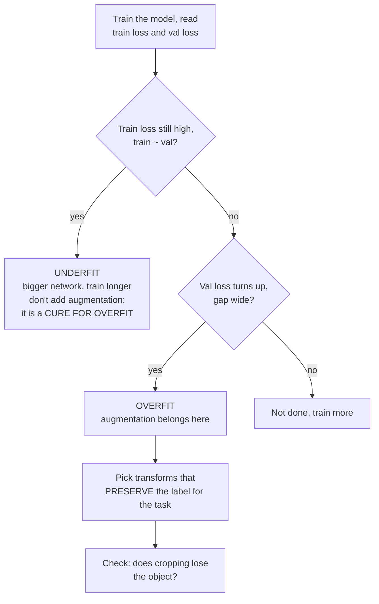

> **Learning objectives:** After this lesson, you will know how often the most common data augmentation recipe corrupts the label - measured in numbers rather than guessed - and you will have a diagnostic rule for when augmentation is worth turning on and when turning it on only makes everything worse.

## 1. Augmentation is not free

Deep Learning · Lesson 07 introduced data augmentation as one of three techniques against overfitting: flipping, rotating, cropping, color changes - generating more data from the data you already have. The familiar story is "more data is better, and it comes for free".

This lesson measures two things that story leaves out.

**First, there is an implicit assumption that must hold for augmentation to be valid:** the transformation must **preserve the label**. A horizontally flipped cat is still a cat. But flipping the letter "b" horizontally turns it into a "d", and cropping an image too aggressively makes the cat vanish from the frame while the label still says "cat". Section 2 measures how often that happens with the standard recipe.

**Second, augmentation does several jobs at once** - it is both a form of regularization and a way of *teaching the model an invariance*: flipping horizontally without changing the label tells the model "left-right orientation does not matter", and that is useful even when the model is not overfitting at all. But the regularization role is the one most often switched on at the wrong time, and sections 3 and 4 show what happens then.

## 2. How often the standard recipe corrupts the label

The default augmentation for training on ImageNet - found in almost every tutorial - is:

```python
transforms.RandomResizedCrop(224, scale=(0.08, 1.0))
```

It crops a random region covering **8% to 100%** of the original image, then scales that region up to 224×224. The value 0.08 means that sometimes it keeps only one twelfth of the image.

The question: when cropping like this, is the object to be recognized still in the frame?

For classification images this cannot be answered, because nobody marked where the object is. But **COCO has bounding boxes**. So take 360 COCO images with one dominant object, apply exactly that crop, and measure how much of the object remains in the frame:

| Outcome of one random crop | Rate |
|---|---|
| Keeps **less than half** of the object | **47.8%** |
| Keeps less than 10% | 13.6% |
| The crop **does not overlap at all** with the main object's box | **8.1%** |
| Fraction of the object kept, median | 53.6% |

Read the third row carefully, and call it by its proper name: **roughly one crop in twelve does not touch the main object's box**, while the label still names that object.

This is an **indirect indicator**, not proof that the label is wrong. COCO images often contain several objects, so that crop may still contain another dog or part of the object lying outside the box; and for classification images the surrounding context is sometimes still enough to guess correctly. What is measured with certainty is: **direct evidence of the object has left the frame**. For a dataset with one object per image, that is almost certainly a broken label; for images with many objects it is a matter of probability.

Three conclusions, and none of them is "do not use augmentation":

**This is not a flaw in the recipe.** ImageNet has 1.3 million images and models are trained for dozens of epochs. At that scale, the share of crops that lose direct evidence of the object is still absorbed by the enormous diversity of the rest, and the strongest models all use this recipe. The problem arises when you **copy it unchanged to a 500-image dataset**, where there is no such margin - and the right approach is not to guess but to **measure on that dataset's own validation set**.

**The number depends on whether the object is large or small.** An object that fills almost the whole frame survives any crop; a small object is lost very easily. The table above measures *dominant* objects in COCO images - for small objects, the loss rate is much higher.

**The cheapest fix is to raise the lower bound.** `scale=(0.5, 1.0)` keeps at least half of the image area - a more cautious starting point when data is scarce. But no lower bound is right for every dataset: the value depends on how large or small the objects are in the frame, and the way to choose it is still to try a few values and score them on validation.

## 3. How many points each transformation is worth

Measured directly: the same small convolutional network, the same Imagenette data at 64×64, the same Adam with lr = 1e-3, the same 6 epochs, changing only the augmentation. One illustrative run:

| Augmentation | Accuracy |
|---|---|
| **None** | **0.5455** |
| Horizontal flip | 0.5394 |
| Light crop + flip | 0.5315 |
| Rotation up to 90° | 0.4983 |
| Strong color change | 0.4706 |
| **Very strong crop** (`scale=(0.08, 0.3)`) | **0.4517** |

**Every augmentation makes the result worse.** This is not a result people usually print, but it is what was measured, and explaining it is the most useful part of the lesson.

The order in the table follows a clear pattern: **the stronger the distortion, the worse.** The horizontal flip changes almost nothing (a gap of 0.6 points, within the noise of a single run). The very strong crop - exactly the configuration section 2 found to often lose the object - loses **9.4 points**.

But why does even the harmless horizontal flip not help? The answer is not in this table.

## 4. Diagnose before prescribing

Deep Learning · Lesson 06 gave a rule: **always read the train loss first.** Apply it here, measuring both train and validation for the first and last configurations in the table:

| Configuration | Train loss | Train acc | Val loss | Val acc |
|---|---|---|---|---|
| No augmentation | 1.3075 | 0.5608 | 1.3584 | **0.5577** |
| Very strong crop | 1.7413 | 0.4314 | 1.7440 | **0.4329** |

One detail must be stated clearly for this table to be readable: **the train columns are measured on train images *without* augmentation**, in `eval()` mode. If train were measured on the transformed images themselves, the two columns would come from two different distributions and the gap between them would lose all diagnostic meaning.

The deciding number is in comparing the two columns: **train and validation almost coincide.** The accuracy gap is only 0.3 points in the first configuration, and in the second validation is even *slightly higher* than train.

There is no overfitting whatsoever. The model **cannot even learn the data it has already seen** - train accuracy is only 0.5608. This is exactly the **underfitting** diagnosis described in Deep Learning · Lesson 06: high train loss, train-validation gap close to zero.

And the remedy for underfitting is a bigger network, longer training, or tuning the optimizer and learning rate appropriately - **not regularization**. (Saying "increase the learning rate" is too simple: it can also make everything worse, exactly like the divergence case in Deep Learning · Lesson 06.) Augmentation is regularization; turning it on now is like giving fever medicine to someone who is shivering with cold.

So the table in section 3 does not say "augmentation is useless". It says: **at a training budget of 6 epochs, the network has not yet reached the point of overfitting, so there is no illness yet for the *regularization role* of augmentation to cure** - while its cost (each epoch is harder, some crops lose the object) has to be paid immediately.

The other role - teaching an invariance - is not ruled out by this diagnosis. If your problem genuinely needs invariance to orientation, for example satellite images taken in every direction, then rotation is still worth trying even before overfitting. Just do not turn it on *for the reason of fighting overfitting* when there is no overfitting.

Augmentation pays off with long training: the network hits the ceiling of the original data, starts to memorize, and only then does artificial diversity have a use. Deep Learning · Lesson 07 measured its benefit precisely because that lesson set up a severe overfitting case - 1,000 samples for a network with 2.9 million parameters, trained for 60 epochs.

> ⚠️ **A small note:** every number in sections 3 and 4 is **one illustrative run** at a very short training budget. They are enough to show the *order* and the *mechanism*, but do not take the table in section 3 and conclude "rotating images costs 4.7 points" as a constant - that number will be quite different with another network, other data, and especially a different number of epochs. What is worth taking away is the **diagnostic procedure**, not the numbers.

## 5. A usable procedure

Combining the whole lesson into a decision order:



The last box is what this lesson adds compared with Deep Learning · Lesson 07. Choosing transformations is not a matter of copying a list but of **asking whether the label survives**, and the answer depends on the problem:

| Transformation | Safe when | Corrupts the label when |
|---|---|---|
| Horizontal flip | Natural object images | Text, signs with text, medical images that distinguish left from right |
| Large rotation | Satellite images, microscope images | Digits, letters, images with a fixed orientation |
| Strong crop | Object fills most of the frame | Small objects - section 2 measured 8.1% lost entirely |
| Strong color change | Shape recognition | Classifying by color: ripe or unripe fruit, wires by color |
| Vertical flip | Top-down images | Almost every photo taken at eye level |

> 🔧 **Try it now:** you train a model to classify 6 types of electronic components, with train accuracy 0.99 and validation 0.71. Which augmentation do you turn on?
> First, the diagnosis is clear: train 0.99 and validation 0.71 is a very wide gap - **genuine overfitting**, quite unlike the situation in section 4. So this is exactly when augmentation has a use. Which transformations to choose depends on what distinguishes those six component types: if it is **shape**, flips and rotations are both safe, and rotation is especially suitable because components on a conveyor belt lie in every orientation anyway; if two types differ only in **color**, strong color change is forbidden. For cropping, set a high lower bound (`scale=(0.6, 1.0)`) because components are usually small in the frame. And most important: turn on one transformation at a time, measuring on validation after each, instead of turning on the whole bundle and guessing which one helped.

## Lesson summary

- Augmentation rests on an implicit assumption: the transformation **preserves the label**. That assumption does not always hold.
- The default recipe `RandomResizedCrop(224, scale=(0.08, 1.0))`, measured on 360 COCO images with real boxes: **47.8%** of the time it keeps less than half of the object, **8.1%** of the time the crop **does not overlap at all** with the main object's box. That is an indirect indicator of lost evidence, not proof of a wrong label.
- This is not a flaw in the recipe: with ImageNet's 1.3 million images, the share of crops that lose evidence of the object is still absorbed by the diversity of the rest. It becomes a problem when copied unchanged to a 500-image dataset, where that margin does not exist.
- On Imagenette at 6 epochs, **every augmentation makes the result worse**, and the damage grows with the amount of distortion: horizontal flip −0.6 points (noise), very strong crop −9.4 points.
- The measured reason: **train (on clean images) and validation almost coincide** (0.5608 versus 0.5577), meaning the model is **underfitting** and there is no illness yet for regularization to cure.
- Augmentation is both regularization and a way to teach invariance. The regularization role only pays off when the illness really is overfitting - like the 1,000 samples / 2.9 million parameters case in Deep Learning · Lesson 07.
- To use the train-validation gap for diagnosis, **train must be measured on clean images**, not on augmented images.
- The right procedure: **diagnose with the train-validation gap first**, only then choose transformations, and for each one ask *whether the label survives*. An underfitting diagnosis only rules out the reason "turn it on to fight overfitting", not the reason "turn it on to teach an invariance the problem genuinely needs".

## Self-check questions

1. The standard crop recipe produces a crop that does not overlap the main object's box 8.1% of the time. Why is that only an indirect indicator and not yet proof of a wrong label - and why is it acceptable for ImageNet but dangerous for a 500-image dataset?
2. Train accuracy is 0.5608 and validation accuracy is 0.5577. What is the diagnosis, and which three remedies are **not** augmentation?
3. Why must the train columns be measured on *clean* images for the train-validation gap to be usable for diagnosis?
4. Why does the table in section 3 not allow the conclusion "augmentation is useless"?
5. Consider three problems: reading license plates, classifying satellite images, classifying fruit as ripe or unripe. For each, name one safe transformation and one that corrupts the label.
6. Why is a horizontal flip dangerous for chest X-ray images?
7. You want to know whether `scale=(0.08, 1.0)` suits your data, but you have no bounding boxes. Think of a cheap way to check.
8. Deep Learning · Lesson 07 measured augmentation as beneficial, this lesson measured it as harmful. Explain why both are correct.

## Further reading

**Core sources for this lesson:**

| Source | What to read |
|---|---|
| **Deep Learning · Lesson 07** | Augmentation as a regularization technique, measured on a real overfitting case |
| **Deep Learning · Lesson 06** | Diagnosis with the train-validation gap - the rule used in section 4 |
| **Lesson 01 of this chapter** | Image transformations and where they silently corrupt the input |
| **Dive into Deep Learning (d2l.ai)** | Chapter 14.1 *Image Augmentation* - the list of transformations and how to combine them |

**Additional online sources (free):**

- [Transforming and augmenting images - torchvision documentation](https://pytorch.org/vision/stable/transforms.html) - parameters of `RandomResizedCrop` and the other transformations.
- [Shorten & Khoshgoftaar - A survey on Image Data Augmentation for Deep Learning (2019)](https://journalofbigdata.springeropen.com/articles/10.1186/s40537-019-0197-0) - a broad survey, including a part on the label-preservation assumption.
- [Cubuk et al. - AutoAugment (CVPR 2019)](https://arxiv.org/abs/1805.09501) - learning the augmentation recipe from data instead of choosing it by hand, and the cost of doing so.
- [Cubuk et al. - RandAugment (2019)](https://arxiv.org/abs/1909.13719) - a much simpler version with two parameters, easier to apply than AutoAugment.
- [Albumentations](https://albumentations.ai/docs/) - an augmentation library that transforms **the image, bounding boxes and masks** together, which you need for lessons 07-09.

> **Next lesson:** [Transfer Learning and Image Classification in Practice](../transfer-learning-image-classification-in-practice/) - this lesson handled the input data. The next one handles the model - and answers two questions every image classification project has to answer in its first week: how far to fine-tune, and which backbone to use.
