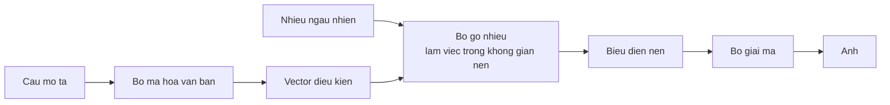

> **Mục tiêu bài học:** Sau bài này, bạn sẽ hiểu cơ chế khuếch tán - thêm nhiễu rồi học cách gỡ - qua một mô hình chúng ta **tự huấn luyện từ số 0**, và biết các hệ sinh ảnh thật khác mô hình đồ chơi ấy ở những chỗ nào.

## 1. Một cách sinh hoàn toàn khác

Mười bài đầu sinh **văn bản**, và cách sinh luôn giống nhau: từng token một, trái sang phải, mỗi bước lấy mẫu từ một phân bố. Đó là cách tự nhiên với ngôn ngữ, vì ngôn ngữ vốn là một chuỗi có thứ tự.

Ảnh thì không có thứ tự tự nhiên như vậy. Sinh ảnh 28×28 theo kiểu từng pixel một **là làm được** - có cả một họ mô hình tự hồi quy trên pixel - nhưng nó cần 784 bước tuần tự cho một ảnh bé xíu, và chi phí ấy bùng nổ ở độ phân giải thật. Khuếch tán chọn một cách đặt bài toán khác hẳn.

**Mô hình khuếch tán** làm khác hẳn, và ý tưởng gốc nghe gần như nghịch lý:

> Nếu ta biết cách **thêm** nhiễu vào ảnh, ta có thể học cách **gỡ** nhiễu ra. Và nếu gỡ được nhiễu, thì bắt đầu từ một khung hình **toàn nhiễu** rồi gỡ dần, ta sẽ ra một ảnh.

Toàn bộ bài này là để thấy ý tưởng ấy chạy thật.

## 2. Chiều thuận: thêm nhiễu, có công thức

Chiều thuận không cần học gì cả - nó là một công thức.

Chọn trước một lịch nhiễu gồm $T$ bước. Ở bước $t$, ảnh gốc $x_0$ bị pha với nhiễu chuẩn theo đúng tỉ lệ định trước:

$$x_t = \sqrt{\bar\alpha_t}\, x_0 + \sqrt{1 - \bar\alpha_t}\,\epsilon, \qquad \epsilon \sim \mathcal{N}(0, I)$$

với $\bar\alpha_t$ giảm dần từ gần 1 xuống gần 0. Nghĩa là:

- $t$ nhỏ: ảnh gần như nguyên vẹn, nhiễu nhẹ
- $t$ lớn: ảnh gần như biến mất, chỉ còn nhiễu

Bài này dùng **200 bước** với $\beta$ tăng tuyến tính từ $10^{-4}$ tới $0{,}02$.

Điểm hay của công thức này: **nhảy thẳng tới bước $t$ bất kỳ trong một phép tính**, không cần lặp. Nhờ vậy huấn luyện rất tiện - mỗi lần lấy một ảnh, bốc ngẫu nhiên một $t$, pha nhiễu, xong.

## 3. Chiều ngược: học gỡ nhiễu

Đây mới là phần cần mạng nơ-ron.

Mạng nhận vào **ảnh đã nhiễu** $x_t$ và **bước $t$**, rồi dự đoán **nhiễu nào đã được thêm vào**. Hàm mất mát đơn giản đến bất ngờ - chỉ là sai số bình phương giữa nhiễu dự đoán và nhiễu thật:

```python
t = torch.randint(0, T, (batch,))                 # bốc ngẫu nhiên một bước
noise = torch.randn_like(x)                       # nhiễu thật
a = abar[t][:, None, None, None]
x_t = a.sqrt() * x + (1 - a).sqrt() * noise       # pha theo công thức mục 2
loss = F.mse_loss(net(x_t, t), noise)             # đoán lại đúng nhiễu ấy
```

Mạng ở đây là một U-Net rất nhỏ: hai tầng xuống, một khối giữa, một tầng lên, cộng một kết nối tắt từ tầng xuống sang tầng lên - đúng khuôn mã hóa-giải mã của chương Computer Vision · Bài 09. Bước $t$ được đưa vào qua một vector nhúng cộng thẳng vào bản đồ đặc trưng, để mạng biết mình đang ở mức nhiễu nào.

| | |
|---|---|
| Dữ liệu | FashionMNIST, 60.000 ảnh 28×28 |
| Mô hình | **359.425 tham số** |
| Bước nhiễu | 200 |
| Huấn luyện | 2.400 bước, batch 128 |
| Thời gian | **864 giây** (14 phút) trên CPU |

Loss của batch cuối ở từng mốc:

| Bước | 600 | 1.200 | 1.800 | 2.400 |
|---|---|---|---|---|
| Loss | 0,1472 | 0,1198 | 0,1103 | 0,0977 |

> ⚠️ **Đừng đọc bốn con số này như đường học.** Đây là loss của **một batch** tại mỗi mốc, không phải trung bình. Ở mô hình khuếch tán, mỗi bước huấn luyện bốc một mức nhiễu $t$ ngẫu nhiên, và độ khó thay đổi rất mạnh theo $t$ - bảng theo từng $t$ ở mục 4 đo được **0,2247 ở $t=20$ so với 0,0298 ở $t=190$**, tức chênh nhau hơn bảy lần trên cùng một mạng đã huấn luyện xong. Loss một batch vì thế phụ thuộc nặng vào việc batch ấy bốc trúng những $t$ nào, và bốn điểm cách nhau 600 bước thì không đủ để nói đường học mượt hay nhấp nhô. Muốn nhìn tiến trình thật thì phải lấy trung bình trượt, hoặc đo riêng theo từng $t$ - đúng tinh thần chương Deep Learning · Bài 06.

## 4. Lấy mẫu: từ nhiễu ra hình

Sinh ảnh là chạy ngược lịch nhiễu. Bắt đầu từ $x_T$ **hoàn toàn ngẫu nhiên**, rồi lặp 200 lần: hỏi mạng "nhiễu nào đã thêm vào", trừ bớt một phần nhiễu ấy đi, thêm lại một chút nhiễu nhỏ, đi tiếp.

In bốn mốc dưới dạng lưới ký tự (đậm dần từ khoảng trắng tới `@`):

```
còn 150 bước nhiễu      còn 100 bước            còn 50 bước             xong (0 bước)
=*=:   #+-.@-+          =: - . ----*-            . . . * -: .                . +:-
 .::-@* :::               -*.@%.-+               -*%=@*+=*   .           -*#**#=**:
:.- =%@%@ =*+-           :+-:=%@+:*+..           :+**#%@#%=::.           *++****++=-.
 @--# .:= #*%+          :#*%@:  *.-%*:           +@*++. =-:*=:           *=++++:*+===
:# %+  =+ # *+          .* *%: .+.-.+#           -:*=== +===+%           *+++++.*+-+++
+@.@+-+ @::@%%          :+-*+ .:#+ #*#           *-+-:=:+*=%#%           ++++=+.**:+**
#*+#++% =@++%%          =*++#+#:#*%-#@           #+=%+*:++--*@           +*+*+= +*-=**
```

Nhìn bằng mắt thì bốn khung hình này đều còn lộn xộn, và **ảnh sinh ra chưa ra hình quần áo**. Có cấu trúc - vùng đậm tụ lại, rìa nhạt đi - nhưng không nhận ra được đó là áo hay giày.

Đến đây rất dễ biện hộ bằng một quan sát yếu: độ lệch chuẩn của khung hình giảm đều từ 0,926 xuống 0,521 trong quá trình lấy mẫu, nên "mạng đang kéo ảnh về phía phân bố dữ liệu". Lập luận ấy **không đứng vững**: một phép co tầm thường kiểu $x \leftarrow 0{,}9x$ cũng làm độ lệch chuẩn giảm đều, mà chẳng học gì cả.

Nên cần hai phép đo khác, và cả hai đều so với mốc để đối chiếu.

**Phép đo 1: mạng có đoán đúng nhiễu không.** Lấy 256 ảnh **tập kiểm tra** - mạng chưa từng thấy - pha nhiễu ở năm mức $t$ khác nhau, rồi đo sai số bình phương giữa nhiễu mạng đoán và nhiễu thật. Chỉ một con số thì chẳng nói lên gì, nên so với ba mốc:

| Bộ đoán nhiễu | ε-MSE trên ảnh kiểm tra |
|---|---|
| **Mạng đã huấn luyện** | **0,0961** |
| Bộ đoán tuyến tính tốt nhất theo $x_t$ | 0,5174 |
| Bộ đoán luôn trả về 0 | 1,0002 |
| Cùng kiến trúc nhưng **chưa huấn luyện** | 1,0565 |

Con số 1,0002 của bộ đoán-luôn-trả-0 không phải ngẫu nhiên: nhiễu được bốc từ phân bố chuẩn có phương sai 1, nên đoán 0 cho sai số bình phương xấp xỉ đúng 1. Đó là mốc "không làm gì cả". Mạng **chưa huấn luyện** còn **tệ hơn cả mốc ấy** (1,0565), đúng kiểu ta đã gặp ở bài 01 khi mô hình khởi tạo ngẫu nhiên còn kém hơn đoán đều.

Mốc thứ ba mới là mốc đáng ngại, và nó đáng được giải thích kỹ. Nhớ lại $x_t = \sqrt{\bar\alpha_t}\,x_0 + \sqrt{1-\bar\alpha_t}\,\varepsilon$. Khi $t$ lớn thì $\bar\alpha_t$ tiến về 0, nên $x_t$ **gần như chính là $\varepsilon$** - và một bộ đoán tầm thường "cứ trả về $c \cdot x_t$" sẽ ăn điểm mà không học gì cả. Nên ta đo luôn cái đó: với mỗi $t$, chọn hệ số $c$ **tốt nhất có thể** cho chính bộ dữ liệu này rồi đo sai số.

| $t$ | $\bar\alpha_t$ | Mạng | Tuyến tính $c\cdot x_t$ (với $c$ tối ưu) | Đoán 0 |
|---|---|---|---|---|
| 20 | 0,977 | **0,2247** | 0,9645 | 0,9986 |
| 60 | 0,827 | **0,1097** | 0,7659 | 1,0023 |
| 100 | 0,596 | **0,0713** | 0,5024 | 1,0008 |
| 150 | 0,316 | **0,0452** | 0,2405 | 0,9981 |
| 190 | 0,158 | **0,0298** | 0,1137 | 1,0014 |

Đọc bảng này được ba điều.

**Mốc tuyến tính là mốc thật, không phải mốc giấy.** Ở $t=190$ nó đạt 0,1137 - nghĩa là nếu ta chỉ báo cáo con số trung bình 0,0961 mà không có cột này, người đọc không có cách nào biết bao nhiêu phần của thành tích ấy là do mạng học được, bao nhiêu là do bài toán tự dễ đi ở $t$ lớn.

**Mạng thắng ở mọi mức $t$, và thắng đậm nhất ở chỗ khó nhất.** Ở $t=20$, khi $x_t$ còn gần như nguyên ảnh gốc và mốc tuyến tính gần như vô dụng (0,9645), mạng vẫn đạt 0,2247. Muốn làm được thế thì phải **tách được đâu là ảnh, đâu là nhiễu** - đúng thứ ta muốn nó học.

**Mạng càng dễ ở $t$ lớn.** Sai số đi từ 0,2247 xuống 0,0298. Chênh lệch độ khó theo $t$ này là **một nguồn** làm loss từng batch ở mục 3 có thể dao động - nhưng lưu ý ta chưa đo trực tiếp biến thiên của loss theo thời gian, chỉ đo độ khó theo $t$.

**Phép đo 2: gỡ nhiễu một ảnh thật đã biết.** Lấy một ảnh từ tập kiểm tra, pha nhiễu tới mức $t$, rồi chạy ngược toàn bộ quá trình. Nếu mạng thật sự học gỡ nhiễu thì ảnh phải quay về gần ảnh gốc:

| Mức nhiễu | MSE(ảnh đã nhiễu, ảnh gốc) | MSE(ảnh đã gỡ, ảnh gốc) |
|---|---|---|
| $t = 60$ | 0,1732 | **0,0252** |
| $t = 120$ | 0,5946 | **0,0739** |

Ở $t=120$, ảnh bị phá tới mức sai số so với gốc là 0,5946; sau khi gỡ, nó về **0,0739** - gần gốc hơn **tám lần**. Và nhìn được luôn:

```
ảnh gốc                 pha nhiễu tới t=120      sau khi gỡ nhiễu
                        +  :+     --
                       :   -. =% -*
                       -=- %      .
                       . * = :   . =
                       . = @. :=   .                   .
          =++=+          + : # ****=            =#.
         =-++++        -- ::- % =++@#          :+-*%#%
        ---=+++=       :   :=%-+ #@-%        ::--=**::
      .=-=++++=+       .   .+- -+%:        :.---++#:++
   ---==+=+++++*       .#-* %@= +-* .    .+**+==+****=*
   ***==+*##%%%#       . @@*@-#:+@@ #    :=##*+=*#%#+++
                        .-  +. @..: .          .:.    .
```

Cấu trúc quay lại **đúng chỗ cũ** - vùng đậm ở nửa dưới, dáng vật thể hiện lại. Việc này đòi mạng phải biết *nhiễu nằm ở đâu trên từng pixel* để trừ đi; nhân toàn ảnh với một hằng số thì không dựng lại được dáng vật thể. Nói cho chặt: hai phép đo trên loại được **mốc co phương sai và mốc tuyến tính theo $x_t$** - không phải loại được *mọi* hàm tầm thường, vì ta chỉ thử hai mốc ấy.

**Kết luận đúng phạm vi:** hai phép đo trên chứng minh mạng **đã học gỡ nhiễu thật**. Chúng **không** chứng minh nó sinh được ảnh đẹp từ nhiễu trắng - và mục trên cho thấy nó chưa làm được. Đó là hai việc khác nhau: gỡ nhiễu từ một ảnh thật đã bị phá thì dễ hơn nhiều so với dựng một ảnh mới hoàn toàn từ nhiễu, vì trong trường hợp đầu phần lớn thông tin vẫn còn nằm trong khung hình.

Vì sao chưa sinh được ảnh đẹp thì bài này **không trả lời được**. Giả thuyết hợp lý nhất là ngân sách: **359 nghìn tham số và 2.400 bước huấn luyện là rất ít** so với hàng chục nghìn bước mà các mô hình cho ra ảnh nhận diện được trên FashionMNIST thường cần. Nhưng muốn chứng minh thì phải train lâu hơn rồi đo lại - việc vượt quá thứ máy này kham nổi trong bài.

## 5. Hệ sinh ảnh thật khác ở đâu

Mô hình trên là **khuếch tán trên pixel, không điều kiện**: nó sinh ra một ảnh bất kỳ giống dữ liệu huấn luyện, và bạn không điều khiển được nội dung.

Các hệ sinh ảnh từ văn bản thêm bốn thứ:



**Khuếch tán trong không gian nén.** Gỡ nhiễu thẳng trên pixel 512×512×3 là rất đắt. Các hệ hiện đại nén ảnh xuống một biểu diễn nhỏ hơn nhiều bằng một bộ mã hóa, chạy toàn bộ quá trình khuếch tán ở đó, rồi mới giải mã ra ảnh. Đây là ý tưởng trung tâm của *latent diffusion*.

**Điều kiện theo văn bản.** Câu mô tả được đưa qua một bộ mã hóa văn bản - thường chính là loại mô hình mà chương Computer Vision · Bài 11 đã dùng khi chạy CLIP - rồi vector kết quả được bơm vào bộ gỡ nhiễu qua **cross-attention**: cùng cơ chế của bài 03, nhưng truy vấn đến từ ảnh còn khóa và giá trị đến từ văn bản.

**Classifier-free guidance.** Lúc lấy mẫu, mô hình chạy hai lần - một lần có câu mô tả, một lần không - rồi đẩy kết quả về phía bản có mô tả. Đây là núm vặn quyết định mức "bám sát câu lệnh", và nó đóng vai trò tương tự temperature của bài 05: cao quá thì ảnh gượng ép, thấp quá thì lạc đề.

**Bộ mã hóa-giải mã ảnh.** Phần nén và giải nén là một mạng riêng, huấn luyện riêng trước đó.

Điều đáng chú ý: **không thứ nào trong bốn thứ trên đổi cơ chế cốt lõi.** Vẫn là thêm nhiễu theo công thức, học đoán nhiễu, rồi gỡ dần. Bốn thứ ấy làm cho nó **rẻ hơn** và **điều khiển được**.

> 🔧 **Thử ngay:** sinh một ảnh bằng mô hình ở bài này cần chạy mạng **200 lần**, trong khi sinh một ảnh bằng mô hình phân loại ở chương Computer Vision chỉ cần một lần. Vì sao, và điều đó nói gì về chi phí của sinh ảnh?
> Vì khuếch tán sinh ảnh bằng cách **gỡ nhiễu dần**, và mỗi bước gỡ là một lần gọi mạng. Số bước ấy là tham số bạn chọn: ít bước thì nhanh nhưng ảnh xấu, nhiều bước thì ngược lại. Hệ quả rất thực tế: nếu mỗi bước gỡ nhiễu tốn cỡ một lượt chạy xuôi, thì **lấy mẫu 200 bước đắt hơn một lần phân loại khoảng 200 lần**. Đó là lý do phần lớn nghiên cứu về tốc độ trong lĩnh vực này nhắm vào việc giảm số bước - từ vài trăm xuống vài chục, rồi vài bước; các bộ lấy mẫu và kiến trúc mới đã thu hẹp khoảng cách ấy đáng kể, nên đừng nhớ con số 200 như một hằng số. Cái đáng nhớ là **hình dạng** của chi phí, và nó giống mô hình ngôn ngữ ở bài 01: sinh thì phải **lặp**, nhận dạng thì không.

## Tóm tắt bài học

- Khuếch tán sinh ảnh theo cách khác mô hình ngôn ngữ: bắt đầu từ **một khung hình toàn nhiễu** rồi gỡ dần, thay vì sinh từng phần tử theo thứ tự. (Sinh từng pixel *là* làm được, nhưng cần 784 bước tuần tự cho ảnh 28×28.)
- **Chiều thuận là một công thức, không cần học**: $x_t = \sqrt{\bar\alpha_t}x_0 + \sqrt{1-\bar\alpha_t}\epsilon$, và nhảy thẳng tới bước $t$ bất kỳ được.
- **Chiều ngược là thứ mạng học**, với hàm mất mát chỉ là sai số bình phương giữa nhiễu dự đoán và nhiễu thật.
- Mô hình tự huấn luyện: **359.425 tham số**, 200 bước nhiễu, 2.400 bước huấn luyện, **14 phút trên CPU**. Mọi con số trong bài - loss, ảnh sinh ra, ε-MSE, gỡ nhiễu - đều lấy từ **cùng một lần chạy ấy**.
- Độ khó của việc gỡ nhiễu **thay đổi mạnh theo $t$** - cùng một mạng đã huấn luyện xong cho ε-MSE **0,2247 ở $t=20$ so với 0,0298 ở $t=190$**. Đó là một nguồn khiến loss từng batch có thể dao động, tùy batch bốc trúng những $t$ nào. Bốn điểm loss đã ghi thì không đủ để mô tả hình dạng đường học.
- **Độ lệch chuẩn giảm KHÔNG chứng minh được gì**: phép co tầm thường $x \leftarrow 0{,}9x$ cũng làm vậy mà chẳng học gì.
- Bằng chứng thật nằm ở hai phép đo có mốc đối chiếu. **ε-MSE trên ảnh kiểm tra**: mạng đã huấn luyện **0,0961**, so với **0,5174** của bộ đoán tuyến tính tốt nhất theo $x_t$, **1,0002** của bộ đoán-luôn-trả-0 và **1,0565** của mạng chưa huấn luyện. Mốc tuyến tính là mốc quan trọng nhất - nó cho thấy phần nào của thành tích đến từ việc bài toán tự dễ đi khi $t$ lớn.
- **Gỡ nhiễu một ảnh thật đã biết**: ở $t=120$, sai số so với gốc đi từ 0,5946 xuống **0,0739**, và cấu trúc quay lại đúng chỗ cũ.
- Nhưng hai phép đo ấy chỉ chứng minh mạng **học gỡ nhiễu**, **không** chứng minh nó sinh được ảnh đẹp từ nhiễu trắng - và nó chưa làm được. Gỡ nhiễu một ảnh đã có dễ hơn dựng ảnh mới từ con số không.
- Vì sao chưa sinh đẹp thì bài **không trả lời được**; ngân sách quá nhỏ chỉ là giả thuyết chưa kiểm chứng.
- Hệ sinh ảnh thật thêm bốn thứ: **khuếch tán trong không gian nén**, **điều kiện theo văn bản qua cross-attention**, **classifier-free guidance**, và **bộ mã hóa-giải mã ảnh** - nhưng không thứ nào đổi cơ chế cốt lõi.
- Sinh một ảnh ở đây cần **200 lượt gọi bộ gỡ nhiễu**; nếu mỗi lượt tốn cỡ một lần chạy xuôi thì tổng chi phí tăng gần tuyến tính theo số bước. Giảm số bước lấy mẫu vì thế là hướng tối ưu chính của lĩnh vực này.

## Câu hỏi tự kiểm tra

1. Sinh ảnh theo kiểu từng pixel một là làm được. Vì sao người ta vẫn chọn khuếch tán? Nêu chi phí của cách thứ nhất.
2. Chiều thuận của khuếch tán không cần học. Giải thích, và nêu vì sao điều đó làm việc huấn luyện tiện hơn.
3. Mạng được huấn luyện để dự đoán cái gì? Viết hàm mất mát bằng lời.
4. Vì sao loss từng batch của mô hình khuếch tán có thể dao động theo thành phần các mức $t$ trong batch? Bốn điểm loss ở mục 3 cho phép kết luận gì, và **không** cho phép kết luận gì?
5. Vì sao "độ lệch chuẩn giảm dần" không chứng minh được mạng đã học gỡ nhiễu? Cho một phép biến đổi tầm thường cũng tạo ra hiện tượng ấy.
6. Bộ đoán-luôn-trả-0 cho ε-MSE xấp xỉ 1,0. Giải thích con số ấy từ tính chất của nhiễu, và vì sao nó là mốc đối chiếu tốt.
7. Hai phép đo ở mục 4 chứng minh mạng học gỡ nhiễu, nhưng ảnh sinh ra vẫn xấu. Vì sao hai điều đó không mâu thuẫn?
8. Latent diffusion khác mô hình ở bài này ở chỗ nào, và giải quyết vấn đề gì?
9. Câu mô tả được đưa vào bộ gỡ nhiễu bằng cơ chế nào? Liên hệ với bài 03.

## Đọc thêm

**Nguồn nền tảng của bài:**

| Nguồn | Đọc phần nào |
|---|---|
| **Chương Computer Vision · Bài 09** | Khuôn mã hóa-giải mã, thứ U-Net ở mục 3 dùng lại |
| **Chương Computer Vision · Bài 11** | Bộ mã hóa văn bản và ảnh chung không gian - nền cho phần điều kiện |
| **Bài 03 của chương này** | Cross-attention, cơ chế bơm câu mô tả vào bộ gỡ nhiễu |
| **Chương Deep Learning · Bài 06** | Đọc đường cong loss có nhiễu, và vì sao đừng phản ứng với một điểm |

**Nguồn online bổ sung (miễn phí):**

- [Ho, Jain, Abbeel - Denoising Diffusion Probabilistic Models (NeurIPS 2020)](https://arxiv.org/abs/2006.11239) - bài đặt nền; công thức ở mục 2 và 3 lấy trực tiếp từ đây.
- [Rombach và cộng sự - High-Resolution Image Synthesis with Latent Diffusion Models (CVPR 2022)](https://arxiv.org/abs/2112.10752) - latent diffusion, nền của Stable Diffusion.
- [Ho & Salimans - Classifier-Free Diffusion Guidance (2022)](https://arxiv.org/abs/2207.12598) - núm vặn "bám sát câu lệnh" ở mục 5.
- [Weng - What are Diffusion Models?](https://lilianweng.github.io/posts/2021-07-11-diffusion-models/) - bài tổng hợp toán học đầy đủ nhất ở dạng đọc được.
- [`diffusers` - tài liệu Hugging Face](https://huggingface.co/docs/diffusers) - thư viện chạy các mô hình sinh ảnh thật, gồm cả bản chạy được trên CPU.

> **Bài tiếp theo:** [Project end-to-end: hỏi đáp trên chính bộ sách này](../end-to-end-project-question-answering-over-this-book-vi/) - mười một bài đã dựng đủ mảnh - token, attention, sinh văn bản, giới hạn năng lực, ảo giác, embedding và truy hồi. Bài cuối ghép chúng thành một hệ thật, lấy chính 51 bài của bốn chương trước làm kho tri thức, và đánh giá **hai tầng riêng biệt** để biết khi hệ sai thì sai ở đâu.
