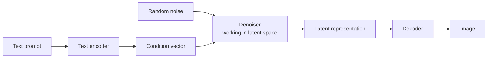

> **Learning objectives:** After this lesson, you will understand the diffusion mechanism - adding noise and then learning to remove it - through a model we **train ourselves from scratch**, and you will know where real image generation systems differ from that toy model.

## 1. A completely different way of generating

The first ten lessons generate **text**, and the way of generating is always the same: one token at a time, left to right, sampling from a distribution at each step. That is the natural approach for language, because language is inherently an ordered sequence.

Images have no such natural order. Generating a 28×28 image pixel by pixel **is possible** - there is a whole family of autoregressive models over pixels - but it takes 784 sequential steps for a tiny image, and that cost explodes at real resolutions. Diffusion chooses a completely different way of framing the problem.

**Diffusion models** work entirely differently, and the core idea sounds almost paradoxical:

> If we know how to **add** noise to an image, we can learn how to **remove** it. And if we can remove noise, then by starting from a frame of **pure noise** and removing it step by step, we will end up with an image.

This whole lesson is about seeing that idea actually work.

## 2. The forward direction: adding noise, by formula

The forward direction does not need any learning - it is a formula.

Choose in advance a noise schedule of $T$ steps. At step $t$, the original image $x_0$ is mixed with standard noise in exactly a predetermined proportion:

$$x_t = \sqrt{\bar\alpha_t}\, x_0 + \sqrt{1 - \bar\alpha_t}\,\epsilon, \qquad \epsilon \sim \mathcal{N}(0, I)$$

where $\bar\alpha_t$ decreases gradually from close to 1 to close to 0. That means:

- small $t$: the image is almost intact, with light noise
- large $t$: the image has almost disappeared, leaving only noise

This lesson uses **200 steps** with $\beta$ increasing linearly from $10^{-4}$ to $0.02$.

The nice thing about this formula: **you can jump straight to any step $t$ in a single computation**, with no looping. That makes training very convenient - each time, take an image, draw a random $t$, mix in the noise, done.

## 3. The reverse direction: learning to denoise

This is the part that needs a neural network.

The network takes the **noised image** $x_t$ and **the step $t$**, and predicts **which noise was added**. The loss function is surprisingly simple - just the squared error between the predicted noise and the true noise:

```python
t = torch.randint(0, T, (batch,))                 # draw a random step
noise = torch.randn_like(x)                       # the true noise
a = abar[t][:, None, None, None]
x_t = a.sqrt() * x + (1 - a).sqrt() * noise       # mix using the formula from section 2
loss = F.mse_loss(net(x_t, t), noise)             # predict that exact noise back
```

The network here is a very small U-Net: two down layers, a middle block, an up layer, plus a skip connection from a down layer to the up layer - exactly the encoder-decoder pattern of Computer Vision · Lesson 09. The step $t$ is fed in through an embedding vector added directly to the feature map, so the network knows what noise level it is at.

| | |
|---|---|
| Data | FashionMNIST, 60,000 images of 28×28 |
| Model | **359,425 parameters** |
| Noise steps | 200 |
| Training | 2,400 steps, batch 128 |
| Time | **864 seconds** (14 minutes) on CPU |

Loss of the last batch at each checkpoint:

| Step | 600 | 1,200 | 1,800 | 2,400 |
|---|---|---|---|---|
| Loss | 0.1472 | 0.1198 | 0.1103 | 0.0977 |

> ⚠️ **Do not read these four numbers as a learning curve.** This is the loss of **a single batch** at each checkpoint, not an average. In a diffusion model, each training step draws a random noise level $t$, and the difficulty varies enormously with $t$ - the per-$t$ table in section 4 measures **0.2247 at $t=20$ versus 0.0298 at $t=190$**, a difference of more than seven times on the same fully trained network. A single batch's loss therefore depends heavily on which values of $t$ that batch happened to draw, and four points 600 steps apart are not enough to say whether the learning curve is smooth or bumpy. To see real progress you need a moving average, or measurements broken down by $t$ - in the spirit of Deep Learning · Lesson 06.

## 4. Sampling: from noise to a picture

Generating an image means running the noise schedule in reverse. Start from a **completely random** $x_T$, then repeat 200 times: ask the network "which noise was added", subtract part of that noise, add back a little bit of small noise, and continue.

Printing four checkpoints as a character grid (getting darker from a space to `@`):

```
150 noise steps left    100 steps left          50 steps left           done (0 steps)
=*=:   #+-.@-+          =: - . ----*-            . . . * -: .                . +:-
 .::-@* :::               -*.@%.-+               -*%=@*+=*   .           -*#**#=**:
:.- =%@%@ =*+-           :+-:=%@+:*+..           :+**#%@#%=::.           *++****++=-.
 @--# .:= #*%+          :#*%@:  *.-%*:           +@*++. =-:*=:           *=++++:*+===
:# %+  =+ # *+          .* *%: .+.-.+#           -:*=== +===+%           *+++++.*+-+++
+@.@+-+ @::@%%          :+-*+ .:#+ #*#           *-+-:=:+*=%#%           ++++=+.**:+**
#*+#++% =@++%%          =*++#+#:#*%-#@           #+=%+*:++--*@           +*+*+= +*-=**
```

To the eye, all four frames are still messy, and **the generated image does not yet look like clothing**. There is structure - dark regions cluster together, edges fade - but you cannot tell whether it is a shirt or a shoe.

At this point it is very tempting to argue from a weak observation: the standard deviation of the frame decreases steadily from 0.926 to 0.521 during sampling, so "the network is pulling the image toward the data distribution". That argument **does not hold up**: a trivial shrinking operation like $x \leftarrow 0.9x$ also makes the standard deviation decrease steadily, without learning anything.

So we need two other measurements, and both are compared against baselines.

**Measurement 1: does the network predict the noise correctly?** Take 256 images from the **test set** - which the network has never seen - add noise at five different levels of $t$, and measure the squared error between the noise the network predicts and the true noise. A single number says nothing on its own, so we compare against three baselines:

| Noise predictor | ε-MSE on test images |
|---|---|
| **Trained network** | **0.0961** |
| Best linear predictor in $x_t$ | 0.5174 |
| Predictor that always returns 0 | 1.0002 |
| Same architecture but **untrained** | 1.0565 |

The 1.0002 of the always-return-0 predictor is no coincidence: the noise is drawn from a standard normal distribution with variance 1, so predicting 0 gives a squared error of almost exactly 1. That is the "do nothing" baseline. The **untrained** network is **even worse than that baseline** (1.0565), just as we saw in lesson 01 when a randomly initialized model did worse than guessing uniformly.

The third baseline is the one to worry about, and it deserves a careful explanation. Recall $x_t = \sqrt{\bar\alpha_t}\,x_0 + \sqrt{1-\bar\alpha_t}\,\varepsilon$. When $t$ is large, $\bar\alpha_t$ approaches 0, so $x_t$ **is almost exactly $\varepsilon$** - and a trivial predictor that "just returns $c \cdot x_t$" would score well without learning anything. So we measure that too: for each $t$, choose the **best possible** coefficient $c$ for this very dataset and then measure the error.

| $t$ | $\bar\alpha_t$ | Network | Linear $c\cdot x_t$ (with optimal $c$) | Predict 0 |
|---|---|---|---|---|
| 20 | 0.977 | **0.2247** | 0.9645 | 0.9986 |
| 60 | 0.827 | **0.1097** | 0.7659 | 1.0023 |
| 100 | 0.596 | **0.0713** | 0.5024 | 1.0008 |
| 150 | 0.316 | **0.0452** | 0.2405 | 0.9981 |
| 190 | 0.158 | **0.0298** | 0.1137 | 1.0014 |

There are three things to read from this table.

**The linear baseline is a real baseline, not a paper one.** At $t=190$ it reaches 0.1137 - meaning that if we only reported the average of 0.0961 without this column, readers would have no way of knowing how much of that performance comes from what the network learned and how much comes from the problem simply getting easier at large $t$.

**The network wins at every level of $t$, and wins by the widest margin where it is hardest.** At $t=20$, when $x_t$ is still almost the original image and the linear baseline is nearly useless (0.9645), the network still reaches 0.2247. To do that, it has to **separate what is image from what is noise** - exactly what we want it to learn.

**The network finds large $t$ easier.** The error goes from 0.2247 down to 0.0298. This difference in difficulty across $t$ is **one source** that can make the per-batch loss in section 3 fluctuate - but note that we have not directly measured how the loss varies over time, only how difficulty varies with $t$.

**Measurement 2: denoising a known real image.** Take an image from the test set, add noise up to level $t$, then run the entire reverse process. If the network really learned to denoise, the image should come back close to the original:

| Noise level | MSE(noised image, original) | MSE(denoised image, original) |
|---|---|---|
| $t = 60$ | 0.1732 | **0.0252** |
| $t = 120$ | 0.5946 | **0.0739** |

At $t=120$, the image is destroyed to the point where its error against the original is 0.5946; after denoising, it comes back to **0.0739** - **eight times** closer to the original. And you can see it too:

```
original                noised to t=120          after denoising
                        +  :+     --
                       :   -. =% -*
                       -=- %      .
                       . * = :   . =
                       . = @. :=   .                   .
          =++=+          + : # ****=            =#.
         =-++++        -- ::- % =++@#          :+-*%#%
        ---=+++=       :   :=%-+ #@-%        ::--=**::
      .=-=++++=+       .   .+- -+%:        :.---++#:++
   ---==+=+++++*       .#-* %@= +-* .    .+**+==+****=*
   ***==+*##%%%#       . @@*@-#:+@@ #    :=##*+=*#%#+++
                        .-  +. @..: .          .:.    .
```

The structure returns **to the same place** - the dark region in the bottom half, the shape of the object reappearing. This requires the network to know *where the noise is on each pixel* in order to subtract it; multiplying the whole image by a constant cannot rebuild the object's shape. To be precise: the two measurements above rule out **the variance-shrinking baseline and the linear baseline in $x_t$** - not *every* trivial function, since we only tried those two baselines.

**A conclusion with the right scope:** the two measurements above prove that the network **has genuinely learned to denoise**. They do **not** prove that it can generate good images from white noise - and the section above shows it cannot yet. These are two different tasks: denoising a real image that has been corrupted is much easier than building an entirely new image from noise, because in the first case most of the information is still in the frame.

Why it cannot yet generate good images is something this lesson **cannot answer**. The most plausible hypothesis is budget: **359 thousand parameters and 2,400 training steps is very little** compared with the tens of thousands of steps that models producing recognizable images on FashionMNIST usually need. But proving it would require training longer and measuring again - more than this machine can handle within the lesson.

## 5. Where real image generators differ

The model above is **unconditional diffusion on pixels**: it generates an arbitrary image resembling the training data, and you cannot control its content.

Text-to-image systems add four things:



**Diffusion in a latent space.** Denoising directly on 512×512×3 pixels is very expensive. Modern systems compress the image into a much smaller representation with an encoder, run the entire diffusion process there, and only then decode back to an image. This is the central idea of *latent diffusion*.

**Conditioning on text.** The prompt is passed through a text encoder - often exactly the kind of model Computer Vision · Lesson 11 used when running CLIP - and the resulting vector is injected into the denoiser via **cross-attention**: the same mechanism as lesson 03, but the queries come from the image while the keys and values come from the text.

**Classifier-free guidance.** During sampling, the model runs twice - once with the prompt, once without - and then pushes the result toward the prompted version. This is the knob that decides how closely the image "follows the prompt", and it plays a role similar to temperature in lesson 05: too high and the image looks forced, too low and it drifts off topic.

**The image encoder-decoder.** The compression and decompression part is a separate network, trained separately beforehand.

What is worth noticing: **none of these four things changes the core mechanism.** It is still adding noise by formula, learning to predict the noise, and removing it step by step. Those four things make it **cheaper** and **controllable**.

> 🔧 **Try it now:** generating one image with the model in this lesson requires running the network **200 times**, while running a classification model from the Computer Vision chapter on an image takes only one. Why, and what does that say about the cost of image generation?
> Because diffusion generates an image by **removing noise step by step**, and each denoising step is one call to the network. The number of steps is a parameter you choose: fewer steps are fast but give ugly images, more steps the opposite. The practical consequence: if each denoising step costs about one forward pass, then **200-step sampling is about 200 times more expensive than one classification**. That is why most research on speed in this field targets reducing the number of steps - from several hundred to a few dozen, then to a handful; new samplers and architectures have narrowed that gap considerably, so do not remember 200 as a constant. What is worth remembering is the **shape** of the cost, and it is the same as for language models in lesson 01: generation has to **loop**, recognition does not.

## Lesson summary

- Diffusion generates images differently from language models: it starts from **a frame of pure noise** and removes the noise step by step, instead of generating one element at a time in order. (Generating pixel by pixel *is* possible, but takes 784 sequential steps for a 28×28 image.)
- **The forward direction is a formula and needs no learning**: $x_t = \sqrt{\bar\alpha_t}x_0 + \sqrt{1-\bar\alpha_t}\epsilon$, and you can jump straight to any step $t$.
- **The reverse direction is what the network learns**, with a loss function that is just the squared error between the predicted noise and the true noise.
- The model we trained ourselves: **359,425 parameters**, 200 noise steps, 2,400 training steps, **14 minutes on CPU**. Every number in this lesson - loss, generated images, ε-MSE, denoising - comes from **that same single run**.
- The difficulty of denoising **varies strongly with $t$** - the same fully trained network gives an ε-MSE of **0.2247 at $t=20$ versus 0.0298 at $t=190$**. That is one source that can make the per-batch loss fluctuate, depending on which values of $t$ the batch happens to draw. The four recorded loss points are not enough to describe the shape of the learning curve.
- **A decreasing standard deviation proves NOTHING**: the trivial shrink $x \leftarrow 0.9x$ does the same without learning anything.
- The real evidence lies in two measurements with baselines. **ε-MSE on test images**: the trained network gets **0.0961**, compared with **0.5174** for the best linear predictor in $x_t$, **1.0002** for the always-return-0 predictor and **1.0565** for the untrained network. The linear baseline is the most important one - it shows how much of the performance comes from the problem simply getting easier at large $t$.
- **Denoising a known real image**: at $t=120$, the error against the original goes from 0.5946 down to **0.0739**, and the structure returns to the same place.
- But those two measurements only prove that the network **learned to denoise**, **not** that it can generate good images from white noise - and it cannot yet. Denoising an existing image is easier than building a new image from nothing.
- Why it does not yet generate good images is something the lesson **cannot answer**; a budget that is too small is only an untested hypothesis.
- Real image generation systems add four things: **diffusion in a latent space**, **text conditioning through cross-attention**, **classifier-free guidance**, and **an image encoder-decoder** - but none of them changes the core mechanism.
- Generating one image here takes **200 calls to the denoiser**; if each call costs about one forward pass, the total cost grows roughly linearly with the number of steps. Reducing the number of sampling steps is therefore the main optimization direction in this field.

## Self-check questions

1. Generating an image pixel by pixel is possible. Why do people still choose diffusion? State the cost of the first approach.
2. The forward direction of diffusion needs no learning. Explain, and say why that makes training more convenient.
3. What is the network trained to predict? Write the loss function in words.
4. Why can the per-batch loss of a diffusion model fluctuate with the mix of $t$ levels in the batch? What do the four loss points in section 3 let you conclude, and what do they **not** let you conclude?
5. Why does "the standard deviation decreases steadily" not prove that the network has learned to denoise? Give a trivial transformation that produces the same effect.
6. The always-return-0 predictor gives an ε-MSE of about 1.0. Explain that number from the properties of the noise, and why it is a good baseline.
7. The two measurements in section 4 prove the network learned to denoise, yet the generated images are still poor. Why do these two facts not contradict each other?
8. How does latent diffusion differ from the model in this lesson, and what problem does it solve?
9. Through what mechanism is the prompt fed into the denoiser? Relate it to lesson 03.

## Further reading

**Foundational sources for this lesson:**

| Source | What to read |
|---|---|
| **Computer Vision · Lesson 09** | The encoder-decoder pattern that the U-Net in section 3 reuses |
| **Computer Vision · Lesson 11** | Text and image encoders sharing one space - the basis for conditioning |
| **Lesson 03 of this chapter** | Cross-attention, the mechanism that injects the prompt into the denoiser |
| **Deep Learning · Lesson 06** | Reading a noisy loss curve, and why you should not react to a single point |

**Additional online sources (free):**

- [Ho, Jain, Abbeel - Denoising Diffusion Probabilistic Models (NeurIPS 2020)](https://arxiv.org/abs/2006.11239) - the foundational paper; the formulas in sections 2 and 3 come directly from it.
- [Rombach et al. - High-Resolution Image Synthesis with Latent Diffusion Models (CVPR 2022)](https://arxiv.org/abs/2112.10752) - latent diffusion, the basis of Stable Diffusion.
- [Ho & Salimans - Classifier-Free Diffusion Guidance (2022)](https://arxiv.org/abs/2207.12598) - the "follow the prompt" knob in section 5.
- [Weng - What are Diffusion Models?](https://lilianweng.github.io/posts/2021-07-11-diffusion-models/) - the most complete readable summary of the mathematics.
- [`diffusers` - Hugging Face documentation](https://huggingface.co/docs/diffusers) - a library for running real image generation models, including versions that run on CPU.

> **Next lesson:** [End-to-End Project: Question Answering over This Book](../end-to-end-project-question-answering-over-this-book/) - eleven lessons have built all the pieces - tokens, attention, text generation, the limits of capability, hallucination, embeddings and retrieval. The final lesson assembles them into a real system, uses the 51 lessons of the previous four chapters as its knowledge base, and evaluates **two separate layers** so that when the system goes wrong, you know where.
