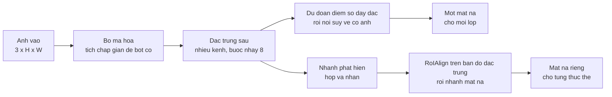

> **Mục tiêu bài học:** Sau bài này, bạn sẽ đặt được bốn bài toán thị giác vào đúng bậc thang của chúng, phân biệt phân đoạn ngữ nghĩa với phân đoạn thực thể bằng số liệu chứ không bằng định nghĩa, và biết đọc hai thước đo Dice và IoU cho mặt nạ - kèm một cảnh báo về chính nhãn thật mà ta đang chấm điểm dựa vào.

## 1. Bốn câu hỏi về cùng một tấm ảnh

Lấy một tấm ảnh COCO có **ba con chó**: `000000269113.jpg`, 640×457, phần chó chiếm 10,86% số pixel.

Đưa nó cho bốn loại mô hình, mỗi loại trả lời một câu hỏi khác nhau:

| Bài toán | Câu hỏi | Đầu ra thật trên tấm ảnh này |
|---|---|---|
| **Phân loại** | Trong ảnh có gì? | malinois 0,053 · German shepherd 0,050 · Rhodesian ridgeback 0,032 |
| **Phát hiện** | Mỗi thứ nằm ở đâu? | 3 hộp: `dog` 1,000 · `dog` 0,999 · `dog` 0,997 |
| **Phân đoạn ngữ nghĩa** | Pixel nào thuộc lớp chó? | 1 mặt na phủ 11,49% số pixel |
| **Phân đoạn thực thể** | Đâu là chó #1, chó #2, chó #3? | 3 mặt nạ riêng, mỗi mặt nạ một con |

Dòng đầu tiên đã hỏng. ResNet-50 là mô hình phân loại tốt - bài 01 đo được 0,8718 với nó - nhưng ở đây lớp cao nhất chỉ được **0,053**, tức nó không đưa ra câu trả lời dùng được cho tấm ảnh này.

Một tấm ảnh thì **không chứng minh được nguyên nhân** của con số ấy: một mô hình phân loại một nhãn vẫn có thể rất tự tin trên ảnh nhiều vật nếu một vật chiếm ưu thế, và nó cũng có thể cho 0,053 trên ảnh chỉ có đúng một vật khó. Con số này là minh họa, không phải bằng chứng.

Cái **có tính cấu trúc** thì không cần đo mới biết, vì nó nằm ngay trong hình dạng đầu ra: dù xác suất có cao đến đâu, một softmax một nhãn cũng chỉ chọn được **một lớp cho cả tấm ảnh**. Nó không có chỗ nào để nói "có ba con", càng không có chỗ nào để nói mỗi con ở đâu.

Nói cho chính xác: **phân loại nhiều nhãn** thì làm được nhiều hơn thế - nó trả lời được "trong ảnh có chó, có người, có xe" bằng cách dùng sigmoid độc lập cho từng lớp thay vì softmax. Cái nó vẫn không trả lời được là **ở đâu** và **mấy con**. Ba dòng còn lại của bảng sinh ra để trả lời đúng hai câu hỏi ấy.

Ba dòng còn lại là ba bậc thang của bài này và bài 07-08.

## 2. Ngữ nghĩa và thực thể: khác nhau ở chỗ nào

Hai loại phân đoạn dễ nhầm vì cùng trả về mặt nạ pixel. Chạy cả hai trên đúng tấm ảnh ấy:

- **DeepLabV3-ResNet50** - phân đoạn ngữ nghĩa, gán mỗi pixel một trong 21 lớp
- **Mask R-CNN** - phân đoạn thực thể, trả về từng vật kèm mặt nạ riêng

In mặt nạ ra lưới 24 cột để nhìn (`#` là chắc chắn, `+` là biên, `.` là nền):

```
nhãn thật (3 con chó)          DeepLabV3 (một mặt nạ)        Mask R-CNN (hợp 3 thực thể)
........................       ........................      ........................
........................       ........................      ........................
..###+.....+##+.........       ..###+.....+##+.........      ..###+.....+##+......+..
.+##+.......+++..++###+.       .###+.......+++..++###+.      .+##+.......+++..++###+.
.++..............####...       .+++.............####+..      ..++.............####+..
................+++#+...       ................+++#+...      ................+++#+...
........................       ........................      ........................
```

Ba mặt nạ trông gần như nhau. Và số liệu cũng nói vậy:

| Mô hình | Số vùng trả về | IoU với nhãn thật | Dice với nhãn thật | Tỉ lệ pixel dự đoán |
|---|---|---|---|---|
| DeepLabV3 | **1** (cho cả lớp) | 0,8600 | 0,9247 | 11,49% |
| Mask R-CNN (hợp cả 3) | **3** (mỗi con một mặt nạ) | 0,8495 | 0,9186 | - |

**Về chất lượng pixel, hai con số khá gần nhau trên tấm ảnh này** - 0,8600 so với 0,8495. Một tấm ảnh thì không đủ để nói mô hình nào tốt hơn, và bài này cũng không cần điều đó: khác biệt đáng nói nằm ở **cấu trúc đầu ra**, chứ không ở độ chính xác.

DeepLabV3 trả về một mặt nạ duy nhất cho cả lớp "chó". Nếu hai con chó đứng chạm nhau, mặt nạ ấy dính liền thành một mảng, và không có cách nào tách ra - thông tin *có mấy con* đã mất ngay từ thiết kế của bài toán, không phải do mô hình yếu.

Mask R-CNN trả về ba mặt nạ tách rời, mỗi cái khớp với đúng một con chó trong nhãn thật:

| Thực thể | Điểm tin cậy | Khớp với chó thật số | IoU |
|---|---|---|---|
| 1 | 1,000 | #2 | 0,8409 |
| 2 | 0,999 | #1 | 0,8469 |
| 3 | 0,997 | #3 | 0,8584 |

Ba thực thể, ba nhãn thật khác nhau, không cái nào trùng cái nào. Đó là thứ DeepLabV3 không làm được dù chất lượng pixel của nó nhỉnh hơn một chút.

**Chọn cái nào là chọn theo câu hỏi bạn cần trả lời:**

- "Bao nhiêu phần trăm ruộng bị bệnh" → ngữ nghĩa là đủ, và rẻ hơn
- "Có bao nhiêu con bò, con nào nặng bao nhiêu" → bắt buộc phải thực thể
- "Đường đi được ở đâu" cho xe tự lái → ngữ nghĩa
- "Đếm và bám theo từng người trong đám đông" → thực thể

## 3. Dice và IoU: hai cách đo cùng một thứ

Bài 07 đã dùng IoU cho hộp. Với mặt nạ thì công thức y hệt, chỉ đổi từ diện tích hình chữ nhật sang đếm pixel:

$$\text{IoU} = \frac{|A \cap B|}{|A \cup B|}, \qquad \text{Dice} = \frac{2|A \cap B|}{|A| + |B|}$$

Hai công thức luôn cùng chiều - cái nào cao thì cái kia cũng cao - nhưng **Dice luôn lớn hơn hoặc bằng IoU**, và bảng ở mục 2 cho thấy khoảng cách ấy không nhỏ: 0,8600 so với 0,9247, tức chênh gần 6,5 điểm cho cùng một mặt nạ.

Quan hệ giữa chúng là một công thức gọn:

$$\text{Dice} = \frac{2\,\text{IoU}}{1 + \text{IoU}}$$

Kiểm nhanh với IoU = 0,86: $2 \times 0{,}86 / 1{,}86 = 0{,}9247$ - đúng con số trong bảng.

Hệ quả thực dụng: **đừng bao giờ so một con số Dice với một con số IoU.** Hai bài báo cùng chất lượng, một bên báo Dice một bên báo IoU, sẽ trông như chênh nhau 6-7 điểm dù thực ra bằng nhau. Đây đúng là kiểu lỗi mà quy ước ba loại con số ở bài 01 dựng ra để chặn.

> ⚠️ **Lưu ý nhỏ:** Dice trong bài toán phân đoạn chính là **F1** của chương Machine Learning · Bài 03, viết ở dạng tập hợp. Coi mỗi pixel dự đoán đúng là TP, dự đoán thừa là FP, bỏ sót là FN thì $2|A \cap B| / (|A| + |B|) = 2\text{TP} / (2\text{TP} + \text{FP} + \text{FN})$ - đúng công thức F1. Không phải thước đo mới, chỉ là tên khác trong một ngành khác.

## 4. Nhãn thật cũng có thể sai

Trước khi tin bất kỳ con số nào ở trên, có một chuyện phải nói.

Khi đi tìm ảnh cho bài này, tấm đầu tiên gặp được là ảnh COCO có **bốn** vùng gán nhãn `dog` - nhiều nhất trong cả tập. Chạy Mask R-CNN lên nó: **không tìm thấy con chó nào**. DeepLabV3 cũng không. Xem mô hình thực sự thấy gì:

```
teddy bear 0,964 · teddy bear 0,873 · book 0,853 · teddy bear 0,691 · teddy bear 0,530
```

Đó là ảnh chụp mấy con **chó nhồi bông**. Người gán nhãn COCO gọi chúng là `dog`; mô hình gọi là `teddy bear`. Rất khó nói ai sai - đó là một lựa chọn về quy ước, và quy ước ấy nằm trong tài liệu hướng dẫn gán nhãn chứ không nằm trong tấm ảnh.

Ba điều rút ra:

**Con số thấp chưa chắc do mô hình.** Nếu chỉ nhìn IoU trên tấm ảnh ấy, ta sẽ ghi 0,00 và kết luận "Mask R-CNN thất bại". Kết luận ấy sai. Phải mở ảnh ra xem.

**Nhãn thật là ý kiến của người gán nhãn.** Chương Machine Learning · Bài 12 đã nói chuyện này với dữ liệu bảng; ở ảnh nó còn rõ hơn, vì ranh giới giữa các khái niệm mờ hơn nhiều - chó nhồi bông có phải chó không, cửa sổ phản chiếu có phải cửa sổ không, người trong ảnh treo tường có phải người không.

**Vì thế mọi con số ở bài này đo trên một tấm ảnh cụ thể mà tôi đã mở ra xem.** Chúng là *đo trên máy này* theo quy ước bài 01, không phải số công bố, và một tấm ảnh thì không đại diện cho bộ dữ liệu - đúng lý do bài 07 đã nêu khi từ chối tính mAP trên một ảnh.

> 🔧 **Thử ngay:** mô hình phân đoạn của bạn đạt Dice 0,91 trên tập kiểm tra nhưng người dùng phàn nàn nó "đếm sai số lượng". Chuyện gì đang xảy ra?
> Nhiều khả năng bạn đang dùng **phân đoạn ngữ nghĩa** cho một bài toán cần **phân đoạn thực thể**. Dice 0,91 nói rằng tập pixel được gán nhãn rất chính xác - nhưng nếu hai vật chạm nhau, mặt nạ của chúng dính liền thành một mảng, và Dice không hề phạt chuyện đó. Thước đo đang đo đúng thứ nó được thiết kế để đo, chỉ là thứ ấy không phải thứ người dùng cần. Cách chữa: đổi sang mô hình thực thể như Mask R-CNN, và đổi luôn thước đo sang một chỉ số có phạt lỗi đếm - chẳng hạn đếm số thực thể khớp được ở một ngưỡng IoU, đúng tinh thần AP của bài 07.

## 5. Cấu trúc chung: mã hóa rồi giải mã

Cả hai họ mô hình đều dựa trên một khuôn giống nhau, và khuôn ấy giải thích vì sao phân đoạn khó hơn phân loại.



Phần mã hóa chính là mạng tích chập của bài 02 và 03: bản đồ đặc trưng co lại, số kênh phình ra - đúng bảng ở bài 04. Nhưng phân đoạn cần **một nhãn cho mỗi pixel gốc**, nên co quá mạnh là tự làm khó mình.

Đó là chỗ hai họ rẽ nhánh, và cả hai đều có cách né bớt việc co.

**DeepLabV3 giữ độ phân giải cao hơn ngay trong phần mã hóa.** Nó dùng **tích chập giãn** (atrous convolution): bộ lọc 3×3 nhưng các điểm lấy mẫu cách nhau, nên trường tiếp nhận rộng ra *mà không cần giảm kích thước*. Đo trên chính mô hình của torchvision: với ảnh vào 224×224, xương sống của DeepLabV3 cho ra bản đồ **28×28**, tức bước nhảy tích lũy là **8** - trong khi ResNet-50 dùng để phân loại cho ra 7×7, bước nhảy 32. Bốn lần dày hơn theo mỗi chiều. Sau đó nó dự đoán điểm số dày đặc rồi nội suy về kích thước ảnh.

**Mask R-CNN đi đường khác:** trước hết phát hiện từng vật như bài 08, rồi với **mỗi hộp**, nó dùng `RoIAlign` để lấy ra một mảng đặc trưng nhỏ *từ bản đồ đặc trưng* - không phải cắt từ ảnh gốc - và một nhánh riêng dự đoán mặt nạ trên mảng ấy. Vì thế nó biết chó #1 khác chó #2: hai mặt nạ sinh ra từ hai hộp khác nhau.

Và vì thế nó cũng thừa hưởng mọi điểm yếu của phần phát hiện ở bài 08: vật nào không được phát hiện thì không bao giờ có mặt nạ, dù pixel của nó nằm sờ sờ trong ảnh.

## Tóm tắt bài học

- Bốn bài toán là bốn câu hỏi khác nhau về cùng tấm ảnh: *có gì* → *ở đâu* → *pixel nào thuộc lớp* → *đâu là thực thể thứ mấy*.
- Giới hạn của **phân loại một nhãn** nằm ở hình dạng đầu ra chứ không ở độ tự tin: một softmax chỉ chọn được một lớp cho cả ảnh, nên không nói được *mấy con* hay *ở đâu*. Con số 0,053 trên ảnh ba con chó là minh họa cho chuyện đó, không phải bằng chứng về nguyên nhân.
- Phân loại **nhiều nhãn** nói được "có chó, có người", nhưng vẫn không nói được ở đâu và mấy con.
- Trên tấm ảnh minh họa, hai họ cho **hai con số khá gần nhau** (IoU 0,8600 so với 0,8495) - một ảnh thì không đủ để xếp hạng chúng. Khác biệt đáng nói nằm ở **cấu trúc đầu ra**: một mặt nạ cho cả lớp, so với ba mặt nạ khớp ba con chó riêng biệt.
- Thông tin "có mấy con" mất đi ngay từ **định nghĩa bài toán** ngữ nghĩa, không phải do mô hình yếu.
- **Dice luôn ≥ IoU**, liên hệ với nhau qua $\text{Dice} = 2\,\text{IoU}/(1+\text{IoU})$: IoU 0,86 thành Dice 0,9247. Đừng so số Dice với số IoU. Dice chính là F1 viết ở dạng tập hợp.
- **Nhãn thật cũng có thể sai hoặc chỉ là quy ước**: một ảnh COCO gán 4 vùng `dog` hóa ra là chó nhồi bông, và mô hình gọi chúng là `teddy bear` với điểm 0,964.
- **DeepLabV3 dùng tích chập giãn để giữ độ phân giải**: xương sống của nó cho bản đồ 28×28 với ảnh vào 224×224 (bước nhảy 8), so với 7×7 (bước nhảy 32) của ResNet-50 phân loại.
- **Mask R-CNN dùng `RoIAlign` trên bản đồ đặc trưng**, không cắt từ ảnh gốc; nó thừa hưởng cả sức mạnh lẫn điểm yếu của phần phát hiện ở bài 08.

## Câu hỏi tự kiểm tra

1. Vì sao ResNet-50 chỉ đạt xác suất 0,053 trên ảnh ba con chó? Phân loại nhiều nhãn chữa được phần nào của vấn đề, và không chữa được phần nào?
2. DeepLabV3 đạt IoU 0,8600 còn Mask R-CNN đạt 0,8495 **trên một tấm ảnh**. Nêu hai lý do khác nhau khiến không kết luận được mô hình nào tốt hơn.
3. Hai con bò đứng chạm nhau. Đầu ra của phân đoạn ngữ nghĩa và phân đoạn thực thể khác nhau thế nào? Thước đo Dice có phân biệt được hai đầu ra ấy không?
4. Cho IoU = 0,5. Dice bằng bao nhiêu? Dùng công thức liên hệ ở mục 3.
5. Vì sao Dice và IoU luôn cùng chiều nhưng Dice luôn lớn hơn? Giải thích bằng hai công thức.
6. Một ảnh COCO gán nhãn `dog` cho chó nhồi bông. Nếu bạn tính IoU trên ảnh ấy và được 0,00, kết luận nào là sai và bạn phải làm gì trước khi kết luận?
7. Mask R-CNN bỏ sót một con chó ở bước phát hiện. Điều gì xảy ra với mặt nạ của con chó ấy, và vì sao đây là điểm yếu có tính cấu trúc?
8. Tích chập giãn cho trường tiếp nhận rộng mà không giảm kích thước bản đồ. Vì sao điều đó quan trọng với phân đoạn hơn là với phân loại?

## Đọc thêm

**Nguồn nền tảng của bài:**

| Nguồn | Đọc phần nào |
|---|---|
| **Bài 07 của chương này** | IoU và cách chấm điểm - bài này dùng lại nguyên xi, chỉ đổi hộp thành mặt nạ |
| **Bài 08 của chương này** | Nhánh phát hiện mà Mask R-CNN xây thêm mặt nạ lên trên |
| **Chương Machine Learning · Bài 03** | F1 - chính là Dice viết ở dạng khác |
| **Dive into Deep Learning (d2l.ai)** | Chương 14.9 *Semantic Segmentation and the Dataset* và 14.11 *Fully Convolutional Networks* |

**Nguồn online bổ sung (miễn phí):**

- [Long, Shelhamer, Darrell - Fully Convolutional Networks (CVPR 2015)](https://arxiv.org/abs/1411.4038) - bài mở đầu cho phân đoạn ngữ nghĩa hiện đại, giới thiệu khuôn mã hóa-giải mã.
- [Chen và cộng sự - Rethinking Atrous Convolution (DeepLabv3, 2017)](https://arxiv.org/abs/1706.05587) - mô hình dùng ở mục 2, và kỹ thuật tích chập giãn để giữ độ phân giải.
- [He và cộng sự - Mask R-CNN (ICCV 2017)](https://arxiv.org/abs/1703.06870) - mục 3 giải thích nhánh mặt nạ được gắn lên Faster R-CNN như thế nào.
- [Ronneberger, Fischer, Brox - U-Net (MICCAI 2015)](https://arxiv.org/abs/1505.04597) - kiến trúc mã hóa-giải mã đối xứng, chuẩn mực trong ảnh y tế; đọc để thấy một cách giải mã khác.
- [Semantic segmentation models - tài liệu torchvision](https://pytorch.org/vision/stable/models.html#semantic-segmentation) - danh sách mô hình có sẵn kèm số công bố của chúng.

> **Bài tiếp theo:** [Vision Transformer](../vision-transformer-vi/) - chín bài đầu đều dựng trên phép tích chập, với giả định pixel gần nhau thì liên quan. Bài sau bỏ hẳn giả định ấy: cắt ảnh thành các mảnh rồi để mô hình tự học xem mảnh nào liên quan tới mảnh nào - và đo xem việc vứt bỏ một thiên hướng đúng đắn phải trả giá bằng gì.
