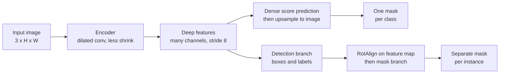

> **Learning objectives:** After this lesson, you will be able to place four vision tasks on their proper rungs of a ladder, tell semantic segmentation from instance segmentation with numbers rather than definitions, and read the two metrics Dice and IoU for masks - along with a warning about the very ground truth we are scoring against.

## 1. Four questions about the same image

Take a COCO image with **three dogs**: `000000269113.jpg`, 640×457, with the dogs covering 10.86% of the pixels.

Give it to four kinds of model, each answering a different question:

| Task | Question | Real output on this image |
|---|---|---|
| **Classification** | What is in the image? | malinois 0.053 · German shepherd 0.050 · Rhodesian ridgeback 0.032 |
| **Detection** | Where is each thing? | 3 boxes: `dog` 1.000 · `dog` 0.999 · `dog` 0.997 |
| **Semantic segmentation** | Which pixels belong to the dog class? | 1 mask covering 11.49% of the pixels |
| **Instance segmentation** | Which is dog #1, dog #2, dog #3? | 3 separate masks, one mask per dog |

The first row is already broken. ResNet-50 is a good classification model - Lesson 01 measured 0.8718 with it - but here the top class gets only **0.053**, which means it gives no usable answer for this image.

A single image **cannot prove the cause** of that number: a single-label classifier can still be very confident on an image with many objects if one object dominates, and it can also give 0.053 on an image containing exactly one hard object. This number is an illustration, not evidence.

What **is structural** needs no measurement, because it sits right in the shape of the output: however high the probability, a single-label softmax can only pick **one class for the whole image**. It has no place to say "there are three", let alone a place to say where each one is.

To be precise: **multi-label classification** can do more than that - it can answer "there is a dog, a person, a car in the image" by using an independent sigmoid for each class instead of a softmax. What it still cannot answer is **where** and **how many**. The remaining three rows of the table exist to answer exactly those two questions.

The remaining three rows are the three rungs of this lesson and Lessons 07-08.

## 2. Semantic versus instance: where the difference lies

The two kinds of segmentation are easy to confuse because both return pixel masks. Run both on that same image:

- **DeepLabV3-ResNet50** - semantic segmentation, assigns each pixel one of 21 classes
- **Mask R-CNN** - instance segmentation, returns each object with its own mask

Print the masks on a 24-column grid to look at them (`#` is certain, `+` is boundary, `.` is background):

```
ground truth (3 dogs)          DeepLabV3 (one mask)          Mask R-CNN (union of 3 instances)
........................       ........................      ........................
........................       ........................      ........................
..###+.....+##+.........       ..###+.....+##+.........      ..###+.....+##+......+..
.+##+.......+++..++###+.       .###+.......+++..++###+.      .+##+.......+++..++###+.
.++..............####...       .+++.............####+..      ..++.............####+..
................+++#+...       ................+++#+...      ................+++#+...
........................       ........................      ........................
```

The three masks look almost the same. And the numbers say so too:

| Model | Regions returned | IoU with ground truth | Dice with ground truth | Predicted pixel fraction |
|---|---|---|---|---|
| DeepLabV3 | **1** (for the whole class) | 0.8600 | 0.9247 | 11.49% |
| Mask R-CNN (union of all 3) | **3** (one mask per dog) | 0.8495 | 0.9186 | - |

**In pixel quality, the two numbers are quite close on this image** - 0.8600 versus 0.8495. A single image is not enough to say which model is better, and this lesson does not need that either: the difference worth talking about lies in the **structure of the output**, not in accuracy.

DeepLabV3 returns a single mask for the whole "dog" class. If two dogs stand touching each other, that mask merges into one blob, and there is no way to separate it - the information about *how many* was lost by the very design of the task, not because the model is weak.

Mask R-CNN returns three separate masks, each matching exactly one dog in the ground truth:

| Instance | Confidence score | Matches real dog no. | IoU |
|---|---|---|---|
| 1 | 1.000 | #2 | 0.8409 |
| 2 | 0.999 | #1 | 0.8469 |
| 3 | 0.997 | #3 | 0.8584 |

Three instances, three different ground-truth objects, none overlapping another. That is what DeepLabV3 cannot do even though its pixel quality is slightly higher.

**Which one to choose depends on the question you need to answer:**

- "What percentage of the field is diseased" → semantic is enough, and cheaper
- "How many cows are there, and how much does each weigh" → instance is mandatory
- "Where is the drivable road" for a self-driving car → semantic
- "Count and track each person in a crowd" → instance

## 3. Dice and IoU: two ways to measure the same thing

Lesson 07 used IoU for boxes. For masks the formula is identical, only switching from rectangle area to counting pixels:

$$\text{IoU} = \frac{|A \cap B|}{|A \cup B|}, \qquad \text{Dice} = \frac{2|A \cap B|}{|A| + |B|}$$

The two formulas always move in the same direction - when one is high the other is high too - but **Dice is always greater than or equal to IoU**, and the table in section 2 shows the gap is not small: 0.8600 versus 0.9247, a difference of nearly 6.5 points for the same mask.

The relationship between them is a compact formula:

$$\text{Dice} = \frac{2\,\text{IoU}}{1 + \text{IoU}}$$

A quick check with IoU = 0.86: $2 \times 0.86 / 1.86 = 0.9247$ - exactly the number in the table.

The practical consequence: **never compare a Dice number with an IoU number.** Two papers of equal quality, one reporting Dice and the other IoU, will look 6-7 points apart even though they are actually equal. This is exactly the kind of mistake that the three-kinds-of-numbers convention in Lesson 01 was set up to prevent.

> ⚠️ **A small note:** Dice in segmentation is exactly the **F1** of Machine Learning · Lesson 03, written in set form. Treat each correctly predicted pixel as a TP, each extra prediction as an FP, each missed pixel as an FN, and $2|A \cap B| / (|A| + |B|) = 2\text{TP} / (2\text{TP} + \text{FP} + \text{FN})$ - exactly the F1 formula. Not a new metric, just a different name in a different field.

## 4. The ground truth can be wrong too

Before trusting any of the numbers above, there is something that has to be said.

While looking for an image for this lesson, the first one I came across was a COCO image with **four** regions labeled `dog` - the most in the whole set. Run Mask R-CNN on it: **no dogs found**. DeepLabV3 found none either. Look at what the model actually sees:

```
teddy bear 0,964 · teddy bear 0,873 · book 0,853 · teddy bear 0,691 · teddy bear 0,530
```

It is a photo of some **stuffed toy dogs**. The COCO annotators called them `dog`; the model calls them `teddy bear`. It is very hard to say who is wrong - it is a choice of convention, and that convention lives in the annotation guidelines, not in the image.

Three lessons to draw:

**A low number is not necessarily the model's fault.** Looking only at the IoU on that image, we would record 0.00 and conclude "Mask R-CNN failed". That conclusion is wrong. You have to open the image and look.

**Ground truth is the annotator's opinion.** Machine Learning · Lesson 12 discussed this with tabular data; with images it is even clearer, because the boundaries between concepts are much blurrier - is a stuffed dog a dog, is a reflection in a window a window, is a person in a picture hanging on the wall a person.

**That is why every number in this lesson is measured on one specific image that I opened and looked at.** They are *measured on this machine* under the Lesson 01 convention, not published numbers, and a single image does not represent the dataset - exactly the reason Lesson 07 gave when it declined to compute mAP on one image.

> 🔧 **Try it now:** your segmentation model reaches Dice 0.91 on the test set, but users complain that it "counts the wrong number". What is going on?
> Most likely you are using **semantic segmentation** for a task that needs **instance segmentation**. Dice 0.91 says the set of pixels is labeled very accurately - but if two objects touch, their masks merge into one blob, and Dice does not penalize that at all. The metric is measuring exactly what it was designed to measure; that just is not what users need. The fix: switch to an instance model such as Mask R-CNN, and also switch the metric to one that penalizes counting errors - for example counting the number of instances matched at an IoU threshold, in the same spirit as AP in Lesson 07.

## 5. The common structure: encode, then decode

Both model families rest on the same template, and that template explains why segmentation is harder than classification.



The encoder is the convolutional network from Lessons 02 and 03: the feature map shrinks, the channel count grows - exactly the table in Lesson 04. But segmentation needs **one label for every original pixel**, so shrinking too aggressively makes things hard for yourself.

That is where the two families diverge, and both have a way to avoid some of the shrinking.

**DeepLabV3 keeps a higher resolution right inside the encoder.** It uses **dilated convolution** (atrous convolution): a 3×3 filter but with the sampling points spaced apart, so the receptive field grows *without reducing the size*. Measured on torchvision's own model: for a 224×224 input, DeepLabV3's backbone outputs a **28×28** map, meaning a cumulative stride of **8** - while the ResNet-50 used for classification outputs 7×7, stride 32. Four times denser along each dimension. It then predicts dense scores and upsamples them to the image size.

**Mask R-CNN takes a different road:** it first detects each object as in Lesson 08, then for **each box** it uses `RoIAlign` to pull out a small patch of features *from the feature map* - not cropped from the original image - and a separate branch predicts the mask on that patch. That is how it knows dog #1 is different from dog #2: the two masks come from two different boxes.

And that is also why it inherits every weakness of the detection stage in Lesson 08: an object that is not detected never gets a mask, even if its pixels are plainly there in the image.

## Lesson summary

- The four tasks are four different questions about the same image: *what is there* → *where* → *which pixels belong to a class* → *which instance is which*.
- The limit of **single-label classification** lies in the shape of the output, not in confidence: a softmax can pick only one class for the whole image, so it cannot say *how many* or *where*. The 0.053 on the three-dog image illustrates this; it is not evidence of the cause.
- **Multi-label** classification can say "there is a dog, there is a person", but still cannot say where or how many.
- On the example image, the two families give **two fairly close numbers** (IoU 0.8600 versus 0.8495) - one image is not enough to rank them. The difference worth talking about is in the **structure of the output**: one mask for the whole class, versus three masks matching three separate dogs.
- The "how many" information is lost by the very **definition of the semantic task**, not because the model is weak.
- **Dice is always ≥ IoU**, related by $\text{Dice} = 2\,\text{IoU}/(1+\text{IoU})$: IoU 0.86 becomes Dice 0.9247. Do not compare Dice numbers with IoU numbers. Dice is just F1 written in set form.
- **Ground truth can also be wrong or merely a convention**: a COCO image with 4 regions labeled `dog` turns out to be stuffed toy dogs, and the model calls them `teddy bear` with a score of 0.964.
- **DeepLabV3 uses dilated convolution to keep resolution**: its backbone gives a 28×28 map for a 224×224 input (stride 8), versus 7×7 (stride 32) for the classification ResNet-50.
- **Mask R-CNN uses `RoIAlign` on the feature map**, not crops from the original image; it inherits both the strengths and the weaknesses of the detection stage in Lesson 08.

## Self-check questions

1. Why does ResNet-50 reach only a probability of 0.053 on the three-dog image? Which part of the problem does multi-label classification fix, and which part does it not?
2. DeepLabV3 reaches IoU 0.8600 and Mask R-CNN reaches 0.8495 **on one image**. Give two different reasons why you cannot conclude which model is better.
3. Two cows stand touching each other. How do the outputs of semantic segmentation and instance segmentation differ? Can the Dice metric tell those two outputs apart?
4. Given IoU = 0.5, what is Dice? Use the relationship formula in section 3.
5. Why do Dice and IoU always move in the same direction while Dice is always larger? Explain using the two formulas.
6. A COCO image labels stuffed toy dogs as `dog`. If you compute IoU on that image and get 0.00, which conclusion is wrong, and what must you do before concluding anything?
7. Mask R-CNN misses a dog at the detection step. What happens to that dog's mask, and why is this a structural weakness?
8. Dilated convolution gives a wide receptive field without reducing the map size. Why does that matter more for segmentation than for classification?

## Further reading

**Foundational sources for this lesson:**

| Source | Which part to read |
|---|---|
| **Lesson 07 of this chapter** | IoU and scoring - this lesson reuses it as is, only changing boxes into masks |
| **Lesson 08 of this chapter** | The detection branch that Mask R-CNN builds the mask on top of |
| **Machine Learning · Lesson 03** | F1 - which is just Dice written in a different form |
| **Dive into Deep Learning (d2l.ai)** | Chapter 14.9 *Semantic Segmentation and the Dataset* and 14.11 *Fully Convolutional Networks* |

**Additional online sources (free):**

- [Long, Shelhamer, Darrell - Fully Convolutional Networks (CVPR 2015)](https://arxiv.org/abs/1411.4038) - the paper that opened modern semantic segmentation, introducing the encoder-decoder template.
- [Chen et al. - Rethinking Atrous Convolution (DeepLabv3, 2017)](https://arxiv.org/abs/1706.05587) - the model used in section 2, and the dilated convolution technique for keeping resolution.
- [He et al. - Mask R-CNN (ICCV 2017)](https://arxiv.org/abs/1703.06870) - section 3 explains how the mask branch is attached to Faster R-CNN.
- [Ronneberger, Fischer, Brox - U-Net (MICCAI 2015)](https://arxiv.org/abs/1505.04597) - a symmetric encoder-decoder architecture, the standard in medical imaging; read it to see another way of decoding.
- [Semantic segmentation models - torchvision documentation](https://pytorch.org/vision/stable/models.html#semantic-segmentation) - the list of available models with their published numbers.

> **Next lesson:** [Vision Transformer](../vision-transformer/) - the first nine lessons were all built on convolution, with the assumption that nearby pixels are related. The next lesson drops that assumption entirely: cut the image into patches and let the model learn for itself which patch relates to which - and measure what it costs to throw away a correct inductive bias.
