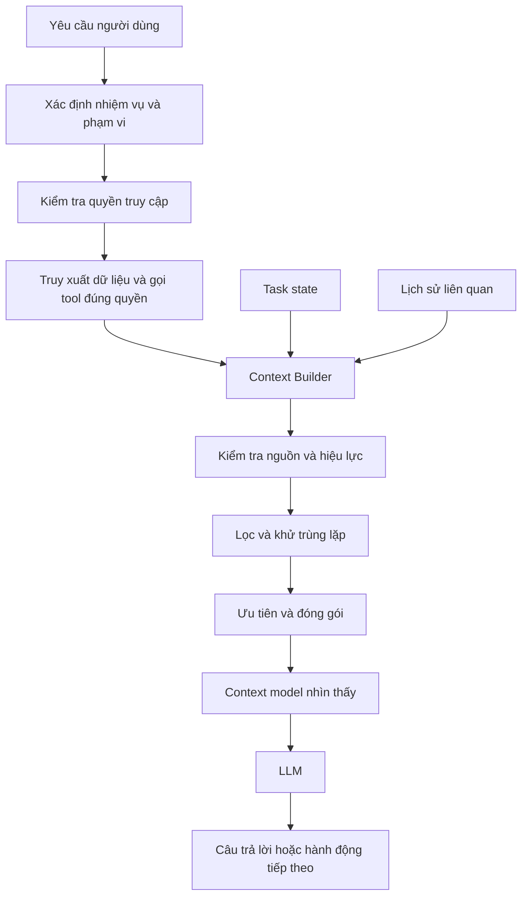
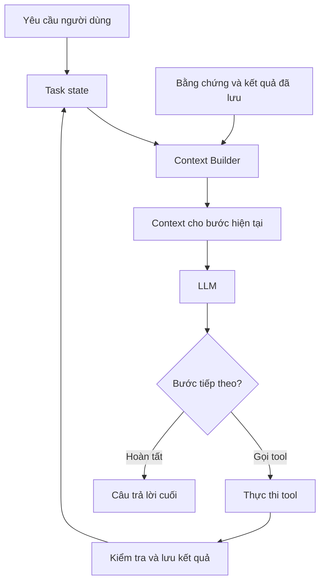

Agent đã truy xuất đúng dữ liệu, tool hoạt động bình thường, nhưng câu trả lời vẫn sai. Đôi khi vấn đề không nằm ở model hay retrieval, mà ở **những gì thực sự được đưa vào context của model**.

## 1. Khi dữ liệu đúng nhưng AI vẫn kết luận sai

Giả sử chúng ta xây một AI Assistant phân tích hoạt động kinh doanh cho chuỗi cửa hàng bán lẻ. Người quản lý hỏi:

> "Vì sao doanh thu tháng 8 tăng nhưng lợi nhuận lại giảm? Hãy phân tích và đề xuất hướng cải thiện."

Kết quả từ database cho thấy:

| Chỉ số | Tháng 7 | Tháng 8 | Thay đổi |
| :-- | --: | --: | --: |
| Doanh thu | 200 triệu đồng | 230 triệu đồng | +15% |
| Tổng chi phí | 160 triệu đồng | 200 triệu đồng | +25% |
| Lợi nhuận | 40 triệu đồng | 30 triệu đồng | -25% |

*Toàn bộ số liệu trong bài là dữ liệu giả lập.*

SQL trả về số liệu chính xác. Knowledge Base cũng tìm được tài liệu về chương trình khuyến mãi. Nhưng AI lại trả lời:

> "Doanh thu tăng 15% nhưng lợi nhuận giảm 25% do chi phí quảng cáo tăng mạnh. Cửa hàng nên cắt giảm ngân sách marketing."

Dữ liệu chỉ xác nhận **tổng chi phí** tăng 25%, chưa có chi tiết để kết luận marketing là nguyên nhân chính. Khi xem execution trace, chúng ta thấy model đã nhận số liệu SQL hiện tại, kết quả từ các lần truy vấn trước, tài liệu khuyến mãi và một bản phân tích cũ từng nhắc đến quảng cáo. Dữ kiện đã xác minh và giả thuyết cũ cùng xuất hiện trong prompt nhưng không được phân biệt rõ nguồn hay thời điểm áp dụng.

Không tool nào nhất thiết phải lỗi để điều này xảy ra. Vấn đề nằm ở **cách lắp ghép context (context assembly)**.

Bài [Context Engineering ở phần Learn](../context-engineering-vi/) giải thích vì sao cần kiểm soát những gì model nhìn thấy. Bài này đi vào câu hỏi triển khai cụ thể hơn: **Làm sao xây một pipeline chọn, tổ chức, cập nhật và kiểm chứng context trước mỗi lần gọi model?**

## 2. Đặt Context Builder giữa dữ liệu và model

Một Agent có thể truy cập database, Knowledge Base, lịch sử hội thoại, task state và kết quả từ tools. Nhưng **thông tin có trong hệ thống không đồng nghĩa với thông tin cần xuất hiện trong prompt tiếp theo**.

Giả sử Agent đã truy vấn doanh thu, chi phí của hai tháng và tìm tài liệu khuyến mãi. Toàn bộ kết quả có thể nằm trong task state hoặc kho lưu trữ ngoài. Ở bước quyết định tiếp theo, model có thể chỉ cần số liệu đã xác minh, nguồn của chúng, điều còn chưa biết và việc có cần phân tích sâu cơ cấu chi phí hay không.



*Hình 1. Quyền truy cập được thực thi trước khi truy xuất; Context Builder sau đó chọn thông tin hợp lệ cho lần gọi model này.*

Context Builder không nhất thiết là một service riêng. Nó có thể là module Python, middleware trước model call hoặc một phần của Agent runtime. Điều quan trọng là phân biệt ba nơi chứa thông tin:

| Thành phần | Vai trò |
| :-- | :-- |
| Task state | Theo dõi nhiệm vụ hiện tại và các kết quả trung gian |
| External storage | Lưu tài liệu lớn hoặc kết quả thô có thể lấy lại |
| Model-visible context | Phần thông tin thực sự gửi cho model trong lần gọi cụ thể |

Agent có thể giữ hàng trăm kết quả truy vấn nhưng chỉ cho model xem vài kết quả cần thiết. Raw tool output vẫn có thể lưu để kiểm tra mà không phải lặp lại trong mọi prompt. Context trở thành **một view được tạo cho bước hiện tại**, không phải lịch sử cứ dài thêm mãi.

## 3. Bên trong một Context Builder

Một Context Builder thực tế cần làm bốn việc: xác định nhu cầu thông tin, kiểm soát phạm vi và nguồn, chọn bằng chứng, rồi đóng gói trong ngân sách token.

### 3.1. Xác định thông tin cần cho bước hiện tại

Ban đầu, Agent cần kiểm tra doanh thu có tăng và lợi nhuận có giảm hay không. Nó cần mã cửa hàng, kỳ phân tích, định nghĩa KPI, số liệu, nguồn và thời điểm chốt dữ liệu. Để tìm hiểu *nguyên nhân*, Agent mới cần chi phí được phân rã theo nhóm. Nó chưa cần mọi giao dịch hay mọi tài liệu chính sách.

Context Builder phải biết **Agent đang ở bước nào và bước đó cần loại bằng chứng gì**. Một thiết kế đơn giản có thể dùng `task_type`, `current_step`, `required_data` và `available_evidence`. Agent có thể đề xuất dữ liệu cần lấy tiếp, nhưng phạm vi nghiệp vụ và quyền truy cập vẫn phải được kiểm tra bằng code.

### 3.2. Kiểm tra quyền truy cập, phạm vi và hiệu lực nguồn

Nếu người quản lý chỉ được xem `STORE_001`, dữ liệu `STORE_002` không được lọt vào prompt chỉ vì hai cửa hàng có sản phẩm giống nhau. Tương tự, cần loại tài liệu đã hết hiệu lực, số liệu sai kỳ hoặc nguồn không đủ thẩm quyền cho câu hỏi.

**Authorization là trách nhiệm của application và data layer, không phải của LLM.** Hãy giới hạn quyền ngay trước hoặc tại tầng truy xuất dữ liệu, rồi kiểm tra metadata một lần nữa khi lắp ghép context. Không nên lấy dữ liệu trái quyền trước rồi bảo model "đừng dùng thông tin này".

Nội dung từ tài liệu và tools cũng có độ tin cậy thấp hơn system instructions. Một đoạn trong Knowledge Base không được tự biến thành chỉ thị điều khiển Agent.

### 3.3. Lọc, khử trùng lặp và ưu tiên

Một chính sách có thể xuất hiện trong tài liệu chính thức, bản tóm tắt nội bộ và hướng dẫn cũ. Đưa cả ba vào prompt vừa tốn token, vừa dễ tạo mâu thuẫn. Thông thường nên ưu tiên nguồn có thẩm quyền và còn hiệu lực. Nhưng nếu người dùng hỏi chính sách đã thay đổi thế nào, cả bản cũ và mới đều cần được giữ lại.

Có thể dùng metadata filtering, reranking, ID ổn định và quy tắc theo task. Độ giống nhau về ngữ nghĩa không đủ để xác định một tài liệu có đúng cửa hàng, đúng kỳ hoặc đúng cấp thẩm quyền. Việc chọn context phải hiểu **mục đích dùng thông tin**, không chỉ sự giống nhau của câu chữ.

### 3.4. Đóng gói mà không âm thầm bỏ điều kiện quan trọng

Ngân sách token còn phải dành cho instructions, lịch sử hội thoại cần thiết, định nghĩa tools và phần model sẽ sinh ra. Một cách ưu tiên đơn giản là:

| Mức ưu tiên | Loại thông tin |
| :-- | :-- |
| Bắt buộc | Yêu cầu hiện tại, ràng buộc nghiệp vụ, dữ kiện cốt lõi |
| Cao | Bằng chứng trực tiếp và metadata nguồn |
| Trung bình | Chi tiết bổ sung giúp giải thích |
| Thấp | Thông tin cũ, trùng lặp hoặc có thể lấy lại |

Nếu cả phần bắt buộc cũng không vừa, hãy đổi cách xử lý: chia nhỏ nhiệm vụ hoặc lấy bằng chứng theo từng bước. Không được âm thầm bỏ một điều kiện nghiệp vụ quan trọng chỉ để prompt vừa context window. Context Builder tốt không nhất thiết tạo ra prompt ngắn nhất; nó tạo ra **context đủ dùng trong những giới hạn thực tế**.

## 4. Từ raw tool output đến context có thể sử dụng

Kết quả từ tools thường là nguồn làm prompt phình ra nhanh nhất. Nếu SQL trả về hàng nghìn giao dịch nhưng nhiệm vụ chỉ là so sánh doanh thu hai tháng, nên tổng hợp số liệu bằng SQL hoặc code trước. Tuy nhiên, rút ngắn output thôi chưa đủ; kết quả còn phải cho model biết các con số có nghĩa gì.

Thay vì chỉ trả `{"growth": 15, "profit": -25}`, tool có thể trả một cấu trúc rõ hơn:

```json
{
  "store_id": "STORE_001",
  "comparison": {
    "previous_period": "2026-07",
    "current_period": "2026-08"
  },
  "verified_facts": {
    "revenue_growth_percent": 15.0,
    "cost_growth_percent": 25.0,
    "profit_growth_percent": -25.0
  },
  "evidence": {
    "source_id": "retail_snapshot_v1",
    "status": "verified"
  },
  "limitations": [
    "Cost breakdown is not available",
    "Root cause has not been established"
  ]
}
```

Đây là cấu trúc minh họa, không phải schema của một framework cụ thể. Nó truyền đạt cả **dữ kiện đã xác minh** lẫn **giới hạn của điều có thể kết luận**. Report Agent thấy rằng cần thêm dữ liệu phân rã chi phí, thay vì tự đoán nguyên nhân.

Aggregation, filtering, pagination và chỉ chọn các trường cần thiết đều hữu ích. Nếu có thể cần kiểm chứng sâu hơn, hãy giữ tham chiếu tới dữ liệu thô. Model có một view gọn để làm việc, còn hệ thống vẫn giữ bằng chứng để truy xuất lại. [Hướng dẫn thiết kế tool của Anthropic](https://www.anthropic.com/engineering/writing-tools-for-agents) cũng bàn về việc cân bằng giữa output ngắn gọn và đủ định danh, chi tiết cho các bước tiếp theo.

## 5. Xây lại context qua từng vòng Agent

Agent có thể gọi tool, nhận ra dữ liệu còn thiếu, cập nhật state rồi tiếp tục. Context cần thay đổi cùng vòng xử lý đó:



*Hình 2. Sau mỗi hành động, context được chọn lại dựa trên task state mới.*

Lúc đầu, model thấy doanh thu và lợi nhuận đã được xác minh. Tiếp theo, nó thấy khoảng trống: chưa có chi phí theo nhóm. Nó gọi tool để lấy dữ liệu đó. Chỉ sau bước ấy mới có cơ sở đánh giá nguyên nhân và đề xuất. Các model call này cần context khác nhau, không cần lặp hàng nghìn dòng SQL.

[Tài liệu Context Engineering của LangChain](https://docs.langchain.com/oss/python/langchain/context-engineering) phân biệt model context theo từng lần gọi với state và cập nhật xuyên suốt vòng đời Agent. Một phác thảo triển khai có thể như sau:

```python
def build_context(task, state, evidence_store, budget):
    required = resolve_required_context(task, state)
    allowed_scope = authorize_scope(task.user, required)

    candidates = load_relevant_evidence(
        evidence_store,
        required,
        allowed_scope,
    )
    verified = validate_sources(candidates, required)
    selected = select_and_deduplicate(verified, required)

    return pack_context(
        task=task,
        state=state,
        evidence=selected,
        token_budget=budget,
    )
```

Đây là pseudocode, chưa phải code production. Hệ thống thật cần xử lý lỗi, đếm token, kiểm tra nguồn và các quy tắc nghiệp vụ cụ thể. Điểm quan trọng là quyền truy cập giới hạn truy vấn **trước khi tải dữ liệu**. Code có thể xử lý permissions, kỳ dữ liệu, ID và metadata; chỉ dùng LLM cho phần cần đánh giá ngữ nghĩa.

## 6. Khi nào cần clearing, compaction và memory?

Agent chạy lâu sẽ tích lũy messages, quyết định và kết quả trung gian. Ba kỹ thuật sau xử lý những kiểu tăng trưởng khác nhau:

| Kỹ thuật | Vấn đề giải quyết | Đánh đổi chính |
| :-- | :-- | :-- |
| Tool-result clearing | Output cũ không còn cần trong context đang hoạt động | Có thể phải lấy lại |
| Compaction | Lịch sử dài cần được tóm tắt để tiếp tục | Có thể mất chi tiết quan trọng |
| Persistent memory | Kiến thức có ích xuyên phiên hoặc xuyên task | Phải quản lý cập nhật, truy xuất và xóa |

Nếu Agent đã tính xong KPI và có thể lấy lại SQL output từ một snapshot cố định, có thể bỏ output cồng kềnh khỏi context nhưng giữ tham chiếu. Nếu task kéo dài hàng chục bước, có thể compact các quyết định, dữ kiện đã xác minh, câu hỏi chưa giải quyết và hành động tiếp theo. Phải giữ nguyên sự bất định: không biến "quảng cáo có thể liên quan" thành "quảng cáo là nguyên nhân" trong bản tóm tắt.

Memory bền vững có mục đích khác. Sở thích đã được chấp thuận của người dùng hoặc cấu hình tái sử dụng có thể thuộc về memory; một truy vấn doanh thu tạm thời không tự động trở thành ký ức lâu dài. Clearing nguy hiểm nếu dữ liệu thô không thể lấy lại. Compaction chỉ thêm chi phí và rủi ro khi task ngắn, context vẫn nhỏ.

[Cookbook của Anthropic về memory, compaction và tool clearing](https://platform.claude.com/cookbook/tool-use-context-engineering-context-engineering-tools) minh họa cách các kỹ thuật này phối hợp. Nên chọn kỹ thuật theo nguyên nhân khiến context tăng, không bật tất cả chỉ vì framework có hỗ trợ.

## 7. Thiết kế Context Handoff giữa các Agent

Trong hệ thống Multi-Agent, Context Engineering còn quyết định Agent này chuyển thông tin gì cho Agent khác. Đưa mọi truy vấn SQL, dòng dữ liệu thô, tài liệu và message cho Report Agent sẽ làm mất nhiều lợi ích của việc phân vai. Một **Handoff Contract** có thể chuyển kết quả mà vẫn giữ nguồn:

```json
{
  "task": "analyze_profit_change",
  "findings": [
    {
      "fact": "Revenue increased by 15%",
      "source_id": "sales_snapshot_v1"
    },
    {
      "fact": "Profit decreased by 25%",
      "source_id": "sales_snapshot_v1"
    }
  ],
  "uncertainties": [
    "Primary cost driver is not identified"
  ],
  "recommended_next_step": "Analyze cost breakdown"
}
```

Agent nhận được các phát hiện đã xác minh, tham chiếu nguồn và câu hỏi còn mở. Nếu có quyền, nó vẫn có thể truy xuất lại bằng chứng thô khi cần. Handoff cần làm rõ **điều gì đã được xác minh, điều gì mới là giả thuyết, nguồn nào được dùng và việc gì còn lại**. Một bản tóm tắt trôi chảy nhưng không có nguồn rất khó kiểm chứng.

## 8. Làm sao biết Context Pipeline hoạt động đúng?

Giảm token không tự động cải thiện câu trả lời. Context Engineering cần được đánh giá như một thành phần riêng của AI System.

### 8.1. Kiểm tra context trước khi chấm câu trả lời

Nếu một test case cần hai nguồn bằng chứng mà Context Builder chỉ đưa một nguồn cho model, ta đã thấy nguy cơ thiếu thông tin trước khi model sinh câu trả lời. Một số metric hữu ích:

| Metric | Cho biết điều gì? |
| :-- | :-- |
| Required Evidence Coverage | Tỷ lệ bằng chứng bắt buộc xuất hiện trong context |
| Context Relevance | Context được chọn có phù hợp với bước hiện tại không |
| Duplicate Content Rate | Tỷ lệ thông tin lặp lại gây tốn chỗ |
| Invalid Source Rate | Tỷ lệ nguồn sai phạm vi, chính sách hoặc thời hạn hiệu lực |
| Context Tokens | Số token thực sự gửi đến model |

Cần định nghĩa rõ thế nào là bắt buộc, liên quan và trùng lặp. Hai chunks khác ID vẫn có thể lặp cùng một dữ kiện. Mức độ đầy đủ cũng phụ thuộc **model call hiện tại**: bước lập kế hoạch chưa chắc cần toàn bộ bằng chứng cho câu trả lời cuối.

### 8.2. So sánh chiến lược trên cùng bộ test

Có thể so sánh **Full Context** (baseline đưa vào nhiều thông tin), **Selective Context** (lọc và đóng gói) và **Dynamic Context** (xây lại context theo từng bước, lấy thêm dữ liệu khi cần). Giữ cùng model, snapshot dữ liệu, test cases và cách chấm để kết quả có thể so sánh.

Đo chất lượng câu trả lời, mức độ bám bằng chứng, evidence coverage, task success, input tokens, latency và số lần gọi tool. Nếu có thể, mỗi lần chỉ thay đổi một thành phần: thêm metadata filtering, rồi reranking, sau đó mới thử clearing hoặc compaction. Cách thử nghiệm *ablation* giúp xác định điều gì thực sự tạo ra cải thiện.

Đừng chỉ nhìn điểm trung bình. Selection có thể giúp câu hỏi đơn giản nhưng bỏ sót bằng chứng của task multi-hop. Just-in-time retrieval có thể tiết kiệm token nhưng tăng latency. Compaction có thể giữ cho task dài tiếp tục chạy nhưng làm mất một ngoại lệ bắt buộc. Với các Agent có kết quả không hoàn toàn ổn định, hãy chạy lại những case quan trọng nhiều lần.

### 8.3. Giữ Context Manifest để truy vết

Evaluation Harness có thể lưu một **Context Manifest** nhỏ cho mỗi model call: task ID và bước hiện tại, phiên bản Context Builder, source IDs được chọn, nguồn bị loại và lý do, phiên bản tài liệu, token count, bằng chứng còn thiếu hoặc bị cắt.

Manifest giúp phân biệt "model suy luận sai dù có đủ bằng chứng" với "Context Builder chưa từng đưa đủ bằng chứng cho model". Với dữ liệu nhạy cảm, logs cần phân quyền và chính sách lưu giữ phù hợp; không nhất thiết sao chép toàn bộ prompt hay dữ liệu nghiệp vụ thô vào telemetry.

## 9. Những đánh đổi khi đưa vào production

Nhiều context có thể giảm nguy cơ thiếu thông tin nhưng tăng nhiễu và chi phí. Just-in-time retrieval tránh tải mọi thứ từ đầu nhưng tăng số lần gọi tool. Compaction giúp duy trì task dài nhưng có thể làm mất ngoại lệ. Cô lập context giữa các Agent giảm trùng lặp, nhưng handoff phải đủ chi tiết để kiểm chứng.

Hãy bắt đầu đơn giản: thực thi đúng quyền và phạm vi, xác định nguồn bắt buộc, thiết kế tool output có cấu trúc và metadata nguồn. Chỉ thêm reranking, dynamic retrieval hoặc compaction khi evaluation chỉ ra một vấn đề cụ thể. Đổi SQL tool từ hàng nghìn dòng thô sang các chỉ số tổng hợp đã xác minh, kèm nguồn, đôi khi hữu ích hơn việc xây Context Builder phức tạp ngay từ đầu.

Với nhiệm vụ dài và hệ thống nhiều Agent, context pipeline có trạng thái, truy vết được và kiểm thử được sẽ quan trọng hơn. [Bài viết của LangChain về autonomous context compression](https://www.langchain.com/blog/autonomous-context-compression) cũng cho thấy *thời điểm* compact có thể quan trọng không kém phương pháp compact.

## 10. Lớp còn thiếu giữa dữ liệu và LLM

Chúng ta thường cải thiện Agent bằng prompt, retrieval hoặc model mạnh hơn. Nhưng giữa dữ liệu và model còn một quyết định kiến trúc: **thông tin nào được nhìn thấy trong lần gọi này**.

Context Builder biến quyết định ấy thành quy trình rõ ràng. Nó xác định nhu cầu của task, kiểm soát phạm vi, kiểm tra nguồn, chọn bằng chứng, định hình tool output và đóng gói context. Trong Agent loop, nó xây lại view khi state thay đổi. Trong Multi-Agent, nó bàn giao các kết quả qua cấu trúc rõ ràng thay vì sao chép toàn bộ lịch sử.

Mục tiêu không phải prompt ngắn nhất hay dài nhất. **Context Pipeline tốt cung cấp đủ thông tin đáng tin cậy để model đưa ra quyết định đúng, đồng thời cho phép truy vết những gì đã được chọn và sử dụng.**

Có dữ liệu đúng mới là một nửa vấn đề. Nửa còn lại là bảo đảm model nhìn thấy đúng phần dữ liệu đó, ở đúng bước xử lý và trong hình thức có thể sử dụng hiệu quả.

## Tài liệu tham khảo

1. [Anthropic - Effective Context Engineering for AI Agents](https://www.anthropic.com/engineering/effective-context-engineering-for-ai-agents) - chọn context, just-in-time retrieval, compaction và isolation.
2. [LangChain - Context Engineering in Agents](https://docs.langchain.com/oss/python/langchain/context-engineering) - model, tool và lifecycle context.
3. [Anthropic - Memory, Compaction, and Tool Clearing](https://platform.claude.com/cookbook/tool-use-context-engineering-context-engineering-tools) - cookbook về các kỹ thuật cho Agent chạy dài.
4. [Anthropic - Writing Effective Tools for Agents](https://www.anthropic.com/engineering/writing-tools-for-agents) - giao diện tool và cấu trúc response hữu ích.
5. [LangChain - Autonomous Context Compression](https://www.langchain.com/blog/autonomous-context-compression) - thời điểm nén context trong Deep Agents.
6. [LangSmith - Evaluation Types](https://docs.langchain.com/langsmith/evaluation-types) - các kiểu offline evaluation và regression test.
