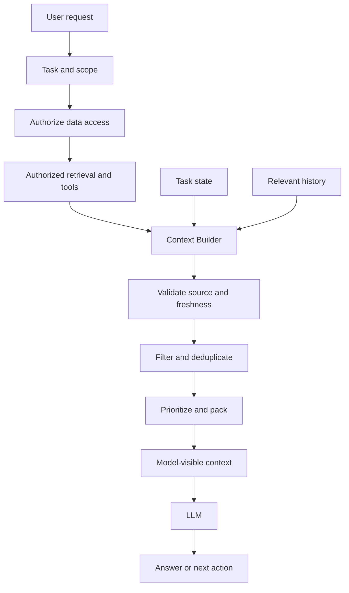
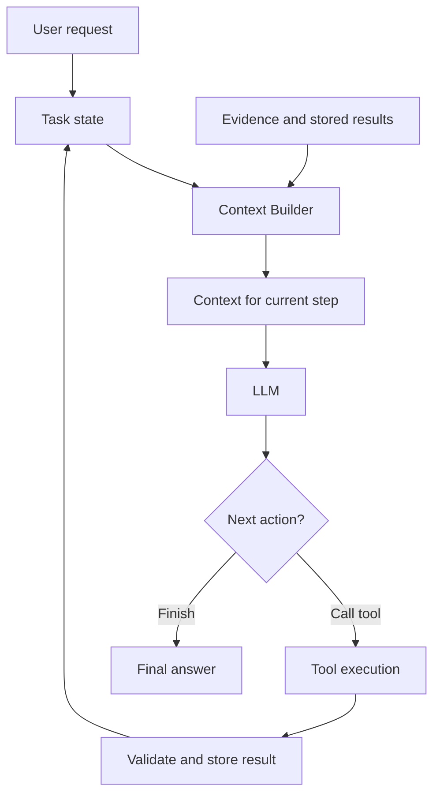

The Agent retrieved the right data and its tools worked, yet its answer was wrong. Sometimes the problem is not the model or retrieval. It is **what actually reached the model's context**.

## 1. When correct data still leads to a wrong conclusion

Imagine an AI Assistant analyzing a retail chain. A manager asks:

> "Why did August revenue rise while profit fell? Analyze it and suggest what to improve."

The database returns:

| Measure | July | August | Change |
| :-- | --: | --: | --: |
| Revenue | VND 200 million | VND 230 million | +15% |
| Total costs | VND 160 million | VND 200 million | +25% |
| Profit | VND 40 million | VND 30 million | -25% |

*All numbers in this article are fictional.*

The SQL tool returns the right figures, and the knowledge base finds documents about promotions. But the Assistant says:

> "Revenue rose 15% while profit fell 25% because advertising costs surged. The store should cut its marketing budget."

The data establishes that **total costs** rose 25%. It does not identify marketing as the main cause. An execution trace shows that the model saw current SQL results, older query results, promotion documents, and an earlier analysis that mentioned advertising costs. Verified facts and old hypotheses entered the same prompt without a clear distinction or effective date.

No individual tool had to fail for this to happen. The failure was in **context assembly**.

The [Context Engineering lesson in Learn](../context-engineering/) explains why we must control what a model sees. This article asks a more concrete engineering question: **How do we build a pipeline that selects, organizes, updates, and checks context before each model call?**

## 2. Put a Context Builder between data and the model

An Agent may access databases, a knowledge base, conversation history, task state, and tool results. **Information stored somewhere in the system is not automatically information that belongs in the next prompt.**

Suppose the Agent has queried two months of revenue and cost data, then searched for promotion policies. The complete results can remain in task state or external storage. For the next decision, the model may need only verified figures, their sources, what is still unknown, and whether a deeper cost breakdown is required.



*Figure 1. Access control is enforced before data retrieval; the Context Builder then assembles the authorized information needed for this call.*

The Context Builder need not be a separate service. It might be a Python module, middleware before a model call, or part of an Agent runtime. What matters is the distinction between:

| Location | Role |
| :-- | :-- |
| Task state | Tracks the current task and intermediate results |
| External storage | Holds large documents or raw results that can be fetched again |
| Model-visible context | The information sent to the model for this particular call |

An Agent might store hundreds of query results but show the model only a few. Raw tool output can remain available for auditing without being repeated in every prompt. Context becomes a **view constructed for the current step**, not an ever-growing transcript.

## 3. Inside the Context Builder

A practical builder has four jobs: establish the information need, enforce scope and source rules, select evidence, and pack it within a usable token budget.

### 3.1. Identify what this step needs

At first, the retail Agent needs to confirm that revenue rose and profit fell. It needs the store ID, periods, KPI definitions, figures, source, and data cutoff. To investigate *why*, it needs a cost breakdown by category. It does not yet need every transaction or every HR policy.

The builder needs to know **which step the Agent is on and what evidence that step requires**. A simple implementation might use `task_type`, `current_step`, `required_data`, and `available_evidence`. An Agent may propose what to fetch next, but code still must enforce business scope and permissions.

### 3.2. Enforce access, scope, and source validity

If a manager may access only `STORE_001`, data for `STORE_002` must not enter the prompt merely because it looks semantically similar. The same applies to expired policies, the wrong reporting period, or a source that is not authoritative for the question.

Check authorization and tenant scope **at the application or data layer before retrieval**. Recheck source metadata during assembly. Do not retrieve forbidden data and ask the LLM to ignore it. Also treat retrieved documents and tool output as lower-trust data, not instructions that may override system policy.

### 3.3. Filter, deduplicate, and prioritize

Several chunks can repeat the same policy: an official document, an internal summary, and an outdated guide. Sending all three wastes tokens and may introduce conflicting rules. Prefer an authoritative, effective source, while retaining a conflict if the user's task is specifically to compare old and new policies.

Filtering can use metadata, reranking, stable IDs, and task-specific rules. Semantic similarity alone cannot decide whether a chunk belongs to the right store, date, or authority level. Context selection is about the **purpose of the information**, not just textual resemblance.

### 3.4. Pack context without silently dropping requirements

The token budget also includes instructions, recent messages, tool definitions, and room for the model's next response. A simple priority scheme might be:

| Priority | Information |
| :-- | :-- |
| Required | Current request, business constraints, core facts |
| High | Direct evidence and source metadata |
| Medium | Helpful explanatory details |
| Low | Old, duplicated, or recoverable details |

If required information does not fit, change the workflow: divide the task or fetch evidence in stages. Do not silently discard a mandatory policy condition to make the prompt fit. The best builder does not necessarily create the shortest context. It creates **enough context for the task within real constraints**.

## 4. From raw tool output to usable context

Tool results often make prompts grow fastest. If a SQL query returns thousands of transactions but the task is to compare monthly revenue, aggregate the records in SQL or code first. Yet reducing size alone is not enough. The result must retain what the figures mean.

Instead of `{"growth": 15, "profit": -25}`, a tool might return:

```json
{
  "store_id": "STORE_001",
  "comparison": {
    "previous_period": "2026-07",
    "current_period": "2026-08"
  },
  "verified_facts": {
    "revenue_growth_percent": 15.0,
    "cost_growth_percent": 25.0,
    "profit_growth_percent": -25.0
  },
  "evidence": {
    "source_id": "retail_snapshot_v1",
    "status": "verified"
  },
  "limitations": [
    "Cost breakdown is not available",
    "Root cause has not been established"
  ]
}
```

This is illustrative, not a framework schema. It carries **verified facts and the limits of what they prove**. The Report Agent can see that a cost breakdown is still needed rather than inventing a cause.

Aggregation, filtering, pagination, and selective field projection can all help. Keep a reference to raw results when detailed verification may be needed. That gives the model a compact working view without throwing away the evidence the system may later need. [Anthropic's guidance on tool design](https://www.anthropic.com/engineering/writing-tools-for-agents) likewise emphasizes the trade-off between concise tool responses and enough identifiers or details for follow-up work.

## 5. Rebuild context through the Agent loop

An Agent can call tools, discover missing information, update state, and reason again. Context should evolve with that loop:



*Figure 2. Context is selected again after each action, using the updated task state.*

First, the model sees verified revenue and profit changes. Next, it sees those facts plus a clear gap: no category-level cost data. It calls a tool for that breakdown. Only then can it assess plausible causes and recommendations. These calls need different contexts; none needs every raw SQL row repeated.

[LangChain's context-engineering guide](https://docs.langchain.com/oss/python/langchain/context-engineering) distinguishes per-call model context from persistent state and lifecycle updates. A simple implementation sketch is:

```python
def build_context(task, state, evidence_store, budget):
    required = resolve_required_context(task, state)
    allowed_scope = authorize_scope(task.user, required)

    candidates = load_relevant_evidence(
        evidence_store,
        required,
        allowed_scope,
    )
    verified = validate_sources(candidates, required)
    selected = select_and_deduplicate(verified, required)

    return pack_context(
        task=task,
        state=state,
        evidence=selected,
        token_budget=budget,
    )
```

This is pseudocode, not production-ready code. A real implementation needs error handling, token counting, source checks, and business-specific rules. Importantly, authorization constrains the evidence query **before** data is loaded. Code can handle permissions, periods, IDs, and metadata; use an LLM only where semantic judgment actually helps.

## 6. When do clearing, compaction, and memory help?

Long-running Agents accumulate messages, decisions, and intermediate outputs. Three techniques solve different growth problems:

| Technique | What it addresses | Main trade-off |
| :-- | :-- | :-- |
| Tool-result clearing | Old tool outputs no longer needed in active context | May need to fetch them again |
| Compaction | Long history that must be summarized to continue | Important details may be lost |
| Persistent memory | Knowledge useful across sessions or tasks | Must manage updates, retrieval, and deletion |

If the Agent has finished computing KPIs and the raw SQL output can be fetched from a fixed snapshot, clear the bulky output but keep its reference. If a task has run for dozens of steps, compact decisions, verified facts, unresolved questions, and next actions. Keep uncertainty as uncertainty: a summary must not turn "advertising may matter" into "advertising caused the loss."

Persistent memory serves a different purpose. An approved user preference or reusable configuration may belong there; a temporary revenue query does not automatically become permanent memory. Clearing is dangerous when the raw result cannot be recovered. Compaction is unnecessary overhead when the task is short and context remains small.

The [Anthropic cookbook comparing memory, compaction, and tool clearing](https://platform.claude.com/cookbook/tool-use-context-engineering-context-engineering-tools) gives examples of how these strategies compose. The lesson is to pick the technique that addresses the actual source of context growth, not enable every feature because a framework supports it.

## 7. Design the handoff between Agents

With multiple Agents, context engineering also decides what one Agent passes to another. Giving the Report Agent every SQL query, raw row, document, and message defeats much of the benefit of specialization. A **handoff contract** can carry the findings without losing their provenance:

```json
{
  "task": "analyze_profit_change",
  "findings": [
    {
      "fact": "Revenue increased by 15%",
      "source_id": "sales_snapshot_v1"
    },
    {
      "fact": "Profit decreased by 25%",
      "source_id": "sales_snapshot_v1"
    }
  ],
  "uncertainties": [
    "Primary cost driver is not identified"
  ],
  "recommended_next_step": "Analyze cost breakdown"
}
```

The receiving Agent gets verified findings, source references, and open questions. With appropriate access it can retrieve raw evidence when needed. The handoff should make it clear **what is established, what is a hypothesis, what source applies, and what work remains**. A fluent summary without provenance can be short but hard to trust.

## 8. How do we know the pipeline works?

Fewer tokens do not automatically mean better answers. Context engineering should be evaluated as a component of the AI system.

### 8.1. Check context before checking the answer

If a golden case requires two evidence sources and the Context Builder passes only one to the writer, we can see a likely problem before generation. Useful measures include:

| Measure | What it reveals |
| :-- | :-- |
| Required Evidence Coverage | Share of required evidence present in context |
| Context Relevance | Whether selected context fits this step |
| Duplicate Content Rate | Repeated information consuming space |
| Invalid Source Rate | Sources outside policy, scope, or validity period |
| Context Tokens | Tokens actually sent to the model |

Define what counts as required, relevant, or duplicate. Two chunks with different IDs may repeat the same fact. And sufficiency depends on the **current model call**: a planning step may not need all the evidence required for a final answer.

### 8.2. Compare strategies on the same cases

Compare a **Full Context** baseline, a **Selective Context** version with filtering and packing, and a **Dynamic Context** version that rebuilds the view at each step and fetches data on demand. Keep the model, source snapshot, test cases, and graders comparable.

Measure answer correctness, faithfulness, evidence coverage, task success, input tokens, latency, and tool calls. Change one component at a time when possible: add metadata filtering, then reranking, then tool-result clearing or compaction. This *ablation* approach helps identify what actually caused an improvement.

Look beyond averages. Selection may help simple questions but omit evidence for multi-hop tasks. Just-in-time retrieval may save tokens while adding latency. Compaction may sustain a long task but lose a mandatory exception. Rerun important nondeterministic Agent cases to observe stability.

### 8.3. Keep a Context Manifest for debugging

An evaluation harness can record a small **Context Manifest** for each model call: task ID and step, builder version, chosen source IDs, excluded sources and reasons, source versions, token count, and missing or truncated evidence.

That record helps distinguish "the model reasoned badly despite complete evidence" from "the builder never supplied the evidence." Sensitive prompts and business data need appropriate access controls and retention rules; the manifest need not copy every raw value into logs.

## 9. Production trade-offs

More context can reduce omissions but add noise and cost. Just-in-time retrieval avoids loading everything up front but adds tool calls. Compaction keeps a long task moving but risks losing an exception. Isolation reduces cross-Agent duplication but requires a handoff with enough detail to verify claims.

Start simply: enforce access and scope, identify the required sources, and make tool responses structured with source metadata. Add reranking, dynamic retrieval, or compaction when evaluation shows a concrete need. Changing a SQL tool from thousands of raw rows to verified aggregates with provenance may solve more than building an elaborate Context Builder on day one.

For long-running, multi-Agent work, a stateful, observable, and testable context pipeline becomes more important. [LangChain's discussion of autonomous context compression](https://www.langchain.com/blog/autonomous-context-compression) also illustrates why *when* to compact can matter as much as the compression method.

## 10. The missing layer between data and the LLM

We often improve an Agent by tuning prompts, retrieval, or the model. But between data and the model sits another architectural decision: **what information is visible for this particular call**.

A Context Builder makes that decision explicit. It identifies the task's needs, enforces scope, checks sources, selects evidence, shapes tool output, and packs a usable context. In the Agent loop it rebuilds that view as state changes. In a multi-Agent system it passes findings through a clear handoff rather than copying an entire transcript.

The objective is neither the shortest prompt nor the largest one. **A good context pipeline gives the model enough trustworthy information to make the right decision and leaves a trace of what was selected and used.**

Having the right data is only half the problem. The other half is making sure the model sees the right part of it at the right step, in a form it can use.

## References and further reading

1. [Anthropic - Effective Context Engineering for AI Agents](https://www.anthropic.com/engineering/effective-context-engineering-for-ai-agents) - context selection, just-in-time retrieval, compaction, and isolation.
2. [LangChain - Context Engineering in Agents](https://docs.langchain.com/oss/python/langchain/context-engineering) - model, tool, and lifecycle context.
3. [Anthropic - Memory, Compaction, and Tool Clearing](https://platform.claude.com/cookbook/tool-use-context-engineering-context-engineering-tools) - cookbook comparing long-running Agent strategies.
4. [Anthropic - Writing Effective Tools for Agents](https://www.anthropic.com/engineering/writing-tools-for-agents) - tool interfaces and useful response structure.
5. [LangChain - Autonomous Context Compression](https://www.langchain.com/blog/autonomous-context-compression) - timing context compression in Deep Agents.
6. [LangSmith - Evaluation Types](https://docs.langchain.com/langsmith/evaluation-types) - regression and offline evaluation approaches.
