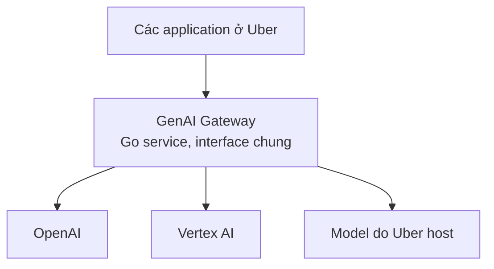
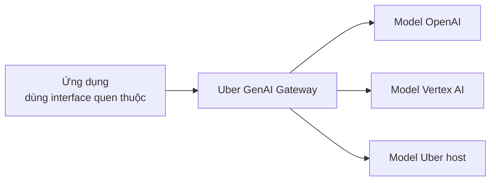
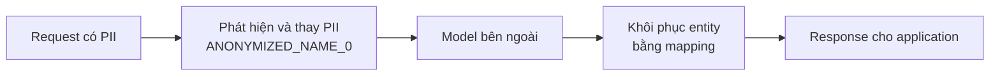
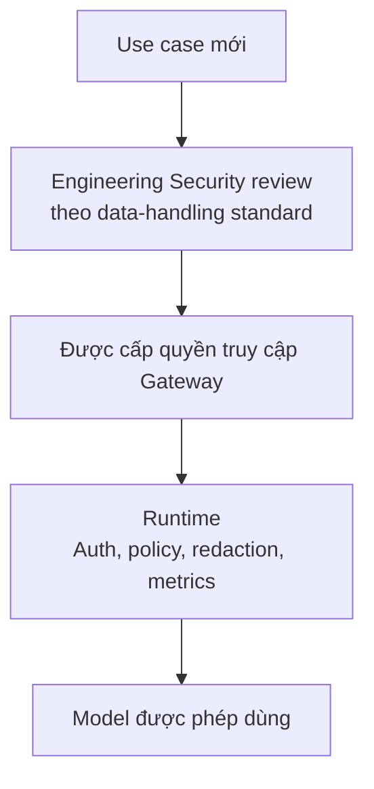
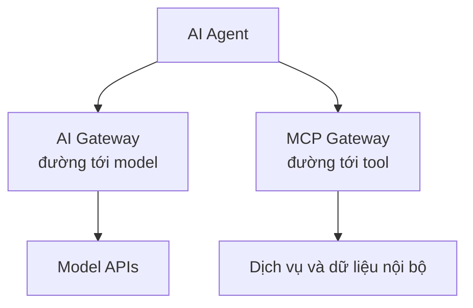

Khi một công ty có vài thử nghiệm GenAI, từng team gọi model theo cách riêng vẫn có thể ổn. Khi số use case tăng lên hàng chục, câu hỏi không còn là "Gọi LLM bằng cách nào?" mà là **"Làm sao nhiều team cùng dùng nhiều model mà không phải tự xây lại integration, privacy và cost control?"**

[Uber cho biết trong bài engineering tháng 7/2024](https://www.uber.com/us/en/blog/genai-gateway/) rằng họ đã xác định hơn 60 use case GenAI. Các team dùng những cách tích hợp khác nhau, tạo ra công việc lặp lại. Uber xây **GenAI Gateway** trong platform Michelangelo để đưa việc truy cập model về một interface chung.

Đây là một case study, không phải bài giới thiệu Gateway lần nữa. Nếu bạn cần khái niệm nền, hãy đọc [LLM Gateway là gì?](../what-is-llm-gateway-vi/). Ở đây, điều đáng học là **Uber đã chọn xây lớp chung ấy ra sao, và họ công khai những trade-off nào**.

## 1. Uber cần một platform, không cần thêm một model

Uber muốn các application truy cập cả model bên ngoài như OpenAI, Vertex AI và model do Uber host. [Bài Michelangelo của Uber](https://www.uber.com/gb/en/blog/from-predictive-to-generative-ai/) giải thích hai nhóm này phục vụ các nhu cầu khác nhau: model bên ngoài có thể mạnh ở kiến thức chung và reasoning; model open-source được fine-tune trên dữ liệu riêng có thể phù hợp với task đặc thù, với trade-off khác về chi phí và latency.

Nếu mỗi team nối thẳng tới backend mình chọn, sự khác nhau về client, credential và cách theo dõi usage sẽ lan vào từng ứng dụng. Gateway gom **đường truy cập model** thành một điểm chung. Sơ đồ dưới đây chỉ tóm tắt cấu trúc Uber công khai, không mô tả toàn bộ topology nội bộ:

Theo [mô tả kỹ thuật của Uber](https://www.uber.com/us/en/blog/genai-gateway/), Gateway là một service viết bằng Go, bao quanh client của các provider bên ngoài và nối với serving stack riêng cho model nội bộ. Giá trị không chỉ nằm ở "một box ở giữa", mà ở contract và các cơ chế dùng chung mà box đó thực thi.

## 2. Quyết định đáng chú ý: dùng interface kiểu OpenAI

Uber không giới thiệu một API hoàn toàn mới như `uber.generate()`. Họ **mirror HTTP/JSON interface của OpenAI API**. Uber nêu lý do: interface này đã quen thuộc với developer và có hệ sinh thái thư viện như LangChain, LlamaIndex; một API riêng sẽ phải liên tục đuổi theo hệ sinh thái đang thay đổi. [Nguồn: Uber Engineering](https://www.uber.com/us/en/blog/genai-gateway/).

Điều này **không có nghĩa** các backend giống hệt nhau hay mọi feature đều hoán đổi được. Gateway tạo contract ổn định hơn ở phía ứng dụng, còn sự khác nhau giữa provider vẫn phải được xử lý bên trong. Bài Uber kể rõ: họ dùng một fork của Go client cho OpenAI; với Vertex AI/PaLM2, họ tự viết Go client phù hợp ở thời điểm đó rồi open-source; model Uber host đi qua serving stack dựa trên STOA inference libraries. [Nguồn: Uber Engineering](https://www.uber.com/us/en/blog/genai-gateway/).

Bài học ở đây không phải "hãy luôn dùng OpenAI API". Đó là: **một abstraction hữu ích đôi khi tương thích với interface mà developer đã biết, thay vì phát minh thêm một interface mới**.

## 3. PII redaction biến Gateway thành ranh giới dữ liệu

Giả sử application cần model bên ngoài viết email về một chuyến đi và prompt chứa tên, số điện thoại của khách hàng. Nếu request đi thẳng tới provider, dữ liệu đó cũng đi theo. Uber đưa **PII redactor** vào Gateway để thay thông tin nhận diện cá nhân bằng placeholder trước khi gửi request tới bên thứ ba, sau đó dùng mapping để khôi phục chúng trong response trả về. [Nguồn: Uber Engineering](https://www.uber.com/us/en/blog/genai-gateway/).

Uber đưa ví dụ một tên được thay bằng `ANONYMIZED_NAME_0`, tên tiếp theo thành `ANONYMIZED_NAME_1`. Điểm quan trọng là Gateway không chỉ hỏi **"Model nào được gọi?"** mà còn hỏi **"Dữ liệu nào được gửi qua boundary này?"**

Redaction giúp **giảm rủi ro** lộ PII; nó không bảo đảm mọi dữ liệu nhạy cảm đều được phát hiện hoặc mọi request đều an toàn. Chất lượng của lớp nhận diện và mapping vẫn rất quan trọng.

## 4. Privacy có giá của nó: latency và chất lượng

Uber [công khai](https://www.uber.com/us/en/blog/genai-gateway/) rằng PII redaction đặt ra thách thức với **latency lẫn chất lượng kết quả**. Trước model call, Gateway phải quét và thay entity; sau đó nó còn phải khôi phục response. Phần việc thêm vào có thể làm request chậm hơn.

Chất lượng tinh tế hơn: model nhìn thấy `ANONYMIZED_NAME_0` thay cho tên thật. Nếu một entity bị nhận diện nhầm, hoặc context phụ thuộc vào entity đã bị thay, output có thể khác. Đây là **suy luận về một failure mode có thể xảy ra**, không phải khẳng định Uber đã gặp đúng lỗi đó.

Vì vậy security guardrail không miễn phí. Team phải kiểm tra đồng thời mức giảm rủi ro, độ trễ và tác động tới output. Một lớp privacy tốt không nên được đánh giá chỉ bằng câu "đã bật redaction".

## 5. Control point chung: quyền truy cập, audit và cost

Gateway cũng tích hợp authentication, authorization, metrics và audit logs. Theo Uber, audit log hỗ trợ **cost attribution**, security auditing và quality evaluation; metrics phục vụ reporting và alerting. [Nguồn: Uber Engineering](https://www.uber.com/us/en/blog/genai-gateway/). [Bài Michelangelo](https://www.uber.com/gb/en/blog/from-predictive-to-generative-ai/) nói thêm về cost guardrails, cảnh báo khi dùng quá mức, safety/policy guardrails và PII redaction.

| Cơ chế Uber công khai | Câu hỏi tổ chức cần trả lời |
| --- | --- |
| Authentication và authorization | Ứng dụng nào được truy cập? |
| Metrics và alerting | Usage đang thay đổi ra sao? |
| Audit logs | Ai đã gọi gì, để điều tra và đối soát? |
| Cost attribution và guardrails | Chi phí thuộc team/use case nào, có vượt ngưỡng không? |
| PII redaction và policy guardrails | Dữ liệu và hành vi nào cần được kiểm soát? |

Đây là lý do Gateway có giá trị hơn một proxy chuyển tiếp đơn giản: những concern dùng chung có một nơi để vận hành và quan sát. Tuy nhiên, **một control point chỉ có ý nghĩa khi những đường truy cập cần kiểm soát thực sự đi qua nó**. Đó là nguyên tắc thiết kế tổng quát, không phải khẳng định về cách Uber chặn mọi đường bypass.

## 6. Security review diễn ra trước runtime

Một chi tiết quan trọng trong bài 2024: **Engineering Security review use case theo chuẩn xử lý dữ liệu của Uber trước khi cấp quyền vào Gateway**. [Nguồn: Uber Engineering](https://www.uber.com/us/en/blog/genai-gateway/).

Governance vì vậy có hai thời điểm. Trước runtime, team quyết định use case và dữ liệu có phù hợp không. Trong runtime, Gateway thực thi các kiểm soát kỹ thuật tương ứng. Không phải câu hỏi bảo mật nào cũng giải được bằng một middleware sau khi request đã bắt đầu.

## 7. Những con số nói lên thời điểm của case study

**Tại thời điểm công bố bài tháng 7/2024**, Uber cho biết Gateway được gần **30 customer team** dùng, xử lý khoảng **16 triệu query mỗi tháng**, với peak khoảng **25 QPS**. Đây là số liệu Uber công bố khi đó, **không phải số liệu hiện tại năm 2026**. [Nguồn: Uber Engineering](https://www.uber.com/us/en/blog/genai-gateway/).

Điều đáng học từ những con số không phải dự đoán tải hiện nay, mà là điểm chuyển đổi của platform: từ nhiều team thử GenAI riêng lẻ sang một đường tích hợp chung đủ hữu ích để nhiều team sử dụng.

## 8. Khi Uber nói về Agent, hai đường truy cập tách rõ hơn

Trong [bài viết tháng 5/2026 về identity cho AI Agent](https://www.uber.com/gb/en/blog/solving-the-agent-identity-crisis/), Uber mô tả **AI Gateway** làm điểm trung gian cho outbound call từ Agent tới model, còn **MCP Gateway** kiểm soát call từ Agent tới tool và các hệ thống nội bộ. Bài này cũng nói AI Gateway được tích hợp guardrail về prompt injection, jailbreak, content safety và PII.

Đây là **bức tranh Uber mô tả năm 2026**, không phải bằng chứng rằng implementation của Gateway năm 2024 giữ nguyên từng thành phần. Nó cho thấy cùng một vấn đề platform còn quan trọng khi hệ thống chuyển sang Agent: cần kiểm soát các boundary khác nhau, không gộp mọi tương tác AI thành một loại "call".

## 9. Trade-off và giới hạn của phần Uber công khai

Gateway tập trung cũng tạo dependency chung: nếu lớp đó chậm hoặc gặp sự cố, nhiều application **có thể** bị ảnh hưởng. Interface tương thích OpenAI có thể làm onboarding dễ hơn, nhưng với capability riêng của một provider mới, platform vẫn phải quyết định có mở rộng contract hay không. Đây là **suy luận kiến trúc**, không phải sự cố hay roadmap Uber đã công bố.

Một công ty nhỏ hơn có thể bắt đầu bằng shared SDK hoặc chỉ một provider. Những cách đó có thể đủ khi số team và yêu cầu governance còn ít. Case của Uber không chứng minh mọi công ty cần LLM Gateway; nó cho thấy **khi nhiều team, nhiều nguồn model và policy cùng tăng, một lớp model access chung có lý do tồn tại**.

Cũng cần giữ ranh giới giữa **Uber đã nói** và **chúng ta chưa biết**. Bài 2024 mô tả interface, Go service, provider integrations, PII redaction, auth, metrics, audit và security review. Nó **không công bố đủ chi tiết** để kết luận Uber dùng thuật toán semantic routing nào, fallback ra sao, có cache gì, retry policy hoặc HA topology cụ thể thế nào. Không nên tự điền các box quen thuộc từ một sơ đồ AI Gateway chung vào hệ thống của Uber.

## Điều đáng học nhất không nằm ở LLM

Uber không xây Gateway để làm một model reasoning tốt hơn. Họ biến **model access** thành một capability dùng chung: application có interface quen thuộc; platform quản lý ranh giới dữ liệu, quyền, audit và chi phí.

Đó là phần thú vị của case study này. Khi AI đi từ demo sang production, nhiều quyết định quan trọng lại là bài toán platform engineering cũ: **Có thứ gì mọi team đang tự làm lại, và nó có nên trở thành hạ tầng chung không?** Với model access ở Uber, câu trả lời là có.
