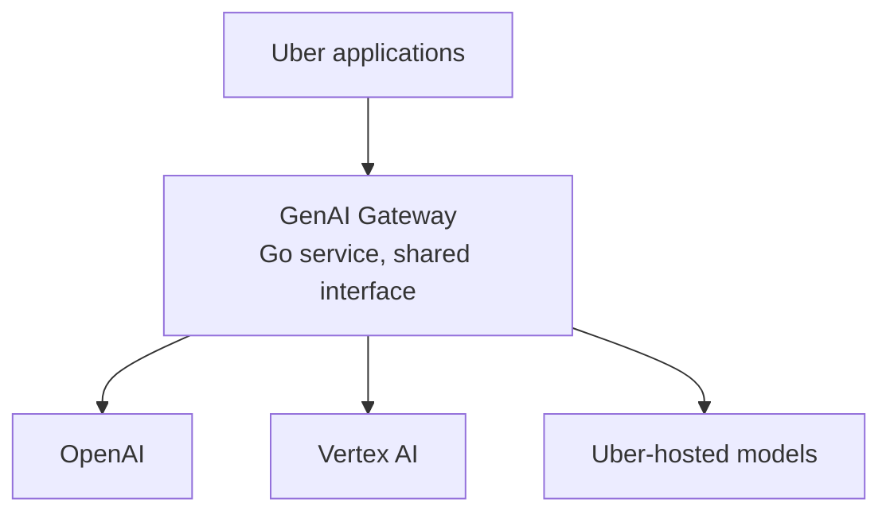
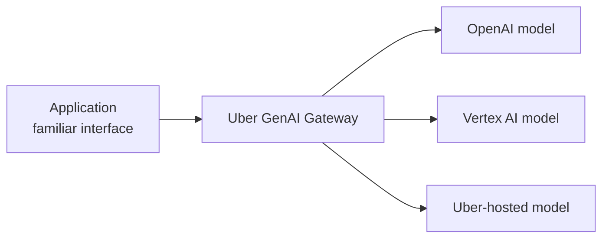
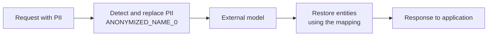
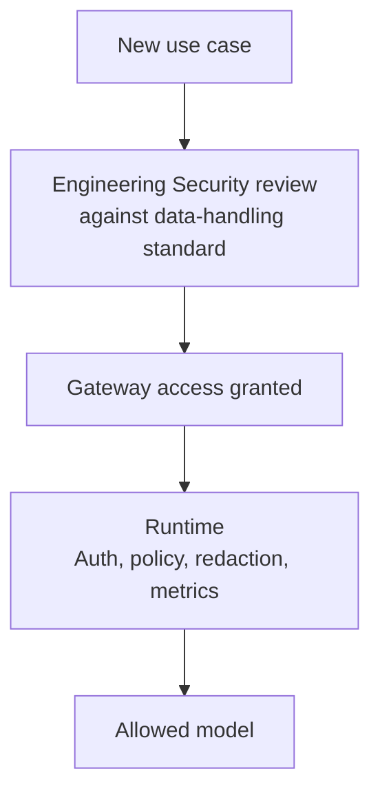
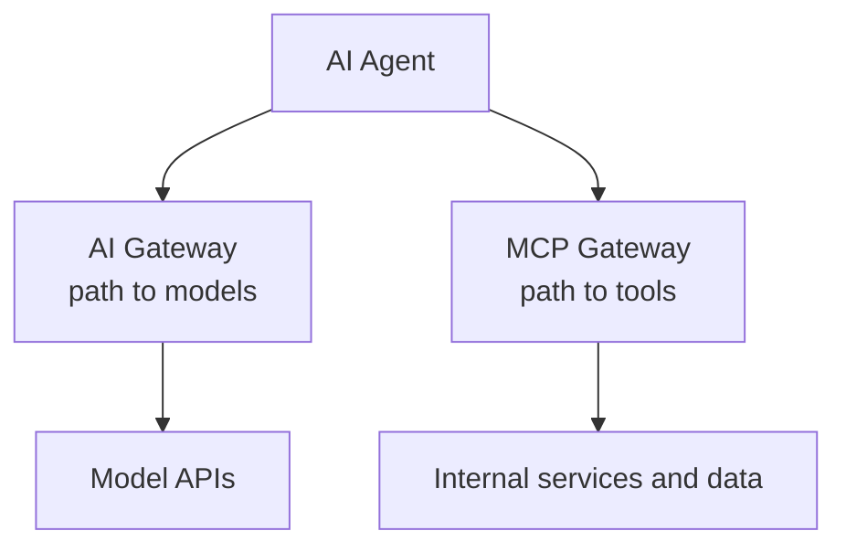

When a company has a handful of GenAI experiments, letting each team call a model its own way may be perfectly reasonable. Once there are dozens of use cases, the question changes from "How do we call an LLM?" to **"How can many teams use many models without rebuilding integration, privacy, and cost controls each time?"**

[In a July 2024 engineering post](https://www.uber.com/us/en/blog/genai-gateway/), Uber said it had identified more than 60 GenAI use cases. Teams had adopted different integration approaches, creating repeated work. Uber's answer was **GenAI Gateway**, part of its Michelangelo platform, which provided a shared interface for model access.

This is a case study, not a second introduction to gateways. For the general pattern, see [What Is an LLM Gateway?](../what-is-llm-gateway/). Here, the interesting questions are **which choices Uber published and what trade-offs those choices create**.

## 1. Uber needed a platform, not another model

Uber wanted applications to access external models through OpenAI and Vertex AI as well as models hosted by Uber. [Uber's Michelangelo article](https://www.uber.com/gb/en/blog/from-predictive-to-generative-ai/) explains why both mattered: external models can perform well on general knowledge and reasoning, while open-source models fine-tuned on proprietary data may suit Uber-specific tasks with different cost and latency trade-offs.

If every team directly integrates its preferred backend, differences in clients, credentials, and usage tracking spread into every application. The gateway makes **model access** a shared boundary. This diagram summarizes the architecture Uber published; it is not a full description of its internal topology:

According to [Uber's technical account](https://www.uber.com/us/en/blog/genai-gateway/), the gateway is a Go service around third-party provider clients, with a separate in-house serving stack for Uber-hosted models. Its value is not merely "one box in the middle," but the contract and shared controls that box provides.

## 2. The distinctive API choice: mirror OpenAI's interface

Uber did not invent a completely new API such as `uber.generate()`. It chose to **mirror the OpenAI API's HTTP/JSON interface**. Uber's stated reason was that developers already knew this interface and libraries such as LangChain and LlamaIndex worked around it; a proprietary API could fall behind a fast-moving ecosystem. [Source: Uber Engineering](https://www.uber.com/us/en/blog/genai-gateway/).

This **does not mean** the backends are identical or every feature is interchangeable. The gateway gives applications a more stable contract while provider differences still have to be handled behind it. Uber's article provides concrete examples: it used an internal fork of a Go client for OpenAI; it wrote and later open-sourced a suitable Go client for Vertex AI/PaLM2; and Uber-hosted models used a serving stack built on STOA inference libraries. [Source: Uber Engineering](https://www.uber.com/us/en/blog/genai-gateway/).

The lesson is not "always use the OpenAI API." It is that **a useful abstraction may match an interface developers already know instead of asking them to learn a new one**.

## 3. PII redaction makes the gateway a data boundary

Suppose an application asks an external model to draft an email about a trip, and the prompt includes a customer's name and phone number. If the request goes directly to the provider, that information goes with it. Uber placed a **PII redactor** in the gateway to replace personally identifiable information with placeholders before sending a request to a third party, then use a mapping to restore those entities in the response. [Source: Uber Engineering](https://www.uber.com/us/en/blog/genai-gateway/).

Uber illustrates a name becoming `ANONYMIZED_NAME_0` and the next one `ANONYMIZED_NAME_1`. The gateway is answering not only **"Which model should be called?"** but also **"What data may cross this boundary?"**

Redaction can **reduce the risk** of exposing PII; it does not guarantee that every sensitive detail is detected or every request is safe. Detection quality and correct mapping still matter.

## 4. Privacy has a cost: latency and quality

Uber [explicitly reports](https://www.uber.com/us/en/blog/genai-gateway/) that PII redaction presents challenges for both **latency and result quality**. The gateway has to scan and replace entities before the model call, then restore them afterward. That added work can increase response time.

Quality is subtler: the model sees `ANONYMIZED_NAME_0` instead of the actual name. If an entity is misidentified or the answer depends on context lost during replacement, the output may change. This is **an inference about a possible failure mode**, not a claim that Uber encountered that exact bug.

Security guardrails are not free. Teams need to test risk reduction alongside latency and output quality. "Redaction is enabled" is not, by itself, a complete evaluation.

## 5. One control point for access, audit, and cost

The gateway also integrates authentication, authorization, metrics, and audit logs. Uber says the logs support **cost attribution**, security auditing, and quality evaluation; metrics support reporting and alerting. [Source: Uber Engineering](https://www.uber.com/us/en/blog/genai-gateway/). Its [Michelangelo article](https://www.uber.com/gb/en/blog/from-predictive-to-generative-ai/) also mentions cost guardrails, overuse alerts, safety and policy guardrails, and PII redaction.

| Published capability | Organizational question it helps answer |
| --- | --- |
| Authentication and authorization | Which application may access a model? |
| Metrics and alerting | How is usage changing? |
| Audit logs | Who called what, for investigation and accountability? |
| Cost attribution and guardrails | Which team or use case owns the cost; is usage over the limit? |
| PII and policy guardrails | Which data and behaviors need controls? |

That is why the gateway is more valuable than a simple forwarding proxy: common concerns have a place to be operated and observed. Still, **a control point only works when the access paths that matter actually pass through it**. That is a general design principle, not a claim about how Uber blocks every possible bypass.

## 6. Security review happens before runtime

One easy-to-miss detail in Uber's 2024 post: **Engineering Security reviews a use case against Uber's data-handling standard before granting access to the gateway**. [Source: Uber Engineering](https://www.uber.com/us/en/blog/genai-gateway/).

Governance has two moments. Before runtime, the organization decides whether the use case and its data are appropriate. At runtime, the gateway applies technical controls. Not every security question can be solved by middleware after a request has already started.

## 7. The published numbers belong to a particular moment

**At the time of its July 2024 post**, Uber said the gateway was used by nearly **30 customer teams**, handled about **16 million queries per month**, and reached a peak of around **25 QPS**. Those are Uber's published figures from that point, **not current 2026 usage numbers**. [Source: Uber Engineering](https://www.uber.com/us/en/blog/genai-gateway/).

The lesson is not to estimate today's load from those numbers. It is the platform transition they reveal: from separate GenAI experiments to a shared integration path used by many teams.

## 8. The agent era makes two access paths clearer

In a [May 2026 article on AI agent identity](https://www.uber.com/gb/en/blog/solving-the-agent-identity-crisis/), Uber describes an **AI Gateway** mediating outbound calls from agents to models, while an **MCP Gateway** mediates calls from agents to tools and internal systems. It also says the AI Gateway is integrated with guardrails for prompt injection, jailbreaks, content safety, and PII.

This is **the architecture Uber described in 2026**, not proof that every component of the 2024 gateway remained unchanged. It shows that model access remains a platform problem as systems become agentic, and that different boundaries should not be collapsed into one generic "AI call."

## 9. Trade-offs and the limits of what Uber published

A centralized gateway is also a shared dependency: if it slows down or fails, many applications **could** be affected. An OpenAI-compatible interface can ease onboarding, but a provider-specific capability may force the platform to decide whether to extend its contract. These are **architectural inferences**, not incidents or roadmap decisions Uber has reported.

A smaller company might start with a shared SDK or a single provider. Either may be enough when team count and governance needs are modest. Uber's case does not prove every company needs an LLM gateway. It shows **why a shared model-access layer becomes compelling as teams, model sources, and policy requirements grow**.

We should also separate **what Uber has stated** from **what remains unknown**. Its 2024 post covers the interface, Go service, provider integrations, PII redaction, authentication, metrics, audit, and security review. It does **not publish enough detail** to conclude which semantic routing algorithm, fallback design, cache, retry policy, or high-availability topology Uber uses. Those boxes should not be imported from a generic AI gateway diagram and presented as Uber's architecture.

## The most interesting lesson is not about the LLM

Uber did not build a gateway to make a model reason better. It made **model access** a shared capability: applications get a familiar interface, while the platform manages data boundaries, permissions, auditing, and cost.

That is the case study's most useful takeaway. As AI moves from demo to production, many consequential decisions turn out to be familiar platform-engineering questions: **What is every team rebuilding, and should it become shared infrastructure?** For model access at Uber, the answer was yes.

## References

- [Navigating the LLM Landscape: Uber's Innovation with GenAI Gateway - Uber Engineering](https://www.uber.com/us/en/blog/genai-gateway/)
- [From Predictive to Generative: How Michelangelo Accelerates Uber's AI Journey - Uber Engineering](https://www.uber.com/gb/en/blog/from-predictive-to-generative-ai/)
- [Solving the Identity Crisis for AI Agents - Uber Engineering](https://www.uber.com/gb/en/blog/solving-the-agent-identity-crisis/)
