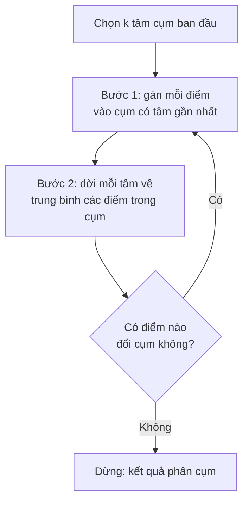

> **Mục tiêu bài học:** Sau bài này, bạn sẽ hiểu bài toán phân cụm khác bài toán phân loại ở chỗ nào, chạy được `KMeans` của scikit-learn, chọn số cụm bằng elbow và silhouette, biết vì sao phải chuẩn hóa trước khi phân cụm, và nhận ra ba tình huống k-means cho kết quả sai lệch cùng cách xử lý.

## 1. Năm mươi nghìn khách hàng và không một cái nhãn nào

Một chuỗi bán lẻ có lịch sử giao dịch của 50.000 khách. Phòng marketing muốn chia họ thành vài nhóm để soạn chương trình riêng: nhóm mua đều đặn thì tri ân, nhóm lâu rồi không quay lại thì nhắc, nhóm mới mua lần đầu thì mời quay lại. Vấn đề: không ai từng ngồi gắn nhãn "khách trung thành" hay "khách sắp rời bỏ" cho 50.000 dòng đó. Không có $y$.

Tám bài trước đều có $y$. Ta đưa mô hình cả câu hỏi lẫn đáp án, nó tìm cách nối hai thứ lại. Từ bài này trở đi ta bỏ cột đáp án đi - đó là **học không giám sát (unsupervised learning)** mà Foundations · Bài 05 đã giới thiệu. Không có đáp án thì cũng không có accuracy để chấm; câu hỏi đổi từ "dự đoán có đúng không" sang "cách chia nhóm này có nói lên điều gì không".

Cách làm phổ thông trong bán lẻ là mô tả mỗi khách bằng ba con số **RFM**: *Recency* (lần mua gần nhất cách đây bao lâu), *Frequency* (mua bao nhiêu lần), *Monetary* (tổng chi tiêu). Ba số ấy biến mỗi khách thành một điểm trong không gian ba chiều, và câu hỏi "khách nào giống khách nào" thành câu hỏi "điểm nào gần điểm nào" - đúng thứ Foundations · Bài 07 đã dựng: khoảng cách Euclid.

**Phân cụm (clustering)** là bài toán: cho một đám điểm, hãy chia chúng thành các nhóm sao cho điểm trong cùng nhóm gần nhau, điểm khác nhóm xa nhau. `k-means` là thuật toán quen tay nhất cho việc đó.

## 2. Hai bước lặp đi lặp lại

k-means cần bạn nói trước số cụm $k$. Nó chọn $k$ điểm làm **tâm cụm (centroid)** rồi lặp hai bước:



Chữ "means" trong tên thuật toán đến từ bước 2: tâm cụm chính là trung bình của các điểm thuộc cụm đó.

Thứ k-means cố làm nhỏ lại gọi là **inertia** (scikit-learn gọi thế; sách gọi là *within-cluster variation*): tổng bình phương khoảng cách từ mỗi điểm tới tâm cụm của nó. Mỗi vòng lặp đều làm inertia giảm hoặc giữ nguyên, không bao giờ tăng - nên thuật toán chắc chắn dừng.

Chắc chắn dừng không có nghĩa là dừng ở chỗ tốt nhất. Chia $n$ điểm vào $k$ cụm có xấp xỉ $k^n$ cách; với 300 điểm và 3 cụm, con số đó lớn đến mức không máy nào duyệt hết. Sách *An Introduction to Statistical Learning* nói thẳng: k-means chỉ đảm bảo tìm được một **cực tiểu địa phương** - một lời giải khá tốt, phụ thuộc vào chỗ xuất phát. Cùng một tập dữ liệu, xuất phát khác nhau có thể ra kết quả khác nhau.

Cách chữa đơn giản: chạy nhiều lần từ nhiều điểm xuất phát ngẫu nhiên rồi giữ lần có inertia nhỏ nhất. Đó là tham số `n_init`. Ngoài ra scikit-learn mặc định dùng **k-means++**, một cách chọn tâm ban đầu ưu tiên các điểm xa nhau thay vì bốc hoàn toàn ngẫu nhiên.

```python
from sklearn.datasets import make_blobs
from sklearn.cluster import KMeans

X, y = make_blobs(n_samples=300, centers=3, cluster_std=1.0, random_state=42)
km = KMeans(n_clusters=3, n_init=10, random_state=42).fit(X)
print(km.cluster_centers_)   # toạ độ 3 tâm cụm
print(km.inertia_)           # tổng bình phương khoảng cách tới tâm
```

Ba tâm tìm được: `(-2,63; 9,04)`, `(-6,88; -6,98)`, `(4,75; 2,01)`; inertia ≈ 566,9. Vì `make_blobs` có sinh sẵn nhãn thật, ta kiểm tra được: cách chia của k-means trùng khớp hoàn toàn với ba cụm gốc.

> 🔧 **Thử ngay:** đặt `init="random", n_init=1` (bốc tâm hoàn toàn ngẫu nhiên, chạy đúng một lần) rồi lặp qua 20 giá trị `random_state` khác nhau. Bao nhiêu lần ra kết quả tệ hơn?
> Kết quả: **5 trên 20 lần** cho inertia cao hơn 5% so với lời giải tốt (ví dụ seed 0 cho inertia ≈ 5.695 thay vì ≈ 567 - gấp mười lần). Cũng 20 seed đó với `init="k-means++"` thì cả 20 lần đều ra ≈ 567. Đây là lý do đừng hạ `n_init` xuống 1 để chạy cho nhanh.

## 3. Chọn $k$: elbow method và silhouette score

k-means bắt bạn khai báo $k$ trước khi chạy. Nhưng $k$ chính là thứ bạn muốn biết.

Ý tưởng đầu tiên - "chọn $k$ nào cho inertia nhỏ nhất" - hỏng ngay từ đầu. Trên 300 điểm blobs:

| $k$ | 1 | 2 | 3 | 4 | 10 | 50 |
|---|---|---|---|---|---|---|
| inertia | 20.402 | 5.764 | 567 | 496 | 217 | 34 |

Inertia giảm đều tay và sẽ về 0 khi $k = n$ (mỗi điểm một cụm, khoảng cách tới tâm bằng 0). Tối ưu inertia là tự dẫn mình tới lời giải vô nghĩa.

Cái đáng nhìn không phải giá trị mà là **chỗ nó ngừng giảm mạnh**. Từ 2 sang 3, inertia rơi từ 5.764 xuống 567; từ 3 sang 4 chỉ còn nhích 567 → 496. Vẽ inertia theo $k$, đường cong gãy một khúc rõ tại $k = 3$ rồi thoải ra - hình dạng ấy là lý do phương pháp có tên **elbow (khuỷu tay)**.

```
inertia
20k |*
    | \
    |  \
 5k |   *
    |    \
    |     \
    |      *----*----*----*----*   <- từ đây trở đi gần như phẳng
  0 +---+---+---+---+---+---+---
      1   2   3   4   5   6   7   k
              ^ khuỷu tay
```

Elbow có nhược điểm là phải nhìn bằng mắt, và nhiều tập dữ liệu thật cho đường cong trơn tru không có khuỷu nào. Chỉ số thứ hai chấm điểm được bằng số: **silhouette**. Với mỗi điểm, gọi $a$ là khoảng cách trung bình tới các điểm *cùng cụm*, $b$ là khoảng cách trung bình tới các điểm của *cụm gần nhất kế bên*; silhouette của điểm đó là $(b-a)/\max(a,b)$, nằm trong khoảng $[-1; 1]$. Gần 1 nghĩa là điểm nằm sâu trong cụm của nó; quanh 0 là nằm ở vùng giáp ranh; âm nghĩa là nó gần cụm hàng xóm hơn cụm đang được gán vào - dấu hiệu bị xếp nhầm. Silhouette của cả cách phân cụm là trung bình của tất cả các điểm.

| $k$ | 2 | 3 | 4 | 5 | 6 | 7 |
|---|---|---|---|---|---|---|
| silhouette | 0,705 | **0,848** | 0,664 | 0,490 | 0,517 | 0,358 |

Silhouette đạt đỉnh đúng tại $k = 3$ - nó có cực đại nên chọn được tự động, không phải nhìn bằng mắt như elbow.

> ⚠️ **Lưu ý nhỏ:** cả hai chỉ số đều chỉ nói về *hình dạng hình học* của cách chia, không nói cách chia ấy có ích cho công việc hay không. Ba cụm khách hàng gọn ghẽ mà phòng marketing không soạn nổi ba chương trình khác nhau thì $k = 3$ vẫn là lựa chọn sai. Trong thực tế, ràng buộc nghiệp vụ ("chúng tôi chỉ chạy được 4 chiến dịch") thường quyết định $k$ trước khi biểu đồ kịp lên tiếng.

## 4. Không chuẩn hóa thì cụm sẽ nghe theo cột có đơn vị lớn nhất

k-means đo bằng khoảng cách, mà khoảng cách thì cộng bình phương chênh lệch của tất cả các cột. Cột nào có biên độ lớn, cột đó áp đảo. Đây chính là lý do Foundations · Bài 12 và bài 05 của chương này đều nhấn mạnh chuẩn hóa.

Bộ `wine` có 178 chai rượu Ý, 13 chỉ số hóa học, thuộc 3 giống nho. Ta giấu nhãn giống đi, phân cụm với $k = 3$, rồi mới lấy nhãn ra đối chiếu.

```python
from sklearn.datasets import load_wine
from sklearn.preprocessing import StandardScaler
from sklearn.metrics import adjusted_rand_score

w = load_wine()
km_raw = KMeans(n_clusters=3, n_init=10, random_state=42).fit(w.data)
Xs = StandardScaler().fit_transform(w.data)
km_sc  = KMeans(n_clusters=3, n_init=10, random_state=42).fit(Xs)
print(adjusted_rand_score(w.target, km_raw.labels_))   # 0.371
print(adjusted_rand_score(w.target, km_sc.labels_))    # 0.897
```

`adjusted_rand_score` đo mức trùng khớp giữa hai cách chia nhóm, bằng 1 khi trùng hoàn toàn và quanh 0 khi ngẫu nhiên (nó không quan tâm cụm được đánh số thế nào). Không chuẩn hóa: **0,371**. Có chuẩn hóa: **0,897** - một trời một vực. Thủ phạm là cột `proline` với độ lệch chuẩn ≈ 314, trong khi `alcalinity_of_ash` chỉ ≈ 3,3; chưa chuẩn hóa thì khoảng cách gần như chỉ còn là chênh lệch proline.

> ⚠️ **Lưu ý nhỏ:** silhouette của bản *không* chuẩn hóa lại cao hơn - 0,571 so với 0,285. Nghe ngược đời, nhưng hai con số đó đo trên hai không gian khác nhau nên không so được với nhau. Silhouette chỉ dùng để so các giá trị $k$ *trong cùng một cách biểu diễn dữ liệu*. Lấy silhouette ra để chọn "có nên scale hay không" là dùng sai công cụ.

## 5. Ba tình huống k-means trả lời sai

Hai bước của k-means gói sẵn một giả định: cụm là những khối *tròn, kích thước tương đương*. Lý do nằm ở chỗ mỗi cụm chỉ có đúng một điểm tâm làm đại diện, còn mỗi điểm thì về cụm có tâm gần nó nhất. Ranh giới giữa hai cụm vì thế luôn là một đường thẳng nằm giữa hai tâm. Ba tình huống dưới đây đều từ đó mà ra.

**Cụm không tròn.** Bộ `make_moons` là hai vòng trăng khuyết lồng vào nhau:

```
        ***                         Cụm thật: hai vòng cung.
      **   **                       k-means chỉ vẽ được một đường
     *       **     ***             thẳng giữa hai tâm, nên nó cắt
    *          ** **    **          ngang cả hai vòng thay vì tách
    *            *        *         chúng ra.
     **       **           *
       *******            *
                        **
                    ****
```

k-means cho ARI **0,247**. `DBSCAN(eps=0.25, min_samples=5)` cho **1,0** - tách đúng hoàn toàn.

**Cụm lệch kích thước.** Sinh một cụm 300 điểm rộng (độ lệch chuẩn 1,5) cạnh một cụm 30 điểm hẹp (0,4). k-means cho ARI 0,761: cụm nhỏ tìm được có 43 thành viên, trong đó 13 điểm bị kéo sang từ rìa cụm lớn. Cụm lớn "hút" mất ranh giới vì tâm của nó chỉ là một điểm trung bình, không mang thông tin về việc nó rộng hay hẹp.

**Cụm chỉ có trong tưởng tượng.** Bạn bảo k-means tìm $k$ cụm thì nó chia ra $k$ cụm, kể cả khi dữ liệu là một đám mây đồng nhất không có cấu trúc nào. Nó không có cách nói "ở đây chẳng có cụm nào cả".

Hai người anh em hay được gọi tới khi k-means bó tay:

- **Phân cụm phân cấp (hierarchical clustering)** không cần biết $k$ trước. Nó bắt đầu với mỗi điểm là một cụm rồi nhập dần hai cụm gần nhau nhất, dựng ra một cây gọi là **dendrogram**; bạn cắt ngang cây ở độ cao nào thì được số cụm tương ứng. Trên `make_moons`, phiên bản `linkage="single"` cũng đạt ARI 1,0. Sách *An Introduction to Statistical Learning* có một cảnh báo đáng nhớ về dendrogram: hai điểm vẽ cạnh nhau theo chiều ngang *không* vì thế mà giống nhau - chỉ chiều cao chỗ hai nhánh nhập lại mới nói lên độ giống.
- **DBSCAN** định nghĩa cụm theo mật độ: vùng nào đủ dày thì là cụm, điểm nào lẻ loi thì bị đánh dấu là **nhiễu** thay vì bị nhét bừa vào một cụm. Nó xử lý được cụm hình thù bất kỳ và tự quyết số cụm, đổi lại bạn phải chọn bán kính `eps` - một tham số cũng khó chọn không kém $k$.

## 6. Đọc cụm ra thành nghĩa

Thuật toán trả về các con số 0, 1, 2. Việc còn lại - cụm 0 là ai - là của bạn.

Cách làm quen thuộc: tính giá trị trung bình của từng đặc trưng trong từng cụm rồi so với trung bình toàn bộ. Cụm nào có `Recency` thấp, `Frequency` cao, `Monetary` cao thì đặt tên "khách trung thành"; cụm nào `Recency` cao mà `Frequency` từng cao thì là "khách đang rời bỏ". Đây là bước biến kết quả thành thứ dùng được, và nó cần người hiểu nghiệp vụ chứ không cần thêm thuật toán.

Với `wine` ta có nhãn thật để đối chiếu, nên nhìn được kết quả rõ ràng:

| | giống 0 | giống 1 | giống 2 |
|---|---|---|---|
| **cụm 0** | 0 | **65** | 0 |
| **cụm 1** | 0 | 3 | **48** |
| **cụm 2** | **59** | 3 | 0 |

172 trên 178 chai vào đúng chỗ, chỉ 6 chai lệch - mà thuật toán chưa từng nhìn thấy tên giống nho nào. Ba giống nho ấy quả thật khác nhau về thành phần hóa học, và k-means dò ra được sự khác nhau đó.

> ⚠️ **Lưu ý nhỏ:** đừng đọc ngược kết quả này thành "phân cụm tìm ra sự thật". `wine` là trường hợp thuận lợi hiếm có: các nhóm thật vốn tách bạch trong không gian đặc trưng. Trên dữ liệu khách hàng thật, các cụm thường chồng lấn và ranh giới do k-means vạch ra là một *quy ước tiện dụng*, không phải một ranh giới có thật ngoài đời. Đổi $k$ từ 4 sang 5 là bạn có một bộ "phân khúc khách hàng" khác - và cả hai đều hợp lệ như nhau.

> 🔧 **Thử ngay:** trên `wine` đã chuẩn hóa, silhouette theo $k$ là: $k=2$ → 0,259; $k=3$ → **0,285**; $k=4$ → 0,260; $k=5$ → 0,202; $k=6$ → 0,237. Đỉnh rơi đúng vào $k = 3$, khớp với 3 giống nho thật. Nhưng để ý giá trị tuyệt đối chỉ ≈ 0,29, thấp hơn hẳn 0,848 của blobs - silhouette thấp ở đây phản ánh các cụm thật sự có chồng lấn, không phải phân cụm sai.

## Tóm tắt bài học

- Phân cụm là bài toán không có nhãn: ta không hỏi "dự đoán đúng chưa" mà hỏi "cách chia này có nói lên điều gì không".
- k-means lặp hai bước - gán điểm vào tâm gần nhất, rồi dời tâm về trung bình cụm - cho tới khi không còn điểm nào đổi cụm.
- Thuật toán chỉ đạt cực tiểu địa phương và phụ thuộc điểm xuất phát; giữ `n_init` đủ lớn và dùng `init="k-means++"` (mặc định của scikit-learn) để tránh rơi vào lời giải tồi.
- Inertia tốt nhất không thể tăng khi $k$ tăng, nên không dùng nó để chọn $k$; dùng elbow (nhìn chỗ đường cong gãy) hoặc silhouette (có cực đại, chấm điểm được bằng số).
- Chuẩn hóa trước khi phân cụm, nếu không cột có đơn vị lớn nhất sẽ quyết định thay bạn: trên `wine`, ARI đi từ 0,371 lên 0,897 chỉ nhờ `StandardScaler`.
- k-means giả định cụm tròn và kích thước tương đương; gặp cụm hình vòng cung hay lệch kích thước thì dùng DBSCAN hoặc phân cụm phân cấp.
- Số cụm cuối cùng nên là con số vừa hợp dữ liệu vừa dùng được cho công việc.

## Câu hỏi tự kiểm tra

1. Vì sao không thể chọn $k$ bằng cách tìm giá trị làm inertia nhỏ nhất?
2. Một điểm có silhouette bằng −0,4. Điều đó nói lên gì về vị trí của nó, và bạn nên xem lại điều gì?
3. Bạn phân cụm khách hàng bằng ba cột: tuổi (18-70), số đơn hàng (1-50) và tổng chi tiêu (100.000-500.000.000 đồng). Nếu bỏ qua chuẩn hóa, cụm sẽ được quyết định chủ yếu bởi cột nào, và vì sao?
4. Chạy `KMeans` hai lần với `random_state` khác nhau trên cùng dữ liệu và nhận hai kết quả khác nhau. Đây là lỗi lập trình hay là tính chất của thuật toán? Bạn xử lý thế nào?
5. Dữ liệu của bạn gồm các điểm nằm dọc theo hai con đường cong song song. Vì sao k-means khó tách được hai nhóm này, và thuật toán nào phù hợp hơn?
6. Sếp yêu cầu chia khách hàng thành đúng 5 phân khúc, nhưng silhouette đạt đỉnh tại $k = 3$. Bạn sẽ trình bày điều gì cho sếp, và dựa trên căn cứ nào?

## Đọc thêm

**Nguồn nền tảng của bài:**

| Nguồn | Đọc phần nào |
|---|---|
| **An Introduction to Statistical Learning (ISLP)** | Chương 12: 12.4.1 - bài toán k-means, hàm mục tiêu (12.17), Thuật toán 12.2 và Hình 12.8 minh họa từng vòng lặp, Hình 12.9 về sáu cực tiểu địa phương khác nhau; 12.4.2 - phân cụm phân cấp, dendrogram và cách đọc đúng (Hình 12.11-12.12), các kiểu linkage; 12.4.3 - những quyết định thực tế: có scale không, chọn khoảng cách nào, chọn $k$ thế nào; 12.5.3 - lab với `KMeans` |
| **scikit-learn User Guide** | Mục 2.3 *Clustering* - bảng so sánh k-means / hierarchical / DBSCAN theo khả năng mở rộng và hình dạng cụm; mục 2.3.2 nói riêng về k-means, inertia, k-means++ và `MiniBatchKMeans`; mục 2.3.11 *Clustering performance evaluation* - adjusted Rand index và silhouette |

**Nguồn online bổ sung (miễn phí):**

- [2.3. Clustering - scikit-learn User Guide](https://scikit-learn.org/stable/modules/clustering.html) - tài liệu chính chủ, có bảng chọn thuật toán theo đặc điểm dữ liệu.
- [Comparing different clustering algorithms on toy datasets](https://scikit-learn.org/stable/auto_examples/cluster/plot_cluster_comparison.html) - lưới hình cho thấy mười thuật toán xử lý cùng một bộ dữ liệu hình vòng cung, hình tròn lồng nhau ra sao.
- [Selecting the number of clusters with silhouette analysis on KMeans clustering](https://scikit-learn.org/stable/auto_examples/cluster/plot_kmeans_silhouette_analysis.html) - cách đọc biểu đồ silhouette cho từng cụm.
- [Demonstration of k-means assumptions](https://scikit-learn.org/stable/auto_examples/cluster/plot_kmeans_assumptions.html) - bốn tình huống k-means cho kết quả không như mong đợi.
- [Arthur & Vassilvitskii - k-means++: The Advantages of Careful Seeding (SODA 2007)](https://theory.stanford.edu/~sergei/papers/kMeansPP-soda.pdf) - bài báo gốc của cách khởi tạo mà scikit-learn dùng mặc định.
- [Ester, Kriegel, Sander, Xu - A Density-Based Algorithm for Discovering Clusters (KDD 1996)](https://cdn.aaai.org/KDD/1996/KDD96-037.pdf) - bài báo gốc của DBSCAN.
- [Antonius & Fitrianah - Enhancing Customer Segmentation Insights by using RFM + Discount Proportion Model with Clustering Algorithms (IJACSA, 2024)](https://thesai.org/Downloads/Volume15No3/Paper_90-Enhancing_Customer_Segmentation_Insights.pdf) - áp dụng RFM và bốn biến thể k-means trên dữ liệu giao dịch thương mại điện tử thật, chọn số cụm bằng elbow.

> **Bài tiếp theo:** [PCA: giảm chiều và chọn số thành phần cần giữ](../pca-reducing-dimensions-vi/) - ở bài này mới 13 cột mà đã khó hình dung; bài sau lo đúng chuyện đó - làm sao ép hàng trăm cột xuống còn hai để vẽ lên một mặt phẳng mà vẫn giữ được phần lớn thông tin.
