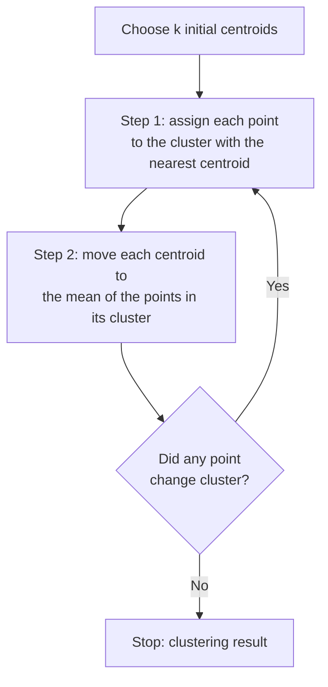

> **Learning objectives:** After this lesson, you will understand how the clustering problem differs from the classification problem, be able to run scikit-learn's `KMeans`, choose the number of clusters with elbow and silhouette, know why you must standardize before clustering, and recognize three situations where k-means gives misleading results, along with how to handle them.

## 1. Fifty thousand customers and not a single label

A retail chain has the transaction history of 50,000 customers. The marketing department wants to split them into a few groups so it can write a separate program for each: reward the ones who buy regularly, nudge the ones who have not come back in a long time, invite the first-time buyers to return. The problem: nobody has ever sat down and labeled those 50,000 rows as "loyal customer" or "customer about to churn". There is no $y$.

The previous eight lessons all had a $y$. We gave the model both the question and the answer, and it looked for a way to connect the two. From this lesson on, we drop the answer column - this is **unsupervised learning**, which Foundations · Lesson 05 introduced. With no answers there is no accuracy to grade either; the question changes from "was the prediction right" to "does this way of grouping tell us anything".

The common approach in retail is to describe each customer with three **RFM** numbers: *Recency* (how long ago the last purchase was), *Frequency* (how many purchases), *Monetary* (total spend). Those three numbers turn each customer into a point in three-dimensional space, and the question "which customers resemble which" becomes the question "which points are close to which" - exactly what Foundations · Lesson 07 built: Euclidean distance.

**Clustering** is the problem: given a bunch of points, split them into groups so that points in the same group are close to each other and points in different groups are far apart. `k-means` is the most familiar algorithm for the job.

## 2. Two steps, repeated over and over

k-means needs you to state the number of clusters $k$ in advance. It picks $k$ points as **centroids** and then repeats two steps:



The word "means" in the algorithm's name comes from step 2: the centroid is simply the mean of the points belonging to that cluster.

The thing k-means tries to shrink is called **inertia** (scikit-learn's name for it; textbooks call it *within-cluster variation*): the sum of squared distances from each point to its cluster's centroid. Every iteration makes the inertia decrease or stay the same, never increase - so the algorithm is guaranteed to stop.

Guaranteed to stop does not mean it stops at the best place. There are roughly $k^n$ ways to split $n$ points into $k$ clusters; with 300 points and 3 clusters, that number is so large that no machine could enumerate them all. *An Introduction to Statistical Learning* says it plainly: k-means only guarantees finding a **local minimum** - a reasonably good solution that depends on where it started. On the very same dataset, different starting points can give different results.

The simple remedy: run it many times from many random starting points and keep the run with the smallest inertia. That is the `n_init` parameter. On top of that, scikit-learn by default uses **k-means++**, a way of choosing the initial centroids that favors points far apart from each other instead of picking entirely at random.

```python
from sklearn.datasets import make_blobs
from sklearn.cluster import KMeans

X, y = make_blobs(n_samples=300, centers=3, cluster_std=1.0, random_state=42)
km = KMeans(n_clusters=3, n_init=10, random_state=42).fit(X)
print(km.cluster_centers_)   # coordinates of the 3 centroids
print(km.inertia_)           # sum of squared distances to the centroids
```

The three centroids found: `(-2.63; 9.04)`, `(-6.88; -6.98)`, `(4.75; 2.01)`; inertia ≈ 566.9. Because `make_blobs` also generates the true labels, we can check: k-means' split matches the three original clusters exactly.

> 🔧 **Try it now:** set `init="random", n_init=1` (pick the centroids entirely at random, run exactly once) and loop over 20 different values of `random_state`. How many times does it come out worse?
> Result: **5 out of 20 runs** give an inertia more than 5% higher than the good solution (for example, seed 0 gives inertia ≈ 5,695 instead of ≈ 567 - ten times higher). The same 20 seeds with `init="k-means++"` give ≈ 567 all 20 times. This is why you should not drop `n_init` to 1 to make things run faster.

## 3. Choosing $k$: the elbow method and the silhouette score

k-means forces you to declare $k$ before running. But $k$ is precisely the thing you want to find out.

The first idea - "pick the $k$ that gives the smallest inertia" - fails right from the start. On the 300 blobs points:

| $k$ | 1 | 2 | 3 | 4 | 10 | 50 |
|---|---|---|---|---|---|---|
| inertia | 20,402 | 5,764 | 567 | 496 | 217 | 34 |

Inertia decreases steadily and reaches 0 when $k = n$ (one cluster per point, distance to the centroid equals 0). Optimizing inertia leads you straight to a meaningless solution.

What is worth looking at is not the value but **the place where it stops dropping sharply**. From 2 to 3, inertia falls from 5,764 to 567; from 3 to 4 it only edges from 567 → 496. Plot inertia against $k$ and the curve bends sharply at $k = 3$ and then flattens out - that shape is why the method is called the **elbow** method.

```
inertia
20k |*
    | \
    |  \
 5k |   *
    |    \
    |     \
    |      *----*----*----*----*   <- nearly flat from here on
  0 +---+---+---+---+---+---+---
      1   2   3   4   5   6   7   k
              ^ elbow
```

The drawback of the elbow is that you have to judge it by eye, and many real datasets give a smooth curve with no elbow at all. A second measure can be scored numerically: **silhouette**. For each point, let $a$ be its average distance to the points in the *same cluster*, and $b$ its average distance to the points of the *nearest neighbouring cluster*; that point's silhouette is $(b-a)/\max(a,b)$, which lies in $[-1; 1]$. Close to 1 means the point sits deep inside its cluster; around 0 means it sits in the border region; negative means it is closer to the neighbouring cluster than to the one it was assigned to - a sign of misassignment. The silhouette of the whole clustering is the average over all points.

| $k$ | 2 | 3 | 4 | 5 | 6 | 7 |
|---|---|---|---|---|---|---|
| silhouette | 0.705 | **0.848** | 0.664 | 0.490 | 0.517 | 0.358 |

Silhouette peaks exactly at $k = 3$ - it has a maximum, so it can be chosen automatically rather than judged by eye like the elbow.

> ⚠️ **A small note:** both measures only speak about the *geometric shape* of the split, not about whether that split is useful for the job. Three neat customer clusters for which the marketing department cannot write three different programs still make $k = 3$ the wrong choice. In practice, business constraints ("we can only run 4 campaigns") often decide $k$ before the chart gets a say.

## 4. Without standardization, the clusters follow the column with the largest units

k-means measures by distance, and distance sums the squared differences of all the columns. Whichever column has the largest range dominates. This is exactly why Foundations · Lesson 12 and Lesson 05 of this chapter both stress standardization.

The `wine` dataset has 178 Italian wines, 13 chemical measurements, from 3 grape varieties. We hide the variety label, cluster with $k = 3$, and only then bring the label back out to compare.

```python
from sklearn.datasets import load_wine
from sklearn.preprocessing import StandardScaler
from sklearn.metrics import adjusted_rand_score

w = load_wine()
km_raw = KMeans(n_clusters=3, n_init=10, random_state=42).fit(w.data)
Xs = StandardScaler().fit_transform(w.data)
km_sc  = KMeans(n_clusters=3, n_init=10, random_state=42).fit(Xs)
print(adjusted_rand_score(w.target, km_raw.labels_))   # 0.371
print(adjusted_rand_score(w.target, km_sc.labels_))    # 0.897
```

`adjusted_rand_score` measures how well two groupings agree, equal to 1 when they match completely and around 0 when random (it does not care how the clusters are numbered). Without standardization: **0.371**. With standardization: **0.897** - a world of difference. The culprit is the `proline` column with a standard deviation ≈ 314, while `alcalinity_of_ash` is only ≈ 3.3; before standardization the distance is almost nothing but the difference in proline.

> ⚠️ **A small note:** the silhouette of the *un*-standardized version is actually higher - 0.571 versus 0.285. It sounds paradoxical, but those two numbers are measured in two different spaces, so they cannot be compared with each other. Silhouette is only for comparing values of $k$ *within the same representation of the data*. Pulling out silhouette to decide "whether to scale or not" is using the wrong tool.

## 5. Three situations where k-means gives the wrong answer

The two steps of k-means carry a built-in assumption: clusters are *round blobs of similar size*. The reason is that each cluster is represented by exactly one centroid point, and each point goes to the cluster whose centroid is nearest. The boundary between two clusters is therefore always a straight line halfway between the two centroids. All three situations below stem from that.

**Non-round clusters.** The `make_moons` dataset is two interlocking crescents:

```
        ***                         True clusters: two arcs.
      **   **                       k-means can only draw one straight
     *       **     ***             line between the two centroids, so it
    *          ** **    **          cuts across both arcs instead of
    *            *        *         separating them.
     **       **           *
       *******            *
                        **
                    ****
```

k-means gives an ARI of **0.247**. `DBSCAN(eps=0.25, min_samples=5)` gives **1.0** - a perfect separation.

**Clusters of unequal size.** Generate a wide cluster of 300 points (standard deviation 1.5) next to a narrow cluster of 30 points (0.4). k-means gives an ARI of 0.761: the small cluster it finds has 43 members, of which 13 points were pulled over from the edge of the large cluster. The large cluster "swallows" the boundary because its centroid is just a mean point and carries no information about whether the cluster is wide or narrow.

**Clusters that exist only in the imagination.** Tell k-means to find $k$ clusters and it will split the data into $k$ clusters, even when the data is a uniform cloud with no structure at all. It has no way of saying "there are no clusters here".

Two relatives that get called in when k-means is stuck:

- **Hierarchical clustering** does not need to know $k$ in advance. It starts with every point as its own cluster and progressively merges the two closest clusters, building a tree called a **dendrogram**; wherever you cut across the tree, you get the corresponding number of clusters. On `make_moons`, the `linkage="single"` version also reaches an ARI of 1.0. *An Introduction to Statistical Learning* has a memorable warning about dendrograms: two points drawn side by side horizontally are *not* thereby similar - only the height at which two branches merge says anything about similarity.
- **DBSCAN** defines clusters by density: any region dense enough is a cluster, and any isolated point is flagged as **noise** instead of being forced into a cluster. It handles clusters of arbitrary shape and decides the number of clusters on its own; in return you have to choose the radius `eps` - a parameter no easier to pick than $k$.

## 6. Reading meaning out of the clusters

The algorithm returns the numbers 0, 1, 2. What remains - who is cluster 0 - is up to you.

The familiar approach: compute the mean of each feature within each cluster and compare it with the overall mean. A cluster with low `Recency`, high `Frequency` and high `Monetary` gets named "loyal customers"; a cluster with high `Recency` but a once-high `Frequency` is "customers who are churning". This is the step that turns the result into something usable, and it needs someone who understands the business, not another algorithm.

With `wine` we have the true labels to compare against, so the result is clearly visible:

| | variety 0 | variety 1 | variety 2 |
|---|---|---|---|
| **cluster 0** | 0 | **65** | 0 |
| **cluster 1** | 0 | 3 | **48** |
| **cluster 2** | **59** | 3 | 0 |

172 out of 178 wines land in the right place, only 6 are off - and the algorithm never saw a single grape variety name. Those three varieties really do differ in chemical composition, and k-means detected that difference.

> ⚠️ **A small note:** do not read this result backwards as "clustering finds the truth". `wine` is a rare favorable case: the true groups are inherently well separated in feature space. On real customer data, the clusters usually overlap and the boundary k-means draws is a *convenient convention*, not a boundary that exists in real life. Change $k$ from 4 to 5 and you have a different set of "customer segments" - and both are equally valid.

> 🔧 **Try it now:** on the standardized `wine`, silhouette by $k$ is: $k=2$ → 0.259; $k=3$ → **0.285**; $k=4$ → 0.260; $k=5$ → 0.202; $k=6$ → 0.237. The peak lands exactly at $k = 3$, matching the 3 true grape varieties. But notice the absolute value is only ≈ 0.29, well below the 0.848 of blobs - the low silhouette here reflects clusters that genuinely overlap, not a wrong clustering.

## Lesson summary

- Clustering is a problem without labels: we do not ask "was the prediction right" but "does this split tell us anything".
- k-means repeats two steps - assign points to the nearest centroid, then move the centroid to the cluster mean - until no point changes cluster.
- The algorithm only reaches a local minimum and depends on the starting point; keep `n_init` large enough and use `init="k-means++"` (scikit-learn's default) to avoid falling into a poor solution.
- The best achievable inertia cannot increase as $k$ increases, so it cannot be used to choose $k$; use the elbow (look for where the curve bends) or silhouette (which has a maximum and can be scored numerically).
- Standardize before clustering, otherwise the column with the largest units decides for you: on `wine`, ARI goes from 0.371 to 0.897 thanks to `StandardScaler` alone.
- k-means assumes round clusters of similar size; for arc-shaped or unequal-sized clusters, use DBSCAN or hierarchical clustering.
- The final number of clusters should be a number that both fits the data and is usable for the job.

## Self-check questions

1. Why can't you choose $k$ by finding the value that minimizes inertia?
2. A point has a silhouette of −0.4. What does that say about its position, and what should you re-examine?
3. You cluster customers using three columns: age (18-70), number of orders (1-50) and total spend (100,000-500,000,000 VND). If you skip standardization, which column will mainly decide the clusters, and why?
4. You run `KMeans` twice with different `random_state` values on the same data and get two different results. Is this a programming bug or a property of the algorithm? How do you handle it?
5. Your data consists of points lying along two parallel curved roads. Why does k-means struggle to separate these two groups, and which algorithm is more suitable?
6. Your boss asks for customers to be split into exactly 5 segments, but silhouette peaks at $k = 3$. What would you present to your boss, and on what grounds?

## Further reading

**Foundational sources for this lesson:**

| Source | Which part to read |
|---|---|
| **An Introduction to Statistical Learning (ISLP)** | Chapter 12: 12.4.1 - the k-means problem, objective function (12.17), Algorithm 12.2 and Figure 12.8 illustrating each iteration, Figure 12.9 on six different local minima; 12.4.2 - hierarchical clustering, dendrograms and how to read them correctly (Figures 12.11-12.12), the linkage types; 12.4.3 - practical decisions: whether to scale, which distance to choose, how to choose $k$; 12.5.3 - lab with `KMeans` |
| **scikit-learn User Guide** | Section 2.3 *Clustering* - comparison table of k-means / hierarchical / DBSCAN by scalability and cluster shape; section 2.3.2 specifically on k-means, inertia, k-means++ and `MiniBatchKMeans`; section 2.3.11 *Clustering performance evaluation* - adjusted Rand index and silhouette |

**Additional online sources (free):**

- [2.3. Clustering - scikit-learn User Guide](https://scikit-learn.org/stable/modules/clustering.html) - the official documentation, with a table for choosing an algorithm by data characteristics.
- [Comparing different clustering algorithms on toy datasets](https://scikit-learn.org/stable/auto_examples/cluster/plot_cluster_comparison.html) - a grid of figures showing how ten algorithms handle the same arc-shaped and nested-circle datasets.
- [Selecting the number of clusters with silhouette analysis on KMeans clustering](https://scikit-learn.org/stable/auto_examples/cluster/plot_kmeans_silhouette_analysis.html) - how to read the silhouette plot for each cluster.
- [Demonstration of k-means assumptions](https://scikit-learn.org/stable/auto_examples/cluster/plot_kmeans_assumptions.html) - four situations where k-means gives unexpected results.
- [Arthur & Vassilvitskii - k-means++: The Advantages of Careful Seeding (SODA 2007)](https://theory.stanford.edu/~sergei/papers/kMeansPP-soda.pdf) - the original paper on the initialization that scikit-learn uses by default.
- [Ester, Kriegel, Sander, Xu - A Density-Based Algorithm for Discovering Clusters (KDD 1996)](https://cdn.aaai.org/KDD/1996/KDD96-037.pdf) - the original DBSCAN paper.
- [Antonius & Fitrianah - Enhancing Customer Segmentation Insights by using RFM + Discount Proportion Model with Clustering Algorithms (IJACSA, 2024)](https://thesai.org/Downloads/Volume15No3/Paper_90-Enhancing_Customer_Segmentation_Insights.pdf) - applying RFM and four k-means variants to real e-commerce transaction data, choosing the number of clusters with the elbow.

> **Next lesson:** [PCA: Reducing Dimensions and Choosing How Many Components to Keep](../pca-reducing-dimensions/) - in this lesson, a mere 13 columns were already hard to picture; the next lesson takes care of exactly that - how to squeeze hundreds of columns down to two so they can be drawn on a plane while keeping most of the information.
