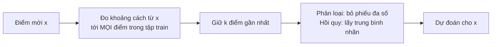

> **Mục tiêu bài học:** Sau bài này, bạn sẽ hiểu vì sao k-NN "không học gì" lúc train mà vẫn dự đoán được, tự tính tay một dự đoán k-NN, biết chọn $k$ bằng cross-validation, thấy bằng số liệu vì sao phải scale feature, nắm trực giác về lời nguyền số chiều - và biết khi nào nên, khi nào không nên dùng k-NN.

## 1. Mô hình không có gì để học

Một khách hàng mới nộp hồ sơ vay. Ở Foundations · Bài 07, bạn đã gặp cách đoán "thô" nhất có thể: tìm 5 khách cũ giống họ nhất rồi xem 5 người đó đã trả nợ ra sao. Bài này biến ý tưởng đó thành mô hình chạy thật - và câu hỏi đầu tiên là: mô hình ấy *học* cái gì?

Câu trả lời gây bất ngờ: **không học tham số nào cả**. Hồi quy tuyến tính (Bài 02) hay hồi quy logistic (Bài 03) đều có núm vặn - các hệ số - để gradient descent xoay chỉnh. **k-nearest neighbors (k-NN - k hàng xóm gần nhất)** không có núm vặn nào như vậy. Lúc gọi `fit`, nó chỉ **cất nguyên tập train vào bộ nhớ** - cùng lắm là dựng thêm một cấu trúc chỉ mục để tìm hàng xóm cho nhanh (mục 7), chứ không ước lượng một con số nào từ dữ liệu. Mọi tính toán dồn sang lúc `predict`: về mặt ý tưởng là đo khoảng cách từ điểm mới tới *mọi* điểm train (cài đặt thật có thể dựng KD-tree hay ball-tree để khỏi phải quét hết - xem mục 7), giữ $k$ điểm gần nhất, rồi bỏ phiếu (phân loại) hoặc lấy trung bình (hồi quy).



Vì thế k-NN được gọi là **lazy learning (học lười)**: trì hoãn mọi việc đến khi có câu hỏi; tài liệu scikit-learn gọi đây là phương pháp *non-generalizing* - không rút ra quy luật chung, chỉ nhớ dữ liệu. Sách *An Introduction to Statistical Learning* xếp k-NN vào nhóm **phi tham số (non-parametric)**: không giả định trước dạng hàm nên rất dẻo, đổi lại cần nhiều dữ liệu hơn.

Bạn đo được sự "lười" này. Trên bộ `adult` (39.073 dòng train), `fit` k-NN xong trong ≈ 0,13 giây - gần như toàn bộ là tiền xử lý - còn hồi quy logistic mất ≈ 1,7 giây. Đến lúc dự đoán 9.769 hồ sơ thì đảo chiều: k-NN ≈ 0,9 giây, logistic ≈ 0,06 giây (mục 6 quay lại hóa đơn này).

Không có tham số để học, nhưng k-NN vẫn có thứ để bạn chọn: hai hyperparameter (Foundations · Bài 13) - số hàng xóm $k$ và **cách đo khoảng cách**, mặc định là khoảng cách Euclid của Foundations · Bài 07.

## 2. Tính tay với 5 khách hàng

Ngân hàng có hồ sơ 5 khách cũ với hai feature: số năm đi làm và thu nhập (chục triệu đồng/tháng). Nhãn: **T** = trả đúng hạn, **N** = trễ hạn. Khách mới có hồ sơ (4, 3).

| Khách | Số năm đi làm | Thu nhập | Kết quả |
|---|---|---|---|
| 1 | 1 | 2 | T |
| 2 | 3 | 4 | T |
| 3 | 6 | 5 | N |
| 4 | 7 | 8 | N |
| 5 | 5 | 1 | N |
| **Mới** | **4** | **3** | **?** |

```
 thu nhập (chục triệu/tháng)
   8 ┤                    ● N (7, 8)
   7 ┤
   6 ┤
   5 ┤                 ● N (6, 5)
   4 ┤        ○ T (3, 4)
   3 ┤           ✕ khách mới (4, 3)
   2 ┤  ○ T (1, 2)
   1 ┤              ● N (5, 1)
     └──┬──┬──┬──┬──┬──┬──┬──  số năm đi làm
        1  2  3  4  5  6  7
```

Khoảng cách Euclid (Foundations · Bài 07): bình phương chênh lệch theo từng feature, cộng lại, lấy căn. Vì chỉ cần *xếp hạng* xa gần, so bình phương khoảng cách là đủ - khỏi lấy căn:

| Khách | Chênh lệch (năm, thu nhập) | $d^2$ | $d$ |
|---|---|---|---|
| 1 | (−3, −1) | 9 + 1 = **10** | ≈ 3,16 |
| 2 | (−1, +1) | 1 + 1 = **2** | ≈ 1,41 |
| 3 | (+2, +2) | 4 + 4 = **8** | ≈ 2,83 |
| 4 | (+3, +5) | 9 + 25 = **34** | ≈ 5,83 |
| 5 | (+1, −2) | 1 + 4 = **5** | ≈ 2,24 |

Với $k = 3$, ba hàng xóm gần nhất là khách 2 (T), khách 5 (N) và khách 3 (N). Bỏ phiếu: 2 phiếu N, 1 phiếu T → dự đoán **N**, kèm xác suất ước lượng $2/3$ cho N - đúng như sách *An Introduction to Statistical Learning* định nghĩa ở công thức (2.12): xác suất mỗi lớp bằng tỷ lệ hàng xóm thuộc lớp đó.

Giờ thử $k = 1$: chỉ nhìn khách 2 → dự đoán **T**. Cùng dữ liệu, cùng khách mới, đổi $k$ là đổi câu trả lời. Chọn $k$ vì thế là quyết định lớn nhất khi dùng k-NN.

> 🔧 **Thử ngay:** kiểm lại bằng scikit-learn:
> ```python
> import numpy as np
> from sklearn.neighbors import KNeighborsClassifier
> X = np.array([[1, 2], [3, 4], [6, 5], [7, 8], [5, 1]]); y = np.array(["T", "T", "N", "N", "N"])
> for k in (1, 3):
>     knn = KNeighborsClassifier(n_neighbors=k).fit(X, y)   # "fit" chỉ là cất X, y vào bộ nhớ
>     print(k, knn.predict([[4, 3]]), knn.predict_proba([[4, 3]]).round(2))
> ```
> Đáp số: `1 ['T'] [[0. 1.]]` và `3 ['N'] [[0.67 0.33]]` - xác suất in theo thứ tự lớp `['N', 'T']`.

## 3. Chọn k: nhỏ thì dẻo, lớn thì cứng

Foundations · Bài 13 đã nói điểm ngược đời của k-NN: **$k$ nhỏ nghĩa là capacity cao** - ranh giới ngoằn ngoèo theo từng điểm nhiễu; $k$ rất lớn thì quá cứng. Trong ví dụ mô phỏng của sách *An Introduction to Statistical Learning*, $k = 1$ sai 16,95% trên dữ liệu mới, $k = 100$ sai 19,25%, còn $k = 10$ chỉ sai 13,63%.

Ba con số đó xếp thành một chữ U: sai nhiều ở hai đầu, thấp nhất ở khoảng giữa. Hãy xem chữ U ấy trên dữ liệu thật: bộ `breast_cancer` của scikit-learn - 569 khối u vú với 30 số đo (bán kính, kết cấu, độ lõm...), nhãn ác tính (212) hoặc lành tính (357). Chia 80/20 với `random_state=42`, scale các cột (mục 4 giải thích vì sao), rồi thử nhiều $k$:

| $k$ | 1 | 3 | 11 | 51 | 201 | 455 |
|---|---|---|---|---|---|---|
| Accuracy trên **train** | 100% | 97,8% | 97,1% | 94,9% | 88,1% | 62,6% |
| Accuracy trên **test** | 93,9% | 98,2% | 97,4% | 94,7% | 93,0% | 63,2% |

Hai đầu bảng nói lên tất cả. $k = 1$ đạt **100% trên train** - hàng xóm gần nhất của mỗi điểm train là *chính nó* - nhưng chỉ 93,9% trên test: học tủ đúng nghĩa (Foundations · Bài 14). $k = 455$ bằng đúng cỡ tập train: điểm mới nào cũng nhận cùng một câu trả lời - lớp đông hơn - nên accuracy rơi về 63%, đúng tỷ lệ khối u lành.

Chọn $k$ ở giữa theo đúng quy trình của Foundations · Bài 13: thử nhiều giá trị, so trên validation - ở đây là cross-validation 5 phần với `GridSearchCV`:

```python
from sklearn.model_selection import GridSearchCV
from sklearn.pipeline import make_pipeline
from sklearn.preprocessing import StandardScaler

pipe = make_pipeline(StandardScaler(), KNeighborsClassifier())
grid = GridSearchCV(pipe, {"kneighborsclassifier__n_neighbors": [1, 3, 5, 7, 9, 11, 15, 21, 31, 51]}, cv=5)
grid.fit(X_train, y_train)            # scaler được fit lại trong TỪNG fold - không lộ đề
print(grid.best_params_, round(grid.best_score_, 3))   # {'kneighborsclassifier__n_neighbors': 7} 0.971
print(round(grid.score(X_test, y_test), 3))            # 0.974
```

Cross-validation chọn $k = 7$ (accuracy trung bình 97,1%), và trên test được 97,4%. Để ý: trong bảng trên, $k = 3$ có điểm test cao hơn (98,2%) - nhưng ta **không** được chọn $k$ theo test set (Foundations · Bài 04); với 114 mẫu test, chênh 1 điểm phần trăm chỉ là một ca đoán đúng hay sai.

> ⚠️ **Lưu ý nhỏ:** với hai lớp, nên chọn $k$ lẻ để không hòa phiếu. Tài liệu scikit-learn còn cảnh báo: nếu hàng xóm thứ $k$ và thứ $k+1$ cách đều điểm mới nhưng khác nhãn, kết quả phụ thuộc vào *thứ tự* dữ liệu train. Tùy chọn `weights="distance"` cho hàng xóm gần hơn lá phiếu nặng hơn - một cách khác để giảm hòa phiếu.

## 4. Scale trước, hỏi hàng xóm sau

Trong `breast_cancer`, cột `mean area` (diện tích) chạy từ 143,5 đến 2.501, còn `mean smoothness` (độ nhẵn) từ 0,05 đến 0,16. Foundations · Bài 12 đã cảnh báo chuyện gì xảy ra khi tính khoảng cách trên bảng như vậy: bình phương chênh lệch diện tích lên tới hàng triệu, còn chênh lệch độ nhẵn bình phương chưa tới 0,02. k-NN thực chất chỉ so diện tích; 29 cột còn lại gần như không có tiếng nói.

Đo thử chênh lệch, cùng $k = 5$ mặc định:

```python
from sklearn.datasets import load_breast_cancer
from sklearn.model_selection import train_test_split

X, y = load_breast_cancer(return_X_y=True, as_frame=True)
X_train, X_test, y_train, y_test = train_test_split(X, y, test_size=0.2, random_state=42, stratify=y)

raw = KNeighborsClassifier().fit(X_train, y_train)                                       # không scale
scaled = make_pipeline(StandardScaler(), KNeighborsClassifier()).fit(X_train, y_train)  # scale: fit trên train
print(round(raw.score(X_test, y_test), 3), round(scaled.score(X_test, y_test), 3))      # 0.912 0.956
```

Không scale: 91,2%. Có scale: 95,6%. Cross-validation 5 phần trên tập train cho cùng kết luận: 93,6% so với 96,7%. Cùng thuật toán, cùng dữ liệu - chỉ khác một bước tiền xử lý.

Nguyên tắc vàng của Foundations · Bài 12 vẫn nguyên: `StandardScaler` chỉ được **fit trên train**. Gói scaler và k-NN vào `Pipeline` là cách dễ nhất để làm đúng, kể cả khi `GridSearchCV` chia lại dữ liệu hàng chục lần.

> 🔧 **Thử ngay:** scale không phải lúc nào cũng tăng điểm. Bộ `load_digits` gồm 1.797 ảnh chữ số viết tay 8×8; 64 feature đều là độ đậm pixel từ 0 đến 16 - cùng một đơn vị. Chạy k-NN với $k = 3$ (chia 80/20, `random_state=42`, `stratify=y`) có và không có `StandardScaler`.
> Đáp số: **không scale 98,6%, có scale 96,7%**. Lý do: `StandardScaler` chia mỗi pixel cho độ lệch chuẩn của chính nó, mà 12 pixel ở rìa ảnh có độ lệch chuẩn dưới 0,5 (nhỏ nhất chỉ 0,02) - một chấm mực hiếm hoi ở rìa bỗng nặng ngang nét chữ ở giữa. Quy tắc thực dụng: feature khác đơn vị → scale; cùng đơn vị → thử cả hai trên validation.

## 5. Lời nguyền số chiều

k-NN chỉ đáng tin khi quanh điểm mới có hàng xóm *thật sự gần*. Hai feature thì dễ: 455 điểm rải trên một mặt phẳng, chỗ nào cũng có hàng xóm sát bên. Thêm chiều thì "vùng lân cận" phình ra nhanh đến khó tin.

Một phép tính nhỏ cho thấy điều đó. Giả sử dữ liệu rải đều trong một cái hộp $p$ chiều, mỗi cạnh dài 1. Muốn "vùng lân cận" quanh một điểm gom được 10% dữ liệu, mỗi cạnh của vùng đó phải dài $0{,}1^{1/p}$:

| Số chiều $p$ | 1 | 2 | 10 | 100 |
|---|---|---|---|---|
| Cạnh vùng lân cận | 0,10 | 0,32 | **0,79** | **0,98** |

Với 10 feature, để gom được 10% dữ liệu "gần nhất", bạn phải quét **79% chiều dài mỗi trục** - những điểm ấy không còn gần theo bất kỳ nghĩa nào. Với 100 feature, con số là 98%: "hàng xóm gần nhất" hầu như xa ngang điểm xa nhất. Đây là **lời nguyền số chiều (curse of dimensionality)**; phép tính trên là ví dụ kinh điển trong sách *The Elements of Statistical Learning* (mục 2.5).

Sách *An Introduction to Statistical Learning* cho thấy hậu quả (Hình 3.20): với 50 điểm train và quan hệ thật phi tuyến theo 1 biến, k-NN thắng hồi quy tuyến tính khi $p = 1$ hoặc 2; nhưng cứ thêm các biến *nhiễu* vô nghĩa, từ $p \geq 4$ hồi quy tuyến tính đã thắng, và tới $p = 20$ sai số của k-NN tăng hơn 10 lần trong khi hồi quy tuyến tính gần như không đổi. Kết luận của sách: phương pháp phi tham số cần **số quan sát lớn hơn nhiều so với số feature**.

Trong thực hành: bỏ feature vô nghĩa, giảm chiều (PCA - Bài 10), hoặc có thật nhiều dữ liệu - bộ `adult` sau one-hot có 105 cột mà k-NN vẫn đạt 84% (mục 6) nhờ 39.073 dòng train.

> 🔧 **Thử ngay:** tính `0.1 ** (1/p)` với $p$ = 2, 10, 100. Đáp số: ≈ **0,32; 0,79; 0,98**. Thử thêm $p = 1000$: ≈ 0,998 - vùng "lân cận" trùm gần hết hộp.

## 6. k-NN cho hồi quy, và hóa đơn lúc dự đoán

k-NN đoán con số cũng bằng cách đó: `KNeighborsRegressor` lấy **trung bình nhãn** của $k$ hàng xóm. Trên California Housing (Bài 01-02), hồi quy tuyến tính đạt RMSE ≈ 0,746 (đơn vị 100.000 USD), còn k-NN với $k = 15$ sau scale đạt ≈ **0,647** - thấp hơn rõ, vì giá nhà phụ thuộc phi tuyến vào vị trí và thu nhập; không scale thì RMSE ≈ 1,058, tệ hơn cả đường thẳng. Đường dự đoán của k-NN là **bậc thang** - mỗi vùng một giá trị trung bình; $k$ càng lớn bậc thang càng mịn (sách *An Introduction to Statistical Learning*, Hình 3.16).

Giờ đến hóa đơn. Bộ `adult` có 48.842 hồ sơ, cột chữ và giá trị thiếu, nên cần `ColumnTransformer` như Bài 03:

```python
from sklearn.compose import ColumnTransformer
from sklearn.impute import SimpleImputer
from sklearn.preprocessing import OneHotEncoder

num = X.select_dtypes("number").columns;  cat = X.select_dtypes(exclude="number").columns
pre = ColumnTransformer([
    ("num", make_pipeline(SimpleImputer(strategy="median"), StandardScaler()), num),
    ("cat", make_pipeline(SimpleImputer(strategy="most_frequent"),
                          OneHotEncoder(handle_unknown="ignore", sparse_output=False)), cat)])
knn = make_pipeline(pre, KNeighborsClassifier(n_neighbors=15)).fit(X_train, y_train)
print(round(knn.score(X_test, y_test), 3))   # 0.844
```

Accuracy 84,4% - kém hồi quy logistic (85,2%) một chút. Điều đáng nói là chi phí: sau tiền xử lý, bảng phình lên 105 cột; vì số cột vượt 15, scikit-learn tự chọn cách tìm **vét cạn (brute force)** - mỗi hồ sơ mới phải so với đủ 39.073 dòng train. Dự đoán 9.769 hồ sơ mất ≈ 0,9 giây so với ≈ 0,06 giây của logistic; con số này tăng theo cỡ tập train, và tập train phải nằm *nguyên* trong bộ nhớ. Với dữ liệu hàng chục triệu dòng, người ta dùng cấu trúc chỉ mục (KD-tree, ball tree - hiệu quả khi ít chiều) hoặc **tìm hàng xóm xấp xỉ (approximate nearest neighbors)** - đổi một chút chính xác lấy tốc độ.

Đó chính là cách k-NN sống trong sản phẩm thật:

- **Gợi ý sản phẩm.** Bài báo của Amazon năm 2003 (Linden, Smith, York, *IEEE Internet Computing*) mô tả *item-to-item collaborative filtering*: thay vì tìm khách hàng giống bạn, tìm **sản phẩm giống sản phẩm bạn đã mua**; bảng "sản phẩm tương tự" được tính sẵn offline, nên lúc bạn xem trang chỉ còn tra bảng.
- **Tìm ảnh giống.** Visual Search at Pinterest (KDD 2015) biến mỗi ảnh thành vector embedding (Foundations · Bài 07) rồi tìm k hàng xóm gần nhất - bằng k-NN xấp xỉ - trong kho ảnh khổng lồ.
- **Nhận diện chữ viết tay.** Trên MNIST (60.000 ảnh train, 10.000 ảnh test, 28×28 pixel), `KNeighborsClassifier` với $k = 1$ trên pixel thô sai **3,09%**, $k = 3$ sai 2,95% - không cần feature nào ngoài pixel (bài `load_digits` ở mục 4 là phiên bản thu nhỏ). Hóa đơn đi kèm: dự đoán 10.000 ảnh, mỗi ảnh phải đo khoảng cách tới đủ 60.000 ảnh train, mất ≈ 22-24 giây.

## 7. Khi nào dùng, khi nào không

Sách *An Introduction to Statistical Learning* (mục 4.5) tóm gọn: k-NN có thể vượt hồi quy logistic khi ranh giới **rất phi tuyến**, với điều kiện $n$ rất lớn và $p$ nhỏ; nó cần "rất nhiều quan sát so với số feature"; và **không cho biết feature nào quan trọng** - không có bảng hệ số để đọc.

| Nên cân nhắc k-NN khi | Nên tránh khi |
|---|---|
| Ít feature, nhiều dữ liệu, ranh giới phức tạp | Nhiều feature so với số mẫu (mục 5) |
| Cần một baseline nhanh, không giả định gì | Cần dự đoán thật nhanh hoặc phục vụ hàng triệu truy vấn (mục 6) |
| Muốn giải thích bằng ví dụ: "5 khách giống bạn nhất đã..." | Cần biết vai trò từng feature (Bài 02-03, hoặc cây ở Bài 06) |

Mô hình tiếp theo giải quyết đúng điểm yếu cuối cùng: nó nói được *vì sao*.

## Tóm tắt bài học

- k-NN không học tham số: `fit` chỉ lưu dữ liệu, `predict` đo khoảng cách tới mọi điểm train rồi bỏ phiếu/lấy trung bình - **lazy learning**, phi tham số.
- Tính tay: bình phương khoảng cách đủ để xếp hạng; với 5 khách ở mục 2, $k = 3$ cho N còn $k = 1$ cho T - $k$ quyết định câu trả lời.
- $k$ nhỏ = capacity cao ($k = 1$: 100% train, 93,9% test); $k$ quá lớn = đoán theo lớp đông. Chọn $k$ bằng cross-validation, không bằng test set.
- Scale gần như luôn cần khi feature khác đơn vị (`breast_cancer`: 91,2% → 95,6%); fit scaler trên train, gói trong Pipeline. Feature cùng đơn vị (pixel) thì scale chưa chắc đã lợi - thử cả hai trên validation.
- Lời nguyền số chiều: 10 chiều phải quét 79% mỗi trục mới gom được 10% dữ liệu; k-NN cần $n$ lớn hơn $p$ rất nhiều.
- k-NN hồi quy = trung bình hàng xóm (California Housing: RMSE 0,647 so với 0,746 của đường thẳng) nhưng dự đoán chậm và tốn bộ nhớ theo cỡ tập train; sản phẩm thật dùng bảng tính sẵn hoặc hàng xóm xấp xỉ.

## Câu hỏi tự kiểm tra

1. Vì sao k-NN "train" gần như tức thì còn dự đoán lại chậm? Điều đó ngược với hồi quy logistic ở chỗ nào?
2. Thêm khách 6 với hồ sơ (2, 3), kết quả T, vào bảng mục 2. Với $k = 3$, dự đoán cho khách mới (4, 3) có đổi không? Tính $d^2$ để trả lời.
3. Một bạn chọn $k$ bằng cách thử từng giá trị và lấy giá trị cho accuracy cao nhất trên test set. Sai ở đâu? Liên hệ Foundations · Bài 04 và Bài 14.
4. Bảng có cột "tuổi" (20-70) và "số dư tài khoản" (0-2 tỷ đồng). Không scale, k-NN thực chất đang so cái gì? Bạn đặt `StandardScaler` ở bước nào của Pipeline, và vì sao không fit nó trên toàn bộ dữ liệu?
5. Với $p = 50$ feature, cần quét bao nhiêu phần mỗi trục để gom 10% dữ liệu? (Tính $0{,}1^{1/50}$.) Điều đó nói gì về chữ "gần" trong "hàng xóm gần nhất"?
6. Một sàn thương mại điện tử cần gợi ý "sản phẩm tương tự" cho 10 triệu người dùng mỗi ngày. Nêu hai cách để k-NN vẫn dùng được ở quy mô đó.

## Đọc thêm

**Nguồn nền tảng của bài:**

| Nguồn | Đọc phần nào |
|---|---|
| **An Introduction to Statistical Learning (ISLP)** | Mục 2.2.3 - bộ phân loại Bayes và KNN, ví dụ $K$ = 1/10/100; mục 3.5 - KNN hồi quy, so với hồi quy tuyến tính, lời nguyền số chiều (Hình 3.16-3.20); mục 4.5 - khi nào KNN thắng/thua các phương pháp tuyến tính |
| **The Elements of Statistical Learning (ESL)** | Mục 2.5 - phép tính $r^{1/p}$ về "vùng lân cận" trong nhiều chiều |
| **scikit-learn User Guide** | Mục 1.6 *Nearest Neighbors* - brute force / KD tree / ball tree, tham số `weights`, `KNeighborsRegressor` |

**Nguồn online bổ sung (miễn phí):**

- [KNeighborsClassifier - scikit-learn](https://scikit-learn.org/stable/modules/generated/sklearn.neighbors.KNeighborsClassifier.html) - tham số `n_neighbors`, `weights`, `algorithm`, `metric` và cảnh báo về hòa phiếu.
- [Importance of Feature Scaling - scikit-learn](https://scikit-learn.org/stable/auto_examples/preprocessing/plot_scaling_importance.html) - ví dụ chính chủ trên bộ `wine`: ranh giới k-NN đổi hẳn sau khi scale.
- [Amazon.com Recommendations: Item-to-Item Collaborative Filtering (Linden, Smith, York, 2003)](https://dl.acm.org/doi/10.1109/MIC.2003.1167344) - bài báo ngắn, dễ đọc về gợi ý sản phẩm bằng "hàng xóm" của sản phẩm.
- [Visual Search at Pinterest (Jing và cộng sự, KDD 2015)](https://arxiv.org/abs/1505.07647) - tìm ảnh tương tự bằng k-NN trên embedding ở quy mô lớn.
- [A Simple CW-SSIM Kernel-based Nearest Neighbor Method for Handwritten Digit Classification (Wang, Fan, Wang, 2010)](https://arxiv.org/abs/1008.3951) - k-NN trên MNIST với thước đo tương đồng ảnh CW-SSIM thay cho Euclid: sai số 1,77% với $k = 5$ - đổi cách đo khoảng cách là đổi kết quả.

> **Bài tiếp theo:** [Cây quyết định: mô hình đọc được như một sơ đồ](../decision-trees-a-model-you-can-read-vi/) - k-NN trả lời "giống ai" nhưng không trả lời "vì sao" - bài sau là mô hình mà ngân hàng và bác sĩ có thể đọc như một sơ đồ câu hỏi.
