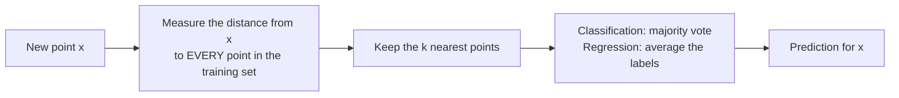

> **Learning objectives:** After this lesson, you will understand why k-NN "learns nothing" during training yet still makes predictions, compute a k-NN prediction by hand, know how to choose $k$ with cross-validation, see from the numbers why features must be scaled, grasp the intuition behind the curse of dimensionality - and know when you should, and should not, use k-NN.

## 1. A model with nothing to learn

A new customer submits a loan application. In Foundations · Lesson 07, you met the "crudest" possible way to guess: find the 5 past customers most similar to them and see how those 5 repaid. This lesson turns that idea into a real, working model - and the first question is: what does that model actually *learn*?

The answer is surprising: **it learns no parameters at all**. Linear regression (Lesson 02) and logistic regression (Lesson 03) both have knobs - the coefficients - for gradient descent to turn. **k-nearest neighbors (k-NN)** has no such knobs. When you call `fit`, it simply **stores the entire training set in memory** - at most it also builds an index structure to find neighbors faster (section 7), but it estimates no number from the data. All the computation is pushed to `predict`: conceptually, measure the distance from the new point to *every* training point (real implementations can build a KD-tree or ball tree to avoid scanning them all - see section 7), keep the $k$ nearest, then vote (classification) or average (regression).



That is why k-NN is called **lazy learning**: it postpones all the work until a question arrives; the scikit-learn documentation calls it a *non-generalizing* method - it extracts no general rule, it just remembers the data. The book *An Introduction to Statistical Learning* files k-NN under **non-parametric** methods: no functional form is assumed in advance, so it is very flexible, but in exchange it needs more data.

You can measure this "laziness". On the `adult` dataset (39,073 training rows), `fit` for k-NN finishes in ≈ 0.13 seconds - almost all of it preprocessing - while logistic regression takes ≈ 1.7 seconds. When it comes to predicting 9,769 applications, the roles flip: k-NN ≈ 0.9 seconds, logistic ≈ 0.06 seconds (section 6 returns to this bill).

There are no parameters to learn, but k-NN still leaves you something to choose: two hyperparameters (Foundations · Lesson 13) - the number of neighbors $k$ and **the way distance is measured**, by default the Euclidean distance from Foundations · Lesson 07.

## 2. By hand with 5 customers

The bank has records of 5 past customers with two features: years of employment and income (in units of ten million VND per month). Labels: **T** = paid on time, **N** = paid late. The new customer's record is (4, 3).

| Customer | Years employed | Income | Outcome |
|---|---|---|---|
| 1 | 1 | 2 | T |
| 2 | 3 | 4 | T |
| 3 | 6 | 5 | N |
| 4 | 7 | 8 | N |
| 5 | 5 | 1 | N |
| **New** | **4** | **3** | **?** |

```
 income (ten million/month)
   8 ┤                    ● N (7, 8)
   7 ┤
   6 ┤
   5 ┤                 ● N (6, 5)
   4 ┤        ○ T (3, 4)
   3 ┤           ✕ new customer (4, 3)
   2 ┤  ○ T (1, 2)
   1 ┤              ● N (5, 1)
     └──┬──┬──┬──┬──┬──┬──┬──  years employed
        1  2  3  4  5  6  7
```

Euclidean distance (Foundations · Lesson 07): square the difference on each feature, add them up, take the square root. Since we only need to *rank* near and far, comparing squared distances is enough - no square root needed:

| Customer | Difference (years, income) | $d^2$ | $d$ |
|---|---|---|---|
| 1 | (−3, −1) | 9 + 1 = **10** | ≈ 3.16 |
| 2 | (−1, +1) | 1 + 1 = **2** | ≈ 1.41 |
| 3 | (+2, +2) | 4 + 4 = **8** | ≈ 2.83 |
| 4 | (+3, +5) | 9 + 25 = **34** | ≈ 5.83 |
| 5 | (+1, −2) | 1 + 4 = **5** | ≈ 2.24 |

With $k = 3$, the three nearest neighbors are customer 2 (T), customer 5 (N) and customer 3 (N). The vote: 2 votes for N, 1 vote for T → prediction **N**, with an estimated probability of $2/3$ for N - exactly as *An Introduction to Statistical Learning* defines it in equation (2.12): the probability of each class equals the fraction of neighbors belonging to that class.

Now try $k = 1$: look only at customer 2 → prediction **T**. Same data, same new customer - change $k$ and you change the answer. Choosing $k$ is therefore the biggest decision when using k-NN.

> 🔧 **Try it now:** check it with scikit-learn:
> ```python
> import numpy as np
> from sklearn.neighbors import KNeighborsClassifier
> X = np.array([[1, 2], [3, 4], [6, 5], [7, 8], [5, 1]]); y = np.array(["T", "T", "N", "N", "N"])
> for k in (1, 3):
>     knn = KNeighborsClassifier(n_neighbors=k).fit(X, y)   # "fit" just stores X, y in memory
>     print(k, knn.predict([[4, 3]]), knn.predict_proba([[4, 3]]).round(2))
> ```
> Answer: `1 ['T'] [[0. 1.]]` and `3 ['N'] [[0.67 0.33]]` - the probabilities are printed in class order `['N', 'T']`.

## 3. Choosing k: small is flexible, large is stiff

Foundations · Lesson 13 already pointed out the counterintuitive thing about k-NN: **a small $k$ means high capacity** - a boundary that wriggles around every noisy point; a very large $k$ is too stiff. In the simulated example from *An Introduction to Statistical Learning*, $k = 1$ errs on 16.95% of new data, $k = 100$ errs on 19.25%, while $k = 10$ errs on only 13.63%.

Those three numbers form a U shape: high error at both ends, lowest somewhere in the middle. Let's look at that U on real data: scikit-learn's `breast_cancer` dataset - 569 breast tumors with 30 measurements (radius, texture, concavity...), labeled malignant (212) or benign (357). Split 80/20 with `random_state=42`, scale the columns (section 4 explains why), then try many values of $k$:

| $k$ | 1 | 3 | 11 | 51 | 201 | 455 |
|---|---|---|---|---|---|---|
| Accuracy on **train** | 100% | 97.8% | 97.1% | 94.9% | 88.1% | 62.6% |
| Accuracy on **test** | 93.9% | 98.2% | 97.4% | 94.7% | 93.0% | 63.2% |

The two ends of the table say it all. $k = 1$ reaches **100% on train** - the nearest neighbor of every training point is *itself* - but only 93.9% on test: overfitting in the strict sense (Foundations · Lesson 14). $k = 455$ equals the exact size of the training set: every new point receives the same answer - the larger class - so accuracy falls to 63%, exactly the proportion of benign tumors.

Choose $k$ in the middle following the procedure from Foundations · Lesson 13: try many values, compare on validation - here, 5-fold cross-validation with `GridSearchCV`:

```python
from sklearn.model_selection import GridSearchCV
from sklearn.pipeline import make_pipeline
from sklearn.preprocessing import StandardScaler

pipe = make_pipeline(StandardScaler(), KNeighborsClassifier())
grid = GridSearchCV(pipe, {"kneighborsclassifier__n_neighbors": [1, 3, 5, 7, 9, 11, 15, 21, 31, 51]}, cv=5)
grid.fit(X_train, y_train)            # the scaler is refit inside EACH fold - no leakage
print(grid.best_params_, round(grid.best_score_, 3))   # {'kneighborsclassifier__n_neighbors': 7} 0.971
print(round(grid.score(X_test, y_test), 3))            # 0.974
```

Cross-validation picks $k = 7$ (mean accuracy 97.1%), which scores 97.4% on test. Notice: in the table above, $k = 3$ has a higher test score (98.2%) - but we are **not** allowed to choose $k$ based on the test set (Foundations · Lesson 04); with 114 test samples, a 1-percentage-point gap is just one case guessed right or wrong.

> ⚠️ **A small note:** with two classes, choose an odd $k$ to avoid tied votes. The scikit-learn documentation adds a warning: if the $k$-th and $(k+1)$-th neighbors are equidistant from the new point but carry different labels, the result depends on the *order* of the training data. The `weights="distance"` option gives closer neighbors a heavier vote - another way to reduce ties.

## 4. Scale first, ask the neighbors second

In `breast_cancer`, the `mean area` column runs from 143.5 to 2,501, while `mean smoothness` runs from 0.05 to 0.16. Foundations · Lesson 12 already warned what happens when you compute distances on a table like that: the squared difference in area reaches the millions, while the squared difference in smoothness stays under 0.02. k-NN is effectively comparing area only; the other 29 columns have almost no say.

Let's measure the gap, with the default $k = 5$:

```python
from sklearn.datasets import load_breast_cancer
from sklearn.model_selection import train_test_split

X, y = load_breast_cancer(return_X_y=True, as_frame=True)
X_train, X_test, y_train, y_test = train_test_split(X, y, test_size=0.2, random_state=42, stratify=y)

raw = KNeighborsClassifier().fit(X_train, y_train)                                       # no scaling
scaled = make_pipeline(StandardScaler(), KNeighborsClassifier()).fit(X_train, y_train)  # scaling: fit on train
print(round(raw.score(X_test, y_test), 3), round(scaled.score(X_test, y_test), 3))      # 0.912 0.956
```

Without scaling: 91.2%. With scaling: 95.6%. 5-fold cross-validation on the training set reaches the same conclusion: 93.6% versus 96.7%. Same algorithm, same data - the only difference is one preprocessing step.

The golden rule of Foundations · Lesson 12 still stands: `StandardScaler` may only be **fit on train**. Wrapping the scaler and k-NN in a `Pipeline` is the easiest way to get this right, even when `GridSearchCV` re-splits the data dozens of times.

> 🔧 **Try it now:** scaling does not always raise the score. The `load_digits` dataset has 1,797 images of handwritten digits at 8×8; all 64 features are pixel intensities from 0 to 16 - the same unit. Run k-NN with $k = 3$ (80/20 split, `random_state=42`, `stratify=y`) with and without `StandardScaler`.
> Answer: **without scaling 98.6%, with scaling 96.7%**. The reason: `StandardScaler` divides each pixel by its own standard deviation, and 12 pixels at the edge of the image have a standard deviation below 0.5 (the smallest just 0.02) - a rare speck of ink at the edge suddenly weighs as much as a stroke in the middle. Practical rule: features in different units → scale; same unit → try both on validation.

## 5. The curse of dimensionality

k-NN is only trustworthy when the new point has neighbors that are *genuinely close*. With two features that is easy: 455 points spread over a plane, with neighbors right next door everywhere. Add dimensions and the "neighborhood" swells at an unbelievable rate.

A small calculation shows it. Suppose the data is spread uniformly inside a $p$-dimensional box with sides of length 1. For the "neighborhood" around a point to capture 10% of the data, each side of that neighborhood must have length $0.1^{1/p}$:

| Dimensions $p$ | 1 | 2 | 10 | 100 |
|---|---|---|---|---|
| Side of the neighborhood | 0.10 | 0.32 | **0.79** | **0.98** |

With 10 features, to capture the 10% "nearest" data you must sweep **79% of the length of every axis** - those points are no longer close in any sense. With 100 features, the number is 98%: the "nearest neighbor" is almost as far away as the farthest point. This is the **curse of dimensionality**; the calculation above is the classic example from *The Elements of Statistical Learning* (section 2.5).

*An Introduction to Statistical Learning* shows the consequence (Figure 3.20): with 50 training points and a true relationship that is nonlinear in 1 variable, k-NN beats linear regression when $p = 1$ or 2; but keep adding meaningless *noise* variables and from $p \geq 4$ linear regression already wins, and by $p = 20$ the error of k-NN has grown more than 10-fold while linear regression is almost unchanged. The book's conclusion: non-parametric methods need **far more observations than features**.

In practice: drop meaningless features, reduce dimensionality (PCA - Lesson 10), or have a great deal of data - the `adult` dataset has 105 columns after one-hot encoding yet k-NN still reaches 84% (section 6) thanks to 39,073 training rows.

> 🔧 **Try it now:** compute `0.1 ** (1/p)` for $p$ = 2, 10, 100. Answer: ≈ **0.32; 0.79; 0.98**. Try $p = 1000$ as well: ≈ 0.998 - the "neighborhood" covers nearly the whole box.

## 6. k-NN for regression, and the bill at prediction time

k-NN predicts numbers the same way: `KNeighborsRegressor` takes the **average label** of the $k$ neighbors. On California Housing (Lessons 01-02), linear regression reaches RMSE ≈ 0.746 (in units of 100,000 USD), while k-NN with $k = 15$ after scaling reaches ≈ **0.647** - clearly lower, because house prices depend nonlinearly on location and income; without scaling the RMSE is ≈ 1.058, worse than the straight line. The k-NN prediction curve is a **staircase** - one average value per region; the larger $k$ is, the smoother the staircase (*An Introduction to Statistical Learning*, Figure 3.16).

Now for the bill. The `adult` dataset has 48,842 records, text columns and missing values, so it needs a `ColumnTransformer` as in Lesson 03:

```python
from sklearn.compose import ColumnTransformer
from sklearn.impute import SimpleImputer
from sklearn.preprocessing import OneHotEncoder

num = X.select_dtypes("number").columns;  cat = X.select_dtypes(exclude="number").columns
pre = ColumnTransformer([
    ("num", make_pipeline(SimpleImputer(strategy="median"), StandardScaler()), num),
    ("cat", make_pipeline(SimpleImputer(strategy="most_frequent"),
                          OneHotEncoder(handle_unknown="ignore", sparse_output=False)), cat)])
knn = make_pipeline(pre, KNeighborsClassifier(n_neighbors=15)).fit(X_train, y_train)
print(round(knn.score(X_test, y_test), 3))   # 0.844
```

Accuracy 84.4% - slightly behind logistic regression (85.2%). What matters is the cost: after preprocessing, the table swells to 105 columns; since the column count exceeds 15, scikit-learn automatically chooses the **brute force** search - every new record must be compared against all 39,073 training rows. Predicting 9,769 records takes ≈ 0.9 seconds versus ≈ 0.06 seconds for logistic; this number grows with the size of the training set, and the training set must sit *in its entirety* in memory. With data in the tens of millions of rows, people use index structures (KD-tree, ball tree - effective in low dimensions) or **approximate nearest neighbors** - trading a little accuracy for speed.

That is exactly how k-NN lives inside real products:

- **Product recommendations.** Amazon's 2003 paper (Linden, Smith, York, *IEEE Internet Computing*) describes *item-to-item collaborative filtering*: instead of finding customers similar to you, find **products similar to the products you bought**; the "similar products" table is computed offline in advance, so when you view a page all that remains is a table lookup.
- **Similar-image search.** Visual Search at Pinterest (KDD 2015) turns each image into an embedding vector (Foundations · Lesson 07) and then finds the k nearest neighbors - with approximate k-NN - in an enormous image collection.
- **Handwritten digit recognition.** On MNIST (60,000 training images, 10,000 test images, 28×28 pixels), `KNeighborsClassifier` with $k = 1$ on raw pixels has an error of **3.09%**, $k = 3$ an error of 2.95% - with no features beyond the pixels (the `load_digits` exercise in section 4 is the miniature version). The accompanying bill: predicting 10,000 images, each of which must measure its distance to all 60,000 training images, takes ≈ 22-24 seconds.

## 7. When to use it, and when not to

*An Introduction to Statistical Learning* (section 4.5) sums it up: k-NN can outperform logistic regression when the boundary is **highly nonlinear**, provided $n$ is very large and $p$ is small; it needs "a great many observations relative to the number of features"; and it **does not tell you which features matter** - there is no coefficient table to read.

| Consider k-NN when | Avoid it when |
|---|---|
| Few features, lots of data, a complex boundary | Many features relative to the number of samples (section 5) |
| You need a quick baseline with no assumptions | You need very fast predictions or must serve millions of queries (section 6) |
| You want to explain by example: "the 5 customers most like you have..." | You need to know the role of each feature (Lessons 02-03, or trees in Lesson 06) |

The next model addresses exactly that last weakness: it can say *why*.

## Lesson summary

- k-NN learns no parameters: `fit` only stores the data, `predict` measures the distance to every training point and then votes/averages - **lazy learning**, non-parametric.
- By hand: squared distances are enough for ranking; with the 5 customers in section 2, $k = 3$ gives N while $k = 1$ gives T - $k$ decides the answer.
- Small $k$ = high capacity ($k = 1$: 100% train, 93.9% test); too large a $k$ = guessing the majority class. Choose $k$ with cross-validation, not with the test set.
- Scaling is almost always needed when features have different units (`breast_cancer`: 91.2% → 95.6%); fit the scaler on train, wrap it in a Pipeline. For features in the same unit (pixels) scaling may not help - try both on validation.
- Curse of dimensionality: in 10 dimensions you must sweep 79% of each axis to capture 10% of the data; k-NN needs $n$ far larger than $p$.
- k-NN regression = the average of the neighbors (California Housing: RMSE 0.647 versus 0.746 for the straight line) but prediction is slow and memory grows with the training set; real products use precomputed tables or approximate neighbors.

## Self-check questions

1. Why is k-NN "training" almost instantaneous while prediction is slow? How is that the reverse of logistic regression?
2. Add customer 6 with record (2, 3), outcome T, to the table in section 2. With $k = 3$, does the prediction for the new customer (4, 3) change? Compute $d^2$ to answer.
3. Someone chooses $k$ by trying each value and picking the one with the highest accuracy on the test set. What is wrong with that? Relate it to Foundations · Lesson 04 and Lesson 14.
4. A table has an "age" column (20-70) and an "account balance" column (0-2 billion VND). Without scaling, what is k-NN really comparing? At which step of the Pipeline do you place `StandardScaler`, and why not fit it on the whole dataset?
5. With $p = 50$ features, what fraction of each axis must you sweep to capture 10% of the data? (Compute $0.1^{1/50}$.) What does that say about the word "nearest" in "nearest neighbor"?
6. An e-commerce platform needs to suggest "similar products" to 10 million users every day. Name two ways k-NN can still be used at that scale.

## Further reading

**Foundational sources for this lesson:**

| Source | Which part to read |
|---|---|
| **An Introduction to Statistical Learning (ISLP)** | Section 2.2.3 - the Bayes classifier and KNN, the $K$ = 1/10/100 example; section 3.5 - KNN regression compared with linear regression, the curse of dimensionality (Figures 3.16-3.20); section 4.5 - when KNN wins/loses against linear methods |
| **The Elements of Statistical Learning (ESL)** | Section 2.5 - the $r^{1/p}$ calculation for "neighborhoods" in many dimensions |
| **scikit-learn User Guide** | Section 1.6 *Nearest Neighbors* - brute force / KD tree / ball tree, the `weights` parameter, `KNeighborsRegressor` |

**Additional online sources (free):**

- [KNeighborsClassifier - scikit-learn](https://scikit-learn.org/stable/modules/generated/sklearn.neighbors.KNeighborsClassifier.html) - the `n_neighbors`, `weights`, `algorithm`, `metric` parameters and the warning about tied votes.
- [Importance of Feature Scaling - scikit-learn](https://scikit-learn.org/stable/auto_examples/preprocessing/plot_scaling_importance.html) - the official example on the `wine` dataset: the k-NN boundary changes completely after scaling.
- [Amazon.com Recommendations: Item-to-Item Collaborative Filtering (Linden, Smith, York, 2003)](https://dl.acm.org/doi/10.1109/MIC.2003.1167344) - a short, readable paper on recommending products via the "neighbors" of a product.
- [Visual Search at Pinterest (Jing et al., KDD 2015)](https://arxiv.org/abs/1505.07647) - finding similar images with k-NN on embeddings at large scale.
- [A Simple CW-SSIM Kernel-based Nearest Neighbor Method for Handwritten Digit Classification (Wang, Fan, Wang, 2010)](https://arxiv.org/abs/1008.3951) - k-NN on MNIST with the CW-SSIM image-similarity measure in place of Euclidean distance: 1.77% error with $k = 5$ - change the distance measure and you change the result.

> **Next lesson:** [Decision Trees: A Model You Can Read Like a Flowchart](../decision-trees-a-model-you-can-read/) - k-NN answers "who is this like" but not "why" - the next lesson is a model that a bank or a doctor can read like a flowchart of questions.
