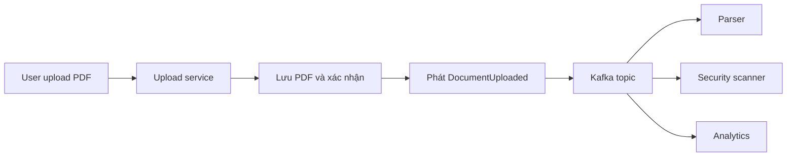
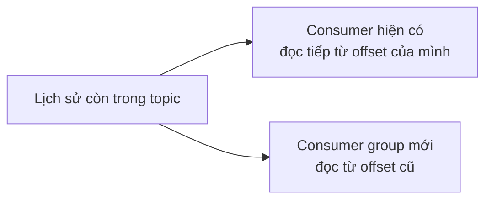
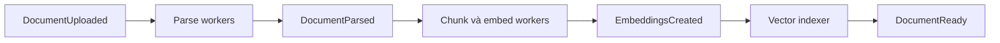
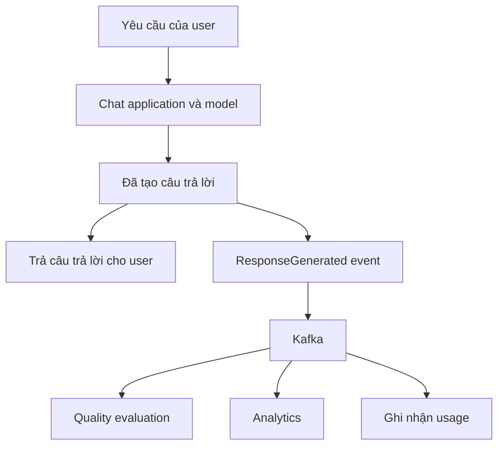
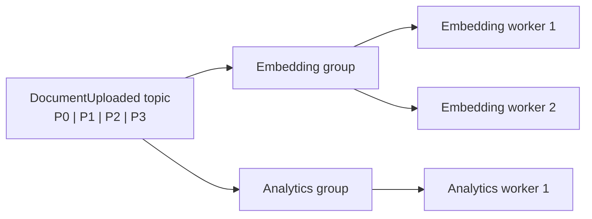
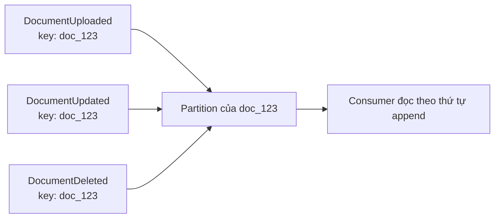
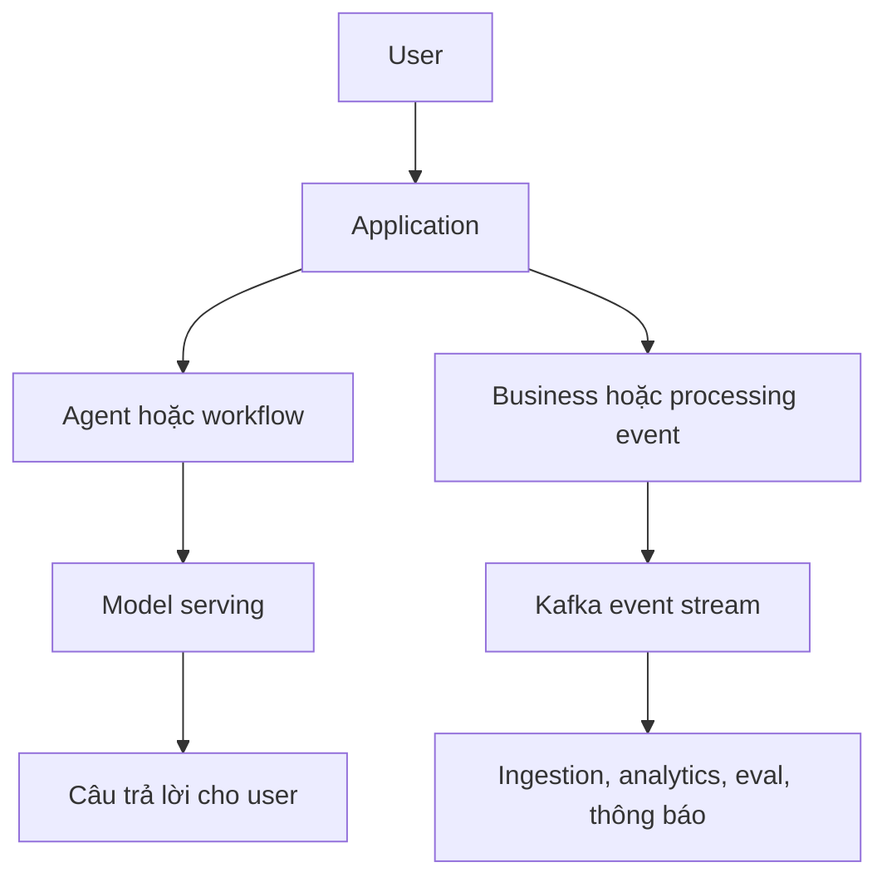

Kafka không làm model thông minh hơn. Nó trở nên hữu ích khi một sự kiện trong hệ thống cần khởi động nhiều công việc khác nhau, nhưng những công việc đó không nên bị gọi và chờ tuần tự từng bước.

Hãy tưởng tượng user upload một file PDF vào sản phẩm AI. Ở phiên bản đầu, hệ thống có thể parse, chia chunk, tạo embedding, cập nhật vector index, sinh summary rồi lưu kết quả. Flow tuần tự ấy hoàn toàn có thể chạy tốt. Nhưng khi sản phẩm lớn hơn, cùng một lần upload còn cần quét dữ liệu nhạy cảm, trích metadata, ghi analytics, tạo thumbnail và thông báo cho user.

Upload service có cần biết tên từng service phía sau không? Hay nó chỉ cần công bố một sự thật: **một tài liệu vừa được upload**?

Đó là trực giác của event-driven architecture. Kafka là một công nghệ có thể chuyển những event như vậy. Nó không phải AI model, Agent hay thứ thay thế [RAG](../production-rag-architecture-vi/).

## 1. Request hỏi để lấy kết quả; event báo điều đã xảy ra

Kiểu request-response rất tự nhiên khi ta cần kết quả ngay. Nếu người dùng hỏi "Đơn hàng của tôi đang ở đâu?", ứng dụng thường phải lấy câu trả lời từ order service trước khi phản hồi.

Event nói một điều khác. Thay vì "Embedding service, hãy xử lý PDF này ngay", producer công bố "DocumentUploaded". Consumer nào quan tâm tới sự thật đó sẽ tự quyết định phải làm gì.

| Request hoặc command | Event |
| --- | --- |
| "Kiểm tra đơn này và trả trạng thái" | "OrderStatusChanged" |
| Thường hướng tới một service cụ thể | Thông báo một sự thật cho các consumer quan tâm |
| Bên gọi có thể phải chờ kết quả | Producer thường không chờ từng consumer |

Đây là cách phân biệt hữu ích, không phải luật cứng. Command cũng có thể gửi bất đồng bộ; event cũng có thể kích hoạt một workflow rất cụ thể. [Tài liệu event-driven architecture của Google Cloud](https://docs.cloud.google.com/solutions/event-driven-architecture-pubsub) mô tả pattern thường gặp: công bố một sự thật lên topic, rồi các subscriber độc lập phản ứng.

## 2. Producer, event stream và consumer

Upload service có thể phát một event nhỏ gồm event ID, document ID, tenant ID, version và vị trí lưu file. Không cần nhét toàn bộ PDF vào event.

Upload service là **producer**. Kafka giữ event stream. Parser, scanner và analytics là **consumer**. Nếu hợp đồng dữ liệu của event đã đủ, thêm một consumer trích metadata không nhất thiết buộc upload service phải thêm lời gọi trực tiếp.

Sự tách rời đó hữu ích nhưng không phải phép màu. Producer vẫn phụ thuộc vào broker có thể truy cập, event schema còn dùng được và event phản ánh đúng dữ liệu đã lưu. Nếu metadata của file đã được ghi vào database nhưng phát event thất bại, hai hệ thống có thể lệch nhau. [Transactional outbox pattern](https://docs.aws.amazon.com/prescriptive-guidance/latest/cloud-design-patterns/transactional-outbox.html) là một cách giải bài toán ghi vào hai nơi này.

## 3. Vì sao broker thay đổi cách xử lý lỗi?

Trong chuỗi gọi HTTP trực tiếp, Service A gọi B và có thể phải đợi B làm xong. Nếu B không hoạt động, A phải retry, trả lỗi hoặc báo user rằng chưa hoàn thành.

Với event stream bền vững, producer có thể phát record mà không chờ mọi consumer xử lý. Consumer tạm thời bị down có thể tiếp tục sau, **nếu record vẫn còn trong thời gian retention và vị trí đọc được quản lý đúng**. [Phần giới thiệu Apache Kafka](https://kafka.apache.org/intro/) mô tả topic là event stream bền vững, cho nhiều subscriber đọc, với record được giữ theo cấu hình retention thay vì xóa ngay khi có một consumer đọc.

Điều này không có nghĩa lỗi downstream không còn ảnh hưởng. Consumer chậm sẽ tạo lag; storage có giới hạn; công việc user đang cần có thể vẫn chưa xong. Kafka thay đổi cách cô lập và phục hồi lỗi, không xóa bỏ lỗi.

## 4. Retention cho phép replay

Giả sử tới thứ Năm mới có Quality Analyzer, nhưng team muốn nó phân tích lại những file upload từ thứ Hai tới thứ Tư. Nếu event tương ứng vẫn còn trong topic, consumer mới có thể bắt đầu từ các offset cũ và xử lý lại.

**Replay** rất hữu ích khi cần xây lại index, sửa lỗi consumer hoặc thêm tính năng downstream mới. Nhưng đây không phải lịch sử vô hạn: record ngoài thời gian retention có thể đã bị xóa. Consumer cũng cần chọn offset bắt đầu có chủ đích và chịu được việc xử lý lại.

Đó là khác biệt đáng kể với một HTTP call dùng một lần. Event stream có thể lưu lại một phần lịch sử những gì đã xảy ra, thay vì chỉ chuyển việc rồi biến mất.

## 5. RAG ingestion có thể kết hợp fan-out với các stage có thứ tự

[Flow RAG ingestion](../production-rag-architecture-vi/) có phụ thuộc thật: phải parse tài liệu trước khi chia chunk; phải có chunk trước khi tạo embedding; phải có embedding trước khi index.

Event có thể nối các stage đó:

Mỗi stage có thể scale riêng. Nếu embedding chậm, backlog của nó có thể đợi trong lúc parser vẫn tiếp tục, miễn là retention và capacity cho phép. Nhưng quan hệ phụ thuộc không biến mất. Không nên báo user rằng tài liệu đã tìm kiếm được khi việc index chưa xong.

Một số nhánh có thể chạy độc lập: analytics có thể phản ứng ngay với upload. Một số khác cần cổng kiểm tra. Nếu security scan phải phê duyệt nội dung trước khi index, việc index **phải đợi kết quả scan**. Cho hai việc chạy song song mà không phối hợp sẽ là lỗi policy, không phải cải tiến kiến trúc.

[AWS mô tả](https://docs.aws.amazon.com/prescriptive-guidance/latest/agentic-ai-serverless/event-driven-architecture.html) file upload và kết quả model inference là những ví dụ về event có thể kích hoạt xử lý AI ở phía sau.

## 6. Fan-out đưa việc phụ ra khỏi đường user đang chờ

Câu trả lời của chatbot có thể đã sẵn sàng, trong khi analytics, quality evaluation, trích feedback và báo cáo usage vẫn chưa chạy. Nếu buộc tất cả xong trước khi trả HTTP response, user phải đợi những việc không ảnh hưởng tới câu trả lời họ cần.

Một event sau khi tạo câu trả lời có thể để các service liên quan làm việc sau:

Bản thân event vẫn cần được phát một cách đáng tin cậy, và việc đó có chi phí. Lợi ích là *xử lý downstream* không phải chặn câu trả lời của user. Kafka không làm eval chạy nhanh hơn; nó đưa một việc độc lập ra khỏi synchronous path.

Pattern này cũng hợp với job chạy lâu: nhận yêu cầu, trả job ID, phát event khởi động công việc, rồi báo user khi có completion event. Nó kém phù hợp hơn với tool call mà Agent phải lấy kết quả ngay để chọn bước tiếp theo.

## 7. Consumer group: tăng worker cho một việc hoặc thêm việc mới

Một Kafka topic có thể được đọc bởi nhiều **consumer group** độc lập. Trong cùng một group, các consumer chia nhau partition của topic; tại một thời điểm, một partition do một thành viên trong group xử lý. Group khác vẫn có thể đọc cùng topic để làm việc khác.

Thêm worker vào một group giúp chia việc cho group đó, nhưng mức song song kiểu partition thông thường bị giới hạn bởi số partition. Bốn partition không thể giữ mười thành viên cùng group bận xử lý độc lập trên chính bốn partition ấy. Một analytics group khác vẫn đọc event stream riêng. [Tài liệu thiết kế Kafka](https://kafka.apache.org/design/) giải thích cách partition được phân cho các thành viên trong group.

Như vậy có hai kiểu mở rộng: thêm worker cho *cùng một* loại việc, và thêm group cho *những* loại việc khác nhau.

## 8. Chia partition cũng là quyết định về thứ tự

Kafka giữ thứ tự record **trong từng partition**, không tạo một timeline chung có thứ tự trên toàn topic. Với cách partition theo key thông thường, các event có cùng key sẽ vào cùng partition. [Phần giới thiệu Kafka](https://kafka.apache.org/intro/) mô tả bảo đảm thứ tự theo partition này.

Nếu mọi event của document 123 cần được đọc theo thứ tự, dùng document ID làm event key là lựa chọn tự nhiên:

Cách này giữ thứ tự các record được append vào partition đó. Nó không tự sửa những event vốn đã được producer phát sai thứ tự nghiệp vụ, cũng không tạo thứ tự giữa các document ở những partition khác nhau.

Nhiều partition hơn có thể tăng parallelism, nhưng bảo đảm thứ tự vẫn chỉ nằm trong từng partition. Partition key nên phản ánh thực thể nào trong domain cần giữ quan hệ thứ tự.

## 9. Xử lý trùng và retry vẫn là trách nhiệm của bạn

Giả sử embedding consumer đã ghi vector, nhưng crash trước khi ghi nhận rằng nó xử lý xong Kafka event. Khi khởi động lại, nó có thể gặp event đó thêm lần nữa. Nếu cứ insert vô điều kiện, index có thể có vector trùng.

Consumer thực tế có thể dùng khóa ổn định như **document ID cộng version**, upsert vector và ghi trạng thái xử lý một cách nhất quán. Với hành động có tác dụng phụ như trừ tiền hoặc gửi thông báo, thiết kế idempotency phải phù hợp từng thao tác.

Kafka có các bảo đảm xử lý nâng cao trong những workflow Kafka hỗ trợ, nhưng không tự làm cho một lần ghi database bên ngoài hay gọi API trở thành "exactly once". [Tài liệu Kafka consumer](https://kafka.apache.org/42/javadoc/org/apache/kafka/clients/consumer/KafkaConsumer.html) phân biệt vị trí đã đọc hiện tại với committed offset, từ đó thấy vì sao khởi động lại có thể dẫn tới xử lý lặp.

Consumer production còn cần giới hạn retry, nơi để kiểm tra event lỗi liên tục, xử lý các phiên bản schema và theo dõi **consumer lag**. [Hướng dẫn vận hành Kafka](https://kafka.apache.org/42/operations/basic-kafka-operations/) chỉ cách xem lag theo group và partition. Event-driven architecture thay đổi cách quản lý failure; nó không xóa failure.

## 10. Agent architecture và event-driven architecture trả lời hai câu hỏi khác nhau

[Agent architecture](../agent-architecture-next-step-vi/) hỏi: **Ai chọn bước tiếp theo?** Event-driven architecture hỏi: **Các thành phần biết việc gì vừa xảy ra và phản ứng ra sao mà không phải gọi trực tiếp nhau quá chặt?**

Một Agent gọi search tool rồi cần kết quả ngay để quyết định tiếp thường hợp với request path trực tiếp. Biến từng suy nghĩ hay từng tool call thành Kafka event có thể chỉ tăng delay và complexity.

Job phân tích 5.000 hợp đồng rồi báo lại sau thì khác. Worker có thể nhận job event, phát event tiến độ hoặc hoàn thành và kích hoạt stage tiếp theo. Agent có thể là một trong những worker đó, nhưng Kafka đang phối hợp công việc bất đồng bộ, không đưa ra quyết định thay Agent.

## 11. Không phải background job nào cũng cần Kafka

Nếu chỉ có một web application và một background worker, một queue đơn giản hơn có thể đã đủ. Event-driven architecture không đồng nghĩa Kafka, và Kafka không phải công nghệ riêng của AI. Những broker và dịch vụ messaging khác nhau có trade-off khác nhau về retention, routing, ordering và công vận hành.

Kafka hấp dẫn hơn khi hệ thống cần event stream bền vững cho nhiều consumer độc lập, giữ và replay event, volume lớn và xử lý song song theo partition. [Apache Kafka tự mô tả](https://kafka.apache.org/intro/) là một distributed event-streaming platform để publish, lưu trữ và xử lý các stream.

Câu hỏi đầu tiên không nên là "Có cài Kafka không?" mà là "Các thành phần này có thực sự cần giao tiếp bất đồng bộ và giảm phụ thuộc trực tiếp không?"

## Đặt Kafka bên cạnh online path, không phải giữa mọi box

Hệ thống cũng có thể phát event *sau* một bước cụ thể của Agent hoặc model. Điểm chính không phải vị trí chính xác của một box, mà là tách việc cần cho câu trả lời trước mắt của user khỏi việc có thể chạy bất đồng bộ.

Kafka hữu ích khi các lời gọi trực tiếp khiến thành phần trong hệ thống phụ thuộc nhau quá chặt. Đổi lại, ta phải quản lý retention, ordering, duplicate, schema, lag, retry và trace đi qua nhiều service.

> Kafka không làm model thông minh hơn. Nó cho một hệ thống AI đang lớn lên cách chuyển và phản ứng với event mà không buộc mọi thành phần phải chờ nhau.

Khi công việc trải qua cả request path lẫn nhiều consumer bất đồng bộ, một câu hỏi trở nên cấp thiết: nếu câu trả lời chậm hoặc sai, nguyên nhân nằm ở model, retrieval, tool, queue hay worker bị lag? Đó là lúc observability trở thành một phần của architecture, không còn chỉ là nơi xem log sau sự cố.
