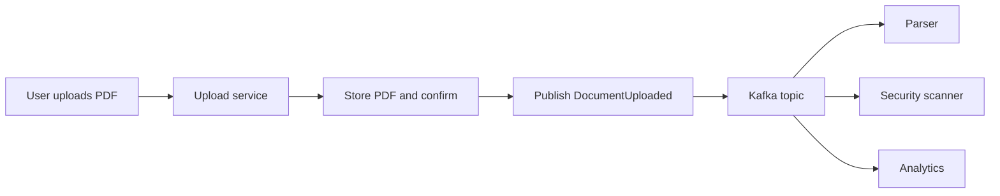
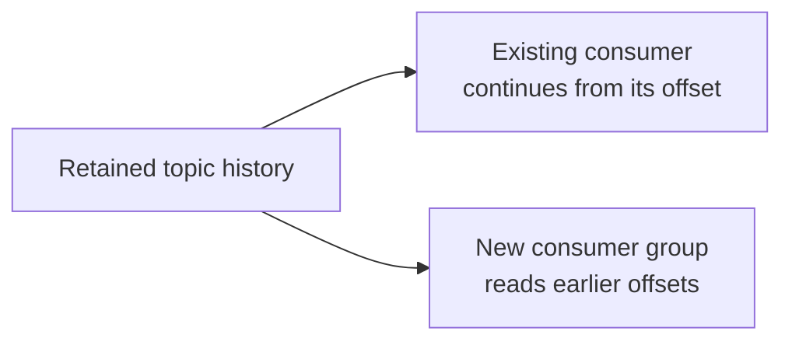
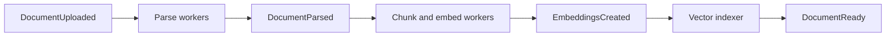
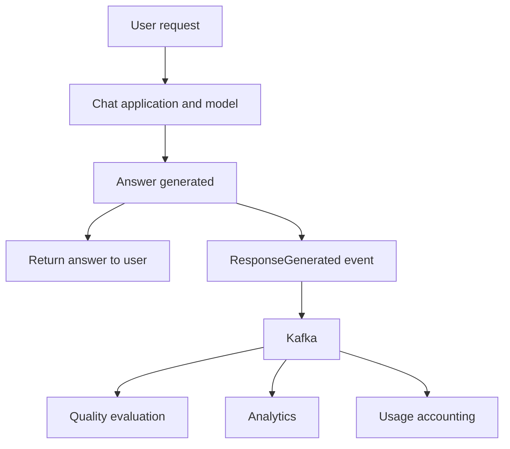
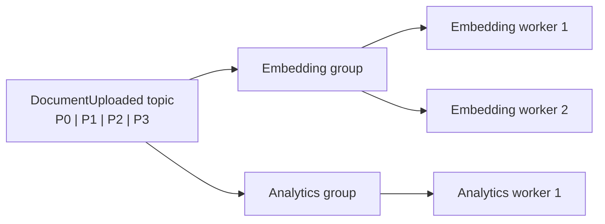
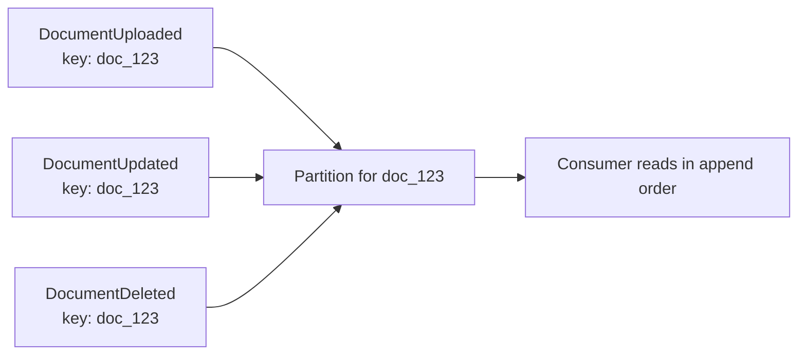
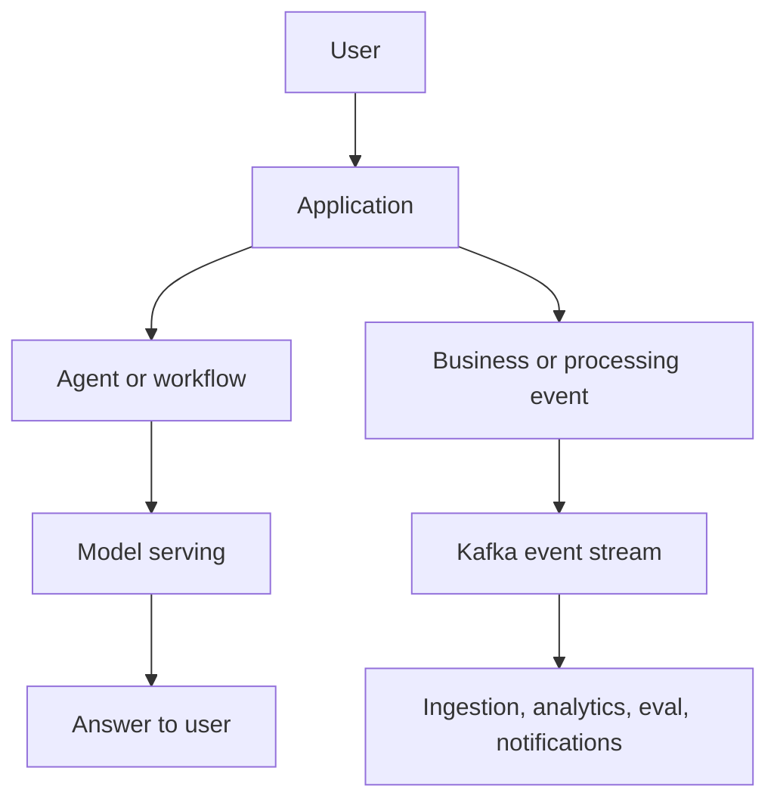

Kafka does not make a model smarter. It becomes useful when one event in a system must start several jobs, and those jobs should not all be called and awaited one by one.

Imagine a user uploading a PDF to an AI product. A small first version might parse it, split it into chunks, create embeddings, update a vector index, generate a summary, and finally store the result. That sequence can work well. But as the product grows, the same upload may also require a security scan, metadata extraction, analytics, a thumbnail, and a user notification.

Should the upload service know every downstream service by name? Or could it simply announce a fact: **a document was uploaded**?

That is the intuition behind event-driven architecture. Kafka is one technology that can carry such events. It is not an AI model, an Agent, or a replacement for [RAG](../production-rag-architecture/).

## 1. A request asks for an answer; an event announces what happened

The request-response pattern is natural when a result is needed now. If someone asks "Where is my order?", the application usually needs an answer from the order service before it can respond.

An event says something different. Instead of "Embedding service, process this PDF now", the producer publishes "DocumentUploaded". Consumers interested in that fact choose their own response.

| Request or command | Event |
| --- | --- |
| "Check this order and return its status" | "OrderStatusChanged" |
| Often addresses a specific service | Announces a fact to interested consumers |
| Caller may wait for a result | Producer usually does not wait for every consumer |

This is a useful distinction, not a rigid rule. A command can also be sent asynchronously, and an event may trigger a very specific workflow. [Google Cloud's event-driven architecture guide](https://docs.cloud.google.com/solutions/event-driven-architecture-pubsub) describes the common pattern: publish a fact to a topic, then let independent subscribers react.

## 2. Producer, event stream, and consumers

A document upload service can publish a small event carrying an event ID, document ID, tenant ID, version, and where the file can be found. It need not put the entire PDF into the event.

The upload service is the **producer**. Kafka holds the event stream. Parser, scanner, and analytics are **consumers**. Adding a new metadata consumer need not require a new direct call in the upload service, provided the event contract already contains what it needs.

That decoupling is useful, but it is not magic. The producer still depends on the broker being reachable, the event schema remaining usable, and the published event accurately reflecting stored data. If upload metadata is committed to a database but event publication fails, the two systems disagree. A [transactional outbox pattern](https://docs.aws.amazon.com/prescriptive-guidance/latest/cloud-design-patterns/transactional-outbox.html) is one way to address that dual-write problem.

## 3. Why a broker changes the failure relationship

With a direct HTTP chain, Service A calls B and may have to wait for B to finish. If B is unavailable, A must retry, fail, or tell the user it cannot complete the work.

With a durable event stream, the producer can publish a record without waiting for every consumer to process it. A consumer that is temporarily down can resume later, **if the record is still retained and its position is managed correctly**. [Apache Kafka's introduction](https://kafka.apache.org/intro/) describes topics as durable, multi-subscriber event streams whose records are kept according to retention settings rather than deleted as soon as one consumer reads them.

This does not mean downstream failure is free. A slow consumer accumulates lag; storage is finite; user-facing work may remain incomplete. Kafka changes how failure is isolated and recovered, not whether failure exists.

## 4. Retention makes replay possible

Suppose a Quality Analyzer service is introduced on Thursday and should inspect uploads from Monday through Wednesday. If the relevant events are still in the topic, a new consumer can start from earlier offsets and process them.

**Replay** is powerful for rebuilding an index, fixing a consumer bug, or introducing a new downstream feature. It is not unlimited history: records outside the configured retention window may already be gone. Consumers also need a deliberate starting offset and must tolerate reprocessing.

That is a meaningful difference from a one-off HTTP call. The event stream can serve as a bounded record of what happened, not merely a way to deliver work once.

## 5. A RAG ingestion pipeline can combine fan-out and ordered stages

The [RAG ingestion flow](../production-rag-architecture/) has real dependencies: the document must be parsed before its text is chunked; chunks must exist before embeddings can be created; embeddings must exist before they can be indexed.

Events can connect those stages:

Each stage can scale separately. If embedding slows down, its backlog can wait while parsing continues, subject to retention and capacity limits. But the dependency has not disappeared. A user should not be told the document is searchable until indexing is complete.

Some branches can run independently: analytics may react to the upload immediately. Others need a gate. If a security scan must approve content before indexing, indexing **must wait for that result**. Publishing both tasks in parallel without coordination would be a policy bug, not an architectural improvement.

[AWS describes](https://docs.aws.amazon.com/prescriptive-guidance/latest/agentic-ai-serverless/event-driven-architecture.html) file uploads and model inference results as examples of events that can start downstream AI processing.

## 6. Fan-out keeps secondary work off the user's critical path

A chatbot response may be ready while analytics, quality evaluation, feedback extraction, and usage reporting remain to be done. If every one of those tasks runs before the HTTP response is returned, the user waits for work that does not affect the answer they need.

A response-completed event can let the relevant services work later:

The event itself must still be published reliably, which has a cost. The gain is that the *downstream processing* need not block the user's answer. Kafka does not make an evaluation run faster; it moves an independent evaluation out of the synchronous path.

This pattern also works for a long-running job: accept a request, return a job ID, publish work, and notify the user when a completion event arrives. It is less suitable for a tool call whose result the Agent needs immediately to choose its next step.

## 7. Consumer groups: scale one job, or add different jobs

A Kafka topic can have multiple independent **consumer groups**. Within one group, consumers share the topic's partitions so the same partition is handled by one group member at a time. Another group can read the same topic for a different purpose.

Adding workers to one group helps distribute that group's work, but ordinary partition-based group parallelism is bounded by the partition count. Four partitions cannot keep ten members of the same group independently busy on those four partitions. A separate analytics group still sees the stream independently. [Kafka's design documentation](https://kafka.apache.org/design/) explains how partitions are assigned within groups.

This gives two different forms of scale: more workers for *one* logical job, and more groups for *different* jobs.

## 8. Partitioning is also an ordering decision

Kafka orders records **within a partition**, not across the whole topic as one global timeline. Events with the same key are routed to the same partition under the usual keyed partitioning setup. [Kafka's introduction](https://kafka.apache.org/intro/) describes this per-partition ordering guarantee.

If all events for document 123 must be read in order, using its document ID as the event key is a natural choice:

This preserves the order in which those records are appended to that partition. It does not automatically fix events published in the wrong business order, nor does it create order between different documents in different partitions.

More partitions can increase parallelism, but they narrow the ordering guarantee to each partition. The partition key should reflect the entity whose event order matters.

## 9. Duplicate processing and retries remain your responsibility

Consider an embedding consumer that writes a vector, then crashes before recording that it finished the Kafka event. On restart it may see the same event again. If it inserts another vector blindly, the index may contain duplicates.

A practical consumer can use a stable key such as **document ID plus version**, upsert the vector, and record processing state consistently. For actions with side effects, such as charging a card or sending a notification, the idempotency design must match the operation.

Kafka has advanced processing guarantees within supported Kafka workflows, but they do not automatically make an external database write or API call exactly once. [Kafka's consumer documentation](https://kafka.apache.org/42/javadoc/org/apache/kafka/clients/consumer/KafkaConsumer.html) distinguishes the consumer's current position from its committed offset, which explains why a restart can lead to reprocessing.

Production consumers also need bounded retries, a way to inspect poison events, schema-version handling, and monitoring for **consumer lag**. [Kafka's operations guide](https://kafka.apache.org/42/operations/basic-kafka-operations/) shows how lag is observed per group and partition. Event-driven architecture changes how failures are managed; it does not eliminate them.

## 10. Agent architecture and event-driven architecture answer different questions

[Agent architecture](../agent-architecture-next-step/) asks: **Who chooses the next step?** Event-driven architecture asks: **How do components learn that something happened and react without tight point-to-point coupling?**

An Agent calling a search tool and using the result immediately usually belongs in a direct request path. Turning each thought and tool call into a Kafka event may only add delay and complexity.

A job to analyze 5,000 contracts and report back later is different. Workers can consume job events, publish progress or completion events, and trigger the next stage. Agents can be among those workers, but Kafka is coordinating asynchronous work, not making their decisions for them.

## 11. Kafka is not required for every background job

For one web application and one background worker, a simpler queue may be enough. Event-driven architecture does not imply Kafka, and Kafka is not specific to AI. Other brokers and cloud messaging products offer different retention, routing, ordering, and operational trade-offs.

Kafka becomes more attractive when a system needs a durable stream that many independent consumers can read, retention and replay, high event volume, and partitioned parallel processing. [Apache Kafka describes itself](https://kafka.apache.org/intro/) as a distributed event-streaming platform for publishing, storing, and processing streams.

The useful first question is not "Should we install Kafka?" It is "Do these components actually need asynchronous, decoupled communication?"

## Put Kafka beside the online path, not everywhere inside it

A system can also publish events *after* particular Agent or model steps. The point is not the exact position of one box. The point is to separate work required for the user's immediate response from work that can run asynchronously.

Kafka is valuable when direct calls have made components too dependent on one another. It brings its own obligations: retention, ordering, duplicates, schemas, lag, retries, and tracing across services.

> Kafka does not improve model intelligence. It gives a growing AI system a way to move and react to events without making every component wait on every other component.

Once work spans a request path and several asynchronous consumers, another question becomes urgent: when an answer is late or wrong, was the cause the model, retrieval, a tool, the queue, or a lagging worker? That is why observability eventually becomes part of the architecture, not just a place to look at logs after an incident.
