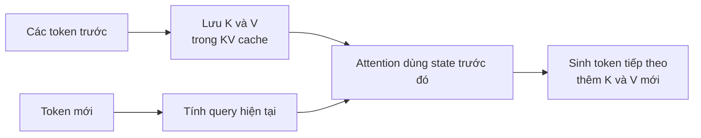
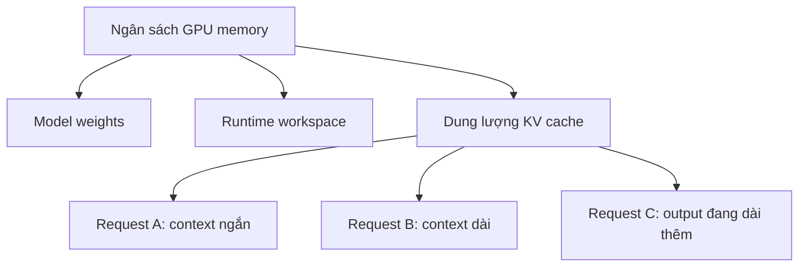
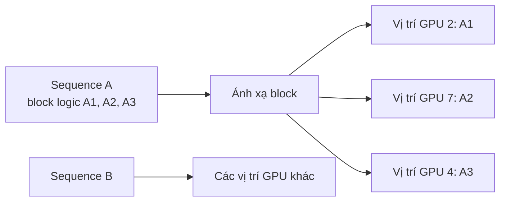
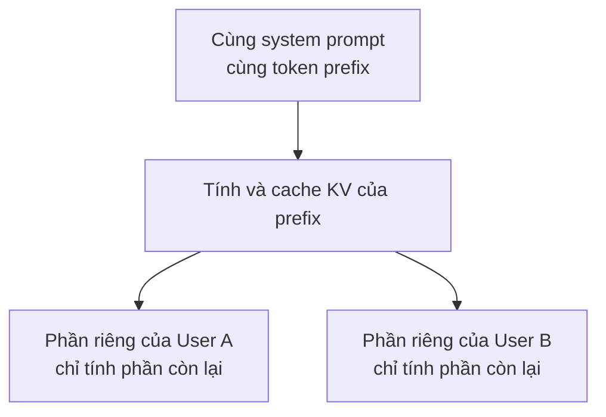
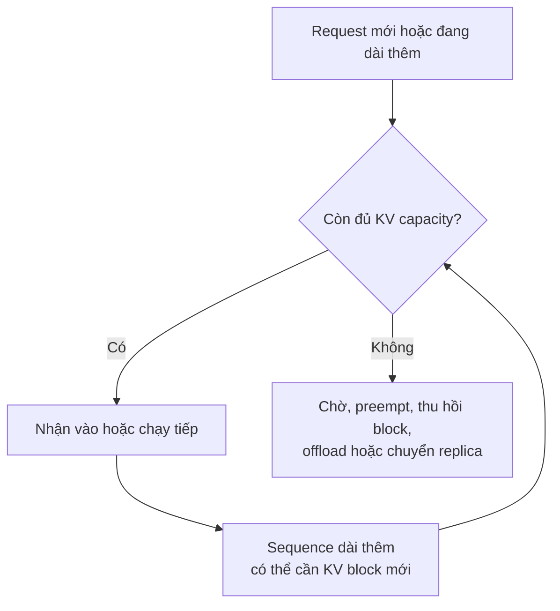
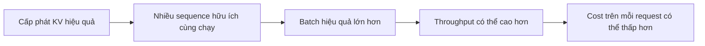

Trong [bài trước](../llm-serving-10000-requests-vi/), scheduler chia một model worker cho rất nhiều request. Nhưng từ đó xuất hiện câu hỏi khác: khi hàng trăm câu trả lời đang được sinh, model giữ thông tin cần thiết để tiếp tục từng câu ở đâu?

Giả sử model đang viết: "Hà Nội là thủ đô của..." Để chọn token tiếp theo, nó cần thông tin từ những token đã xử lý. Nếu cứ sinh thêm một token lại tính toàn bộ phần trước từ đầu thì rất lãng phí.

**KV cache** là một trong những cách chính giúp Transformer sinh văn bản theo từng token tránh việc tính lặp đó. Nó cũng là lý do capacity của serving phụ thuộc vào GPU memory, không chỉ vào sức tính toán.

## 1. Attention cần thông tin từ các token trước

Trong attention của Transformer, model tạo các representation thường được gọi là **query (Q), key (K) và value (V)**. Với token mới, query của nó dùng các key của token trước để xác định nên chú ý tới đâu, rồi kết hợp các value tương ứng. Key và value của token cũ đã được tính, nên serving engine có thể giữ lại để dùng ở các bước sau.

Cache chứa state ở những layer liên quan của model, không phải một danh sách nhỏ các từ. Kích thước chính xác phụ thuộc kiến trúc model, độ dài context, precision và cấu hình serving. [Tài liệu TensorRT-LLM của NVIDIA](https://nvidia.github.io/TensorRT-LLM/latest/features/kvcache.html) mô tả cache là nơi giữ các cặp key-value để tránh tính toán lặp khi generation.

Model vẫn phải dùng attention với context trước đó; cache giúp tránh tính lại phép chiếu K và V cũ ở mỗi bước. Nó không xóa bỏ toàn bộ chi phí attention hay làm context dài trở nên miễn phí.

## 2. KV cache không phải long-term memory của Agent

Chữ "cache" dễ gây nhầm nếu bạn đã đọc bài về [memory của Agent](../why-ai-forgets-memory-vi/). Đây là hai tầng khác nhau:

| Agent memory | KV cache |
| --- | --- |
| Thông tin cấp ứng dụng để lấy lại sau này | State tính toán tạm thời của model |
| Có thể tồn tại qua nhiều cuộc hội thoại | Thường gắn với quá trình inference đang chạy hoặc được giữ để tái sử dụng |
| Ví dụ: sở thích đã lưu của user | Ví dụ: K và V tensor của một token prefix chính xác |

Khi request kết thúc, active state có thể được giải phóng. Engine cũng có thể cố ý giữ vài block để tái sử dụng prefix, nhưng đây vẫn là tối ưu inference, không phải database lịch sử chat hay vector store.

## 3. Nhiều thứ cùng dùng GPU memory

GPU serving cần memory cho model weights, runtime buffers và KV state của những sequence đang chạy. User A có thể có context 2.000 token, còn user B có 80.000 token. Sequence dài hơn thường cần nhiều KV state hơn, dù lượng chính xác thay đổi theo thiết kế model.

Vì vậy concurrency là bài toán của cả compute lẫn **memory capacity**. Nhiều request đang chạy hơn cần nhiều state hơn; context dài hơn thường tăng cả lượng tính toán prefill lẫn kích thước state.

Model hỗ trợ context window rất lớn cho biết nó có thể nhận độ dài đó trong điều kiện phù hợp. Điều đó không đảm bảo server phục vụ hiệu quả hàng nghìn request đều dùng context tối đa cùng lúc. Trimming, summarization và retrieval vẫn có ý nghĩa vì chúng giảm cả input không liên quan lẫn serving load.

## 4. Cấp trước vùng lớn nhất cho mỗi request sẽ lãng phí

Không ai biết chắc output sẽ dài bao nhiêu. Request A có thể dừng sau 30 token, còn B sinh tới 3.000 token. Nếu engine cấp trước một vùng memory liên tục thật lớn cho từng request, nhiều phần GPU memory sẽ không được dùng. Fragmentation có thể làm vấn đề nặng thêm.

Một cách khác là chia KV state thành các block rồi cấp thêm khi sequence phát triển. Thứ tự block theo logic của request không nhất thiết trùng với vị trí vật lý trong memory.

Đây là trực giác phía sau **PagedAttention**, được giới thiệu trong [paper về vLLM](https://arxiv.org/abs/2309.06180). Ý tưởng lấy cảm hứng từ paging của virtual memory để quản lý các KV block hiệu quả hơn. Phép so sánh này hữu ích, nhưng quản lý KV trên GPU không hoàn toàn là page table của hệ điều hành.

Cấp phát tốt hơn có thể giúp nhiều sequence cùng tồn tại và tạo batch hữu ích lớn hơn. Nó không tạo thêm memory từ hư không, và lợi ích thực tế tùy workload.

## 5. Tái sử dụng prefix chung giúp tránh prefill lặp lại

Giả sử mọi request của chatbot hỗ trợ khách hàng đều bắt đầu bằng cùng một bộ system instruction và policy dài, sau đó mới đến câu hỏi khác nhau của từng user. Nếu không tái sử dụng, engine có thể phải xử lý lại phần chung cho mỗi request.

**Prefix caching** cho phép request đến sau dùng lại những KV block đã tính cho một *token prefix giống hệt*:

[Hướng dẫn automatic prefix caching của vLLM](https://docs.vllm.ai/en/latest/design/prefix_caching/) mô tả cách tái sử dụng block cho những prefix khớp. [NVIDIA cũng có tài liệu về KV reuse](https://nvidia.github.io/TensorRT-LLM/latest/features/kvcache.html) giữa các request. Những block phù hợp vẫn phải còn trong cache khi request sau tới; không phải lúc nào cũng reuse được.

Đây không phải semantic caching cho câu trả lời cuối. Hai prompt có *ý nghĩa gần nhau* không nhất thiết có token prefix giống nhau. Prefix reuse chủ yếu tiết kiệm computation xử lý prompt chung, chứ không tự động làm việc sinh mọi output token nhanh gấp đôi.

Hạ tầng dùng chung còn phải xét quyền riêng tư. vLLM có mô tả cơ chế cache salting tùy chọn để tách việc reuse giữa các nhóm tin cậy. Không nên để tenant này có thể suy đoán context riêng của tenant khác qua hành vi cache.

## 6. Khi KV capacity hết chỗ thì sao?

Giả sử worker đang chạy nhiều sequence và một request mới đến. Ta không thể thêm KV state vô hạn vào memory pool đã đầy. Tùy engine và cấu hình, request có thể phải đợi, một request đang chạy bị preempt, block có thể tái sử dụng được thu hồi, state được offload, hoặc một replica khác nhận việc.

Không phải engine nào cũng hỗ trợ mọi lựa chọn, và cách nào cũng có giá. Chờ làm latency tăng. Offload phải chuyển dữ liệu. Preemption có thể buộc hệ thống làm lại một phần công việc. Thêm replica tốn phần cứng.

Vì vậy scheduler và KV-cache manager liên quan chặt chẽ. [Cấu hình scheduler của vLLM](https://docs.vllm.ai/en/stable/configuration/engine_args/) có nói rõ việc kiểm tra KV capacity trước khi nhận một request dài, để tránh nhận quá nhiều rồi phải preempt liên tục.

## 7. Quản lý KV ảnh hưởng concurrency và chi phí

Hai server chạy cùng model trên GPU tương đương vẫn có thể phục vụ số request đồng thời khác nhau vì batching, kernel, precision và cách quản lý memory. KV allocation là một phần của cả hệ thống đó.

Mỗi mũi tên đều có điều kiện. Nếu workload không bị giới hạn bởi memory, hoặc batch lớn hơn làm hỏng mục tiêu latency, chỉ cải thiện memory chưa chắc giúp sản phẩm tốt hơn. Hãy đo concurrency, TTFT, inter-token latency, throughput và GPU memory cùng nhau.

Cách nhớ ngắn gọn là:

> **KV cache tiết kiệm phép tính lặp, nhưng chiếm một phần memory hữu hạn khi request đang chạy.**

Vì vậy nó vừa là tối ưu hiệu năng, vừa là bài toán quản lý tài nguyên. Ở phía application, flow trông như "user, model, answer". Trong serving engine, scheduler, token state, KV blocks và GPU memory mới quyết định có thể chia model hiệu quả cho bao nhiêu người.

